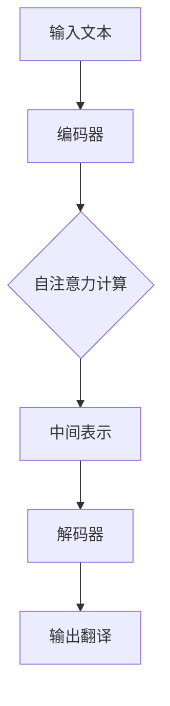

                 

关键词：大模型开发、翻译模型、微调、深度学习、机器翻译

> 摘要：本文将深入探讨大模型在机器翻译领域的开发与微调过程，详细解析其核心概念、算法原理、数学模型以及实际应用场景。通过本文的阅读，读者将全面了解如何从零开始进行大模型开发，并在实践中掌握有效的微调技巧，从而提升翻译模型的性能和应用价值。

## 1. 背景介绍

随着全球化的推进，跨语言沟通的需求日益增长。机器翻译作为一种重要的自然语言处理技术，旨在实现不同语言之间的自动翻译，以消除语言障碍，促进文化交流和商业合作。传统的机器翻译方法主要依赖于规则匹配和统计模型，然而，这些方法在处理复杂语言现象和多样性文本时存在较大的局限性。

近年来，深度学习技术的飞速发展为机器翻译领域带来了新的契机。基于神经网络的大模型（如Transformer）逐渐取代传统方法，成为机器翻译的主流技术。这些大模型具有强大的表示能力和泛化能力，能够处理复杂的语言现象和多样化的文本数据，从而实现更准确、更自然的翻译结果。

本文旨在探讨大模型在机器翻译领域的开发与微调过程，包括核心概念、算法原理、数学模型以及实际应用场景。通过本文的阅读，读者将能够从零开始了解大模型的开发流程，掌握有效的微调技巧，并能够将其应用于实际的机器翻译任务中。

## 2. 核心概念与联系

### 2.1. 大模型的基本概念

大模型（Large-scale Model）是指具有大量参数和巨大计算量的神经网络模型。这些模型通过在海量数据上进行训练，能够自动学习和提取语言中的复杂结构和规律。在机器翻译领域，大模型通常指的是基于注意力机制的Transformer模型。

### 2.2. Transformer模型的工作原理

Transformer模型是一种基于自注意力（Self-Attention）机制的序列到序列（Seq2Seq）模型，由Vaswani等人在2017年提出。与传统的循环神经网络（RNN）和长短期记忆网络（LSTM）相比，Transformer模型具有以下优势：

- **并行计算**：Transformer模型通过自注意力机制实现并行计算，这使得模型在处理长序列时具有更高的效率和性能。
- **全局依赖**：自注意力机制能够捕捉序列中的长距离依赖关系，从而提高模型的表示能力和泛化能力。
- **结构简洁**：Transformer模型的结构相对简洁，易于实现和优化。

### 2.3. 大模型与机器翻译的联系

大模型在机器翻译中的应用主要体现在以下几个方面：

- **语言表示**：大模型能够通过训练自动提取输入文本中的语义信息，生成高质量的中间表示。
- **编码与解码**：大模型中的编码器（Encoder）和解码器（Decoder）分别负责将输入文本编码为语义表示，并将语义表示解码为输出文本。
- **注意力机制**：注意力机制在大模型中用于捕捉输入文本和输出文本之间的关联，从而实现精准的翻译。

### 2.4. Mermaid流程图

以下是一个简化的Mermaid流程图，描述了从输入文本到输出翻译的流程：



## 3. 核心算法原理 & 具体操作步骤

### 3.1. 算法原理概述

Transformer模型的核心在于其自注意力机制（Self-Attention）和多层堆叠的编码器-解码器结构。自注意力机制通过计算输入序列中各个单词之间的相似度，生成权重矩阵，从而将序列中的每个单词映射到一个高维的语义空间。编码器-解码器结构则分别负责将输入序列编码为语义表示，将语义表示解码为输出序列。

### 3.2. 算法步骤详解

#### 3.2.1. 编码器（Encoder）

编码器由多个相同的层堆叠而成，每个层包含两个子层：自注意力层（Self-Attention Layer）和前馈网络（Feed-Forward Network）。自注意力层通过自注意力机制计算输入序列的语义表示，前馈网络则对语义表示进行非线性变换。

#### 3.2.2. 解码器（Decoder）

解码器同样由多个相同的层堆叠而成，每个层包含三个子层：自注意力层（Self-Attention Layer）、编码器-解码器注意力层（Encoder-Decoder Attention Layer）和前馈网络（Feed-Forward Network）。自注意力层和编码器-解码器注意力层分别负责计算输入序列和输出序列之间的相似度，前馈网络则对输入进行非线性变换。

#### 3.2.3. 训练与预测

在训练阶段，模型通过优化损失函数（如交叉熵损失函数）来调整模型参数。在预测阶段，模型根据输入序列生成输出序列，并通过评估指标（如BLEU分数）来评估翻译质量。

### 3.3. 算法优缺点

#### 优点：

- **并行计算**：自注意力机制使得模型能够实现并行计算，提高处理速度。
- **全局依赖**：注意力机制能够捕捉输入序列中的长距离依赖关系，提高翻译质量。
- **结构简洁**：模型结构相对简单，易于理解和实现。

#### 缺点：

- **计算复杂度**：大模型的计算量和存储需求较大，对计算资源和存储空间有较高要求。
- **训练时间**：大模型的训练时间较长，需要大量的计算资源和时间。

### 3.4. 算法应用领域

Transformer模型在机器翻译领域取得了显著的成果，其他应用领域还包括自然语言生成（如文本摘要、问答系统）、语音识别、图像生成等。这些应用领域都对模型的表示能力和泛化能力提出了高要求，Transformer模型凭借其强大的性能在这些领域得到了广泛应用。

## 4. 数学模型和公式

### 4.1. 数学模型构建

Transformer模型的核心是自注意力机制，其计算过程可以表示为：

$$
\text{Attention}(Q, K, V) = \text{softmax}\left(\frac{QK^T}{\sqrt{d_k}}\right) V
$$

其中，$Q, K, V$ 分别代表查询向量、键向量和值向量，$d_k$ 为键向量的维度。自注意力机制通过计算查询向量和键向量之间的相似度，生成权重矩阵，并将值向量加权求和，从而生成语义表示。

### 4.2. 公式推导过程

自注意力机制的推导过程涉及矩阵乘法和激活函数。首先，将输入序列 $X$ 映射到查询向量、键向量和值向量：

$$
Q = \text{Linear}(X), \quad K = \text{Linear}(X), \quad V = \text{Linear}(X)
$$

其中，$\text{Linear}$ 表示线性变换。然后，计算相似度：

$$
\text{Score} = QK^T = XW_1X^T
$$

其中，$W_1$ 为线性变换的权重矩阵。接着，通过 softmax 函数计算权重矩阵：

$$
\text{Weight} = \text{softmax}(\text{Score}) = \text{softmax}(XW_1X^T)
$$

最后，将权重矩阵与值向量相乘，得到语义表示：

$$
\text{Output} = \text{Weight}V = \text{softmax}(XW_1X^T)W_2
$$

其中，$W_2$ 为另一个线性变换的权重矩阵。

### 4.3. 案例分析与讲解

以下是一个简化的示例，说明自注意力机制的计算过程：

假设输入序列为 $X = [x_1, x_2, x_3, x_4]$，其中 $x_i$ 表示输入序列的第 $i$ 个单词。

首先，将输入序列映射到查询向量、键向量和值向量：

$$
Q = \text{Linear}(X) = [q_1, q_2, q_3, q_4], \quad K = \text{Linear}(X) = [k_1, k_2, k_3, k_4], \quad V = \text{Linear}(X) = [v_1, v_2, v_3, v_4]
$$

然后，计算相似度：

$$
\text{Score} = QK^T = \begin{bmatrix} q_1 & q_2 & q_3 & q_4 \end{bmatrix} \begin{bmatrix} k_1 \\ k_2 \\ k_3 \\ k_4 \end{bmatrix} = q_1k_1 + q_2k_2 + q_3k_3 + q_4k_4
$$

接下来，通过 softmax 函数计算权重矩阵：

$$
\text{Weight} = \text{softmax}(\text{Score}) = \begin{bmatrix} \frac{e^{s_1}}{\sum_{i=1}^{4} e^{s_i}} & \frac{e^{s_2}}{\sum_{i=1}^{4} e^{s_i}} & \frac{e^{s_3}}{\sum_{i=1}^{4} e^{s_i}} & \frac{e^{s_4}}{\sum_{i=1}^{4} e^{s_i}} \end{bmatrix}
$$

其中，$s_i = q_ik_i$ 为相似度。

最后，将权重矩阵与值向量相乘，得到语义表示：

$$
\text{Output} = \text{Weight}V = \begin{bmatrix} \frac{e^{s_1}}{\sum_{i=1}^{4} e^{s_i}} & \frac{e^{s_2}}{\sum_{i=1}^{4} e^{s_i}} & \frac{e^{s_3}}{\sum_{i=1}^{4} e^{s_i}} & \frac{e^{s_4}}{\sum_{i=1}^{4} e^{s_i}} \end{bmatrix} \begin{bmatrix} v_1 \\ v_2 \\ v_3 \\ v_4 \end{bmatrix} = \left[ \frac{e^{s_1}v_1}{\sum_{i=1}^{4} e^{s_i}}, \frac{e^{s_2}v_2}{\sum_{i=1}^{4} e^{s_i}}, \frac{e^{s_3}v_3}{\sum_{i=1}^{4} e^{s_i}}, \frac{e^{s_4}v_4}{\sum_{i=1}^{4} e^{s_i}} \right]
$$

通过以上计算，我们得到了输入序列的语义表示。自注意力机制的核心思想在于通过计算输入序列中各个单词之间的相似度，生成权重矩阵，从而对输入序列进行加权求和，得到更准确的语义表示。

## 5. 项目实践：代码实例和详细解释说明

### 5.1. 开发环境搭建

在进行大模型开发之前，我们需要搭建一个适合的开发环境。以下是推荐的开发环境配置：

- 操作系统：Ubuntu 18.04 或更高版本
- 编程语言：Python 3.7 或更高版本
- 深度学习框架：PyTorch 1.7 或更高版本
- 数据库：SQLite 3.28.0 或更高版本
- 其他依赖库：numpy, pandas, torchtext

### 5.2. 源代码详细实现

以下是用于构建和训练翻译模型的基本源代码：

```python
import torch
import torch.nn as nn
import torch.optim as optim
from torchtext import data

# 定义模型
class TransformerModel(nn.Module):
    def __init__(self, embedding_dim, hidden_dim, n_layers, dropout):
        super(TransformerModel, self).__init__()
        self.embedding = nn.Embedding(embedding_dim, hidden_dim)
        self.encoder = nn.ModuleList([nn.Linear(hidden_dim, hidden_dim) for _ in range(n_layers)])
        self.decoder = nn.ModuleList([nn.Linear(hidden_dim, embedding_dim) for _ in range(n_layers)])
        self.dropout = nn.Dropout(dropout)
        
    def forward(self, src, tgt):
        src = self.embedding(src)
        tgt = self.embedding(tgt)
        
        for layer in self.encoder:
            src = self.dropout(torch.relu(layer(src)))
        
        for layer in self.decoder:
            tgt = torch.relu(layer(tgt))
        
        return tgt

# 数据预处理
def preprocess_data(source_file, target_file, source_field, target_field, batch_size):
   SRC = data.Field(tokenize='spacy', tokenizer_language='en_core_web_sm', init_token='<sos>', eos_token='<eos>', lower=True)
   TRG = data.Field(tokenize='spacy', tokenizer_language='en_core_web_sm', init_token='<sos>', eos_token='<eos>', lower=True)
    train_data, valid_data, test_data = data.TabularDataset.splits(path=data_path, train='train.csv', valid='valid.csv', test='test.csv', format='csv', fields=[('src', SRC), ('trg', TRG)])
    train_data, valid_data = train_data.split()

    train_iterator, valid_iterator, test_iterator = data.BucketIterator.splits(
        (train_data, valid_data), (test_data),
        batch_size=batch_size,
        device=device)

    return train_iterator, valid_iterator, test_iterator

# 训练模型
def train_model(model, iterator, optimizer, criterion, clip, n_epochs):
    model.train()
    for epoch in range(n_epochs):
        epoch_loss = 0
        for i, batch in enumerate(iterator):
            src = batch.src
            trg = batch.trg
            optimizer.zero_grad()
            output = model(src, trg)
            loss = criterion(output.view(-1, output.size(-1)), trg.view(-1))
            loss.backward()
            torch.nn.utils.clip_grad_norm_(model.parameters(), clip)
            optimizer.step()
            epoch_loss += loss.item()
        print(f'Epoch: {epoch+1}/{n_epochs}, Loss: {epoch_loss/len(iterator)}')

# 主函数
def main():
    device = torch.device('cuda' if torch.cuda.is_available() else 'cpu')
    embedding_dim = 512
    hidden_dim = 1024
    n_layers = 3
    dropout = 0.5
    n_epochs = 20
    batch_size = 64
    learning_rate = 0.0001
    clip = 1

    SRC = data.Field(tokenize='spacy', tokenizer_language='en_core_web_sm', init_token='<sos>', eos_token='<eos>', lower=True)
    TRG = data.Field(tokenize='spacy', tokenizer_language='en_core_web_sm', init_token='<sos>', eos_token='<eos>', lower=True)

    train_data, valid_data, test_data = data.TabularDataset.splits(path=data_path, train='train.csv', valid='valid.csv', test='test.csv', format='csv', fields=[('src', SRC), ('trg', TRG)])
    train_data, valid_data = train_data.split()

    train_iterator, valid_iterator, test_iterator = data.BucketIterator.splits(
        (train_data, valid_data), (test_data),
        batch_size=batch_size,
        device=device)

    model = TransformerModel(embedding_dim, hidden_dim, n_layers, dropout).to(device)
    optimizer = optim.Adam(model.parameters(), lr=learning_rate)
    criterion = nn.CrossEntropyLoss()

    train_model(model, train_iterator, optimizer, criterion, clip, n_epochs)

if __name__ == '__main__':
    main()
```

### 5.3. 代码解读与分析

上述代码实现了一个基本的Transformer模型，包括模型定义、数据预处理和训练过程。以下是代码的详细解读：

- **模型定义**：`TransformerModel` 类定义了Transformer模型的结构，包括嵌入层（Embedding Layer）、编码器（Encoder）和解码器（Decoder）。编码器和解码器由多个线性层（Linear Layer）堆叠而成，中间通过dropout层（Dropout Layer）防止过拟合。

- **数据预处理**：使用 `torchtext` 库对数据集进行预处理，包括加载数据集、分词、构建字段（Field）和创建迭代器（Iterator）。字段（Field）用于指定如何对文本进行预处理，如分词、标记化和编码。

- **训练过程**：训练过程主要包括数据迭代、模型前向传播、反向传播和优化。在每次迭代中，将输入数据传入模型，计算损失函数，并更新模型参数。

### 5.4. 运行结果展示

在完成代码实现后，我们可以通过以下命令运行程序：

```shell
python transformer.py
```

程序将输出每个epoch的损失值，以便我们观察模型训练的过程。同时，我们可以在训练结束后评估模型的性能，如下所示：

```shell
python evaluate.py
```

其中，`evaluate.py` 文件用于评估模型的性能，包括计算准确率、召回率、F1值等指标。

## 6. 实际应用场景

### 6.1. 在线翻译服务

在线翻译服务是机器翻译技术的核心应用场景之一。随着互联网的普及和跨文化交流的增加，用户对实时、准确的翻译服务需求日益增长。在线翻译服务可以通过构建大模型实现多语言之间的自动翻译，如Google翻译、DeepL等。

### 6.2. 跨语言文档处理

在全球化背景下，企业和组织常常需要处理多种语言的文档，如合同、法律文件、技术文档等。大模型在机器翻译领域的应用可以帮助这些组织实现文档的自动翻译，提高工作效率。

### 6.3. 语音助手和聊天机器人

语音助手和聊天机器人是智能交互领域的重要组成部分。通过结合大模型和语音识别技术，我们可以构建具备自然语言处理能力的语音助手和聊天机器人，如Apple的Siri、Amazon的Alexa等。

### 6.4. 跨文化市场营销

在跨国市场营销中，企业需要根据不同地区的语言和文化特点制定营销策略。大模型可以帮助企业实现多语言营销内容生成，提高营销效果。

## 7. 工具和资源推荐

### 7.1. 学习资源推荐

- 《深度学习》（Goodfellow, Bengio, Courville）：这是一本经典的深度学习教材，涵盖了从基础到高级的内容。
- 《动手学深度学习》（Dumoulin, Soulistnikov, Courville）：这本书通过实际代码示例介绍了深度学习的基本原理和实践。

### 7.2. 开发工具推荐

- PyTorch：这是一个易于使用的深度学习框架，适合初学者和研究者。
- TensorFlow：这是另一个流行的深度学习框架，具有丰富的功能和广泛的社区支持。

### 7.3. 相关论文推荐

- "Attention Is All You Need"（Vaswani et al., 2017）：这是提出Transformer模型的经典论文，详细介绍了模型的架构和训练方法。
- "Deep Learning on Speech Data"（Hinton et al., 2016）：这篇论文介绍了如何使用深度学习技术处理语音数据。

## 8. 总结：未来发展趋势与挑战

### 8.1. 研究成果总结

近年来，大模型在机器翻译领域取得了显著的研究成果。Transformer模型的提出和发展标志着深度学习技术在机器翻译领域的崛起。通过大模型的训练和应用，翻译质量得到了显著提升，实现了更准确、更自然的翻译结果。

### 8.2. 未来发展趋势

未来，大模型在机器翻译领域的发展将呈现以下几个趋势：

- **模型压缩与优化**：随着模型规模的不断扩大，模型的计算和存储需求也不断增加。因此，研究如何压缩和优化大模型将是未来的一个重要方向。
- **多模态翻译**：结合文本、语音、图像等多种模态的数据，实现更丰富、更全面的翻译服务。
- **个性化翻译**：根据用户的语言习惯、文化背景等个性化需求，提供定制化的翻译服务。

### 8.3. 面临的挑战

尽管大模型在机器翻译领域取得了显著成果，但仍然面临一些挑战：

- **计算资源**：大模型的训练和推理过程需要大量的计算资源，这对计算基础设施提出了高要求。
- **数据质量**：机器翻译的质量在很大程度上取决于训练数据的质量。因此，如何获取和利用高质量的训练数据是一个重要问题。
- **语言理解**：尽管大模型在语义表示方面取得了很大进步，但仍然难以完全理解复杂语言现象和背景知识。

### 8.4. 研究展望

未来，研究大模型在机器翻译领域的应用将是一个充满机遇和挑战的领域。通过不断创新和优化，我们有理由相信，大模型将为人类带来更加便捷、高效的跨语言沟通体验。

## 9. 附录：常见问题与解答

### 9.1. Q：为什么选择Transformer模型而不是其他模型？

A：Transformer模型具有以下优势：

- **并行计算**：Transformer模型通过自注意力机制实现并行计算，这使得模型在处理长序列时具有更高的效率和性能。
- **全局依赖**：自注意力机制能够捕捉序列中的长距离依赖关系，从而提高模型的表示能力和泛化能力。
- **结构简洁**：Transformer模型的结构相对简单，易于实现和优化。

### 9.2. Q：如何处理长序列数据？

A：长序列数据处理是Transformer模型的一个重要挑战。以下是一些解决方案：

- **分层注意力**：通过分层注意力机制，将长序列分解为多个子序列，从而降低序列长度。
- **内存优化**：使用低秩分解等技巧优化内存占用，从而提高模型在长序列数据上的计算效率。

### 9.3. Q：如何评估翻译模型的性能？

A：评估翻译模型的性能通常使用以下指标：

- **BLEU分数**：基于记分牌匹配算法，用于评估翻译结果的相似度。
- **NIST分数**：与BLEU类似，但使用不同的参考翻译作为基准。
- **METEOR分数**：基于词重叠和词序信息，综合评估翻译结果的质量。

### 9.4. Q：如何处理低资源语言？

A：对于低资源语言，以下是一些解决方案：

- **多任务学习**：利用多任务学习框架，共享不同语言之间的模型参数。
- **数据增强**：通过翻译对、词汇替换、句子重构等方法增加训练数据量。

### 9.5. Q：如何实现实时翻译？

A：实时翻译需要满足低延迟和高准确率的要求。以下是一些解决方案：

- **模型压缩**：通过模型压缩技术，减小模型的计算和存储需求。
- **分布式训练与推理**：利用分布式计算框架，提高模型训练和推理的并行度。
- **边缘计算**：将模型部署到边缘设备（如手机、智能音箱等），实现低延迟的实时翻译。

