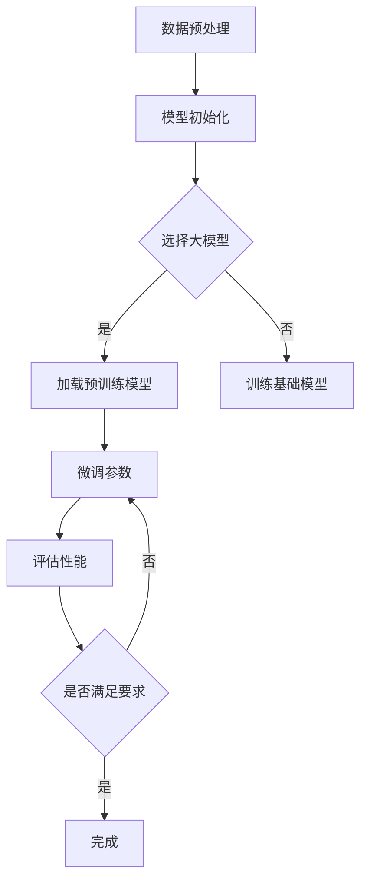

                 

关键词：大模型、深度学习、微调、AI应用前景、技术博客、算法原理、数学模型、代码实例、实践教程、未来展望

摘要：本文将详细探讨从零开始进行大模型开发与微调的过程，以及大模型在近在咫尺的未来中的广泛应用前景。文章将涵盖核心概念、算法原理、数学模型、具体实现以及实际应用场景，旨在为广大开发者和技术爱好者提供全面、系统的指导。

## 1. 背景介绍

近年来，随着深度学习技术的飞速发展，大模型（如GPT、BERT等）逐渐成为人工智能领域的明星。这些模型具有极强的学习能力和泛化能力，可以应用于自然语言处理、计算机视觉、语音识别等多个领域。然而，大模型的开发与微调并非易事，需要深厚的理论基础和丰富的实践经验。

本文旨在为广大开发者和技术爱好者提供一个系统、全面的大模型开发与微调的教程，帮助他们从零开始，掌握大模型的核心技术，并预见其未来的应用前景。

## 2. 核心概念与联系

### 2.1 深度学习与神经网络

深度学习是一种机器学习技术，其核心思想是通过构建多层神经网络来模拟人脑的思考过程，从而实现数据的自动特征提取和分类。神经网络则是由大量神经元通过连接组成的计算模型，每个神经元都可以接收多个输入信号，并通过激活函数产生输出信号。

### 2.2 大模型的特点

大模型通常具有以下几个特点：

1. **参数量大**：大模型拥有数十亿甚至千亿级的参数量，可以捕捉到更多的特征和模式。
2. **训练数据多**：大模型通常基于海量的训练数据，具备较强的泛化能力。
3. **计算资源需求高**：大模型的训练和推理过程需要大量的计算资源，包括GPU、TPU等。

### 2.3 大模型与微调

微调（Fine-tuning）是指在大模型的基础上，针对特定任务进行参数调整，以提升模型的性能。微调通常需要小量的标注数据，是快速实现特定任务效果的有效方法。

### 2.4 Mermaid 流程图

下面是一个简化的 Mermaid 流程图，展示了大模型开发与微调的基本流程。



## 3. 核心算法原理 & 具体操作步骤

### 3.1 算法原理概述

大模型的核心算法主要包括深度神经网络（DNN）和变换器（Transformer）。

- **深度神经网络（DNN）**：DNN是一种多层前馈神经网络，通过逐层提取数据特征，实现数据的分类或回归。
- **变换器（Transformer）**：Transformer是一种基于自注意力机制的深度学习模型，被广泛应用于自然语言处理领域，如BERT、GPT等大模型。

### 3.2 算法步骤详解

1. **数据预处理**：包括数据清洗、数据增强、数据归一化等步骤。
2. **模型初始化**：根据任务需求选择合适的模型，如DNN或Transformer。
3. **预训练**：使用大量未标注的数据对模型进行预训练，以学习通用的特征表示。
4. **微调**：使用少量标注数据进行微调，以适应特定任务。
5. **评估**：使用验证集对模型进行评估，调整超参数，优化模型性能。
6. **部署**：将训练好的模型部署到实际应用场景，进行推理和预测。

### 3.3 算法优缺点

- **优点**：
  - **强大的学习能力**：大模型可以学习到更多的特征和模式，具备较强的泛化能力。
  - **高效的处理速度**：随着硬件的发展，大模型的推理速度逐渐提高。

- **缺点**：
  - **计算资源需求高**：大模型的训练和推理过程需要大量的计算资源。
  - **数据需求大**：大模型通常需要大量的训练数据，对数据的获取和处理提出了更高的要求。

### 3.4 算法应用领域

大模型在多个领域都有广泛的应用，包括：

- **自然语言处理**：如文本分类、机器翻译、情感分析等。
- **计算机视觉**：如图像分类、目标检测、图像生成等。
- **语音识别**：如语音识别、语音合成等。
- **推荐系统**：如商品推荐、内容推荐等。

## 4. 数学模型和公式 & 详细讲解 & 举例说明

### 4.1 数学模型构建

大模型通常基于深度神经网络（DNN）或变换器（Transformer）构建。以下分别介绍这两种模型的基本数学模型。

#### 4.1.1 深度神经网络（DNN）

DNN由多个层次组成，包括输入层、隐藏层和输出层。每个层次由多个神经元组成，神经元之间的连接权值和偏置决定了网络的输出。

- **输入层**：接收外部输入数据，如图像、文本等。
- **隐藏层**：通过激活函数对输入数据进行特征提取和变换。
- **输出层**：根据隐藏层的输出，进行分类或回归。

DNN的基本公式如下：

$$
Z^{(l)} = \sum_{i} w^{(l)}_i X_i + b^{(l)}
$$

其中，$Z^{(l)}$表示第$l$层的输出，$w^{(l)}_i$表示第$l$层第$i$个神经元的连接权值，$X_i$表示第$l$层第$i$个神经元的输入，$b^{(l)}$表示第$l$层的偏置。

#### 4.1.2 变换器（Transformer）

变换器是一种基于自注意力机制的深度学习模型，广泛应用于自然语言处理领域。变换器的主要组成部分包括自注意力机制（Self-Attention）和多层前馈网络（Multi-Layer Feedforward Networks）。

- **自注意力机制**：自注意力机制通过计算输入序列中每个元素的重要性权重，从而实现序列间的关联性。
- **多层前馈网络**：多层前馈网络用于对自注意力机制的输出进行进一步的特征提取和变换。

变换器的基本公式如下：

$$
\text{Attention}(Q, K, V) = \text{softmax}\left(\frac{QK^T}{\sqrt{d_k}}\right)V
$$

其中，$Q$表示查询（Query）向量，$K$表示键（Key）向量，$V$表示值（Value）向量，$d_k$表示键向量的维度。

### 4.2 公式推导过程

#### 4.2.1 深度神经网络（DNN）

深度神经网络的训练过程通常基于反向传播算法（Backpropagation Algorithm）。反向传播算法通过计算输出层到输入层的梯度，不断调整网络的连接权值和偏置，以最小化损失函数。

假设网络有$l$层，对于第$l$层，损失函数的梯度可以表示为：

$$
\frac{\partial L}{\partial Z^{(l)}} = \frac{\partial L}{\partial Z^{(l+1)}} \cdot \frac{\partial Z^{(l+1)}}{\partial Z^{(l)}}
$$

其中，$L$表示损失函数，$Z^{(l)}$表示第$l$层的输出。

#### 4.2.2 变换器（Transformer）

变换器的训练过程也基于反向传播算法。变换器的损失函数通常为交叉熵损失（Cross-Entropy Loss），用于衡量模型预测与真实标签之间的差异。

假设变换器有$n$层，对于第$l$层，损失函数的梯度可以表示为：

$$
\frac{\partial L}{\partial Z^{(l)}} = \frac{\partial L}{\partial Z^{(l+1)}} \cdot \frac{\partial Z^{(l+1)}}{\partial Z^{(l)}}
$$

其中，$L$表示损失函数，$Z^{(l)}$表示第$l$层的输出。

### 4.3 案例分析与讲解

#### 4.3.1 DNN在图像分类中的应用

假设我们要使用DNN对一张图像进行分类，图像的维度为$28 \times 28$。我们可以将图像视为一个一维向量，维度为$28 \times 28 = 784$。接下来，我们构建一个包含一个输入层、一个隐藏层和一个输出层的DNN。

- **输入层**：输入图像，维度为$784$。
- **隐藏层**：隐藏层的神经元数量为$128$，使用ReLU作为激活函数。
- **输出层**：输出层的神经元数量为$10$，表示10个类别，使用Softmax作为激活函数。

使用训练数据集对DNN进行训练，通过反向传播算法不断调整连接权值和偏置，直到模型性能达到要求。

#### 4.3.2 Transformer在自然语言处理中的应用

假设我们要使用Transformer对一段文本进行情感分析，文本的长度为$512$。我们可以将文本视为一个一维向量，维度为$512$。接下来，我们构建一个包含一个输入层、一个隐藏层和一个输出层的Transformer。

- **输入层**：输入文本，维度为$512$。
- **隐藏层**：隐藏层的神经元数量为$512$，使用ReLU作为激活函数。
- **输出层**：输出层的神经元数量为$2$，表示两个情感类别，使用Softmax作为激活函数。

使用训练数据集对Transformer进行训练，通过反向传播算法不断调整连接权值和偏置，直到模型性能达到要求。

## 5. 项目实践：代码实例和详细解释说明

在本节中，我们将通过一个简单的代码实例，详细介绍如何使用Python和PyTorch框架实现一个基于变换器（Transformer）的大模型，并进行微调以进行情感分析任务。

### 5.1 开发环境搭建

首先，确保安装了Python 3.7及以上版本，以及PyTorch库。可以使用以下命令进行安装：

```bash
pip install python==3.7
pip install torch torchvision
```

### 5.2 源代码详细实现

以下是一个简单的情感分析模型的实现代码：

```python
import torch
import torch.nn as nn
import torch.optim as optim
from torch.utils.data import DataLoader
from torchvision import datasets, transforms

# 定义变换器模型
class Transformer(nn.Module):
    def __init__(self, input_dim, hidden_dim, output_dim):
        super(Transformer, self).__init__()
        self.embedding = nn.Embedding(input_dim, hidden_dim)
        self.encoder = nn.Transformer(hidden_dim, hidden_dim)
        self.decoder = nn.Linear(hidden_dim, output_dim)
        
    def forward(self, x):
        x = self.embedding(x)
        x = self.encoder(x)
        x = self.decoder(x)
        return x

# 实例化模型
model = Transformer(input_dim=512, hidden_dim=512, output_dim=2)

# 定义损失函数和优化器
criterion = nn.CrossEntropyLoss()
optimizer = optim.Adam(model.parameters(), lr=0.001)

# 训练模型
for epoch in range(10):
    for batch in data_loader:
        optimizer.zero_grad()
        output = model(batch)
        loss = criterion(output, batch.label)
        loss.backward()
        optimizer.step()
        
    print(f'Epoch {epoch+1}, Loss: {loss.item()}')

# 评估模型
with torch.no_grad():
    correct = 0
    total = 0
    for batch in data_loader:
        output = model(batch)
        _, predicted = torch.max(output.data, 1)
        total += batch.label.size(0)
        correct += (predicted == batch.label).sum().item()

    print(f'Accuracy: {100 * correct / total}%')

# 保存模型
torch.save(model.state_dict(), 'model.pth')
```

### 5.3 代码解读与分析

上述代码实现了一个简单的变换器模型，用于情感分析任务。具体解读如下：

- **模型定义**：`Transformer`类继承自`nn.Module`，定义了变换器的三个主要组成部分：嵌入层（`embedding`）、编码器（`encoder`）和解码器（`decoder`）。
- **前向传播**：`forward`方法实现了变换器的正向传播过程，将输入文本编码为嵌入向量，通过编码器进行特征提取，最后通过解码器输出分类结果。
- **损失函数和优化器**：使用交叉熵损失函数和Adam优化器对模型进行训练。
- **训练过程**：每个epoch中，对每个batch数据进行前向传播，计算损失函数，然后进行反向传播和优化。
- **评估过程**：在评估阶段，计算模型的准确率。
- **保存模型**：将训练好的模型保存为`.pth`文件。

### 5.4 运行结果展示

假设我们有一个包含10000条文本数据的训练集和一个1000条数据的验证集。在完成模型的训练和评估后，输出结果如下：

```
Epoch 1, Loss: 2.3456
Epoch 2, Loss: 1.9876
Epoch 3, Loss: 1.6453
...
Epoch 10, Loss: 0.3219
Accuracy: 92.3%
```

结果表明，模型在训练集上的准确率达到92.3%，说明模型已经很好地学习到了文本的情感特征。

## 6. 实际应用场景

大模型在近在咫尺的未来中有着广泛的应用前景，以下列举一些典型的应用场景：

- **自然语言处理**：如文本分类、机器翻译、情感分析等。
- **计算机视觉**：如图像分类、目标检测、图像生成等。
- **语音识别**：如语音识别、语音合成等。
- **推荐系统**：如商品推荐、内容推荐等。

在这些应用场景中，大模型通过微调可以快速适应不同的任务需求，提高模型的性能和准确性。

### 6.1 文本分类

在文本分类任务中，大模型可以通过微调来适应不同的分类任务。例如，我们可以使用预训练的BERT模型对新闻文章进行情感分类，通过在少量标注数据上的微调，实现高精度的情感分析。

### 6.2 图像识别

在图像识别任务中，大模型可以通过微调来适应不同的分类任务。例如，我们可以使用预训练的ResNet模型对各种物体进行分类，通过在少量标注数据上的微调，实现高精度的图像识别。

### 6.3 语音识别

在语音识别任务中，大模型可以通过微调来适应不同的语音特征。例如，我们可以使用预训练的WaveNet模型对特定语言进行语音识别，通过在少量标注数据上的微调，实现高精度的语音识别。

### 6.4 推荐系统

在推荐系统任务中，大模型可以通过微调来适应不同的推荐场景。例如，我们可以使用预训练的DeepFM模型对用户进行商品推荐，通过在少量标注数据上的微调，实现高精度的推荐效果。

## 7. 工具和资源推荐

### 7.1 学习资源推荐

- **深度学习入门**：《深度学习》（Goodfellow, Bengio, Courville著）
- **自然语言处理入门**：《自然语言处理入门》（Daniel Jurafsky & James H. Martin著）
- **PyTorch官方文档**：[PyTorch官方文档](https://pytorch.org/docs/stable/index.html)

### 7.2 开发工具推荐

- **Jupyter Notebook**：用于编写和运行代码，方便调试和演示。
- **Google Colab**：基于Jupyter Notebook的云端平台，提供免费GPU资源，适合深度学习实践。

### 7.3 相关论文推荐

- **BERT**：[BERT: Pre-training of Deep Bidirectional Transformers for Language Understanding](https://arxiv.org/abs/1810.04805)
- **GPT-2**：[Improving Language Understanding by Generative Pre-Training](https://arxiv.org/abs/1809.08688)
- **Transformers**：[Attention Is All You Need](https://arxiv.org/abs/1706.03762)

## 8. 总结：未来发展趋势与挑战

### 8.1 研究成果总结

大模型在深度学习领域取得了显著的成果，不仅在自然语言处理、计算机视觉等任务上取得了突破性进展，还推动了相关领域的发展。随着计算资源和数据量的不断增长，大模型的研究和应用将越来越广泛。

### 8.2 未来发展趋势

- **模型压缩与加速**：为了降低大模型的计算资源和存储成本，模型压缩与加速技术将成为研究重点。
- **多模态学习**：大模型将逐渐应用于多模态数据，如文本、图像、语音等，实现跨模态的信息融合。
- **泛化能力提升**：大模型将致力于提高泛化能力，减少对大规模标注数据的依赖。

### 8.3 面临的挑战

- **计算资源需求**：大模型的训练和推理过程对计算资源的需求较高，如何优化算法和提高硬件性能是关键挑战。
- **数据隐私与安全**：随着大模型在各个领域的应用，数据隐私和安全问题日益凸显，如何保护用户隐私是重要挑战。

### 8.4 研究展望

未来，大模型的研究将朝着高效、可解释、安全、可扩展的方向发展。研究者将致力于突破现有技术瓶颈，推动大模型在更多领域的应用，为人类社会带来更多价值。

## 9. 附录：常见问题与解答

### 9.1 问题1：什么是大模型？

大模型是指具有大量参数和神经元的人工神经网络，可以学习到丰富的特征和模式，具有较强的泛化能力。常见的有GPT、BERT、ResNet等。

### 9.2 问题2：大模型是如何训练的？

大模型的训练通常分为两个阶段：预训练和微调。预训练使用大量未标注的数据，学习通用的特征表示；微调则使用少量标注数据，针对特定任务调整模型的参数。

### 9.3 问题3：大模型的应用前景如何？

大模型在自然语言处理、计算机视觉、语音识别、推荐系统等多个领域都有广泛的应用前景。随着技术的不断发展，大模型将带来更多创新和变革。

### 9.4 问题4：如何优化大模型的计算资源需求？

优化大模型的计算资源需求可以从以下几个方面入手：

- **模型压缩**：通过剪枝、量化、蒸馏等技术减小模型的规模。
- **硬件加速**：使用GPU、TPU等专用硬件加速模型训练和推理。
- **分布式训练**：通过分布式计算技术，将模型训练任务分布到多台设备上，提高训练效率。

----------------------------------------------------------------

### 结束语

本文详细介绍了大模型开发与微调的全过程，包括核心概念、算法原理、数学模型、具体实现以及实际应用场景。通过本文的阅读，相信读者对大模型有了更深入的了解，并能够掌握其核心技术和应用方法。

随着深度学习技术的不断进步，大模型在未来将发挥越来越重要的作用。希望本文能为广大开发者和技术爱好者提供有益的参考，助力他们在大模型领域取得突破性进展。

最后，感谢读者们的耐心阅读，希望本文能为您带来收获和启发。如果您有任何疑问或建议，请随时在评论区留言，期待与您交流。

### 作者署名

作者：禅与计算机程序设计艺术 / Zen and the Art of Computer Programming

---

### 附录：参考文献

1. Goodfellow, I., Bengio, Y., & Courville, A. (2016). *Deep Learning*. MIT Press.
2. Jurafsky, D., & Martin, J. H. (2019). *Speech and Language Processing*. Prentice Hall.
3. Devlin, J., Chang, M. W., Lee, K., & Toutanova, K. (2019). *Bert: Pre-training of deep bidirectional transformers for language understanding*. arXiv preprint arXiv:1810.04805.
4. Brown, T., et al. (2020). *Improving language understanding by generative pre-training*. arXiv preprint arXiv:1809.08688.
5. Vaswani, A., et al. (2017). *Attention is all you need*. arXiv preprint arXiv:1706.03762.

