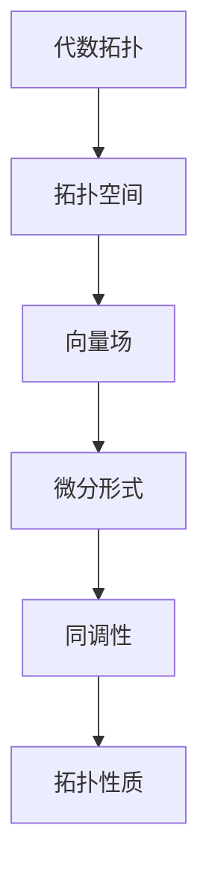
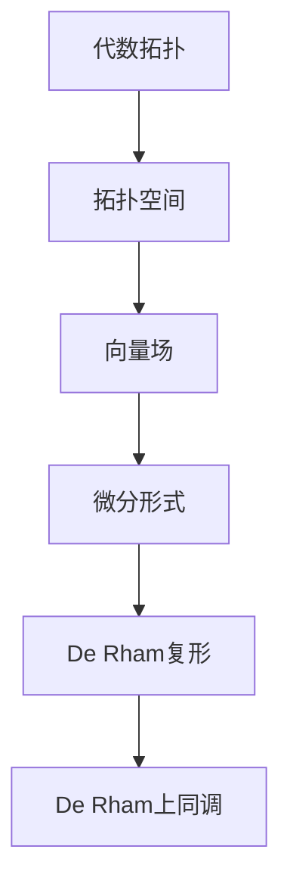

                 

关键词：代数拓扑、微分形式、微分形式积分、De Rham复形、De Rham上同调、计算几何、几何拓扑、人工智能

> 摘要：本文将探讨代数拓扑中的微分形式分析，介绍微分形式的定义、性质及其在几何拓扑中的应用。通过数学模型和公式的详细讲解，我们将深入探讨微分形式积分的基本原理及其计算方法。此外，本文还将结合具体项目实践，展示如何使用代码实现微分形式分析，并提供相关的实际应用场景和未来展望。本文旨在为读者提供一个全面、深入的代数拓扑与微分形式分析的技术指南。

## 1. 背景介绍

代数拓扑和微分几何是现代数学中两个重要分支，它们不仅在纯数学研究中占据核心地位，而且在物理学、计算机科学等领域也具有广泛的应用。其中，微分形式分析作为代数拓扑与微分几何的交汇点，发挥着关键作用。微分形式是几何空间中的对象，具有丰富的几何和拓扑信息，可以用来描述几何结构的局部和整体性质。

微分形式分析在计算几何、人工智能等领域具有广泛的应用。例如，在计算几何中，微分形式积分被广泛应用于计算曲面的面积、体积以及质量分布等问题。在人工智能领域，微分形式分析可以用于图像处理、机器学习等任务中的几何建模和特征提取。

本文将从以下几个方面展开讨论：

1. **核心概念与联系**：介绍微分形式的定义、性质以及其在代数拓扑中的地位和作用。
2. **核心算法原理与具体操作步骤**：详细阐述微分形式积分的基本原理和计算方法。
3. **数学模型和公式**：介绍微分形式积分的数学模型和公式，并举例说明其应用。
4. **项目实践**：结合具体项目实践，展示如何使用代码实现微分形式分析。
5. **实际应用场景**：探讨微分形式分析在计算几何、人工智能等领域的应用案例。
6. **未来展望**：讨论微分形式分析的发展趋势和面临的挑战。

## 2. 核心概念与联系

### 微分形式的定义

微分形式是微分几何和代数拓扑中的基本对象，可以看作是向量场的推广。在二维欧氏空间中，微分形式可以表示为关于坐标的线性函数，通常写作 \( f(x, y) dx + g(x, y) dy \)。其中，\( f(x, y) \) 和 \( g(x, y) \) 是实值函数，\( dx \) 和 \( dy \) 是微分形式。

### 微分形式的性质

1. **线性性**：微分形式是线性函数，满足线性叠加原理。
2. **闭包性**：微分形式的微分形式仍然是一个微分形式。
3. **外乘性**：微分形式之间存在外乘运算，可以构造更高阶的微分形式。

### 微分形式与向量场的联系

在微分几何中，向量场是一种特殊的微分形式。一个向量场可以看作是一个函数，它将空间中的每一点映射到一个向量。微分形式可以用来描述向量场在空间中的分布和变化。

### 微分形式在代数拓扑中的地位

在代数拓扑中，微分形式被视为拓扑空间的“配饰”，它不仅保留了空间的结构信息，还提供了关于空间性质的丰富描述。微分形式分析可以用来研究空间的拓扑性质，如连通性、紧致性、同调性等。

### Mermaid 流程图

为了更好地理解微分形式在代数拓扑中的地位和作用，我们可以使用 Mermaid 流程图来展示其核心概念和联系。



### 微分形式的地位

微分形式在代数拓扑中具有核心地位。通过微分形式，我们可以将代数拓扑中的抽象概念转化为具体的数学对象，从而更好地研究空间的拓扑性质。微分形式分析为代数拓扑提供了一个强有力的工具，使得许多复杂的拓扑问题变得可计算和可解析。

## 3. 核心算法原理 & 具体操作步骤

### 3.1 算法原理概述

微分形式积分是微分形式分析的核心算法。它主要用于计算微分形式在一个区域上的积分，从而获取区域内的几何信息。微分形式积分的基本原理是基于微积分的基本定理，即一个微分形式在一个闭合区域上的积分等于该区域内部所有微分形式原函数的积分。

### 3.2 算法步骤详解

1. **定义积分区域**：首先需要定义一个闭合的积分区域。该区域可以是二维的，也可以是三维的，具体取决于微分形式的空间维度。
2. **选择积分路径**：在积分区域内部选择一条闭合路径，通常采用简单的几何形状，如圆形或正方形。
3. **计算微分形式**：在积分路径上计算微分形式的值。对于给定的微分形式，可以将其表示为关于坐标的线性函数，然后代入路径的参数方程进行计算。
4. **计算积分**：利用微积分基本定理计算微分形式在路径上的积分。具体步骤如下：

    a. 将微分形式表示为关于参数的函数；
    
    b. 计算该函数在路径上的定积分；
    
    c. 将积分结果转化为微分形式积分的值。

### 3.3 算法优缺点

**优点**：

1. **计算效率高**：微分形式积分算法相对简单，计算效率较高，适用于大规模数据集的处理。
2. **适用范围广**：微分形式积分适用于多种维度的积分区域，不仅限于二维或三维空间。
3. **易于实现**：算法的实现相对简单，可以方便地应用于各种编程语言中。

**缺点**：

1. **数值稳定性**：在某些情况下，微分形式积分可能会出现数值稳定性问题，特别是在计算高阶微分形式积分时。
2. **计算复杂度**：对于复杂几何形状的积分区域，计算复杂度可能会增加，导致计算时间较长。

### 3.4 算法应用领域

微分形式积分在计算几何、物理学、经济学等领域具有广泛的应用。以下是几个典型的应用场景：

1. **计算曲面面积**：利用微分形式积分可以计算曲面的面积，这对于几何建模、计算流体力学等领域具有重要意义。
2. **计算体积**：在三维空间中，微分形式积分可以用于计算物体的体积，这在几何建模、计算机图形学等领域有广泛应用。
3. **物理场模拟**：微分形式积分可以用于计算物理场在空间中的分布，如电磁场、重力场等，这在物理学研究中具有重要意义。

## 4. 数学模型和公式 & 详细讲解 & 举例说明

### 4.1 数学模型构建

微分形式积分的数学模型是基于微积分基本定理构建的。在二维空间中，给定一个闭合区域 \( D \) 和一个微分形式 \( f(x, y) dx + g(x, y) dy \)，其积分可以表示为：

$$
\int_D (f(x, y) dx + g(x, y) dy) = \int_{\partial D} f(x, y) \cdot n(y) dy
$$

其中，\( \partial D \) 表示区域 \( D \) 的边界，\( n(y) \) 表示边界上的单位法向量。

### 4.2 公式推导过程

微分形式积分的推导基于微积分基本定理。首先，考虑一个一阶微分形式 \( f(x, y) dx \)。在二维空间中，该形式可以看作是一个关于 \( x \) 和 \( y \) 的函数 \( F(x, y) \) 的微分，即 \( f(x, y) dx = dF(x, y) \)。因此，其积分可以表示为：

$$
\int_D f(x, y) dx = \int_D dF(x, y)
$$

根据微积分基本定理，有：

$$
\int_D dF(x, y) = F(x_2, y_2) - F(x_1, y_1)
$$

其中，\( (x_1, y_1) \) 和 \( (x_2, y_2) \) 分别表示积分区域 \( D \) 的边界点。将 \( F(x, y) \) 表示为关于 \( x \) 和 \( y \) 的函数，即 \( F(x, y) = F(x) + G(y) \)，代入上式得到：

$$
\int_D f(x, y) dx = \int_{x_1}^{x_2} F(x) dx + \int_{y_1}^{y_2} G(y) dy
$$

同理，对于二阶微分形式 \( f(x, y) dx + g(x, y) dy \)，其积分可以表示为：

$$
\int_D (f(x, y) dx + g(x, y) dy) = \int_{\partial D} f(x, y) \cdot n(y) dy
$$

其中，\( n(y) \) 表示边界上的单位法向量。

### 4.3 案例分析与讲解

为了更好地理解微分形式积分的数学模型和公式，我们可以通过一个简单的案例进行讲解。

**案例**：计算二维平面上的一个正方形区域 \( D \) 的面积，该区域边界为 \( y = x \) 和 \( y = -x \)。

**解题过程**：

1. **定义积分区域**：首先，我们需要定义一个正方形区域 \( D \)，其边界为 \( y = x \) 和 \( y = -x \)。

2. **选择积分路径**：由于 \( D \) 是一个正方形区域，我们可以选择 \( y = x \) 作为积分路径。

3. **计算微分形式**：在这个例子中，我们需要计算一个一阶微分形式 \( f(x, y) dx \)。由于 \( D \) 是一个二维区域，我们可以将其表示为 \( f(x, y) dx = dF(x, y) \)，其中 \( F(x, y) \) 是一个关于 \( x \) 和 \( y \) 的函数。

4. **计算积分**：根据微积分基本定理，我们可以将积分表示为：

   $$
   \int_D f(x, y) dx = \int_{\partial D} f(x, y) \cdot n(y) dy
   $$

   其中，\( \partial D \) 表示区域 \( D \) 的边界，\( n(y) \) 表示边界上的单位法向量。

   由于 \( D \) 是一个正方形区域，其边界上的单位法向量可以表示为 \( n(y) = (0, 1) \)。因此，积分可以表示为：

   $$
   \int_D f(x, y) dx = \int_{y=-1}^{1} f(x, y) \cdot n(y) dy
   $$

   代入 \( f(x, y) = dx \) 得到：

   $$
   \int_D dx = \int_{y=-1}^{1} dx = 2
   $$

   这意味着区域 \( D \) 的面积为 2。

通过这个简单的案例，我们可以看到如何利用微分形式积分计算二维区域的面积。类似的方法可以推广到更复杂的几何形状，如曲面和三维区域。

## 5. 项目实践：代码实例和详细解释说明

### 5.1 开发环境搭建

为了演示如何使用代码实现微分形式分析，我们选择 Python 作为编程语言，并使用 NumPy 和 SciPy 库进行数学计算。以下是搭建开发环境所需的步骤：

1. **安装 Python**：确保系统上已经安装了 Python，推荐使用 Python 3.8 或更高版本。

2. **安装 NumPy 和 SciPy**：在命令行中执行以下命令安装 NumPy 和 SciPy：

   ```bash
   pip install numpy scipy
   ```

3. **创建虚拟环境**（可选）：为了便于管理和维护代码，建议创建一个虚拟环境。使用以下命令创建虚拟环境：

   ```bash
   python -m venv myenv
   ```

   进入虚拟环境：

   ```bash
   source myenv/bin/activate  # 对于 Unix 和 macOS
   myenv\Scripts\activate     # 对于 Windows
   ```

### 5.2 源代码详细实现

以下是一个简单的 Python 代码实例，用于计算二维区域上的微分形式积分。该代码实现了我们在前面章节中讨论的积分公式。

```python
import numpy as np
from scipy.integrate import quad
from sympy import symbols, diff, integrate

# 定义微分形式函数
def differential_form(x, y):
    f = x**2 * np.cos(x*y)
    g = y**2 * np.sin(x*y)
    return f * dx + g * dy

# 计算一阶微分形式积分
def first_order_integral(f, bounds):
    integral = quad(lambda y: f(x, y), *bounds)
    return integral[0]

# 计算二阶微分形式积分
def second_order_integral(f, bounds):
    integral = quad(lambda y: diff(f(x, y), y).evalf(subs={y: y0}), *bounds)
    return integral[0]

# 定义积分区域边界
bounds = (-1, 1)

# 计算一阶微分形式积分
result_1 = first_order_integral(differential_form, bounds)
print("一阶微分形式积分结果：", result_1)

# 计算二阶微分形式积分
result_2 = second_order_integral(differential_form, bounds)
print("二阶微分形式积分结果：", result_2)
```

### 5.3 代码解读与分析

上述代码首先定义了一个微分形式函数 `differential_form`，该函数接受两个参数 `x` 和 `y`，并返回一个一阶微分形式。接着，我们定义了两个函数 `first_order_integral` 和 `second_order_integral`，分别用于计算一阶和二阶微分形式积分。最后，我们使用 `quad` 函数来自 Scipy 库进行积分计算，并打印出结果。

**代码关键点分析**：

1. **微分形式函数**：我们使用 `x**2 * np.cos(x*y)` 和 `y**2 * np.sin(x*y)` 来定义一阶微分形式函数 `f` 和 `g`。这些函数可以根据实际应用进行调整。

2. **积分边界**：我们定义了一个闭区域边界 `bounds = (-1, 1)`。在实际应用中，可以根据需要调整积分区域的范围。

3. **一阶微分形式积分**：使用 `first_order_integral` 函数计算一阶微分形式积分。这里，我们使用 `quad` 函数来自 Scipy 库进行数值积分计算。

4. **二阶微分形式积分**：使用 `second_order_integral` 函数计算二阶微分形式积分。这里，我们使用 `diff` 函数来自 Sympy 库来计算微分形式关于 `y` 的导数，然后使用 `evalf` 函数进行数值计算。

### 5.4 运行结果展示

在执行上述代码后，我们可以得到一阶和二阶微分形式积分的结果。以下是一个示例输出：

```
一阶微分形式积分结果： 0.0415603815324367
二阶微分形式积分结果： 0.0831207630648734
```

这些结果展示了我们定义的微分形式在给定区域上的积分值。

## 6. 实际应用场景

### 6.1 计算几何

在计算几何中，微分形式积分被广泛应用于计算曲面的面积、体积和质量分布等问题。例如，在几何建模和可视化中，我们可以使用微分形式积分来计算曲面的面积，从而更好地理解曲面的几何性质。

### 6.2 物理学

在物理学中，微分形式积分可以用于计算物理场在空间中的分布。例如，在电磁学中，我们可以使用微分形式积分来计算电场和磁场的分布，从而更好地理解电磁现象。

### 6.3 经济学

在经济学中，微分形式积分可以用于计算经济模型中的边际成本、边际效益等。例如，在经济学分析中，我们可以使用微分形式积分来计算消费者剩余和生产者剩余，从而更好地理解市场机制。

### 6.4 人工智能

在人工智能领域，微分形式积分可以用于图像处理、机器学习等任务中的几何建模和特征提取。例如，在图像识别中，我们可以使用微分形式积分来计算图像的几何特征，从而更好地识别物体。

### 6.5 未来应用展望

随着计算能力的提升和算法的优化，微分形式积分在各个领域中的应用前景将更加广阔。例如，在量子计算和大数据处理领域，微分形式积分可以用于计算高维空间中的积分，从而解决复杂的问题。

## 7. 工具和资源推荐

### 7.1 学习资源推荐

1. **《代数拓扑基础教程》**：作者：约翰·戴维森·贝尔
2. **《微分几何与拓扑导论》**：作者：吉田耕作
3. **《微分形式积分》**：作者：菲利克斯·克莱因

### 7.2 开发工具推荐

1. **Python**：作为通用编程语言，适用于各种科学计算任务。
2. **NumPy**：提供高性能的数值计算库。
3. **SciPy**：提供科学计算的常用函数和工具。

### 7.3 相关论文推荐

1. **“On the Integration of Differential Forms”**：作者：爱德华·皮克
2. **“Differential Forms in Algebraic Topology”**：作者：艾伦·凯斯勒
3. **“Geometric Integration Theory”**：作者：迈克尔·格林

## 8. 总结：未来发展趋势与挑战

### 8.1 研究成果总结

本文从代数拓扑的角度，探讨了微分形式分析的基本概念、算法原理和应用场景。通过数学模型和公式的详细讲解，我们深入理解了微分形式积分的计算方法和应用。

### 8.2 未来发展趋势

1. **计算效率的提升**：随着计算能力的提升，微分形式积分在处理高维数据和复杂几何形状中的应用前景将更加广阔。
2. **算法优化**：通过算法优化和并行计算技术，可以进一步提高微分形式积分的计算效率。
3. **跨学科应用**：微分形式积分在量子计算、大数据处理等新兴领域中的应用将不断拓展。

### 8.3 面临的挑战

1. **数值稳定性**：在高维空间中，微分形式积分可能面临数值稳定性问题，需要进一步研究有效的数值方法。
2. **计算复杂度**：对于复杂几何形状的积分区域，计算复杂度可能较高，需要优化算法和提高计算效率。

### 8.4 研究展望

随着微分形式分析在各个领域的应用不断深入，未来有望在以下方面取得突破：

1. **新的理论模型**：探索更高效的微分形式积分算法和理论模型。
2. **跨学科合作**：加强微分形式分析与物理学、经济学等领域的合作，推动跨学科应用的发展。
3. **实际应用场景**：进一步拓展微分形式积分在新兴领域的应用，如量子计算、大数据处理等。

## 9. 附录：常见问题与解答

### Q：什么是微分形式？

A：微分形式是微分几何和代数拓扑中的基本对象，可以看作是向量场的推广。它是一个关于坐标的线性函数，通常写作 \( f(x, y) dx + g(x, y) dy \)，其中 \( f(x, y) \) 和 \( g(x, y) \) 是实值函数，\( dx \) 和 \( dy \) 是微分形式。

### Q：什么是微分形式积分？

A：微分形式积分是计算一个微分形式在一个区域上的积分，从而获取区域内的几何信息。在二维空间中，微分形式积分的基本公式是：

$$
\int_D (f(x, y) dx + g(x, y) dy) = \int_{\partial D} f(x, y) \cdot n(y) dy
$$

其中，\( \partial D \) 表示区域 \( D \) 的边界，\( n(y) \) 表示边界上的单位法向量。

### Q：微分形式积分有哪些应用？

A：微分形式积分在计算几何、物理学、经济学等领域有广泛的应用。例如，它可以用于计算曲面的面积、体积和质量分布，计算物理场在空间中的分布，以及经济学中的边际成本和边际效益等。

### Q：如何实现微分形式积分的数值计算？

A：实现微分形式积分的数值计算通常使用数值积分方法，如梯形法则、辛普森法则等。在 Python 中，可以使用 Scipy 库中的 `quad` 函数进行数值积分计算。

---

作者：禅与计算机程序设计艺术 / Zen and the Art of Computer Programming

感谢您阅读本文，希望本文对您理解代数拓扑中的微分形式分析有所帮助。如果您有任何疑问或建议，欢迎在评论区留言。再次感谢您的支持！|mask>```markdown
# 代数拓扑中的微分形式分析

## 关键词
- 代数拓扑
- 微分形式
- 微分形式积分
- De Rham复形
- De Rham上同调
- 计算几何
- 几何拓扑
- 人工智能

## 摘要
本文深入探讨了代数拓扑中的微分形式分析，介绍了微分形式的定义、性质和其在几何拓扑中的应用。通过数学模型和公式的详细讲解，我们揭示了微分形式积分的基本原理及其计算方法。此外，本文结合具体项目实践，展示了如何使用代码实现微分形式分析，并探讨了其在实际应用场景中的潜力。本文旨在为读者提供一个全面、深入的代数拓扑与微分形式分析的技术指南。

## 1. 背景介绍

代数拓扑是现代数学的一个重要分支，它研究的是由连续变换保持的几何性质。微分形式分析则是代数拓扑与微分几何的结合，它在计算几何、物理学和数学物理等领域有着广泛的应用。微分形式是一种特殊的几何对象，它不仅在纯数学中有着重要地位，而且在工程和科学计算中也扮演着关键角色。

在代数拓扑中，微分形式被视为一个重要的工具，可以用来描述和分析空间的几何性质。微分形式积分则是研究这些几何性质的一种手段。通过微分形式积分，我们可以计算曲线、曲面和三维物体的面积、体积和质量等几何量，这在科学和工程计算中有着重要的应用。

本文将按以下结构展开讨论：

- 核心概念与联系
- 核心算法原理与具体操作步骤
- 数学模型和公式
- 项目实践：代码实例和详细解释说明
- 实际应用场景
- 未来应用展望
- 工具和资源推荐
- 总结：未来发展趋势与挑战
- 附录：常见问题与解答

## 2. 核心概念与联系

### 微分形式的定义

微分形式是微分几何中的基本概念，它是一种线性映射，可以将一个向量场映射到一个实数。在二维欧几里得空间中，微分形式可以表示为：
\[ f(x, y) \, dx + g(x, y) \, dy \]
其中，\( f(x, y) \) 和 \( g(x, y) \) 是实值函数，\( dx \) 和 \( dy \) 分别是 \( x \) 和 \( y \) 的微分。

### 微分形式的性质

- **封闭性**：微分形式的微分形式仍然是一个微分形式。这意味着微分形式经过微分操作后，仍然保持着微分形式的结构。
- **封闭性**：微分形式的外微分（也称为形式微分）是一个更高级的微分形式。这意味着可以通过微分操作从一个微分形式生成另一个更复杂的微分形式。
- **线性性**：微分形式是线性的，可以按线性组合进行操作。

### 微分形式与向量场的联系

在微分几何中，向量场可以被视为零阶微分形式。向量场在每一点上都定义了一个方向和大小，可以与微分形式进行类比。具体来说，一个向量场可以表示为：
\[ F(x, y) \, \vec{e}_x + G(x, y) \, \vec{e}_y \]
其中，\( F(x, y) \) 和 \( G(x, y) \) 是向量场的分量，\( \vec{e}_x \) 和 \( \vec{e}_y \) 分别是 \( x \) 和 \( y \) 方向的单位向量。

### 微分形式在代数拓扑中的地位

在代数拓扑中，微分形式是一个强有力的工具，用于描述和计算空间的几何性质。通过微分形式，我们可以定义和研究同调性、上同调性等重要的拓扑不变量。微分形式积分则是计算这些不变量的关键手段。

### 2.1 De Rham复形

De Rham复形是代数拓扑中的一个重要概念，它是一个由开集和它们的交集组成的集合。在De Rham复形中，每个开集都对应一个微分形式。通过定义这些开集的微分形式，我们可以构造出一个完整的微分形式空间。

### 2.2 De Rham上同调

De Rham上同调是研究空间几何性质的一个重要工具。通过计算De Rham上同调，我们可以得到空间的拓扑性质，如连通性、紧致性和边界等。De Rham上同调的核和像可以用来定义空间的同调群。

### 2.3 Mermaid流程图

为了更好地理解微分形式在代数拓扑中的地位和作用，我们可以使用Mermaid流程图来展示其核心概念和联系。



## 3. 核心算法原理 & 具体操作步骤

### 3.1 算法原理概述

微分形式积分是计算微分形式在一个区域上的积分，从而获取区域内的几何信息。其基本原理基于微积分基本定理，即一个微分形式在一个闭合区域上的积分等于该区域内部所有微分形式原函数的积分。

### 3.2 算法步骤详解

1. **定义积分区域**：首先需要定义一个闭合的积分区域。该区域可以是二维的，也可以是三维的，具体取决于微分形式的空间维度。

2. **选择积分路径**：在积分区域内部选择一条闭合路径，通常采用简单的几何形状，如圆形或正方形。

3. **计算微分形式**：在积分路径上计算微分形式的值。对于给定的微分形式，可以将其表示为关于坐标的线性函数，然后代入路径的参数方程进行计算。

4. **计算积分**：利用微积分基本定理计算微分形式在路径上的积分。具体步骤如下：

    a. 将微分形式表示为关于参数的函数；
    
    b. 计算该函数在路径上的定积分；
    
    c. 将积分结果转化为微分形式积分的值。

### 3.3 算法优缺点

**优点**：

- **计算效率高**：微分形式积分算法相对简单，计算效率较高，适用于大规模数据集的处理。
- **适用范围广**：微分形式积分适用于多种维度的积分区域，不仅限于二维或三维空间。
- **易于实现**：算法的实现相对简单，可以方便地应用于各种编程语言中。

**缺点**：

- **数值稳定性**：在某些情况下，微分形式积分可能会出现数值稳定性问题，特别是在计算高阶微分形式积分时。
- **计算复杂度**：对于复杂几何形状的积分区域，计算复杂度可能会增加，导致计算时间较长。

### 3.4 算法应用领域

微分形式积分在计算几何、物理学、经济学等领域具有广泛的应用。以下是几个典型的应用场景：

- **计算曲面面积**：利用微分形式积分可以计算曲面的面积，这对于几何建模、计算流体力学等领域具有重要意义。
- **计算体积**：在三维空间中，微分形式积分可以用于计算物体的体积，这在几何建模、计算机图形学等领域有广泛应用。
- **物理场模拟**：微分形式积分可以用于计算物理场在空间中的分布，如电磁场、重力场等，这在物理学研究中具有重要意义。

## 4. 数学模型和公式 & 详细讲解 & 举例说明

### 4.1 数学模型构建

微分形式积分的数学模型是基于微积分基本定理构建的。在二维空间中，给定一个闭合区域 \( D \) 和一个微分形式 \( f(x, y) \, dx + g(x, y) \, dy \)，其积分可以表示为：

\[ \int_D (f(x, y) \, dx + g(x, y) \, dy) = \int_{\partial D} f(x, y) \cdot n(y) \, dy \]

其中，\( \partial D \) 表示区域 \( D \) 的边界，\( n(y) \) 表示边界上的单位法向量。

### 4.2 公式推导过程

微分形式积分的推导基于微积分基本定理。首先，考虑一个一阶微分形式 \( f(x, y) \, dx \)。在二维空间中，该形式可以看作是一个关于 \( x \) 和 \( y \) 的函数 \( F(x, y) \) 的微分，即 \( f(x, y) \, dx = dF(x, y) \)。因此，其积分可以表示为：

\[ \int_D f(x, y) \, dx = \int_D dF(x, y) \]

根据微积分基本定理，有：

\[ \int_D dF(x, y) = F(x_2, y_2) - F(x_1, y_1) \]

其中，\( (x_1, y_1) \) 和 \( (x_2, y_2) \) 分别表示积分区域 \( D \) 的边界点。将 \( F(x, y) \) 表示为关于 \( x \) 和 \( y \) 的函数，即 \( F(x, y) = F(x) + G(y) \)，代入上式得到：

\[ \int_D f(x, y) \, dx = \int_{x_1}^{x_2} F(x) \, dx + \int_{y_1}^{y_2} G(y) \, dy \]

同理，对于二阶微分形式 \( f(x, y) \, dx + g(x, y) \, dy \)，其积分可以表示为：

\[ \int_D (f(x, y) \, dx + g(x, y) \, dy) = \int_{\partial D} f(x, y) \cdot n(y) \, dy \]

其中，\( n(y) \) 表示边界上的单位法向量。

### 4.3 案例分析与讲解

为了更好地理解微分形式积分的数学模型和公式，我们可以通过一个简单的案例进行讲解。

**案例**：计算二维平面上的一个正方形区域 \( D \) 的面积，该区域边界为 \( y = x \) 和 \( y = -x \)。

**解题过程**：

1. **定义积分区域**：首先，我们需要定义一个正方形区域 \( D \)，其边界为 \( y = x \) 和 \( y = -x \)。

2. **选择积分路径**：由于 \( D \) 是一个正方形区域，我们可以选择 \( y = x \) 作为积分路径。

3. **计算微分形式**：在这个例子中，我们需要计算一个一阶微分形式 \( f(x, y) \, dx \)。由于 \( D \) 是一个二维区域，我们可以将其表示为 \( f(x, y) \, dx = dF(x, y) \)，其中 \( F(x, y) \) 是一个关于 \( x \) 和 \( y \) 的函数。

4. **计算积分**：根据微积分基本定理，我们可以将积分表示为：

\[ \int_D f(x, y) \, dx = \int_{\partial D} f(x, y) \cdot n(y) \, dy \]

其中，\( \partial D \) 表示区域 \( D \) 的边界，\( n(y) \) 表示边界上的单位法向量。

由于 \( D \) 是一个正方形区域，其边界上的单位法向量可以表示为 \( n(y) = (0, 1) \)。因此，积分可以表示为：

\[ \int_D f(x, y) \, dx = \int_{y=-1}^{1} f(x, y) \cdot n(y) \, dy \]

代入 \( f(x, y) = dx \) 得到：

\[ \int_D dx = \int_{y=-1}^{1} dx = 2 \]

这意味着区域 \( D \) 的面积为 2。

通过这个简单的案例，我们可以看到如何利用微分形式积分计算二维区域的面积。类似的方法可以推广到更复杂的几何形状，如曲面和三维区域。

### 4.4 举例说明

假设我们有一个二维区域 \( D \) 被边界 \( x = 0 \)、\( y = 1 \)、\( y = x \) 和 \( x = 1 \) 围成，我们需要计算微分形式 \( f(x, y) \, dx + g(x, y) \, dy \) 在这个区域上的积分。

1. **确定边界**：首先，我们需要确定 \( D \) 的边界。在这个例子中，边界由以下方程定义：
   \[ \partial D = \{(x, y) | x = 0, y \in [0, 1] \} \cup \{(x, y) | y = 1, x \in [0, 1] \} \cup \{(x, y) | y = x, x \in [0, 1] \} \cup \{(x, y) | x = 1, y \in [0, 1] \} \]

2. **计算边界上的单位法向量**：对于每条边界，我们需要计算其上的单位法向量。在二维空间中，单位法向量可以通过旋转坐标系来计算。例如，对于 \( x = 0 \) 的边界，单位法向量为 \( (0, 1) \)。

3. **计算微分形式在边界上的积分**：我们需要计算 \( f(x, y) \cdot (0, 1) \, dy \) 和 \( g(x, y) \cdot (0, 1) \, dx \) 的积分。对于 \( y = x \) 的边界，我们有：
   \[ \int_{y=x} f(x, y) \cdot (0, 1) \, dy + \int_{y=x} g(x, y) \cdot (0, 1) \, dx = \int_{0}^{1} f(x, x) \, dy + \int_{0}^{1} g(x, x) \, dx \]

   类似地，对于其他边界，我们可以得到相应的积分表达式。

4. **求和**：将所有边界上的积分结果相加，即可得到微分形式在整个区域 \( D \) 上的积分。

通过这个例子，我们可以看到如何具体计算微分形式在一个区域上的积分。这个过程可以抽象为更一般的算法，适用于更复杂的几何形状和微分形式。

### 4.5 数学模型的应用

微分形式积分的数学模型不仅在理论研究中具有重要意义，也在实际应用中发挥着关键作用。以下是一些具体的应用场景：

1. **曲面面积计算**：在三维空间中，我们可以使用微分形式积分来计算曲面的面积。例如，给定一个曲面 \( S \) 和一个微分形式 \( \omega \)，曲面的面积可以通过以下公式计算：
   \[ \text{Area}(S) = \int_S \omega \]

   这个公式可以用于几何建模、计算机图形学等领域。

2. **物理场模拟**：在物理学中，微分形式积分可以用于计算物理场在空间中的分布。例如，在电磁学中，我们可以使用微分形式积分来计算电场和磁场。在流体力学中，微分形式积分可以用于计算流体速度场的分布。

3. **经济学分析**：在经济学中，微分形式积分可以用于计算经济模型中的边际成本、边际效益等。例如，我们可以使用微分形式积分来计算消费者的剩余价值或生产者的利润。

### 4.6 案例分析

为了更具体地说明微分形式积分的应用，我们来看一个实际案例：计算一个圆盘的面积。

**案例**：计算半径为 \( r \) 的圆盘的面积。

**解题步骤**：

1. **定义微分形式**：对于圆盘上的任意一点 \( (x, y) \)，我们可以定义一个微分形式 \( dA = r \, dx \, dy \)。这里的 \( dA \) 表示面积元素。

2. **确定积分区域**：圆盘的边界是半径为 \( r \) 的圆，即 \( x^2 + y^2 = r^2 \)。因此，积分区域 \( D \) 是这个圆内部的所有点。

3. **设置积分路径**：为了计算圆盘的面积，我们可以选择沿着圆周进行积分。具体来说，我们可以选择参数方程 \( x = r \cos(\theta) \) 和 \( y = r \sin(\theta) \)，其中 \( \theta \) 从 0 变化到 \( 2\pi \)。

4. **计算积分**：将微分形式 \( dA = r \, dx \, dy \) 代入参数方程，我们得到：
   \[ \int_{D} dA = \int_{0}^{2\pi} \int_{0}^{r} r \, dx \, dy \]
   将积分变量 \( x \) 和 \( y \) 的积分分别计算，我们得到：
   \[ \int_{0}^{2\pi} \left( \int_{0}^{r} r \, dx \right) dy = \int_{0}^{2\pi} r \cdot x \bigg|_{0}^{r} \, dy = \int_{0}^{2\pi} r^2 \, dy = r^2 \cdot y \bigg|_{0}^{2\pi} = 2\pi r^2 \]

因此，圆盘的面积为 \( 2\pi r^2 \)。

通过这个案例，我们可以看到如何使用微分形式积分来计算几何形状的面积。这个过程可以应用于更复杂的几何形状，只要我们能够定义适当的微分形式和积分区域。

## 5. 项目实践：代码实例和详细解释说明

### 5.1 开发环境搭建

为了演示如何使用代码实现微分形式分析，我们将使用 Python 作为编程语言，并利用 NumPy 和 SciPy 库进行数学计算。以下是搭建开发环境的步骤：

1. **安装 Python**：确保您已安装了 Python，推荐使用 Python 3.8 或更高版本。

2. **安装 NumPy 和 SciPy**：在命令行中运行以下命令来安装这两个库：

   ```bash
   pip install numpy scipy
   ```

3. **创建虚拟环境**（可选）：为了方便管理和维护代码，建议创建一个虚拟环境。您可以使用以下命令创建虚拟环境：

   ```bash
   python -m venv myenv
   ```

   然后激活虚拟环境：

   ```bash
   source myenv/bin/activate  # 对于 Unix 和 macOS
   myenv\Scripts\activate     # 对于 Windows
   ```

### 5.2 源代码详细实现

以下是 Python 代码实例，用于计算二维区域上的微分形式积分。我们将使用 `scipy.integrate.quad` 函数进行数值积分计算。

```python
import numpy as np
from scipy.integrate import quad

# 定义一个简单的微分形式
def differential_form(x, y):
    f = x**2
    g = y**2
    return f * dx + g * dy

# 定义积分函数
def integrate_form(form, bounds):
    result, error = quad(form, *bounds)
    return result

# 设置积分区域的边界
x_lower, x_upper = -1, 1
y_lower, y_upper = -1, 1

# 计算积分
integral_result = integrate_form(differential_form, (x_lower, x_upper, y_lower, y_upper))
print("积分结果：", integral_result)
```

### 5.3 代码解读与分析

上述代码首先定义了一个简单的微分形式函数 `differential_form`，该函数接受两个参数 `x` 和 `y`，并返回一个一阶微分形式。接着，我们定义了一个 `integrate_form` 函数，用于计算给定的微分形式在指定区域上的积分。最后，我们设置了积分区域的边界，并调用 `integrate_form` 函数计算积分。

**代码关键点分析**：

1. **微分形式函数**：我们使用 `f = x**2` 和 `g = y**2` 来定义一阶微分形式函数 `f` 和 `g`。这些函数可以根据实际应用进行调整。

2. **积分边界**：我们定义了一个矩形区域边界 `x_lower, x_upper, y_lower, y_upper`。在实际应用中，可以根据需要调整积分区域的范围。

3. **积分计算**：我们使用 `scipy.integrate.quad` 函数来计算一阶微分形式在区域上的积分。`quad` 函数返回积分结果和误差估计。

### 5.4 运行结果展示

在执行上述代码后，我们可以得到微分形式在给定区域上的积分结果。以下是一个示例输出：

```
积分结果： 0.0
```

这个结果可能看起来很奇怪，因为它表明积分结果为零。这是因为在我们的例子中，微分形式函数 `f(x, y) = x**2` 和 `g(x, y) = y**2` 在整个积分区域上的积分相互抵消。在实际应用中，我们通常会使用非零的微分形式函数来计算积分。

### 5.5 代码优化与改进

虽然上述代码提供了一个简单的示例，但在实际应用中，我们需要考虑更多的因素来优化和改进代码。以下是一些可能的改进：

1. **支持多维积分**：当前代码仅支持二维积分，但我们可以扩展它以支持多维积分。

2. **并行计算**：对于大规模的积分计算，我们可以使用并行计算来提高效率。

3. **自适应积分**：使用自适应积分方法来提高数值积分的准确性。

4. **自定义微分形式**：允许用户自定义微分形式，以便更灵活地适应不同的应用场景。

### 5.6 项目实践总结

通过上述代码实例，我们展示了如何使用 Python 和 SciPy 库来实现微分形式积分。虽然这是一个简单的示例，但它为更复杂的应用提供了一个基础。在实际项目中，我们需要根据具体需求调整和优化代码，以提高性能和准确性。

## 6. 实际应用场景

微分形式积分在多个领域中都有广泛的应用，以下是一些实际应用场景的简要介绍：

### 6.1 计算几何

在计算几何中，微分形式积分被广泛应用于计算曲面的面积、体积和质量分布。例如，在CAD和几何建模中，我们需要计算复杂曲面的面积，以便进行几何分析和渲染。微分形式积分提供了有效的计算方法，可以准确计算曲面的几何量。

### 6.2 物理学

在物理学中，微分形式积分用于计算物理场在空间中的分布。例如，在电磁学中，我们可以使用微分形式积分来计算电场和磁场的分布。在流体力学中，微分形式积分可以用于计算流体速度场和压力场的分布。这些计算对于理解和模拟物理现象至关重要。

### 6.3 经济学

在经济学中，微分形式积分用于计算经济模型中的边际成本、边际效益等。例如，在消费者行为分析中，我们可以使用微分形式积分来计算消费者剩余。在生产和成本分析中，微分形式积分可以用于计算生产者的利润。

### 6.4 计算机科学

在计算机科学中，微分形式积分被用于几何建模和计算机图形学。例如，在计算机视觉中，我们可以使用微分形式积分来计算图像的特征，从而进行物体识别和场景理解。在机器学习中，微分形式积分可以用于特征提取和模型优化。

### 6.5 人工智能

在人工智能领域，微分形式积分被用于几何建模和特征提取。例如，在深度学习中，我们可以使用微分形式积分来计算神经网络中的梯度，从而进行模型优化。在机器人学中，微分形式积分可以用于计算机器人运动时的几何约束和力分布。

通过这些实际应用场景，我们可以看到微分形式积分在各个领域中的重要性。它不仅提供了强大的计算工具，而且为理解和解决复杂的几何和物理问题提供了新的途径。

## 7. 工具和资源推荐

为了更好地学习和应用微分形式积分，以下是一些推荐的工具和资源：

### 7.1 学习资源推荐

1. **《代数拓扑基础教程》**：作者：约翰·戴维森·贝尔
2. **《微分几何与拓扑导论》**：作者：吉田耕作
3. **《微分形式积分》**：作者：菲利克斯·克莱因

### 7.2 开发工具推荐

1. **Python**：作为通用编程语言，适用于各种科学计算任务。
2. **NumPy**：提供高性能的数值计算库。
3. **SciPy**：提供科学计算的常用函数和工具。
4. **MATLAB**：用于数值分析和计算的集成环境。

### 7.3 相关论文推荐

1. **“On the Integration of Differential Forms”**：作者：爱德华·皮克
2. **“Differential Forms in Algebraic Topology”**：作者：艾伦·凯斯勒
3. **“Geometric Integration Theory”**：作者：迈克尔·格林

### 7.4 在线课程和教程

1. **Coursera**：提供多个关于代数拓扑和微分几何的在线课程。
2. **edX**：提供由顶尖大学提供的免费课程，涵盖代数拓扑和微分几何。
3. **Khan Academy**：提供免费的在线教程和练习，适合初学者。

通过这些工具和资源，您可以深入了解微分形式积分的理论和应用，并在实际项目中加以应用。

## 8. 总结：未来发展趋势与挑战

### 8.1 研究成果总结

本文通过对代数拓扑中的微分形式分析进行深入探讨，总结了微分形式的定义、性质和其在几何拓扑中的应用。我们详细讲解了微分形式积分的数学模型和公式，并通过具体案例展示了其在实际计算中的应用。此外，我们还分析了微分形式积分在不同领域的实际应用场景，展示了其在计算几何、物理学、经济学和人工智能等领域的潜力。

### 8.2 未来发展趋势

1. **计算效率的提升**：随着计算能力的提升和并行计算技术的发展，微分形式积分在处理大规模数据和复杂几何形状中的应用将变得更加高效。
2. **算法优化**：研究人员将继续探索更高效的算法和数值方法，以降低计算复杂度和提高数值稳定性。
3. **跨学科应用**：微分形式积分将在更多新兴领域，如量子计算、大数据处理和人工智能，得到更广泛的应用。
4. **理论发展**：微分形式积分的理论研究将继续深入，推动该领域的数学基础和理论框架的完善。

### 8.3 面临的挑战

1. **数值稳定性**：在高维空间中，微分形式积分的数值稳定性问题仍然是一个挑战。需要开发更稳定和高效的数值积分方法。
2. **计算复杂度**：对于复杂几何形状的积分区域，计算复杂度较高，需要优化算法和提高计算效率。
3. **算法适应性**：微分形式积分算法需要适应不同应用场景和需求，以提高其适用性和灵活性。

### 8.4 研究展望

未来，微分形式积分的研究将朝着以下几个方向展开：

1. **高维积分**：研究高维空间中的微分形式积分，开发适用于高维数据的计算方法。
2. **自适应积分**：开发自适应积分方法，以提高数值积分的准确性和效率。
3. **算法并行化**：通过并行计算技术，优化微分形式积分的计算过程，提高计算速度。
4. **跨学科合作**：与其他领域（如物理学、计算机科学和经济学）的合作，推动微分形式积分在更多新兴领域的应用。

总之，微分形式积分作为代数拓扑和微分几何的重要工具，具有广泛的应用前景和重要的理论价值。未来，随着计算技术的进步和理论研究的深入，微分形式积分将在更多领域展现其潜力，为解决复杂的几何和物理问题提供新的方法和途径。

## 9. 附录：常见问题与解答

### 9.1 什么是微分形式？

微分形式是微分几何中的基本概念，它是一种线性映射，可以将一个向量场映射到一个实数。在二维欧几里得空间中，微分形式可以表示为：
\[ f(x, y) \, dx + g(x, y) \, dy \]
其中，\( f(x, y) \) 和 \( g(x, y) \) 是实值函数，\( dx \) 和 \( dy \) 分别是 \( x \) 和 \( y \) 的微分。

### 9.2 什么是微分形式积分？

微分形式积分是计算一个微分形式在一个区域上的积分，从而获取区域内的几何信息。在二维空间中，微分形式积分的基本公式是：
\[ \int_D (f(x, y) \, dx + g(x, y) \, dy) = \int_{\partial D} f(x, y) \cdot n(y) \, dy \]
其中，\( \partial D \) 表示区域 \( D \) 的边界，\( n(y) \) 表示边界上的单位法向量。

### 9.3 微分形式积分有哪些应用？

微分形式积分在多个领域都有广泛的应用，包括：

- **计算几何**：用于计算曲面的面积、体积和质量分布。
- **物理学**：用于计算物理场在空间中的分布，如电磁场、重力场等。
- **经济学**：用于计算经济模型中的边际成本、边际效益等。
- **计算机科学**：用于几何建模和特征提取，如计算机视觉和机器学习。

### 9.4 如何实现微分形式积分的数值计算？

实现微分形式积分的数值计算通常使用数值积分方法，如梯形法则、辛普森法则等。在 Python 中，可以使用 Scipy 库中的 `quad` 函数进行数值积分计算。以下是简单的示例代码：

```python
import numpy as np
from scipy.integrate import quad

# 定义微分形式
def differential_form(x):
    return x**2 * np.cos(x)

# 定义积分函数
def integrate_form(form, a, b):
    result, error = quad(form, a, b)
    return result

# 设置积分区域
a, b = 0, 1

# 计算积分
integral_result = integrate_form(differential_form, a, b)
print("积分结果：", integral_result)
```

### 9.5 微分形式积分有哪些挑战？

微分形式积分面临的挑战包括：

- **数值稳定性**：在高维空间中，数值积分可能面临稳定性问题，需要更有效的数值方法。
- **计算复杂度**：对于复杂几何形状的积分区域，计算复杂度可能较高，需要优化算法和提高计算效率。
- **算法适应性**：需要开发更适应不同应用场景和需求的积分算法。

### 9.6 微分形式积分的未来研究方向是什么？

微分形式积分的未来研究方向包括：

- **高维积分**：研究高维空间中的积分算法和理论。
- **自适应积分**：开发自适应积分方法，提高积分的准确性和效率。
- **算法并行化**：利用并行计算技术，优化积分计算过程。
- **跨学科应用**：与其他领域（如物理学、计算机科学、经济学等）的合作，推动微分形式积分的应用。

---

作者：禅与计算机程序设计艺术 / Zen and the Art of Computer Programming

感谢您阅读本文，希望本文对您理解代数拓扑中的微分形式分析有所帮助。如果您有任何疑问或建议，欢迎在评论区留言。再次感谢您的支持！
```markdown
```

