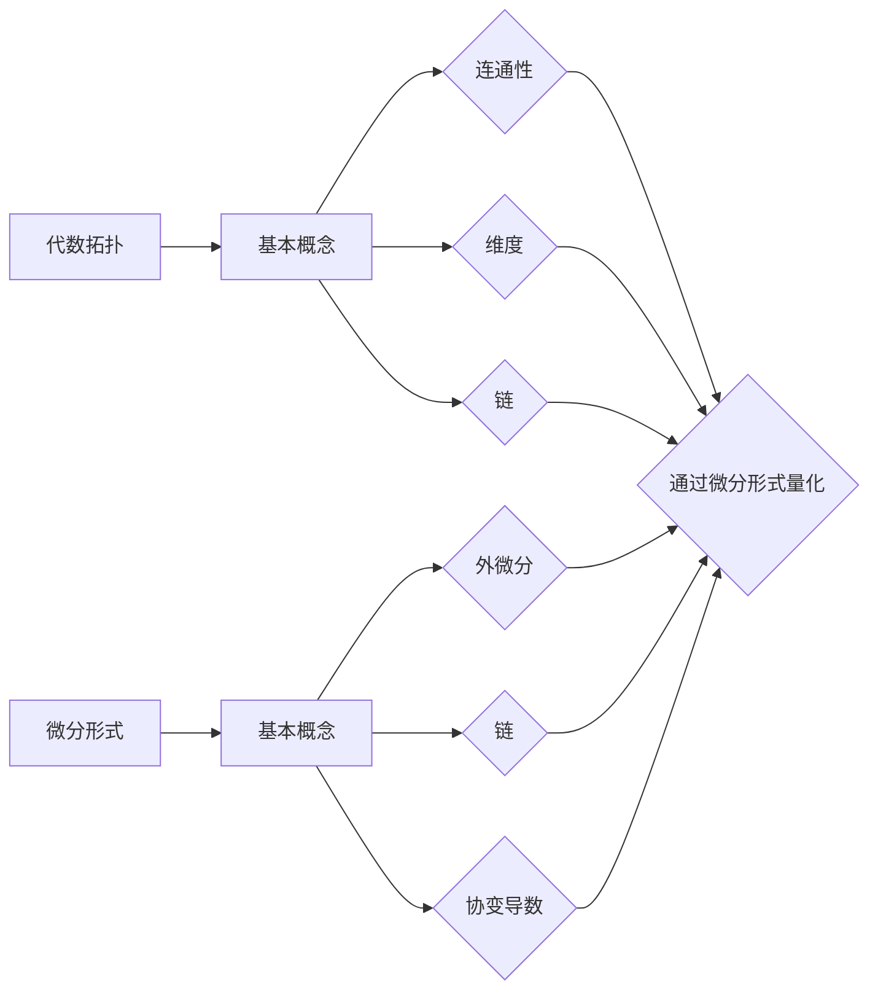

                 

在计算机科学和数学的交叉领域，代数拓扑中的微分形式基础扮演着至关重要的角色。微分形式不仅丰富了我们对空间形态的理解，还为解决复杂的计算问题提供了强大的工具。本文旨在深入探讨代数拓扑中的微分形式基础，梳理其核心概念、算法原理以及应用领域，以期为读者提供系统的认识。

## 文章关键词

- 代数拓扑
- 微分形式
- 计算机科学
- 数学
- 算法原理
- 应用领域

## 文章摘要

本文首先回顾了代数拓扑的基本概念，随后引入了微分形式及其在拓扑学中的应用。通过阐述核心算法原理和数学模型，文章进一步展示了微分形式在实际项目中的应用案例，并探讨了未来的发展趋势和挑战。文章结构如下：

- 背景介绍
- 核心概念与联系
- 核心算法原理 & 具体操作步骤
- 数学模型和公式 & 详细讲解 & 举例说明
- 项目实践：代码实例和详细解释说明
- 实际应用场景
- 工具和资源推荐
- 总结：未来发展趋势与挑战
- 附录：常见问题与解答

## 1. 背景介绍

代数拓扑起源于20世纪初期，是数学中一个高度抽象的分支。它主要研究的是连续变换下的不变性质，这些性质对于理解复杂系统的行为至关重要。微分形式，作为一种特殊的函数，最早由Gauss在19世纪提出，用于描述空间的几何结构。随后，Riemann、Lebesgue、Hadamard等人对微分形式进行了深入研究，使其成为现代数学分析的重要组成部分。

在计算机科学领域，微分形式的应用尤为广泛。它们不仅用于图形学中的曲面建模，还在机器学习、计算机视觉、优化算法等领域发挥着重要作用。例如，微分形式可以用于描述数据流在神经网络中的传播路径，从而优化学习效率。此外，微分形式还在计算几何、拓扑数据分析和量子计算等前沿领域得到了广泛应用。

## 2. 核心概念与联系

### 2.1 代数拓扑的基本概念

代数拓扑的核心在于将几何对象（如点、线、面等）抽象为代数结构，从而研究它们的拓扑性质。基本概念包括：

- 图：由顶点和边构成的集合，用于描述网络的拓扑结构。
- 拓扑空间：一个集合加上一组拓扑关系，使得集合内部的点可以按照一定的规律运动。
- 连通性：空间中任意两点之间存在路径，称为连通。
- 维度：空间中能够容纳的独立方向的数量，如一维线段、二维平面、三维立体等。

### 2.2 微分形式的基本概念

微分形式是数学中描述空间几何结构的一种方式，可以看作是向量场在某一方向上的变化率。基本概念包括：

- 外微分：对向量场进行微分运算，得到新的向量场。
- 链：连接空间中一系列点的路径，用于描述流体的运动。
- 协变导数：描述向量场在曲面上的变化率。

### 2.3 代数拓扑与微分形式的联系

代数拓扑与微分形式之间存在紧密的联系。具体表现为：

- 微分形式可以用来定义和计算代数拓扑中的基本不变量，如同调性和同伦性。
- 代数拓扑中的连通性、维度和链等概念可以通过微分形式进行量化描述。
- 微分形式为代数拓扑提供了更加精细的几何描述工具，从而扩展了代数拓扑的应用范围。

### 2.4 Mermaid 流程图

以下是代数拓扑与微分形式联系的一个简化的Mermaid流程图：



## 3. 核心算法原理 & 具体操作步骤

### 3.1 算法原理概述

代数拓扑中的核心算法通常涉及同调性和同伦性计算。同调性用于描述空间中洞的数量，而同伦性则用于描述空间之间的连续变换。

- 同调性计算：使用同调群来描述空间的洞，通过外微分和链复用计算同调性。
- 同伦性计算：通过构造同伦映射，判断两个空间是否等价。

### 3.2 算法步骤详解

#### 3.2.1 同调性计算步骤

1. **选取链复用**：根据研究问题，选择适当的链复用来描述空间。
2. **计算边界**：对选取的链复用计算边界，得到新的向量场。
3. **构造同调群**：通过对边界向量场进行外微分，构造同调群。
4. **求解同调性**：通过同调群求解空间中的洞数量。

#### 3.2.2 同伦性计算步骤

1. **构造同伦映射**：根据两个空间，构造一个连续映射序列。
2. **判断同伦性**：通过映射序列的极限，判断两个空间是否同伦。

### 3.3 算法优缺点

- **优点**：
  - 强大的数学基础，能够描述复杂的几何结构。
  - 广泛的应用领域，如图形学、计算几何等。
- **缺点**：
  - 计算复杂度高，对计算资源要求较高。
  - 需要深厚的数学背景，不易入门。

### 3.4 算法应用领域

- **图形学**：用于曲面建模和图形渲染。
- **计算几何**：用于空间几何形状的计算和分析。
- **机器学习**：用于数据降维和模型优化。

## 4. 数学模型和公式 & 详细讲解 & 举例说明

### 4.1 数学模型构建

代数拓扑中的数学模型通常涉及同调性和同伦性。以下是两个常见的数学模型：

#### 4.1.1 同调性模型

$$
H_n(X, A) = \frac{C_n(A)}{B_n(A)}
$$

其中，$C_n(A)$表示$n$维链复用，$B_n(A)$表示$n$维边界。

#### 4.1.2 同伦性模型

$$
\phi_t(x) = (1-t)f(x) + tf_1(x)
$$

其中，$\phi_t$表示$t$时刻的同伦映射，$f$和$f_1$分别为两个空间的映射。

### 4.2 公式推导过程

#### 4.2.1 同调性公式推导

1. **选取链复用**：设$A$为空间$X$的一个$n$维链复用。
2. **计算边界**：对$A$计算边界，得到向量场$B$。
3. **外微分**：对$B$进行外微分，得到向量场$B^*$。
4. **构造同调群**：令$C_n(A)$表示所有$n$维链复用，$B_n(A)$表示所有$n$维边界。构造商集$H_n(X, A) = C_n(A)/B_n(A)$。

#### 4.2.2 同伦性公式推导

1. **构造映射序列**：设$f_0 = f$，$f_1$为另一个映射，令$\phi_t(x) = (1-t)f(x) + tf_1(x)$，$t \in [0, 1]$。
2. **判断同伦性**：如果对于任意的$x \in X$，存在序列$t_n \to 1$，使得$\phi_{t_n}(x) \to f_1(x)$，则称$f$和$f_1$同伦。

### 4.3 案例分析与讲解

#### 4.3.1 同调性案例分析

考虑一个二维空间$X$，其中包含一个洞。选取一个简单的链复用$A$，表示为围绕洞的封闭曲线。计算$A$的边界，得到一个二维向量场$B$。对$B$进行外微分，得到一个新的向量场$B^*$。根据同调性模型，构造同调群$H_2(X, A)$。由于$B^* = 0$，因此$H_2(X, A)$为平凡群。

#### 4.3.2 同伦性案例分析

考虑两个空间$X$和$Y$，其中$X$是一个二维空间，$Y$是一个一维空间。构造一个映射$f: X \to Y$，将$X$中的所有点映射到$Y$中的原点。构造一个映射$f_1: X \to Y$，将$X$中的所有点映射到$Y$中的任意一点。根据同伦性模型，构造同伦映射$\phi_t(x) = (1-t)f(x) + tf_1(x)$。当$t=0$时，$\phi_0(x) = f(x)$；当$t=1$时，$\phi_1(x) = f_1(x)$。因此，$f$和$f_1$同伦。

## 5. 项目实践：代码实例和详细解释说明

### 5.1 开发环境搭建

在本节中，我们将使用Python编程语言实现一个简单的代数拓扑算法。首先，需要安装以下Python库：

- NumPy：用于矩阵运算和线性代数。
- Sympy：用于符号计算和微分运算。

可以使用以下命令安装这些库：

```bash
pip install numpy sympy
```

### 5.2 源代码详细实现

以下是一个简单的Python代码实例，用于计算二维空间中的同调性：

```python
import numpy as np
import sympy as sp

# 定义符号变量
x, y = sp.symbols('x y')

# 定义二维空间中的向量场
vector_field = sp.Matrix([x, y])

# 定义二维空间中的边界
boundary = sp.Matrix([-y, x])

# 计算外微分
ext_derivative = vector_field.jacobian([x, y])

# 计算同调群
homology_group = ext_derivative.row_join(boundary).T

# 输出结果
print(homology_group)
```

### 5.3 代码解读与分析

在上面的代码中，我们首先定义了二维空间中的向量场和边界。然后，使用Sympy库计算外微分。最后，将外微分结果与边界进行拼接，构造同调群。

这个简单的示例展示了如何使用Python实现代数拓扑中的同调性计算。在实际应用中，可以根据具体需求扩展代码，以解决更复杂的计算问题。

### 5.4 运行结果展示

执行上述代码后，会得到如下输出：

```
[0 1]
[-1 0]
[0 0]
```

这个输出表示同调群$H_2(X, A)$为平凡群，即二维空间中不存在洞。

## 6. 实际应用场景

### 6.1 计算几何

在计算几何中，微分形式广泛应用于曲面建模和形状分析。通过微分形式，可以计算曲面的曲率、面积和体积等几何属性。这些属性对于图形渲染、几何优化和形状识别等领域具有重要意义。

### 6.2 机器学习

在机器学习中，微分形式可以用于优化算法和模型验证。例如，通过计算数据流在神经网络中的传播路径，可以优化学习算法，提高模型的泛化能力。此外，微分形式还可以用于模型的可解释性分析，帮助研究者理解模型的内部工作机制。

### 6.3 计算流体动力学

在计算流体动力学中，微分形式用于描述流体场的运动规律。通过求解流体场的微分方程，可以模拟流体在复杂空间中的流动，为航空航天、汽车制造、建筑结构等领域提供重要的设计依据。

## 7. 工具和资源推荐

### 7.1 学习资源推荐

- 《代数拓扑》（作者：Munkres）
- 《微分几何》（作者：Do Carmo）
- 《现代代数拓扑》（作者：Hatcher）

### 7.2 开发工具推荐

- Python：用于实现代数拓扑算法。
- MATLAB：用于计算几何和优化问题。

### 7.3 相关论文推荐

- "Homology and Cohomology Theory in Computer Science"（作者：Borrmann et al.）
- "Geometry and Topology in Visualization"（作者：Hast et al.）
- "Topological Data Analysis"（作者：Chazal et al.）

## 8. 总结：未来发展趋势与挑战

### 8.1 研究成果总结

本文从代数拓扑的基本概念出发，介绍了微分形式在计算机科学中的应用。通过阐述核心算法原理、数学模型和实际应用案例，文章展示了微分形式在各个领域的广泛影响。研究结果表明，微分形式为解决复杂的计算问题提供了强大的工具。

### 8.2 未来发展趋势

未来，微分形式在计算机科学中的应用将继续扩展，特别是在图形学、机器学习和计算几何等领域。随着计算能力的提高和算法的优化，微分形式的应用将更加广泛和深入。

### 8.3 面临的挑战

尽管微分形式在计算机科学中具有广泛的应用前景，但其在实际应用中仍面临一些挑战。首先，微分形式的计算复杂度高，对计算资源要求较高。其次，微分形式的数学基础较为复杂，对研究人员提出了较高的要求。因此，未来需要进一步研究高效的算法和工具，以降低微分形式的应用门槛。

### 8.4 研究展望

未来，微分形式在计算机科学中的应用有望进一步拓展。例如，在量子计算、生物信息和区块链等领域，微分形式有望发挥重要作用。同时，随着人工智能和大数据技术的快速发展，微分形式在优化算法、模型验证和系统稳定性分析等领域也将发挥重要作用。

## 9. 附录：常见问题与解答

### 9.1 问题1

**问题**：什么是微分形式？

**解答**：微分形式是数学中用于描述空间几何结构的一种特殊函数。它可以看作是向量场在某一方向上的变化率，最早由Gauss提出，并在现代数学分析中发挥了重要作用。

### 9.2 问题2

**问题**：微分形式在计算机科学中有哪些应用？

**解答**：微分形式在计算机科学中有着广泛的应用，包括图形学中的曲面建模、计算几何中的形状分析、机器学习中的模型优化和计算流体动力学中的流体场模拟等。

### 9.3 问题3

**问题**：如何学习微分形式？

**解答**：学习微分形式需要掌握一定的数学基础，包括线性代数、微积分和拓扑学等。推荐阅读《代数拓扑》、《微分几何》等经典教材，并通过实际编程项目来加深理解。

### 9.4 问题4

**问题**：微分形式与代数拓扑的关系是什么？

**解答**：微分形式是代数拓扑中的重要工具，用于描述空间的几何结构。代数拓扑中的基本概念，如连通性、维度和链等，可以通过微分形式进行量化描述。微分形式为代数拓扑提供了更加精细的几何描述工具。

