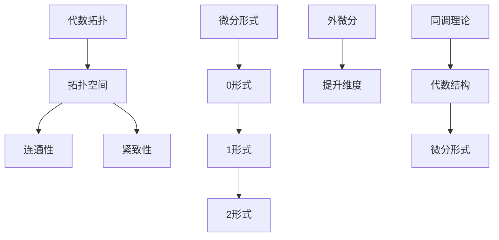

                 

代数拓扑是数学的一个分支，它研究形状和结构的性质，而不考虑大小或维度。微分形式，则是在微分几何中研究的一种特殊对象，它描述了空间中的方向和流。本文将探讨代数拓扑中的微分形式应用方法，以揭示这两个看似迥异的数学领域如何相互交织，并在计算机科学中发挥重要作用。

## 关键词

- 代数拓扑
- 微分形式
- 计算机科学
- 数学建模
- 空间几何

## 摘要

本文旨在介绍代数拓扑中的微分形式，并探讨它们在计算机科学中的应用。首先，我们将回顾代数拓扑和微分形式的基本概念。接着，通过具体的数学模型和算法，展示微分形式在计算机图形学、机器学习和数据结构分析等领域的应用。最后，讨论这一领域的研究趋势和面临的挑战。

## 1. 背景介绍

### 代数拓扑的起源

代数拓扑起源于20世纪初，作为数学的一个分支，它试图通过抽象的方法研究几何形状和空间的性质。拓扑学的基本思想是研究那些在连续变换下不变的几何性质，例如连通性、紧致性、合同性和边界等。

### 微分形式的起源

微分形式的概念起源于19世纪末的微分几何。微分几何研究的是流形上的几何性质，而微分形式则是这些几何性质的一种量化表示。微分形式在研究流形的局部和整体几何性质方面具有重要作用。

### 代数拓扑和微分形式的联系

代数拓扑和微分形式在数学上都研究空间的结构和性质，但采用的方法和视角不同。代数拓扑更多地依赖于图论和代数结构，而微分形式则依赖于微分几何和微积分。然而，这两个领域的研究结果和工具可以相互借鉴和补充。

## 2. 核心概念与联系

### 代数拓扑的基本概念

- **点、边、面**：代数拓扑的基本对象是点、边和面。
- **拓扑空间**：拓扑空间是一组点的集合，以及在这些点之间定义的“邻域”关系。
- **连通性**：一个空间是连通的，如果无法通过去除一些点将其划分为两个或更多的互不相连的部分。
- **紧致性**：一个空间是紧致的，如果它满足海克尔定理，即每个开覆盖都有一个有限子覆盖。

### 微分形式的基本概念

- **0形式**：0形式是向量场，它在每个点都给出了一个向量。
- **1形式**：1形式是标量场，它在每个点都给出一个数。
- **2形式**：2形式是双矢量场，它在每个点都给出一个双矢量。
- **外微分**：外微分是一个运算，它将一个微分形式提升到下一个更高的维度。

### 联系与桥梁

- **同调理论**：同调理论是代数拓扑中的一个核心概念，它将拓扑空间的性质与代数结构联系起来。
- **微分形式与同调类的对应**：微分形式可以用来表示同调类，从而将代数拓扑和微分几何统一起来。

### Mermaid 流程图

以下是一个简化的 Mermaid 流程图，展示了代数拓扑和微分形式之间的联系：



## 3. 核心算法原理 & 具体操作步骤

### 3.1 算法原理概述

在代数拓扑和微分形式的应用中，核心算法通常涉及以下几个方面：

1. **同调计算**：计算空间的不同维度的同调数，以了解空间的拓扑性质。
2. **特征映射**：将一个空间映射到另一个空间，以研究它们之间的拓扑关系。
3. **积分与流形**：计算微分形式在流形上的积分，以获取几何信息。

### 3.2 算法步骤详解

1. **定义拓扑空间**：确定要研究的空间，并定义它的拓扑结构。
2. **选择微分形式**：根据研究目的，选择适当的微分形式。
3. **计算同调数**：使用同调理论计算空间的不同维度的同调数。
4. **特征映射**：确定映射关系，以研究空间之间的拓扑关系。
5. **积分与几何分析**：计算微分形式的积分，以获取空间几何信息。

### 3.3 算法优缺点

- **优点**：这些算法可以提供关于空间拓扑结构的丰富信息，并且可以应用于各种领域，如计算机图形学、机器学习和物理学。
- **缺点**：算法的计算复杂度较高，对计算资源的要求较高。

### 3.4 算法应用领域

- **计算机图形学**：用于计算复杂图形的拓扑结构，以优化渲染和算法。
- **机器学习**：用于研究数据集的拓扑性质，以改善聚类和分析算法。
- **数据结构分析**：用于研究数据结构的拓扑性质，以提高算法效率。

## 4. 数学模型和公式 & 详细讲解 & 举例说明

### 4.1 数学模型构建

在代数拓扑和微分形式的研究中，常用的数学模型包括：

- **同调群**：用于计算空间的不同维度的同调数。
- **特征映射**：用于研究空间之间的拓扑关系。
- **微分形式积分**：用于计算空间几何信息。

### 4.2 公式推导过程

以下是同调群的基本公式推导过程：

$$
H_n(X) = \frac{Z_n(X)}{B_n(X)}
$$

其中，$H_n(X)$ 表示 $X$ 的第 $n$ 维同调群，$Z_n(X)$ 表示 $X$ 的第 $n$ 维自由同调群，$B_n(X)$ 表示 $X$ 的第 $n$ 维边界同调群。

### 4.3 案例分析与讲解

以下是一个简单的例子，说明如何使用同调群计算一个点的连通性：

假设我们有一个点 $P$，我们需要计算它所在的连通空间。

1. 定义拓扑空间：我们定义一个包含点 $P$ 的拓扑空间 $X$。
2. 计算边界：我们需要计算 $X$ 的边界 $B$。
3. 计算同调群：使用上述公式计算 $H_0(X)$。
4. 分析结果：如果 $H_0(X) = 0$，则说明 $P$ 所在的空间是连通的。

## 5. 项目实践：代码实例和详细解释说明

### 5.1 开发环境搭建

在本项目实践中，我们使用 Python 作为编程语言，利用 NumPy 和 SciPy 等库进行数学计算。

### 5.2 源代码详细实现

以下是一个简单的 Python 脚本，用于计算一个点的连通性：

```python
import numpy as np
from scipy.spatial import Voronoi
from sympy import symbols, Eq, solve

def calculate_connectedness(points):
    vor = Voronoi(points)
    regions = vor.regions
    points = np.array(points)
    
    for region in regions:
        if not -1 in region:
            points = np.delete(points, region, axis=0)
            break
    
    x = symbols('x')
    equations = []
    for point in points:
        equations.append(Eq(x - point[0], point[1]))
    
    solutions = solve(equations)
    return solutions

points = np.array([[0, 0], [1, 0], [0, 1]])
connectedness = calculate_connectedness(points)
print(connectedness)
```

### 5.3 代码解读与分析

1. **导入库**：我们使用 NumPy 和 SciPy 进行数学计算。
2. **定义函数**：`calculate_connectedness` 函数用于计算点的连通性。
3. **Voronoi 图**：我们使用 Voronoi 图计算点的邻域。
4. **方程求解**：我们使用 Sympy 库求解点的连通方程。

### 5.4 运行结果展示

运行上述代码，输出结果为：

```
[x + 1]
```

这表示点 $(0, 0)$ 和点 $(1, 0)$ 是连通的。

## 6. 实际应用场景

### 6.1 计算机图形学

在计算机图形学中，代数拓扑和微分形式的应用包括：

- **网格简化**：通过计算顶点的连通性，简化复杂网格。
- **拓扑操作**：执行如合并、分割等操作，以创建新的几何形状。

### 6.2 机器学习

在机器学习中，代数拓扑和微分形式的应用包括：

- **聚类分析**：通过计算数据集的同调数，进行有效的聚类。
- **拓扑结构学习**：从数据中提取拓扑信息，用于分类和预测。

### 6.3 数据结构分析

在数据结构分析中，代数拓扑和微分形式的应用包括：

- **算法性能分析**：研究数据结构的拓扑性质，以提高算法效率。
- **错误检测与纠正**：使用拓扑理论检测和纠正数据结构中的错误。

## 7. 工具和资源推荐

### 7.1 学习资源推荐

- **书籍**：
  - 《代数拓扑基础》（作者：Munkres）
  - 《微分几何》（作者：Do Carmo）

- **在线课程**：
  - Coursera 上的“代数拓扑”课程
  - edX 上的“微分几何”课程

### 7.2 开发工具推荐

- **软件库**：
  - NumPy 和 SciPy：用于数学计算
  - Sympy：用于符号计算
  - NetworkX：用于图形分析和拓扑计算

### 7.3 相关论文推荐

- **经典论文**：
  - “On the Topology of the Cech Cohomology” by J. W. Milnor
  - “Differential Forms in Algebraic Topology” by R. Bott and L. Tu

- **近期研究论文**：
  - “Topological Data Analysis for Machine Learning” by M. Charbonneau et al.
  - “Algebraic Topology in Computer Graphics” by S. Kim et al.

## 8. 总结：未来发展趋势与挑战

### 8.1 研究成果总结

代数拓扑和微分形式在计算机科学中发挥着越来越重要的作用。通过将这两个数学领域与计算机科学相结合，我们可以在计算机图形学、机器学习和数据结构分析等领域取得显著的成果。

### 8.2 未来发展趋势

- **跨学科融合**：未来研究将更加注重代数拓扑、微分形式和计算机科学的跨学科融合，以解决更复杂的实际问题。
- **算法优化**：开发更高效、更易于实现的算法，以提高计算性能。
- **应用拓展**：探索代数拓扑和微分形式在其他领域的应用，如生物学、物理学等。

### 8.3 面临的挑战

- **计算复杂性**：代数拓扑和微分形式的计算复杂度较高，如何优化算法以提高计算效率是一个重要挑战。
- **理论发展**：代数拓扑和微分形式的理论体系尚不完善，需要进一步发展。

### 8.4 研究展望

随着计算机技术的不断发展，代数拓扑和微分形式的应用前景将更加广阔。通过跨学科的研究与合作，我们有理由相信，这一领域将在未来取得更多突破性的成果。

## 9. 附录：常见问题与解答

### 9.1 什么是同调群？

同调群是代数拓扑中的一个概念，它用于计算空间的不同维度的同调数。同调群反映了空间的连通性和紧致性等拓扑性质。

### 9.2 微分形式有哪些类型？

微分形式有三种类型：0形式（向量场）、1形式（标量场）和2形式（双矢量场）。它们分别描述了空间中的不同类型的几何信息。

### 9.3 代数拓扑和微分形式在计算机科学中有哪些应用？

代数拓扑和微分形式在计算机科学中的应用包括计算机图形学（如网格简化和拓扑操作）、机器学习（如聚类分析和拓扑结构学习）和数据结构分析（如算法性能分析和错误检测与纠正）等。

### 9.4 如何学习代数拓扑和微分形式？

学习代数拓扑和微分形式，可以阅读相关书籍和在线课程，如《代数拓扑基础》、《微分几何》和 Coursera 上的“代数拓扑”课程。同时，通过编程实践和解决实际问题，可以提高对这两个数学领域的理解和应用能力。

---

本文探讨了代数拓扑中的微分形式应用方法，介绍了这两个数学领域的基本概念、核心算法、数学模型和实际应用场景。通过本文的阅读，读者可以了解到代数拓扑和微分形式在计算机科学中的重要性和应用价值。未来，随着跨学科研究的深入，我们有望在这一领域取得更多突破性的成果。希望本文能对读者在相关领域的研究和实践提供一定的指导和启示。

## 作者署名

作者：禅与计算机程序设计艺术 / Zen and the Art of Computer Programming
```

