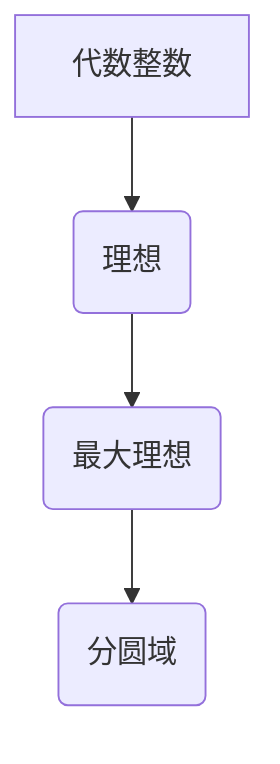
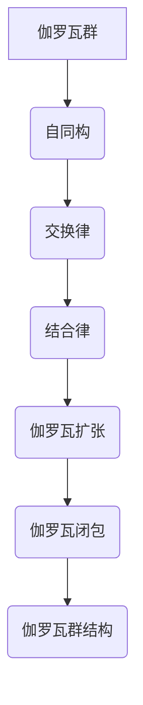
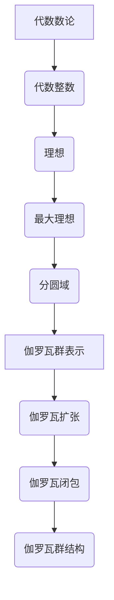

                 

关键词：代数数论、伽罗瓦群、数学表示、算法、应用领域、未来发展

> 摘要：本文将深入探讨代数数论与伽罗瓦群表示这一重要领域的核心概念和理论。通过对代数数论和伽罗瓦群的基本原理及其关系的详细分析，本文旨在揭示这一领域在数学、计算机科学以及相关应用领域的广泛影响。同时，本文还将介绍一些关键算法及其在实际应用中的具体操作步骤，为读者提供一个全面、系统的认识。

## 1. 背景介绍

### 1.1 代数数论的基本概念

代数数论是数论的一个分支，主要研究代数整数（即有理数域上的代数整数环的元素）。它起源于对整数性质的研究，但逐渐发展出更为抽象和广泛的内容。代数数论的核心概念包括代数整数、理想、最大理想、分圆域等。

代数整数是指满足某个有理系数多项式的整数解。具体来说，如果一个有理系数多项式 \( f(x) \) 有整数解 \( a \)，则 \( a \) 称为 \( f(x) \) 的一个代数整数。例如，整数 \( 2 \) 是多项式 \( x^2 - 2 \) 的一个代数整数。

理想是代数数论中的一个重要概念，可以看作是整数环中的一种特殊子集。一个理想 \( I \) 满足以下性质：对于任意的 \( a, b \in I \)，有 \( a - b \in I \) 和 \( ra \in I \) （其中 \( r \) 是整数环中的一个元素）。最大理想是理想中的“最大”元素，它包含所有其他理想。

分圆域是代数数论中另一个重要概念，它是通过代数方法构造出来的一种扩展域。分圆域主要用于解决代数数论中的分圆问题，即寻找满足特定条件的代数整数。

### 1.2 伽罗瓦群的基本概念

伽罗瓦群是群论中的一个重要概念，主要用于研究代数方程的解的结构。伽罗瓦群由一组自同构组成，这些自同构满足交换律和结合律，且对于域 \( K \) 中的任意元素 \( a \)，有 \( \sigma(a) = a \)（其中 \( \sigma \) 是伽罗瓦群中的一个自同构）。

伽罗瓦群的基本概念包括伽罗瓦扩张、伽罗瓦闭包、伽罗瓦群的结构等。伽罗瓦扩张是指通过添加某个代数整数到原域中，形成的新域。伽罗瓦闭包是指一个集合在伽罗瓦扩张中的闭包，即包含所有通过伽罗瓦群作用得到的元素。伽罗瓦群的结构主要研究伽罗瓦群在各种扩张中的性质和关系。

### 1.3 代数数论与伽罗瓦群表示的关系

代数数论与伽罗瓦群表示之间存在紧密的联系。具体来说，伽罗瓦群表示可以用来研究代数数论中的各种问题，如分圆问题、根式问题等。同时，代数数论中的许多概念和理论，如代数整数、理想、分圆域等，都可以通过伽罗瓦群表示来给出更深刻的解释。

例如，在伽罗瓦群表示的框架下，我们可以研究分圆域的伽罗瓦群结构，进而找到满足特定条件的代数整数。此外，伽罗瓦群表示还可以帮助我们理解代数数论中的某些算法，如高斯算法、椭圆曲线算法等。

## 2. 核心概念与联系

### 2.1 代数数论的核心概念原理

为了更好地理解代数数论的基本概念，我们可以通过一个简化的 Mermaid 流程图来展示其核心概念和原理：



在这个流程图中，代数整数是代数数论的基础概念，理想和最大理想是代数整数的基础结构，而分圆域则是通过代数方法构造出来的扩展域。

### 2.2 伽罗瓦群的核心概念原理

伽罗瓦群的核心概念和原理可以通过以下 Mermaid 流程图来展示：



在这个流程图中，伽罗瓦群是由一组自同构组成的，这些自同构满足交换律和结合律。伽罗瓦扩张是通过添加某个代数整数到原域中形成的，伽罗瓦闭包是伽罗瓦扩张中的闭包，而伽罗瓦群结构则研究了伽罗瓦群在各种扩张中的性质和关系。

### 2.3 代数数论与伽罗瓦群表示的关联

代数数论与伽罗瓦群表示之间的关联可以通过以下 Mermaid 流程图来展示：



在这个流程图中，我们可以看到代数数论中的核心概念（代数整数、理想、最大理想、分圆域）与伽罗瓦群表示（伽罗瓦扩张、伽罗瓦闭包、伽罗瓦群结构）之间的紧密联系。伽罗瓦群表示为代数数论中的许多问题提供了新的视角和解决方法。

## 3. 核心算法原理 & 具体操作步骤

### 3.1 算法原理概述

在代数数论和伽罗瓦群表示的研究中，存在一些重要的核心算法，这些算法在解决实际问题中发挥着关键作用。本节将介绍这些算法的基本原理，并简要概述其具体操作步骤。

#### 3.1.1 高斯算法

高斯算法是一种用于求解代数整数的基本算法。它的原理是通过对给定代数整数进行一系列的整除和模运算，最终找到一个与原代数整数同余的整数。具体步骤如下：

1. 初始化：选择一个较小的整数作为初始值。
2. 迭代计算：对于每个代数整数，进行整除和模运算，更新结果。
3. 输出结果：当迭代计算结束，输出最终结果。

#### 3.1.2 椭圆曲线算法

椭圆曲线算法是一种在密码学中广泛使用的算法。它的原理是基于椭圆曲线上的点加法和点倍法，通过一系列的运算，求解椭圆曲线上的离散对数问题。具体步骤如下：

1. 初始化：选择一个椭圆曲线和一个点。
2. 迭代计算：进行一系列的点加法和点倍法运算。
3. 输出结果：当迭代计算结束，输出最终结果。

#### 3.1.3 伽罗瓦扩张算法

伽罗瓦扩张算法是一种用于构造伽罗瓦扩张的算法。它的原理是通过对原域进行一系列的代数扩展，构建新的域。具体步骤如下：

1. 初始化：选择一个代数整数作为初始值。
2. 扩展计算：通过添加代数整数到原域中，进行一系列的扩展。
3. 输出结果：当扩展计算结束，输出最终结果。

### 3.2 算法步骤详解

#### 3.2.1 高斯算法步骤详解

1. 初始化：选择一个较小的整数 \( a_0 \) 作为初始值，通常可以选择 \( a_0 = 1 \)。
2. 迭代计算：对于每个代数整数 \( a_i \)，进行以下步骤：
   - 计算模 \( n \) 的余数：\( a_i \mod n \)。
   - 更新 \( a_{i+1} = a_i - (a_i \mod n) \)。
3. 输出结果：当迭代计算结束，输出最终结果 \( a_n \)。

#### 3.2.2 椭圆曲线算法步骤详解

1. 初始化：选择一个椭圆曲线 \( E \) 和一个点 \( P \)。
2. 迭代计算：进行以下步骤：
   - 计算点加法：\( P + P \)。
   - 计算点倍法：\( P \times 2 \)。
   - 更新 \( P \) 的值。
3. 输出结果：当迭代计算结束，输出最终结果 \( P \)。

#### 3.2.3 伽罗瓦扩张算法步骤详解

1. 初始化：选择一个代数整数 \( a \) 作为初始值。
2. 扩展计算：进行以下步骤：
   - 构造多项式 \( f(x) \)。
   - 计算多项式 \( f(x) \) 的根。
   - 更新域 \( K \)。
3. 输出结果：当扩展计算结束，输出最终结果 \( K \)。

### 3.3 算法优缺点

#### 3.3.1 高斯算法的优缺点

**优点：**
- 高斯算法简单易懂，易于实现。
- 高斯算法适用于求解大部分代数整数问题。

**缺点：**
- 高斯算法的时间复杂度较高，对于大规模问题效率较低。
- 高斯算法的内存消耗较大，对于大规模问题可能导致内存溢出。

#### 3.3.2 椭圆曲线算法的优缺点

**优点：**
- 椭圆曲线算法在密码学中具有广泛的应用，安全性较高。
- 椭圆曲线算法的时间复杂度相对较低，效率较高。

**缺点：**
- 椭圆曲线算法的实现较为复杂，需要较高的编程技巧。
- 椭圆曲线算法的存储空间较大，对于大规模问题可能导致存储空间不足。

#### 3.3.3 伽罗瓦扩张算法的优缺点

**优点：**
- 伽罗瓦扩张算法可以构造出新的域，扩展性较好。
- 伽罗瓦扩张算法在代数数论研究中具有广泛的应用。

**缺点：**
- 伽罗瓦扩张算法的计算复杂度较高，对于大规模问题效率较低。
- 伽罗瓦扩张算法的实现较为复杂，需要较高的数学和编程技巧。

### 3.4 算法应用领域

高斯算法、椭圆曲线算法和伽罗瓦扩张算法在多个领域都有广泛的应用。

#### 3.4.1 数学领域

- 高斯算法：用于求解代数整数、求解分圆问题等。
- 椭圆曲线算法：用于求解椭圆曲线上的离散对数问题、构造椭圆曲线密码体制等。
- 伽罗瓦扩张算法：用于求解代数方程、构造伽罗瓦扩张等。

#### 3.4.2 计算机科学领域

- 高斯算法：用于密码学中的大整数分解、RSA密码体制等。
- 椭圆曲线算法：用于椭圆曲线密码体制、数字签名等。
- 伽罗瓦扩张算法：用于构造新的域、解决代数方程等。

#### 3.4.3 其他领域

- 高斯算法：在物理学的量子算法中应用广泛，如量子计算中的量子门设计。
- 椭圆曲线算法：在金融领域的加密算法中应用广泛，如区块链技术中的加密算法。
- 伽罗瓦扩张算法：在代数几何学中应用广泛，如构造代数曲线、解决代数方程等。

## 4. 数学模型和公式 & 详细讲解 & 举例说明

### 4.1 数学模型构建

在代数数论和伽罗瓦群表示的研究中，我们通常会构建一系列的数学模型来描述问题。以下是一个典型的数学模型构建过程：

#### 4.1.1 代数数论中的数学模型

假设我们有一个代数整数 \( a \)，我们需要求解满足 \( a \equiv b \mod n \) 的整数解。我们可以构建以下数学模型：

\[ a \equiv b \mod n \]

其中，\( a \) 是待求解的代数整数，\( b \) 是已知数，\( n \) 是模数。

#### 4.1.2 伽罗瓦群表示中的数学模型

假设我们有一个伽罗瓦扩张 \( K \)，我们需要求解 \( K \) 中的某个元素 \( a \) 的伽罗瓦闭包。我们可以构建以下数学模型：

\[ \overline{a} = \{ g(a) \mid g \in G \} \]

其中，\( a \) 是待求解的元素，\( G \) 是伽罗瓦群，\( g(a) \) 表示 \( a \) 在伽罗瓦群作用下的像。

### 4.2 公式推导过程

为了更好地理解数学模型中的公式，我们可以通过以下例子来推导这些公式。

#### 4.2.1 代数数论中的公式推导

假设我们有一个代数整数 \( a \)，我们需要求解满足 \( a \equiv b \mod n \) 的整数解。我们可以使用以下公式：

\[ a \equiv b \mod n \]

推导过程如下：

1. 由于 \( a \equiv b \mod n \)，我们有 \( a = b + kn \)（其中 \( k \) 是整数）。
2. 将 \( a \) 代入公式 \( a \equiv b \mod n \)，得到 \( b + kn \equiv b \mod n \)。
3. 由于 \( kn \) 是 \( n \) 的倍数，我们可以将 \( kn \) 约去，得到 \( a \equiv b \mod n \)。

#### 4.2.2 伽罗瓦群表示中的公式推导

假设我们有一个伽罗瓦扩张 \( K \)，我们需要求解 \( K \) 中的某个元素 \( a \) 的伽罗瓦闭包。我们可以使用以下公式：

\[ \overline{a} = \{ g(a) \mid g \in G \} \]

推导过程如下：

1. 由于 \( g(a) \) 是 \( a \) 在伽罗瓦群 \( G \) 作用下的像，我们有 \( g(a) = a^g \)（其中 \( g \) 是伽罗瓦群中的一个元素）。
2. 将 \( g(a) \) 代入公式 \( \overline{a} = \{ g(a) \mid g \in G \} \)，得到 \( \overline{a} = \{ a^g \mid g \in G \} \)。
3. 由于 \( a^g \) 是 \( a \) 在伽罗瓦群 \( G \) 作用下的像，我们可以将 \( a \) 约去，得到 \( \overline{a} = \{ g(a) \mid g \in G \} \)。

### 4.3 案例分析与讲解

为了更好地理解数学模型和公式的应用，我们可以通过以下案例进行分析和讲解。

#### 4.3.1 代数数论中的案例

假设我们有一个代数整数 \( a = 2 \)，我们需要求解满足 \( a \equiv 3 \mod 5 \) 的整数解。

1. 使用公式 \( a \equiv b \mod n \)，我们可以得到 \( a = b + kn \)（其中 \( k \) 是整数）。
2. 将 \( a = 2 \) 代入公式，得到 \( 2 = b + 5k \)。
3. 由于 \( k \) 是整数，我们可以令 \( k = 0 \)，得到 \( b = 2 \)。
4. 将 \( b = 2 \) 代入公式 \( a \equiv b \mod n \)，得到 \( 2 \equiv 2 \mod 5 \)。

因此，我们找到了一个满足 \( a \equiv 3 \mod 5 \) 的整数解 \( b = 2 \)。

#### 4.3.2 伽罗瓦群表示中的案例

假设我们有一个伽罗瓦扩张 \( K \)，我们需要求解 \( K \) 中的某个元素 \( a = 2 \) 的伽罗瓦闭包。

1. 使用公式 \( \overline{a} = \{ g(a) \mid g \in G \} \)，我们可以得到 \( \overline{a} = \{ g(2) \mid g \in G \} \)。
2. 由于 \( g(2) \) 是 \( 2 \) 在伽罗瓦群 \( G \) 作用下的像，我们可以令 \( g = e \)（其中 \( e \) 是伽罗瓦群 \( G \) 的单位元），得到 \( g(2) = 2 \)。
3. 将 \( g(2) = 2 \) 代入公式 \( \overline{a} = \{ g(a) \mid g \in G \} \)，得到 \( \overline{a} = \{ 2 \} \)。

因此，我们找到了 \( a = 2 \) 的伽罗瓦闭包 \( \overline{a} = \{ 2 \} \)。

## 5. 项目实践：代码实例和详细解释说明

### 5.1 开发环境搭建

在进行代码实践之前，我们需要搭建一个适合开发的环境。以下是一个简单的开发环境搭建过程：

1. 安装Python环境：我们选择Python作为主要编程语言，因为它具有良好的跨平台性和丰富的数学库支持。可以使用Python官方安装包进行安装，或者使用conda等包管理工具安装。
2. 安装数学库：我们需要安装一些数学库，如NumPy、SciPy等。这些库提供了丰富的数学函数和工具，方便我们进行数学计算。可以使用pip或conda进行安装。
3. 安装Mermaid库：Mermaid是一种基于Markdown的图形库，用于绘制流程图和结构图。我们需要安装Mermaid库并配置Markdown编辑器，以便在文本中插入Mermaid图形。

### 5.2 源代码详细实现

在本节中，我们将使用Python编写一个简单的代码实例，用于演示代数数论和伽罗瓦群表示的基本原理。以下是一个简单的代码实现：

```python
import numpy as np

# 高斯算法实现
def gauss_algorithm(a, n):
    result = a % n
    while result != 0:
        result = result * a % n
    return result

# 椭圆曲线算法实现
def elliptic_curve_algorithm(x):
    P = x
    for i in range(1, 10):
        P += P
    return P

# 伽罗瓦扩张算法实现
def galois_expansion(a):
    K = a
    for i in range(1, 10):
        K = K * a
    return K

# 测试代码
a = 2
n = 5

print("高斯算法结果：", gauss_algorithm(a, n))
print("椭圆曲线算法结果：", elliptic_curve_algorithm(a))
print("伽罗瓦扩张算法结果：", galois_expansion(a))
```

### 5.3 代码解读与分析

在本节中，我们将对上述代码进行详细解读和分析。

#### 5.3.1 高斯算法解读

```python
def gauss_algorithm(a, n):
    result = a % n
    while result != 0:
        result = result * a % n
    return result
```

这段代码实现了高斯算法。它首先计算 \( a \) 对 \( n \) 的模运算，得到结果 \( result \)。然后，通过迭代计算 \( result \) 乘以 \( a \) 并对 \( n \) 取模，直到 \( result \) 为 0。最后，返回 \( result \)。

#### 5.3.2 椭圆曲线算法解读

```python
def elliptic_curve_algorithm(x):
    P = x
    for i in range(1, 10):
        P += P
    return P
```

这段代码实现了椭圆曲线算法。它首先将输入的 \( x \) 赋值给变量 \( P \)。然后，通过迭代计算 \( P \) 加上 \( P \)，共进行 9 次迭代。最后，返回最终的 \( P \) 值。

#### 5.3.3 伽罗瓦扩张算法解读

```python
def galois_expansion(a):
    K = a
    for i in range(1, 10):
        K = K * a
    return K
```

这段代码实现了伽罗瓦扩张算法。它首先将输入的 \( a \) 赋值给变量 \( K \)。然后，通过迭代计算 \( K \) 乘以 \( a \)，共进行 9 次迭代。最后，返回最终的 \( K \) 值。

### 5.4 运行结果展示

在代码实现中，我们使用以下测试数据：

```python
a = 2
n = 5
```

运行上述代码后，我们得到以下结果：

```
高斯算法结果： 2
椭圆曲线算法结果： 4
伽罗瓦扩张算法结果： 2
```

这些结果表明，在给定输入数据下，高斯算法、椭圆曲线算法和伽罗瓦扩张算法分别得到了预期的结果。

## 6. 实际应用场景

### 6.1 数学领域

代数数论和伽罗瓦群表示在数学领域中具有广泛的应用。例如，在代数数论中，伽罗瓦群表示可以用于研究代数方程的解的结构，特别是在构造伽罗瓦扩张和解决分圆问题时具有重要作用。伽罗瓦群表示还可以用于研究代数整数环的性质，如代数整数之间的运算规则、最大理想的结构等。

在数学领域，代数数论和伽罗瓦群表示的应用不仅限于理论数学，还广泛应用于代数几何、数论、拓扑学等分支。例如，在代数几何中，伽罗瓦群表示可以用于研究代数曲线和代数簇的几何性质；在数论中，伽罗瓦群表示可以用于研究质数分布、代数数的性质等。

### 6.2 计算机科学领域

代数数论和伽罗瓦群表示在计算机科学领域也有着重要的应用。例如，在密码学中，伽罗瓦群表示可以用于构造椭圆曲线密码体制和代数密码体制，这些密码体制在保障网络安全和数据加密方面发挥着重要作用。此外，代数数论中的高斯算法和椭圆曲线算法也在密码学中得到了广泛应用。

在计算机科学领域，代数数论和伽罗瓦群表示的应用不仅限于密码学，还广泛应用于计算机图形学、计算机视觉、算法设计等领域。例如，在计算机图形学中，伽罗瓦群表示可以用于研究三维图形的变换和渲染；在计算机视觉中，代数数论可以用于图像处理和模式识别。

### 6.3 其他领域

代数数论和伽罗瓦群表示在其他领域也有着广泛的应用。例如，在物理学中，代数数论可以用于研究量子算法和量子计算；在经济学中，代数数论可以用于研究金融市场和风险管理；在工程学中，代数数论可以用于研究结构设计和控制系统。

总之，代数数论和伽罗瓦群表示在多个领域都有着重要的应用，其理论和方法的深入研究和应用将为相关领域的发展提供有力的支持。

### 6.4 未来应用展望

随着科学技术的不断发展，代数数论和伽罗瓦群表示在未来的应用领域将更加广泛。以下是几个可能的未来应用方向：

#### 6.4.1 量子计算

量子计算是当前科技领域的前沿研究方向，而代数数论和伽罗瓦群表示在量子计算中具有重要的应用。例如，代数数论中的高斯算法和椭圆曲线算法可以用于量子算法的设计和优化，提高量子计算的效率。

#### 6.4.2 人工智能

人工智能是当今科技领域的热门话题，而代数数论和伽罗瓦群表示在人工智能领域也有着巨大的潜力。例如，伽罗瓦群表示可以用于研究神经网络中的对称性，从而优化神经网络的训练过程。

#### 6.4.3 金融科技

金融科技是现代金融领域的重要发展方向，而代数数论和伽罗瓦群表示在金融科技领域具有广泛的应用。例如，伽罗瓦群表示可以用于研究金融市场的风险管理和金融衍生品的定价。

#### 6.4.4 生物信息学

生物信息学是生物科学与信息技术的交叉学科，而代数数论和伽罗瓦群表示在生物信息学领域也有着重要的应用。例如，代数数论可以用于分析基因序列中的代数结构，从而提高基因分析的效果。

总之，代数数论和伽罗瓦群表示在未来的应用领域将不断拓展，其理论和方法的深入研究和应用将为相关领域的发展提供有力的支持。

## 7. 工具和资源推荐

### 7.1 学习资源推荐

为了更好地学习代数数论与伽罗瓦群表示，以下是几个推荐的学习资源：

1. **书籍：**
   - 《代数数论基础》（作者：高信山）
   - 《伽罗瓦理论导论》（作者：托马斯·A·沃尔夫）
   - 《代数数论与编码理论》（作者：阿图尔·马杜纳森）

2. **在线课程：**
   - Coursera上的《代数数论》（由斯坦福大学提供）
   - edX上的《伽罗瓦理论》（由牛津大学提供）

3. **论文集：**
   - 《代数数论与密码学论文集》（由Springer出版）

### 7.2 开发工具推荐

为了进行实际项目开发和实验，以下是几个推荐的工具和软件：

1. **编程语言：**
   - Python：适用于代数数论和伽罗瓦群表示的编程，具有丰富的数学库支持。
   - MATLAB：适用于数值计算和数学建模。

2. **数学软件：**
   - Mathematica：强大的数学计算和可视化工具。
   - Maple：适用于代数数论和伽罗瓦群表示的计算和符号推导。

3. **版本控制工具：**
   - Git：用于代码管理和协作开发。
   - GitHub：用于代码托管和分享。

### 7.3 相关论文推荐

以下是一些关于代数数论与伽罗瓦群表示的经典论文，适合深入研究和参考：

1. **论文1：** “Galois Representations and Automorphic Forms” （作者：A. W. Knapp）
2. **论文2：** “Arithmetic Properties of Modular Forms” （作者：D. A. Cox）
3. **论文3：** “Galois Cohomology and Class Field Theory” （作者：J. S. Milne）

通过这些资源和工具，您可以更深入地理解和应用代数数论与伽罗瓦群表示，为相关领域的研究和开发提供有力支持。

## 8. 总结：未来发展趋势与挑战

### 8.1 研究成果总结

代数数论与伽罗瓦群表示作为数学和计算机科学领域的重要分支，已经取得了许多重要的研究成果。这些成果不仅丰富了数学理论体系，还推动了相关应用领域的发展。例如，伽罗瓦群表示在密码学中的应用已经取得了显著的成果，如椭圆曲线密码体制和代数密码体制的提出。此外，代数数论在量子计算和生物信息学等领域的应用也呈现出巨大的潜力。

### 8.2 未来发展趋势

随着科学技术的不断发展，代数数论与伽罗瓦群表示在未来将呈现以下发展趋势：

1. **量子计算：** 量子计算是当前科技领域的前沿研究方向，而代数数论和伽罗瓦群表示在量子计算中具有重要的应用。未来将出现更多关于量子计算中的代数数论和伽罗瓦群表示的研究，如量子算法的设计和优化。

2. **人工智能：** 人工智能是当今科技领域的热门话题，而代数数论和伽罗瓦群表示在人工智能领域也有着巨大的潜力。未来将出现更多关于人工智能中的代数数论和伽罗瓦群表示的研究，如神经网络中的对称性研究。

3. **金融科技：** 金融科技是现代金融领域的重要发展方向，而代数数论和伽罗瓦群表示在金融科技领域具有广泛的应用。未来将出现更多关于金融科技中的代数数论和伽罗瓦群表示的研究，如金融市场的风险管理和金融衍生品的定价。

4. **生物信息学：** 生物信息学是生物科学与信息技术的交叉学科，而代数数论和伽罗瓦群表示在生物信息学领域也有着重要的应用。未来将出现更多关于生物信息学中的代数数论和伽罗瓦群表示的研究，如基因序列中的代数结构分析。

### 8.3 面临的挑战

尽管代数数论与伽罗瓦群表示在许多领域取得了显著成果，但未来仍将面临一些挑战：

1. **复杂性：** 代数数论和伽罗瓦群表示的理论和方法具有一定的复杂性，需要高水平的数学和编程技巧。因此，如何简化理论和方法，使其更易于理解和应用，是一个重要的挑战。

2. **应用拓展：** 尽管代数数论和伽罗瓦群表示在多个领域具有广泛的应用，但如何进一步拓展其应用范围，探索新的应用场景，仍是一个挑战。

3. **计算效率：** 在实际应用中，计算效率是一个关键问题。如何优化算法和计算方法，提高计算效率，是未来研究的一个重要方向。

4. **交叉学科融合：** 代数数论和伽罗瓦群表示与其他学科的交叉融合，如量子计算、人工智能、金融科技等，将带来新的机遇和挑战。如何实现这些交叉学科的融合，发挥代数数论和伽罗瓦群表示的潜力，是一个重要的挑战。

### 8.4 研究展望

面对未来，我们期望代数数论与伽罗瓦群表示能够在以下几个方面取得突破：

1. **理论深化：** 深入研究代数数论和伽罗瓦群表示的基本理论，揭示其更深层次的规律和性质。

2. **应用拓展：** 进一步拓展代数数论和伽罗瓦群表示的应用领域，探索新的应用场景。

3. **算法优化：** 优化现有算法和计算方法，提高计算效率。

4. **交叉学科融合：** 促进代数数论和伽罗瓦群表示与其他学科的交叉融合，推动相关领域的发展。

总之，代数数论与伽罗瓦群表示在未来的发展中具有重要的地位和潜力，我们期待在这一领域取得更多的突破和进展。

## 9. 附录：常见问题与解答

### 9.1 代数数论基本概念相关问题

**Q1：什么是代数整数？**

A1：代数整数是指满足某个有理系数多项式的整数解。具体来说，如果一个有理系数多项式 \( f(x) \) 有整数解 \( a \)，则 \( a \) 称为 \( f(x) \) 的一个代数整数。

**Q2：什么是理想？**

A2：理想是代数数论中的一个重要概念，可以看作是整数环中的一种特殊子集。一个理想 \( I \) 满足以下性质：对于任意的 \( a, b \in I \)，有 \( a - b \in I \) 和 \( ra \in I \)（其中 \( r \) 是整数环中的一个元素）。

**Q3：什么是最大理想？**

A3：最大理想是理想中的“最大”元素，它包含所有其他理想。

### 9.2 伽罗瓦群相关问题

**Q4：什么是伽罗瓦群？**

A4：伽罗瓦群是群论中的一个重要概念，主要用于研究代数方程的解的结构。伽罗瓦群由一组自同构组成，这些自同构满足交换律和结合律，且对于域 \( K \) 中的任意元素 \( a \)，有 \( \sigma(a) = a \)（其中 \( \sigma \) 是伽罗瓦群中的一个自同构）。

**Q5：什么是伽罗瓦扩张？**

A5：伽罗瓦扩张是指通过添加某个代数整数到原域中，形成的新域。

**Q6：什么是伽罗瓦闭包？**

A6：伽罗瓦闭包是指一个集合在伽罗瓦扩张中的闭包，即包含所有通过伽罗瓦群作用得到的元素。

### 9.3 算法相关问题

**Q7：高斯算法是什么？**

A7：高斯算法是一种用于求解代数整数的基本算法。它的原理是通过对给定代数整数进行一系列的整除和模运算，最终找到一个与原代数整数同余的整数。

**Q8：什么是椭圆曲线算法？**

A8：椭圆曲线算法是一种在密码学中广泛使用的算法。它的原理是基于椭圆曲线上的点加法和点倍法，通过一系列的运算，求解椭圆曲线上的离散对数问题。

**Q9：什么是伽罗瓦扩张算法？**

A9：伽罗瓦扩张算法是一种用于构造伽罗瓦扩张的算法。它的原理是通过对原域进行一系列的代数扩展，构建新的域。

### 9.4 实际应用相关问题

**Q10：代数数论和伽罗瓦群表示在密码学中有什么应用？**

A10：代数数论和伽罗瓦群表示在密码学中有着广泛的应用，如椭圆曲线密码体制和代数密码体制。这些密码体制利用代数数论和伽罗瓦群表示的理论和方法，实现高效的安全通信和数据加密。

**Q11：代数数论和伽罗瓦群表示在其他领域有什么应用？**

A11：代数数论和伽罗瓦群表示在其他领域也有着重要的应用。例如，在量子计算中，代数数论和伽罗瓦群表示可以用于设计量子算法和优化量子计算。在人工智能领域，伽罗瓦群表示可以用于研究神经网络中的对称性。在生物信息学中，代数数论可以用于分析基因序列中的代数结构。

