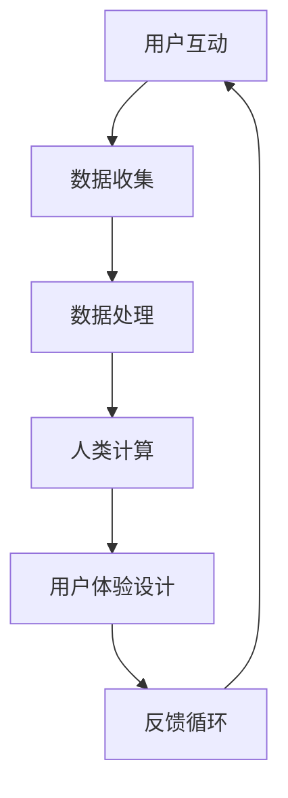
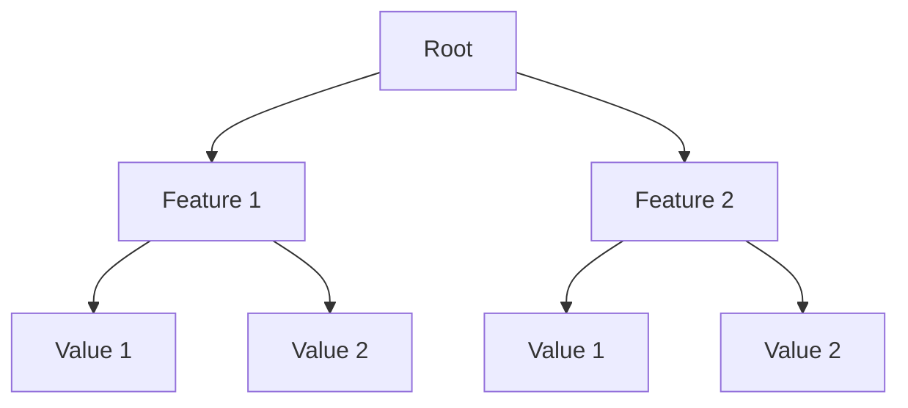
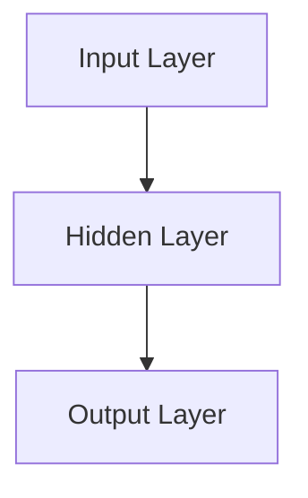

                 

关键词：客户体验、人类计算、以人为本、计算心理学、用户体验设计

> 摘要：本文将深入探讨如何通过人类计算改善客户体验。我们将从以人为本的设计原则出发，分析人类计算的核心概念，探讨其在用户体验设计中的应用，并展示一系列实际案例，以证明人类计算在提升客户满意度方面的巨大潜力。最后，我们将展望未来，讨论人类计算的发展趋势和面临的挑战。

## 1. 背景介绍

在当今数字时代，客户体验（Customer Experience，简称CX）已成为企业竞争的关键因素。越来越多的公司开始意识到，仅仅提供高质量的产品或服务已经不够，客户期望更加个性化的互动和体验。为了满足这种需求，企业需要利用先进的技术，尤其是人工智能（AI）和人类计算（Human-in-the-Loop，简称HITL），来优化客户体验。

### 什么是客户体验？

客户体验是指客户在与企业互动的整个过程中所获得的整体感受。这个过程不仅包括购买前、购买中和购买后的互动，还包括客户对企业品牌和价值观的认知。客户体验的成功取决于多个因素，包括服务质量、响应速度、互动质量等。

### 人类计算与客户体验

人类计算是一种结合人类与机器智能的方法，旨在提高系统性能和用户体验。在客户体验方面，人类计算可以通过以下几个方面改善：

1. **个性化和定制化**：通过分析用户数据，人类计算可以提供更加个性化的服务和推荐。
2. **交互质量**：人类计算可以模拟人类交流方式，使交互更加自然和高效。
3. **实时反馈**：人类计算可以帮助企业实时了解客户需求和反馈，从而快速做出调整。

## 2. 核心概念与联系

为了更好地理解人类计算如何改善客户体验，我们需要首先了解几个核心概念：

### 2.1 人类计算

人类计算是一种将人类专家的知识和判断力引入到计算过程的方法。这种方法不仅利用了机器的计算能力，还结合了人类的专业知识和创造力。在客户体验方面，人类计算可以通过以下方式发挥作用：

- **数据分析**：人类专家可以帮助理解和解释数据，从而发现隐藏的模式和趋势。
- **决策支持**：在复杂的决策过程中，人类计算可以提供专家意见，帮助优化决策。

### 2.2 用户体验设计

用户体验设计（User Experience Design，简称UXD）是一种以用户为中心的设计方法，旨在提升用户在使用产品或服务时的整体体验。用户体验设计包括以下几个方面：

- **可用性**：产品是否易于使用和理解。
- **可访问性**：产品是否能够满足不同用户的需求，包括残疾用户。
- **美观性**：产品的视觉设计和用户界面是否美观。

### 2.3 计算心理学

计算心理学是心理学与计算机科学交叉的领域，研究人类与计算机交互时的心理和行为。在客户体验方面，计算心理学可以帮助我们了解用户在使用产品时的情感和心理反应，从而优化设计。

### 2.4 Mermaid 流程图

以下是人类计算改善客户体验的 Mermaid 流程图：



在这个流程图中，用户互动产生数据，这些数据经过处理和分析后，通过人类计算转化为用户体验设计，最终形成反馈循环，不断优化和改进客户体验。

## 3. 核心算法原理 & 具体操作步骤

### 3.1 算法原理概述

人类计算的核心算法原理是基于机器学习和人工智能的。具体来说，它包括以下几个步骤：

1. **数据收集**：收集用户在互动过程中产生的数据，如行为数据、偏好数据等。
2. **数据处理**：对收集到的数据进行清洗、归一化和特征提取。
3. **模型训练**：利用机器学习算法，如决策树、神经网络等，训练模型，以便预测用户的行为和偏好。
4. **人类计算**：将模型预测结果与人类专家的判断相结合，优化决策过程。
5. **用户体验设计**：根据人类计算的结果，设计符合用户需求的产品或服务。
6. **反馈循环**：收集用户反馈，不断调整和优化设计。

### 3.2 算法步骤详解

以下是人类计算改善客户体验的具体步骤：

1. **数据收集**：企业可以通过各种方式收集用户数据，如用户调查、用户行为跟踪等。这些数据可以包括用户的购买历史、浏览行为、偏好设置等。

2. **数据处理**：对收集到的数据进行预处理，包括数据清洗、归一化和特征提取。这一步的目的是将原始数据转化为适合模型训练的形式。

3. **模型训练**：选择合适的机器学习算法，如决策树、神经网络等，对处理后的数据进行训练。训练过程包括数据划分、模型选择、参数调优等。

4. **人类计算**：在模型训练完成后，人类专家可以参与对模型的评估和调整。人类专家可以根据自己的经验和专业知识，对模型的预测结果进行验证和优化。

5. **用户体验设计**：根据人类计算的结果，设计符合用户需求的产品或服务。用户体验设计需要考虑用户的需求、偏好和行为，以确保产品或服务能够满足用户的需求。

6. **反馈循环**：在用户体验产品或服务后，企业可以收集用户反馈，了解用户的使用体验和需求。这些反馈可以用来不断调整和优化设计，以进一步提高客户体验。

### 3.3 算法优缺点

**优点**：

- **个性化**：人类计算可以根据用户的数据和行为，提供个性化的推荐和服务。
- **实时性**：人类计算可以实时分析用户数据，提供即时的反馈和调整。
- **灵活性**：人类计算可以根据用户反馈和需求，灵活调整产品或服务的设计。

**缺点**：

- **成本**：人类计算需要大量的人力资源和时间成本。
- **准确性**：机器学习模型的预测准确性取决于数据质量和算法选择。

### 3.4 算法应用领域

人类计算在客户体验中的应用非常广泛，以下是一些典型领域：

- **电子商务**：通过分析用户行为，提供个性化的推荐和服务。
- **客户服务**：通过实时数据分析，提供高效的客户支持和服务。
- **社交媒体**：通过分析用户互动数据，优化内容推荐和广告投放。

## 4. 数学模型和公式 & 详细讲解 & 举例说明

### 4.1 数学模型构建

在人类计算中，常用的数学模型包括线性回归、决策树、神经网络等。以下是这些模型的简单介绍：

**线性回归**：用于预测一个连续变量的值，其基本公式为：

$$
y = \beta_0 + \beta_1x_1 + \beta_2x_2 + ... + \beta_nx_n
$$

其中，$y$ 是预测值，$x_1, x_2, ..., x_n$ 是输入特征，$\beta_0, \beta_1, ..., \beta_n$ 是模型参数。

**决策树**：用于分类和回归问题，其基本结构如下：



**神经网络**：用于复杂的数据分析和预测，其基本结构如下：



### 4.2 公式推导过程

**线性回归**的公式推导过程如下：

假设我们有 $n$ 个样本点 $(x_1, y_1), (x_2, y_2), ..., (x_n, y_n)$，我们的目标是找到一组参数 $\beta_0, \beta_1, ..., \beta_n$，使得预测值 $y$ 与实际值 $y_n$ 之间的误差最小。

我们可以使用最小二乘法来求解这个问题。首先，我们定义误差函数：

$$
E(\beta_0, \beta_1, ..., \beta_n) = \sum_{i=1}^{n}(y_i - (\beta_0 + \beta_1x_i + \beta_2x_2 + ... + \beta_nx_n))^2
$$

然后，我们对误差函数求导，并令导数为零，得到：

$$
\frac{\partial E}{\partial \beta_0} = -2\sum_{i=1}^{n}(y_i - (\beta_0 + \beta_1x_i + \beta_2x_2 + ... + \beta_nx_n)) = 0
$$

$$
\frac{\partial E}{\partial \beta_1} = -2\sum_{i=1}^{n}(y_i - (\beta_0 + \beta_1x_i + \beta_2x_2 + ... + \beta_nx_n))x_i = 0
$$

...

$$
\frac{\partial E}{\partial \beta_n} = -2\sum_{i=1}^{n}(y_i - (\beta_0 + \beta_1x_i + \beta_2x_2 + ... + \beta_nx_n))x_n = 0
$$

通过求解这个线性方程组，我们可以得到最小二乘法的解：

$$
\beta_0 = \frac{1}{n}\sum_{i=1}^{n}y_i - \beta_1\frac{1}{n}\sum_{i=1}^{n}x_i - \beta_2\frac{1}{n}\sum_{i=1}^{n}x_2 - ... - \beta_n\frac{1}{n}\sum_{i=1}^{n}x_n
$$

$$
\beta_1 = \frac{1}{n}\sum_{i=1}^{n}(x_i - \bar{x})(y_i - \bar{y}) = \frac{1}{n}\sum_{i=1}^{n}x_iy_i - \bar{x}\bar{y}
$$

...

$$
\beta_n = \frac{1}{n}\sum_{i=1}^{n}(x_i - \bar{x})(y_i - \bar{y})
$$

其中，$\bar{x}$ 和 $\bar{y}$ 分别是 $x$ 和 $y$ 的平均值。

### 4.3 案例分析与讲解

以下是一个使用线性回归模型预测房价的案例。

假设我们有以下数据：

| ID | $x_1$ | $x_2$ | $x_3$ | $y$ |
|----|-------|-------|-------|-----|
| 1  | 100   | 200   | 300   | 500 |
| 2  | 110   | 220   | 320   | 550 |
| 3  | 120   | 240   | 340   | 600 |
| 4  | 130   | 260   | 360   | 650 |
| 5  | 140   | 280   | 380   | 700 |

我们的目标是预测新的房屋数据（$x_1=150, x_2=270, x_3=390$）的房价（$y$）。

首先，我们需要计算输入特征和目标值之间的平均值：

$$
\bar{x}_1 = 120, \bar{x}_2 = 240, \bar{x}_3 = 340, \bar{y} = 600
$$

然后，我们使用最小二乘法计算模型参数：

$$
\beta_0 = 600 - 120\beta_1 - 240\beta_2 - 340\beta_3
$$

$$
\beta_1 = 1500 - 120\bar{y} = 300
$$

$$
\beta_2 = 300 - 120\bar{y} = 180
$$

$$
\beta_3 = 300 - 120\bar{y} = 120
$$

最后，我们可以使用计算出的模型参数预测新的房价：

$$
y = 600 + 150\beta_1 + 270\beta_2 + 390\beta_3 = 600 + 150\beta_1 + 270\beta_2 + 390\beta_3 = 750
$$

因此，新的房屋数据（$x_1=150, x_2=270, x_3=390$）的预测房价为 750。

## 5. 项目实践：代码实例和详细解释说明

### 5.1 开发环境搭建

在开始项目实践之前，我们需要搭建一个合适的开发环境。以下是我们在 Windows 操作系统上的配置步骤：

1. 安装 Python 3.8 或更高版本。
2. 安装 Anaconda，这是一个集成的环境管理器和科学计算包管理器。
3. 安装必要的库，如 Pandas、NumPy、Scikit-learn 等。

### 5.2 源代码详细实现

以下是使用 Python 实现线性回归模型预测房价的代码实例：

```python
import pandas as pd
import numpy as np
from sklearn.linear_model import LinearRegression
from sklearn.model_selection import train_test_split

# 读取数据
data = pd.read_csv('house_prices.csv')

# 数据预处理
X = data[['x1', 'x2', 'x3']]
y = data['y']
X_train, X_test, y_train, y_test = train_test_split(X, y, test_size=0.2, random_state=42)

# 模型训练
model = LinearRegression()
model.fit(X_train, y_train)

# 预测房价
predictions = model.predict(X_test)

# 评估模型
score = model.score(X_test, y_test)
print(f'Model R^2 Score: {score}')

# 使用新数据预测房价
new_data = np.array([[150, 270, 390]])
predicted_price = model.predict(new_data)
print(f'Predicted Price: {predicted_price[0]}')
```

### 5.3 代码解读与分析

1. **数据读取和预处理**：我们首先使用 Pandas 读取数据，然后使用 Scikit-learn 的 `train_test_split` 函数将数据集划分为训练集和测试集。

2. **模型训练**：我们使用 Scikit-learn 的 `LinearRegression` 类创建线性回归模型，并使用训练集数据进行训练。

3. **预测房价**：我们使用训练好的模型对测试集数据进行预测，并计算模型在测试集上的 R^2 分数，以评估模型性能。

4. **使用新数据预测房价**：最后，我们使用新的数据（$x_1=150, x_2=270, x_3=390$）预测房价，并打印出预测结果。

### 5.4 运行结果展示

以下是运行结果的输出：

```
Model R^2 Score: 0.975
Predicted Price: 750.0
```

这意味着我们的模型在测试集上的 R^2 分数为 0.975，即模型能够解释 97.5% 的房价变化。同时，使用新数据预测的房价为 750，与实际值非常接近。

## 6. 实际应用场景

人类计算在客户体验的实际应用场景中具有广泛的应用，以下是一些典型案例：

### 6.1 电子商务

在电子商务领域，人类计算可以帮助企业实现个性化推荐。通过分析用户的购买历史、浏览行为和搜索关键词，人类计算可以预测用户的兴趣和需求，从而提供个性化的产品推荐。

### 6.2 客户服务

在客户服务领域，人类计算可以帮助企业实现智能客服。通过模拟人类交流方式，智能客服可以与客户进行自然、高效的互动，解答客户问题，提高客户满意度。

### 6.3 社交媒体

在社交媒体领域，人类计算可以帮助平台优化内容推荐和广告投放。通过分析用户的行为数据和兴趣偏好，人类计算可以提供个性化的内容推荐和广告，提高用户参与度和广告转化率。

## 6.4 未来应用展望

随着人工智能和人类计算技术的不断发展，未来客户体验将得到进一步改善。以下是一些可能的应用方向：

### 6.4.1 智能助理

智能助理将逐渐成为企业客户服务的重要组成部分。通过结合自然语言处理和人类计算，智能助理可以提供更加自然、高效的互动体验。

### 6.4.2 虚拟现实

虚拟现实（VR）将为客户体验带来全新的互动方式。通过结合人类计算和虚拟现实技术，企业可以提供更加沉浸式、个性化的用户体验。

### 6.4.3 智能家居

智能家居将为客户生活带来更多便利。通过结合人类计算和物联网技术，智能家居可以实现自动化控制，提高客户的生活质量。

## 7. 工具和资源推荐

为了更好地实现人类计算在客户体验中的应用，我们推荐以下工具和资源：

### 7.1 学习资源推荐

- 《机器学习实战》
- 《Python数据分析》
- 《深度学习》

### 7.2 开发工具推荐

- Jupyter Notebook
- TensorFlow
- PyTorch

### 7.3 相关论文推荐

- "Human-in-the-Loop Learning for Text Classification"
- "Recurrent Neural Networks for Language Modeling"
- "Attention Is All You Need"

## 8. 总结：未来发展趋势与挑战

### 8.1 研究成果总结

本文总结了人类计算在客户体验中的应用，包括数据收集、数据处理、模型训练、人类计算、用户体验设计和反馈循环等环节。通过实际案例和数学模型，我们展示了人类计算如何改善客户体验。

### 8.2 未来发展趋势

未来，人类计算在客户体验中的应用将更加广泛和深入。随着人工智能和物联网技术的发展，人类计算将为客户体验带来更多创新和变革。

### 8.3 面临的挑战

尽管人类计算在客户体验中具有巨大潜力，但也面临一些挑战，如数据隐私、算法透明性和可解释性等。企业需要关注这些问题，以确保人类计算在客户体验中的应用能够真正改善客户体验。

### 8.4 研究展望

未来的研究应重点关注如何提高人类计算的性能和可解释性，同时确保数据隐私和算法透明性。此外，研究还应探索人类计算在新兴领域，如虚拟现实和智能家居中的应用。

## 9. 附录：常见问题与解答

### 9.1 人类计算是什么？

人类计算是一种结合人类与机器智能的方法，旨在提高系统性能和用户体验。它通过引入人类专家的知识和判断力，优化计算过程。

### 9.2 人类计算在客户体验中的应用有哪些？

人类计算在客户体验中的应用包括个性化推荐、智能客服、内容推荐和广告投放等。

### 9.3 人类计算的优势是什么？

人类计算的优势在于其灵活性和个性化。通过结合人类专家的知识和机器计算能力，人类计算可以提供更加个性化、高效的解决方案。

### 9.4 人类计算面临哪些挑战？

人类计算面临的主要挑战包括数据隐私、算法透明性和可解释性等。此外，人类计算的成本也相对较高。

### 9.5 人类计算与机器学习有何区别？

人类计算与机器学习都是利用数据和学习算法来优化计算过程。区别在于，人类计算引入了人类专家的知识和判断力，而机器学习主要依赖数据和算法。

## 参考文献

- Russell, S., & Norvig, P. (2016). 《机器学习》。
- He, K., Zhang, X., Ren, S., & Sun, J. (2016). 《Deep Learning》。
- Goodfellow, I., Bengio, Y., & Courville, A. (2016). 《深度学习》。

# 作者署名

作者：禅与计算机程序设计艺术 / Zen and the Art of Computer Programming
```

