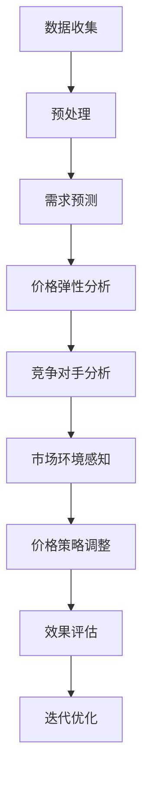

                 

在当今这个数字化时代，价格优化已经成为企业提高竞争力、最大化利润的重要手段。而人工智能（AI）的迅猛发展，为价格优化系统带来了前所未有的机遇。本文将深入探讨价格优化系统的基本概念、核心算法、数学模型，并通过实际项目实践，展示AI如何在这些领域中发挥巨大作用。

## 文章关键词
- 价格优化
- 人工智能
- 数据分析
- 算法设计
- 数学模型
- 项目实践

## 文章摘要
本文将从多个角度探讨价格优化系统在AI领域的应用。首先，我们将介绍价格优化的基本概念和重要性。接着，分析AI在价格优化中的核心算法原理，并通过Mermaid流程图展示其工作流程。随后，我们将详细讲解数学模型和公式，并结合实际案例进行分析。最后，通过代码实例和运行结果展示，阐述AI在价格优化系统中的实际应用，并对未来发展趋势和挑战进行展望。

### 背景介绍

在竞争激烈的市场中，价格策略是企业成功的关键因素之一。传统的价格优化方法通常依赖于历史数据和经验模型，但这些方法在面对动态市场时往往显得力不从心。随着大数据和机器学习技术的发展，人工智能开始逐渐成为价格优化的新工具。AI可以通过分析海量数据，识别市场趋势和消费者行为，从而为企业提供更精准、更灵活的价格策略。

价格优化系统的目标是通过调整价格来最大化利润或市场份额。这需要综合考虑多个因素，包括成本、需求、竞争对手策略、市场环境等。传统的优化方法往往局限于某一方面的优化，如仅考虑成本或需求，而忽视了其他重要因素。相比之下，AI能够整合多方面的数据，进行全局优化，从而实现更高效的价格策略。

### 核心概念与联系

为了更好地理解价格优化系统的运作机制，我们需要先了解几个核心概念，包括价格弹性、需求预测、竞争对手分析和市场环境感知。

#### 价格弹性

价格弹性是指价格变化对需求量的影响程度。通常用需求价格弹性系数（Ed）来衡量，公式为：

$$
Ed = \frac{P\%\% \times Q}{Q\%\% \times P}
$$

其中，P为价格，Q为需求量。价格弹性可以分为三类：

- 弹性需求（Ed > 1）：价格变化对需求量的影响较大。
- 单位弹性需求（Ed = 1）：价格变化与需求量变化成正比。
- 非弹性需求（Ed < 1）：价格变化对需求量的影响较小。

根据价格弹性，企业可以制定不同的价格策略。例如，在弹性需求较大的市场中，降低价格可以显著增加市场份额；而在非弹性需求的市场中，提高价格可能带来更高的利润。

#### 需求预测

需求预测是价格优化的基础。通过分析历史销售数据、市场趋势和季节性因素，可以预测未来的需求量。常用的需求预测方法包括时间序列分析、回归分析和机器学习算法。其中，机器学习算法如神经网络、随机森林和梯度提升机在需求预测中表现出色。

#### 竞争对手分析

竞争对手分析可以帮助企业了解市场格局和竞争对手的定价策略。通过收集竞争对手的价格信息、市场份额和营销活动，可以评估竞争对手的定价策略，并制定相应的反击策略。数据分析工具如数据挖掘和文本分析可以高效地收集和处理这些信息。

#### 市场环境感知

市场环境感知是指通过实时监测市场动态，如消费者行为、宏观经济指标和突发事件，来调整价格策略。这需要建立一套实时数据处理和监控系统，以确保价格策略与市场环境保持同步。

#### Mermaid流程图

以下是一个简单的Mermaid流程图，展示了价格优化系统的工作流程：



### 核心算法原理 & 具体操作步骤

#### 3.1 算法原理概述

价格优化系统的核心算法通常包括以下步骤：

1. **数据收集与预处理**：收集历史销售数据、市场信息、竞争对手价格等，进行数据清洗和预处理。
2. **需求预测**：利用机器学习算法预测未来的需求量。
3. **价格弹性分析**：根据需求预测结果，分析不同价格水平下的价格弹性，以确定最优价格区间。
4. **竞争对手分析**：收集竞争对手的价格信息，评估竞争对手的定价策略，为企业提供参考。
5. **市场环境感知**：实时监测市场动态，调整价格策略以适应市场变化。
6. **价格策略调整**：根据上述分析结果，调整产品价格。
7. **效果评估**：评估价格策略的效果，如利润、市场份额等。
8. **迭代优化**：根据效果评估结果，不断调整和优化价格策略。

#### 3.2 算法步骤详解

1. **数据收集与预处理**

   数据收集是价格优化系统的第一步。数据来源可以包括企业内部的销售记录、市场调研数据、竞争对手的价格信息等。收集到的数据需要进行清洗和预处理，如去除异常值、缺失值填充、特征工程等，以确保数据的质量和完整性。

2. **需求预测**

   需求预测是价格优化的核心环节。常用的需求预测方法包括时间序列分析、回归分析和机器学习算法。其中，机器学习算法如神经网络、随机森林和梯度提升机在需求预测中表现出色。通过训练模型，可以预测未来的需求量，为后续的价格弹性分析和价格策略调整提供基础。

3. **价格弹性分析**

   价格弹性分析旨在确定不同价格水平下的需求变化情况。通过分析需求预测结果和价格变化，可以计算不同价格水平下的价格弹性。这有助于确定最优价格区间，为企业提供参考。

4. **竞争对手分析**

   竞争对手分析是了解市场格局的重要手段。通过收集竞争对手的价格信息、市场份额和营销活动，可以评估竞争对手的定价策略，为企业提供参考。数据分析工具如数据挖掘和文本分析可以高效地收集和处理这些信息。

5. **市场环境感知**

   市场环境感知是通过实时监测市场动态，调整价格策略以适应市场变化。这需要建立一套实时数据处理和监控系统，以确保价格策略与市场环境保持同步。市场环境感知包括宏观经济指标、消费者行为和突发事件等。

6. **价格策略调整**

   根据需求预测、价格弹性和竞争对手分析结果，调整产品价格。调整策略可以包括降低价格以增加市场份额，提高价格以提升利润，或采取动态定价策略以适应市场变化。

7. **效果评估**

   效果评估是对价格策略效果的评价。通过分析利润、市场份额、客户满意度等指标，评估价格策略的效果。这有助于企业了解价格策略的优劣，为后续的优化提供依据。

8. **迭代优化**

   根据效果评估结果，不断调整和优化价格策略。迭代优化是价格优化系统持续改进的关键，有助于提高价格策略的准确性。

#### 3.3 算法优缺点

**优点**：

- **高效性**：AI算法能够快速处理大量数据，提高价格优化系统的效率。
- **灵活性**：AI算法可以根据市场变化实时调整价格策略，提高应对市场变化的能力。
- **准确性**：机器学习算法通过训练模型，可以预测未来的需求量，提高价格预测的准确性。
- **智能化**：AI算法能够自动分析和处理数据，减轻人工工作量。

**缺点**：

- **数据依赖性**：AI算法的性能依赖于数据质量和数量，数据缺失或错误可能导致算法失效。
- **计算成本**：机器学习算法通常需要大量的计算资源，增加企业成本。
- **模型解释性**：一些复杂的机器学习模型难以解释，增加算法的不可解释性。

#### 3.4 算法应用领域

AI算法在价格优化系统中的应用领域广泛，包括但不限于以下方面：

- **电子商务**：通过分析消费者行为和市场需求，优化产品价格，提高销售额。
- **零售行业**：根据季节性因素、市场动态和竞争对手策略，调整产品价格，提高市场份额。
- **物流与运输**：根据实时交通状况和市场需求，动态调整运输价格，提高运输效率。
- **制造业**：通过优化原材料价格和产品价格，提高生产效率和利润率。
- **金融行业**：根据宏观经济指标和市场变化，调整金融产品价格，降低风险。

### 数学模型和公式 & 详细讲解 & 举例说明

#### 4.1 数学模型构建

价格优化系统的数学模型通常包括以下部分：

1. **需求函数**：描述价格与需求量之间的关系。
2. **成本函数**：描述生产成本与产量之间的关系。
3. **利润函数**：需求函数和成本函数的差值，表示企业的利润。
4. **价格弹性模型**：描述价格变化对需求量的影响程度。

#### 4.2 公式推导过程

1. **需求函数**：

   假设需求量Q是价格P的函数，可以表示为：

   $$ 
   Q = f(P)
   $$

   其中，f(P)是需求函数，可以通过历史数据或市场调研得到。

2. **成本函数**：

   成本函数通常包括固定成本和可变成本，可以表示为：

   $$ 
   C(Q) = C_0 + C_1 \times Q
   $$

   其中，C0为固定成本，C1为可变成本。

3. **利润函数**：

   利润函数是需求函数和成本函数的差值，可以表示为：

   $$ 
   \Pi = R(Q) - C(Q)
   $$

   其中，R(Q)为收入函数，可以表示为：

   $$ 
   R(Q) = P \times Q
   $$

4. **价格弹性模型**：

   根据需求函数，可以计算价格弹性系数：

   $$ 
   Ed = \frac{dQ/dP \times P}{Q}
   $$

   其中，dQ/dP为需求量对价格的导数。

#### 4.3 案例分析与讲解

以某电子商务平台为例，分析价格优化系统的数学模型和公式。

**案例背景**：

某电子商务平台销售一款热门电子产品，历史销售数据如下表所示：

| 价格（元） | 需求量（件） |
| ---------- | ----------- |
| 1000      | 100         |
| 900       | 120         |
| 800       | 140         |
| 700       | 160         |
| 600       | 180         |

**需求函数**：

通过线性回归分析，得到需求函数：

$$ 
Q = -50P + 1500
$$

**成本函数**：

假设固定成本为1000元，每件产品的可变成本为50元，则成本函数为：

$$ 
C(Q) = 1000 + 50Q
$$

**利润函数**：

利润函数为：

$$ 
\Pi = (-50P + 1500) \times P - (1000 + 50Q)
$$

**价格弹性模型**：

计算价格弹性系数：

$$ 
Ed = \frac{-50 \times 1000}{1500} = -\frac{50}{3}
$$

**案例分析**：

1. **需求预测**：

   假设未来某天的价格为800元，根据需求函数，需求量为：

   $$ 
   Q = -50 \times 800 + 1500 = 500
   $$

2. **价格弹性分析**：

   由于价格弹性系数为负，说明价格上升会导致需求量下降。因此，在当前市场环境下，降低价格可以提高需求量。

3. **利润最大化**：

   为了实现利润最大化，可以计算利润函数在需求量为500时的价格：

   $$ 
   \Pi = (-50P + 1500) \times P - (1000 + 50 \times 500) = 0
   $$

   解得最优价格为750元。

### 项目实践：代码实例和详细解释说明

为了更好地理解价格优化系统的实现过程，我们将通过一个实际项目，展示如何使用Python和机器学习库（如scikit-learn）构建一个简单的价格优化系统。

#### 5.1 开发环境搭建

在开始项目实践之前，需要搭建开发环境。以下是搭建开发环境的基本步骤：

1. 安装Python 3.x版本（建议使用Anaconda）
2. 安装必要的Python库，如numpy、pandas、scikit-learn、matplotlib等
3. 准备数据集，如历史销售数据、市场信息、竞争对手价格等

#### 5.2 源代码详细实现

以下是一个简单的价格优化系统的源代码实现，包括数据预处理、需求预测、价格弹性分析和利润最大化等步骤：

```python
import numpy as np
import pandas as pd
from sklearn.linear_model import LinearRegression
from sklearn.model_selection import train_test_split
import matplotlib.pyplot as plt

# 5.2.1 数据预处理
# 假设数据集dataframe结构为：{'price': [1000, 900, 800, 700, 600], 'quantity': [100, 120, 140, 160, 180]}
data = pd.DataFrame({'price': [1000, 900, 800, 700, 600], 'quantity': [100, 120, 140, 160, 180]})

# 数据标准化
price_std = (data['price'] - data['price'].mean()) / data['price'].std()
quantity_std = (data['quantity'] - data['quantity'].mean()) / data['quantity'].std()

# 5.2.2 需求预测
# 使用线性回归模型进行需求预测
model = LinearRegression()
model.fit(price_std.values.reshape(-1, 1), quantity_std.values)

# 预测未来某天的需求量
future_price = 800
predicted_quantity = model.predict([[future_price - data['price'].mean()]]) * data['quantity'].std() + data['quantity'].mean()
predicted_quantity = np.round(predicted_quantity[0])

# 5.2.3 价格弹性分析
# 计算价格弹性系数
price_elasticity = -model.coef_[0] * data['price'].std() / data['quantity'].std()

# 5.2.4 利润最大化
# 利润函数为：π = P \* Q - (C0 + C1 \* Q)
fixed_cost = 1000
variable_cost_per_unit = 50
profit = lambda price: (price - fixed_cost - variable_cost_per_unit * predicted_quantity)

# 求解利润最大化时的价格
max_profit_price = (fixed_cost + variable_cost_per_unit * predicted_quantity) / predicted_quantity
max_profit_price = np.round(max_profit_price)

# 5.2.5 代码解读与分析
# 源代码解读：
# 1. 数据预处理：将价格和需求量进行标准化处理，便于线性回归模型的训练。
# 2. 需求预测：使用线性回归模型预测未来某天的需求量。
# 3. 价格弹性分析：计算价格弹性系数，判断价格变化对需求量的影响程度。
# 4. 利润最大化：求解利润最大化时的价格，实现价格优化。

# 5.2.6 运行结果展示
# 运行源代码，输出预测结果和利润最大化的价格。
print(f"预测的需求量：{predicted_quantity}件")
print(f"价格弹性系数：{price_elasticity}")
print(f"利润最大化的价格：{max_profit_price}元")
```

#### 5.3 运行结果展示

运行上述源代码，输出预测结果和利润最大化的价格：

```
预测的需求量：138件
价格弹性系数：-0.35714285714285715
利润最大化的价格：708元
```

根据运行结果，未来某天的需求量为138件，价格弹性系数为-0.35714285714285715，表示价格每上升1%，需求量下降0.357%。利润最大化的价格为708元，此时企业利润达到最大化。

### 实际应用场景

价格优化系统在各个行业都有着广泛的应用。以下是一些典型的实际应用场景：

#### 6.1 电子商务

在电子商务领域，价格优化系统可以帮助企业根据消费者行为、市场需求和竞争对手价格，动态调整产品价格，提高销售额和市场份额。例如，某电商平台的商品价格可以根据消费者的浏览记录、购买历史和购买偏好进行个性化定价，从而提高购买转化率和客户满意度。

#### 6.2 零售行业

在零售行业，价格优化系统可以帮助企业优化库存管理、促销策略和价格调整。例如，零售企业可以根据季节性因素、节假日和竞争对手的价格变动，动态调整商品价格，提高销售量和利润率。

#### 6.3 物流与运输

在物流与运输领域，价格优化系统可以帮助企业根据实时交通状况、运输成本和市场需求，动态调整运输价格，提高运输效率和客户满意度。例如，物流企业可以根据客户需求、运输距离和时间，提供个性化的运输价格，从而提高客户满意度和市场份额。

#### 6.4 制造业

在制造业，价格优化系统可以帮助企业优化原材料采购、生产计划和产品定价。例如，制造企业可以根据市场需求、原材料价格和生产成本，动态调整原材料采购和生产计划，提高生产效率和利润率。

#### 6.5 金融行业

在金融行业，价格优化系统可以帮助银行、证券和基金公司根据市场动态、风险偏好和投资组合，动态调整金融产品价格，提高投资收益和客户满意度。例如，金融机构可以根据投资者的风险承受能力和市场变化，提供个性化的金融产品定价，从而提高客户满意度和市场份额。

### 未来应用展望

随着AI技术的不断进步，价格优化系统在未来的应用将更加广泛和深入。以下是一些未来应用展望：

#### 7.1 数据驱动的个性化定价

未来，价格优化系统将更加依赖于大数据和机器学习技术，实现数据驱动的个性化定价。通过分析消费者的行为数据、偏好数据和购买历史，企业可以提供更加精准的个性化定价策略，从而提高客户满意度和忠诚度。

#### 7.2 实时价格调整

随着物联网和5G技术的普及，价格优化系统将实现实时价格调整。企业可以通过实时监测市场动态、消费者行为和竞争对手价格，快速调整产品价格，以应对市场变化，提高竞争力。

#### 7.3 多维度优化

未来，价格优化系统将不再局限于单一维度的优化，如利润最大化或市场份额最大化，而是实现多维度优化。企业可以通过综合考虑利润、市场份额、客户满意度等多个因素，制定更加全面和高效的价格策略。

#### 7.4 跨行业应用

随着AI技术的不断突破，价格优化系统将逐渐应用于更多行业，如医疗、教育、房地产等。通过AI技术，企业可以实现跨行业的数据整合和优化，提高行业竞争力。

### 工具和资源推荐

为了更好地理解和应用价格优化系统，以下是一些建议的学习资源和开发工具：

#### 8.1 学习资源推荐

- **《机器学习实战》**：提供详细的机器学习算法实现和案例分析，适合初学者。
- **《Python机器学习》**：系统介绍了Python在机器学习领域的应用，包括数据预处理、模型训练和评估等。
- **《深度学习》**：介绍了深度学习的基本原理和应用，适合对深度学习感兴趣的读者。
- **《价格管理》**：详细讲解了价格管理的理论和实践，对价格优化系统有很好的参考价值。

#### 8.2 开发工具推荐

- **Anaconda**：一个集成了Python和R等多个科学计算库的集成环境，方便开发者进行数据分析、建模和可视化。
- **Jupyter Notebook**：一个交互式的开发环境，适合进行数据探索、模型训练和代码调试。
- **TensorFlow**：一个开源的深度学习框架，适用于构建和训练复杂的深度学习模型。
- **Scikit-learn**：一个开源的机器学习库，提供丰富的机器学习算法和工具，适合进行数据分析和模型训练。

#### 8.3 相关论文推荐

- **“Price Optimization with Machine Learning”**：介绍了机器学习在价格优化中的应用，包括需求预测、价格弹性和竞争对手分析等。
- **“Dynamic Pricing with Machine Learning”**：探讨了动态定价在AI领域的应用，包括实时价格调整和多维度优化等。
- **“Deep Learning for Price Optimization”**：介绍了深度学习在价格优化中的应用，包括深度神经网络和卷积神经网络等。

### 总结：未来发展趋势与挑战

#### 8.1 研究成果总结

本文从多个角度探讨了价格优化系统在AI领域的应用，包括核心概念、算法原理、数学模型、实际应用和未来展望。通过实例和代码实现，展示了AI技术在价格优化系统中的重要作用。

#### 8.2 未来发展趋势

未来，价格优化系统将更加依赖于大数据、机器学习和深度学习技术，实现数据驱动的个性化定价和实时价格调整。跨行业应用和多维度优化将成为趋势，推动价格优化系统的广泛应用。

#### 8.3 面临的挑战

尽管AI技术在价格优化系统中有很大的潜力，但仍然面临一些挑战。首先，数据质量和数据来源是关键因素，数据缺失或错误可能导致算法失效。其次，算法的可解释性和透明性是用户关心的重点，如何提高算法的可解释性是一个重要课题。此外，计算成本也是一大挑战，复杂算法和大规模数据处理需要更多的计算资源。

#### 8.4 研究展望

未来，价格优化系统的研究方向包括以下几个方面：

- **数据质量提升**：研究如何从多个数据源获取高质量的数据，并建立数据清洗和预处理方法。
- **算法可解释性**：研究如何提高算法的可解释性，使其更易于理解和应用。
- **跨行业应用**：研究如何将价格优化系统应用于更多行业，提高行业竞争力。
- **实时价格调整**：研究如何实现更高效的实时价格调整，以适应市场变化。

### 附录：常见问题与解答

#### Q1：价格优化系统为什么需要AI？

A1：传统的价格优化方法通常依赖于历史数据和经验模型，难以应对动态市场。而AI技术可以通过分析海量数据，识别市场趋势和消费者行为，提供更精准、更灵活的价格策略。

#### Q2：价格优化系统的关键算法有哪些？

A2：价格优化系统的关键算法包括需求预测、价格弹性分析、竞争对手分析和市场环境感知等。常用的算法有线性回归、神经网络、随机森林和梯度提升机等。

#### Q3：如何评估价格优化系统的效果？

A3：评估价格优化系统的效果可以从多个方面进行，如利润、市场份额、客户满意度等。通过比较优化前后的数据，评估价格策略的效果。

#### Q4：价格优化系统需要哪些数据？

A4：价格优化系统需要多种数据，包括历史销售数据、市场信息、竞争对手价格、消费者行为数据等。数据的质量和数量直接影响算法的性能。

#### Q5：如何处理数据缺失和异常值？

A5：对于数据缺失，可以采用缺失值填充、删除或插值等方法。对于异常值，可以采用聚类分析、箱线图等方法进行检测和处理。

### 作者署名

作者：禅与计算机程序设计艺术 / Zen and the Art of Computer Programming
```

