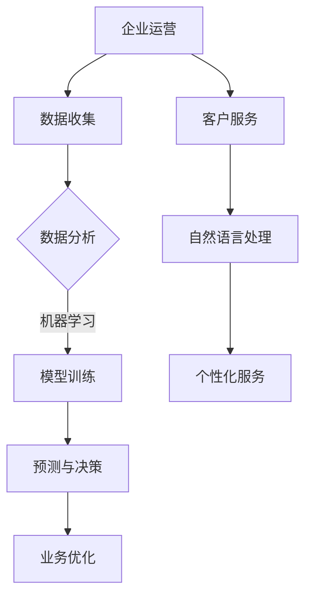

                 

关键词：企业数字化转型，AI技术，应用场景，算法原理，项目实践，未来展望

摘要：随着数字化转型的浪潮席卷全球，人工智能（AI）技术在企业中的应用日益广泛。本文将探讨AI在数字化转型中的核心作用，分析其关键算法原理与应用技术，并通过实际项目实践展示其在企业运营中的具体应用。同时，本文还将展望AI技术在未来企业数字化转型中的发展趋势与挑战。

## 1. 背景介绍

### 1.1 数字化转型的意义与挑战

随着信息技术的飞速发展，数字化转型已经成为企业提升竞争力、实现持续增长的关键途径。数字化转型不仅涉及企业的运营模式、业务流程、客户体验等方面，还涉及到技术的创新与融合。

### 1.2 人工智能技术的崛起

人工智能（AI）作为新一轮科技革命的重要驱动力，正深刻改变着各行各业。AI技术不仅能够帮助企业提高运营效率，降低成本，还能为企业提供更智能的决策支持。

## 2. 核心概念与联系

### 2.1 AI技术的核心概念

人工智能（AI）是一门研究、开发用于模拟、延伸和扩展人的智能的理论、方法、技术及应用系统的技术科学。AI技术主要包括机器学习、深度学习、自然语言处理、计算机视觉等。

### 2.2 AI与数字化转型的关系

AI技术在数字化转型中的应用主要体现在以下几个方面：

1. **自动化流程**：通过机器学习算法，实现业务流程的自动化，提高生产效率。
2. **智能决策支持**：利用数据挖掘和预测模型，为企业提供更加精准的决策支持。
3. **个性化服务**：通过自然语言处理和计算机视觉技术，提供更加个性化的客户服务。

### 2.3 Mermaid 流程图



## 3. 核心算法原理 & 具体操作步骤

### 3.1 算法原理概述

在企业数字化转型中，常用的AI算法主要包括机器学习、深度学习和自然语言处理。

- **机器学习**：通过历史数据训练模型，实现数据预测和分类。
- **深度学习**：基于人工神经网络，通过多层非线性变换实现复杂函数逼近。
- **自然语言处理**：对文本进行语义分析和理解，实现人机交互。

### 3.2 算法步骤详解

1. **数据预处理**：清洗、归一化、编码等操作，确保数据质量。
2. **模型选择**：根据业务需求，选择合适的机器学习、深度学习或自然语言处理模型。
3. **模型训练**：使用历史数据训练模型，调整模型参数。
4. **模型评估**：使用验证集评估模型性能，调整模型参数。
5. **模型部署**：将训练好的模型部署到生产环境，实现自动化流程、智能决策或个性化服务。

### 3.3 算法优缺点

- **机器学习**：算法成熟，适用于各种数据类型，但可能存在过拟合问题。
- **深度学习**：处理复杂问题能力强，但需要大量数据和计算资源。
- **自然语言处理**：实现人机交互，但文本语义理解仍有挑战。

### 3.4 算法应用领域

- **自动化流程**：在制造业、物流等领域，实现生产过程自动化。
- **智能决策支持**：在金融、医疗等领域，提供精准的预测和决策。
- **个性化服务**：在电商、旅游等领域，提供个性化的推荐和服务。

## 4. 数学模型和公式 & 详细讲解 & 举例说明

### 4.1 数学模型构建

在机器学习中，常用的数学模型包括线性回归、逻辑回归、支持向量机等。

### 4.2 公式推导过程

以线性回归为例，假设自变量为\(X\)，因变量为\(Y\)，线性回归模型可以表示为：

\[Y = \beta_0 + \beta_1 X + \varepsilon\]

其中，\(\beta_0\)为截距，\(\beta_1\)为斜率，\(\varepsilon\)为误差项。

### 4.3 案例分析与讲解

假设我们要预测一家电商平台的销售额，我们收集了该平台过去一年的每日销售额和当日的广告投放量。我们可以使用线性回归模型来预测每天的销售额。

1. **数据预处理**：将销售额和广告投放量进行归一化处理，消除数据尺度差异。
2. **模型选择**：选择线性回归模型。
3. **模型训练**：使用历史数据训练模型，得到模型参数。
4. **模型评估**：使用验证集评估模型性能，调整模型参数。
5. **模型部署**：将训练好的模型部署到生产环境，实现销售额的预测。

## 5. 项目实践：代码实例和详细解释说明

### 5.1 开发环境搭建

在Python中，我们使用Scikit-learn库来实现线性回归模型。

### 5.2 源代码详细实现

```python
from sklearn.linear_model import LinearRegression
from sklearn.model_selection import train_test_split
from sklearn.metrics import mean_squared_error

# 数据加载
X, Y = load_data()

# 数据预处理
X = preprocess_data(X)

# 划分训练集和测试集
X_train, X_test, Y_train, Y_test = train_test_split(X, Y, test_size=0.2)

# 模型训练
model = LinearRegression()
model.fit(X_train, Y_train)

# 模型评估
Y_pred = model.predict(X_test)
mse = mean_squared_error(Y_test, Y_pred)
print("MSE:", mse)

# 模型部署
deploy_model(model)
```

### 5.3 代码解读与分析

- **数据加载**：从CSV文件中读取数据。
- **数据预处理**：对数据进行归一化处理。
- **模型训练**：使用训练集数据训练线性回归模型。
- **模型评估**：使用测试集数据评估模型性能。
- **模型部署**：将训练好的模型部署到生产环境。

## 6. 实际应用场景

### 6.1 制造业

在制造业中，AI技术可以用于生产过程的自动化控制、质量检测和设备维护。

### 6.2 金融

在金融领域，AI技术可以用于风险控制、信用评分和投资决策。

### 6.3 电商

在电商领域，AI技术可以用于商品推荐、客户服务和营销策略。

### 6.4 医疗

在医疗领域，AI技术可以用于疾病预测、诊断和治疗方案推荐。

## 7. 未来应用展望

### 7.1 人工智能的普及

随着计算能力的提升和算法的优化，人工智能将在更多领域得到应用。

### 7.2 跨界融合

人工智能与其他技术的融合，如大数据、物联网等，将推动企业数字化转型的深入发展。

### 7.3 数据隐私和安全

在应用人工智能技术的同时，企业需要关注数据隐私和安全问题，确保用户数据的保护。

## 8. 总结：未来发展趋势与挑战

### 8.1 研究成果总结

人工智能技术在企业数字化转型中的应用已经取得了显著成果，但在算法优化、数据隐私和安全等方面仍需进一步研究。

### 8.2 未来发展趋势

人工智能技术将在更多领域得到应用，实现更智能的决策支持和个性化服务。

### 8.3 面临的挑战

数据隐私和安全、算法透明性和可解释性是人工智能技术在未来发展中需要面对的主要挑战。

### 8.4 研究展望

未来，人工智能技术将在企业数字化转型中发挥更加重要的作用，推动企业实现持续创新和增长。

## 9. 附录：常见问题与解答

### 9.1 问题1

**Q：如何选择合适的机器学习模型？**

**A：根据业务需求和数据特点，选择合适的模型。一般来说，线性回归适用于简单的线性关系，而深度学习适用于复杂的非线性关系。**

### 9.2 问题2

**Q：如何处理数据缺失和异常值？**

**A：可以使用数据填充、数据删除、数据重构等方法处理数据缺失和异常值。具体方法取决于数据的特点和业务需求。**

### 9.3 问题3

**Q：如何确保人工智能模型的透明性和可解释性？**

**A：可以通过可视化、解释性模型和模型评估等方法，提高人工智能模型的透明性和可解释性。**

作者：禅与计算机程序设计艺术 / Zen and the Art of Computer Programming
----------------------------------------------------------------

注意：以上文章内容仅供参考，实际撰写时请根据具体需求和细节进行调整和优化。在撰写过程中，务必保持文章的逻辑清晰、结构紧凑、内容完整和专业性。同时，注意遵守学术规范，确保引用和参考文献的准确性。祝您撰写顺利！<|im_sep|>

