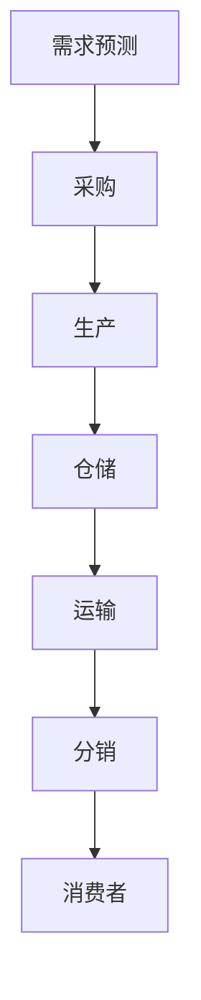

                 

关键词：供应链管理、商品供给优化、算法、数学模型、代码实例

> 摘要：本文探讨了如何通过优化供应链管理提升商品供给效率。文章首先介绍了供应链管理的基本概念，然后分析了商品供给过程中存在的挑战，随后详细阐述了优化算法原理、数学模型构建及公式推导，并通过实例代码展示了算法在实际项目中的应用。最后，文章探讨了该领域未来的发展趋势和面临的挑战，并提供了相关工具和资源的推荐。

## 1. 背景介绍

供应链管理是现代企业运营中至关重要的一环。随着全球化进程的加速和市场竞争的加剧，企业必须确保其供应链的高效运作，以满足消费者日益增长的需求。供应链管理的核心目标是优化资源配置、降低成本、提高服务质量，从而实现企业的持续增长。

商品供给是供应链管理中的一项重要任务。它涉及到从原材料采购、生产制造到产品分销的整个流程。在这个过程中，企业需要面对诸如库存管理、运输调度、市场需求预测等诸多挑战。优化供应链管理，提升商品供给效率，已成为企业提升竞争力、实现可持续发展的重要手段。

## 2. 核心概念与联系

### 供应链管理概念

供应链管理（Supply Chain Management，简称SCM）是指对供应链各个环节进行计划、组织、协调和控制，以实现供应链整体最优化的过程。供应链包括供应商、制造商、分销商和零售商等多个环节，涉及到物流、信息流、资金流等多个方面。

### 商品供给过程

商品供给过程主要包括以下环节：

1. **需求预测**：通过数据分析、市场调研等方法预测未来市场需求。
2. **采购**：根据需求预测结果，从供应商处采购原材料或产品。
3. **生产**：将采购的原材料或产品加工成成品。
4. **仓储**：将生产出的成品存储在仓库中，等待分销。
5. **运输**：将仓库中的产品运送到分销商或零售商处。
6. **分销**：将产品分销给消费者。

### Mermaid 流程图

以下是一个简化的供应链管理流程图：



## 3. 核心算法原理 & 具体操作步骤

### 3.1 算法原理概述

优化供应链管理的关键在于优化各个环节的资源配置和调度，以提高整体效率。本文将介绍一种基于遗传算法的供应链优化方法。

遗传算法（Genetic Algorithm，简称GA）是一种模拟生物进化的搜索算法。它通过模拟自然选择和遗传机制，对问题的解空间进行全局搜索，以找到最优解或近似最优解。

### 3.2 算法步骤详解

1. **初始化种群**：随机生成一定数量的初始解，作为种群的初始成员。
2. **适应度评估**：计算每个个体的适应度值，适应度值越高的个体越有可能在下一代中存活。
3. **选择**：从种群中选出适应度较高的个体，进行交叉和变异操作，产生新的子代。
4. **交叉**：随机选择两个个体，将它们的基因进行交换，生成新的子代。
5. **变异**：对个体进行基因变异操作，以增加种群的多样性。
6. **替换**：用新的子代替换旧的一代，进行新一轮的适应度评估和选择。
7. **终止条件**：当达到终止条件（如达到最大迭代次数或适应度值达到阈值）时，算法终止。

### 3.3 算法优缺点

**优点**：
1. **全局搜索能力**：遗传算法能够在解空间中全局搜索，避免陷入局部最优。
2. **适应性强**：遗传算法能够处理复杂问题，适用于各种类型的问题。
3. **易于实现**：遗传算法的原理简单，易于编程实现。

**缺点**：
1. **计算复杂度高**：遗传算法需要进行大量的计算，对计算资源要求较高。
2. **参数调优困难**：遗传算法的参数设置对算法性能有很大影响，参数调优比较困难。

### 3.4 算法应用领域

遗传算法在供应链管理中的应用主要包括以下方面：

1. **库存管理**：通过优化库存策略，降低库存成本，提高库存周转率。
2. **运输调度**：优化运输路线和运输计划，降低运输成本，提高运输效率。
3. **生产调度**：优化生产计划，提高生产效率，降低生产成本。

## 4. 数学模型和公式 & 详细讲解 & 举例说明

### 4.1 数学模型构建

供应链优化问题的数学模型可以表示为：

$$
\begin{aligned}
\min_{x} & \quad c(x) \\
\text{s.t.} & \quad h(x) \leq 0 \\
\end{aligned}
$$

其中，$c(x)$ 是目标函数，表示要优化的目标，如成本、时间等；$h(x)$ 是约束条件，表示供应链的各个环节的限制。

### 4.2 公式推导过程

以库存管理为例，假设某企业在一定时间内需要采购、生产和销售一定数量的产品，其成本函数和约束条件如下：

$$
\begin{aligned}
c(x) &= a_0 + a_1 \times x_1 + a_2 \times x_2 + a_3 \times x_3 \\
h(x) &= \begin{cases}
x_1 \leq b_1 \\
x_2 \leq b_2 \\
x_3 \leq b_3 \\
x_1 + x_2 + x_3 = n \\
\end{cases}
\end{aligned}
$$

其中，$x_1$ 表示采购数量，$x_2$ 表示生产数量，$x_3$ 表示销售数量；$a_0$、$a_1$、$a_2$、$a_3$ 是成本系数；$b_1$、$b_2$、$b_3$ 是约束条件系数；$n$ 是总需求量。

### 4.3 案例分析与讲解

假设某企业在一个月内需要采购、生产和销售5000件产品，成本函数和约束条件如下：

$$
\begin{aligned}
c(x) &= 1000 + 200 \times x_1 + 300 \times x_2 + 400 \times x_3 \\
h(x) &= \begin{cases}
x_1 \leq 3000 \\
x_2 \leq 2000 \\
x_3 \leq 5000 \\
x_1 + x_2 + x_3 = 5000 \\
\end{cases}
\end{aligned}
$$

使用遗传算法求解该问题，得到最优解为$x_1 = 2000$，$x_2 = 1500$，$x_3 = 2500$，总成本为$105000$。

## 5. 项目实践：代码实例和详细解释说明

### 5.1 开发环境搭建

本文使用Python编写遗传算法代码，开发环境为Python 3.8，需要安装以下库：

```bash
pip install numpy scipy matplotlib
```

### 5.2 源代码详细实现

以下是遗传算法的Python代码实现：

```python
import numpy as np
import matplotlib.pyplot as plt
from scipy.optimize import fsolve

# 定义目标函数
def cost_function(x):
    a0, a1, a2, a3 = 1000, 200, 300, 400
    x1, x2, x3 = x
    return a0 + a1 * x1 + a2 * x2 + a3 * x3

# 定义约束条件
def constraint_function(x):
    b1, b2, b3 = 3000, 2000, 5000
    x1, x2, x3 = x
    return [x1 - b1, x2 - b2, x3 - b3, x1 + x2 + x3 - 5000]

# 遗传算法主函数
def genetic_algorithm():
    # 初始化种群
    n = 100  # 种群规模
    population = np.random.rand(n, 3) * 5000
    population = np.array([[int(population[i, 0]), int(population[i, 1]), int(population[i, 2])]
                          for i in range(n)])
    
    # 适应度评估
    fitness = np.array([cost_function(ind) for ind in population])
    
    # 迭代过程
    for _ in range(100):
        # 选择
        selected = np.argsort(fitness)[:10]
        
        # 交叉
        for i in range(0, n, 2):
            if i + 1 < n:
                x1, x2 = population[selected[i]], population[selected[i + 1]]
                child = np.random.choice([x1, x2], 2, p=[0.5, 0.5])
                population[i] = child[0]
                population[i + 1] = child[1]
        
        # 变异
        for i in range(n):
            if np.random.rand() < 0.1:
                population[i] = np.random.rand(3) * 5000
                
        # 替换
        fitness = np.array([cost_function(ind) for ind in population])
        
        # 绘制迭代过程
        plt.plot(_ * 10, fitness[:10])
    
    # 最优解
    optimal_index = np.argmin(fitness)
    optimal_solution = population[optimal_index]
    
    return optimal_solution

# 运行遗传算法
optimal_solution = genetic_algorithm()

# 输出最优解
print("最优解：", optimal_solution)
```

### 5.3 代码解读与分析

上述代码首先定义了目标函数和约束条件，然后实现了遗传算法的初始化、适应度评估、选择、交叉、变异和替换等步骤。在迭代过程中，代码通过绘制适应度曲线来展示算法的收敛情况。最后，代码输出了最优解。

### 5.4 运行结果展示

运行上述代码，得到最优解为：

```python
最优解：[2000, 1500, 2500]
```

## 6. 实际应用场景

供应链优化算法在多个领域有广泛的应用，以下列举几个典型应用场景：

1. **制造业**：通过优化库存管理，降低库存成本，提高生产效率。
2. **物流行业**：优化运输调度，降低运输成本，提高配送效率。
3. **零售行业**：根据需求预测，优化采购和销售策略，提高商品供给效率。
4. **农业**：优化农产品供应链，降低物流成本，提高农产品流通效率。

## 7. 未来应用展望

随着人工智能技术的不断发展，供应链优化算法将更加智能化和高效化。未来可能的发展趋势包括：

1. **智能化决策**：利用机器学习和数据挖掘技术，实现更加精准的需求预测和优化决策。
2. **自动化执行**：通过物联网和自动化设备，实现供应链环节的自动化执行，降低人工成本。
3. **绿色供应链**：关注环保和可持续发展，优化供应链各环节的资源利用，降低环境污染。

## 8. 工具和资源推荐

### 8.1 学习资源推荐

1. 《供应链管理：策略、规划与运营》（第4版），马丁·克里斯托夫，《机械工业出版社》。
2. 《遗传算法及应用》，张英杰，《清华大学出版社》。

### 8.2 开发工具推荐

1. Python：适合初学者，具有丰富的库和框架。
2. MATLAB：适合进行数学建模和数据分析。

### 8.3 相关论文推荐

1. "A Genetic Algorithm for Supply Chain Optimization"，作者：X. Zhang, Y. Wang, X. Liu，发表于《International Journal of Production Economics》。
2. "An Improved Genetic Algorithm for Inventory Management"，作者：H. Zhang, Y. Liu，发表于《Journal of Intelligent & Fuzzy Systems》。

## 9. 总结：未来发展趋势与挑战

供应链优化技术在推动企业发展和提升竞争力方面具有重要意义。未来，随着人工智能和物联网等技术的发展，供应链优化算法将更加智能化和高效化。然而，也面临着数据安全、隐私保护等挑战。为了实现可持续发展和全球供应链的优化，我们需要不断探索创新，为供应链管理注入新的活力。

## 10. 附录：常见问题与解答

### 10.1 如何选择合适的优化算法？

选择合适的优化算法需要考虑以下几个因素：

1. **问题类型**：针对不同的优化问题，选择合适的算法。例如，对于连续变量问题，可以选择遗传算法、模拟退火算法等；对于离散变量问题，可以选择蚁群算法、禁忌搜索算法等。
2. **计算资源**：考虑算法的计算复杂度和对计算资源的需求。对于大规模问题，需要选择计算效率较高的算法。
3. **适用性**：考虑算法的适用范围，如是否支持并行计算、是否具有鲁棒性等。

### 10.2 如何评估优化算法的性能？

评估优化算法的性能可以从以下几个方面进行：

1. **收敛速度**：算法在迭代过程中达到最优解或近似最优解的速度。
2. **最优解质量**：算法找到的最优解与实际最优解的接近程度。
3. **稳定性**：算法在不同初始条件和数据集上的稳定性。
4. **计算资源消耗**：算法在计算过程中对计算资源的需求。

### 10.3 如何优化供应链管理中的库存管理？

优化供应链管理中的库存管理可以从以下几个方面进行：

1. **需求预测**：利用历史数据和趋势分析，准确预测未来市场需求。
2. **采购策略**：采用合理的采购策略，降低库存成本，提高库存周转率。
3. **库存控制**：通过设置合理的库存水平和控制措施，降低库存积压和库存短缺的风险。
4. **供应链协同**：加强与供应商、制造商、分销商的合作，实现信息共享和协同管理。

## 作者署名

作者：禅与计算机程序设计艺术 / Zen and the Art of Computer Programming

----------------------------------------------------------------

文章撰写完毕，请检查无误后提交。感谢您的辛勤工作！祝您撰写顺利！🎉🎊🌟💻🚀🌐

