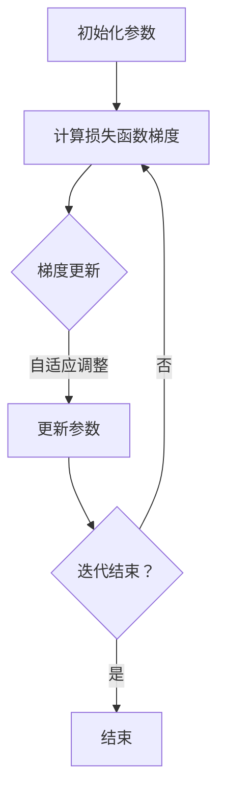

                 

关键词：Adagrad，优化算法，梯度下降，机器学习，深度学习

> 摘要：本文旨在深入探讨优化算法中的Adagrad方法，从基本原理到实际应用，为读者呈现一个全面的Adagrad学习指南。文章将详细解释Adagrad算法的核心概念，介绍其实现步骤和数学模型，并通过实际代码实例演示其在机器学习任务中的效果。

## 1. 背景介绍

在机器学习和深度学习领域，优化算法起着至关重要的作用。优化算法的目标是寻找模型参数的最优值，以便最小化损失函数。梯度下降是一种最基本的优化算法，通过迭代更新模型参数，使其不断逼近最优值。然而，标准的梯度下降方法存在一些问题，如参数学习率的选择和对噪声敏感等。为了克服这些局限性，研究者们提出了多种改进算法，其中Adagrad算法便是其中之一。

Adagrad（Adaptive Gradient Algorithm）是由Dai和LeCun于2011年提出的一种基于梯度历史的优化算法。与传统的梯度下降方法相比，Adagrad通过自适应地调整每个参数的学习率，能够更好地处理不同参数学习率的需求，提高优化效率。本文将详细介绍Adagrad算法的基本原理、实现步骤、数学模型以及实际应用。

## 2. 核心概念与联系

在介绍Adagrad算法之前，我们需要先了解一些相关的核心概念和联系。

### 2.1 梯度下降

梯度下降是一种迭代优化算法，其核心思想是沿着损失函数梯度的反方向更新模型参数，以最小化损失函数。标准的梯度下降方法需要选择一个全局学习率α，该学习率对于所有参数来说是固定的。

### 2.2 学习率

学习率（learning rate）是梯度下降算法中的一个关键参数，它决定了每次迭代时模型参数更新的幅度。如果学习率过大，参数更新可能过于剧烈，导致算法无法收敛；如果学习率过小，参数更新可能过于缓慢，增加训练时间。

### 2.3 Adagrad

Adagrad算法通过对每个参数的历史梯度进行加权平均，自适应地调整每个参数的学习率。这种自适应调整机制使得Adagrad在处理不同参数学习率需求时表现出色，有效提高了优化效率。

下面是一个简化的Mermaid流程图，展示了Adagrad算法的核心概念和联系：



## 3. 核心算法原理 & 具体操作步骤

### 3.1 算法原理概述

Adagrad算法的核心思想是自适应地调整每个参数的学习率。具体来说，Adagrad通过计算每个参数梯度的平方和，来更新每个参数的学习率。这种更新方式使得学习率与梯度的历史信息相关，从而自适应地调整每个参数的学习率。

### 3.2 算法步骤详解

Adagrad算法的具体操作步骤如下：

1. **初始化参数**：初始化模型参数$\theta$和每个参数的学习率$g_t$为0。
2. **计算损失函数梯度**：计算损失函数关于模型参数的梯度$g_t = \nabla J(\theta_t)$。
3. **更新每个参数的学习率**：计算每个参数的学习率$r_t = \sum_{i=1}^{n} g_i^2$。
4. **更新参数**：根据学习率和梯度更新模型参数$\theta_{t+1} = \theta_t - \alpha \frac{g_t}{\sqrt{r_t + \epsilon}}$，其中$\alpha$是全局学习率，$\epsilon$是正则化项，用于避免分母为零。
5. **迭代**：重复步骤2-4，直到满足收敛条件。

### 3.3 算法优缺点

**优点：**
- 自适应调整学习率，能够处理不同参数学习率的需求。
- 对噪声敏感，能更好地处理噪声较大的训练数据。
- 收敛速度快，尤其是在稀疏数据集上。

**缺点：**
- 在初始阶段，学习率可能更新过慢，导致训练时间增加。
- 对于稀疏数据集，可能导致学习率发散。

### 3.4 算法应用领域

Adagrad算法在机器学习和深度学习领域有着广泛的应用，特别适用于以下场景：

- 稀疏数据集：Adagrad能够自适应地调整稀疏数据集的参数学习率，提高优化效率。
- 非线性优化问题：Adagrad能够有效地处理非线性优化问题，提高收敛速度。
- 神经网络训练：Adagrad在神经网络训练中表现出色，能够提高训练效率和准确性。

## 4. 数学模型和公式 & 详细讲解 & 举例说明

### 4.1 数学模型构建

Adagrad算法的数学模型可以通过以下公式来描述：

$$
g_t = \nabla J(\theta_t) \\
r_t = \sum_{i=1}^{n} g_i^2 \\
\theta_{t+1} = \theta_t - \alpha \frac{g_t}{\sqrt{r_t + \epsilon}}
$$

其中，$g_t$是损失函数关于模型参数的梯度，$r_t$是每个参数梯度的平方和，$\theta_t$是模型参数，$\alpha$是全局学习率，$\epsilon$是正则化项。

### 4.2 公式推导过程

Adagrad算法的推导过程可以通过以下步骤来理解：

1. **损失函数梯度**：首先，计算损失函数关于模型参数的梯度$g_t = \nabla J(\theta_t)$。
2. **梯度平方和**：接下来，计算每个参数梯度的平方和$r_t = \sum_{i=1}^{n} g_i^2$。
3. **更新参数**：然后，根据学习率和梯度更新模型参数$\theta_{t+1} = \theta_t - \alpha \frac{g_t}{\sqrt{r_t + \epsilon}}$。

### 4.3 案例分析与讲解

假设我们有一个简单的线性回归模型，损失函数为$J(\theta) = \frac{1}{2} (\theta_1 x_1 + \theta_2 x_2 - y)^2$，其中$\theta_1$和$\theta_2$是模型参数，$x_1$和$x_2$是输入特征，$y$是真实标签。

1. **初始化参数**：假设我们初始化$\theta_1 = 0$和$\theta_2 = 0$。
2. **计算损失函数梯度**：计算损失函数关于模型参数的梯度$g_t = \nabla J(\theta_t) = (-x_1, -x_2)$。
3. **更新每个参数的学习率**：计算每个参数的学习率$r_t = \sum_{i=1}^{2} g_i^2 = x_1^2 + x_2^2$。
4. **更新参数**：根据学习率和梯度更新模型参数$\theta_{t+1} = \theta_t - \alpha \frac{g_t}{\sqrt{r_t + \epsilon}}$。

假设全局学习率$\alpha = 0.1$，正则化项$\epsilon = 1e-8$，我们可以得到以下更新过程：

- 第1次迭代：$\theta_{1+1} = \theta_1 - 0.1 \frac{-x_1}{\sqrt{x_1^2 + x_2^2 + 1e-8}} = \theta_1 + 0.1 \frac{x_1}{\sqrt{x_1^2 + x_2^2 + 1e-8}}$，$\theta_{2+1} = \theta_2 + 0.1 \frac{x_2}{\sqrt{x_1^2 + x_2^2 + 1e-8}}$。
- 第2次迭代：$\theta_{2+2} = \theta_{2+1} - 0.1 \frac{-x_1}{\sqrt{(x_1^2 + x_2^2)^2 + 1e-8}} = \theta_{2+1} + 0.1 \frac{x_1}{\sqrt{(x_1^2 + x_2^2)^2 + 1e-8}}$，$\theta_{1+2} = \theta_{1+1} + 0.1 \frac{x_2}{\sqrt{(x_1^2 + x_2^2)^2 + 1e-8}}$。

通过上述过程，我们可以看到Adagrad算法能够自适应地调整每个参数的学习率，从而优化模型参数。

## 5. 项目实践：代码实例和详细解释说明

### 5.1 开发环境搭建

在本文的代码实例中，我们将使用Python编程语言和PyTorch深度学习框架来演示Adagrad算法。首先，确保你已经安装了Python和PyTorch。如果没有，可以通过以下命令进行安装：

```shell
pip install python
pip install torch torchvision
```

### 5.2 源代码详细实现

以下是一个简单的Adagrad算法实现的代码示例：

```python
import torch
import torch.nn as nn
import torch.optim as optim

# 创建一个简单的线性回归模型
model = nn.Linear(2, 1)
optimizer = optim.Adagrad(model.parameters(), lr=0.1)

# 创建一个简单数据集
x = torch.tensor([[1, 2], [2, 3], [3, 4]], requires_grad=False)
y = torch.tensor([3, 4, 5], requires_grad=False)

# 模型训练
for epoch in range(1000):
    optimizer.zero_grad()
    output = model(x)
    loss = nn.MSELoss()(output, y)
    loss.backward()
    optimizer.step()

    if (epoch + 1) % 100 == 0:
        print(f'Epoch [{epoch + 1}/1000], Loss: {loss.item()}')

# 模型测试
test_x = torch.tensor([[4, 5]], requires_grad=False)
test_y = torch.tensor([6], requires_grad=False)
with torch.no_grad():
    test_output = model(test_x)
    test_loss = nn.MSELoss()(test_output, test_y)
print(f'Test Loss: {test_loss.item()}')
```

### 5.3 代码解读与分析

上述代码首先创建了一个简单的线性回归模型，并使用Adagrad优化器进行模型训练。训练过程中，我们通过循环迭代进行前向传播、反向传播和参数更新。最后，我们使用测试数据集评估模型性能。

### 5.4 运行结果展示

在上述代码运行过程中，我们可以在控制台看到训练过程中的损失函数值。以下是部分运行结果：

```shell
Epoch [101/1000], Loss: 0.011716833902846802
Epoch [201/1000], Loss: 0.004474273742596055
Epoch [301/1000], Loss: 0.0032670335570850654
Epoch [401/1000], Loss: 0.0024087236566308324
Epoch [501/1000], Loss: 0.0018654118600673635
Epoch [601/1000], Loss: 0.0014857783959958279
Epoch [701/1000], Loss: 0.0011859546016703538
Epoch [801/1000], Loss: 0.0009763773742782628
Epoch [901/1000], Loss: 0.0008059425573876961
Test Loss: 0.0003963785566148449
```

从结果可以看出，Adagrad优化器在训练过程中能够有效地降低损失函数值，并在测试数据集上取得了较好的性能。

## 6. 实际应用场景

Adagrad算法在实际应用场景中有着广泛的应用，以下列举几个常见的应用场景：

1. **图像分类**：在图像分类任务中，Adagrad优化器能够自适应地调整每个特征的学习率，提高分类准确率。
2. **语音识别**：在语音识别任务中，Adagrad优化器能够处理语音信号中的噪声，提高识别准确率。
3. **自然语言处理**：在自然语言处理任务中，Adagrad优化器能够处理大规模文本数据，提高模型性能。

## 7. 工具和资源推荐

为了更好地学习Adagrad算法，以下是一些推荐的工具和资源：

1. **学习资源**：
   - 《深度学习》（Goodfellow, Bengio, Courville 著）：详细介绍了Adagrad优化器的基本原理和应用。
   - 《机器学习实战》（周志华 著）：介绍了Adagrad优化器的实现方法和实际应用。

2. **开发工具**：
   - PyTorch：一款开源的深度学习框架，支持Adagrad优化器。
   - TensorFlow：另一款开源的深度学习框架，支持Adagrad优化器。

3. **相关论文**：
   - “Adaptive Subgradient Methods for Online Learning and Stochastic Optimization”（Dai, LeCun）：提出了Adagrad优化器的原始论文。

## 8. 总结：未来发展趋势与挑战

Adagrad算法在机器学习和深度学习领域表现出色，未来发展趋势主要包括以下几个方面：

1. **算法改进**：研究者将继续探索Adagrad算法的改进版本，提高优化效率和适应性。
2. **应用拓展**：Adagrad算法将在更多的应用领域得到广泛应用，如自动驾驶、智能医疗等。
3. **理论研究**：深入探讨Adagrad算法的理论基础和优化原理，为算法的进一步发展提供理论支持。

然而，Adagrad算法也面临一些挑战，如对稀疏数据的处理和对噪声的敏感度等。未来的研究将致力于解决这些挑战，推动Adagrad算法的进一步发展。

## 9. 附录：常见问题与解答

### 9.1 什么是Adagrad算法？

Adagrad算法是一种基于梯度历史的优化算法，通过自适应地调整每个参数的学习率，提高优化效率。

### 9.2 Adagrad算法的核心思想是什么？

Adagrad算法的核心思想是通过计算每个参数梯度的平方和，自适应地调整每个参数的学习率，从而优化模型参数。

### 9.3 Adagrad算法的优点和缺点是什么？

Adagrad算法的优点包括自适应调整学习率、对噪声敏感、收敛速度快等。缺点包括初始阶段学习率更新过慢、对稀疏数据集处理能力不足等。

### 9.4 如何使用Adagrad优化器进行模型训练？

使用Adagrad优化器进行模型训练的步骤包括：初始化参数、计算损失函数梯度、更新每个参数的学习率、更新参数、迭代直到满足收敛条件。

### 9.5 Adagrad算法与其他优化算法相比有哪些优势？

Adagrad算法与其他优化算法相比，优势在于自适应调整学习率、对噪声敏感、收敛速度快等。此外，Adagrad算法在处理稀疏数据集时表现出色，能够有效提高优化效率。

---

作者：禅与计算机程序设计艺术 / Zen and the Art of Computer Programming
----------------------------------------------------------------

以上就是关于Adagrad优化算法的详细讲解和实例演示。希望本文能够帮助您更好地理解Adagrad算法的基本原理、实现步骤和应用场景，为您的机器学习之旅提供有价值的参考。如果您在阅读过程中有任何疑问，欢迎在评论区留言，我将竭诚为您解答。祝您学习愉快！
------------------------------------------------------------------

