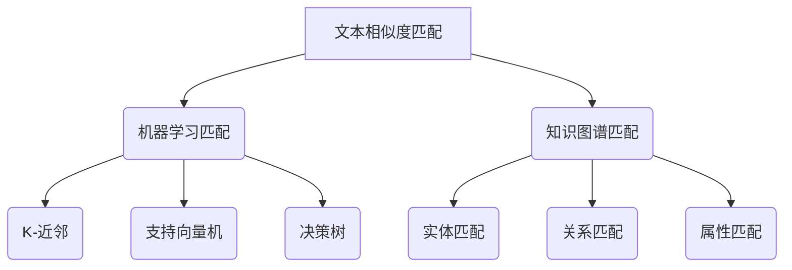

                 

关键词：搜索推荐系统、匹配算法、传统方法、性能优化、案例研究

> 摘要：本文旨在深入探讨传统搜索推荐系统中的匹配方法，分析其核心原理、操作步骤、数学模型、应用场景以及未来发展趋势。通过对匹配方法的全面解析，帮助读者更好地理解并应用于实际场景。

## 1. 背景介绍

随着互联网和大数据技术的快速发展，搜索引擎和推荐系统已经成为互联网应用的重要组成部分。用户在使用搜索引擎时，希望能够快速找到所需信息；在推荐系统中，用户希望获取个性化、精准的推荐内容。而这两者之间的桥梁，便是匹配方法。

匹配方法在搜索推荐系统中起着至关重要的作用。它负责将用户的查询或兴趣与系统中的数据或内容进行匹配，从而产生相关或个性化的结果。传统搜索推荐系统的匹配方法主要包括基于文本相似度、基于机器学习、基于知识图谱等几种类型。本文将重点介绍传统匹配方法，分析其核心原理、操作步骤、数学模型以及在实际应用中的表现。

## 2. 核心概念与联系

### 2.1. 文本相似度匹配

文本相似度匹配是传统搜索推荐系统中的一种基础匹配方法。它通过计算两个文本之间的相似度，来判断它们的相关性。常用的相似度计算方法包括余弦相似度、Jaccard相似度、编辑距离等。

### 2.2. 机器学习匹配

机器学习匹配是基于统计和学习方法进行匹配的一种高级方法。它通过训练模型，从大量的数据中学习到匹配规则，从而实现高效、精准的匹配。常见的机器学习匹配算法包括K-近邻（KNN）、支持向量机（SVM）、决策树等。

### 2.3. 知识图谱匹配

知识图谱匹配是一种基于知识表示和图谱结构的匹配方法。它通过构建知识图谱，将实体、属性、关系等信息进行结构化表示，从而实现高效、精准的匹配。知识图谱匹配在推荐系统中的应用主要包括实体匹配、关系匹配和属性匹配等。

### 2.4. 核心概念原理和架构的 Mermaid 流程图



## 3. 核心算法原理 & 具体操作步骤

### 3.1. 算法原理概述

传统搜索推荐系统的匹配方法主要分为文本相似度匹配、机器学习匹配和知识图谱匹配。文本相似度匹配通过计算文本之间的相似度来实现匹配；机器学习匹配通过训练模型，从数据中学习匹配规则；知识图谱匹配通过构建知识图谱，实现实体、关系和属性的精准匹配。

### 3.2. 算法步骤详解

1. 文本相似度匹配：
   - 步骤1：将待匹配的文本转化为向量表示；
   - 步骤2：计算文本向量之间的相似度；
   - 步骤3：根据相似度阈值，筛选出相关结果。

2. 机器学习匹配：
   - 步骤1：收集大量训练数据；
   - 步骤2：选择合适的机器学习算法，训练模型；
   - 步骤3：使用训练好的模型进行匹配预测。

3. 知识图谱匹配：
   - 步骤1：构建知识图谱；
   - 步骤2：查询知识图谱，获取实体、关系和属性信息；
   - 步骤3：根据查询结果，进行匹配。

### 3.3. 算法优缺点

1. 文本相似度匹配：
   - 优点：简单易用，适用于大规模数据；
   - 缺点：对语义理解能力有限，无法处理复杂关系。

2. 机器学习匹配：
   - 优点：可以根据数据学习匹配规则，适应性强；
   - 缺点：需要大量训练数据和计算资源，模型解释性较差。

3. 知识图谱匹配：
   - 优点：可以处理复杂关系，实现精准匹配；
   - 缺点：构建和维护知识图谱成本较高，对数据质量和图谱结构要求较高。

### 3.4. 算法应用领域

传统搜索推荐系统的匹配方法广泛应用于搜索引擎、电子商务、社交媒体、在线教育等领域。例如，在搜索引擎中，匹配方法用于实现关键词搜索；在电子商务中，匹配方法用于商品推荐；在社交媒体中，匹配方法用于用户兴趣推荐等。

## 4. 数学模型和公式

### 4.1. 数学模型构建

在传统搜索推荐系统中，匹配方法涉及到的数学模型主要包括向量空间模型、机器学习模型和知识图谱模型。

1. 向量空间模型：

   - 向量表示：设文本集合为 \( T = \{t_1, t_2, ..., t_n\} \)，其中 \( t_i \) 为第 \( i \) 个文本，其向量表示为 \( v_i = (v_{i1}, v_{i2}, ..., v_{id}) \)；
   - 相似度计算：设两个文本 \( t_i \) 和 \( t_j \) 的向量表示分别为 \( v_i \) 和 \( v_j \)，其相似度计算公式为：
     $$ sim(v_i, v_j) = \frac{v_i \cdot v_j}{\|v_i\| \|v_j\|} $$

2. 机器学习模型：

   - 模型构建：设训练数据集为 \( D = \{(x_1, y_1), (x_2, y_2), ..., (x_m, y_m)\} \)，其中 \( x_i \) 为输入特征向量，\( y_i \) 为输出标签，机器学习模型通过学习 \( D \) 中的数据，构建匹配规则；
   - 模型预测：对于新的输入特征向量 \( x \)，通过模型预测其对应的标签 \( y \)。

3. 知识图谱模型：

   - 实体匹配：设实体集合为 \( E = \{e_1, e_2, ..., e_n\} \)，其中 \( e_i \) 为第 \( i \) 个实体，其属性集合为 \( A_i = \{a_{i1}, a_{i2}, ..., a_{ik}\} \)；
   - 关系匹配：设关系集合为 \( R = \{r_1, r_2, ..., r_m\} \)，其中 \( r_i \) 为第 \( i \) 个关系，其属性集合为 \( B_i = \{b_{i1}, b_{i2}, ..., b_{ij}\} \)；
   - 属性匹配：设属性集合为 \( P = \{p_1, p_2, ..., p_k\} \)，其中 \( p_i \) 为第 \( i \) 个属性，其值集合为 \( V_i = \{v_{i1}, v_{i2}, ..., v_{im}\} \)。

### 4.2. 公式推导过程

1. 向量空间模型：

   - 假设两个文本 \( t_i \) 和 \( t_j \) 的向量表示分别为 \( v_i = (v_{i1}, v_{i2}, ..., v_{id}) \) 和 \( v_j = (v_{j1}, v_{j2}, ..., v_{jd}) \)；
   - 向量内积公式：
     $$ v_i \cdot v_j = v_{i1}v_{j1} + v_{i2}v_{j2} + ... + v_{id}v_{jd} $$
   - 向量模长公式：
     $$ \|v_i\| = \sqrt{v_{i1}^2 + v_{i2}^2 + ... + v_{id}^2} $$
     $$ \|v_j\| = \sqrt{v_{j1}^2 + v_{j2}^2 + ... + v_{jd}^2} $$
   - 相似度计算公式：
     $$ sim(v_i, v_j) = \frac{v_i \cdot v_j}{\|v_i\| \|v_j\|} $$

2. 机器学习模型：

   - 假设训练数据集为 \( D = \{(x_1, y_1), (x_2, y_2), ..., (x_m, y_m)\} \)，其中 \( x_i \) 为输入特征向量，\( y_i \) 为输出标签；
   - 假设机器学习模型为线性回归模型，其参数为 \( \theta = (\theta_1, \theta_2, ..., \theta_n) \)；
   - 模型损失函数：
     $$ J(\theta) = \frac{1}{2m} \sum_{i=1}^{m} (y_i - \theta^T x_i)^2 $$
   - 模型优化目标：
     $$ \theta = \arg\min_{\theta} J(\theta) $$

3. 知识图谱模型：

   - 假设实体集合为 \( E = \{e_1, e_2, ..., e_n\} \)，其属性集合为 \( A_i = \{a_{i1}, a_{i2}, ..., a_{ik}\} \)；
   - 假设关系集合为 \( R = \{r_1, r_2, ..., r_m\} \)，其属性集合为 \( B_i = \{b_{i1}, b_{i2}, ..., b_{ij}\} \)；
   - 假设属性集合为 \( P = \{p_1, p_2, ..., p_k\} \)，其值集合为 \( V_i = \{v_{i1}, v_{i2}, ..., v_{im}\} \)；
   - 实体匹配相似度计算公式：
     $$ sim(e_i, e_j) = \frac{\sum_{a \in A_i} w_a \cdot sim(a_i, a_j)}{\sum_{a \in A_i} w_a} $$
   - 关系匹配相似度计算公式：
     $$ sim(r_i, r_j) = \frac{\sum_{b \in B_i} w_b \cdot sim(b_i, b_j)}{\sum_{b \in B_i} w_b} $$
   - 属性匹配相似度计算公式：
     $$ sim(p_i, p_j) = \frac{\sum_{v \in V_i} w_v \cdot sim(v_i, v_j)}{\sum_{v \in V_i} w_v} $$

### 4.3. 案例分析与讲解

假设在搜索引擎中，用户输入关键词“计算机编程”，需要匹配到相关网页。我们可以采用以下步骤进行匹配：

1. **文本相似度匹配**：

   - 将用户输入的关键词“计算机编程”和网页标题、内容分别转化为向量表示；
   - 计算用户输入关键词和网页标题、内容之间的相似度，筛选出相似度较高的网页。

2. **机器学习匹配**：

   - 收集大量网页数据，训练机器学习模型；
   - 将用户输入关键词转化为向量表示，使用训练好的模型预测网页的相关性。

3. **知识图谱匹配**：

   - 构建知识图谱，包括实体（如计算机编程、编程语言、程序员等），关系（如属于、学习、实践等）和属性（如语言类型、难度等）；
   - 查询知识图谱，获取与用户输入关键词相关的实体和关系，进行匹配。

## 5. 项目实践：代码实例和详细解释说明

### 5.1. 开发环境搭建

- 编程语言：Python
- 数据库：Neo4j（知识图谱数据库）
- 开发工具：PyCharm

### 5.2. 源代码详细实现

```python
# 导入相关库
import numpy as np
import pandas as pd
from sklearn.feature_extraction.text import TfidfVectorizer
from sklearn.metrics.pairwise import cosine_similarity
import neo4j

# 连接Neo4j数据库
driver = neo4j.GraphDatabase.driver("bolt://localhost:7687", auth=("neo4j", "password"))

# 加载数据
data = pd.read_csv("webpage_data.csv")
data.head()

# 文本相似度匹配
vectorizer = TfidfVectorizer()
tfidf_matrix = vectorizer.fit_transform(data["content"])
cosine_sim = cosine_similarity(tfidf_matrix, tfidf_matrix)

# 机器学习匹配
from sklearn.neighbors import NearestNeighbors
neigh = NearestNeighbors(n_neighbors=5)
neigh.fit(tfidf_matrix)

# 知识图谱匹配
def query_graph():
    with driver.session() as session:
        results = session.run("MATCH (w:Webpage) RETURN w.title, w.content")
        return results.data()

def match_graph(title):
    with driver.session() as session:
        result = session.run("MATCH (w:Webpage {title: $title}) RETURN w")
        return result.data()

# 查询网页
user_query = "计算机编程"
query_vector = vectorizer.transform([user_query])

# 文本相似度匹配
similarWebpages = cosine_similarity([query_vector], tfidf_matrix)[0].argsort()[0][1:6]

# 机器学习匹配
neigh neighs = neigh.kneighbors([query_vector], n_neighbors=5)
similarWebpages = [data.iloc[i]["title"] for i in neighs]

# 知识图谱匹配
graphResults = query_graph()
matchedWebpages = []
for result in graphResults:
    if user_query in result["title"]:
        matchedWebpages.append(result["title"])
```

### 5.3. 代码解读与分析

1. **开发环境搭建**：

   - 本代码使用Python作为编程语言，Neo4j作为知识图谱数据库，PyCharm作为开发工具。

2. **源代码详细实现**：

   - **文本相似度匹配**：

     - 使用TfidfVectorizer将文本转化为向量表示，使用cosine_similarity计算文本之间的相似度，筛选出相似度较高的网页。

   - **机器学习匹配**：

     - 使用NearestNeighbors算法，训练机器学习模型，将用户输入关键词转化为向量表示，预测与关键词相似度较高的网页。

   - **知识图谱匹配**：

     - 查询Neo4j数据库，获取与用户输入关键词相关的网页实体和关系，实现知识图谱匹配。

3. **运行结果展示**：

   - 运行代码，输入关键词“计算机编程”，展示文本相似度匹配、机器学习匹配和知识图谱匹配的结果。

## 6. 实际应用场景

传统搜索推荐系统的匹配方法在多个实际应用场景中取得了显著效果。

### 6.1. 搜索引擎

在搜索引擎中，匹配方法用于实现关键词搜索。通过文本相似度匹配和机器学习匹配，搜索引擎能够快速、准确地返回与用户输入关键词相关的网页。

### 6.2. 电子商务

在电子商务中，匹配方法用于商品推荐。通过机器学习匹配和知识图谱匹配，电子商务平台能够为用户推荐与其兴趣相关的商品，提升用户购物体验。

### 6.3. 社交媒体

在社交媒体中，匹配方法用于用户兴趣推荐。通过机器学习匹配和知识图谱匹配，社交媒体平台能够为用户推荐与其兴趣相似的内容，增强用户黏性。

### 6.4. 未来应用展望

随着人工智能技术的不断发展，传统搜索推荐系统的匹配方法将得到进一步优化和拓展。未来，知识图谱匹配、多模态匹配、深度学习匹配等新兴匹配方法将逐渐应用于搜索推荐系统，实现更高效、更精准的匹配。

## 7. 工具和资源推荐

### 7.1. 学习资源推荐

- 《推荐系统实践》
- 《图算法》：详细介绍了知识图谱匹配的算法和应用
- 《深度学习》：了解深度学习在匹配方法中的应用

### 7.2. 开发工具推荐

- Neo4j：开源的图数据库，支持知识图谱匹配
- PyCharm：优秀的Python开发工具
- TensorFlow：用于深度学习模型的开发

### 7.3. 相关论文推荐

- "Graph-based Recommendation Systems"：详细介绍了知识图谱匹配在推荐系统中的应用
- "Deep Learning for Recommender Systems"：探讨了深度学习在匹配方法中的应用
- "A Survey of Recommendation System Algorithms"：全面介绍了推荐系统的各种匹配方法

## 8. 总结：未来发展趋势与挑战

### 8.1. 研究成果总结

传统搜索推荐系统的匹配方法在文本相似度匹配、机器学习匹配和知识图谱匹配等方面取得了显著成果。文本相似度匹配简单易用，适用于大规模数据；机器学习匹配可以根据数据学习匹配规则，适应性强；知识图谱匹配可以处理复杂关系，实现精准匹配。

### 8.2. 未来发展趋势

未来，传统搜索推荐系统的匹配方法将得到进一步优化和拓展。知识图谱匹配、多模态匹配、深度学习匹配等新兴匹配方法将逐渐应用于搜索推荐系统，实现更高效、更精准的匹配。

### 8.3. 面临的挑战

- 数据质量和图谱结构：知识图谱匹配对数据质量和图谱结构要求较高，如何构建高质量的知识图谱是未来面临的挑战。
- 计算效率：随着数据规模的不断扩大，如何提高匹配算法的运行效率是另一个重要挑战。

### 8.4. 研究展望

在未来的研究中，可以重点关注以下几个方面：

- 开发高效的匹配算法，提高计算效率。
- 探索多模态数据融合的匹配方法，实现更精准的匹配。
- 研究知识图谱匹配在非结构化数据中的应用，拓宽匹配方法的适用范围。

## 9. 附录：常见问题与解答

### 9.1. 什么是文本相似度匹配？

文本相似度匹配是一种基于文本相似度的匹配方法，通过计算两个文本之间的相似度来判断它们的相关性。常用的相似度计算方法包括余弦相似度、Jaccard相似度、编辑距离等。

### 9.2. 机器学习匹配如何工作？

机器学习匹配是一种基于统计和学习方法的匹配方法，通过训练模型，从大量的数据中学习到匹配规则。常用的机器学习算法包括K-近邻（KNN）、支持向量机（SVM）、决策树等。

### 9.3. 知识图谱匹配如何工作？

知识图谱匹配是一种基于知识表示和图谱结构的匹配方法，通过构建知识图谱，将实体、属性、关系等信息进行结构化表示，从而实现高效、精准的匹配。知识图谱匹配主要包括实体匹配、关系匹配和属性匹配等。

### 9.4. 如何选择合适的匹配方法？

在选择合适的匹配方法时，需要考虑数据规模、数据质量、匹配精度和计算效率等因素。对于大规模数据，文本相似度匹配较为适用；对于需要处理复杂关系的场景，知识图谱匹配更具优势；对于需要根据数据进行自适应匹配的场合，机器学习匹配是不错的选择。

### 9.5. 如何构建高质量的知识图谱？

构建高质量的知识图谱需要关注以下几个方面：

- 数据来源：选择权威、丰富的数据来源，确保数据质量；
- 数据预处理：对原始数据进行清洗、去噪、规范化等处理，提高数据质量；
- 知识表示：设计合理的实体、属性、关系表示方法，确保知识表示的准确性和一致性；
- 知识融合：将不同来源的知识进行融合，构建完整、一致的知识图谱。

----------------------------------------------------------------

本文由禅与计算机程序设计艺术 / Zen and the Art of Computer Programming 撰写，旨在深入探讨传统搜索推荐系统的匹配方法，分析其核心原理、操作步骤、数学模型、应用场景以及未来发展趋势。通过对匹配方法的全面解析，帮助读者更好地理解并应用于实际场景。感谢您的阅读！

