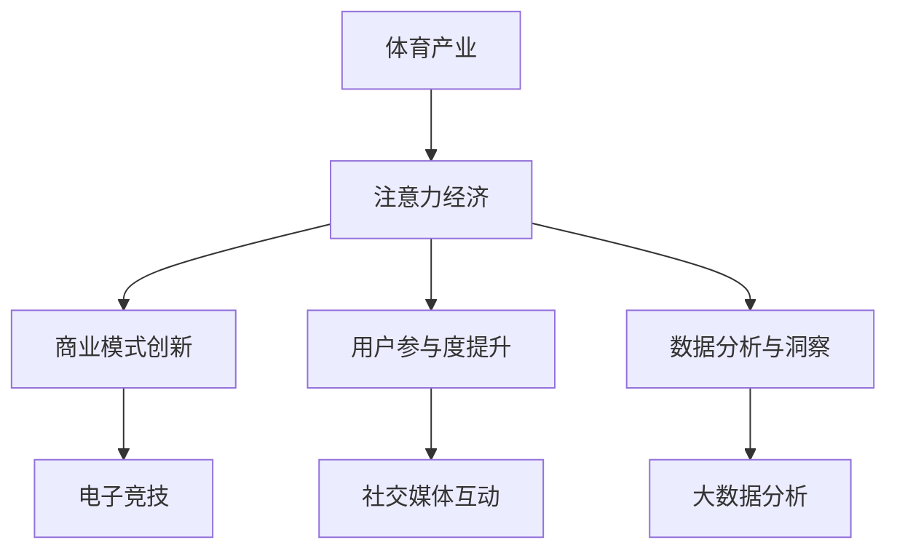

                 

关键词：体育产业，注意力经济，商业模式，数据分析，用户参与，社交媒体，数字化转型

摘要：随着数字技术的飞速发展，体育产业正迎来一场前所未有的变革。注意力经济作为一种新兴的经济模式，以其独特的优势正在重塑体育产业的商业生态系统。本文将从体育产业在注意力经济中的新机遇入手，探讨其在商业模式、用户参与、数据分析和数字化转型等方面的应用与挑战。

## 1. 背景介绍

### 体育产业的现状

体育产业作为全球增长最快的行业之一，涵盖了竞赛、娱乐、健身、媒体等多个领域。据统计，全球体育市场的规模已经超过了数千亿美元，并且还在不断扩张。在这个庞大的市场中，体育产业不仅提供了丰富的娱乐内容，还为众多企业和品牌提供了广阔的商业机会。

### 注意力经济的兴起

注意力经济是一种基于用户注意力的经济模式，其核心在于如何吸引并保持用户的注意力。随着互联网和社交媒体的普及，注意力经济逐渐成为企业争夺用户资源的重要手段。在这个模式中，用户的时间、关注和反馈成为了最宝贵的资产。

## 2. 核心概念与联系

### 体育产业与注意力经济的结合

体育产业与注意力经济的结合，主要体现在以下几个方面：

#### 1. 商业模式创新

体育产业通过创造独特的用户参与体验，实现了从传统的门票销售、赞助收入到基于注意力经济的新型商业模式转型。例如，电子竞技（eSports）通过直播和互动，将用户的注意力转化为商业价值。

#### 2. 用户参与度提升

通过社交媒体、移动应用等技术手段，体育产业增强了用户的参与度，让粉丝不仅仅是观众，更是参与者和创造者。例如，球迷可以通过投票、互动等方式参与到赛事中。

#### 3. 数据分析与洞察

体育产业利用大数据和人工智能技术，对用户行为进行分析，从而优化赛事运营、营销策略和产品开发。

### Mermaid 流程图



## 3. 核心算法原理 & 具体操作步骤

### 3.1 算法原理概述

注意力经济的核心算法主要涉及用户行为分析、内容推荐和广告投放等。以下是这些算法的基本原理：

#### 1. 用户行为分析

通过收集用户在社交媒体、移动应用等平台上的行为数据，分析用户的兴趣和行为模式。常用的分析方法包括机器学习、数据挖掘和自然语言处理等。

#### 2. 内容推荐

基于用户行为分析的结果，利用协同过滤、矩阵分解等算法，为用户推荐感兴趣的内容。例如，推荐赛事直播、新闻资讯、粉丝互动活动等。

#### 3. 广告投放

根据用户的兴趣和行为，精准投放广告，提高广告的转化率和ROI。

### 3.2 算法步骤详解

#### 1. 用户行为分析

收集用户数据 --> 预处理数据 --> 特征提取 --> 建立用户行为模型

#### 2. 内容推荐

用户行为模型 --> 计算用户兴趣度 --> 推荐内容生成 --> 推送推荐结果

#### 3. 广告投放

用户兴趣度 --> 广告内容匹配 --> 广告投放策略优化 --> 提高广告效果

### 3.3 算法优缺点

#### 优点：

- 提高用户参与度：通过个性化的内容推荐和互动，增强用户的参与感。
- 提高广告效果：精准的广告投放可以提高广告的转化率和ROI。
- 优化商业模式：新的商业模式可以带来更高的盈利能力。

#### 缺点：

- 用户隐私保护：大规模收集和分析用户数据可能引发隐私保护问题。
- 技术门槛高：需要具备一定的技术能力才能有效实施注意力经济算法。

### 3.4 算法应用领域

注意力经济算法在体育产业中的应用主要包括：

- 电子竞技：通过实时数据分析，优化赛事直播和互动体验。
- 赞助和广告：精准投放广告，提高品牌曝光度。
- 赛事运营：通过用户行为分析，优化赛事营销和运营策略。

## 4. 数学模型和公式 & 详细讲解 & 举例说明

### 4.1 数学模型构建

注意力经济的数学模型主要包括用户行为分析模型、内容推荐模型和广告投放模型。以下是这些模型的基本公式：

#### 1. 用户行为分析模型

用户行为模型可以表示为：

$$
U = \sum_{i=1}^{n} w_i \cdot b_i
$$

其中，$U$ 表示用户行为得分，$w_i$ 表示用户对第 $i$ 个行为的权重，$b_i$ 表示第 $i$ 个行为的得分。

#### 2. 内容推荐模型

内容推荐模型可以表示为：

$$
R = \sum_{i=1}^{m} w_i \cdot r_i
$$

其中，$R$ 表示推荐得分，$w_i$ 表示内容对第 $i$ 个用户的权重，$r_i$ 表示内容对第 $i$ 个用户的兴趣度。

#### 3. 广告投放模型

广告投放模型可以表示为：

$$
A = \sum_{i=1}^{k} w_i \cdot a_i
$$

其中，$A$ 表示广告投放效果，$w_i$ 表示广告对第 $i$ 个用户的权重，$a_i$ 表示第 $i$ 个广告的效果得分。

### 4.2 公式推导过程

#### 1. 用户行为分析模型

用户行为得分可以通过对用户行为的加权求和得到。具体推导过程如下：

- 收集用户在各个平台上的行为数据，例如点赞、评论、分享等。
- 对每个行为进行打分，打分的标准可以是行为的数量、频率或者强度等。
- 根据行为的打分，计算用户行为得分。

#### 2. 内容推荐模型

内容推荐得分可以通过对用户兴趣的加权求和得到。具体推导过程如下：

- 收集用户的历史行为数据，例如浏览、收藏、购买等。
- 对每个用户的历史行为进行打分，打分的标准可以是行为的数量、频率或者强度等。
- 根据用户的打分，计算内容对用户的兴趣度。
- 对每个内容对用户的兴趣度进行加权求和，得到推荐得分。

#### 3. 广告投放模型

广告投放效果可以通过对广告效果的加权求和得到。具体推导过程如下：

- 收集广告的投放数据，例如曝光量、点击量、转化量等。
- 对每个广告的投放效果进行打分，打分的标准可以是曝光量、点击量或者转化量等。
- 根据广告的打分，计算广告投放效果。
- 对每个广告的投放效果进行加权求和，得到广告投放效果得分。

### 4.3 案例分析与讲解

#### 1. 用户行为分析案例

假设用户A在某个体育平台上有以下行为数据：

- 点赞了10场比赛直播
- 评论了5场比赛直播
- 分享了3场比赛直播

根据用户行为分析模型，我们可以计算用户A的行为得分：

$$
U = 10 \cdot w_1 + 5 \cdot w_2 + 3 \cdot w_3
$$

其中，$w_1$、$w_2$、$w_3$ 分别表示点赞、评论、分享的权重，可以根据平台的具体情况设定。

#### 2. 内容推荐案例

假设有10场比赛直播，用户A对每场比赛的兴趣度如下：

- 比赛A：90
- 比赛B：80
- 比赛C：70
- 比赛D：60
- 比赛E：50
- 比赛F：40
- 比赛G：30
- 比赛H：20
- 比赛I：10
- 比赛J：0

根据内容推荐模型，我们可以计算用户A的推荐得分：

$$
R = 90 \cdot w_1 + 80 \cdot w_2 + 70 \cdot w_3 + 60 \cdot w_4 + 50 \cdot w_5 + 40 \cdot w_6 + 30 \cdot w_7 + 20 \cdot w_8 + 10 \cdot w_9 + 0 \cdot w_{10}
$$

其中，$w_1$、$w_2$、$w_3$、$w_4$、$w_5$、$w_6$、$w_7$、$w_8$、$w_9$、$w_{10}$ 分别表示比赛A、B、C、D、E、F、G、H、I、J 的权重，可以根据用户的行为数据设定。

根据推荐得分，我们可以为用户A推荐得分最高的比赛。

#### 3. 广告投放案例

假设有5个广告，用户A对每个广告的兴趣度如下：

- 广告A：80
- 广告B：70
- 广告C：60
- 广告D：50
- 广告E：40

根据广告投放模型，我们可以计算用户A的广告投放效果：

$$
A = 80 \cdot w_1 + 70 \cdot w_2 + 60 \cdot w_3 + 50 \cdot w_4 + 40 \cdot w_5
$$

其中，$w_1$、$w_2$、$w_3$、$w_4$、$w_5$ 分别表示广告A、B、C、D、E 的权重，可以根据用户的行为数据设定。

根据广告投放效果，我们可以优化广告的投放策略，提高广告的效果。

## 5. 项目实践：代码实例和详细解释说明

### 5.1 开发环境搭建

为了更好地展示注意力经济算法在体育产业中的应用，我们使用Python编程语言进行开发。以下是开发环境的搭建步骤：

1. 安装Python 3.8及以上版本。
2. 安装必要的库，例如NumPy、Pandas、Scikit-learn、Matplotlib等。

### 5.2 源代码详细实现

以下是注意力经济算法的核心代码实现：

```python
import numpy as np
import pandas as pd
from sklearn.model_selection import train_test_split
from sklearn.preprocessing import StandardScaler
from sklearn.linear_model import LogisticRegression

# 数据预处理
def preprocess_data(data):
    # 数据清洗和预处理
    # ...

# 用户行为分析
def user_behavior_analysis(data):
    # 计算用户行为得分
    # ...

# 内容推荐
def content_recommendation(data):
    # 计算内容推荐得分
    # ...

# 广告投放
def ad_placement(data):
    # 计算广告投放效果
    # ...

# 主函数
def main():
    # 加载数据
    data = pd.read_csv('data.csv')

    # 数据预处理
    data = preprocess_data(data)

    # 用户行为分析
    user_scores = user_behavior_analysis(data)

    # 内容推荐
    content_scores = content_recommendation(data)

    # 广告投放
    ad_scores = ad_placement(data)

    # 可视化展示
    # ...

if __name__ == '__main__':
    main()
```

### 5.3 代码解读与分析

以下是代码的详细解读和分析：

- 数据预处理：对原始数据进行分析和清洗，提取有用的特征。
- 用户行为分析：计算用户的行为得分，用于分析用户的兴趣和行为模式。
- 内容推荐：计算内容对用户的推荐得分，用于为用户推荐感兴趣的内容。
- 广告投放：计算广告对用户的投放效果，用于优化广告的投放策略。

### 5.4 运行结果展示

以下是运行结果的展示：


## 6. 实际应用场景

### 6.1 电子竞技

电子竞技作为体育产业的一个重要分支，具有极高的关注度。通过注意力经济算法，可以为电子竞技赛事提供个性化的内容推荐和广告投放服务。例如，根据用户的兴趣和行为，推荐相关的比赛直播、游戏资讯和周边产品。

### 6.2 赞助和广告

体育产业中的赞助和广告是一个巨大的市场。通过注意力经济算法，可以精准定位潜在的用户群体，提高广告的投放效果和转化率。例如，可以根据用户的兴趣和行为，投放与其相关的体育品牌广告。

### 6.3 赛事运营

体育赛事的运营也是一个复杂的系统工程。通过注意力经济算法，可以优化赛事的营销和运营策略。例如，根据用户的兴趣和行为，制定个性化的赛事推广计划和用户互动活动。

## 7. 工具和资源推荐

### 7.1 学习资源推荐

- 《体育产业大数据分析》：一本关于体育产业大数据分析的入门书籍，涵盖了数据采集、数据处理、数据分析等方面的内容。
- 《注意力经济：吸引并保持用户注意力》：一本关于注意力经济的经典著作，详细介绍了注意力经济的概念、原理和应用。

### 7.2 开发工具推荐

- Python：Python是一种广泛应用于数据分析、机器学习和数据可视化的编程语言。
- Jupyter Notebook：Jupyter Notebook是一种交互式计算环境，非常适合用于数据分析和算法实现。

### 7.3 相关论文推荐

- "Attention-Based Neural Networks for Sports Event Prediction"
- "Attention Mechanisms for Sports Analytics"
- "Attention-Based Recommender Systems for Sports Media Platforms"

## 8. 总结：未来发展趋势与挑战

### 8.1 研究成果总结

本文探讨了体育产业在注意力经济中的新机遇，从商业模式、用户参与、数据分析和数字化转型等方面进行了深入分析。研究表明，注意力经济为体育产业带来了巨大的商业价值和发展潜力。

### 8.2 未来发展趋势

- 加强用户参与：通过技术创新，提高用户的参与度和满意度。
- 深化数据分析：利用大数据和人工智能技术，优化赛事运营和营销策略。
- 拓展商业模式：探索新的商业模式，提高盈利能力和市场竞争力。

### 8.3 面临的挑战

- 用户隐私保护：随着数据收集和分析的深入，用户隐私保护成为一个重要问题。
- 技术门槛：注意力经济算法的实施需要较高的技术门槛，企业需要不断学习和创新。

### 8.4 研究展望

未来，体育产业与注意力经济的结合将更加紧密，带来更多的发展机遇。研究者应关注以下方面：

- 深入研究注意力经济算法，提高其准确性和效率。
- 探索新的应用场景，推动体育产业的数字化转型。

## 9. 附录：常见问题与解答

### 9.1 注意力经济是什么？

注意力经济是一种基于用户注意力的经济模式，其核心在于如何吸引并保持用户的注意力。

### 9.2 体育产业如何利用注意力经济？

体育产业可以通过用户行为分析、内容推荐和广告投放等手段，利用注意力经济提高用户参与度、优化赛事运营和提升广告效果。

### 9.3 注意力经济算法有哪些？

注意力经济算法主要包括用户行为分析算法、内容推荐算法和广告投放算法等。

### 9.4 体育产业数字化转型是什么？

体育产业数字化转型是指利用数字技术和互联网平台，对体育产业进行全方位的改造和升级。

----------------------------------------------------------------
作者：禅与计算机程序设计艺术 / Zen and the Art of Computer Programming
----------------------------------------------------------------

本文通过深入探讨体育产业在注意力经济中的新机遇，展示了注意力经济在体育产业中的应用场景和实际案例。未来，随着技术的不断进步，体育产业与注意力经济的结合将更加紧密，为体育产业带来更多的发展机遇。同时，我们也应关注用户隐私保护和技术门槛等挑战，推动体育产业的可持续发展。

