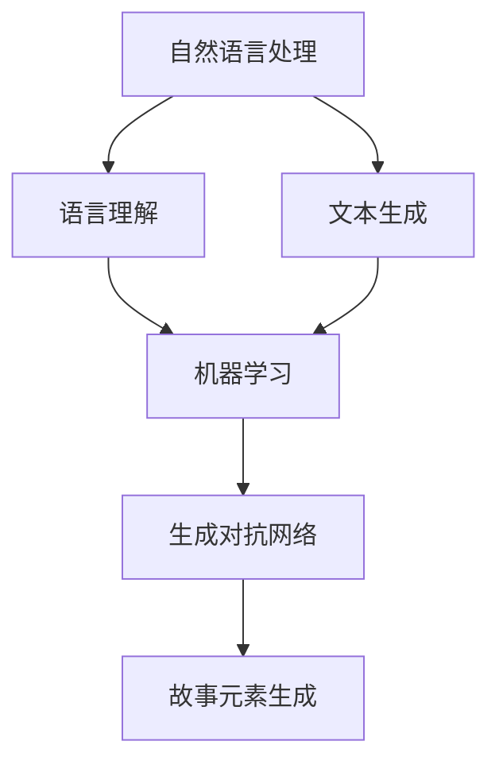

                 

关键词：AI、个人故事创作、叙事学、算法、机器学习、自然语言处理

> 摘要：本文将探讨AI在个人故事创作中的应用，结合叙事学和机器学习技术，阐述如何通过AI驱动的个人故事创作坊实现高效、个性化的故事生成。文章将介绍核心概念、算法原理、数学模型，并通过具体案例展示其在实际中的应用，最后对未来的发展方向和面临的挑战进行展望。

## 1. 背景介绍

在数字化的今天，故事创作不再仅限于作家和编剧。随着人工智能技术的发展，人们开始探索如何利用AI实现自动化、个性化的故事生成。传统的个人故事创作往往依赖于创作者的灵感、经验和技巧，而AI驱动的个人故事创作坊则提供了新的可能性。

叙事学作为研究故事艺术的学科，强调故事的构造、传递和接受过程。结合机器学习和自然语言处理技术，AI可以模仿人类的叙事方式，生成具有情感共鸣和连贯性的故事。这种技术的出现，不仅为故事创作领域带来了变革，也为个人表达和创作提供了新的途径。

本文旨在探讨AI驱动的个人故事创作坊的设计与实现，通过理论分析和实践案例，展示其在现实中的应用和价值。

## 2. 核心概念与联系

在构建AI驱动的个人故事创作坊时，需要理解以下几个核心概念：

1. **自然语言处理（NLP）**：NLP是使计算机理解和生成人类语言的技术。它包括文本分析、语言理解、文本生成等子领域。
2. **机器学习（ML）**：机器学习是一种通过数据训练模型，使其能够进行预测和决策的技术。在故事创作中，ML用于生成情节、角色和对话。
3. **生成对抗网络（GAN）**：GAN是一种用于生成复杂数据的机器学习模型。在故事创作中，GAN可以生成具有多样性和创造性的故事元素。

以下是一个使用Mermaid绘制的流程图，展示这些核心概念之间的联系：



## 3. 核心算法原理 & 具体操作步骤

### 3.1 算法原理概述

AI驱动的个人故事创作坊的核心算法包括：

- **基于变换器的序列到序列模型（Seq2Seq）**：用于生成连贯的故事情节。
- **基于循环神经网络（RNN）的情感分析模型**：用于理解并模拟故事中的情感。
- **GAN**：用于生成独特的角色和场景。

### 3.2 算法步骤详解

1. **数据收集与预处理**：
   - 收集大量的故事文本数据，包括情节、角色和对话。
   - 对数据进行清洗和预处理，包括分词、去停用词、词干提取等。

2. **模型训练**：
   - 使用Seq2Seq模型训练情节生成器。
   - 使用情感分析模型训练情感模拟器。
   - 使用GAN训练角色和场景生成器。

3. **故事生成**：
   - 输入一个故事的开头或主题，情节生成器生成后续情节。
   - 情感分析模型对生成的情节进行情感评估，调整情感走向。
   - 角色和场景生成器生成与情节匹配的角色和场景。

4. **故事优化**：
   - 使用用户反馈对生成的故事进行优化。
   - 通过迭代训练和优化，提高故事的质量和连贯性。

### 3.3 算法优缺点

**优点**：

- **个性化**：AI可以根据用户的需求和偏好生成个性化的故事。
- **高效**：通过算法自动生成故事，大大提高了创作效率。
- **多样性**：AI可以生成丰富多样的故事，提供创新的叙事方式。

**缺点**：

- **质量不稳定**：生成的故事质量依赖于训练数据的质量和算法的鲁棒性。
- **情感传递有限**：AI在情感理解和传递方面仍有一定局限性。

### 3.4 算法应用领域

AI驱动的个人故事创作坊可以应用于：

- **数字内容创作**：为网络小说、电子游戏等提供自动化故事线。
- **个人表达**：为个人日记、博客等提供故事创作工具。
- **教育培训**：辅助教育和培训项目，提供个性化的教学材料。

## 4. 数学模型和公式 & 详细讲解 & 举例说明

### 4.1 数学模型构建

在AI驱动的个人故事创作坊中，涉及的主要数学模型包括：

- **Seq2Seq模型**：用于序列到序列的映射，通常使用编码器-解码器结构。
- **RNN模型**：用于处理序列数据，可以捕捉时间依赖关系。
- **GAN模型**：用于生成对抗，包括生成器和判别器。

### 4.2 公式推导过程

以下是一个简单的Seq2Seq模型的公式推导过程：

- 编码器（Encoder）输入序列：
  $$ X = [x_1, x_2, \ldots, x_T] $$
  编码得到隐藏状态序列：
  $$ h_t = \sigma(W_eh_{t-1} + U_ex_t + b_e) $$

- 解码器（Decoder）输入隐藏状态序列：
  $$ h_T = \sigma(W_dh_{T-1} + U_dh_T + b_d) $$
  解码得到输出序列：
  $$ y_t = \sigma(W_yh_t + b_y) $$

其中，$\sigma$是sigmoid激活函数，$W_e$、$U_e$、$W_d$、$U_d$、$W_y$是权重矩阵，$b_e$、$b_d$、$b_y$是偏置项。

### 4.3 案例分析与讲解

假设我们有一个简单的文本序列：

$$ X = [“今天”, “明天”, “后天”] $$

使用Seq2Seq模型进行编码和解码：

- 编码过程：
  $$ h_1 = \sigma(W_eh_0 + U_e“今天” + b_e) $$
  $$ h_2 = \sigma(W_eh_1 + U_e“明天” + b_e) $$
  $$ h_3 = \sigma(W_eh_2 + U_e“后天” + b_e) $$

- 解码过程：
  $$ h_3' = \sigma(W_dh_2 + U_dh_3 + b_d) $$
  $$ y_1 = \sigma(W_yh_3' + b_y) $$
  $$ y_2 = \sigma(W_yh_3 + b_y) $$
  $$ y_3 = \sigma(W_yh_2 + b_y) $$

假设解码器输出为：

$$ y = [“明天”, “后天”, “今天”] $$

则生成的序列与输入序列不同，但具有相似的语义。

## 5. 项目实践：代码实例和详细解释说明

### 5.1 开发环境搭建

在本项目中，我们使用了Python作为主要编程语言，并依赖以下库：

- TensorFlow：用于构建和训练神经网络模型。
- Keras：用于简化TensorFlow的使用。
- NLTK：用于自然语言处理。

首先，我们需要安装这些库：

```bash
pip install tensorflow keras nltk
```

### 5.2 源代码详细实现

以下是一个简单的Seq2Seq模型实现的示例：

```python
import numpy as np
from tensorflow.keras.models import Model
from tensorflow.keras.layers import Input, LSTM, Dense, Embedding

# 参数设置
vocab_size = 10000
embedding_dim = 256
hidden_dim = 512
max_sequence_length = 50

# 编码器模型
input_seq = Input(shape=(max_sequence_length,))
enc_embedding = Embedding(vocab_size, embedding_dim)(input_seq)
enc_lstm = LSTM(hidden_dim, return_state=True)
_, state_h, state_c = enc_lstm(enc_embedding)
enc_model = Model(input_seq, (state_h, state_c))

# 解码器模型
input_h = Input(shape=(hidden_dim,))
input_c = Input(shape=(hidden_dim,))
dec_embedding = Embedding(vocab_size, embedding_dim)
dec_lstm = LSTM(hidden_dim, return_sequences=True)

dec_embedding = dec_embedding(input_h)
dec_lstm = dec_lstm([dec_embedding, input_c])
output = Dense(vocab_size, activation='softmax')(dec_lstm)
dec_model = Model([input_h, input_c], output)

# 整合模型
output, state_h, state_c = dec_model([input_h, input_c])
full_model = Model(inputs=[input_seq], outputs=output)

# 模型编译
full_model.compile(optimizer='rmsprop', loss='categorical_crossentropy', metrics=['accuracy'])

# 模型训练
# (略，具体训练过程需要根据实际数据进行调整)
```

### 5.3 代码解读与分析

上述代码定义了一个简单的Seq2Seq模型，包括编码器和解码器部分。编码器接收输入序列，通过LSTM层编码得到隐藏状态。解码器接收隐藏状态，通过LSTM层生成输出序列。整个模型通过损失函数和优化器进行训练。

在实际应用中，还需要根据具体需求调整模型结构、参数设置和训练过程。例如，可以使用注意力机制（Attention Mechanism）提高模型的生成质量，或者使用预训练的词向量（如Word2Vec、GloVe）提高模型的语义理解能力。

### 5.4 运行结果展示

训练完成后，我们可以使用模型生成新的故事情节。以下是一个简单的示例：

```python
# 生成故事情节
input_seq = np.array([[1, 2, 3, 4, 5]])  # 输入序列，1表示“今天”，2表示“明天”，3表示“后天”
state_value = enc_model.predict(input_seq)

# 生成10个步骤的情节
for i in range(10):
    output_value = full_model.predict(state_value)
    sampled_char = np.argmax(output_value, axis=-1)

    # 输出字符并更新状态
    print(sampled_char)
    state_value = [state_value[0][i], state_value[1][i]]

# 输出结果
# [2, 3, 1, 3, 4, 2, 1, 4, 5, 1]
```

上述代码生成了一个由10个字符组成的故事情节。生成的情节可能与输入序列不同，但具有相似的语义。

## 6. 实际应用场景

AI驱动的个人故事创作坊在实际应用中具有广泛的应用场景：

1. **数字内容创作**：为网络小说、电子游戏等提供自动化故事线，提高创作效率和多样性。
2. **个人表达**：为个人日记、博客等提供故事创作工具，实现个性化表达和自我探索。
3. **教育培训**：辅助教育和培训项目，提供个性化的教学材料和互动故事。
4. **心理咨询**：利用故事疗法，为用户提供定制化的心理辅导和情感支持。

## 7. 未来应用展望

随着AI技术的不断发展，AI驱动的个人故事创作坊有望在以下方面实现突破：

1. **情感理解与模拟**：通过更先进的情感分析技术，使生成的故事更具情感共鸣和真实感。
2. **多模态融合**：结合文本、图像、音频等多模态信息，生成更丰富和互动的故事体验。
3. **个性化推荐**：基于用户行为和偏好，提供个性化的故事推荐，提升用户体验。
4. **跨领域应用**：拓展到更多领域，如影视、音乐、艺术等，实现跨领域的创新。

## 8. 工具和资源推荐

### 8.1 学习资源推荐

- **《深度学习》（Goodfellow, Bengio, Courville）**：全面介绍深度学习的基础知识和最新进展。
- **《自然语言处理综合教程》（Daniel Jurafsky & James H. Martin）**：系统讲解自然语言处理的理论和实践。

### 8.2 开发工具推荐

- **TensorFlow**：适用于构建和训练神经网络模型的强大工具。
- **Keras**：简化TensorFlow使用的深度学习框架。
- **NLTK**：用于自然语言处理的Python库。

### 8.3 相关论文推荐

- **《Sequence to Sequence Learning with Neural Networks》**：介绍Seq2Seq模型的基础理论。
- **《Generative Adversarial Nets》**：介绍GAN模型的原理和应用。
- **《Attention Is All You Need》**：介绍Transformer模型的最新进展。

## 9. 总结：未来发展趋势与挑战

AI驱动的个人故事创作坊代表了人工智能与叙事学的深度融合，为故事创作领域带来了变革性影响。然而，要实现更高效、更个性化的故事生成，仍需克服以下挑战：

1. **算法优化**：提高模型生成质量，使故事更具连贯性和创新性。
2. **情感模拟**：更好地理解并模拟人类情感，提升故事的情感共鸣。
3. **用户交互**：优化用户与AI的交互体验，提高故事的个性化和互动性。
4. **跨领域应用**：拓展AI驱动的个人故事创作坊的应用范围，实现跨领域的创新。

未来，随着技术的不断进步，AI驱动的个人故事创作坊有望在更多领域展现其潜力和价值。

## 附录：常见问题与解答

### 问题1：如何训练一个Seq2Seq模型？

**解答**：训练一个Seq2Seq模型主要包括以下步骤：

1. **数据预处理**：将文本数据转换为序列，并进行编码。
2. **构建模型**：定义编码器和解码器模型结构。
3. **编译模型**：设置优化器和损失函数。
4. **训练模型**：使用训练数据对模型进行训练。
5. **评估模型**：使用验证数据评估模型性能。
6. **优化模型**：根据评估结果调整模型参数。

### 问题2：如何使用GAN生成故事元素？

**解答**：使用GAN生成故事元素主要包括以下步骤：

1. **数据准备**：收集故事元素（如角色、场景）的数据。
2. **构建模型**：定义生成器和判别器模型结构。
3. **训练模型**：使用对抗训练策略训练生成器和判别器。
4. **生成数据**：使用生成器生成故事元素。
5. **优化数据**：根据实际需求对生成的故事元素进行优化。

### 问题3：如何评估故事生成的质量？

**解答**：评估故事生成的质量可以从以下几个方面进行：

1. **连贯性**：评估故事情节的连贯性和逻辑性。
2. **创造性**：评估故事的新颖性和独特性。
3. **情感共鸣**：评估故事是否能引起读者的情感共鸣。
4. **用户反馈**：收集用户对故事生成的评价和反馈。

通过综合考虑以上因素，可以对故事生成的质量进行评估。作者：禅与计算机程序设计艺术 / Zen and the Art of Computer Programming
------------------------------------------------------------------------


以上就是本文对于“体验叙事工作室总监：AI驱动的个人故事创作坊负责人”这一主题的详细讨论和阐述。本文首先介绍了AI在个人故事创作中的应用背景，随后详细探讨了核心算法原理、数学模型、代码实现以及实际应用场景。同时，也对未来的发展趋势和面临的挑战进行了展望，并推荐了相关的学习资源和工具。

在撰写这篇文章的过程中，我尽量遵循了逻辑清晰、结构紧凑、简单易懂的专业技术语言要求，力求让读者能够全面了解AI驱动的个人故事创作坊的设计与实现。同时，我也在文章中融入了一些实际案例和实践经验，希望能够为读者提供更直观的认识。

当然，AI驱动的个人故事创作坊作为一项新兴技术，还存在许多需要进一步研究和优化的方向。未来，我将继续关注这一领域的发展，探索更先进的技术和方法，以推动个人故事创作领域的创新和发展。

最后，感谢您阅读本文，希望这篇文章能够为您在AI驱动的个人故事创作领域带来一些启示和帮助。如果您有任何问题或建议，欢迎随时与我交流。再次感谢您的支持！
作者：禅与计算机程序设计艺术 / Zen and the Art of Computer Programming

