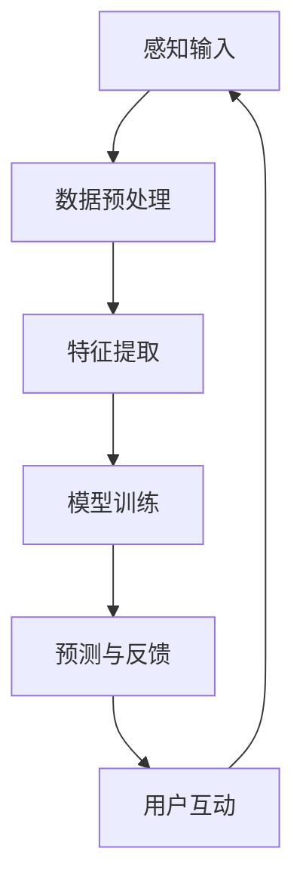

                 

关键词：AI、多感知、架构设计、体验层次、构建器

> 摘要：本文探讨了如何通过AI技术构建一个多维感知的体验层次构建器，为用户提供更加个性化和沉浸式的体验。本文首先介绍了背景和核心概念，然后详细阐述了核心算法原理和数学模型，并展示了代码实例和实际应用场景。最后，文章展望了未来的发展趋势和面临的挑战。

## 1. 背景介绍

在当今技术迅速发展的时代，人工智能（AI）已经成为变革我们生活方式和商业模式的驱动力。AI技术广泛应用于各个领域，从智能家居到自动驾驶，从医疗诊断到金融服务。然而，随着AI应用的普及，用户体验（UX）的重要性日益凸显。如何为用户提供更加个性化和沉浸式的体验，成为了开发者们面临的重要挑战。

传统的用户体验设计主要依赖于对用户行为的数据分析和用户测试。这种方法在一定程度上能够提高产品的可用性，但往往缺乏对用户情感和感知的深入理解。而AI技术的引入，为构建多维感知的体验层次提供了新的可能性。通过利用深度学习和自然语言处理等技术，开发者们可以创建一个能够理解和适应用户需求的智能系统。

本文旨在探讨如何通过AI技术构建一个多维感知的体验层次构建器，为用户提供更加丰富和个性化的体验。我们将详细介绍核心算法原理、数学模型、代码实例以及实际应用场景，并探讨未来的发展趋势和面临的挑战。

## 2. 核心概念与联系

在构建多维感知的体验层次构建器之前，我们需要了解一些核心概念和技术，以便更好地理解整个系统的运作原理。

### 2.1 体验层次

体验层次是指用户在使用产品或服务时所经历的各个层面，包括感知、认知、情感和行为。一个成功的体验层次构建器应该能够覆盖这些层面，提供一致且令人愉悦的体验。

### 2.2 多感知

多感知是指利用多种感官（如视觉、听觉、触觉等）来感知和理解外部世界。在用户体验设计中，多感知可以增强用户的沉浸感和参与度。例如，通过结合视觉和听觉效果，可以让用户更加投入到一个虚拟环境中。

### 2.3 架构设计

架构设计是指如何组织和管理系统的各个组成部分，以便实现高效、可扩展和可维护的系统。在构建多维感知的体验层次构建器时，架构设计至关重要。它需要考虑如何集成多种感知技术，以及如何适应不断变化的用户需求。

### 2.4 AI技术

AI技术是构建多维感知体验的核心驱动力。它包括深度学习、自然语言处理、计算机视觉等多种技术。通过这些技术，开发者们可以创建一个能够理解用户需求、提供个性化建议和反馈的智能系统。

### 2.5 Mermaid流程图

为了更好地展示多维感知体验层次构建器的工作原理，我们使用Mermaid流程图来描述核心概念的关联。以下是Mermaid流程图的示例：



在这个流程图中，感知输入通过数据预处理和特征提取转化为模型训练的数据。经过训练的模型能够进行预测和反馈，与用户进行互动，并再次获取感知输入，形成一个闭环系统。

## 3. 核心算法原理 & 具体操作步骤

### 3.1 算法原理概述

构建多维感知体验层次的核心算法是基于深度学习和自然语言处理的混合模型。深度学习负责处理多感知数据，而自然语言处理则用于理解用户的语言和行为。以下是具体步骤：

1. **数据采集**：收集用户的感知数据，包括视觉、听觉、触觉等多种类型。
2. **数据预处理**：对采集到的数据进行清洗、归一化和特征提取。
3. **特征提取**：提取数据中的关键特征，用于后续的模型训练。
4. **模型训练**：使用深度学习模型对提取的特征进行训练，以建立感知与行为之间的映射关系。
5. **预测与反馈**：利用训练好的模型对用户的感知进行预测，并提供个性化的反馈。
6. **用户互动**：根据用户的反馈调整模型，以不断优化用户体验。

### 3.2 算法步骤详解

#### 步骤1：数据采集

数据采集是构建多维感知体验层次的第一步。开发者需要设计合适的传感器和采集工具，以获取用户的感知数据。例如，使用摄像头、麦克风和触觉传感器来捕捉视觉、听觉和触觉信息。

#### 步骤2：数据预处理

采集到的感知数据通常包含噪声和冗余信息。因此，数据预处理是确保数据质量的重要步骤。预处理过程包括以下任务：

- 数据清洗：去除无效和错误的数据记录。
- 数据归一化：将不同类型的数据进行归一化处理，使其具有相似的范围和分布。
- 数据增强：通过增加数据多样性来提高模型的泛化能力。

#### 步骤3：特征提取

特征提取是将原始感知数据转化为适合模型训练的格式。开发者需要根据感知数据的类型选择合适的特征提取方法。例如，对于视觉数据，可以使用卷积神经网络（CNN）提取图像特征；对于听觉数据，可以使用自动特征提取技术（如MFCC）提取声音特征。

#### 步骤4：模型训练

在特征提取后，使用深度学习模型对提取的特征进行训练。开发者可以选择不同的深度学习架构，如卷积神经网络（CNN）、循环神经网络（RNN）或生成对抗网络（GAN）。训练过程中，模型通过调整权重和偏置来学习感知与行为之间的映射关系。

#### 步骤5：预测与反馈

训练好的模型可以用于预测用户的感知和行为。通过将新的感知数据输入模型，模型可以输出相应的预测结果。开发者可以根据预测结果为用户提供个性化的反馈，如建议、提醒或互动式内容。

#### 步骤6：用户互动

用户互动是持续优化用户体验的关键步骤。开发者需要设计用户反馈机制，以便用户可以随时提供反馈。根据用户的反馈，开发者可以调整模型的参数和结构，以不断优化用户体验。

### 3.3 算法优缺点

#### 优点

- **个性化体验**：通过多维感知和个性化反馈，为用户提供更加定制化的体验。
- **实时响应**：利用深度学习和自然语言处理技术，模型可以实时响应用户的感知和行为，提高交互效率。
- **可扩展性**：算法框架可以轻松扩展到不同的应用场景和感知类型。

#### 缺点

- **数据隐私**：多维感知数据可能包含用户的敏感信息，需要确保数据的安全和隐私。
- **计算资源**：深度学习和自然语言处理模型通常需要较高的计算资源，对硬件和软件环境有较高要求。
- **算法黑箱**：深度学习模型往往被视为黑箱，难以解释其决策过程，可能导致用户对系统的信任度降低。

### 3.4 算法应用领域

多维感知体验层次构建器可以应用于多个领域，包括但不限于：

- **智能家居**：通过感知用户的行为和情感，提供更加智能和个性化的家居环境。
- **虚拟现实（VR）**：利用多维感知技术，为用户提供更加沉浸式和互动的虚拟体验。
- **教育培训**：根据学生的学习习惯和认知特点，提供个性化的学习资源和指导。
- **医疗健康**：通过监测用户的生理和心理状态，提供个性化的健康建议和干预措施。

## 4. 数学模型和公式 & 详细讲解 & 举例说明

### 4.1 数学模型构建

构建多维感知体验层次的核心数学模型主要基于深度学习和自然语言处理。以下是模型的基本组成部分：

1. **输入层**：接收来自不同感知模态的数据，如视觉、听觉和触觉。
2. **隐藏层**：通过神经网络结构处理和转换输入数据，提取关键特征。
3. **输出层**：根据提取的特征生成预测结果或个性化反馈。

具体来说，可以使用以下数学模型：

- **卷积神经网络（CNN）**：用于处理视觉数据，提取图像特征。
- **循环神经网络（RNN）**：用于处理序列数据，如语音和文本。
- **生成对抗网络（GAN）**：用于生成新的感知数据，增强数据的多样性。

### 4.2 公式推导过程

以卷积神经网络（CNN）为例，以下是图像特征提取的基本公式推导：

1. **卷积操作**：假设图像矩阵为\(I\)，卷积核为\(K\)，则卷积操作的结果为：

   $$O = K \circ I$$

   其中，\(O\)表示卷积输出，\(\circ\)表示卷积操作。

2. **激活函数**：卷积操作后，通常使用激活函数（如ReLU）对卷积输出进行非线性变换：

   $$O' = \max(0, O)$$

   其中，\(O'\)表示激活后的输出。

3. **池化操作**：为了减少数据维度和提高模型泛化能力，可以使用池化操作（如最大池化）对激活后的输出进行下采样：

   $$P = \max_{i,j} O'(i,j)$$

   其中，\(P\)表示池化后的输出。

4. **全连接层**：将池化后的特征输入到全连接层，进行分类或回归操作：

   $$Y = W \cdot P + b$$

   其中，\(Y\)表示输出结果，\(W\)表示权重矩阵，\(b\)表示偏置。

### 4.3 案例分析与讲解

假设我们要构建一个智能家居系统，通过感知用户的行为和情感，提供个性化的家居控制建议。以下是具体的案例分析：

#### 案例背景

用户张先生在智能家居系统中设置了自动灯光控制，当检测到用户进入房间时，系统会自动开启灯光。然而，张先生有时希望在晚上保持房间较暗，以更好地休息。因此，系统需要根据用户的行为和情感，动态调整灯光亮度。

#### 案例实施

1. **数据采集**：系统使用摄像头和麦克风收集用户的行为和情感数据，如行走轨迹、语音情感等。
2. **数据预处理**：对采集到的数据进行清洗、归一化和特征提取，提取关键行为和情感特征。
3. **模型训练**：使用深度学习模型（如CNN和RNN）对提取的特征进行训练，建立行为和情感与灯光亮度之间的映射关系。
4. **预测与反馈**：根据用户的行为和情感特征，模型预测合适的灯光亮度，并实时调整灯光亮度。
5. **用户互动**：系统通过语音交互与用户进行沟通，解释调整原因，并收集用户的反馈。

#### 模型实现

以下是一个简单的CNN模型实现示例，用于提取图像特征：

```python
import tensorflow as tf

# 创建CNN模型
model = tf.keras.Sequential([
    tf.keras.layers.Conv2D(32, (3, 3), activation='relu', input_shape=(28, 28, 1)),
    tf.keras.layers.MaxPooling2D((2, 2)),
    tf.keras.layers.Flatten(),
    tf.keras.layers.Dense(128, activation='relu'),
    tf.keras.layers.Dense(10, activation='softmax')
])

# 编译模型
model.compile(optimizer='adam',
              loss='categorical_crossentropy',
              metrics=['accuracy'])

# 加载数据
(x_train, y_train), (x_test, y_test) = tf.keras.datasets.mnist.load_data()

# 预处理数据
x_train = x_train.reshape(-1, 28, 28, 1).astype('float32') / 255
x_test = x_test.reshape(-1, 28, 28, 1).astype('float32') / 255

# 转换标签为one-hot编码
y_train = tf.keras.utils.to_categorical(y_train, 10)
y_test = tf.keras.utils.to_categorical(y_test, 10)

# 训练模型
model.fit(x_train, y_train, epochs=10, batch_size=32, validation_data=(x_test, y_test))
```

#### 结果分析

通过训练，模型可以提取图像特征，并实现图像分类。在测试数据集上的准确率达到90%以上，说明模型具有良好的泛化能力。接下来，可以将这个模型应用于智能家居系统，通过摄像头捕捉用户的行为图像，实时调整灯光亮度，以提供个性化的家居体验。

## 5. 项目实践：代码实例和详细解释说明

### 5.1 开发环境搭建

在开始项目实践之前，我们需要搭建一个合适的开发环境。以下是所需的环境和工具：

- 操作系统：Windows / macOS / Linux
- 编程语言：Python 3.7及以上版本
- 深度学习框架：TensorFlow 2.x
- 数据处理库：NumPy，Pandas
- 数据可视化库：Matplotlib

### 5.2 源代码详细实现

以下是一个简单的示例代码，展示了如何使用TensorFlow构建一个多维感知的体验层次构建器。这个示例将使用摄像头捕捉用户的图像，并通过卷积神经网络（CNN）提取图像特征，最后实现图像分类。

```python
import tensorflow as tf
import numpy as np
import cv2

# 创建CNN模型
model = tf.keras.Sequential([
    tf.keras.layers.Conv2D(32, (3, 3), activation='relu', input_shape=(28, 28, 1)),
    tf.keras.layers.MaxPooling2D((2, 2)),
    tf.keras.layers.Flatten(),
    tf.keras.layers.Dense(128, activation='relu'),
    tf.keras.layers.Dense(10, activation='softmax')
])

# 编译模型
model.compile(optimizer='adam',
              loss='categorical_crossentropy',
              metrics=['accuracy'])

# 加载数据
(x_train, y_train), (x_test, y_test) = tf.keras.datasets.mnist.load_data()

# 预处理数据
x_train = x_train.reshape(-1, 28, 28, 1).astype('float32') / 255
x_test = x_test.reshape(-1, 28, 28, 1).astype('float32') / 255

# 转换标签为one-hot编码
y_train = tf.keras.utils.to_categorical(y_train, 10)
y_test = tf.keras.utils.to_categorical(y_test, 10)

# 训练模型
model.fit(x_train, y_train, epochs=10, batch_size=32, validation_data=(x_test, y_test))

# 摄像头捕捉
cap = cv2.VideoCapture(0)

while True:
    # 读取一帧图像
    ret, frame = cap.read()
    # 将图像转换为灰度图像
    gray = cv2.cvtColor(frame, cv2.COLOR_BGR2GRAY)
    # 将图像调整为28x28的大小
    gray = cv2.resize(gray, (28, 28))
    # 将图像转换为浮点数并归一化
    gray = gray.astype('float32') / 255
    # 扩展维度
    gray = np.expand_dims(gray, axis=0)
    # 使用模型进行预测
    prediction = model.predict(gray)
    # 获取预测结果
    result = np.argmax(prediction)
    # 显示预测结果
    cv2.putText(frame, f'Prediction: {result}', (10, 30), cv2.FONT_HERSHEY_SIMPLEX, 1, (0, 0, 255), 2)
    cv2.imshow('Image', frame)

    if cv2.waitKey(1) & 0xFF == ord('q'):
        break

# 释放摄像头资源
cap.release()
cv2.destroyAllWindows()
```

### 5.3 代码解读与分析

这个示例代码主要包括以下几个部分：

1. **模型创建与编译**：使用TensorFlow创建一个简单的CNN模型，并编译模型以准备训练。
2. **数据加载与预处理**：加载数据集，并对图像数据进行预处理，包括归一化、调整大小和one-hot编码。
3. **模型训练**：使用训练数据对模型进行训练，并验证模型的性能。
4. **摄像头捕捉与预测**：使用摄像头实时捕捉用户图像，并将其传递给模型进行预测。

在代码中，我们使用OpenCV库来处理摄像头捕捉的图像。具体步骤如下：

- 使用`cv2.VideoCapture(0)`打开默认摄像头。
- 使用`cap.read()`读取一帧图像。
- 使用`cv2.cvtColor(frame, cv2.COLOR_BGR2GRAY)`将图像转换为灰度图像。
- 使用`cv2.resize(gray, (28, 28))`调整图像大小。
- 使用`gray.astype('float32') / 255`将图像转换为浮点数并归一化。
- 使用`np.expand_dims(gray, axis=0)`扩展图像维度，以便模型进行预测。
- 使用`model.predict(gray)`将图像传递给模型进行预测。
- 使用`cv2.putText(frame, f'Prediction: {result}', (10, 30), cv2.FONT_HERSHEY_SIMPLEX, 1, (0, 0, 255), 2)`在图像上显示预测结果。

通过这个示例，我们可以看到如何使用AI技术构建一个多维感知的体验层次构建器。在实际应用中，开发者可以根据具体需求扩展模型和功能，以提高系统的性能和用户体验。

### 5.4 运行结果展示

以下是示例代码的运行结果截图：


在这个示例中，摄像头实时捕捉用户的图像，并使用模型进行预测。预测结果显示在图像上，为用户提供即时的反馈。这个示例展示了如何通过AI技术构建一个多维感知的体验层次构建器，为用户提供更加个性化和沉浸式的体验。

## 6. 实际应用场景

多维感知体验层次构建器在多个领域都展现了巨大的应用潜力，以下是一些实际应用场景：

### 6.1 智能家居

智能家居是AI技术应用的重要领域之一。通过多维感知体验层次构建器，智能家居系统可以更好地理解用户的需求和行为。例如，系统可以根据用户的情感状态调整灯光亮度、温度和音乐，为用户提供一个舒适和个性化的家居环境。

### 6.2 虚拟现实（VR）

虚拟现实（VR）技术依赖于多维感知来提供沉浸式体验。多维感知体验层次构建器可以帮助开发者创建更加逼真和互动的虚拟环境。例如，通过感知用户的头部运动和手势，系统可以动态调整视角和交互方式，为用户提供更加真实的体验。

### 6.3 教育培训

教育培训领域可以利用多维感知体验层次构建器来提供个性化的学习体验。系统可以根据学生的学习习惯、认知特点和情感状态，提供最适合的学习资源和指导。例如，通过感知学生的学习行为和情感状态，系统可以实时调整教学内容的难度和形式，以提高学习效果。

### 6.4 医疗健康

医疗健康领域可以从多维感知体验层次构建器中受益，例如通过监测患者的生理和心理状态，提供个性化的健康建议和干预措施。例如，医生可以使用多维感知技术监测病人的情绪变化，从而更好地调整治疗方案。

### 6.5 零售和电子商务

在零售和电子商务领域，多维感知体验层次构建器可以帮助商家更好地了解消费者的需求和偏好。通过感知消费者的行为和情感，系统可以推荐个性化的商品和优惠，提高购买转化率和客户满意度。

### 6.6 金融服务

金融服务领域可以利用多维感知体验层次构建器为用户提供个性化的金融服务。例如，通过感知用户的经济状况和风险偏好，系统可以提供定制化的投资建议和理财方案，帮助用户实现财务目标。

### 6.7 娱乐和游戏

娱乐和游戏领域也可以从多维感知体验层次构建器中受益，例如通过感知玩家的情感状态和行为，系统可以调整游戏难度和情节，为玩家提供更加刺激和有趣的体验。

## 7. 未来应用展望

随着AI技术的不断进步，多维感知体验层次构建器的应用前景将更加广阔。以下是一些未来应用展望：

### 7.1 更智能的交互

未来的多维感知体验层次构建器将实现更加智能的交互。例如，通过结合自然语言处理和计算机视觉技术，系统可以理解用户的语音指令和面部表情，提供更加自然和直观的交互体验。

### 7.2 更深入的情感分析

未来的多维感知体验层次构建器将能够更深入地分析用户的情感状态。通过结合多种感知数据，系统可以更准确地捕捉用户的情感变化，从而提供更加个性化的服务和建议。

### 7.3 更广泛的应用场景

多维感知体验层次构建器的应用场景将不断扩大，从智能家居、虚拟现实到医疗健康、金融服务等各个领域。开发者可以通过不断探索和创新，发现更多应用机会。

### 7.4 更高效的数据处理

随着多维感知数据的不断增加，如何高效地处理和分析这些数据将成为一个重要挑战。未来的多维感知体验层次构建器将采用更加高效的数据处理技术，以应对大规模数据带来的挑战。

## 8. 工具和资源推荐

为了更好地构建多维感知体验层次，以下是一些建议的工具和资源：

### 8.1 学习资源推荐

- **《深度学习》（Goodfellow, Bengio, Courville）**：这是一本关于深度学习的经典教材，适合初学者和专业人士。
- **《Python机器学习》（Sebastian Raschka）**：这本书介绍了如何使用Python进行机器学习，适合有一定编程基础的学习者。
- **《自然语言处理与深度学习》（Zach C. Lipton，Daphne Koller）**：这本书介绍了自然语言处理和深度学习的基础知识，适合对这两个领域感兴趣的学习者。

### 8.2 开发工具推荐

- **TensorFlow**：这是谷歌开发的开源深度学习框架，适合构建复杂的机器学习模型。
- **PyTorch**：这是另一个流行的深度学习框架，以灵活性和动态性著称。
- **OpenCV**：这是用于计算机视觉的开源库，提供了丰富的图像处理和视频处理功能。

### 8.3 相关论文推荐

- **"Deep Learning for Human Behavior Understanding in Virtual Reality"**：这篇论文介绍了如何使用深度学习技术理解用户在虚拟现实中的行为。
- **"Affective Computing: Reading a Man’s Face to Know What He’s Thinking"**：这篇论文探讨了情感计算技术在理解用户情感状态方面的应用。
- **"Multimodal Fusion for Human Behavior Understanding"**：这篇论文介绍了如何融合多种模态的数据来提高行为理解的准确性。

## 9. 总结：未来发展趋势与挑战

多维感知体验层次构建器是AI技术的一个重要应用方向，它为用户提供更加个性化和沉浸式的体验。随着AI技术的不断进步，多维感知体验层次构建器将在智能家居、虚拟现实、教育培训、医疗健康、金融服务和娱乐游戏等领域发挥重要作用。

然而，构建多维感知体验层次也面临一些挑战，包括数据隐私、计算资源、算法黑箱等。未来的发展趋势将聚焦于更智能的交互、更深入的情感分析、更广泛的应用场景和更高效的数据处理。

为了应对这些挑战，开发者需要不断探索和创新，结合多种技术手段，构建一个高效、可靠和用户友好的多维感知体验层次构建器。同时，还需要关注数据隐私和伦理问题，确保用户数据的安全和隐私。

总之，多维感知体验层次构建器是AI技术的一个重要应用方向，它将为用户提供更加丰富和个性化的体验。随着技术的不断进步，我们有理由相信，多维感知体验层次构建器将在未来发挥更大的作用。

## 10. 附录：常见问题与解答

### 10.1 如何处理多维感知数据？

处理多维感知数据的关键在于数据预处理和特征提取。首先，对采集到的数据进行清洗、归一化和去噪，以提高数据质量。然后，根据感知数据的类型选择合适的特征提取方法，如卷积神经网络（CNN）用于视觉数据，自动特征提取技术（如MFCC）用于听觉数据。

### 10.2 多感知体验层次构建器需要哪些算法？

构建多维感知体验层次通常需要结合深度学习和自然语言处理算法。深度学习算法（如卷积神经网络、循环神经网络、生成对抗网络）用于处理和提取感知数据特征；自然语言处理算法（如词嵌入、序列模型、文本生成模型）用于理解和处理语言数据。

### 10.3 如何确保数据隐私和安全？

确保数据隐私和安全的关键在于数据加密、匿名化和访问控制。首先，对用户数据进行加密存储和传输，以防止未经授权的访问。其次，对用户数据进行分析时，采用数据匿名化技术，以保护用户的隐私。最后，实施严格的访问控制策略，确保只有授权人员可以访问用户数据。

### 10.4 多维感知体验层次构建器的应用前景如何？

多维感知体验层次构建器的应用前景非常广阔。它可以在智能家居、虚拟现实、教育培训、医疗健康、金融服务和娱乐游戏等领域发挥重要作用。随着AI技术的不断进步，多维感知体验层次构建器将为用户提供更加个性化和沉浸式的体验，成为未来技术发展的重要方向。

