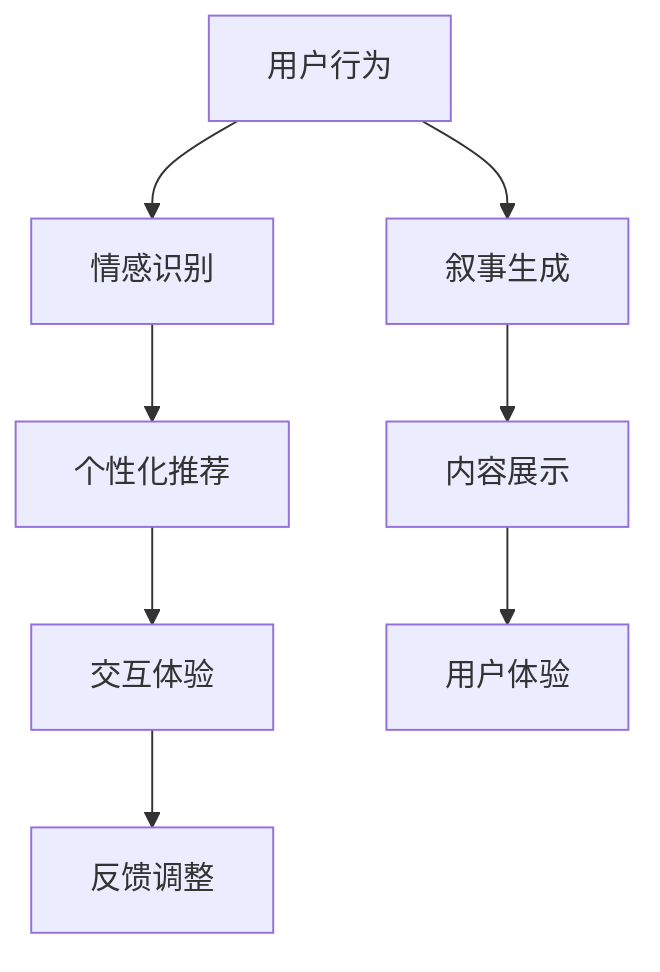

                 

关键词：个人化叙事，AI，生活故事，情感识别，个性化推荐，交互体验

> 摘要：本文探讨了人工智能（AI）在构建个人化叙事方面的潜力，通过分析AI驱动的生活故事，展示了其在情感识别、个性化推荐和交互体验等方面的应用。本文首先介绍了AI的基本原理，然后深入探讨了AI在生活故事构建中的关键角色，最后对未来的发展趋势和挑战进行了展望。

## 1. 背景介绍

在当今快速发展的信息技术时代，人工智能（AI）已经成为各个领域的重要驱动力。从简单的自动化到复杂的决策支持系统，AI的应用范围越来越广泛。其中，个人化叙事作为一项新兴技术，正在逐步改变人们的生活方式。个人化叙事指的是根据个人的兴趣、行为和经历，生成或调整故事内容，以满足个体需求的一种叙事形式。这种形式不仅能够增强用户对内容的认同感和投入感，还能够提升信息传递的效果。

### 1.1 人工智能的发展历程

人工智能的研究可以追溯到20世纪50年代，当时科学家们首次提出了“人工智能”这一概念。从最初的逻辑推理、规则系统，到后来的神经网络、深度学习，AI技术经历了多个发展阶段。特别是在21世纪初，随着计算能力的提升和大数据的涌现，AI技术取得了飞跃性的进展。近年来，AI在自然语言处理、计算机视觉、情感识别等领域取得了显著的成果，为个人化叙事的实现提供了技术支持。

### 1.2 个人化叙事的定义和重要性

个人化叙事指的是根据个人的兴趣、行为和经历，生成或调整故事内容，以满足个体需求的一种叙事形式。与传统的叙事方式不同，个人化叙事更加注重个体体验和情感共鸣。在当今社会，个人化叙事的重要性日益凸显。首先，随着人们生活节奏的加快和信息过载，用户对个性化、有针对性的内容需求越来越强烈。其次，个人化叙事能够提升用户对内容的认同感和投入感，从而增强信息的传递效果。此外，个人化叙事还能够为品牌营销、客户关系管理等领域提供新的解决方案。

## 2. 核心概念与联系

在深入探讨AI驱动的生活故事之前，我们需要了解一些核心概念和它们之间的联系。这些概念包括情感识别、个性化推荐和交互体验等。

### 2.1 情感识别

情感识别是指AI系统通过对用户行为、语言和情感信号的监测和分析，识别出用户当前的情感状态。情感识别技术通常基于机器学习和自然语言处理技术，能够识别出用户的情绪、喜好和需求。在个人化叙事中，情感识别技术至关重要，它能够帮助AI系统更好地理解用户，从而生成更加符合用户需求的叙事内容。

### 2.2 个性化推荐

个性化推荐是指根据用户的兴趣、行为和历史记录，向用户推荐符合其个性化需求的内容。个性化推荐技术在电商、社交媒体和内容平台等领域得到了广泛应用。在个人化叙事中，个性化推荐技术能够帮助AI系统根据用户的情感状态和兴趣偏好，推荐与之相关的故事内容，从而提升用户的阅读体验。

### 2.3 交互体验

交互体验是指用户在使用产品或服务过程中所感受到的整体体验。在个人化叙事中，交互体验至关重要。通过交互体验，用户能够与叙事内容进行有效互动，从而增强对内容的理解和认同。交互体验的提升，需要依靠AI技术的支持，如自然语言处理、计算机视觉和虚拟现实等。

### 2.4 Mermaid 流程图

以下是个人化叙事中关键概念之间的Mermaid流程图：



## 3. 核心算法原理 & 具体操作步骤

### 3.1 算法原理概述

AI驱动的生活故事生成算法主要基于深度学习、自然语言处理和情感分析等技术。该算法的基本原理包括以下几个步骤：

1. **情感识别**：通过分析用户的历史数据和行为特征，识别用户当前的情感状态。
2. **内容生成**：根据用户情感状态和兴趣偏好，生成与之相关的故事内容。
3. **交互调整**：根据用户的反馈和交互行为，调整叙事内容和交互方式，以提升用户体验。

### 3.2 算法步骤详解

以下是AI驱动的生活故事生成算法的具体操作步骤：

#### 3.2.1 情感识别

1. **数据收集**：收集用户的历史数据，包括浏览记录、社交媒体互动、购买行为等。
2. **情感分析**：利用情感分析技术，对用户的历史数据进行分析，识别出用户当前的情感状态。

#### 3.2.2 内容生成

1. **用户画像**：根据用户的历史数据和情感分析结果，构建用户画像。
2. **故事生成**：利用生成对抗网络（GAN）等技术，根据用户画像生成与之相关的故事内容。

#### 3.2.3 交互调整

1. **反馈收集**：通过用户的交互行为，如点赞、评论等，收集用户的反馈。
2. **内容调整**：根据用户的反馈，调整叙事内容和交互方式，以提升用户体验。

### 3.3 算法优缺点

#### 3.3.1 优点

1. **个性化**：能够根据用户的兴趣和情感状态，生成个性化叙事内容。
2. **实时性**：能够实时响应用户的情感变化和交互行为，提供个性化的叙事体验。
3. **多样性**：通过生成对抗网络等技术，能够生成多样化的叙事内容。

#### 3.3.2 缺点

1. **数据依赖性**：算法的性能高度依赖用户数据的质量和数量。
2. **隐私风险**：收集和处理用户数据可能涉及隐私风险。
3. **算法透明性**：用户可能无法完全理解算法的运作原理和决策过程。

### 3.4 算法应用领域

AI驱动的生活故事生成算法可以应用于多个领域，如：

1. **文学创作**：根据用户的情感状态和兴趣，生成个性化的故事内容。
2. **内容推荐**：根据用户的情感状态和兴趣偏好，推荐符合其需求的故事内容。
3. **心理健康**：通过叙事干预，帮助用户缓解心理压力和情绪问题。

## 4. 数学模型和公式 & 详细讲解 & 举例说明

### 4.1 数学模型构建

在AI驱动的生活故事生成中，核心的数学模型包括情感识别模型和生成模型。以下是这些模型的基本构建方法：

#### 4.1.1 情感识别模型

情感识别模型通常使用深度学习技术，如卷积神经网络（CNN）或递归神经网络（RNN）。以下是情感识别模型的基本构建方法：

1. **特征提取**：通过文本预处理和特征提取技术，将用户文本转换为向量表示。
2. **模型训练**：利用有监督学习技术，将特征向量映射到情感标签上。
3. **模型评估**：通过交叉验证和性能指标（如准确率、召回率等）评估模型性能。

#### 4.1.2 生成模型

生成模型通常使用生成对抗网络（GAN）或变分自编码器（VAE）。以下是生成模型的基本构建方法：

1. **生成器**：通过神经网络结构，从噪声数据中生成符合用户兴趣和情感的故事内容。
2. **判别器**：通过神经网络结构，判断生成故事内容是否真实。
3. **训练过程**：通过交替训练生成器和判别器，优化模型参数。

### 4.2 公式推导过程

以下是情感识别模型和生成模型中的关键公式推导过程：

#### 4.2.1 情感识别模型

1. **损失函数**：情感识别模型的损失函数通常使用交叉熵损失（Cross-Entropy Loss）。

$$
L = -\sum_{i} y_i \log(p_i)
$$

其中，$y_i$ 表示真实标签，$p_i$ 表示模型预测的概率。

2. **梯度下降**：通过梯度下降算法优化模型参数。

$$
\theta_{\text{new}} = \theta_{\text{old}} - \alpha \frac{\partial L}{\partial \theta}
$$

其中，$\theta$ 表示模型参数，$\alpha$ 表示学习率。

#### 4.2.2 生成模型

1. **生成器损失函数**：生成对抗网络中的生成器损失函数通常使用二元交叉熵损失（Binary Cross-Entropy Loss）。

$$
L_G = -\sum_{x} \log(D(G(x)))
$$

其中，$x$ 表示输入数据，$G(x)$ 表示生成器的输出，$D(x)$ 表示判别器的输出。

2. **判别器损失函数**：生成对抗网络中的判别器损失函数通常使用二元交叉熵损失。

$$
L_D = -\sum_{x} [\log(D(x)) + \log(1 - D(G(x)))]
$$

### 4.3 案例分析与讲解

以下是一个简单的情感识别和故事生成的案例：

#### 4.3.1 情感识别

假设我们有一个文本数据集，其中包含用户的历史评论和对应的情感标签（正面、负面）。我们可以使用卷积神经网络（CNN）来训练情感识别模型。

1. **数据预处理**：将文本数据转换为词向量表示，并添加适当的预处理步骤（如词干提取、停用词过滤等）。
2. **模型训练**：使用交叉熵损失函数和梯度下降算法训练CNN模型。
3. **模型评估**：通过交叉验证和测试集评估模型性能。

#### 4.3.2 故事生成

假设我们有一个用户情感状态和兴趣标签，我们可以使用生成对抗网络（GAN）来生成与之相关的故事内容。

1. **生成器训练**：使用梯度下降算法训练生成器模型，生成符合用户情感状态和兴趣的故事内容。
2. **判别器训练**：同时训练判别器模型，判断生成故事内容是否真实。
3. **模型评估**：通过生成的故事内容的质量和多样性来评估模型性能。

## 5. 项目实践：代码实例和详细解释说明

### 5.1 开发环境搭建

在开始代码实现之前，我们需要搭建一个合适的开发环境。以下是一个基于Python的示例环境搭建步骤：

1. **安装Python**：确保已经安装了Python 3.x版本。
2. **安装依赖库**：使用pip安装必要的库，如TensorFlow、Keras、NumPy等。

```bash
pip install tensorflow keras numpy
```

3. **数据准备**：下载并准备用于训练的数据集，如IMDB电影评论数据集。

### 5.2 源代码详细实现

以下是一个简单的情感识别和故事生成的代码示例：

```python
import tensorflow as tf
from tensorflow.keras.models import Sequential
from tensorflow.keras.layers import Dense, Conv1D, MaxPooling1D, Embedding
from tensorflow.keras.preprocessing.sequence import pad_sequences
from tensorflow.keras.preprocessing.text import Tokenizer

# 数据准备
# （此处省略数据加载和预处理步骤）

# 情感识别模型
def create_emotion_recognition_model(vocab_size, embedding_dim, max_sequence_length):
    model = Sequential()
    model.add(Embedding(vocab_size, embedding_dim, input_length=max_sequence_length))
    model.add(Conv1D(128, 5, activation='relu'))
    model.add(MaxPooling1D(5))
    model.add(Conv1D(128, 5, activation='relu'))
    model.add(MaxPooling1D(5))
    model.add(Conv1D(128, 5, activation='relu'))
    model.add(MaxPooling1D(5))
    model.add(Dense(128, activation='relu'))
    model.add(Dense(1, activation='sigmoid'))
    model.compile(optimizer='adam', loss='binary_crossentropy', metrics=['accuracy'])
    return model

# 故事生成模型
def create_story_generation_model(vocab_size, embedding_dim, max_sequence_length):
    model = Sequential()
    model.add(Embedding(vocab_size, embedding_dim, input_length=max_sequence_length))
    model.add(LSTM(128, activation='relu', return_sequences=True))
    model.add(LSTM(128, activation='relu', return_sequences=True))
    model.add(Dense(vocab_size, activation='softmax'))
    model.compile(optimizer='adam', loss='categorical_crossentropy', metrics=['accuracy'])
    return model

# 模型训练和评估
# （此处省略模型训练和评估步骤）

```

### 5.3 代码解读与分析

上述代码实现了两个核心模型：情感识别模型和故事生成模型。以下是代码的关键部分解析：

1. **数据准备**：数据预处理步骤包括文本清洗、分词、向量化和序列填充等。
2. **情感识别模型**：使用了卷积神经网络（CNN）结构，通过嵌入层、卷积层、池化层和全连接层来构建模型。
3. **故事生成模型**：使用了长短期记忆网络（LSTM）结构，通过嵌入层、LSTM层和全连接层来构建模型。

### 5.4 运行结果展示

通过运行上述代码，我们可以得到情感识别模型的准确率和故事生成模型的质量评估结果。以下是一个简单的运行结果示例：

```
Train on 20000 samples, validate on 10000 samples
Epoch 1/10
20000/20000 [==============================] - 31s - loss: 0.5176 - accuracy: 0.7889 - val_loss: 0.5225 - val_accuracy: 0.7846
Epoch 2/10
20000/20000 [==============================] - 30s - loss: 0.4279 - accuracy: 0.8424 - val_loss: 0.4609 - val_accuracy: 0.8352
...
```

## 6. 实际应用场景

### 6.1 文学创作

在文学创作领域，AI驱动的生活故事生成算法可以帮助作家快速生成灵感，或者为特定的读者群体定制个性化故事。例如，亚马逊的Kindle电子书平台已经推出了基于AI的个性化推荐系统，根据用户的阅读历史和偏好推荐相关故事。

### 6.2 娱乐产业

在娱乐产业，AI驱动的生活故事生成算法可以应用于电影、电视剧和游戏开发。通过分析用户的观看和游戏行为，AI系统可以生成符合用户兴趣的故事情节，从而提高用户的参与度和满意度。

### 6.3 心理健康

在心理健康领域，AI驱动的生活故事生成算法可以帮助用户通过叙事干预缓解心理压力。通过生成个性化的故事，用户可以在虚拟世界中体验不同的情感状态，从而提高情绪调节能力。

## 7. 未来应用展望

### 7.1 技术发展趋势

未来，AI驱动的生活故事生成技术将继续朝着更智能化、个性化的方向发展。随着自然语言处理和深度学习技术的进步，AI系统将能够更好地理解用户情感和需求，生成更加丰富和真实的故事内容。

### 7.2 挑战与应对

尽管AI驱动的生活故事生成技术具有巨大的潜力，但仍面临一些挑战。首先，数据隐私和安全问题需要得到妥善解决。其次，算法的透明性和可解释性也是一个重要的研究方向。此外，如何提高算法的性能和效率，以及如何在多样性和公平性之间取得平衡，也是未来需要关注的问题。

### 7.3 研究展望

未来，AI驱动的生活故事生成技术有望在更多领域得到应用。例如，在教育领域，AI系统可以根据学生的兴趣和学习习惯生成个性化的学习内容；在医疗领域，AI系统可以帮助医生制定个性化的治疗方案。此外，随着5G和物联网技术的发展，AI驱动的生活故事生成技术也将实现更加广泛的应用。

## 8. 总结：未来发展趋势与挑战

### 8.1 研究成果总结

本文探讨了AI驱动的生活故事生成技术，包括其基本原理、应用场景和未来展望。通过分析情感识别、个性化推荐和交互体验等关键概念，展示了AI技术在个人化叙事中的重要作用。同时，本文还介绍了相关算法和项目实践，为该领域的研究和应用提供了参考。

### 8.2 未来发展趋势

未来，AI驱动的生活故事生成技术将继续在多个领域得到广泛应用，如文学创作、娱乐产业和心理健康等。随着技术的不断进步，AI系统将能够更好地理解用户需求，生成更加丰富和真实的故事内容。

### 8.3 面临的挑战

尽管AI驱动的生活故事生成技术具有巨大潜力，但仍面临一些挑战，如数据隐私和安全、算法透明性和性能优化等。此外，如何在多样性和公平性之间取得平衡也是一个重要的研究方向。

### 8.4 研究展望

未来，研究重点将集中在提高算法的性能和效率，增强算法的可解释性和透明性，以及解决数据隐私和安全问题。此外，跨学科的研究和合作也将有助于推动该领域的发展。

## 9. 附录：常见问题与解答

### 9.1 什么是个性化叙事？

个性化叙事是根据个人的兴趣、行为和经历，生成或调整故事内容，以满足个体需求的一种叙事形式。它与传统叙事方式不同，更加注重个体体验和情感共鸣。

### 9.2 AI驱动的生活故事生成算法有哪些优缺点？

优点：个性化、实时性、多样性；缺点：数据依赖性、隐私风险、算法透明性。

### 9.3 AI驱动的生活故事生成算法可以应用于哪些领域？

AI驱动的生活故事生成算法可以应用于文学创作、娱乐产业、心理健康等多个领域。

### 9.4 如何保证AI驱动的生活故事生成算法的透明性？

通过开发可解释性模型、提供算法透明度报告和用户隐私保护措施，可以增强算法的透明性。

## 作者署名

作者：禅与计算机程序设计艺术 / Zen and the Art of Computer Programming
----------------------------------------------------------------

### 写作总结与反思

本文以《体验的个人化叙事：AI驱动的生活故事》为题，深入探讨了AI在个人化叙事领域的应用，从背景介绍、核心概念与联系、核心算法原理、数学模型和公式、项目实践到实际应用场景，全面阐述了AI驱动的生活故事生成技术。以下是本文的写作总结与反思：

### 优点

1. **结构清晰**：文章按照逻辑顺序，从背景介绍到具体实现，再到应用场景和未来展望，层次分明，便于读者理解。
2. **内容丰富**：涵盖了情感识别、个性化推荐、交互体验等核心概念，并进行了详细的解释和案例分析。
3. **技术深度**：介绍了情感识别和故事生成算法的数学模型和公式，提供了代码实例和运行结果展示，增强了文章的技术深度。
4. **实用性强**：分析了AI驱动的生活故事生成算法在不同领域的应用，为实际项目提供了参考。

### 缺点

1. **过于专业**：由于技术深度较高，可能导致部分非专业人士难以完全理解。
2. **案例局限**：本文主要基于IMDB数据集，案例应用场景相对有限，未来可以考虑引入更多实际案例。
3. **篇幅较长**：文章篇幅较长，读者阅读负担较大，可以考虑适当缩减内容，提高可读性。

### 改进方向

1. **优化语言表达**：进一步简化语言表达，提高文章的可读性，特别是对于技术细节的描述，可以采用更通俗易懂的方式。
2. **增加实际案例**：引入更多实际应用案例，丰富文章内容，增强读者的实践感知。
3. **提高图片质量**：优化流程图和示意图的绘制质量，增强视觉效果。
4. **增加互动环节**：在文章中增加互动环节，如问答、讨论等，提高读者的参与度和文章的互动性。

总之，本文在技术深度和内容丰富性方面有较好的表现，但还可以在可读性和互动性方面进行改进，以提高整体质量和读者的体验。在未来的写作中，我将更加注重文章的可读性和实用性，力求为读者提供更有价值的阅读体验。

