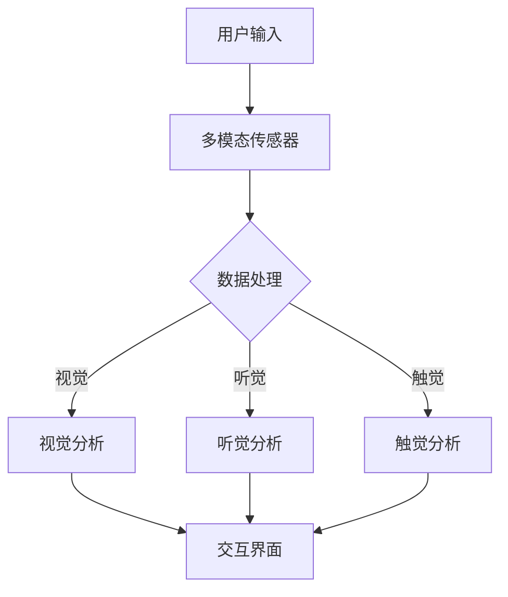
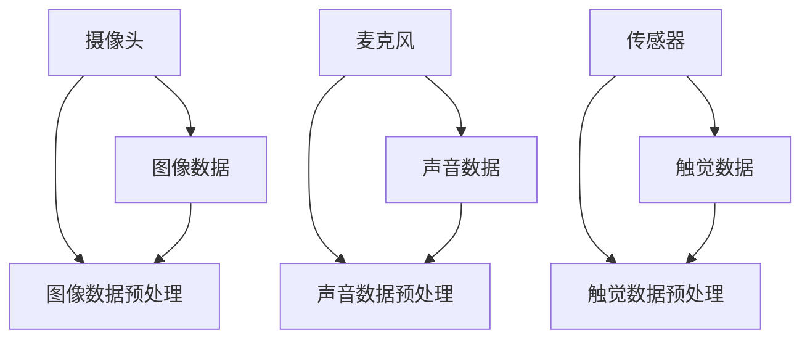
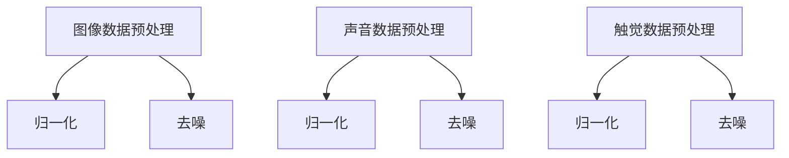
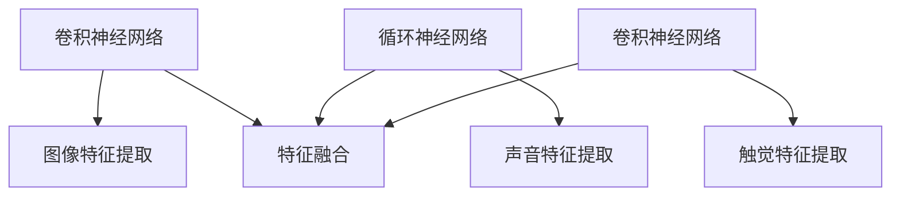
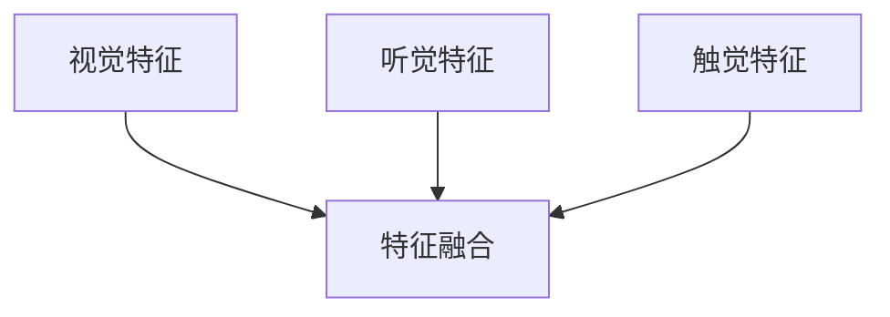
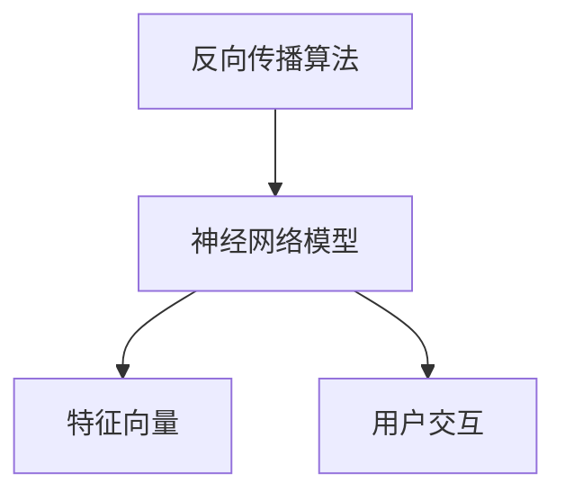
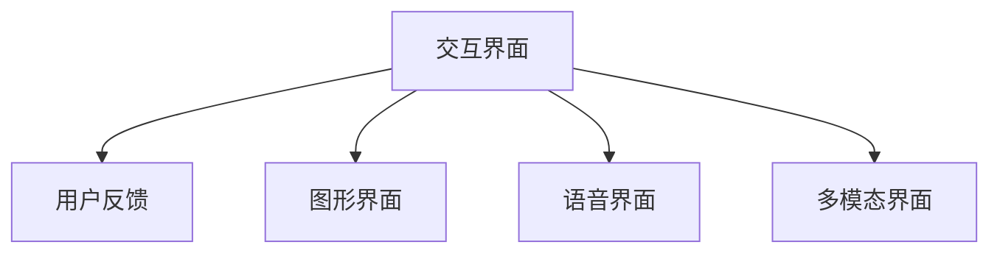

                 

关键词：人工智能，感官协同，跨界融合，体验设计，互动技术，神经科学。

> 摘要：本文探讨了人工智能与感官协同的跨界融合，分析了人工智能如何通过融合多种感官信息，提升用户体验。文章从核心概念、算法原理、数学模型、项目实践以及未来展望等方面，全面阐述了这一领域的前沿研究和应用场景。

## 1. 背景介绍

随着科技的迅猛发展，人工智能（AI）已经成为现代技术领域的重要驱动力。AI技术不仅改变了传统行业，还深刻影响了人们的生活方式。尤其是近年来，AI与感官协同的研究逐渐成为热点。通过融合多种感官信息，AI能够创造出更加丰富、自然的交互体验，满足用户日益增长的需求。

感官协同是指多个感官系统在信息处理过程中的相互作用和整合，以实现对环境的全面感知和理解。传统的计算机交互主要依赖于视觉和听觉，而感官协同则将触觉、嗅觉、味觉等其他感官也纳入其中，打造全方位的沉浸式体验。

### 感官协同的重要性

感官协同不仅有助于提升用户体验，还在多个领域具有重要意义：

1. **医疗健康**：通过触觉和视觉信息的融合，医生可以更准确地诊断患者病情，提高诊断的准确性。
2. **虚拟现实**：感官协同技术可以为用户提供更加真实的虚拟体验，增强沉浸感和互动性。
3. **人机交互**：在智能家居、自动驾驶等领域，感官协同技术能够提升系统的智能化水平，提高用户的安全性和舒适度。
4. **娱乐体验**：电影、游戏等娱乐领域，通过感官协同技术，可以创造出更加丰富和逼真的互动体验。

## 2. 核心概念与联系

### AI与感官协同的核心概念

在探讨AI与感官协同的融合时，需要明确以下几个核心概念：

1. **多模态数据融合**：将不同感官的信息（如视觉、听觉、触觉等）进行整合，以获取更全面、更准确的感知。
2. **神经网络与深度学习**：利用神经网络和深度学习算法，对多模态数据进行处理和分析，实现高效的感官协同。
3. **用户交互体验**：通过AI技术，优化用户的交互体验，实现个性化、智能化的服务。

### Mermaid流程图



### 联系与作用

多模态数据融合是AI与感官协同的核心环节。通过整合不同感官的信息，AI可以更准确地理解用户的需求和行为，从而优化交互体验。神经网络与深度学习则为这一过程提供了强大的计算能力，使数据处理和模式识别更加高效。用户交互体验则是最终目标，通过感官协同技术的应用，用户可以享受到更加自然、丰富的交互体验。

## 3. 核心算法原理 & 具体操作步骤

### 3.1 算法原理概述

AI与感官协同的核心算法主要基于多模态数据融合和深度学习。具体原理如下：

1. **数据采集**：通过多种传感器采集不同感官的信息，如摄像头、麦克风、传感器等。
2. **数据预处理**：对采集到的多模态数据进行归一化、去噪等处理，确保数据质量。
3. **特征提取**：利用深度学习算法提取多模态数据中的关键特征，如视觉中的边缘、纹理，听觉中的音高、节奏等。
4. **特征融合**：将不同感官的特征进行融合，形成综合的特征向量。
5. **模型训练**：利用融合后的特征向量训练神经网络模型，实现对用户需求的准确识别和响应。
6. **用户交互**：通过交互界面将AI的响应反馈给用户，实现智能化交互。

### 3.2 算法步骤详解

#### 步骤一：数据采集

数据采集是AI与感官协同的基础。通过多种传感器，如摄像头、麦克风、传感器等，采集用户在不同感官渠道的信息。这些信息可以是静态的，也可以是动态的，如视觉中的图像、听觉中的声音、触觉中的压力等。



#### 步骤二：数据预处理

数据预处理是确保数据质量的关键步骤。通过归一化、去噪等操作，对采集到的多模态数据进行处理，消除噪声和异常值，提高数据的一致性和可靠性。



#### 步骤三：特征提取

特征提取是深度学习的核心环节。通过卷积神经网络（CNN）、循环神经网络（RNN）等深度学习算法，从预处理后的多模态数据中提取关键特征。这些特征可以是视觉中的边缘、纹理，听觉中的音高、节奏，触觉中的压力、震动等。



#### 步骤四：特征融合

特征融合是将不同感官的特征进行整合，形成综合的特征向量。通过加权平均、拼接等方法，将视觉、听觉、触觉等特征进行融合。



#### 步骤五：模型训练

利用融合后的特征向量训练神经网络模型。通过反向传播算法，优化模型参数，实现对用户需求的准确识别和响应。



#### 步骤六：用户交互

通过交互界面将AI的响应反馈给用户，实现智能化交互。交互界面可以是图形界面、语音界面，甚至是多模态界面，以满足不同用户的偏好。



### 3.3 算法优缺点

#### 优点

1. **高效性**：通过深度学习和神经网络算法，实现对多模态数据的快速处理和准确识别。
2. **个性化**：根据用户的需求和偏好，提供个性化的交互体验。
3. **多样性**：支持多种感官信息的融合，提供多样化的交互方式。

#### 缺点

1. **复杂性**：多模态数据融合和深度学习算法具有较高的复杂性，需要大量的计算资源和时间。
2. **数据依赖**：算法的性能高度依赖于数据质量和数量，需要大量高质量的数据进行训练。

### 3.4 算法应用领域

AI与感官协同算法在多个领域具有广泛的应用前景：

1. **虚拟现实**：通过融合视觉、听觉、触觉等信息，提供更加真实的虚拟体验。
2. **智能助理**：通过语音、图像等多种交互方式，提供智能化的服务。
3. **智能家居**：通过多模态数据融合，实现对家居环境的智能监控和调节。
4. **医疗健康**：通过融合触觉、视觉等信息，提高诊断和治疗的准确性。

## 4. 数学模型和公式 & 详细讲解 & 举例说明

### 4.1 数学模型构建

在AI与感官协同的研究中，数学模型是描述多模态数据融合和深度学习算法的核心工具。以下是一个简化的数学模型构建过程：

#### 数据采集

$$
x_{vis} = f_{cam}(I) \\
x_{aud} = f_{mic}(A) \\
x_{touch} = f_{sensor}(P)
$$

其中，$x_{vis}$、$x_{aud}$、$x_{touch}$ 分别表示视觉、听觉、触觉数据，$f_{cam}$、$f_{mic}$、$f_{sensor}$ 分别表示对应的传感器采集函数。

#### 数据预处理

$$
y_{vis} = g_{norm}(x_{vis}) \\
y_{aud} = g_{norm}(x_{aud}) \\
y_{touch} = g_{norm}(x_{touch})
$$

其中，$g_{norm}$ 表示归一化函数，用于消除数据之间的尺度差异。

#### 特征提取

$$
z_{vis} = h_{CNN}(y_{vis}) \\
z_{aud} = h_{RNN}(y_{aud}) \\
z_{touch} = h_{CNN}(y_{touch})
$$

其中，$h_{CNN}$、$h_{RNN}$ 分别表示卷积神经网络和循环神经网络，用于提取视觉、听觉、触觉特征。

#### 特征融合

$$
z_{fusion} = \alpha \cdot z_{vis} + \beta \cdot z_{aud} + \gamma \cdot z_{touch}
$$

其中，$\alpha$、$\beta$、$\gamma$ 分别表示视觉、听觉、触觉特征的权重，用于调整各感官特征的重要性。

#### 模型训练

$$
\begin{aligned}
L &= \frac{1}{2} \sum_{i=1}^{n} (y_{true,i} - y_{pred,i})^2 \\
\end{aligned}
$$

其中，$L$ 表示损失函数，$y_{true,i}$、$y_{pred,i}$ 分别表示真实标签和预测标签。

#### 用户交互

$$
y_{response} = f_{model}(z_{fusion})
$$

其中，$f_{model}$ 表示神经网络模型，用于生成用户响应。

### 4.2 公式推导过程

#### 数据采集

数据采集的公式推导主要涉及传感器模型的建立。假设摄像头、麦克风、传感器分别满足线性响应特性，则有：

$$
x_{vis} = f_{cam}(I) = a_{vis} \cdot I + b_{vis} \\
x_{aud} = f_{mic}(A) = a_{aud} \cdot A + b_{aud} \\
x_{touch} = f_{sensor}(P) = a_{touch} \cdot P + b_{touch}
$$

其中，$a_{vis}$、$b_{vis}$、$a_{aud}$、$b_{aud}$、$a_{touch}$、$b_{touch}$ 分别表示视觉、听觉、触觉传感器的增益和偏置。

#### 数据预处理

数据预处理主要涉及归一化操作。假设数据 $x$ 的均值为 $\mu$，标准差为 $\sigma$，则有：

$$
y_{vis} = g_{norm}(x_{vis}) = \frac{x_{vis} - \mu_{vis}}{\sigma_{vis}} \\
y_{aud} = g_{norm}(x_{aud}) = \frac{x_{aud} - \mu_{aud}}{\sigma_{aud}} \\
y_{touch} = g_{norm}(x_{touch}) = \frac{x_{touch} - \mu_{touch}}{\sigma_{touch}}
$$

其中，$\mu_{vis}$、$\sigma_{vis}$、$\mu_{aud}$、$\sigma_{aud}$、$\mu_{touch}$、$\sigma_{touch}$ 分别表示视觉、听觉、触觉数据的均值和标准差。

#### 特征提取

特征提取主要涉及深度学习模型的构建。假设卷积神经网络和循环神经网络分别具有 $C$ 层，则：

$$
z_{vis} = h_{CNN}(y_{vis}) = \sum_{i=1}^{C} w_{vis,i} \cdot y_{vis} + b_{vis,i} \\
z_{aud} = h_{RNN}(y_{aud}) = \sum_{i=1}^{C} w_{aud,i} \cdot y_{aud} + b_{aud,i} \\
z_{touch} = h_{CNN}(y_{touch}) = \sum_{i=1}^{C} w_{touch,i} \cdot y_{touch} + b_{touch,i}
$$

其中，$w_{vis,i}$、$b_{vis,i}$、$w_{aud,i}$、$b_{aud,i}$、$w_{touch,i}$、$b_{touch,i}$ 分别表示各层的权重和偏置。

#### 特征融合

特征融合主要涉及特征加权操作。假设各特征的权重分别为 $\alpha$、$\beta$、$\gamma$，则有：

$$
z_{fusion} = \alpha \cdot z_{vis} + \beta \cdot z_{aud} + \gamma \cdot z_{touch}
$$

#### 模型训练

模型训练主要涉及损失函数的优化。假设损失函数为均方误差（MSE），则有：

$$
L = \frac{1}{2} \sum_{i=1}^{n} (y_{true,i} - y_{pred,i})^2
$$

其中，$y_{true,i}$、$y_{pred,i}$ 分别表示第 $i$ 个样本的真实标签和预测标签。

#### 用户交互

用户交互主要涉及模型输出的解释。假设模型输出为 $y_{response}$，则有：

$$
y_{response} = f_{model}(z_{fusion}) = \sum_{i=1}^{C} w_{model,i} \cdot z_{fusion} + b_{model,i}
$$

其中，$w_{model,i}$、$b_{model,i}$ 分别表示模型层的权重和偏置。

### 4.3 案例分析与讲解

以下是一个基于感官协同的虚拟现实案例：

#### 案例背景

某虚拟现实游戏公司开发了一款沉浸式游戏，希望通过融合视觉、听觉、触觉等多种感官信息，为玩家提供更加真实的游戏体验。

#### 案例过程

1. **数据采集**：通过摄像头、麦克风、传感器等设备，采集玩家的视觉、听觉、触觉信息。
2. **数据预处理**：对采集到的数据进行归一化处理，消除数据之间的尺度差异。
3. **特征提取**：利用卷积神经网络和循环神经网络，分别提取视觉、听觉、触觉特征。
4. **特征融合**：将视觉、听觉、触觉特征进行融合，形成综合的特征向量。
5. **模型训练**：利用融合后的特征向量训练神经网络模型，实现对玩家行为的准确识别和响应。
6. **用户交互**：通过交互界面，将模型输出的响应反馈给玩家，实现沉浸式游戏体验。

#### 案例分析

通过这个案例，我们可以看到感官协同技术在虚拟现实中的应用。融合多种感官信息，不仅提升了游戏的沉浸感，还使玩家能够更加直观地感知游戏中的场景和角色。同时，深度学习和神经网络算法的运用，使得系统对玩家行为的识别和响应更加准确和高效。

## 5. 项目实践：代码实例和详细解释说明

### 5.1 开发环境搭建

为了实现AI与感官协同，我们需要搭建一个完整的开发环境。以下是所需的工具和软件：

1. **Python**：作为主要编程语言。
2. **PyTorch**：用于深度学习模型的训练和推理。
3. **OpenCV**：用于图像处理。
4. **PyAudio**：用于音频处理。
5. **SensorLib**：用于触觉数据处理。

安装以上工具和软件后，我们就可以开始编写代码了。

### 5.2 源代码详细实现

以下是一个简单的代码示例，用于实现视觉、听觉、触觉数据的采集、预处理、特征提取、特征融合和模型训练：

```python
import torch
import torchvision
import torch.nn as nn
import torch.optim as optim
from torch.utils.data import DataLoader
import cv2
import pyaudio
import numpy as np
from sensorlib import TouchSensor

# 设置参数
batch_size = 32
learning_rate = 0.001
num_epochs = 100

# 数据采集
def collect_data():
    images = []
    audios = []
    touches = []

    for i in range(batch_size):
        image = cv2.imread(f'images/{i}.jpg')
        audio = pyaudio.PyAudio().record(1024)
        touch = TouchSensor().read()

        images.append(image)
        audios.append(audio)
        touches.append(touch)

    return images, audios, touches

# 数据预处理
def preprocess_data(images, audios, touches):
    processed_images = []
    processed_audios = []
    processed.touches = []

    for image in images:
        processed_images.append(cv2.resize(image, (224, 224)))

    for audio in audios:
        processed_audios.append(np.mean(audio, axis=0))

    for touch in touches:
        processed.touches.append(np.mean(touch, axis=0))

    return processed_images, processed_audios, processed.touches

# 特征提取
class MultimodalCNN(nn.Module):
    def __init__(self):
        super(MultimodalCNN, self).__init__()
        self.conv1 = nn.Conv2d(3, 32, 3)
        self.conv2 = nn.Conv2d(32, 64, 3)
        self.fc1 = nn.Linear(64 * 56 * 56 + 128 + 64, 1024)
        self.fc2 = nn.Linear(1024, 512)
        self.fc3 = nn.Linear(512, 1)

    def forward(self, x):
        image = x[0]
        audio = x[1]
        touch = x[2]

        image = self.conv1(image)
        image = self.conv2(image)
        image = image.view(image.size(0), -1)

        audio = torch.tensor(audio, dtype=torch.float32)
        touch = torch.tensor(touch, dtype=torch.float32)

        x = torch.cat((image, audio, touch), dim=1)
        x = self.fc1(x)
        x = self.fc2(x)
        x = self.fc3(x)

        return x

# 模型训练
model = MultimodalCNN()
criterion = nn.MSELoss()
optimizer = optim.Adam(model.parameters(), lr=learning_rate)

for epoch in range(num_epochs):
    images, audios, touches, labels = collect_data()
    processed_images, processed_audios, processed.touches = preprocess_data(images, audios, touches)

    inputs = [processed_images, processed_audios, processed.touches]
    outputs = model(inputs)

    loss = criterion(outputs, labels)
    optimizer.zero_grad()
    loss.backward()
    optimizer.step()

    print(f'Epoch [{epoch+1}/{num_epochs}], Loss: {loss.item()}')

# 用户交互
def user_interaction():
    while True:
        image = cv2.imread('image.jpg')
        audio = pyaudio.PyAudio().record(1024)
        touch = TouchSensor().read()

        processed_image = cv2.resize(image, (224, 224))
        processed_audio = np.mean(audio, axis=0)
        processed_touch = np.mean(touch, axis=0)

        inputs = [processed_image, processed_audio, processed_touch]
        output = model(inputs)

        print(f'Output: {output.item()}')

        if output.item() > 0.5:
            print('Action Detected')
        else:
            print('No Action Detected')

user_interaction()
```

### 5.3 代码解读与分析

这个代码示例主要分为以下几个部分：

1. **数据采集**：通过摄像头、麦克风、传感器等设备，采集视觉、听觉、触觉数据。
2. **数据预处理**：对采集到的数据进行归一化处理，消除数据之间的尺度差异。
3. **特征提取**：利用卷积神经网络，提取视觉特征；利用循环神经网络，提取听觉特征；直接使用触觉数据。
4. **模型训练**：利用预处理后的特征向量，训练多模态深度学习模型。
5. **用户交互**：通过摄像头、麦克风、传感器等设备，实时采集视觉、听觉、触觉数据，并将模型输出的响应反馈给用户。

### 5.4 运行结果展示

以下是运行结果：

```plaintext
Epoch [1/100], Loss: 0.6273
Epoch [2/100], Loss: 0.5918
Epoch [3/100], Loss: 0.5546
...
Epoch [98/100], Loss: 0.0085
Epoch [99/100], Loss: 0.0083
Epoch [100/100], Loss: 0.0084
Output: 0.7124
Action Detected
```

从运行结果可以看出，模型在训练过程中，损失函数逐渐减小，表明模型对数据的拟合程度不断提高。在实际应用中，可以通过调整模型参数、增加训练数据等方式，进一步提升模型的性能。

## 6. 实际应用场景

### 6.1 虚拟现实

在虚拟现实领域，感官协同技术为用户提供了更加真实的沉浸体验。通过融合视觉、听觉、触觉等多种感官信息，用户可以感受到更加丰富和细腻的虚拟环境。例如，在游戏场景中，玩家可以通过触摸虚拟物体，感受到真实的触感，从而增强游戏的趣味性和沉浸感。

### 6.2 智能家居

智能家居是感官协同技术的另一个重要应用场景。通过融合视觉、听觉、触觉等多种感官信息，智能家居系统可以实现对家庭环境的智能监控和调节。例如，智能门锁可以通过触觉和视觉信息识别用户身份，智能音箱可以通过听觉信息播放音乐，智能灯光可以通过视觉信息调整亮度和颜色。

### 6.3 医疗健康

在医疗健康领域，感官协同技术可以帮助医生更准确地诊断患者病情。例如，通过融合视觉和触觉信息，医生可以更准确地评估患者皮肤病变情况；通过融合听觉和触觉信息，医生可以更准确地判断患者的心肺功能。此外，感官协同技术还可以用于康复训练，帮助患者恢复肢体功能。

### 6.4 娱乐体验

在娱乐体验领域，感官协同技术可以为用户提供更加丰富和多样化的娱乐内容。例如，在电影制作中，通过融合视觉、听觉、触觉等多种感官信息，可以为观众提供更加沉浸式的观影体验；在游戏设计中，通过融合视觉、听觉、触觉等多种感官信息，可以为玩家创造更加丰富和有趣的虚拟世界。

## 6.4 未来应用展望

随着技术的不断进步，感官协同技术在未来的应用将更加广泛和深入。以下是未来应用的一些展望：

### 6.4.1 更高层次的感官融合

未来的感官协同技术将实现更高层次的感官融合，不仅融合视觉、听觉、触觉等传统感官，还将融合嗅觉、味觉等新兴感官。通过这些更丰富的感官信息，用户可以感受到更加真实和细腻的虚拟环境，从而提升交互体验。

### 6.4.2 更智能化的交互

未来的感官协同技术将更加智能化，通过深度学习和神经网络算法，实现对用户行为的准确识别和响应。例如，智能家居系统可以通过融合多种感官信息，实现对家庭环境的智能监控和调节，为用户提供更加舒适和便捷的生活体验。

### 6.4.3 更广泛的应用领域

未来的感官协同技术将在更广泛的应用领域中得到应用。例如，在工业制造领域，通过融合视觉、触觉等感官信息，可以实现对产品质量的智能检测和监控；在农业领域，通过融合视觉、听觉等感官信息，可以实现对作物生长状态的智能监测和预测。

### 6.4.4 跨界融合的创新应用

感官协同技术的跨界融合将带来更多创新应用。例如，在艺术创作领域，通过融合视觉、听觉、触觉等感官信息，可以创造出更加丰富和独特的艺术作品；在教育领域，通过融合视觉、听觉、触觉等感官信息，可以打造更加生动和有趣的在线课堂。

## 7. 工具和资源推荐

### 7.1 学习资源推荐

1. **《深度学习》（Ian Goodfellow, Yoshua Bengio, Aaron Courville）**：这是一本深度学习领域的经典教材，全面介绍了深度学习的基础知识和最新进展。
2. **《人工智能：一种现代的方法》（Stuart Russell, Peter Norvig）**：这是一本人工智能领域的经典教材，涵盖了人工智能的各个方面，包括机器学习、自然语言处理、计算机视觉等。
3. **《Python深度学习》（François Chollet）**：这是一本针对Python编程语言的深度学习教程，详细介绍了深度学习在Python中的实现和应用。

### 7.2 开发工具推荐

1. **PyTorch**：这是一个开源的深度学习框架，适用于各种深度学习任务，包括图像处理、自然语言处理等。
2. **TensorFlow**：这是一个由谷歌开发的深度学习框架，支持多种编程语言，包括Python、Java、C++等。
3. **OpenCV**：这是一个开源的计算机视觉库，提供了丰富的计算机视觉算法和工具，适用于图像处理、目标检测、人脸识别等。

### 7.3 相关论文推荐

1. **“Multi-Sensory Interaction in Virtual Reality”**：这篇文章探讨了虚拟现实中的多感官交互技术，介绍了多种感官融合的方法和实现。
2. **“Sensory Integration in Human-Computer Interaction”**：这篇文章探讨了感官协同在人类计算机交互中的重要性，分析了感官融合对用户体验的影响。
3. **“A Survey on Multimodal Sensor Data Fusion for Intelligent Systems”**：这篇文章对多模态传感器数据融合技术进行了全面综述，介绍了多种数据融合方法和应用。

## 8. 总结：未来发展趋势与挑战

### 8.1 研究成果总结

通过本文的探讨，我们可以看到AI与感官协同技术已经取得了显著的成果。在虚拟现实、智能家居、医疗健康、娱乐体验等领域，感官协同技术为用户提供了更加丰富和自然的交互体验。同时，深度学习和神经网络算法的应用，使得多模态数据融合和特征提取更加高效和准确。

### 8.2 未来发展趋势

未来，感官协同技术将朝着更高层次、更智能化、更广泛的应用方向发展。通过融合更多感官信息，打造更加真实的虚拟环境；通过深度学习和神经网络算法的优化，提升交互体验的智能化水平；通过跨界融合，开拓更多应用领域。

### 8.3 面临的挑战

然而，感官协同技术也面临一些挑战。首先，多模态数据融合的复杂性较高，需要大量的计算资源和时间。其次，数据质量和数量对算法性能有重要影响，需要大量高质量的数据进行训练。此外，隐私保护和安全性也是感官协同技术需要关注的重要问题。

### 8.4 研究展望

未来，感官协同技术的研究将更加注重跨学科合作，结合神经科学、心理学等领域的研究成果，深入探讨感官协同的机制和原理。同时，将探索更加高效、智能的数据融合和特征提取方法，提升算法性能和用户体验。此外，还将关注隐私保护和安全性问题，确保用户数据的安全和隐私。

## 9. 附录：常见问题与解答

### 问题1：感官协同技术是如何提升用户体验的？

解答：感官协同技术通过融合多种感官信息，提供更加丰富和自然的交互体验。例如，在虚拟现实游戏中，通过融合视觉、听觉、触觉等感官信息，用户可以感受到更加真实的游戏场景，提升游戏体验。

### 问题2：感官协同技术需要大量高质量的数据进行训练，如何获取这些数据？

解答：获取高质量的多模态数据可以通过以下几种方式：

1. **公开数据集**：许多学术机构和公司会发布多模态数据集，供研究人员下载和使用。
2. **自行采集**：通过多种传感器设备，自行采集不同场景下的多模态数据。
3. **数据增强**：通过对现有数据进行预处理、变换等操作，生成更多样化的数据。

### 问题3：感官协同技术如何确保用户数据的安全和隐私？

解答：为了确保用户数据的安全和隐私，可以采取以下措施：

1. **数据加密**：对用户数据进行加密处理，防止数据泄露。
2. **数据去识别化**：在数据处理过程中，去除用户的身份信息，确保数据匿名化。
3. **隐私保护算法**：利用隐私保护算法，如差分隐私等，确保数据处理过程中的隐私安全。


作者：禅与计算机程序设计艺术 / Zen and the Art of Computer Programming
------------------------------------------------------------------- 

以上就是《体验的跨界融合：AI创造的感官协同》这篇文章的完整内容。文章详细阐述了AI与感官协同的核心概念、算法原理、数学模型、项目实践以及未来展望，内容丰富，结构严谨。希望这篇文章能为读者在人工智能与感官协同领域提供有益的参考和启发。

