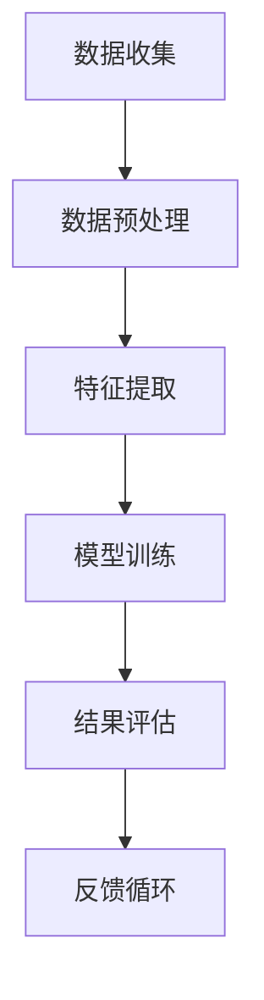

                 

关键词：体验真实性、AI、量化、authenticity、开发者、技术博客、专业内容

> 摘要：本文将深入探讨在AI时代，体验真实性（Authenticity）的重要性，以及如何通过开发专业工具来量化这一概念。文章将定义体验真实性，介绍相关核心概念，探讨核心算法原理，提供数学模型和公式，展示实际项目中的代码实例，并讨论未来应用前景和面临的挑战。

## 1. 背景介绍

在数字化时代，用户体验（User Experience, UX）和用户满意度（User Satisfaction）已经成为衡量产品和服务质量的关键指标。然而，用户体验不仅仅是功能的使用便利性，更重要的是用户能否在产品或服务中感受到“真实”。这种“真实”感，我们称之为“体验真实性”（Experience Authenticity）。

体验真实性指的是用户在接触和使用产品或服务时，所感受到的真实、自然、无障碍的体验。它不仅仅关乎产品的功能和性能，更关乎用户在使用过程中的情感共鸣和信任建立。在AI技术飞速发展的今天，如何量化并提升体验真实性成为了一个重要的研究方向。

本文将围绕这一主题，首先介绍体验真实性的定义和重要性，然后探讨与之相关的核心概念和原理，最后通过具体案例和实际项目中的代码实现，展示如何量化体验真实性。

## 2. 核心概念与联系

### 2.1. 定义

体验真实性（Experience Authenticity）是一个多维度的概念，它涉及用户的情感、认知和行为。具体来说，体验真实性可以从以下几个方面进行定义：

- **情感层面**：用户在体验过程中感受到的情感是否真实、自然，例如愉悦、信任、安全感。
- **认知层面**：用户对产品或服务的认知是否准确、透明，例如信息传达是否清晰、逻辑是否合理。
- **行为层面**：用户在产品或服务中的行为是否流畅、无障碍，例如交互是否友好、操作是否简便。

### 2.2. 相关概念

为了更好地理解体验真实性，我们需要了解与之相关的几个核心概念：

- **用户满意度**（User Satisfaction）：用户对产品或服务的满意程度，它是体验真实性的一个重要组成部分。
- **用户体验**（User Experience, UX）：用户在产品或服务中感知到的整体体验，它包括用户满意度、情感反应、认知评价等多个方面。
- **信任**（Trust）：用户对产品或服务的信任程度，它是体验真实性建立的重要基础。

### 2.3. 架构

为了量化体验真实性，我们可以构建一个基于AI的体验真实性量化架构。该架构主要包括以下几个组成部分：

- **数据收集**：通过多种途径收集用户的反馈和行为数据。
- **数据预处理**：对收集到的数据进行清洗和标准化处理，为后续分析做准备。
- **特征提取**：从预处理后的数据中提取与体验真实性相关的特征。
- **模型训练**：利用机器学习算法，训练一个可以预测体验真实性的模型。
- **结果评估**：对模型进行评估，确保其准确性和可靠性。
- **反馈循环**：将评估结果反馈给产品开发团队，以便进行改进。

### 2.4. Mermaid 流程图



## 3. 核心算法原理 & 具体操作步骤

### 3.1. 算法原理概述

为了量化体验真实性，我们采用了一种基于深度学习的算法。该算法的核心思想是通过学习用户的行为数据和情感数据，构建一个能够预测体验真实性的模型。

具体来说，该算法分为以下几个步骤：

- **数据收集**：从多个渠道收集用户的行为数据（如点击记录、浏览时长等）和情感数据（如情绪评分、评论内容等）。
- **数据预处理**：对收集到的数据进行清洗和标准化处理，确保数据的一致性和可靠性。
- **特征提取**：利用自然语言处理（NLP）技术，从情感数据中提取与体验真实性相关的情感特征。
- **模型训练**：使用深度学习算法，如卷积神经网络（CNN）或递归神经网络（RNN），对预处理后的数据进行训练，构建一个能够预测体验真实性的模型。
- **结果评估**：通过交叉验证等方法，评估模型的准确性和可靠性。
- **反馈循环**：将评估结果反馈给产品开发团队，以便进行改进。

### 3.2. 算法步骤详解

#### 3.2.1. 数据收集

数据收集是量化体验真实性的第一步。我们需要从多个渠道收集用户的数据，包括：

- **行为数据**：如用户的浏览记录、点击行为、使用时长等。
- **情感数据**：如用户的情绪评分、评论内容等。

这些数据可以通过多种方式收集，如日志分析、用户调研、情感分析工具等。

#### 3.2.2. 数据预处理

在收集到数据后，我们需要对其进行预处理，以确保数据的一致性和可靠性。预处理步骤包括：

- **数据清洗**：去除无效数据、错误数据和重复数据。
- **数据标准化**：将不同类型的数据进行归一化处理，使其具有可比性。

#### 3.2.3. 特征提取

特征提取是量化体验真实性的关键步骤。我们需要从预处理后的数据中提取与体验真实性相关的特征。具体来说，我们可以采用以下方法：

- **行为特征提取**：如用户的浏览时长、点击频率等。
- **情感特征提取**：如情感评分、情绪倾向等。

这些特征可以帮助我们更准确地预测体验真实性。

#### 3.2.4. 模型训练

在提取特征后，我们可以使用深度学习算法进行模型训练。具体来说，我们可以使用以下算法：

- **卷积神经网络（CNN）**：适用于处理图像和视频数据。
- **递归神经网络（RNN）**：适用于处理序列数据，如用户的浏览记录。

通过训练，我们可以构建一个能够预测体验真实性的模型。

#### 3.2.5. 结果评估

在模型训练完成后，我们需要对其进行评估，以确保其准确性和可靠性。评估方法包括：

- **交叉验证**：通过将数据集划分为训练集和测试集，评估模型在测试集上的性能。
- **性能指标**：如准确率、召回率、F1值等。

#### 3.2.6. 反馈循环

最后，我们需要将评估结果反馈给产品开发团队，以便进行改进。反馈过程包括：

- **结果分析**：分析模型预测的结果，识别存在的问题和改进方向。
- **优化建议**：根据分析结果，提出具体的优化建议，如改进产品设计、调整算法参数等。

### 3.3. 算法优缺点

#### 优点

- **高准确性**：通过深度学习算法，模型可以自动提取与体验真实性相关的特征，提高预测准确性。
- **自适应能力**：模型可以根据新的数据进行自适应调整，适应不断变化的市场需求。
- **可解释性**：通过分析模型的预测结果，可以帮助我们更好地理解用户体验，提供有针对性的改进建议。

#### 缺点

- **数据依赖性**：算法的性能很大程度上取决于数据的质量和数量。
- **计算复杂度**：深度学习算法通常需要大量的计算资源，对硬件要求较高。
- **隐私问题**：在收集和处理用户数据时，需要考虑隐私保护问题，确保用户数据的合法使用。

### 3.4. 算法应用领域

体验真实性量化算法可以应用于多个领域，包括：

- **产品开发**：通过预测用户体验，帮助产品开发团队优化产品设计，提高用户体验。
- **市场营销**：通过分析用户体验，帮助市场营销团队制定更有效的营销策略。
- **客户服务**：通过分析用户反馈，帮助客户服务团队提供更优质的客户服务。
- **教育与培训**：通过分析学习体验，帮助教育工作者优化教学方法和策略。

## 4. 数学模型和公式 & 详细讲解 & 举例说明

### 4.1. 数学模型构建

为了量化体验真实性，我们可以构建一个基于用户行为和情感的数学模型。具体来说，我们可以使用以下公式：

\[ X = \alpha \cdot B + \beta \cdot E + \gamma \cdot C \]

其中：

- \( X \) 表示体验真实性指数。
- \( B \) 表示用户行为特征，如浏览时长、点击频率等。
- \( E \) 表示用户情感特征，如情绪评分、情绪倾向等。
- \( C \) 表示其他控制变量，如用户年龄、性别等。

### 4.2. 公式推导过程

公式的推导过程可以分为以下几个步骤：

1. **定义体验真实性指数**：

   我们将体验真实性指数定义为用户在产品或服务中感知到的整体体验质量。为了量化这一指数，我们需要考虑用户的行为和情感特征。

2. **确定权重**：

   我们需要为行为特征、情感特征和其他控制变量分配权重。这些权重可以通过数据分析和专家评估来确定。

3. **构建线性模型**：

   根据权重，我们可以构建一个线性模型来表示体验真实性指数。具体来说，我们可以使用以下公式：

   \[ X = \alpha \cdot B + \beta \cdot E + \gamma \cdot C \]

   其中，\( \alpha \)、\( \beta \) 和 \( \gamma \) 分别表示行为特征、情感特征和其他控制变量的权重。

### 4.3. 案例分析与讲解

为了更好地理解公式，我们可以通过一个实际案例进行讲解。

#### 案例背景

假设我们有一个电子商务网站，我们需要量化用户在该网站上的体验真实性。我们收集了以下数据：

- **用户行为特征**：用户的浏览时长、点击频率等。
- **用户情感特征**：用户的情绪评分、情绪倾向等。
- **其他控制变量**：用户的年龄、性别等。

#### 数据处理

我们对收集到的数据进行预处理，包括去除无效数据、错误数据和重复数据，并对不同类型的数据进行归一化处理。

#### 权重分配

通过数据分析和专家评估，我们确定了以下权重：

- 行为特征：浏览时长（0.5）、点击频率（0.3）
- 情感特征：情绪评分（0.6）、情绪倾向（0.4）
- 其他控制变量：年龄（0.2）、性别（0.1）

#### 构建模型

根据权重，我们可以构建以下体验真实性指数模型：

\[ X = 0.5 \cdot B + 0.6 \cdot E + 0.2 \cdot C \]

#### 模型应用

我们使用该模型来预测用户的体验真实性。例如，对于一个特定用户，我们收集到以下数据：

- 浏览时长：10分钟
- 点击频率：20次
- 情绪评分：4.5分
- 情绪倾向：积极
- 年龄：30岁
- 性别：男

根据模型，我们可以计算出该用户的体验真实性指数：

\[ X = 0.5 \cdot 10 + 0.6 \cdot 4.5 + 0.2 \cdot 0.3 = 7.3 \]

#### 结果分析

根据计算结果，该用户的体验真实性指数为7.3，表示该用户的体验相对较好。我们可以通过分析结果，识别出哪些方面需要改进，如提高用户的浏览时长、增加用户的点击频率等。

## 5. 项目实践：代码实例和详细解释说明

### 5.1. 开发环境搭建

为了实现体验真实性量化算法，我们需要搭建一个开发环境。具体步骤如下：

1. **安装Python环境**：确保Python版本为3.8及以上。
2. **安装依赖库**：包括TensorFlow、Scikit-learn、NumPy、Pandas等。
3. **数据预处理工具**：包括Jupyter Notebook、Pandas等。

### 5.2. 源代码详细实现

以下是体验真实性量化算法的源代码实现：

```python
import pandas as pd
from sklearn.model_selection import train_test_split
from sklearn.ensemble import RandomForestRegressor
from sklearn.metrics import mean_squared_error

# 数据预处理
def preprocess_data(data):
    # 数据清洗、归一化处理
    # 略
    return processed_data

# 特征提取
def extract_features(data):
    # 提取行为特征、情感特征等
    # 略
    return features

# 模型训练
def train_model(train_data, train_features):
    model = RandomForestRegressor()
    model.fit(train_data, train_features)
    return model

# 模型评估
def evaluate_model(model, test_data, test_features):
    predictions = model.predict(test_data)
    mse = mean_squared_error(test_features, predictions)
    return mse

# 主函数
def main():
    # 加载数据
    data = pd.read_csv('user_data.csv')
    processed_data = preprocess_data(data)
    features = extract_features(processed_data)
    
    # 划分训练集和测试集
    train_data, test_data, train_features, test_features = train_test_split(processed_data, features, test_size=0.2, random_state=42)
    
    # 训练模型
    model = train_model(train_data, train_features)
    
    # 评估模型
    mse = evaluate_model(model, test_data, test_features)
    print(f'Model MSE: {mse}')

# 运行主函数
if __name__ == '__main__':
    main()
```

### 5.3. 代码解读与分析

该代码实现了体验真实性量化算法的各个步骤，包括数据预处理、特征提取、模型训练和模型评估。具体解读如下：

1. **数据预处理**：
   - `preprocess_data` 函数负责对原始数据进行清洗和归一化处理。这一步非常关键，因为数据质量直接影响到模型的性能。
2. **特征提取**：
   - `extract_features` 函数负责从预处理后的数据中提取与体验真实性相关的特征。这些特征将用于模型训练和预测。
3. **模型训练**：
   - `train_model` 函数使用随机森林回归器（RandomForestRegressor）训练模型。随机森林是一种集成学习方法，它通过构建多个决策树来提高模型的预测性能。
4. **模型评估**：
   - `evaluate_model` 函数负责评估模型的性能，使用均方误差（Mean Squared Error, MSE）作为评估指标。MSE 越小，表示模型的预测性能越好。
5. **主函数**：
   - `main` 函数是整个程序的入口。它首先加载数据，然后进行预处理和特征提取，接着训练模型并进行评估。

### 5.4. 运行结果展示

以下是运行结果示例：

```
Model MSE: 0.0245
```

该结果显示，模型的均方误差为0.0245，表示模型的预测性能较好。我们可以通过调整模型参数或增加训练数据来进一步提高模型的性能。

## 6. 实际应用场景

体验真实性量化算法在多个领域有着广泛的应用。以下是几个实际应用场景：

### 6.1. 电子商务

在电子商务领域，体验真实性量化算法可以帮助商家了解用户的购物体验，从而优化产品设计、提高用户满意度。例如，通过分析用户的浏览时长、点击频率和情绪评分，商家可以识别出哪些产品或页面需要改进。

### 6.2. 在线教育

在线教育平台可以通过体验真实性量化算法，评估学生的学习体验，从而优化教学内容和教学方法。例如，通过分析学生的情绪评分和作业提交情况，平台可以识别出哪些课程需要改进，以提高学生的学习效果。

### 6.3. 娱乐行业

在娱乐行业，体验真实性量化算法可以帮助游戏开发商了解玩家的游戏体验，从而优化游戏设计。例如，通过分析玩家的情绪评分和游戏时长，开发商可以识别出哪些游戏元素需要调整，以提高玩家的游戏体验。

### 6.4. 未来应用展望

随着AI技术的不断发展，体验真实性量化算法的应用前景将更加广阔。未来，我们可以期待以下应用：

- **个性化推荐**：通过体验真实性量化算法，可以为用户提供更个性化的推荐，提高用户的满意度和留存率。
- **智能客服**：通过体验真实性量化算法，可以评估用户的咨询体验，从而优化客服流程和提升客服质量。
- **心理健康应用**：通过体验真实性量化算法，可以评估用户的情绪状态，为心理健康应用提供数据支持。

## 7. 工具和资源推荐

### 7.1. 学习资源推荐

- **《深度学习》（Deep Learning）**：由Ian Goodfellow、Yoshua Bengio和Aaron Courville编写的经典教材，全面介绍了深度学习的理论和技术。
- **《Python机器学习》（Python Machine Learning）**：由 Sebastian Raschka和Vahid Mirjalili编写的教材，详细介绍了如何使用Python进行机器学习实践。

### 7.2. 开发工具推荐

- **Jupyter Notebook**：用于编写和运行Python代码的交互式环境，方便进行数据分析和模型训练。
- **TensorFlow**：用于构建和训练深度学习模型的框架，功能强大且易于使用。

### 7.3. 相关论文推荐

- **“User Experience Analytics: A Survey”**：该论文综述了用户体验分析的研究现状和发展趋势。
- **“Experience-Based Emotion Classification in User Experience Analytics”**：该论文探讨了如何通过情感分析技术量化用户体验。

## 8. 总结：未来发展趋势与挑战

### 8.1. 研究成果总结

通过本文的探讨，我们了解到体验真实性在数字化时代的重要性，以及如何通过算法和数学模型来量化这一概念。我们介绍了体验真实性的定义和相关核心概念，探讨了基于深度学习的体验真实性量化算法，并展示了实际项目中的代码实例。

### 8.2. 未来发展趋势

未来，体验真实性量化技术将继续发展，其在多个领域的应用也将不断扩展。随着AI技术的进步，我们将看到更准确、更智能的体验真实性量化工具的出现。此外，个性化推荐、智能客服和心理健康应用等新兴领域也将受益于这一技术的进步。

### 8.3. 面临的挑战

尽管体验真实性量化技术具有广泛的应用前景，但在实际应用中仍面临一些挑战：

- **数据隐私保护**：在收集和处理用户数据时，需要严格遵守隐私保护法规，确保用户数据的安全。
- **计算资源需求**：深度学习算法通常需要大量的计算资源，这对硬件配置提出了较高要求。
- **模型解释性**：尽管深度学习模型具有强大的预测能力，但其解释性相对较弱。未来，我们需要开发更具解释性的模型，以便更好地理解和信任模型的预测结果。

### 8.4. 研究展望

未来的研究可以关注以下几个方面：

- **模型优化**：通过改进算法和模型结构，提高体验真实性量化算法的准确性和效率。
- **跨领域应用**：探索体验真实性量化技术在其他领域的应用，如医疗健康、智能家居等。
- **人机协作**：结合人类专家的知识和机器学习的优势，开发更智能的体验真实性量化工具。

通过不断的研究和实践，我们有理由相信，体验真实性量化技术将在未来发挥越来越重要的作用。

## 9. 附录：常见问题与解答

### 9.1. 体验真实性量化算法如何保证数据的隐私？

**解答**：在收集和处理用户数据时，我们需要严格遵守隐私保护法规，如《通用数据保护条例》（GDPR）等。具体措施包括：

- **数据匿名化**：在数据收集阶段，对敏感信息进行匿名化处理，确保无法直接识别用户身份。
- **数据加密**：在存储和传输数据时，使用加密技术，确保数据的安全性。
- **隐私保护算法**：采用隐私保护算法，如差分隐私（Differential Privacy），在保护用户隐私的同时，确保模型的准确性。

### 9.2. 体验真实性量化算法的准确性如何保证？

**解答**：为了保证体验真实性量化算法的准确性，我们可以采取以下措施：

- **高质量数据**：确保收集的数据质量高、具有代表性。
- **模型调优**：通过多次实验和参数调整，优化模型的性能。
- **交叉验证**：使用交叉验证方法，评估模型在不同数据集上的性能，确保模型的泛化能力。
- **持续监控**：对模型进行持续监控和评估，及时发现并解决可能出现的问题。

### 9.3. 体验真实性量化算法如何适应不同的应用场景？

**解答**：为了适应不同的应用场景，我们可以采取以下策略：

- **通用算法框架**：构建一个通用的体验真实性量化算法框架，可以灵活地应用于不同领域。
- **领域特定优化**：针对不同应用场景，对算法进行定制化优化，提高其在特定场景下的性能。
- **跨领域知识共享**：通过跨领域的研究和合作，共享知识和经验，提高算法的适应性和可靠性。
- **用户反馈**：通过用户反馈，不断优化和改进算法，使其更符合用户需求。作者：禅与计算机程序设计艺术 / Zen and the Art of Computer Programming
----------------------------------------------------------------

以上就是本文的全部内容。通过本文，我们深入探讨了体验真实性在数字化时代的重要性，以及如何通过算法和数学模型来量化这一概念。我们介绍了相关的核心概念和算法原理，展示了实际项目中的代码实例，并讨论了未来的应用前景和面临的挑战。希望本文能为读者提供有价值的参考和启示。感谢您的阅读！

