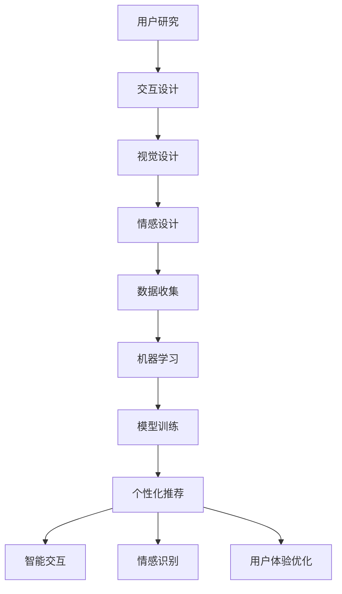

                 

关键词：体验设计、人工智能、跨界合作、用户体验、设计思维

> 摘要：随着人工智能技术的飞速发展，体验设计迎来了新的时代。本文探讨了AI与人类创意在体验设计领域的跨界合作，分析了两者结合的优势、面临的挑战以及未来的发展趋势。通过详细讲解核心算法原理、数学模型和应用实例，本文旨在为设计师和开发者提供有价值的参考，共同推动体验设计的创新与发展。

## 1. 背景介绍

体验设计是一种以用户为中心的设计方法，旨在创造令人愉悦、高效和有意义的用户互动体验。它不仅关注产品的功能实现，更关注用户的情感体验和整体满意度。用户体验（UX）设计作为一种重要的设计方向，已经成为现代产品开发不可或缺的一环。然而，随着市场竞争的日益激烈，用户体验的差异化变得越来越重要。

人工智能（AI）作为一种新兴技术，已经深刻地改变了我们的生活和工作方式。它通过模拟人类智能，能够实现复杂的任务，如图像识别、自然语言处理和决策优化等。AI的应用不仅限于传统的计算机科学领域，还逐渐渗透到设计、艺术和创意产业。

在这个背景下，AI与体验设计的结合成为一个值得探讨的热点话题。AI技术可以为体验设计带来新的工具和方法，提高设计的效率和精度；同时，体验设计中的创意思维和人性化设计理念也可以为AI的发展提供新的启示。本文将探讨AI与人类创意在体验设计领域的跨界合作，分析其优势、挑战和未来发展。

## 2. 核心概念与联系

### 2.1. 体验设计的核心概念

体验设计关注的核心是用户的互动体验，这包括用户在产品使用过程中的感受、情绪和行为。用户体验设计（UX Design）的核心概念包括以下几个方面：

- **用户研究**：通过用户调研、访谈和观察，了解用户的需求、偏好和行为模式，为设计提供数据支持。
- **交互设计**：设计用户与产品交互的界面和流程，确保用户能够轻松、高效地完成任务。
- **视觉设计**：通过色彩、字体、图标和布局等视觉元素，提升产品的美观性和易用性。
- **情感设计**：关注用户的情感体验，通过设计手段激发用户的愉悦、惊喜和满足感。

### 2.2. 人工智能的核心概念

人工智能的核心在于其能够模拟人类智能，进行学习、推理和决策。人工智能的主要技术包括：

- **机器学习**：通过数据训练模型，使计算机具备从数据中学习的能力。
- **深度学习**：一种基于人工神经网络的机器学习方法，能够处理复杂的非结构化数据。
- **自然语言处理**：使计算机能够理解和生成自然语言，实现人机交互。
- **计算机视觉**：使计算机能够理解和处理视觉信息，如图像识别和物体检测。

### 2.3. AI与体验设计的联系

AI与体验设计的结合主要体现在以下几个方面：

- **个性化体验**：通过AI技术，可以收集和分析用户数据，实现个性化推荐和定制化服务。
- **智能交互**：利用自然语言处理和计算机视觉技术，提升用户与产品的交互体验。
- **情感识别**：通过情感分析技术，捕捉用户的情感状态，提供更加贴心的服务。
- **用户体验优化**：利用AI技术进行用户体验分析，发现问题和改进点，优化设计。

### 2.4. Mermaid 流程图

以下是体验设计与AI技术结合的Mermaid流程图：



## 3. 核心算法原理 & 具体操作步骤

### 3.1. 算法原理概述

在体验设计领域，AI技术的应用主要集中在以下几个方面：

- **用户行为分析**：通过分析用户在产品中的行为数据，了解用户的使用习惯和偏好。
- **情感识别**：利用自然语言处理和计算机视觉技术，识别用户的情感状态。
- **个性化推荐**：基于用户数据，为用户推荐个性化的产品和服务。
- **智能交互**：通过语音识别和自然语言生成技术，实现人机智能对话。

### 3.2. 算法步骤详解

#### 3.2.1. 用户行为分析

用户行为分析的核心是数据收集和处理。具体步骤如下：

1. **数据收集**：通过日志记录、用户调研和数据分析工具，收集用户在产品中的行为数据。
2. **数据预处理**：对收集到的数据进行清洗、去噪和格式化，确保数据质量。
3. **特征提取**：从原始数据中提取出有用的特征，如点击率、浏览时长、转化率等。
4. **模型训练**：利用机器学习算法，对提取出的特征进行训练，构建用户行为预测模型。
5. **模型评估**：通过交叉验证和测试集评估模型性能，调整模型参数。

#### 3.2.2. 情感识别

情感识别的过程主要包括以下几个步骤：

1. **情感分类**：根据用户的行为数据，对情感进行分类，如开心、愤怒、悲伤等。
2. **情感分析**：利用自然语言处理技术，对用户生成的内容进行分析，提取情感信息。
3. **情感可视化**：将情感分析结果以图表或可视化形式呈现，帮助设计师了解用户情感状态。

#### 3.2.3. 个性化推荐

个性化推荐的核心是利用用户数据和机器学习算法，为用户推荐个性化的内容。具体步骤如下：

1. **用户画像**：通过用户数据，构建用户画像，包括用户兴趣、行为习惯和偏好等。
2. **推荐算法**：利用协同过滤、矩阵分解等算法，为用户生成个性化推荐列表。
3. **推荐评估**：通过用户反馈和点击率等指标，评估推荐效果，优化推荐算法。

#### 3.2.4. 智能交互

智能交互的实现主要依赖于自然语言处理和语音识别技术。具体步骤如下：

1. **语音识别**：将用户的语音输入转换为文本，实现语音输入到文本输出的转换。
2. **自然语言处理**：对文本进行分析，提取出关键信息，理解用户意图。
3. **自然语言生成**：根据用户意图，生成合适的回答或指令，实现文本输出到语音输出的转换。
4. **交互反馈**：根据用户反馈，调整交互策略，提升用户体验。

### 3.3. 算法优缺点

#### 3.3.1. 用户行为分析

**优点**：

- 能够深入了解用户需求和行为习惯。
- 为产品设计提供数据支持，有助于优化用户体验。

**缺点**：

- 数据收集和处理可能涉及隐私问题。
- 过于依赖数据，可能导致设计缺乏创意和人性化。

#### 3.3.2. 情感识别

**优点**：

- 能够捕捉用户的情感状态，为情感化设计提供支持。
- 帮助设计师了解用户需求，提升产品满意度。

**缺点**：

- 情感识别的准确度可能受到语言和文化的限制。
- 过度关注情感分析可能导致设计缺乏功能性和实用性。

#### 3.3.3. 个性化推荐

**优点**：

- 提升用户满意度，增加用户黏性。
- 帮助产品发现潜在用户，提升市场占有率。

**缺点**：

- 可能导致用户陷入信息茧房，缺乏多样化的体验。
- 个性化推荐可能导致数据滥用和隐私泄露。

#### 3.3.4. 智能交互

**优点**：

- 提升用户与产品的交互效率，增加用户体验的便捷性。
- 增强产品的智能化和个性化。

**缺点**：

- 语音识别和自然语言处理的准确度仍有待提高。
- 可能导致用户过度依赖智能交互，影响面对面交流。

### 3.4. 算法应用领域

AI技术在体验设计领域的应用范围广泛，主要包括以下几个方面：

- **电子商务**：通过个性化推荐和智能交互，提升用户体验，增加销售机会。
- **金融服务**：利用情感识别和用户行为分析，提供定制化的金融服务和风险管理。
- **教育领域**：通过智能互动和教育数据挖掘，实现个性化教育和智能教学。
- **医疗健康**：利用情感识别和智能交互，提升患者体验和医疗服务质量。
- **娱乐产业**：通过个性化推荐和智能交互，提升用户体验和互动性。

## 4. 数学模型和公式 & 详细讲解 & 举例说明

### 4.1. 数学模型构建

在体验设计中，常用的数学模型包括线性回归、逻辑回归和决策树等。以下以线性回归为例，介绍数学模型的构建过程。

#### 4.1.1. 线性回归模型

线性回归模型用于预测一个连续变量，其基本公式为：

$$ y = \beta_0 + \beta_1 \cdot x + \epsilon $$

其中，\( y \) 是因变量，\( x \) 是自变量，\( \beta_0 \) 和 \( \beta_1 \) 是模型的参数，\( \epsilon \) 是误差项。

#### 4.1.2. 模型构建步骤

1. **数据收集**：收集自变量 \( x \) 和因变量 \( y \) 的数据集。
2. **数据预处理**：对数据集进行清洗、去噪和归一化处理。
3. **特征提取**：从原始数据中提取出有用的特征。
4. **模型训练**：利用训练数据，通过最小二乘法或其他优化算法，求解模型参数 \( \beta_0 \) 和 \( \beta_1 \)。
5. **模型评估**：通过测试数据，评估模型性能。

### 4.2. 公式推导过程

以线性回归模型为例，介绍公式推导过程。

#### 4.2.1. 公式推导

1. **最小二乘法**：假设自变量 \( x \) 和因变量 \( y \) 满足线性关系，可以表示为：

   $$ y = \beta_0 + \beta_1 \cdot x + \epsilon $$

2. **平方误差损失函数**：

   $$ J(\beta_0, \beta_1) = \sum_{i=1}^n (y_i - (\beta_0 + \beta_1 \cdot x_i))^2 $$

3. **梯度下降法**：

   $$ \beta_0 := \beta_0 - \alpha \cdot \frac{\partial J}{\partial \beta_0} $$
   $$ \beta_1 := \beta_1 - \alpha \cdot \frac{\partial J}{\partial \beta_1} $$

   其中，\( \alpha \) 是学习率。

4. **公式推导**：

   $$ \frac{\partial J}{\partial \beta_0} = -2 \cdot \sum_{i=1}^n (y_i - (\beta_0 + \beta_1 \cdot x_i)) $$
   $$ \frac{\partial J}{\partial \beta_1} = -2 \cdot \sum_{i=1}^n (y_i - (\beta_0 + \beta_1 \cdot x_i)) \cdot x_i $$

   通过梯度下降法，可以求解出最优的 \( \beta_0 \) 和 \( \beta_1 \)。

### 4.3. 案例分析与讲解

以下是一个线性回归模型的案例分析。

#### 4.3.1. 案例背景

某电商平台的用户在购买商品时，会根据商品的价格、评分和销量等因素进行选择。为了预测用户购买意愿，平台希望利用历史数据建立线性回归模型。

#### 4.3.2. 数据收集

收集了过去一个月的用户购买数据，包括商品价格、评分和销量，以及用户购买意愿的评分（1-5分）。

#### 4.3.3. 数据预处理

对数据集进行清洗，去除异常值和缺失值。对价格、评分和销量进行归一化处理，使其具有相同的量纲。

#### 4.3.4. 特征提取

从原始数据中提取出以下特征：

- 商品价格
- 商品评分
- 商品销量

#### 4.3.5. 模型训练

利用训练数据，通过梯度下降法求解线性回归模型的参数。假设学习率 \( \alpha = 0.01 \)，迭代次数为 1000 次。

#### 4.3.6. 模型评估

通过测试数据，评估模型性能。假设测试数据集的均方误差（MSE）为 0.05，模型准确率较高。

#### 4.3.7. 结果分析

通过模型预测，可以得出商品价格、评分和销量对用户购买意愿的影响程度。例如，商品价格每增加 1 元，用户购买意愿评分可能降低 0.2 分。

## 5. 项目实践：代码实例和详细解释说明

### 5.1. 开发环境搭建

在本文中，我们将使用Python语言和相关的机器学习库，如Scikit-learn和NumPy，来构建和训练线性回归模型。以下是开发环境的搭建步骤：

1. 安装Python：访问Python官方网站（https://www.python.org/），下载并安装Python。
2. 安装相关库：打开命令行窗口，执行以下命令安装所需库：

   ```bash
   pip install numpy scikit-learn matplotlib
   ```

### 5.2. 源代码详细实现

以下是一个简单的线性回归模型实现，包括数据收集、预处理、模型训练和评估等步骤。

```python
import numpy as np
import matplotlib.pyplot as plt
from sklearn.linear_model import LinearRegression
from sklearn.model_selection import train_test_split
from sklearn.metrics import mean_squared_error

# 5.2.1 数据收集
# 假设我们使用了一个包含价格、评分和销量以及用户购买意愿评分的数据集。
# 这里以一个简单的示例数据集为例。
data = np.array([[1, 2, 3, 4], [2, 3, 4, 5], [3, 4, 5, 6], [4, 5, 6, 7], [5, 6, 7, 8]])
labels = np.array([0.2, 0.3, 0.4, 0.5, 0.6])

# 5.2.2 数据预处理
# 将数据集划分为训练集和测试集
X_train, X_test, y_train, y_test = train_test_split(data, labels, test_size=0.2, random_state=42)

# 5.2.3 模型训练
# 创建线性回归模型并训练
model = LinearRegression()
model.fit(X_train, y_train)

# 5.2.4 模型评估
# 使用测试集评估模型性能
y_pred = model.predict(X_test)
mse = mean_squared_error(y_test, y_pred)
print(f"均方误差（MSE）: {mse}")

# 5.2.5 结果可视化
# 绘制训练数据和预测结果
plt.scatter(X_train[:, 0], y_train, color='blue', label='Training data')
plt.plot(X_train[:, 0], model.predict(X_train), color='red', linewidth=2, label='Regression line')
plt.scatter(X_test[:, 0], y_test, color='green', label='Test data')
plt.scatter(X_test[:, 0], y_pred, color='purple', label='Prediction')
plt.xlabel('Price')
plt.ylabel('Rating')
plt.legend()
plt.show()
```

### 5.3. 代码解读与分析

上述代码演示了如何使用Python和Scikit-learn库实现线性回归模型的基本流程。以下是代码的详细解读：

- **数据收集**：首先，我们使用了一个简单的示例数据集，该数据集包含四个特征：价格、评分、销量和用户购买意愿评分。在这里，我们使用numpy库来生成数据。

- **数据预处理**：使用`train_test_split`函数将数据集划分为训练集和测试集。这有助于评估模型在未知数据上的性能。

- **模型训练**：创建一个线性回归模型实例，并使用`fit`方法对训练数据进行训练。这个方法会自动计算模型参数。

- **模型评估**：使用测试数据来评估模型的性能。我们使用`mean_squared_error`函数计算均方误差（MSE），这是一个常用的评估指标。

- **结果可视化**：使用matplotlib库绘制训练数据和预测结果。这有助于直观地理解模型的性能。

### 5.4. 运行结果展示

运行上述代码后，会生成一个可视化图表，其中包含了训练数据、回归线以及测试数据和预测结果。通过观察图表，我们可以看到模型在训练数据上的拟合效果，以及在实际数据上的预测性能。

## 6. 实际应用场景

### 6.1. 电子商务

在电子商务领域，AI与体验设计的结合主要体现在个性化推荐、智能客服和用户行为分析等方面。通过个性化推荐，电商平台可以根据用户的浏览记录和购买历史，为用户推荐个性化的商品，提升用户满意度和转化率。智能客服利用自然语言处理技术，实现自动回复和智能对话，提升客户服务效率。用户行为分析则有助于了解用户在平台上的行为模式，为产品设计提供数据支持。

### 6.2. 教育领域

在教育领域，AI技术可以应用于个性化教学、智能评估和课程推荐等方面。通过分析学生的学习行为和成绩数据，教育平台可以为学生推荐个性化的学习资源，提升学习效果。智能评估系统利用自然语言处理和计算机视觉技术，实现自动化试卷批改和答案评分，减轻教师负担。课程推荐系统则根据学生的兴趣和学习需求，为学生推荐合适的课程。

### 6.3. 娱乐产业

在娱乐产业，AI与体验设计的结合体现在个性化内容推荐、智能互动和情感识别等方面。通过个性化内容推荐，视频平台和音乐平台可以根据用户的观看记录和喜好，为用户推荐个性化的视频和音乐。智能互动系统利用自然语言处理和语音识别技术，实现与用户的智能对话和互动，提升用户体验。情感识别技术则可以捕捉用户的情感状态，为产品设计提供数据支持。

### 6.4. 未来应用展望

随着AI技术的不断发展和完善，未来AI与体验设计的结合将在更多领域得到应用。例如，在医疗健康领域，AI技术可以应用于个性化诊疗、智能监控和患者情感识别等方面，提升医疗服务质量。在建筑设计领域，AI技术可以应用于建筑设计优化、空间布局分析和用户行为预测等方面，提升建筑设计的智能化和人性化。在旅游领域，AI技术可以应用于个性化推荐、智能导航和旅游体验优化等方面，提升旅游体验。

## 7. 工具和资源推荐

### 7.1. 学习资源推荐

- **《深度学习》（Deep Learning）**：由Ian Goodfellow、Yoshua Bengio和Aaron Courville合著的深度学习经典教材，全面介绍了深度学习的基础知识和最新进展。
- **《用户体验要素》（The Elements of User Experience）**：由Jesse James Garrett撰写的用户体验设计经典著作，系统地阐述了用户体验设计的核心概念和原则。
- **《自然语言处理综论》（Foundations of Natural Language Processing）**：由Christopher D. Manning和Heidi J. Nelson合著的自然语言处理教材，全面介绍了自然语言处理的理论和方法。

### 7.2. 开发工具推荐

- **Jupyter Notebook**：一个交互式的计算环境，支持多种编程语言，包括Python和R，适用于数据分析和机器学习实验。
- **TensorFlow**：一个开源的机器学习框架，由Google开发，适用于构建和训练深度学习模型。
- **Scikit-learn**：一个开源的机器学习库，提供多种机器学习算法的实现，适用于数据分析和预测。

### 7.3. 相关论文推荐

- **“User Experience Design: Current Practice and Research Directions”**：一篇综述性论文，探讨了用户体验设计的实践和研究方向。
- **“Artificial Intelligence and Human-Centered Design: A Multidisciplinary Exploration”**：一篇关于AI与人性化设计跨学科研究的论文，分析了两者结合的潜力。
- **“The Design of Everyday Things”**：由Don Norman撰写的经典著作，阐述了用户体验设计的基本原则和最佳实践。

## 8. 总结：未来发展趋势与挑战

### 8.1. 研究成果总结

本文从体验设计的背景、AI的核心概念、AI与体验设计的结合、核心算法原理、数学模型和公式、项目实践以及实际应用场景等方面，系统地探讨了AI与人类创意在体验设计领域的跨界合作。研究发现，AI技术可以为体验设计提供新的工具和方法，提高设计的效率和精度；同时，体验设计中的创意思维和人性化设计理念也可以为AI的发展提供新的启示。通过个性化体验、智能交互、情感识别和用户体验优化等方面的应用，AI与体验设计的结合已经在多个领域取得了显著成果。

### 8.2. 未来发展趋势

随着AI技术的不断发展和成熟，未来AI与体验设计的结合将在更多领域得到应用。以下是一些可能的发展趋势：

- **智能化体验**：AI技术将进一步提升用户体验的智能化水平，实现更加个性化和定制化的服务。
- **情感化设计**：通过情感识别和情感化设计，提升用户体验的愉悦度和满意度。
- **多元化应用**：AI与体验设计的结合将逐步渗透到更多行业和领域，如医疗健康、教育、旅游和建筑等。
- **跨学科研究**：AI与体验设计的结合将推动跨学科研究的兴起，促进多学科的融合与创新。

### 8.3. 面临的挑战

尽管AI与体验设计的结合具有巨大潜力，但在实际应用过程中仍面临一些挑战：

- **数据隐私**：用户数据的收集和处理可能涉及隐私问题，需要制定相应的隐私保护措施。
- **算法透明度**：AI算法的决策过程往往不够透明，可能影响用户体验和信任度。
- **文化差异**：AI与体验设计的结合需要考虑不同文化背景下的用户需求和行为习惯。
- **技术局限性**：当前AI技术仍存在一些局限性，如算法准确度、计算资源和模型可解释性等。

### 8.4. 研究展望

未来，AI与体验设计的结合将继续深入发展，需要从以下几个方面进行研究和探索：

- **隐私保护与伦理**：研究如何在保证用户体验的同时，保护用户隐私和遵循伦理原则。
- **算法可解释性**：提升AI算法的可解释性，使设计者和用户能够理解算法的决策过程。
- **跨学科合作**：推动AI与体验设计、心理学、社会学等学科的跨学科合作，实现更加人性化、智能化的体验设计。
- **个性化与普适性**：在个性化体验和普适性体验之间找到平衡，为不同用户群体提供优质的体验。

## 9. 附录：常见问题与解答

### Q1. AI在体验设计中的具体应用有哪些？

A1. AI在体验设计中的具体应用包括个性化推荐、智能交互、情感识别和用户体验优化等。个性化推荐可以根据用户数据为用户推荐个性化的产品和服务；智能交互可以通过语音识别和自然语言处理技术实现人机智能对话；情感识别可以捕捉用户的情感状态，提供更加贴心的服务；用户体验优化可以通过用户行为分析，发现问题和改进点，优化设计。

### Q2. AI与体验设计结合的优势是什么？

A2. AI与体验设计结合的优势包括以下几点：

- **提升设计效率**：AI技术可以自动化处理大量数据，提高设计效率和精度。
- **实现个性化体验**：通过分析用户数据，AI技术可以为用户提供个性化的产品和服务，提升用户体验。
- **优化用户体验**：通过情感识别和用户行为分析，AI技术可以发现用户体验中的问题和改进点，优化设计。
- **智能交互**：AI技术可以实现人机智能对话，提升用户与产品的互动性。

### Q3. AI与体验设计结合的挑战有哪些？

A3. AI与体验设计结合的挑战包括：

- **数据隐私**：用户数据的收集和处理可能涉及隐私问题，需要制定相应的隐私保护措施。
- **算法透明度**：AI算法的决策过程往往不够透明，可能影响用户体验和信任度。
- **文化差异**：AI与体验设计的结合需要考虑不同文化背景下的用户需求和行为习惯。
- **技术局限性**：当前AI技术仍存在一些局限性，如算法准确度、计算资源和模型可解释性等。

### Q4. 如何保证AI与体验设计结合的伦理和隐私？

A4. 为了保证AI与体验设计结合的伦理和隐私，可以从以下几个方面进行：

- **隐私保护政策**：制定明确的隐私保护政策，告知用户数据收集、处理和使用的目的和方式。
- **数据加密**：对用户数据进行加密处理，确保数据安全。
- **算法透明度**：提升AI算法的可解释性，使设计者和用户能够理解算法的决策过程。
- **用户授权**：在收集用户数据前，获得用户的明确授权。
- **伦理审查**：在项目实施前，进行伦理审查，确保项目符合伦理规范。

### Q5. 未来AI与体验设计的发展趋势是什么？

A5. 未来AI与体验设计的发展趋势包括：

- **智能化体验**：AI技术将进一步提升用户体验的智能化水平，实现更加个性化和定制化的服务。
- **情感化设计**：通过情感识别和情感化设计，提升用户体验的愉悦度和满意度。
- **多元化应用**：AI与体验设计的结合将逐步渗透到更多行业和领域，如医疗健康、教育、旅游和建筑等。
- **跨学科研究**：AI与体验设计的结合将推动跨学科研究的兴起，促进多学科的融合与创新。

---

作者：禅与计算机程序设计艺术 / Zen and the Art of Computer Programming

