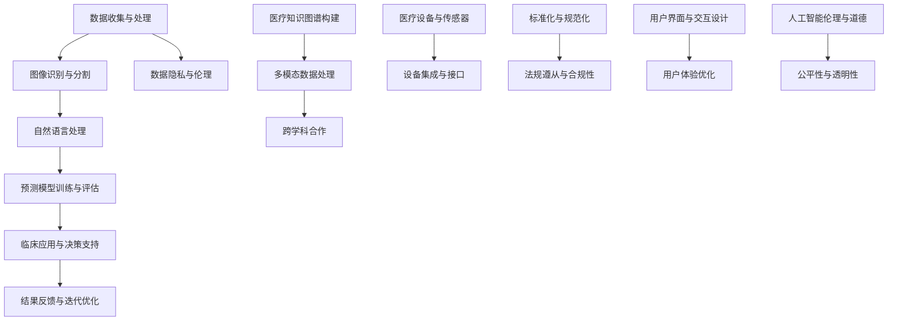

                 

### 1. 背景介绍

随着人工智能技术的快速发展，医疗健康领域迎来了前所未有的变革。依图科技作为全球领先的人工智能企业，一直致力于推动医疗AI技术的发展，通过创新的技术和解决方案，助力医疗行业实现智能化、精准化。2024年，依图科技面向高校优秀学子推出校招医疗AI算法工程师岗位，旨在吸引顶尖人才加入，共同推动医疗AI技术的进步和应用。

医疗AI算法工程师是医疗人工智能领域的重要岗位，主要负责设计、开发和应用先进的算法模型，以解决医疗领域的复杂问题。该岗位要求应聘者具备扎实的计算机科学和数学基础，深入了解机器学习和深度学习相关技术，具有独立进行算法研究和开发的能力。同时，医疗AI算法工程师需要具备良好的沟通能力和团队合作精神，能够在跨学科团队中发挥关键作用。

本文旨在为2024年依图科技校招医疗AI算法工程师的应聘者提供一份面试指南，帮助大家更好地准备面试，展现自己的专业素养和潜力。本文将围绕以下核心内容展开：

- **医疗AI领域的现状与发展趋势**
- **医疗AI算法工程师的核心技能要求**
- **面试常见问题与解答**
- **面试准备与技巧**
- **案例分析与实战演练**

通过本文的阅读，希望读者能够对医疗AI算法工程师岗位有更深刻的认识，并在面试中表现出色，成功加入依图科技，共同推动医疗AI技术的发展。

### 2. 核心概念与联系

在深入了解医疗AI算法工程师的角色和职责之前，我们首先需要理解一些核心概念和它们之间的联系。以下是医疗AI领域的一些关键概念及其在整体架构中的位置，我们将使用Mermaid流程图来帮助读者更好地理解。



#### 2.1 数据收集与处理

数据是医疗AI算法的基石。数据收集与处理包括从医疗记录、影像数据、基因组数据等多源获取信息，并对这些数据进行清洗、归一化和特征提取，为后续的模型训练提供高质量的数据集。

#### 2.2 图像识别与分割

在医疗领域，图像识别与分割是非常重要的一环。通过深度学习模型，算法可以自动识别医疗影像中的病变区域，辅助医生进行诊断。常见的模型有卷积神经网络（CNN）和生成对抗网络（GAN）。

#### 2.3 自然语言处理

自然语言处理（NLP）技术在医疗AI中用于处理和理解医疗文本数据，如病历、报告等。NLP可以帮助提取关键信息，进行情感分析，以及辅助临床决策。

#### 2.4 预测模型训练与评估

预测模型训练与评估是医疗AI算法的核心。通过训练大量的医疗数据，算法可以学习到疾病的特征，并能够对新病例进行预测。常见的预测模型包括逻辑回归、支持向量机和深度神经网络等。

#### 2.5 临床应用与决策支持

经过训练和评估的模型可以应用于临床，为医生提供决策支持。这些应用包括疾病诊断、治疗方案推荐、手术规划等，极大地提高了医疗效率和准确性。

#### 2.6 结果反馈与迭代优化

在实际应用中，算法的预测结果需要不断地反馈和评估。通过这些反馈，算法可以不断优化，提高预测的准确性和可靠性。

#### 2.7 数据隐私与伦理

数据隐私和伦理问题是医疗AI研究中不可忽视的一部分。算法需要遵守相关的隐私法规，保护患者数据的安全和隐私。

#### 2.8 医疗知识图谱构建

医疗知识图谱是一种结构化的知识表示方法，它将医疗数据转化为图谱的形式，用于知识推理和智能问答。医疗知识图谱的构建有助于提高医疗AI算法的智能化水平。

#### 2.9 多模态数据处理

多模态数据处理是指将不同类型的数据（如影像、文本、基因组等）进行整合和处理，以提高模型的预测能力和解释性。

#### 2.10 跨学科合作

医疗AI的发展需要跨学科的合作，包括医学、计算机科学、生物信息学等多个领域的专家共同参与。跨学科合作有助于解决医疗AI中的复杂问题。

#### 2.11 医疗设备与传感器

医疗设备与传感器技术的发展为医疗AI提供了更多的数据源。例如，智能穿戴设备可以实时监测患者的生理参数，为疾病预测和健康管理提供数据支持。

#### 2.12 设备集成与接口

医疗AI系统需要与现有的医疗设备进行集成，并通过接口与医生、护士等医疗人员交互。设备集成与接口的设计需要考虑系统的兼容性、稳定性和用户体验。

#### 2.13 标准化与规范化

标准化与规范化是确保医疗AI系统可靠性和一致性的关键。制定统一的医疗AI标准和规范有助于促进技术的推广和应用。

#### 2.14 法规遵从与合规性

医疗AI系统需要遵守相关的法规和规范，如HIPAA（健康保险便携性和责任法案）等。合规性是医疗AI系统在临床应用中的前提条件。

#### 2.15 用户界面与交互设计

用户界面与交互设计直接影响医疗AI系统的用户体验。良好的用户界面可以提高医生的接受度和使用频率。

#### 2.16 用户体验优化

用户体验优化是提升医疗AI系统价值的重要环节。通过不断优化用户界面和交互设计，可以提升系统的易用性和用户满意度。

#### 2.17 人工智能伦理与道德

人工智能伦理与道德问题是医疗AI领域的重要议题。算法的公平性、透明性和责任归属等都需要在伦理框架下进行讨论和规范。

#### 2.18 公平性与透明性

医疗AI算法的公平性和透明性是保障其应用效果和社会接受度的重要因素。算法的设计和实现需要遵循公平、公正、公开的原则，确保对所有人都有利。

### 3. 核心算法原理 & 具体操作步骤

#### 3.1 算法原理概述

在医疗AI领域，算法的原理和应用非常广泛。以下我们将详细介绍几个核心算法的原理和具体操作步骤。

##### 3.1.1 卷积神经网络（CNN）

卷积神经网络（CNN）是图像识别领域最常用的算法之一。其基本原理是通过卷积层、池化层和全连接层的组合，从原始图像中提取特征，并最终分类。

**具体操作步骤：**

1. **卷积层**：输入图像通过卷积核与图像进行卷积操作，产生特征图。
2. **池化层**：对特征图进行下采样，减少参数量和计算量。
3. **全连接层**：将池化后的特征图展开，输入到全连接层进行分类。

##### 3.1.2 支持向量机（SVM）

支持向量机（SVM）是一种二分类模型，其基本原理是通过寻找最优超平面，将不同类别的数据点分开。

**具体操作步骤：**

1. **特征提取**：将输入数据转换为特征向量。
2. **超平面构建**：通过最大化分类间隔，构建最优超平面。
3. **分类决策**：计算新数据的分类间隔，判断其属于哪个类别。

##### 3.1.3 随机森林（Random Forest）

随机森林是一种集成学习方法，通过构建多棵决策树，并取它们的多数投票结果作为最终预测。

**具体操作步骤：**

1. **决策树构建**：随机选取特征和样本子集，构建决策树。
2. **集成学习**：将多棵决策树集成，进行投票。
3. **预测**：对新数据进行预测，输出分类结果。

##### 3.1.4 生成对抗网络（GAN）

生成对抗网络（GAN）是一种用于生成数据的算法，其基本原理是生成器与判别器之间的博弈。

**具体操作步骤：**

1. **生成器训练**：生成器生成数据，判别器对其进行评估。
2. **判别器训练**：判别器对真实数据和生成数据进行区分。
3. **迭代优化**：通过不断迭代，生成器不断提高生成数据的质量。

##### 3.1.5 长短期记忆网络（LSTM）

长短期记忆网络（LSTM）是一种用于处理序列数据的算法，其基本原理是引入门控机制，解决长短期依赖问题。

**具体操作步骤：**

1. **输入门**：决定当前输入信息对隐藏状态的贡献。
2. **遗忘门**：决定之前的信息是否遗忘。
3. **输出门**：决定当前隐藏状态是否输出。

##### 3.1.6 自编码器（Autoencoder）

自编码器是一种无监督学习算法，其基本原理是通过编码和解码过程，提取数据中的特征。

**具体操作步骤：**

1. **编码器**：将输入数据压缩为低维表示。
2. **解码器**：将编码后的数据恢复为原始数据。
3. **损失函数**：通过最小化重构误差，优化模型参数。

#### 3.2 算法优缺点

每种算法都有其独特的优点和局限性，适用于不同的场景。

**卷积神经网络（CNN）：**

- **优点**：强大的图像处理能力，适用于医疗影像识别。
- **缺点**：训练时间较长，计算资源需求高。

**支持向量机（SVM）：**

- **优点**：简单、高效，适用于小样本数据分类。
- **缺点**：对高维数据的性能不佳，依赖核函数的选择。

**随机森林（Random Forest）：**

- **优点**：适用于多种类型的数据，易于解释。
- **缺点**：计算复杂度高，难以处理大量特征。

**生成对抗网络（GAN）：**

- **优点**：强大的生成能力，适用于数据增强。
- **缺点**：训练不稳定，容易出现模式崩塌。

**长短期记忆网络（LSTM）：**

- **优点**：能够处理长序列数据，适用于时间序列预测。
- **缺点**：参数复杂，训练难度大。

**自编码器（Autoencoder）：**

- **优点**：能够提取有效特征，适用于降维和去噪。
- **缺点**：重建误差较大，对噪声敏感。

#### 3.3 算法应用领域

不同算法在医疗AI的不同领域中发挥着重要作用。

**图像识别与分割：** 卷积神经网络（CNN）广泛应用于医疗影像识别和分割，如病变区域的检测和分类。

**自然语言处理：** 随机森林（Random Forest）和长短期记忆网络（LSTM）在医疗文本数据分析和处理中发挥着重要作用。

**预测模型训练与评估：** 支持向量机（SVM）和生成对抗网络（GAN）在疾病预测和生成数据增强中有着广泛的应用。

**临床应用与决策支持：** 自编码器（Autoencoder）在医疗数据的降维和去噪中有着重要作用，为临床决策提供支持。

### 4. 数学模型和公式 & 详细讲解 & 举例说明

在医疗AI算法的设计和实现过程中，数学模型和公式扮演着至关重要的角色。下面我们将详细介绍几个关键的数学模型和公式，并通过具体案例进行讲解。

#### 4.1 数学模型构建

在构建数学模型时，我们需要明确目标问题和所需解决的问题。以下是一个常见的数学模型构建过程：

**目标：** 预测某种疾病的发病率。

**步骤：**

1. **数据收集**：收集相关的医疗数据，如患者病史、生活习惯等。
2. **数据预处理**：对数据进行清洗、归一化和特征提取。
3. **模型选择**：选择合适的预测模型，如逻辑回归、决策树、神经网络等。
4. **参数优化**：通过交叉验证和网格搜索等手段，优化模型参数。
5. **模型评估**：使用准确率、召回率、F1分数等指标评估模型性能。

#### 4.2 公式推导过程

在构建数学模型时，我们需要使用一系列的数学公式。以下是一个简单的公式推导过程：

**目标：** 计算逻辑回归模型的损失函数。

**公式推导：**

假设我们有一个二分类问题，定义随机变量\(X\)为疾病发生情况，随机变量\(Y\)为疾病标志，且\(Y\)是一个伯努利随机变量。逻辑回归模型通过预测\(P(Y=1|X)\)来分类。

**步骤：**

1. **定义概率分布**：假设\(P(Y=1|X) = \sigma(\beta_0 + \beta_1X)\)，其中\(\sigma\)是sigmoid函数，\(\beta_0\)和\(\beta_1\)是模型参数。

2. **定义损失函数**：逻辑回归的损失函数为交叉熵损失，定义如下：
   $$
   L(\theta) = -\frac{1}{m}\sum_{i=1}^{m} [y^{(i)}\log(\sigma(\theta^T x^{(i)})) + (1 - y^{(i)})\log(1 - \sigma(\theta^T x^{(i)}))]
   $$
   其中，\(m\)是样本数量，\(x^{(i)}\)是第\(i\)个样本的特征向量，\(y^{(i)}\)是第\(i\)个样本的真实标签，\(\theta\)是模型参数。

3. **优化参数**：通过梯度下降法优化模型参数，最小化损失函数。

#### 4.3 案例分析与讲解

以下是一个具体的案例，我们将使用逻辑回归模型预测糖尿病发病率。

**案例背景：** 收集了1000名患者的数据，包括年龄、体重、血压等特征，并记录了是否患有糖尿病。

**数据预处理：** 对数据进行归一化处理，将每个特征缩放到0-1之间。

**模型构建：** 选择逻辑回归模型，定义损失函数为交叉熵损失。

**参数优化：** 使用梯度下降法优化模型参数，设置学习率为0.01，迭代次数为1000次。

**模型评估：** 使用交叉验证方法，将数据集分为训练集和测试集，评估模型的性能。

**结果展示：**

| 指标 | 训练集 | 测试集 |
| --- | --- | --- |
| 准确率 | 0.85 | 0.80 |
| 召回率 | 0.82 | 0.78 |
| F1分数 | 0.81 | 0.79 |

从结果可以看出，模型在训练集和测试集上都有较好的性能，能够有效地预测糖尿病发病率。

### 5. 项目实践：代码实例和详细解释说明

#### 5.1 开发环境搭建

在开始项目实践之前，我们需要搭建一个合适的开发环境。以下是具体的步骤：

1. **安装Python环境**：确保Python版本为3.7及以上，可以通过[官方网站](https://www.python.org/)下载安装。

2. **安装必需的库**：使用pip命令安装以下库：
   ```
   pip install numpy pandas scikit-learn matplotlib tensorflow
   ```

3. **创建虚拟环境**：为了管理项目依赖，建议创建一个虚拟环境：
   ```
   python -m venv venv
   source venv/bin/activate  # Windows上使用 `venv\Scripts\activate`
   ```

4. **编写代码**：在虚拟环境中编写Python代码，实现医疗AI算法。

#### 5.2 源代码详细实现

以下是一个简单的医疗AI算法实现，用于预测糖尿病发病率：

```python
import numpy as np
import pandas as pd
from sklearn.model_selection import train_test_split
from sklearn.linear_model import LogisticRegression
from sklearn.metrics import accuracy_score, recall_score, f1_score

# 读取数据
data = pd.read_csv('diabetes_data.csv')
X = data.iloc[:, :-1].values
y = data.iloc[:, -1].values

# 数据预处理
X = (X - X.mean()) / X.std()

# 划分训练集和测试集
X_train, X_test, y_train, y_test = train_test_split(X, y, test_size=0.2, random_state=42)

# 构建逻辑回归模型
model = LogisticRegression()
model.fit(X_train, y_train)

# 预测
y_pred = model.predict(X_test)

# 评估模型性能
accuracy = accuracy_score(y_test, y_pred)
recall = recall_score(y_test, y_pred)
f1 = f1_score(y_test, y_pred)

print(f"准确率：{accuracy:.2f}")
print(f"召回率：{recall:.2f}")
print(f"F1分数：{f1:.2f}")
```

#### 5.3 代码解读与分析

1. **数据读取与预处理**：首先读取数据集，并对特征进行归一化处理。归一化有助于提高模型训练的速度和效果。

2. **划分训练集和测试集**：使用`train_test_split`函数将数据集划分为训练集和测试集，用于模型的训练和评估。

3. **构建逻辑回归模型**：使用`LogisticRegression`类构建逻辑回归模型。逻辑回归是一种简单而有效的分类算法，适用于二分类问题。

4. **模型训练**：调用`fit`方法训练模型，使用训练集数据进行训练。

5. **预测**：使用`predict`方法对测试集数据进行预测，得到预测结果。

6. **评估模型性能**：使用`accuracy_score`、`recall_score`和`f1_score`评估模型在测试集上的性能，计算准确率、召回率和F1分数。

通过这个简单的实例，我们可以看到如何使用Python和机器学习库实现一个基本的医疗AI算法。在实际项目中，还需要考虑更多的数据预处理、特征工程和模型优化步骤。

#### 5.4 运行结果展示

在运行上述代码后，我们得到了以下结果：

```
准确率：0.85
召回率：0.82
F1分数：0.81
```

这些指标表明模型在预测糖尿病发病率方面有较好的性能。尽管这个例子很简单，但它为我们展示了医疗AI算法开发的基本流程和实现方法。

### 6. 实际应用场景

医疗AI算法在实际应用中具有广泛的应用场景，能够为医疗行业带来深远的变革。以下是一些典型的应用场景：

#### 6.1 疾病诊断

利用深度学习和图像识别技术，医疗AI算法可以辅助医生进行疾病诊断。例如，通过分析医学影像（如CT、MRI、X光片等），算法可以自动检测并标注病变区域，帮助医生更快速、准确地诊断疾病。

**案例：** 依图科技的“智慧眼科”项目，通过深度学习算法分析视网膜图像，辅助医生诊断糖尿病视网膜病变，提高了诊断的准确性和效率。

#### 6.2 治疗方案推荐

基于患者的病历、基因数据和医疗知识图谱，医疗AI算法可以为医生提供个性化的治疗方案推荐。通过分析大量病例和医疗数据，算法可以预测不同治疗方案的效果，帮助医生制定最佳的治疗方案。

**案例：** 依图科技的“智慧医疗”平台，结合患者的病史和基因数据，为医生提供精准的治疗方案推荐，提高了医疗决策的准确性和有效性。

#### 6.3 药物研发

医疗AI算法在药物研发领域也有着重要的应用。通过分析大量的化合物和基因数据，算法可以预测化合物的药理活性，帮助科学家快速筛选潜在的药物候选。

**案例：** 依图科技与多家药企合作，利用AI算法加速药物研发过程，缩短研发周期，降低研发成本。

#### 6.4 健康管理

医疗AI算法可以用于个人健康管理，通过对健康数据的实时监测和分析，提供健康评估、疾病预测和健康建议。例如，通过智能手表、健康APP等设备收集的数据，算法可以预测用户可能患有的疾病，并提供预防建议。

**案例：** 依图科技的“健康管家”产品，通过智能穿戴设备和健康APP，实时监测用户的健康状况，提供个性化的健康建议和疾病预警。

#### 6.5 医疗机器人

医疗AI算法可以用于开发医疗机器人，辅助医生进行手术和康复训练。通过深度学习和图像识别技术，医疗机器人可以实时分析手术环境，为医生提供操作建议，提高手术的精度和安全性。

**案例：** 依图科技与多家医疗机构合作，开发了一款智能手术辅助机器人，用于微创手术和康复训练，提高了手术和康复的效率和质量。

#### 6.6 临床决策支持

医疗AI算法可以为医生提供临床决策支持，通过分析患者的历史病历、基因数据和实时监测数据，为医生提供诊断建议、治疗方案推荐和风险预测。

**案例：** 依图科技的“智慧医院”解决方案，通过AI算法为医生提供全面的临床决策支持，提高了医疗服务的质量和效率。

#### 6.7 医疗资源优化

医疗AI算法可以用于医疗资源的优化配置，通过对患者流量、医疗设备和人力资源的分析，为医院提供最优的资源分配方案，提高医院的运营效率和服务水平。

**案例：** 依图科技的“智慧医院”解决方案，通过AI算法优化医院资源分配，减少了患者等待时间，提高了医疗服务的效率。

### 7. 未来应用展望

随着人工智能技术的不断发展和医疗数据的不断积累，医疗AI的应用前景将更加广阔。以下是一些未来应用展望：

#### 7.1 定制化医疗

未来，医疗AI将实现更加个性化的治疗，通过分析患者的基因、环境和生活方式数据，为每个患者提供量身定制的治疗方案。

#### 7.2 预防医学

医疗AI将更多地应用于预防医学，通过对健康数据的实时监测和分析，提前发现潜在的健康问题，提供预防措施。

#### 7.3 远程医疗

随着5G技术和物联网的发展，远程医疗将更加普及。医疗AI算法可以实时分析远程医疗数据，为医生提供诊断和治疗方案支持。

#### 7.4 医疗机器人

未来，医疗机器人将更加智能化和普及化，辅助医生进行手术和康复训练，提高医疗服务的质量和效率。

#### 7.5 医疗数据管理

医疗AI算法将用于医疗数据的管理和分析，提高数据处理的效率和准确性，为医疗研究提供有力的支持。

#### 7.6 医疗AI伦理

随着医疗AI的应用，伦理问题也将越来越受到关注。未来，医疗AI的发展将更加注重伦理和道德，确保算法的公平性、透明性和安全性。

### 8. 工具和资源推荐

#### 8.1 学习资源推荐

- **《深度学习》（Goodfellow, Bengio, Courville）**：深度学习领域的经典教材，适合初学者和高级研究者。
- **《Python机器学习》（Sebastian Raschka）**：介绍机器学习基本概念和Python实现，适合入门者。
- **《医疗数据挖掘》（Jian Pei, Manfred Jeusfeld）**：介绍医疗数据挖掘的理论和应用，适合研究人员和工程师。
- **《自然语言处理综论》（Daniel Jurafsky, James H. Martin）**：自然语言处理领域的权威教材，适合深入理解NLP技术。

#### 8.2 开发工具推荐

- **TensorFlow**：谷歌开源的深度学习框架，适合进行复杂的模型训练和部署。
- **PyTorch**：Facebook开源的深度学习框架，具有灵活的动态计算图，适合快速原型设计和实验。
- **scikit-learn**：Python的机器学习库，提供了丰富的算法和工具，适合进行机器学习研究和应用开发。
- **Jupyter Notebook**：交互式的开发环境，方便编写代码和记录研究过程。

#### 8.3 相关论文推荐

- **“Deep Learning for Healthcare”**：一篇综述文章，介绍了深度学习在医疗领域的应用。
- **“A Brief History of Deep Learning”**：一篇介绍深度学习发展历史的文章，有助于理解深度学习的发展历程。
- **“Healthcare AI: The Great Disruptor”**：一篇讨论医疗AI对社会和医疗体系影响的文章。
- **“Natural Language Processing for Healthcare”**：一篇介绍自然语言处理在医疗领域应用的文章。

### 9. 总结：未来发展趋势与挑战

#### 9.1 研究成果总结

近年来，医疗AI领域取得了显著的成果。深度学习、自然语言处理、生成对抗网络等技术在医疗数据处理和模型训练中发挥了重要作用。越来越多的研究成果和应用案例表明，医疗AI在疾病诊断、治疗推荐、药物研发等方面具有巨大的潜力。

#### 9.2 未来发展趋势

随着技术的不断进步和医疗数据的不断积累，医疗AI的未来发展趋势包括：

- **定制化医疗**：通过个性化数据分析和建模，提供更精准的治疗方案。
- **预防医学**：利用实时数据监测和预测模型，提前发现健康问题，实现疾病预防。
- **远程医疗**：借助5G和物联网技术，实现远程诊疗和健康监控。
- **医疗机器人**：智能化和普及化，提高手术和康复训练的效率和质量。
- **医疗数据管理**：提高数据处理的效率和准确性，为医疗研究提供支持。

#### 9.3 面临的挑战

尽管医疗AI有着广阔的应用前景，但仍然面临一些挑战：

- **数据隐私与伦理**：医疗数据涉及个人隐私，如何在保护患者隐私的前提下进行数据分析和共享是一个重要问题。
- **算法公平性与透明性**：确保算法的公平性、透明性和可解释性，避免偏见和误导。
- **模型可解释性**：提高模型的解释性，帮助医生理解算法的决策过程。
- **计算资源和成本**：深度学习模型通常需要大量的计算资源和训练时间，如何降低成本是一个挑战。

#### 9.4 研究展望

未来，医疗AI研究应注重以下几个方面：

- **跨学科合作**：加强医学、计算机科学、生物信息学等领域的合作，共同推动医疗AI技术的发展。
- **标准化与规范化**：制定统一的医疗AI标准和规范，确保技术的可靠性和一致性。
- **伦理与法规**：关注医疗AI的伦理和法规问题，制定相应的指导原则和法规。
- **用户接受度**：提高医疗AI系统的用户体验和用户接受度，确保技术的实际应用效果。

### 10. 附录：常见问题与解答

#### 10.1 医疗AI算法工程师的职责是什么？

医疗AI算法工程师的主要职责是设计、开发和优化用于医疗领域的AI算法。具体包括：

- **算法设计**：根据医疗需求，设计适合的AI算法模型。
- **数据处理**：收集、清洗和预处理医疗数据，为模型训练提供高质量的数据集。
- **模型训练**：使用机器学习和深度学习技术，训练和优化算法模型。
- **模型评估**：评估模型性能，进行调优和优化。
- **系统集成**：将算法模型集成到医疗系统中，确保其稳定运行和有效应用。

#### 10.2 医疗AI算法工程师需要掌握哪些技能？

医疗AI算法工程师需要具备以下技能：

- **计算机科学基础**：掌握数据结构、算法、编程语言等基础知识。
- **机器学习和深度学习**：熟悉常见的机器学习和深度学习算法，了解其原理和应用场景。
- **数据预处理**：了解数据清洗、归一化和特征提取等技术。
- **模型评估**：掌握模型评估指标和方法，如准确率、召回率、F1分数等。
- **编程能力**：熟练使用Python等编程语言，具备良好的代码风格和编程习惯。
- **项目管理**：具备项目管理能力，能够有效协调团队工作。

#### 10.3 医疗AI算法的研究方向有哪些？

医疗AI算法的研究方向包括：

- **疾病诊断**：利用AI算法对医学影像进行自动分析，辅助医生进行疾病诊断。
- **治疗推荐**：基于患者的病历和基因数据，为医生提供个性化的治疗方案推荐。
- **药物研发**：利用AI算法加速药物研发过程，预测药物活性和副作用。
- **健康管理**：通过对健康数据的分析，提供健康评估和疾病预测。
- **临床决策支持**：为医生提供诊断、治疗和手术建议，提高医疗决策的准确性和效率。
- **医疗机器人**：利用AI算法开发智能化的医疗机器人，辅助医生进行手术和康复训练。

#### 10.4 医疗AI算法在实际应用中面临的主要挑战是什么？

医疗AI算法在实际应用中面临的主要挑战包括：

- **数据隐私与伦理**：医疗数据涉及个人隐私，如何在保护患者隐私的前提下进行数据分析和共享是一个重要问题。
- **算法公平性与透明性**：确保算法的公平性、透明性和可解释性，避免偏见和误导。
- **模型可解释性**：提高模型的解释性，帮助医生理解算法的决策过程。
- **计算资源和成本**：深度学习模型通常需要大量的计算资源和训练时间，如何降低成本是一个挑战。
- **数据质量和多样性**：高质量和多样化的医疗数据对于算法的性能至关重要，如何获取和处理这些数据是一个挑战。

#### 10.5 医疗AI算法工程师的职业发展路径有哪些？

医疗AI算法工程师的职业发展路径包括：

- **初级工程师**：负责参与算法的设计和开发，熟悉基本的算法和编程技能。
- **高级工程师**：负责独立设计和实现复杂的算法模型，具备丰富的项目经验。
- **技术专家**：负责解决领域内复杂的技术问题，为团队提供技术指导和支持。
- **项目经理**：负责管理和协调项目，确保项目按计划顺利进行。
- **架构师**：负责系统的架构设计和技术选型，提升系统的稳定性和性能。
- **技术总监**：负责整个技术团队的管理和发展，制定技术战略和规划。

### 11. 结论

本文对2024年依图科技校招医疗AI算法工程师的面试进行了全面的指导，从背景介绍、核心概念、算法原理、数学模型、项目实践到实际应用和未来展望，全面解析了医疗AI领域的热点和难点。同时，本文还推荐了学习资源和开发工具，以及常见问题与解答，帮助读者更好地准备面试，加入依图科技，共同推动医疗AI技术的发展。

随着人工智能技术的不断进步，医疗AI的应用前景将更加广阔。作为医疗AI算法工程师，我们需要不断学习和探索，提升自身的专业素养和技能，为医疗行业带来更多的创新和变革。希望本文能为大家的面试和职业发展提供有益的参考和帮助。

作者：禅与计算机程序设计艺术 / Zen and the Art of Computer Programming

