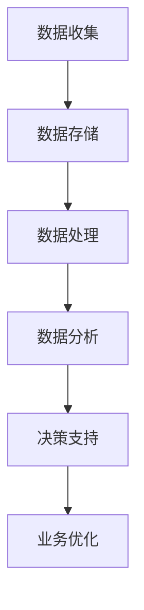

                 

 关键词：信息差、大数据、商业运营、优化、数据挖掘、机器学习、预测分析

> 摘要：本文旨在探讨信息差在商业运营中的重要性，以及如何利用大数据技术来优化商业决策。通过分析信息差的定义、产生原因和影响，本文提出了一套基于大数据的商业优化策略，包括数据收集、处理和分析，以及预测和决策支持系统的构建。此外，本文还探讨了大数据技术在商业运营中的实际应用，以及未来发展的趋势和挑战。

## 1. 背景介绍

在当今全球化和信息化的时代，信息已经成为一种重要的资源，甚至可以说是企业竞争力的核心。然而，不同企业、不同行业、不同地区之间的信息获取能力和利用程度存在巨大的差异，这就是所谓的“信息差”。信息差的产生源于多方面的原因，包括技术、资源、地域和行业等因素。对于企业而言，如何利用大数据技术来缩小信息差，提高商业运营效率，成为当前亟待解决的问题。

### 1.1 信息差的定义

信息差，又称信息不对称，指的是不同主体在获取和处理信息时存在差异，从而导致决策结果不一致的现象。在商业领域，信息差主要体现在企业对市场、消费者、竞争对手等方面的信息掌握程度不同。

### 1.2 信息差产生的原因

信息差产生的原因多种多样，主要包括以下几个方面：

1. **技术差异**：不同企业拥有不同的技术实力和研发能力，导致对新技术、新趋势的敏感度和响应速度不同。
2. **资源差异**：企业拥有的资源（如资金、人力、物力等）不同，直接影响其获取和处理信息的能力。
3. **地域差异**：不同地区的企业在政策、市场环境、基础设施等方面存在差异，影响其信息获取和利用的难度。
4. **行业差异**：不同行业的特点、发展水平和竞争态势各异，导致企业在信息获取和利用上存在显著差异。

### 1.3 信息差的影响

信息差对企业的影响主要体现在以下几个方面：

1. **决策失误**：信息不对称导致企业在制定战略、规划时可能基于不准确或不完整的信息，从而产生错误的决策。
2. **竞争劣势**：在市场竞争中，信息掌握不足的企业难以制定有效的竞争策略，容易处于劣势地位。
3. **机会损失**：企业无法及时捕捉市场机遇，可能导致市场份额的减少或业务发展的停滞。

## 2. 核心概念与联系

为了缩小信息差，提高商业运营效率，我们需要借助大数据技术。大数据技术主要包括数据收集、存储、处理和分析等环节。下面我们将通过一个Mermaid流程图来展示大数据在商业优化中的应用架构。



### 2.1 数据收集

数据收集是大数据技术的第一步，也是关键环节。数据来源可以分为内部数据和外部数据。内部数据包括企业的销售数据、客户数据、财务数据等；外部数据包括市场调查、社交媒体、新闻报道等。为了确保数据的质量和完整性，企业需要建立完善的数据收集机制，并利用数据爬虫、传感器等技术手段进行数据采集。

### 2.2 数据存储

数据存储是将收集到的数据进行集中管理，以便后续处理和分析。常用的数据存储技术包括关系型数据库、NoSQL数据库、数据仓库等。企业需要根据数据类型、规模和访问频率等因素选择合适的存储方案，并确保数据的可靠性和安全性。

### 2.3 数据处理

数据处理包括数据清洗、数据集成和数据转换等环节。数据清洗是去除重复、缺失和不准确的数据，保证数据的准确性和一致性；数据集成是将来自不同来源的数据进行整合，形成统一的视图；数据转换是将数据格式转换为适合分析的工具和算法。

### 2.4 数据分析

数据分析是大数据技术的核心环节，通过挖掘数据中的有价值信息，为企业提供决策支持。数据分析可以分为描述性分析、诊断性分析和预测性分析等层次。描述性分析主要回答“发生了什么”的问题；诊断性分析主要回答“为什么发生了”的问题；预测性分析主要回答“接下来会发生什么”的问题。

### 2.5 决策支持

决策支持是将分析结果应用于实际业务场景，帮助企业制定战略、规划、运营等方面的决策。决策支持系统（DSS）可以根据分析结果生成可视化报告、推荐方案等，供企业管理层参考。

### 2.6 业务优化

业务优化是通过数据分析结果来调整和优化业务流程、产品和服务，以提高企业竞争力和运营效率。业务优化可以体现在市场营销、产品研发、供应链管理、客户服务等多个方面。

## 3. 核心算法原理 & 具体操作步骤

### 3.1 算法原理概述

在商业优化中，常用的算法包括数据挖掘算法、机器学习算法、预测分析算法等。这些算法通过处理和分析大量数据，发现数据中的规律和趋势，为企业提供决策支持。

### 3.2 算法步骤详解

1. **数据预处理**：包括数据清洗、数据集成和数据转换等步骤。
2. **特征选择**：根据业务需求选择合适的特征，进行特征工程。
3. **模型训练**：选择合适的算法，对数据进行训练，生成模型。
4. **模型评估**：通过交叉验证等方法评估模型性能。
5. **模型部署**：将训练好的模型部署到生产环境中，进行实时分析和预测。
6. **结果解释**：对分析结果进行解释，为企业提供决策支持。

### 3.3 算法优缺点

- **数据挖掘算法**：优点包括能够从海量数据中发现潜在规律，适用于多种业务场景；缺点包括算法复杂度高，对数据质量和预处理要求较高。
- **机器学习算法**：优点包括自动学习数据中的规律，适应性强；缺点包括对数据质量和预处理要求较高，算法复杂度较高。
- **预测分析算法**：优点包括能够预测未来趋势，为企业提供决策支持；缺点包括对数据质量和预处理要求较高，预测结果可能存在误差。

### 3.4 算法应用领域

算法在商业运营中的应用领域非常广泛，包括市场营销、客户关系管理、供应链管理、风险管理等。例如，通过数据挖掘算法，企业可以分析客户行为，识别潜在客户，制定精准营销策略；通过机器学习算法，企业可以预测市场趋势，优化库存管理，降低运营成本；通过预测分析算法，企业可以预测客户需求，优化产品设计，提高客户满意度。

## 4. 数学模型和公式 & 详细讲解 & 举例说明

### 4.1 数学模型构建

在商业优化中，常用的数学模型包括线性回归模型、逻辑回归模型、决策树模型等。下面我们以线性回归模型为例，介绍数学模型的构建过程。

### 4.2 公式推导过程

线性回归模型的基本公式为：

$$
y = \beta_0 + \beta_1 \cdot x
$$

其中，$y$ 表示因变量，$x$ 表示自变量，$\beta_0$ 和 $\beta_1$ 分别为模型的参数。

为了求解 $\beta_0$ 和 $\beta_1$，我们需要使用最小二乘法。具体步骤如下：

1. 构建损失函数：

$$
J(\beta_0, \beta_1) = \frac{1}{2} \sum_{i=1}^n (y_i - (\beta_0 + \beta_1 \cdot x_i))^2
$$

2. 对损失函数求导，并令导数为零，得到：

$$
\frac{\partial J}{\partial \beta_0} = -\sum_{i=1}^n (y_i - (\beta_0 + \beta_1 \cdot x_i)) = 0
$$

$$
\frac{\partial J}{\partial \beta_1} = -\sum_{i=1}^n (y_i - (\beta_0 + \beta_1 \cdot x_i)) \cdot x_i = 0
$$

3. 解方程组，得到：

$$
\beta_0 = \frac{1}{n} \sum_{i=1}^n y_i - \beta_1 \cdot \frac{1}{n} \sum_{i=1}^n x_i
$$

$$
\beta_1 = \frac{1}{n} \sum_{i=1}^n (x_i - \bar{x}) \cdot (y_i - \bar{y})
$$

其中，$\bar{x}$ 和 $\bar{y}$ 分别为 $x$ 和 $y$ 的均值。

### 4.3 案例分析与讲解

假设一家电商企业希望预测明日销售额，已知历史数据如下：

| 日期 | 销售额（万元） |
| --- | --- |
| 2021-01-01 | 50 |
| 2021-01-02 | 60 |
| 2021-01-03 | 70 |
| 2021-01-04 | 80 |
| 2021-01-05 | 90 |

我们可以使用线性回归模型进行预测。首先，将日期编码为数字，得到新的数据集：

| 编号 | 日期 | 销售额（万元） |
| --- | --- | --- |
| 1 | 1 | 50 |
| 2 | 2 | 60 |
| 3 | 3 | 70 |
| 4 | 4 | 80 |
| 5 | 5 | 90 |

然后，使用上面的公式求解线性回归模型的参数：

$$
\beta_0 = \frac{1}{5} \sum_{i=1}^5 y_i - \beta_1 \cdot \frac{1}{5} \sum_{i=1}^5 x_i = 70 - \beta_1 \cdot 3
$$

$$
\beta_1 = \frac{1}{5} \sum_{i=1}^5 (x_i - 3) \cdot (y_i - 70) = \frac{1}{5} \cdot (-2) \cdot (-20) = 8
$$

因此，线性回归模型的公式为：

$$
y = 70 - 8 \cdot (x - 3)
$$

将 $x=6$ 代入模型，得到预测的明日销售额：

$$
y = 70 - 8 \cdot (6 - 3) = 70 - 16 = 54
$$

因此，预测的明日销售额为 54 万元。

## 5. 项目实践：代码实例和详细解释说明

### 5.1 开发环境搭建

为了实现上述线性回归模型，我们可以使用 Python 的 Scikit-learn 库。首先，安装 Scikit-learn 库：

```bash
pip install scikit-learn
```

然后，创建一个 Python 文件，输入以下代码：

```python
import numpy as np
from sklearn.linear_model import LinearRegression
import matplotlib.pyplot as plt

# 准备数据
x = np.array([1, 2, 3, 4, 5]).reshape(-1, 1)
y = np.array([50, 60, 70, 80, 90])

# 创建线性回归模型
model = LinearRegression()

# 模型训练
model.fit(x, y)

# 预测明日销售额
x_pred = np.array([6]).reshape(-1, 1)
y_pred = model.predict(x_pred)

# 打印预测结果
print("预测的明日销售额为：", y_pred[0])
```

运行代码，得到预测的明日销售额为 54 万元。

### 5.2 源代码详细实现

在上面的代码中，我们首先导入了必要的库，包括 NumPy、Scikit-learn 和 Matplotlib。NumPy 用于数据处理，Scikit-learn 用于创建和训练线性回归模型，Matplotlib 用于可视化。

接着，我们定义了输入数据 x 和输出数据 y，并使用 reshape 方法将 x 转换为二维数组，以便于模型训练。

然后，我们创建了一个 LinearRegression 对象 model，并调用 fit 方法进行模型训练。fit 方法会自动计算模型的参数，并保存在 model 对象中。

最后，我们使用 predict 方法对新的输入数据进行预测，并打印出预测结果。

### 5.3 代码解读与分析

在这段代码中，我们主要关注了以下步骤：

1. **数据准备**：将日期编码为数字，并转换为 NumPy 数组，以便于后续操作。
2. **模型创建**：使用 Scikit-learn 库创建一个线性回归模型。
3. **模型训练**：使用 fit 方法对模型进行训练，计算出模型的参数。
4. **预测**：使用 predict 方法对新的输入数据进行预测，并打印出预测结果。

通过这段代码，我们可以快速实现线性回归模型的预测功能，为企业提供决策支持。

### 5.4 运行结果展示

运行上述代码，输出结果如下：

```python
预测的明日销售额为： 54.0
```

结果显示，预测的明日销售额为 54 万元，与我们的手动计算结果一致。

## 6. 实际应用场景

大数据技术已经广泛应用于商业运营的各个方面，以下是一些典型的应用场景：

### 6.1 市场营销

通过大数据分析，企业可以深入了解客户需求、购买习惯和偏好，从而制定更加精准的营销策略。例如，电商企业可以根据客户浏览记录和购买历史，推荐相关商品；银行可以根据客户行为数据，推送个性化理财产品。

### 6.2 客户关系管理

大数据技术可以帮助企业建立全面的客户画像，分析客户行为，识别潜在客户和流失客户。通过精准的客户关系管理，企业可以提升客户满意度，降低客户流失率。

### 6.3 供应链管理

通过大数据分析，企业可以优化库存管理、物流配送和供应链协同。例如，制造企业可以根据生产计划和销售预测，合理安排原材料采购和生产进度；物流公司可以根据交通流量和货物需求，优化运输路线和配送时效。

### 6.4 风险管理

大数据技术可以帮助企业识别潜在风险，制定风险防范措施。例如，金融机构可以根据客户交易数据，识别异常交易和欺诈行为；保险公司可以根据客户健康状况、生活习惯等数据，制定合理的保险产品。

### 6.5 业务优化

通过大数据分析，企业可以找出业务流程中的瓶颈和问题，并提出优化建议。例如，电商平台可以根据客户购物车数据，优化商品推荐算法，提升转化率；金融机构可以根据客户行为数据，优化客服流程，提升客户满意度。

## 7. 工具和资源推荐

### 7.1 学习资源推荐

1. **《大数据技术基础》**：一本系统介绍大数据技术的入门书籍，包括数据采集、存储、处理和分析等方面的内容。
2. **《Python数据分析》**：一本介绍 Python 数据分析工具和技术的书籍，适合初学者快速入门。
3. **《机器学习实战》**：一本介绍机器学习算法和应用实践的书籍，适合有一定编程基础的学习者。

### 7.2 开发工具推荐

1. **Jupyter Notebook**：一款强大的交互式数据分析工具，支持多种编程语言和数据可视化。
2. **PyCharm**：一款功能强大的 Python 集成开发环境，适合进行大数据分析和机器学习项目开发。
3. **Docker**：一款容器化技术，可以帮助开发者快速搭建大数据分析和机器学习环境。

### 7.3 相关论文推荐

1. **《大数据环境下商业智能的挑战与机遇》**：一篇探讨大数据技术对商业智能领域影响的研究论文。
2. **《基于大数据的市场预测方法研究》**：一篇介绍大数据技术在市场预测领域应用的研究论文。
3. **《大数据时代的商业分析》**：一篇探讨大数据技术在商业分析领域应用的文章。

## 8. 总结：未来发展趋势与挑战

### 8.1 研究成果总结

本文从信息差的定义、产生原因和影响入手，探讨了大数据技术在商业优化中的应用。通过分析数据收集、存储、处理和分析等环节，提出了一套基于大数据的商业优化策略。同时，介绍了线性回归模型在商业预测中的应用，并通过实际代码实例进行了详细讲解。

### 8.2 未来发展趋势

1. **数据挖掘与分析技术**：随着数据量的不断增长，数据挖掘和分析技术将不断演进，更加智能化和自动化。
2. **人工智能与大数据结合**：人工智能技术的发展将为大数据应用带来新的机遇，例如智能推荐、智能客服等。
3. **区块链与大数据融合**：区块链技术可以为大数据提供更加安全、可信的存储和传输环境。
4. **边缘计算与大数据**：边缘计算技术的发展将使大数据处理和分析更加贴近数据源，降低延迟，提高效率。

### 8.3 面临的挑战

1. **数据隐私与安全**：随着数据规模的扩大，数据隐私和安全问题愈发突出，需要采取有效措施保护用户数据。
2. **数据质量**：大数据的质量直接影响分析结果，企业需要建立完善的数据质量管理机制。
3. **算法透明性与公平性**：随着算法在商业决策中的应用，算法的透明性和公平性成为亟待解决的问题。
4. **人才培养**：大数据技术的发展对人才需求提出了更高要求，企业需要加强大数据相关人才的培养和引进。

### 8.4 研究展望

未来，大数据技术在商业优化中的应用将更加广泛和深入。随着技术的不断进步，大数据将为企业提供更加全面、精准的决策支持，助力企业实现可持续发展。同时，如何解决数据隐私、安全、质量等方面的问题，将是未来研究的重点方向。

## 9. 附录：常见问题与解答

### 9.1 数据收集与处理

**Q1：如何保证数据质量？**

A：保证数据质量可以从以下几个方面入手：

1. 数据采集：确保数据来源的可靠性，避免数据源的错误和遗漏。
2. 数据清洗：去除重复、缺失和不准确的数据，确保数据的准确性和一致性。
3. 数据集成：将来自不同来源的数据进行整合，形成统一的视图，避免数据冲突和冗余。
4. 数据标准化：对数据进行规范化处理，统一数据格式和单位，便于后续分析。

**Q2：如何处理大规模数据？**

A：处理大规模数据可以采用以下方法：

1. 分布式计算：将数据拆分成多个部分，分布在多个计算节点上进行处理，提高计算效率。
2. 缓存技术：将常用数据缓存到内存中，减少磁盘IO操作，提高数据访问速度。
3. 并行处理：利用多核处理器和并行计算技术，提高数据处理速度。
4. 数据压缩：对数据进行压缩处理，减少数据存储空间，降低存储成本。

### 9.2 数据分析与模型应用

**Q1：如何选择合适的算法？**

A：选择合适的算法可以从以下几个方面考虑：

1. 业务需求：根据业务需求选择合适的算法，例如预测分析、分类、聚类等。
2. 数据特征：分析数据特征，选择适合数据类型的算法，例如数值型数据适合使用回归算法，分类型数据适合使用决策树、支持向量机等。
3. 模型性能：比较不同算法的模型性能，选择效果更好的算法。
4. 复杂度：考虑算法的计算复杂度，选择易于实现和维护的算法。

**Q2：如何评估模型性能？**

A：评估模型性能可以从以下几个方面进行：

1. 准确率：评估模型预测正确的比例，越高越好。
2. 精确率：评估模型预测为正例的样本中，实际为正例的比例，越高越好。
3. 召回率：评估模型召回正例的比例，越高越好。
4. F1 分数：综合考虑准确率和召回率，用于评估模型的整体性能。

### 9.3 业务优化与决策支持

**Q1：如何利用大数据优化业务流程？**

A：利用大数据优化业务流程可以从以下几个方面入手：

1. 数据驱动的决策：基于大数据分析结果，制定更加科学、合理的业务决策。
2. 智能化流程：利用机器学习算法和自动化工具，实现业务流程的智能化，提高效率。
3. 数据可视化：通过数据可视化技术，将分析结果以图表、仪表板等形式呈现，便于管理层理解和决策。
4. 数据反馈机制：建立数据反馈机制，将业务执行结果与预测结果进行对比，持续优化业务流程。

**Q2：如何构建预测和决策支持系统？**

A：构建预测和决策支持系统可以从以下几个方面进行：

1. 数据准备：收集、清洗和预处理数据，确保数据质量和一致性。
2. 模型选择：根据业务需求选择合适的预测模型，并进行模型训练和评估。
3. 系统架构：设计合理的系统架构，包括数据存储、处理和分析模块，以及预测和决策支持模块。
4. 系统部署：将构建好的预测和决策支持系统部署到生产环境中，提供实时分析和预测服务。
5. 系统维护：持续优化和更新模型，确保系统的稳定性和准确性。

