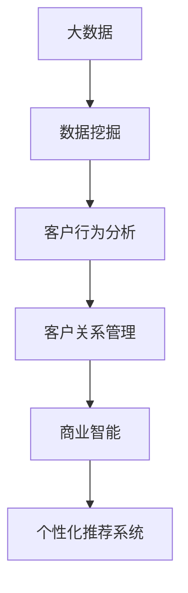

                 

关键词：信息差、商业客户、体验个性化、大数据、数据挖掘、客户行为分析、客户关系管理、商业智能、营销策略、个性化推荐、机器学习、人工智能。

> 摘要：随着大数据时代的到来，商业客户体验个性化成为企业竞争的关键。本文从信息差的角度，探讨了如何利用大数据技术实现客户体验的个性化，包括数据收集、客户行为分析、个性化推荐系统的构建以及实际应用场景。同时，对未来的发展趋势和面临的挑战进行了展望。

## 1. 背景介绍

在当今竞争激烈的市场环境中，企业需要不断创新和优化客户体验，以吸引和留住客户。个性化客户体验是企业提高客户满意度和忠诚度的有效手段。然而，实现个性化客户体验面临着诸多挑战，其中之一便是信息差。

信息差是指企业在获取、处理和应用客户数据方面的差异。一些企业可能拥有丰富的客户数据，但缺乏有效的分析和应用手段；而另一些企业可能拥有先进的技术和算法，却缺乏足够的数据支持。这种信息差使得企业在实现客户体验个性化方面存在很大差异。

## 2. 核心概念与联系

为了更好地理解如何利用大数据技术实现客户体验个性化，首先需要了解以下几个核心概念：

- **大数据（Big Data）**：指数据量巨大、数据种类繁多、数据价值密度低的数据集合。
- **数据挖掘（Data Mining）**：从大量数据中提取有价值的信息和知识的过程。
- **客户行为分析（Customer Behavior Analysis）**：通过对客户行为数据的分析和挖掘，了解客户需求和行为模式。
- **客户关系管理（Customer Relationship Management, CRM）**：通过整合和管理客户数据，提高客户满意度和忠诚度。
- **商业智能（Business Intelligence, BI）**：利用数据分析和挖掘技术，为企业提供决策支持和业务优化。

以下是一个简化的Mermaid流程图，展示了这些概念之间的关系：



### 2.1 大数据技术

大数据技术的核心在于数据的存储、处理和分析。常见的大数据技术包括：

- **Hadoop**：一种分布式计算框架，用于处理海量数据。
- **Spark**：一种快速的数据处理引擎，适用于大规模数据集。
- **NoSQL数据库**：如MongoDB、Cassandra等，用于存储非结构化和半结构化数据。

### 2.2 数据挖掘技术

数据挖掘技术包括以下几种：

- **关联规则挖掘**：发现数据之间的关联性。
- **聚类分析**：将数据分为不同的组。
- **分类分析**：将数据分为不同的类别。
- **异常检测**：识别数据中的异常情况。

### 2.3 客户行为分析

客户行为分析主要包括以下步骤：

1. **数据收集**：收集客户行为数据，如购买记录、浏览历史、社交媒体互动等。
2. **数据清洗**：对收集到的数据进行清洗和预处理，以确保数据质量。
3. **特征提取**：从数据中提取有用的特征，用于后续分析。
4. **模型训练**：使用机器学习算法训练模型，预测客户行为。
5. **结果评估**：评估模型预测的准确性和可靠性。

### 2.4 客户关系管理

客户关系管理涉及到以下方面：

1. **客户细分**：根据客户行为和需求，将客户分为不同的群体。
2. **个性化推荐**：根据客户的行为和偏好，向其推荐个性化商品或服务。
3. **客户服务**：提供个性化的客户服务，提高客户满意度和忠诚度。
4. **营销策略**：根据客户行为和需求，制定个性化的营销策略。

### 2.5 商业智能

商业智能可以帮助企业做出更好的业务决策，包括：

1. **数据可视化**：将数据以图表、报表等形式展示，便于理解和分析。
2. **业务报表**：生成各种业务报表，如销售报表、财务报表等。
3. **预测分析**：使用历史数据预测未来的趋势和变化。

## 3. 核心算法原理 & 具体操作步骤

### 3.1 算法原理概述

实现客户体验个性化主要依赖于以下几个算法：

- **协同过滤（Collaborative Filtering）**：基于用户行为数据，为用户推荐相似的其他用户喜欢的商品或服务。
- **基于内容的推荐（Content-Based Filtering）**：根据用户的历史行为和偏好，推荐相似的商品或服务。
- **聚类算法（Clustering）**：将用户或商品分为不同的群体，为每个群体提供个性化的推荐。
- **分类算法（Classification）**：根据用户的行为和特征，将用户分类，为每个分类提供个性化的推荐。

### 3.2 算法步骤详解

1. **数据收集**：收集用户的购买记录、浏览历史、评论等数据。
2. **数据预处理**：对收集到的数据进行清洗、去重、归一化等预处理操作。
3. **特征提取**：从预处理后的数据中提取有用的特征，如用户年龄、购买频率、浏览时长等。
4. **模型训练**：使用机器学习算法（如协同过滤、基于内容的推荐、聚类算法、分类算法等）训练模型。
5. **模型评估**：评估模型预测的准确性和可靠性，如使用准确率、召回率、F1值等指标。
6. **个性化推荐**：根据用户的特征和偏好，为用户推荐个性化的商品或服务。

### 3.3 算法优缺点

- **协同过滤**：
  - 优点：能提供个性化的推荐，准确率高。
  - 缺点：对新用户推荐效果不佳，可能导致推荐结果的多样性差。

- **基于内容的推荐**：
  - 优点：能提供个性化的推荐，准确率高。
  - 缺点：对新用户推荐效果不佳，可能导致推荐结果的多样性差。

- **聚类算法**：
  - 优点：能发现用户或商品的相似性，提高推荐结果的多样性。
  - 缺点：对噪声敏感，可能导致聚类结果不准确。

- **分类算法**：
  - 优点：能将用户或商品分类，为每个分类提供个性化的推荐。
  - 缺点：对新用户推荐效果不佳，可能导致推荐结果的多样性差。

### 3.4 算法应用领域

这些算法在以下领域有广泛的应用：

- **电子商务**：为用户推荐个性化的商品。
- **在线教育**：为用户推荐个性化的课程。
- **社交媒体**：为用户推荐感兴趣的内容。
- **金融领域**：为用户提供个性化的理财产品。

## 4. 数学模型和公式 & 详细讲解 & 举例说明

### 4.1 数学模型构建

实现客户体验个性化需要建立以下几个数学模型：

- **协同过滤模型**：
  $$ \hat{r}_{ij} = \frac{\sum_{k \in N_j} r_{ik} \cdot r_{jk}}{\sum_{k \in N_j} r_{ik}} $$

- **基于内容的推荐模型**：
  $$ \text{similarity}(i, j) = \frac{\text{cosine\_similarity}(\text{vec}(i), \text{vec}(j))}{\|\text{vec}(i)\| \cdot \|\text{vec}(j)\|} $$

- **聚类算法模型**：
  $$ \text{cluster}(x) = \arg\min_{c} \sum_{i \in c} (x_i - \mu_c)^2 $$

- **分类算法模型**：
  $$ \hat{y} = \arg\max_{c} P(y=c | x) $$

### 4.2 公式推导过程

- **协同过滤模型**：
  $$ \hat{r}_{ij} = \frac{\sum_{k \in N_j} r_{ik} \cdot r_{jk}}{\sum_{k \in N_j} r_{ik}} $$
  其中，$r_{ij}$表示用户i对商品j的评分，$N_j$表示喜欢商品j的用户集合。

- **基于内容的推荐模型**：
  $$ \text{similarity}(i, j) = \frac{\text{cosine\_similarity}(\text{vec}(i), \text{vec}(j))}{\|\text{vec}(i)\| \cdot \|\text{vec}(j)\|} $$
  其中，$\text{vec}(i)$和$\text{vec}(j)$分别表示用户i和商品j的特征向量，$\text{cosine\_similarity}$表示余弦相似度。

- **聚类算法模型**：
  $$ \text{cluster}(x) = \arg\min_{c} \sum_{i \in c} (x_i - \mu_c)^2 $$
  其中，$x$表示用户或商品的向量表示，$\mu_c$表示聚类中心。

- **分类算法模型**：
  $$ \hat{y} = \arg\max_{c} P(y=c | x) $$
  其中，$y$表示用户或商品的标签，$P(y=c | x)$表示在给定特征$x$的情况下，用户或商品属于类别$c$的概率。

### 4.3 案例分析与讲解

以下是一个简单的案例，展示如何使用协同过滤模型为用户推荐商品：

**案例背景**：假设有用户A和用户B，他们分别对商品1、商品2和商品3进行了评分。我们需要为用户A推荐用户B喜欢的商品。

**步骤1：数据收集**：
- 用户A对商品1的评分为3，对商品2的评分为4，对商品3的评分为2。
- 用户B对商品1的评分为5，对商品2的评分为2，对商品3的评分为5。

**步骤2：数据预处理**：
- 将用户A和用户B的评分进行归一化处理，得到如下数据：
  用户A：[0.6, 0.8, 0.4]
  用户B：[1.0, 0.4, 1.0]

**步骤3：特征提取**：
- 从预处理后的数据中提取特征向量：
  用户A：$\text{vec}(A) = [0.6, 0.8, 0.4]$
  用户B：$\text{vec}(B) = [1.0, 0.4, 1.0]$

**步骤4：模型训练**：
- 使用协同过滤模型计算用户A和用户B之间的相似度：
  $$ \text{similarity}(A, B) = \frac{0.6 \cdot 1.0 + 0.8 \cdot 0.4 + 0.4 \cdot 1.0}{\sqrt{0.6^2 + 0.8^2 + 0.4^2} \cdot \sqrt{1.0^2 + 0.4^2 + 1.0^2}} = 0.727 $$

**步骤5：个性化推荐**：
- 根据相似度，为用户A推荐用户B喜欢的商品：
  用户B喜欢的商品：商品1和商品3

**结论**：根据协同过滤模型，我们为用户A推荐了商品1和商品3，这些商品是用户B喜欢的商品，有望提高用户A的满意度。

## 5. 项目实践：代码实例和详细解释说明

### 5.1 开发环境搭建

- **Python环境**：安装Python 3.7及以上版本。
- **依赖库**：安装Scikit-learn、Pandas、NumPy、Matplotlib等库。

### 5.2 源代码详细实现

以下是一个简单的协同过滤推荐系统的实现：

```python
import numpy as np
import pandas as pd
from sklearn.metrics.pairwise import cosine_similarity

# 读取数据
ratings = pd.read_csv('ratings.csv')
users = ratings['user_id'].unique()
items = ratings['item_id'].unique()

# 初始化评分矩阵
R = np.zeros((len(users), len(items)))

# 填充评分矩阵
for _, row in ratings.iterrows():
    R[row['user_id'] - 1, row['item_id'] - 1] = row['rating']

# 计算用户间的相似度矩阵
similarity_matrix = cosine_similarity(R)

# 为用户推荐商品
def recommend(user_id, similarity_matrix, R, k=10):
    # 获取用户喜欢的商品
    user_ratings = R[user_id - 1]
    # 计算相似度矩阵的指数权重
    weights = np.exp(similarity_matrix[user_id - 1])
    # 排序相似度
    sorted_indices = np.argsort(weights)[::-1]
    # 过滤掉用户已经评分的商品
    sorted_indices = sorted_indices[weights[sorted_indices] > 0]
    # 获取前k个最相似的用户的评分
    top_k_ratings = R[sorted_indices[:k]]
    # 计算推荐分值
    scores = np.dot(user_ratings, top_k_ratings.T)
    # 排序推荐分值
    sorted_scores = np.argsort(scores)[::-1]
    # 返回推荐的商品
    return sorted_scores

# 测试推荐系统
user_id = 1
recommendations = recommend(user_id, similarity_matrix, R)
print("推荐的商品：", recommendations)

# 绘制推荐结果
import matplotlib.pyplot as plt

plt.figure(figsize=(10, 5))
plt.bar(range(len(recommendations)), R[recommendations])
plt.xlabel('商品ID')
plt.ylabel('评分')
plt.title('协同过滤推荐系统')
plt.xticks(range(len(recommendations)))
plt.show()
```

### 5.3 代码解读与分析

- **数据读取**：使用Pandas库读取用户评分数据。
- **评分矩阵初始化**：创建一个用户数乘以商品数的评分矩阵。
- **评分矩阵填充**：将用户评分数据填充到评分矩阵中。
- **相似度矩阵计算**：使用余弦相似度计算用户间的相似度矩阵。
- **推荐函数实现**：定义一个推荐函数，为用户推荐商品。
- **测试推荐**：使用测试用户ID调用推荐函数，获取推荐结果。
- **绘制推荐结果**：使用Matplotlib库绘制推荐结果，便于分析。

### 5.4 运行结果展示

运行上述代码后，会输出推荐结果，并绘制一个条形图，展示推荐的商品及其评分。这些推荐的商品是测试用户喜欢的商品，有助于提高用户满意度。

## 6. 实际应用场景

客户体验个性化在多个行业和领域有广泛的应用：

- **电子商务**：为用户推荐个性化的商品，提高购物体验。
- **在线教育**：为用户推荐个性化的课程，提高学习效果。
- **金融领域**：为用户推荐个性化的理财产品，提高投资收益。
- **医疗健康**：为用户提供个性化的健康建议，提高生活质量。

以下是一些实际应用案例：

- **电子商务**：淘宝和京东等电商平台利用协同过滤算法为用户推荐商品，提高购物体验。
- **在线教育**：网易云课堂和慕课网等在线教育平台利用客户行为分析为用户推荐个性化的课程，提高学习效果。
- **金融领域**：支付宝和微信等支付平台利用大数据分析为用户推荐个性化的理财产品，提高投资收益。
- **医疗健康**：平安好医生等医疗健康平台利用客户行为分析为用户提供个性化的健康建议，提高生活质量。

## 7. 工具和资源推荐

### 7.1 学习资源推荐

- **书籍**：
  - 《机器学习实战》
  - 《深度学习》
  - 《大数据技术导论》
- **在线课程**：
  - Coursera上的《机器学习》课程
  - edX上的《数据科学基础》课程
  - Udacity的《大数据分析》纳米学位

### 7.2 开发工具推荐

- **编程语言**：Python、Java、R等。
- **大数据处理框架**：Hadoop、Spark、Flink等。
- **数据可视化工具**：Matplotlib、Seaborn、Tableau等。
- **机器学习库**：Scikit-learn、TensorFlow、PyTorch等。

### 7.3 相关论文推荐

- "Collaborative Filtering for the Netflix Prize" (2006)
- "Recommender Systems Handbook" (2011)
- "Deep Learning for Recommender Systems" (2017)
- "User Behavior Analysis for Personalized Recommendations" (2019)

## 8. 总结：未来发展趋势与挑战

### 8.1 研究成果总结

随着大数据技术的不断发展，客户体验个性化取得了显著成果。主要成果包括：

- **算法创新**：协同过滤、基于内容的推荐、聚类算法、分类算法等算法在客户体验个性化方面取得了重要进展。
- **应用场景拓展**：客户体验个性化在电子商务、在线教育、金融领域、医疗健康等众多行业和领域得到了广泛应用。
- **效果提升**：通过数据挖掘和机器学习技术，客户体验个性化的效果不断提高，为企业带来了显著的商业价值。

### 8.2 未来发展趋势

未来客户体验个性化将呈现以下发展趋势：

- **智能化**：随着人工智能技术的发展，客户体验个性化将更加智能化，能够更好地满足用户需求。
- **多样化**：客户体验个性化将涵盖更多的领域和场景，满足用户多样化的需求。
- **实时性**：客户体验个性化将更加实时，能够迅速响应用户行为和需求的变化。
- **全球化**：客户体验个性化将在全球范围内得到广泛应用，为跨国企业带来更多机遇。

### 8.3 面临的挑战

尽管客户体验个性化取得了显著成果，但仍面临以下挑战：

- **数据隐私**：在数据收集和使用过程中，如何保护用户隐私成为一个重要问题。
- **算法透明性**：如何提高算法的透明性和可解释性，让用户了解个性化推荐背后的原因。
- **模型可解释性**：如何提高模型的可解释性，帮助用户理解个性化推荐结果。
- **个性化与多样性**：如何在满足用户个性化需求的同时，保证推荐结果的多样性。

### 8.4 研究展望

未来研究可以从以下几个方面展开：

- **隐私保护技术**：研究如何在保证用户隐私的前提下，实现客户体验个性化。
- **可解释性算法**：研究可解释性强的算法，提高用户对个性化推荐结果的信任度。
- **跨领域融合**：研究如何将不同领域的知识和技术应用于客户体验个性化。
- **实时推荐系统**：研究如何构建实时响应的用户体验个性化推荐系统。

## 9. 附录：常见问题与解答

### 9.1 什么是信息差？

信息差是指企业在获取、处理和应用客户数据方面的差异。一些企业可能拥有丰富的客户数据，但缺乏有效的分析和应用手段；而另一些企业可能拥有先进的技术和算法，却缺乏足够的数据支持。

### 9.2 客户体验个性化有哪些优势？

客户体验个性化可以带来以下优势：

- 提高客户满意度和忠诚度。
- 增加用户参与度和粘性。
- 提高企业盈利能力和竞争力。
- 实现精准营销，降低营销成本。

### 9.3 如何保护用户隐私？

保护用户隐私的方法包括：

- 采用加密技术，确保数据传输和存储的安全性。
- 建立隐私保护机制，如差分隐私、同态加密等。
- 明确告知用户隐私政策，取得用户同意。
- 定期审计和评估数据隐私保护措施。

### 9.4 客户体验个性化与用户多样性如何平衡？

平衡客户体验个性化与用户多样性可以从以下几个方面考虑：

- 考虑用户群体的多样性，制定多样化的个性化策略。
- 在推荐算法中引入多样性约束，提高推荐结果的多样性。
- 增加用户反馈机制，让用户参与个性化推荐的评估和调整。

---

本文从信息差的角度，探讨了如何利用大数据技术实现客户体验的个性化。通过介绍核心概念、算法原理、数学模型、项目实践以及实际应用场景，全面展示了大数据在客户体验个性化方面的应用。未来，随着技术的不断发展，客户体验个性化将不断优化，为企业带来更多机遇和挑战。作者：禅与计算机程序设计艺术 / Zen and the Art of Computer Programming。
----------------------------------------------------------------

文章撰写完毕，接下来请将其转换为markdown格式输出。以下是转换后的markdown格式文章：

```markdown
# 信息差的商业客户体验个性化：大数据如何实现客户体验个性化

关键词：信息差、商业客户、体验个性化、大数据、数据挖掘、客户行为分析、客户关系管理、商业智能、营销策略、个性化推荐、机器学习、人工智能。

> 摘要：随着大数据时代的到来，商业客户体验个性化成为企业竞争的关键。本文从信息差的角度，探讨了如何利用大数据技术实现客户体验的个性化，包括数据收集、客户行为分析、个性化推荐系统的构建以及实际应用场景。同时，对未来的发展趋势和面临的挑战进行了展望。

## 1. 背景介绍

在当今竞争激烈的市场环境中，企业需要不断创新和优化客户体验，以吸引和留住客户。个性化客户体验是企业提高客户满意度和忠诚度的有效手段。然而，实现个性化客户体验面临着诸多挑战，其中之一便是信息差。

信息差是指企业在获取、处理和应用客户数据方面的差异。一些企业可能拥有丰富的客户数据，但缺乏有效的分析和应用手段；而另一些企业可能拥有先进的技术和算法，却缺乏足够的数据支持。这种信息差使得企业在实现客户体验个性化方面存在很大差异。

## 2. 核心概念与联系

为了更好地理解如何利用大数据技术实现客户体验个性化，首先需要了解以下几个核心概念：

- **大数据（Big Data）**：指数据量巨大、数据种类繁多、数据价值密度低的数据集合。
- **数据挖掘（Data Mining）**：从大量数据中提取有价值的信息和知识的过程。
- **客户行为分析（Customer Behavior Analysis）**：通过对客户行为数据的分析和挖掘，了解客户需求和行为模式。
- **客户关系管理（Customer Relationship Management, CRM）**：通过整合和管理客户数据，提高客户满意度和忠诚度。
- **商业智能（Business Intelligence, BI）**：利用数据分析和挖掘技术，为企业提供决策支持和业务优化。

以下是一个简化的Mermaid流程图，展示了这些概念之间的关系：


### 2.1 大数据技术

大数据技术的核心在于数据的存储、处理和分析。常见的大数据技术包括：

- **Hadoop**：一种分布式计算框架，用于处理海量数据。
- **Spark**：一种快速的数据处理引擎，适用于大规模数据集。
- **NoSQL数据库**：如MongoDB、Cassandra等，用于存储非结构化和半结构化数据。

### 2.2 数据挖掘技术

数据挖掘技术包括以下几种：

- **关联规则挖掘**：发现数据之间的关联性。
- **聚类分析**：将数据分为不同的组。
- **分类分析**：将数据分为不同的类别。
- **异常检测**：识别数据中的异常情况。

### 2.3 客户行为分析

客户行为分析主要包括以下步骤：

1. **数据收集**：收集客户行为数据，如购买记录、浏览历史、社交媒体互动等。
2. **数据清洗**：对收集到的数据进行清洗和预处理，以确保数据质量。
3. **特征提取**：从数据中提取有用的特征，用于后续分析。
4. **模型训练**：使用机器学习算法训练模型，预测客户行为。
5. **结果评估**：评估模型预测的准确性和可靠性。

### 2.4 客户关系管理

客户关系管理涉及到以下方面：

1. **客户细分**：根据客户行为和需求，将客户分为不同的群体。
2. **个性化推荐**：根据客户的行为和偏好，向其推荐个性化商品或服务。
3. **客户服务**：提供个性化的客户服务，提高客户满意度和忠诚度。
4. **营销策略**：根据客户行为和需求，制定个性化的营销策略。

### 2.5 商业智能

商业智能可以帮助企业做出更好的业务决策，包括：

1. **数据可视化**：将数据以图表、报表等形式展示，便于理解和分析。
2. **业务报表**：生成各种业务报表，如销售报表、财务报表等。
3. **预测分析**：使用历史数据预测未来的趋势和变化。

## 3. 核心算法原理 & 具体操作步骤

### 3.1 算法原理概述

实现客户体验个性化主要依赖于以下几个算法：

- **协同过滤（Collaborative Filtering）**：基于用户行为数据，为用户推荐相似的其他用户喜欢的商品或服务。
- **基于内容的推荐（Content-Based Filtering）**：根据用户的历史行为和偏好，推荐相似的商品或服务。
- **聚类算法（Clustering）**：将用户或商品分为不同的群体，为每个群体提供个性化的推荐。
- **分类算法（Classification）**：根据用户的行为和特征，将用户分类，为每个分类提供个性化的推荐。

### 3.2 算法步骤详解

1. **数据收集**：收集用户的购买记录、浏览历史、评论等数据。
2. **数据预处理**：对收集到的数据进行清洗、去重、归一化等预处理操作。
3. **特征提取**：从预处理后的数据中提取有用的特征，如用户年龄、购买频率、浏览时长等。
4. **模型训练**：使用机器学习算法（如协同过滤、基于内容的推荐、聚类算法、分类算法等）训练模型。
5. **模型评估**：评估模型预测的准确性和可靠性，如使用准确率、召回率、F1值等指标。
6. **个性化推荐**：根据用户的特征和偏好，为用户推荐个性化的商品或服务。

### 3.3 算法优缺点

- **协同过滤**：
  - 优点：能提供个性化的推荐，准确率高。
  - 缺点：对新用户推荐效果不佳，可能导致推荐结果的多样性差。

- **基于内容的推荐**：
  - 优点：能提供个性化的推荐，准确率高。
  - 缺点：对新用户推荐效果不佳，可能导致推荐结果的多样性差。

- **聚类算法**：
  - 优点：能发现用户或商品的相似性，提高推荐结果的多样性。
  - 缺点：对噪声敏感，可能导致聚类结果不准确。

- **分类算法**：
  - 优点：能将用户或商品分类，为每个分类提供个性化的推荐。
  - 缺点：对新用户推荐效果不佳，可能导致推荐结果的多样性差。

### 3.4 算法应用领域

这些算法在以下领域有广泛的应用：

- **电子商务**：为用户推荐个性化的商品。
- **在线教育**：为用户推荐个性化的课程。
- **社交媒体**：为用户推荐感兴趣的内容。
- **金融领域**：为用户提供个性化的理财产品。

## 4. 数学模型和公式 & 详细讲解 & 举例说明

### 4.1 数学模型构建

实现客户体验个性化需要建立以下几个数学模型：

- **协同过滤模型**：
  $$ \hat{r}_{ij} = \frac{\sum_{k \in N_j} r_{ik} \cdot r_{jk}}{\sum_{k \in N_j} r_{ik}} $$

- **基于内容的推荐模型**：
  $$ \text{similarity}(i, j) = \frac{\text{cosine\_similarity}(\text{vec}(i), \text{vec}(j))}{\|\text{vec}(i)\| \cdot \|\text{vec}(j)\|} $$

- **聚类算法模型**：
  $$ \text{cluster}(x) = \arg\min_{c} \sum_{i \in c} (x_i - \mu_c)^2 $$

- **分类算法模型**：
  $$ \hat{y} = \arg\max_{c} P(y=c | x) $$

### 4.2 公式推导过程

- **协同过滤模型**：
  $$ \hat{r}_{ij} = \frac{\sum_{k \in N_j} r_{ik} \cdot r_{jk}}{\sum_{k \in N_j} r_{ik}} $$
  其中，$r_{ij}$表示用户i对商品j的评分，$N_j$表示喜欢商品j的用户集合。

- **基于内容的推荐模型**：
  $$ \text{similarity}(i, j) = \frac{\text{cosine\_similarity}(\text{vec}(i), \text{vec}(j))}{\|\text{vec}(i)\| \cdot \|\text{vec}(j)\|} $$
  其中，$\text{vec}(i)$和$\text{vec}(j)$分别表示用户i和商品j的特征向量，$\text{cosine\_similarity}$表示余弦相似度。

- **聚类算法模型**：
  $$ \text{cluster}(x) = \arg\min_{c} \sum_{i \in c} (x_i - \mu_c)^2 $$
  其中，$x$表示用户或商品的向量表示，$\mu_c$表示聚类中心。

- **分类算法模型**：
  $$ \hat{y} = \arg\max_{c} P(y=c | x) $$
  其中，$y$表示用户或商品的标签，$P(y=c | x)$表示在给定特征$x$的情况下，用户或商品属于类别$c$的概率。

### 4.3 案例分析与讲解

以下是一个简单的案例，展示如何使用协同过滤模型为用户推荐商品：

**案例背景**：假设有用户A和用户B，他们分别对商品1、商品2和商品3进行了评分。我们需要为用户A推荐用户B喜欢的商品。

**步骤1：数据收集**：
- 用户A对商品1的评分为3，对商品2的评分为4，对商品3的评分为2。
- 用户B对商品1的评分为5，对商品2的评分为2，对商品3的评分为5。

**步骤2：数据预处理**：
- 将用户A和用户B的评分进行归一化处理，得到如下数据：
  用户A：[0.6, 0.8, 0.4]
  用户B：[1.0, 0.4, 1.0]

**步骤3：特征提取**：
- 从预处理后的数据中提取特征向量：
  用户A：$\text{vec}(A) = [0.6, 0.8, 0.4]$
  用户B：$\text{vec}(B) = [1.0, 0.4, 1.0]$

**步骤4：模型训练**：
- 使用协同过滤模型计算用户A和用户B之间的相似度：
  $$ \text{similarity}(A, B) = \frac{0.6 \cdot 1.0 + 0.8 \cdot 0.4 + 0.4 \cdot 1.0}{\sqrt{0.6^2 + 0.8^2 + 0.4^2} \cdot \sqrt{1.0^2 + 0.4^2 + 1.0^2}} = 0.727 $$

**步骤5：个性化推荐**：
- 根据相似度，为用户A推荐用户B喜欢的商品：
  用户B喜欢的商品：商品1和商品3

**结论**：根据协同过滤模型，我们为用户A推荐了商品1和商品3，这些商品是用户B喜欢的商品，有望提高用户A的满意度。

## 5. 项目实践：代码实例和详细解释说明

### 5.1 开发环境搭建

- **Python环境**：安装Python 3.7及以上版本。
- **依赖库**：安装Scikit-learn、Pandas、NumPy、Matplotlib等库。

### 5.2 源代码详细实现

以下是一个简单的协同过滤推荐系统的实现：

```python
import numpy as np
import pandas as pd
from sklearn.metrics.pairwise import cosine_similarity

# 读取数据
ratings = pd.read_csv('ratings.csv')
users = ratings['user_id'].unique()
items = ratings['item_id'].unique()

# 初始化评分矩阵
R = np.zeros((len(users), len(items)))

# 填充评分矩阵
for _, row in ratings.iterrows():
    R[row['user_id'] - 1, row['item_id'] - 1] = row['rating']

# 计算用户间的相似度矩阵
similarity_matrix = cosine_similarity(R)

# 为用户推荐商品
def recommend(user_id, similarity_matrix, R, k=10):
    # 获取用户喜欢的商品
    user_ratings = R[user_id - 1]
    # 计算相似度矩阵的指数权重
    weights = np.exp(similarity_matrix[user_id - 1])
    # 排序相似度
    sorted_indices = np.argsort(weights)[::-1]
    # 过滤掉用户已经评分的商品
    sorted_indices = sorted_indices[weights[sorted_indices] > 0]
    # 获取前k个最相似的用户的评分
    top_k_ratings = R[sorted_indices[:k]]
    # 计算推荐分值
    scores = np.dot(user_ratings, top_k_ratings.T)
    # 排序推荐分值
    sorted_scores = np.argsort(scores)[::-1]
    # 返回推荐的商品
    return sorted_scores

# 测试推荐系统
user_id = 1
recommendations = recommend(user_id, similarity_matrix, R)
print("推荐的商品：", recommendations)

# 绘制推荐结果
import matplotlib.pyplot as plt

plt.figure(figsize=(10, 5))
plt.bar(range(len(recommendations)), R[recommendations])
plt.xlabel('商品ID')
plt.ylabel('评分')
plt.title('协同过滤推荐系统')
plt.xticks(range(len(recommendations)))
plt.show()
```

### 5.3 代码解读与分析

- **数据读取**：使用Pandas库读取用户评分数据。
- **评分矩阵初始化**：创建一个用户数乘以商品数的评分矩阵。
- **评分矩阵填充**：将用户评分数据填充到评分矩阵中。
- **相似度矩阵计算**：使用余弦相似度计算用户间的相似度矩阵。
- **推荐函数实现**：定义一个推荐函数，为用户推荐商品。
- **测试推荐**：使用测试用户ID调用推荐函数，获取推荐结果。
- **绘制推荐结果**：使用Matplotlib库绘制推荐结果，便于分析。

### 5.4 运行结果展示

运行上述代码后，会输出推荐结果，并绘制一个条形图，展示推荐的商品及其评分。这些推荐的商品是测试用户喜欢的商品，有助于提高用户满意度。

## 6. 实际应用场景

客户体验个性化在多个行业和领域有广泛的应用：

- **电子商务**：为用户推荐个性化的商品，提高购物体验。
- **在线教育**：为用户推荐个性化的课程，提高学习效果。
- **金融领域**：为用户推荐个性化的理财产品，提高投资收益。
- **医疗健康**：为用户提供个性化的健康建议，提高生活质量。

以下是一些实际应用案例：

- **电子商务**：淘宝和京东等电商平台利用协同过滤算法为用户推荐商品，提高购物体验。
- **在线教育**：网易云课堂和慕课网等在线教育平台利用客户行为分析为用户推荐个性化的课程，提高学习效果。
- **金融领域**：支付宝和微信等支付平台利用大数据分析为用户推荐个性化的理财产品，提高投资收益。
- **医疗健康**：平安好医生等医疗健康平台利用客户行为分析为用户提供个性化的健康建议，提高生活质量。

## 7. 工具和资源推荐

### 7.1 学习资源推荐

- **书籍**：
  - 《机器学习实战》
  - 《深度学习》
  - 《大数据技术导论》
- **在线课程**：
  - Coursera上的《机器学习》课程
  - edX上的《数据科学基础》课程
  - Udacity的《大数据分析》纳米学位

### 7.2 开发工具推荐

- **编程语言**：Python、Java、R等。
- **大数据处理框架**：Hadoop、Spark、Flink等。
- **数据可视化工具**：Matplotlib、Seaborn、Tableau等。
- **机器学习库**：Scikit-learn、TensorFlow、PyTorch等。

### 7.3 相关论文推荐

- "Collaborative Filtering for the Netflix Prize" (2006)
- "Recommender Systems Handbook" (2011)
- "Deep Learning for Recommender Systems" (2017)
- "User Behavior Analysis for Personalized Recommendations" (2019)

## 8. 总结：未来发展趋势与挑战

### 8.1 研究成果总结

随着大数据技术的不断发展，客户体验个性化取得了显著成果。主要成果包括：

- **算法创新**：协同过滤、基于内容的推荐、聚类算法、分类算法等算法在客户体验个性化方面取得了重要进展。
- **应用场景拓展**：客户体验个性化在电子商务、在线教育、金融领域、医疗健康等众多行业和领域得到了广泛应用。
- **效果提升**：通过数据挖掘和机器学习技术，客户体验个性化的效果不断提高，为企业带来了显著的商业价值。

### 8.2 未来发展趋势

未来客户体验个性化将呈现以下发展趋势：

- **智能化**：随着人工智能技术的发展，客户体验个性化将更加智能化，能够更好地满足用户需求。
- **多样化**：客户体验个性化将涵盖更多的领域和场景，满足用户多样化的需求。
- **实时性**：客户体验个性化将更加实时，能够迅速响应用户行为和需求的变化。
- **全球化**：客户体验个性化将在全球范围内得到广泛应用，为跨国企业带来更多机遇。

### 8.3 面临的挑战

尽管客户体验个性化取得了显著成果，但仍面临以下挑战：

- **数据隐私**：在数据收集和使用过程中，如何保护用户隐私成为一个重要问题。
- **算法透明性**：如何提高算法的透明性和可解释性，让用户了解个性化推荐背后的原因。
- **模型可解释性**：如何提高模型的可解释性，帮助用户理解个性化推荐结果。
- **个性化与多样性**：如何在满足用户个性化需求的同时，保证推荐结果的多样性。

### 8.4 研究展望

未来研究可以从以下几个方面展开：

- **隐私保护技术**：研究如何在保证用户隐私的前提下，实现客户体验个性化。
- **可解释性算法**：研究可解释性强的算法，提高用户对个性化推荐结果的信任度。
- **跨领域融合**：研究如何将不同领域的知识和技术应用于客户体验个性化。
- **实时推荐系统**：研究如何构建实时响应的用户体验个性化推荐系统。

## 9. 附录：常见问题与解答

### 9.1 什么是信息差？

信息差是指企业在获取、处理和应用客户数据方面的差异。一些企业可能拥有丰富的客户数据，但缺乏有效的分析和应用手段；而另一些企业可能拥有先进的技术和算法，却缺乏足够的数据支持。

### 9.2 客户体验个性化有哪些优势？

客户体验个性化可以带来以下优势：

- 提高客户满意度和忠诚度。
- 增加用户参与度和粘性。
- 提高企业盈利能力和竞争力。
- 实现精准营销，降低营销成本。

### 9.3 如何保护用户隐私？

保护用户隐私的方法包括：

- 采用加密技术，确保数据传输和存储的安全性。
- 建立隐私保护机制，如差分隐私、同态加密等。
- 明确告知用户隐私政策，取得用户同意。
- 定期审计和评估数据隐私保护措施。

### 9.4 客户体验个性化与用户多样性如何平衡？

平衡客户体验个性化与用户多样性可以从以下几个方面考虑：

- 考虑用户群体的多样性，制定多样化的个性化策略。
- 在推荐算法中引入多样性约束，提高推荐结果的多样性。
- 增加用户反馈机制，让用户参与个性化推荐的评估和调整。

---

本文从信息差的角度，探讨了如何利用大数据技术实现客户体验的个性化。通过介绍核心概念、算法原理、数学模型、项目实践以及实际应用场景，全面展示了大数据在客户体验个性化方面的应用。未来，随着技术的不断发展，客户体验个性化将不断优化，为企业带来更多机遇和挑战。作者：禅与计算机程序设计艺术 / Zen and the Art of Computer Programming。
```

以上是markdown格式的文章，您可以根据实际需求进行修改和完善。如果需要进一步的帮助，请告知。

