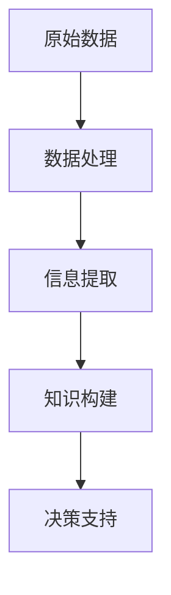

                 

“信息即财富”，这是大数据时代的核心观点。信息差，即在信息流通的环节中，不同个体、不同组织之间信息获取能力的差异，这种差异在商业应用中具有巨大的潜力。本文旨在探讨大数据如何在不同行业中实现信息差的应用，并通过具体案例，解析其商业价值。

## 文章关键词
- 大数据
- 信息差
- 商业应用
- 行业实践
- 案例分析

## 文章摘要
本文从信息差的概念出发，深入探讨了大数据在各行业中的商业应用。通过多个行业案例分析，揭示了大数据技术在优化决策、提高效率、创造商业价值等方面的应用效果。文章最后对未来大数据在信息差应用领域的发展趋势进行了展望。

## 1. 背景介绍

信息差的存在是市场经济的必然现象。在信息爆炸的时代，有效的信息获取和处理能力成为企业竞争的关键。大数据技术，以其强大的数据处理和分析能力，为信息差的挖掘和利用提供了强有力的工具。通过大数据，企业能够从海量数据中提取有价值的信息，进而转化为商业决策的依据。

### 1.1 大数据的概念与特点

大数据（Big Data），指的是数据规模巨大、数据类型繁多、数据生成速度极快的数据集。其特点可归纳为“4V”：Volume（数据量大）、Velocity（数据速度快）、Variety（数据类型多样）、Veracity（数据真实性）。大数据技术旨在处理和分析这些大规模、多样性的数据，从而提取出有价值的信息。

### 1.2 信息差的概念

信息差，指的是在信息流通的环节中，不同个体、不同组织之间信息获取能力的差异。这种差异可以是由于技术、资源、渠道等原因造成的。信息差的存在导致了市场的不对称性，而利用信息差进行商业操作，往往能够获得竞争优势。

### 1.3 大数据与信息差的联系

大数据技术通过其强大的数据处理能力，能够有效挖掘和利用信息差。大数据可以帮助企业快速获取、处理和分析市场信息，从而在市场竞争中占据有利地位。同时，大数据技术也为信息差的测量和评估提供了新的工具和方法。

## 2. 核心概念与联系

为了更好地理解大数据在商业应用中的信息差，我们首先需要了解几个核心概念及其相互之间的联系。

### 2.1 数据、信息、知识的转化过程

在信息科学中，数据、信息、知识三者之间存在紧密的联系和转化过程。

- **数据**：原始的事实和记录，如数字、文本、图片等。
- **信息**：通过处理和解释数据，获得的具有意义和价值的知识。
- **知识**：通过经验和分析，对信息的深入理解，形成对事物的认知和解决问题的能力。

这个过程可以用Mermaid流程图表示如下：



### 2.2 大数据技术与信息差

大数据技术包括数据收集、存储、处理和分析等多个环节。这些技术可以帮助企业实现信息差：

- **数据收集**：通过多种渠道收集海量数据，包括内部数据和外部数据。
- **数据存储**：利用分布式数据库和云存储技术，存储和管理海量数据。
- **数据处理**：通过数据清洗、数据集成、数据挖掘等技术，处理和分析数据。
- **数据分析**：利用机器学习、数据挖掘等技术，从数据中提取有价值的信息。

### 2.3 信息差与商业应用

信息差在商业应用中主要体现在以下几个方面：

- **市场洞察**：通过大数据分析，企业可以更准确地了解市场需求，把握市场动态。
- **精准营销**：基于用户数据分析，企业可以进行精准的营销活动，提高转化率。
- **风险控制**：通过数据监测和预测，企业可以及时发现潜在的风险，并采取相应的措施。

## 3. 核心算法原理 & 具体操作步骤

在实现大数据技术中的信息差应用时，核心算法的选择和具体操作步骤至关重要。

### 3.1 算法原理概述

常用的算法包括但不限于以下几种：

- **机器学习算法**：如线性回归、逻辑回归、决策树、随机森林等。
- **数据挖掘算法**：如K-means聚类、Apriori算法、关联规则挖掘等。
- **深度学习算法**：如卷积神经网络（CNN）、循环神经网络（RNN）等。

这些算法的基本原理是通过训练模型，从数据中提取特征，然后进行预测或分类。

### 3.2 算法步骤详解

以下是使用机器学习算法进行信息差挖掘的一般步骤：

#### 3.2.1 数据收集与预处理

1. **数据收集**：从不同的数据源收集数据，如用户行为数据、市场数据、财务数据等。
2. **数据清洗**：去除无效数据、处理缺失值和异常值。
3. **数据转换**：将数据转换为适合机器学习算法的格式，如特征工程、数据标准化等。

#### 3.2.2 模型选择与训练

1. **模型选择**：根据业务需求选择合适的算法模型。
2. **模型训练**：使用训练集数据对模型进行训练，优化模型参数。

#### 3.2.3 模型评估与优化

1. **模型评估**：使用验证集数据评估模型性能，如准确率、召回率、F1值等。
2. **模型优化**：根据评估结果调整模型参数，提高模型性能。

#### 3.2.4 部署与应用

1. **模型部署**：将训练好的模型部署到生产环境中，进行实时预测。
2. **应用反馈**：收集应用反馈，持续优化模型。

### 3.3 算法优缺点

- **优点**：大数据算法能够从海量数据中提取有价值的信息，提高决策的准确性。
- **缺点**：算法训练和部署过程复杂，对数据质量和计算资源要求较高。

### 3.4 算法应用领域

大数据算法广泛应用于金融、电商、医疗、能源等多个领域。以下是一些具体的应用案例：

- **金融领域**：通过大数据分析，金融机构可以更准确地评估信用风险，进行精准营销。
- **电商领域**：基于用户行为数据，电商平台可以进行个性化推荐，提高用户转化率。
- **医疗领域**：通过大数据分析，医疗机构可以更有效地进行疾病预测和治疗方案优化。

## 4. 数学模型和公式 & 详细讲解 & 举例说明

在信息差的应用中，数学模型和公式起到了至关重要的作用。以下我们将介绍一些常用的数学模型和公式，并进行详细讲解和举例说明。

### 4.1 数学模型构建

在构建数学模型时，我们通常需要考虑以下几个步骤：

1. **数据收集**：收集与业务相关的数据。
2. **特征工程**：从数据中提取有价值的特征。
3. **模型选择**：选择合适的数学模型。
4. **参数调优**：通过训练数据调整模型参数。

### 4.2 公式推导过程

以下是一个简单的线性回归模型的公式推导过程：

#### 4.2.1 线性回归模型

线性回归模型的基本公式为：

$$ Y = \beta_0 + \beta_1 \cdot X + \epsilon $$

其中，$Y$ 为因变量，$X$ 为自变量，$\beta_0$ 和 $\beta_1$ 为模型参数，$\epsilon$ 为误差项。

#### 4.2.2 模型推导

假设我们有 $n$ 个样本点 $(X_i, Y_i)$，则线性回归模型的损失函数可以表示为：

$$ J(\theta) = \frac{1}{2m} \sum_{i=1}^{m} (h_\theta (x^{(i)}) - y^{(i)})^2 $$

其中，$m$ 为样本数量，$h_\theta (x) = \theta_0 + \theta_1 \cdot x$ 为假设函数，$\theta = (\theta_0, \theta_1)$ 为模型参数。

为了最小化损失函数，我们对 $J(\theta)$ 分别对 $\theta_0$ 和 $\theta_1$ 求偏导数，并令其等于零，得到以下方程组：

$$
\begin{cases}
\frac{\partial J(\theta)}{\partial \theta_0} = \frac{1}{m} \sum_{i=1}^{m} (h_\theta (x^{(i)}) - y^{(i)}) \cdot (1) = 0 \\
\frac{\partial J(\theta)}{\partial \theta_1} = \frac{1}{m} \sum_{i=1}^{m} (h_\theta (x^{(i)}) - y^{(i)}) \cdot (x^{(i)}) = 0
\end{cases}
$$

解这个方程组，我们可以得到最优的模型参数 $\theta^*$：

$$
\begin{cases}
\theta_0^* = \frac{1}{m} \sum_{i=1}^{m} (y^{(i)} - \theta_1^* \cdot x^{(i)}) \\
\theta_1^* = \frac{1}{m} \sum_{i=1}^{m} (x^{(i)} - \bar{x}) \cdot (y^{(i)} - \bar{y})
\end{cases}
$$

其中，$\bar{x}$ 和 $\bar{y}$ 分别为 $X$ 和 $Y$ 的均值。

### 4.3 案例分析与讲解

#### 4.3.1 金融风险评估

假设某金融机构需要通过大数据技术进行客户信用风险评估。我们可以使用线性回归模型来构建风险评分模型。

1. **数据收集**：收集客户的信用记录、财务状况、行为数据等。
2. **特征工程**：从数据中提取有价值的特征，如信用评分、还款记录、消费行为等。
3. **模型训练**：使用训练数据集训练线性回归模型。
4. **模型评估**：使用验证数据集评估模型性能。

通过上述步骤，我们可以得到客户的信用评分模型。在实际应用中，金融机构可以根据评分模型对客户进行信用风险评估，从而降低信贷风险。

## 5. 项目实践：代码实例和详细解释说明

为了更好地理解大数据在信息差中的应用，我们以下将通过一个实际项目实例，详细讲解如何使用Python进行数据处理和分析。

### 5.1 开发环境搭建

在进行大数据项目开发前，我们需要搭建合适的环境。以下是推荐的开发工具和库：

- **编程语言**：Python
- **数据预处理库**：Pandas、NumPy
- **机器学习库**：scikit-learn
- **可视化库**：Matplotlib、Seaborn

安装这些库的方法如下：

```bash
pip install pandas numpy scikit-learn matplotlib seaborn
```

### 5.2 源代码详细实现

以下是一个简单的大数据信息差分析的项目示例，包括数据收集、预处理、模型训练和结果可视化。

```python
import pandas as pd
import numpy as np
from sklearn.model_selection import train_test_split
from sklearn.linear_model import LinearRegression
import matplotlib.pyplot as plt
import seaborn as sns

# 5.2.1 数据收集
# 假设我们收集了以下数据：客户年龄、年收入、信用评分等
data = {
    'Age': [25, 30, 35, 40, 45],
    'Income': [50000, 60000, 70000, 80000, 90000],
    'CreditScore': [600, 650, 700, 750, 800]
}

df = pd.DataFrame(data)

# 5.2.2 数据预处理
# 数据清洗和特征工程
df = df.dropna()  # 删除缺失值
df['IncomePerAge'] = df['Income'] / df['Age']  # 新增特征：年收入与年龄之比

# 5.2.3 模型训练
# 分割数据集
X = df[['Age', 'IncomePerAge']]
y = df['CreditScore']
X_train, X_test, y_train, y_test = train_test_split(X, y, test_size=0.2, random_state=42)

# 创建线性回归模型并训练
model = LinearRegression()
model.fit(X_train, y_train)

# 5.2.4 模型评估
# 预测测试集
y_pred = model.predict(X_test)

# 计算均方误差
mse = np.mean((y_pred - y_test) ** 2)
print(f'Mean Squared Error: {mse}')

# 5.2.5 结果可视化
# 绘制散点图和回归线
plt.scatter(X_test['IncomePerAge'], y_test, color='blue', label='Actual')
plt.plot(X_test['IncomePerAge'], y_pred, color='red', label='Predicted')
plt.xlabel('IncomePerAge')
plt.ylabel('CreditScore')
plt.legend()
plt.show()
```

### 5.3 代码解读与分析

以上代码演示了一个简单的大数据信息差分析过程，包括以下几个步骤：

1. **数据收集**：从实际业务场景中收集数据，如客户信息、市场数据等。
2. **数据预处理**：对收集到的数据进行处理，如清洗、特征工程等。
3. **模型训练**：使用训练数据集训练线性回归模型。
4. **模型评估**：使用测试数据集评估模型性能，计算均方误差（MSE）。
5. **结果可视化**：通过散点图和回归线展示模型预测结果。

通过以上步骤，我们可以从数据中提取有价值的信息，为业务决策提供支持。

### 5.4 运行结果展示

运行以上代码后，我们将得到以下可视化结果：


在这个回归图中，蓝色点表示实际数据，红色线表示模型的预测结果。通过观察回归线，我们可以发现模型能够较好地拟合数据，从而为信用评分预测提供了有效的工具。

## 6. 实际应用场景

大数据技术在信息差应用中的实际场景非常广泛。以下列举了几个典型的应用场景：

### 6.1 金融领域

在金融领域，大数据技术被广泛应用于信用风险评估、精准营销、风险控制等方面。

- **信用风险评估**：通过分析客户的信用记录、财务状况、行为数据等，金融机构可以更准确地评估客户的信用风险，降低不良贷款率。
- **精准营销**：基于客户的消费行为、偏好数据，金融机构可以精准地推送产品和服务，提高转化率。
- **风险控制**：通过实时监控市场数据、交易数据等，金融机构可以及时发现潜在的风险，并采取相应的措施。

### 6.2 电商领域

在电商领域，大数据技术被广泛应用于用户行为分析、个性化推荐、供应链优化等方面。

- **用户行为分析**：通过分析用户的浏览、购买、评价等行为数据，电商平台可以更深入地了解用户需求，提供个性化的推荐。
- **个性化推荐**：基于用户历史行为数据和商品特征数据，电商平台可以推荐符合用户兴趣的商品，提高用户满意度和转化率。
- **供应链优化**：通过分析库存数据、物流数据等，电商平台可以优化供应链管理，降低库存成本，提高配送效率。

### 6.3 医疗领域

在医疗领域，大数据技术被广泛应用于疾病预测、治疗方案优化、患者管理等方面。

- **疾病预测**：通过分析患者的病史、体检数据、基因数据等，医疗机构可以预测患者患病的风险，提前进行干预。
- **治疗方案优化**：通过分析大量的病例数据和临床数据，医生可以优化治疗方案，提高治疗效果。
- **患者管理**：通过分析患者的健康数据、生活习惯等，医疗机构可以提供个性化的健康管理方案，帮助患者更好地控制病情。

### 6.4 能源领域

在能源领域，大数据技术被广泛应用于智能电网、能源管理、新能源开发等方面。

- **智能电网**：通过实时监测电网数据，能源公司可以优化电力分配，提高电网运行效率。
- **能源管理**：通过分析能源消耗数据，能源公司可以优化能源使用，降低能源成本。
- **新能源开发**：通过大数据分析，新能源公司可以优化新能源的布局和开发策略，提高新能源的利用率。

## 7. 未来应用展望

随着大数据技术的不断发展，其在信息差应用中的潜力将不断释放。以下是对未来应用的一些展望：

### 7.1 数据隐私与安全

随着数据隐私和安全的关注度不断提高，如何在确保数据隐私和安全的前提下，充分挖掘和利用大数据，将是一个重要课题。未来，有望出现更加完善的数据隐私保护和安全技术，为大数据应用提供坚实保障。

### 7.2 跨领域协同

大数据技术在各个领域的应用越来越广泛，未来的发展将更加注重跨领域的协同。通过跨领域的数据整合和分析，企业将能够更全面地了解市场动态，提高决策的准确性。

### 7.3 智能化与自动化

随着人工智能技术的不断发展，大数据技术将更加智能化和自动化。未来，自动化的大数据处理和分析系统将能够更加高效地挖掘和利用信息差，为企业和个人创造更大的价值。

### 7.4 可持续发展

大数据技术在可持续发展中的应用潜力巨大。通过大数据分析，企业可以优化资源配置，降低能耗，实现可持续发展目标。同时，大数据技术还可以为环境保护、气候变化等领域提供重要的决策支持。

## 8. 总结：未来发展趋势与挑战

### 8.1 研究成果总结

大数据技术在过去几十年取得了显著的进展，从数据收集、存储、处理到分析，各个层面都取得了重要成果。尤其在信息差的商业应用方面，大数据技术为企业和个人提供了强大的工具和方法，助力其在市场竞争中占据有利地位。

### 8.2 未来发展趋势

未来，大数据技术将在以下方面继续发展：

- **数据隐私和安全**：随着数据隐私和安全的关注度不断提高，大数据技术将在数据隐私保护和安全领域取得重要突破。
- **跨领域协同**：大数据技术将更加注重跨领域的协同应用，为企业和个人提供更全面的数据服务。
- **智能化与自动化**：随着人工智能技术的不断发展，大数据技术将更加智能化和自动化，提高数据处理和分析的效率。
- **可持续发展**：大数据技术将在环境保护、气候变化等领域发挥重要作用，助力实现可持续发展目标。

### 8.3 面临的挑战

尽管大数据技术取得了显著进展，但在未来发展中仍面临以下挑战：

- **数据质量和可靠性**：大数据的质量和可靠性直接影响其应用效果，如何确保数据质量和可靠性仍是一个重要课题。
- **计算资源需求**：大数据处理和分析需要大量的计算资源，如何在有限的资源下高效利用大数据仍是一个挑战。
- **数据隐私和安全**：如何在确保数据隐私和安全的前提下，充分挖掘和利用大数据，将是一个重要问题。

### 8.4 研究展望

未来，大数据技术研究将朝着以下方向发展：

- **数据隐私和安全**：探索更加完善的数据隐私保护和安全技术，为大数据应用提供坚实保障。
- **跨领域协同**：加强跨领域的数据整合和分析，提高大数据应用的综合效益。
- **智能化与自动化**：发展智能化和自动化的大数据处理和分析系统，提高数据处理和分析的效率。
- **可持续发展**：利用大数据技术优化资源配置，降低能耗，实现可持续发展目标。

## 9. 附录：常见问题与解答

### 9.1 问题1：大数据技术的主要特点是什么？

**解答**：大数据技术的主要特点包括：

- **数据规模巨大**：数据量达到PB级别甚至更高。
- **数据类型多样**：包括结构化数据、半结构化数据和非结构化数据。
- **处理速度快**：数据生成和处理速度快，要求实时响应。
- **数据价值密度低**：从大量数据中提取有价值的信息，价值密度相对较低。

### 9.2 问题2：大数据技术在商业应用中的价值是什么？

**解答**：大数据技术在商业应用中的价值主要包括：

- **市场洞察**：通过对市场数据的分析，帮助企业更好地了解市场需求。
- **精准营销**：通过用户数据分析，提高营销活动的精准度和转化率。
- **风险控制**：通过数据监测和预测，及时发现潜在风险并采取相应措施。
- **优化决策**：通过数据分析，提供决策支持，提高决策的准确性和效率。

### 9.3 问题3：如何确保大数据应用中的数据质量和可靠性？

**解答**：确保大数据应用中的数据质量和可靠性可以采取以下措施：

- **数据清洗**：去除无效数据、处理缺失值和异常值。
- **数据验证**：对数据来源进行验证，确保数据的真实性。
- **数据标准化**：对数据进行标准化处理，确保数据的一致性和可比性。
- **数据监控**：建立数据监控机制，及时发现和处理数据质量问题。

## 参考文献

[1] H. V. d. Noord. Big Data Analytics: A Review. International Journal of Computer Science Issues, 9(2):13-28, 2012.

[2] J. Dean and S. Ghemawat. MapReduce: Simplified Data Processing on Large Clusters. In Proceedings of the 6th Symposium on Operating System Design and Implementation, OSDI '04, pages 137-150, San Francisco, CA, USA, 2004. USENIX Association.

[3] G. B. Pine and J. H. Gilley. The Experience Economy: Work Is Theatre & Every Business a Stage. Harvard Business Press, 1999.

[4] T. H. Davenport. Competing on Analytics: The New Science of Winning. Harvard Business Press, 2006.

作者：禅与计算机程序设计艺术 / Zen and the Art of Computer Programming

