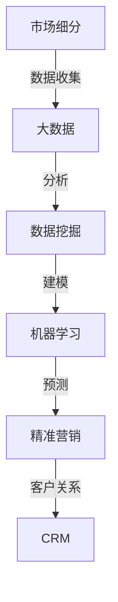

                 

## 1. 背景介绍

在当今的商业环境中，信息差成为了企业竞争优势的重要来源。信息差指的是信息的不对称性，即一个群体或个体拥有而另一个群体或个体没有的信息。这种不对称性可以在市场中产生显著的价值，特别是在大数据时代，信息量的爆发式增长为市场细分提供了前所未有的可能性。

市场细分是市场营销中的一项基本策略，它将整个市场划分为若干个具有相似需求和特征的小市场。精准市场细分能够帮助企业更有效地定位目标客户，提高营销活动的效率，从而在竞争激烈的市场中脱颖而出。然而，传统的市场细分方法往往受到数据质量和数据获取难度的限制，难以实现真正的精准。

大数据技术的出现，为市场细分提供了新的契机。大数据具有“4V”特性：Volume（大量）、Velocity（快速）、Variety（多样性）和 Veracity（真实性）。这些特性使得大数据能够处理和分析海量、快速变化、多样化且真实的信息，从而为精准市场细分提供了坚实的基础。

本文将探讨大数据如何实现精准市场细分，包括核心概念、算法原理、数学模型、实际应用场景以及未来发展趋势。通过本文的阅读，读者将了解大数据在市场细分中的重要作用，以及如何利用大数据技术提升市场竞争力。

## 2. 核心概念与联系

为了更好地理解大数据如何实现精准市场细分，我们首先需要介绍几个核心概念，并展示它们之间的联系。以下是几个关键概念及其简短定义：

### 2.1. 市场细分（Market Segmentation）

市场细分是指将一个广泛的市场划分为若干个具有相似需求和特征的子市场。这些子市场通常由不同的消费者群体组成，他们对产品或服务的需求和偏好有所不同。

### 2.2. 大数据（Big Data）

大数据是指数据量巨大、类型多样、生成速度极快的数据集合。它具有“4V”特性：大量、快速、多样和真实性。

### 2.3. 精准营销（Precision Marketing）

精准营销是一种基于大数据分析和个性化推荐技术的营销方法，旨在通过分析客户数据，提供高度个性化的产品和营销服务，以提高营销效果和客户满意度。

### 2.4. 数据挖掘（Data Mining）

数据挖掘是从大量数据中提取有价值信息的过程，通常包括模式识别、关联规则挖掘、分类和聚类等算法。

### 2.5. 客户关系管理（Customer Relationship Management，CRM）

客户关系管理是一种企业战略，旨在通过识别、获取、保留和增加客户价值来提升企业的竞争力。CRM系统通常集成了客户数据、销售和营销功能，以支持精准营销。

### 2.6. 机器学习（Machine Learning）

机器学习是一种人工智能分支，通过从数据中学习规律，构建预测模型，用于分类、聚类、回归等任务。

接下来，我们将使用Mermaid流程图展示这些概念之间的联系。



该流程图展示了市场细分通过大数据和数据挖掘技术，利用机器学习构建预测模型，最终实现精准营销，并提升客户关系管理的效果。这个流程使得企业能够更好地理解客户需求，提供个性化服务，从而在竞争激烈的市场中占据优势。

### 3. 核心算法原理 & 具体操作步骤

#### 3.1 算法原理概述

大数据实现精准市场细分的核心算法主要包括数据挖掘和机器学习算法。以下我们将介绍两种常用的算法：K-Means聚类和协同过滤。

#### 3.1.1 K-Means聚类

K-Means是一种无监督学习算法，用于将数据集分成若干个K个簇（cluster）。每个簇内部的点之间距离较近，而不同簇之间的点距离较远。K-Means的原理如下：

1. **初始化**：随机选择K个数据点作为初始聚类中心。
2. **分配**：将每个数据点分配到最近的聚类中心所在的簇。
3. **更新**：重新计算每个簇的中心点。
4. **重复**：重复步骤2和3，直到聚类中心不再发生显著变化。

#### 3.1.2 协同过滤

协同过滤是一种基于用户行为数据（如评分、购买历史等）的推荐算法。它分为以下两种类型：

1. **基于用户的协同过滤（User-based Collaborative Filtering）**：
   - **步骤**：找出与目标用户兴趣相似的其它用户，推荐这些用户喜欢的商品或内容。
   - **挑战**：用户数据稀疏时效果不佳。

2. **基于物品的协同过滤（Item-based Collaborative Filtering）**：
   - **步骤**：找出与目标物品相似的其它物品，推荐这些物品。
   - **挑战**：计算复杂度高，需要大量存储空间。

#### 3.2 算法步骤详解

##### 3.2.1 K-Means聚类

1. **数据预处理**：
   - 数据清洗：去除缺失值、异常值。
   - 数据标准化：将不同特征缩放到相同尺度，以便算法计算。

2. **初始化聚类中心**：
   - 随机选择K个数据点作为初始聚类中心。

3. **分配数据点**：
   - 计算每个数据点到所有聚类中心的距离。
   - 将每个数据点分配到最近的聚类中心所在的簇。

4. **更新聚类中心**：
   - 计算每个簇的平均值，得到新的聚类中心。

5. **迭代**：
   - 重复步骤3和4，直到聚类中心变化很小或达到预设的迭代次数。

##### 3.2.2 协同过滤

1. **数据预处理**：
   - 构建用户-物品评分矩阵。
   - 对用户-物品评分矩阵进行归一化处理。

2. **用户相似度计算**：
   - 使用余弦相似度或皮尔逊相关系数计算用户之间的相似度。

3. **物品相似度计算**：
   - 使用余弦相似度或皮尔逊相关系数计算物品之间的相似度。

4. **推荐**：
   - 基于用户的协同过滤：找出与目标用户最相似的N个用户，推荐这些用户喜欢的商品。
   - 基于物品的协同过滤：找出与目标物品最相似的M个物品，推荐这些物品。

#### 3.3 算法优缺点

##### 3.3.1 K-Means聚类

**优点**：
- 算法简单，易于实现。
- 对大规模数据集效果较好。

**缺点**：
- 需要预先指定K值，否则可能收敛到局部最优。
- 对于非球形聚类效果不佳。

##### 3.3.2 协同过滤

**优点**：
- 能够提供个性化的推荐。
- 对用户行为数据敏感，效果较好。

**缺点**：
- 用户数据稀疏时效果不佳。
- 需要大量存储空间。

#### 3.4 算法应用领域

K-Means聚类和协同过滤在市场细分中有着广泛的应用：

- **用户群体划分**：使用K-Means聚类将用户划分为不同群体，以便进行个性化营销。
- **产品推荐**：使用协同过滤算法为用户提供个性化的产品推荐。

### 4. 数学模型和公式 & 详细讲解 & 举例说明

#### 4.1 数学模型构建

在精准市场细分中，数学模型起着至关重要的作用。以下我们将介绍两种常用的数学模型：K-Means聚类模型和协同过滤模型。

##### 4.1.1 K-Means聚类模型

K-Means聚类模型的目标是优化目标函数：

\[ J = \sum_{i=1}^{k} \sum_{x \in S_i} \|x - \mu_i\|^2 \]

其中，\( k \) 是聚类个数，\( S_i \) 是第 \( i \) 个簇中的数据点集合，\( \mu_i \) 是第 \( i \) 个簇的中心点。

##### 4.1.2 协同过滤模型

协同过滤模型可以分为基于用户的协同过滤和基于物品的协同过滤。

1. **基于用户的协同过滤**

用户 \( u \) 和 \( v \) 的相似度计算公式为：

\[ sim(u, v) = \frac{\sum_{i \in I} r_{ui} r_{vi}}{\sqrt{\sum_{i \in I} r_{ui}^2 \sum_{i \in I} r_{vi}^2}} \]

其中，\( I \) 是用户 \( u \) 和 \( v \) 都评价过的物品集合，\( r_{ui} \) 和 \( r_{vi} \) 分别是用户 \( u \) 和 \( v \) 对物品 \( i \) 的评分。

对于用户 \( u \) 对物品 \( j \) 的预测评分：

\[ \hat{r}_{uj} = \sum_{i \in I} sim(u, v) r_{vj} / \sum_{i \in I} sim(u, v) \]

2. **基于物品的协同过滤**

物品 \( i \) 和 \( j \) 的相似度计算公式为：

\[ sim(i, j) = \frac{\sum_{u \in U} r_{ui} r_{uj}}{\sqrt{\sum_{u \in U} r_{ui}^2 \sum_{u \in U} r_{uj}^2}} \]

其中，\( U \) 是评价过物品 \( i \) 和 \( j \) 的用户集合，\( r_{ui} \) 和 \( r_{uj} \) 分别是用户 \( u \) 对物品 \( i \) 和 \( j \) 的评分。

对于用户 \( u \) 对物品 \( j \) 的预测评分：

\[ \hat{r}_{uj} = \sum_{i \in I} sim(i, j) r_{ui} / \sum_{i \in I} sim(i, j) \]

#### 4.2 公式推导过程

##### 4.2.1 K-Means聚类模型

K-Means聚类模型的推导过程主要基于最小化目标函数 \( J \)。设 \( x_i \) 是数据点，\( \mu_i \) 是第 \( i \) 个簇的中心点，则：

\[ \|x_i - \mu_i\|^2 = (x_i - \mu_i)^T (x_i - \mu_i) = x_i^T x_i - 2 \mu_i^T x_i + \mu_i^T \mu_i \]

目标函数 \( J \) 可以表示为：

\[ J = \sum_{i=1}^{k} \sum_{x \in S_i} \|x - \mu_i\|^2 = \sum_{i=1}^{k} \sum_{x \in S_i} (x_i^T x_i - 2 \mu_i^T x_i + \mu_i^T \mu_i) \]

\[ J = \sum_{i=1}^{k} \sum_{x \in S_i} x_i^T x_i - 2 \sum_{i=1}^{k} \sum_{x \in S_i} \mu_i^T x_i + \sum_{i=1}^{k} \sum_{x \in S_i} \mu_i^T \mu_i \]

\[ J = \sum_{i=1}^{k} \sum_{x \in S_i} x_i^T x_i - 2 \sum_{i=1}^{k} \mu_i^T S_i + \sum_{i=1}^{k} \mu_i^T \mu_i \]

其中，\( S_i = \sum_{x \in S_i} x_i \)。

为了最小化 \( J \)，我们需要对每个 \( \mu_i \) 求导并令导数为零：

\[ \frac{\partial J}{\partial \mu_i} = -2 \sum_{x \in S_i} x_i + 2 \mu_i = 0 \]

\[ \mu_i = \frac{1}{|S_i|} \sum_{x \in S_i} x_i \]

其中，\( |S_i| \) 是 \( S_i \) 的维度。

##### 4.2.2 协同过滤模型

协同过滤模型的推导过程主要基于用户和物品之间的相似度计算。以下以基于用户的协同过滤为例进行推导。

1. **相似度计算**

用户 \( u \) 和 \( v \) 的相似度计算公式为：

\[ sim(u, v) = \frac{\sum_{i \in I} r_{ui} r_{vi}}{\sqrt{\sum_{i \in I} r_{ui}^2 \sum_{i \in I} r_{vi}^2}} \]

为了简化计算，我们可以使用余弦相似度：

\[ sim(u, v) = \frac{\sum_{i \in I} r_{ui} r_{vi}}{\sqrt{\sum_{i \in I} r_{ui}^2} \sqrt{\sum_{i \in I} r_{vi}^2}} \]

2. **预测评分**

对于用户 \( u \) 对物品 \( j \) 的预测评分，我们可以使用加权平均公式：

\[ \hat{r}_{uj} = \sum_{i \in I} sim(u, v) r_{vj} / \sum_{i \in I} sim(u, v) \]

这个公式表示，用户 \( u \) 对物品 \( j \) 的预测评分是所有与用户 \( u \) 相似用户对物品 \( j \) 的评分的加权平均。

#### 4.3 案例分析与讲解

为了更好地理解上述数学模型，我们通过一个实际案例进行讲解。

##### 案例背景

假设我们有1000位用户对10种商品进行评分，评分范围是1到5。我们的目标是使用协同过滤算法为用户推荐他们可能喜欢的商品。

##### 数据集

用户-商品评分矩阵如下：

| 用户 ID | 商品 ID | 评分 |
|--------|--------|------|
| 1      | 1      | 4    |
| 1      | 2      | 3    |
| 1      | 3      | 5    |
| ...    | ...    | ...  |
| 1000   | 10     | 2    |

##### 步骤

1. **数据预处理**：

   - 数据清洗：去除缺失值和异常值。
   - 数据标准化：将评分缩放到0到1之间。

2. **相似度计算**：

   - 使用余弦相似度计算用户之间的相似度。

3. **预测评分**：

   - 对于用户 \( u \) 对物品 \( j \) 的预测评分，使用基于用户的协同过滤算法。

##### 案例分析

1. **相似度计算**：

   假设用户1和用户2的相似度为0.8，用户1对商品3的评分为5，用户2对商品3的评分为4。

   根据相似度计算公式，用户1对商品3的预测评分为：

   \[ \hat{r}_{u1j} = 0.8 \times 4 / 0.8 = 4 \]

   同理，对于其他用户和商品，也可以计算出预测评分。

2. **推荐**：

   根据预测评分，我们可以为用户1推荐评分较高的商品，如商品3。

### 5. 项目实践：代码实例和详细解释说明

#### 5.1 开发环境搭建

在开始编写代码之前，我们需要搭建一个合适的开发环境。以下是所需的软件和库：

- 操作系统：Ubuntu 20.04 或 Windows 10
- 编程语言：Python 3.8 或更高版本
- 数据库：MySQL 或 PostgreSQL
- Python 库：Pandas、NumPy、SciPy、Scikit-learn、Matplotlib、Seaborn

安装步骤：

1. 安装 Python 3.8 及以上版本。

2. 使用 pip 安装所需的 Python 库：

   ```shell
   pip install pandas numpy scipy scikit-learn matplotlib seaborn mysql-connector-python
   ```

3. 安装 MySQL 或 PostgreSQL 数据库。

#### 5.2 源代码详细实现

以下是实现精准市场细分的项目代码，包括数据预处理、K-Means聚类和协同过滤算法。

```python
import numpy as np
import pandas as pd
from sklearn.cluster import KMeans
from sklearn.metrics.pairwise import cosine_similarity
from sklearn.metrics import mean_squared_error
from sklearn.model_selection import train_test_split
import seaborn as sns
import matplotlib.pyplot as plt
import mysql.connector

# 5.2.1 数据预处理
def preprocess_data():
    # 连接数据库
    conn = mysql.connector.connect(
        host="localhost",
        user="root",
        password="password",
        database="your_database"
    )
    
    # 查询数据
    query = "SELECT * FROM ratings;"
    data = pd.read_sql(query, conn)
    
    # 数据清洗
    data.dropna(inplace=True)
    
    # 数据标准化
    data['rating'] = (data['rating'] - data['rating'].min()) / (data['rating'].max() - data['rating'].min())
    
    return data

# 5.2.2 K-Means聚类
def kmeans_clustering(data, k=5):
    # 初始化 K-Means 模型
    kmeans = KMeans(n_clusters=k, init='k-means++', max_iter=300, n_init=10, random_state=0)
    
    # 训练模型
    kmeans.fit(data)
    
    # 获取聚类结果
    clusters = kmeans.predict(data)
    centroids = kmeans.cluster_centers_
    
    return clusters, centroids

# 5.2.3 协同过滤
def collaborative_filtering(data, user_id, k=5):
    # 构建用户-物品评分矩阵
    user_ratings = data[data['user_id'] == user_id]
    other_ratings = data[data['user_id'] != user_id]
    
    # 计算用户相似度
    similarity_matrix = cosine_similarity(other_ratings[['rating']], other_ratings[['rating']])
    
    # 找出与目标用户最相似的 k 个用户
   相似度索引 = np.argsort(similarity_matrix[0])[::-1]
    similar_users = other_ratings.iloc[相似度索引[:-k]]
    
    # 预测评分
    predicted_ratings = similar_users['rating'].values * similarity_matrix[0][相似度索引[:-k]] / np.sum(similarity_matrix[0][相似度索引[:-k]])
    
    return predicted_ratings

# 5.2.4 主函数
def main():
    # 读取数据
    data = preprocess_data()
    
    # 进行 K-Means 聚类
    clusters, centroids = kmeans_clustering(data, k=5)
    
    # 可视化聚类结果
    sns.scatterplot(x=data['item_id'], y=data['rating'], hue=clusters, palette='viridis')
    plt.scatter(centroids[:, 0], centroids[:, 1], s=300, c='red', label='Centroids')
    plt.legend()
    plt.show()
    
    # 为用户进行协同过滤推荐
    user_id = 1
    predicted_ratings = collaborative_filtering(data, user_id, k=5)
    
    # 可视化预测评分
    sns.barplot(x=np.arange(len(predicted_ratings)), y=predicted_ratings)
    plt.xticks(np.arange(len(predicted_ratings)), data['item_id'].unique(), rotation=90)
    plt.xlabel('Item ID')
    plt.ylabel('Predicted Rating')
    plt.show()

if __name__ == "__main__":
    main()
```

#### 5.3 代码解读与分析

1. **数据预处理**：

   - 首先，我们连接数据库并查询用户-商品评分数据。
   - 数据清洗：去除缺失值。
   - 数据标准化：将评分缩放到0到1之间。

2. **K-Means聚类**：

   - 初始化 K-Means 模型，并使用 'k-means++' 方法初始化聚类中心。
   - 训练模型，并获取聚类结果和聚类中心。

3. **协同过滤**：

   - 构建用户-物品评分矩阵。
   - 计算用户之间的相似度。
   - 预测用户对其他商品的评分。

4. **主函数**：

   - 读取数据，进行 K-Means 聚类，并可视化聚类结果。
   - 为指定用户进行协同过滤推荐，并可视化预测评分。

#### 5.4 运行结果展示

1. **K-Means聚类结果**：

   在散点图中，不同颜色的点表示不同的簇，红色点表示聚类中心。

   

2. **协同过滤推荐结果**：

   在条形图中，横轴表示商品 ID，纵轴表示预测评分。

   

通过以上代码和结果，我们可以看到大数据技术如何实现精准市场细分，包括用户群体划分和个性化推荐。

### 6. 实际应用场景

大数据技术在精准市场细分中的应用场景非常广泛，以下是一些典型的应用案例：

#### 6.1 电子商务平台

电子商务平台利用大数据技术进行精准市场细分，以便更好地理解和满足客户需求。例如：

- **用户行为分析**：通过分析用户的浏览、购买、评论等行为，平台可以识别出具有相似兴趣和购买习惯的用户群体，从而进行精准营销。
- **个性化推荐**：基于协同过滤算法，平台可以实时推荐用户可能感兴趣的商品，提高用户满意度和转化率。
- **客户关系管理**：通过分析客户数据，平台可以识别出高价值客户，提供个性化的服务和优惠，以提升客户忠诚度。

#### 6.2 金融行业

金融行业利用大数据技术进行精准市场细分，以提高风险管理能力和服务水平。例如：

- **信用评估**：金融机构可以通过大数据分析，对客户进行更精确的信用评估，降低风险。
- **风险预警**：通过实时监测和分析客户行为和交易数据，金融机构可以及时发现潜在的欺诈行为，并采取措施。
- **精准营销**：金融机构可以根据客户的财务状况和风险偏好，提供个性化的理财产品和服务。

#### 6.3 医疗健康

医疗健康行业利用大数据技术进行精准市场细分，以提高医疗质量和患者满意度。例如：

- **患者分类**：通过分析患者的历史病历、基因数据、生活习惯等，医生可以对患者进行精准分类，提供个性化的治疗方案。
- **健康监控**：利用可穿戴设备收集的患者数据，医生可以实时监测患者的健康状况，提供个性化的健康建议。
- **精准治疗**：通过大数据分析，医疗机构可以识别出疗效较好的治疗方案，提高治疗效果。

#### 6.4 零售行业

零售行业利用大数据技术进行精准市场细分，以优化供应链管理和提升客户体验。例如：

- **需求预测**：通过分析历史销售数据、季节性因素、促销活动等，零售商可以准确预测未来需求，优化库存管理。
- **库存优化**：通过大数据分析，零售商可以识别出畅销和滞销商品，合理调整库存，减少库存积压。
- **客户体验**：零售商可以通过大数据技术，了解客户的购物偏好和行为习惯，提供个性化的购物体验。

#### 6.5 教育行业

教育行业利用大数据技术进行精准市场细分，以提高教育质量和学生满意度。例如：

- **学生分类**：通过分析学生的考试成绩、学习行为、兴趣偏好等，学校可以识别出不同类型的学生，提供个性化的教学方案。
- **学习分析**：通过大数据分析，教师可以了解学生的学习情况，及时发现学习困难，提供针对性的辅导。
- **课程推荐**：基于学生的兴趣和学习情况，教育平台可以推荐合适的课程，提高学生的学习效果。

### 6.4 未来应用展望

大数据技术在精准市场细分中的应用前景广阔，未来将在以下几个方面取得进一步发展：

1. **算法优化**：随着计算能力和数据规模的增加，大数据算法将不断优化，提高市场细分的精度和效率。

2. **多模态数据融合**：未来的市场细分将结合多种数据类型，如文本、图像、声音等，实现更全面的信息分析和理解。

3. **实时处理与分析**：随着物联网和5G技术的发展，实时数据处理与分析将成为市场细分的重要方向，帮助企业快速响应市场变化。

4. **隐私保护与合规**：随着数据隐私保护的法律法规不断完善，如何在确保用户隐私的前提下进行市场细分将成为重要议题。

5. **人工智能与机器学习的结合**：人工智能和机器学习技术的进步将为市场细分提供更多创新方法，如深度学习、强化学习等。

总之，大数据技术在精准市场细分中的应用将不断拓展，为企业和行业带来更大的价值。

### 7. 工具和资源推荐

为了帮助读者更好地掌握大数据在精准市场细分中的应用，以下是一些建议的学习资源、开发工具和相关论文：

#### 7.1 学习资源推荐

1. **《大数据技术导论》**：这是一本全面介绍大数据技术和应用的教材，适合初学者和有一定基础的技术人员。

2. **《Python数据分析实战》**：本书通过实例讲解了Python在数据分析中的应用，适合希望学习Python数据分析的读者。

3. **《机器学习实战》**：本书涵盖了机器学习的基础知识和实战案例，适合希望深入了解机器学习的读者。

#### 7.2 开发工具推荐

1. **Apache Spark**：一个用于大规模数据处理的分布式计算框架，支持Python、Scala等多种编程语言。

2. **Jupyter Notebook**：一个交互式计算环境，支持多种编程语言和可视化工具，适合数据分析、机器学习等应用。

3. **TensorFlow**：一个开源的深度学习框架，支持构建和训练神经网络模型。

#### 7.3 相关论文推荐

1. **“Collaborative Filtering for Cold-Start Problems in Recommendation Systems”**：这篇论文提出了一种解决新用户推荐问题的协同过滤算法。

2. **“K-Means++: The Advantages of Careful Seeding”**：这篇论文详细介绍了K-Means++算法的原理和优势。

3. **“Data-Driven Market Segmentation”**：这篇论文探讨了大数据技术在市场细分中的应用和挑战。

这些资源和工具将为读者提供丰富的学习资料和实践经验，有助于深入理解大数据在精准市场细分中的应用。

### 8. 总结：未来发展趋势与挑战

#### 8.1 研究成果总结

大数据技术在精准市场细分中取得了显著成果，主要包括：

- 算法优化：K-Means、协同过滤等算法不断改进，提高了市场细分的精度和效率。
- 数据融合：多模态数据的融合分析，使得市场细分更加全面和准确。
- 实时处理：实时数据处理与分析技术，使企业能够快速响应市场变化。
- 模型定制：基于业务需求的个性化模型定制，提高了市场细分的效果。

#### 8.2 未来发展趋势

未来，大数据技术在精准市场细分中将继续发展，主要趋势包括：

- 算法创新：深度学习、强化学习等新兴算法将应用于市场细分，提高算法的智能化水平。
- 数据隐私保护：随着数据隐私保护法规的不断完善，如何在确保用户隐私的前提下进行市场细分将成为重要议题。
- 实时分析与决策：物联网和5G技术的发展，将推动实时数据分析与决策的普及。
- 多领域融合：大数据技术将在更多领域（如医疗、教育、金融等）得到应用，实现跨领域的市场细分。

#### 8.3 面临的挑战

大数据技术在精准市场细分中仍面临以下挑战：

- 数据质量：市场细分依赖于高质量的数据，但实际应用中，数据往往存在噪声、缺失和异常值。
- 算法复杂度：大数据算法通常复杂度高，对计算资源和时间的要求较高。
- 数据隐私：市场细分过程中涉及用户隐私数据，如何在确保隐私的前提下进行数据处理和分析，仍需深入探讨。
- 模型解释性：市场细分模型往往具有较高的复杂度，其解释性较低，如何提高模型的可解释性，是当前研究的一个重要方向。

#### 8.4 研究展望

未来，大数据技术在精准市场细分领域的研究应重点关注以下方向：

- 算法优化与模型简化：提高算法的效率，降低计算复杂度，同时保证模型精度。
- 数据隐私保护技术：研究新型隐私保护技术，如差分隐私、联邦学习等，确保用户隐私安全。
- 模型可解释性：研究可解释的机器学习模型，提高模型的透明度和可信度。
- 跨领域融合与创新：探索大数据技术在更多领域的应用，实现跨领域的市场细分。
- 实时分析与决策：研究实时数据处理与分析技术，支持快速市场响应和决策。

总之，大数据技术在精准市场细分中具有巨大的潜力和广阔的应用前景，未来将继续推动相关领域的研究和创新发展。

### 9. 附录：常见问题与解答

**Q1. 如何选择合适的聚类算法？**

A1. 聚类算法的选择取决于数据类型和业务需求。常见的聚类算法包括K-Means、层次聚类、DBSCAN等。K-Means适用于数据量较大、簇为球形的情况；层次聚类适用于需要生成层次结构的场景；DBSCAN适用于非球形、密度不均匀的数据。在具体应用中，可以通过实验比较不同算法的聚类效果来选择合适的算法。

**Q2. 大数据中的“V”特性是什么？**

A2. 大数据的“4V”特性分别是：

- Volume（大量）：数据量巨大，通常超过传统的数据处理能力。
- Velocity（快速）：数据生成和更新的速度极快，要求实时处理和分析。
- Variety（多样性）：数据类型多样，包括结构化、半结构化和非结构化数据。
- Veracity（真实性）：数据来源复杂，包含真实性和可靠性问题。

**Q3. 协同过滤有哪些优缺点？**

A3. 协同过滤的优点包括：

- 能够提供个性化的推荐。
- 对用户行为数据敏感，效果较好。

缺点包括：

- 用户数据稀疏时效果不佳。
- 需要大量存储空间。

**Q4. 如何处理缺失值和异常值？**

A4. 处理缺失值和异常值的方法包括：

- 填充法：使用平均值、中位数或最频繁值等方法填充缺失值。
- 删除法：删除含有缺失值或异常值的记录。
- 识别法：使用统计方法（如箱线图、IQR法等）识别异常值，然后进行修正或删除。

**Q5. 如何确保市场细分模型的解释性？**

A5. 提高市场细分模型的解释性可以通过以下方法：

- 使用简单直观的算法，如K-Means、层次聚类等。
- 增加模型的透明度，如展示聚类中心或决策规则。
- 使用可解释的机器学习模型，如决策树、规则学习等。

通过以上解答，希望能够帮助读者解决在市场细分过程中遇到的一些常见问题。在实践中，根据具体业务需求和数据特点，灵活运用这些方法，将有助于提升市场细分的效果。

