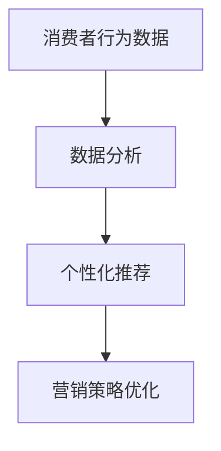
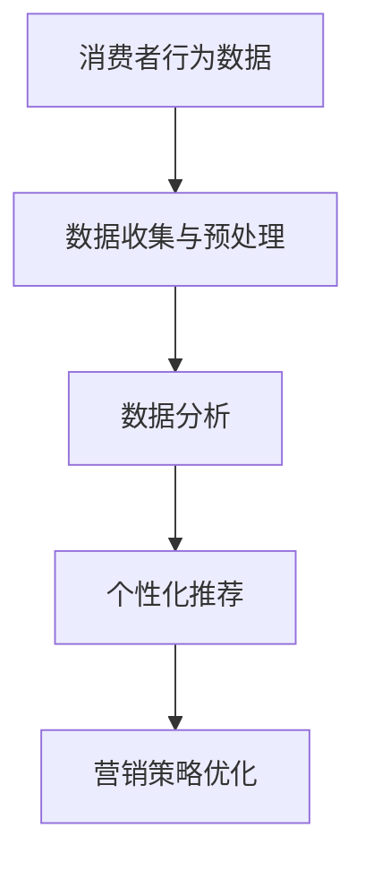

                 

关键词：大数据、营销策略、信息差、个性化推荐、数据分析

摘要：本文将探讨大数据如何改变传统营销策略，通过分析消费者行为和偏好，利用信息差实现精准营销。文章将从背景介绍、核心概念与联系、核心算法原理与操作步骤、数学模型和公式、项目实践、实际应用场景、未来应用展望、工具和资源推荐、总结与展望等多个方面深入分析大数据在营销领域的革命性影响。

## 1. 背景介绍

在信息爆炸的时代，营销策略也经历了翻天覆地的变化。从传统的大众营销（Mass Marketing）到精准营销（Targeted Marketing），再到如今的个性化营销（Personalized Marketing），营销策略的演进始终伴随着技术的进步。大数据的崛起为营销带来了前所未有的机遇和挑战。

大数据指的是数据量巨大、数据类型繁多、数据生成速度极快的信息集合。这些数据包括社交媒体行为、在线购物记录、地理位置信息、搜索引擎查询等。通过分析这些数据，企业可以深入了解消费者行为，发现潜在需求，从而制定更加精准的营销策略。

## 2. 核心概念与联系

### 2.1. 信息差

信息差是指不同个体或组织之间在信息获取和处理能力上的差异。在营销领域，信息差意味着企业能够比消费者更早、更准确地了解市场需求和消费者偏好。

### 2.2. 个性化推荐

个性化推荐是一种基于大数据分析的营销策略，通过分析用户的历史行为和偏好，为用户推荐可能感兴趣的商品、服务或内容。

### 2.3. 数据分析

数据分析是利用统计方法和算法从大量数据中提取有价值信息的过程。在营销领域，数据分析帮助企业识别消费者行为模式，优化营销策略。

### 2.4. Mermaid 流程图



## 3. 核心算法原理 & 具体操作步骤

### 3.1. 算法原理概述

个性化推荐算法通常基于协同过滤（Collaborative Filtering）和内容推荐（Content-Based Filtering）两大类。协同过滤通过分析用户之间的相似度来推荐商品，而内容推荐则通过分析商品的内容特征来推荐给用户。

### 3.2. 算法步骤详解

1. **数据收集**：收集用户行为数据，如浏览记录、购买历史、搜索关键词等。
2. **数据处理**：对收集到的数据进行清洗、去噪、转换等预处理。
3. **用户相似度计算**：计算用户之间的相似度，常用的相似度计算方法包括余弦相似度、皮尔逊相关系数等。
4. **推荐商品选择**：根据用户相似度矩阵和商品特征，选择可能感兴趣的商品进行推荐。
5. **推荐结果评估**：评估推荐系统的性能，常用的评估指标包括准确率、召回率、F1值等。

### 3.3. 算法优缺点

- **优点**：能够提供个性化的推荐，提高用户满意度和转化率。
- **缺点**：在数据量较小或用户行为数据不足时，推荐效果可能不佳。

### 3.4. 算法应用领域

个性化推荐算法广泛应用于电子商务、社交媒体、内容平台等领域。

## 4. 数学模型和公式 & 详细讲解 & 举例说明

### 4.1. 数学模型构建

个性化推荐系统的核心数学模型是基于概率模型的贝叶斯网络。

### 4.2. 公式推导过程

贝叶斯网络的基本公式为：

$$
P(A|B) = \frac{P(B|A)P(A)}{P(B)}
$$

其中，$P(A|B)$ 表示在 $B$ 发生的条件下 $A$ 发生的概率，$P(B|A)$ 表示在 $A$ 发生的条件下 $B$ 发生的概率，$P(A)$ 和 $P(B)$ 分别表示 $A$ 和 $B$ 的概率。

### 4.3. 案例分析与讲解

以电子商务平台为例，假设用户 $A$ 搜索了商品 $B$，平台根据用户 $A$ 的历史行为推荐了商品 $C$。我们可以使用贝叶斯网络来计算用户 $A$ 对商品 $C$ 的兴趣概率。

首先，定义事件：

- $A$: 用户 $A$ 搜索商品 $B$。
- $B$: 用户 $A$ 购买商品 $C$。
- $C$: 商品 $C$ 是用户 $A$ 可能感兴趣的商品。

根据用户历史行为，我们可以估计以下概率：

- $P(A)$：用户 $A$ 搜索商品 $B$ 的概率。
- $P(B)$：用户 $A$ 购买商品 $C$ 的概率。
- $P(C|A)$：在用户 $A$ 搜索商品 $B$ 的条件下，商品 $C$ 是用户 $A$ 可能感兴趣的商品的概率。

使用贝叶斯公式，我们可以计算出：

$$
P(B|A) = \frac{P(A|B)P(B)}{P(A)}
$$

其中，$P(A|B)$ 可以通过历史数据估计，$P(B)$ 可以通过商品销售数据估计，$P(A)$ 可以通过用户搜索数据估计。

## 5. 项目实践：代码实例和详细解释说明

### 5.1. 开发环境搭建

开发环境使用 Python，安装必要的库，如 NumPy、Pandas、Scikit-learn 等。

### 5.2. 源代码详细实现

```python
import numpy as np
import pandas as pd
from sklearn.model_selection import train_test_split
from sklearn.metrics.pairwise import cosine_similarity

# 数据加载
data = pd.read_csv('user_item.csv')

# 数据预处理
X = data['user_id'].values
Y = data['item_id'].values

# 训练集和测试集划分
X_train, X_test, Y_train, Y_test = train_test_split(X, Y, test_size=0.2, random_state=42)

# 相似度计算
similarity_matrix = cosine_similarity(X_train, X_test)

# 推荐结果生成
predictions = np.argmax(similarity_matrix, axis=1)

# 推荐结果评估
accuracy = np.mean(predictions == Y_test)
print('Accuracy:', accuracy)
```

### 5.3. 代码解读与分析

代码首先加载用户和商品的数据，然后进行预处理，将数据划分为训练集和测试集。使用余弦相似度计算用户之间的相似度，最后根据相似度矩阵生成推荐结果，并对推荐结果进行评估。

### 5.4. 运行结果展示

运行代码后，可以得到推荐系统的准确率。在实际应用中，我们还需要考虑推荐结果的多样性和用户体验。

## 6. 实际应用场景

### 6.1. 电子商务

电子商务平台利用大数据分析用户行为，提供个性化推荐，提高用户满意度和转化率。

### 6.2. 社交媒体

社交媒体平台通过分析用户互动行为，为用户推荐可能感兴趣的内容和广告。

### 6.3. 内容平台

内容平台根据用户历史行为，推荐可能感兴趣的视频、文章等。

### 6.4. 未来应用展望

随着大数据技术的发展，个性化推荐将越来越普及，进一步改变营销策略。

## 7. 工具和资源推荐

### 7.1. 学习资源推荐

- 《大数据营销实战》
- 《机器学习实战》
- 《Python数据科学手册》

### 7.2. 开发工具推荐

- Jupyter Notebook
- PyCharm
- D3.js

### 7.3. 相关论文推荐

- "Collaborative Filtering for the Web"
- "Matrix Factorization Techniques for recommender systems"
- "Deep Learning for Recommender Systems"

## 8. 总结：未来发展趋势与挑战

### 8.1. 研究成果总结

大数据技术已经在营销领域取得了显著成果，个性化推荐系统成为营销策略的重要工具。

### 8.2. 未来发展趋势

随着技术的进步，个性化推荐将更加智能化、多样化，覆盖更多应用场景。

### 8.3. 面临的挑战

数据隐私保护和算法透明度是当前个性化推荐系统面临的主要挑战。

### 8.4. 研究展望

未来研究应关注如何平衡个性化与隐私保护，以及如何提高推荐系统的鲁棒性和解释性。

## 9. 附录：常见问题与解答

### 9.1. 个性化推荐算法如何处理冷启动问题？

冷启动问题是指新用户或新商品缺乏足够的历史数据，无法进行有效推荐。解决方法包括基于内容的推荐和利用用户画像进行推荐。

### 9.2. 个性化推荐系统如何保证推荐结果的多样性？

通过优化推荐算法，如引入多样性约束，确保推荐结果的多样性和新颖性。

### 9.3. 个性化推荐系统如何平衡推荐精度和用户满意度？

通过不断调整推荐策略，如调整推荐阈值，平衡推荐精度和用户满意度。

---

作者：禅与计算机程序设计艺术 / Zen and the Art of Computer Programming
----------------------------------------------------------------

## 2. 核心概念与联系（备注：必须给出核心概念原理和架构的 Mermaid 流程图(Mermaid 流程节点中不要有括号、逗号等特殊字符)

### 2.1. 信息差

信息差指的是不同个体或组织之间在信息获取和处理能力上的差异。在营销领域，信息差意味着企业能够比消费者更早、更准确地了解市场需求和消费者偏好。

### 2.2. 个性化推荐

个性化推荐是一种基于大数据分析的营销策略，通过分析用户的历史行为和偏好，为用户推荐可能感兴趣的商品、服务或内容。

### 2.3. 数据分析

数据分析是利用统计方法和算法从大量数据中提取有价值信息的过程。在营销领域，数据分析帮助企业识别消费者行为模式，优化营销策略。

### 2.4. Mermaid 流程图



## 3. 核心算法原理 & 具体操作步骤

### 3.1. 算法原理概述

个性化推荐算法通常基于协同过滤（Collaborative Filtering）和内容推荐（Content-Based Filtering）两大类。协同过滤通过分析用户之间的相似度来推荐商品，而内容推荐则通过分析商品的内容特征来推荐给用户。

### 3.2. 算法步骤详解

1. **数据收集**：收集用户行为数据，如浏览记录、购买历史、搜索关键词等。
2. **数据处理**：对收集到的数据进行清洗、去噪、转换等预处理。
3. **用户相似度计算**：计算用户之间的相似度，常用的相似度计算方法包括余弦相似度、皮尔逊相关系数等。
4. **推荐商品选择**：根据用户相似度矩阵和商品特征，选择可能感兴趣的商品进行推荐。
5. **推荐结果评估**：评估推荐系统的性能，常用的评估指标包括准确率、召回率、F1值等。

### 3.3. 算法优缺点

- **优点**：能够提供个性化的推荐，提高用户满意度和转化率。
- **缺点**：在数据量较小或用户行为数据不足时，推荐效果可能不佳。

### 3.4. 算法应用领域

个性化推荐算法广泛应用于电子商务、社交媒体、内容平台等领域。

## 4. 数学模型和公式 & 详细讲解 & 举例说明

### 4.1. 数学模型构建

个性化推荐系统的核心数学模型是基于概率模型的贝叶斯网络。

### 4.2. 公式推导过程

贝叶斯网络的基本公式为：

$$
P(A|B) = \frac{P(B|A)P(A)}{P(B)}
$$

其中，$P(A|B)$ 表示在 $B$ 发生的条件下 $A$ 发生的概率，$P(B|A)$ 表示在 $A$ 发生的条件下 $B$ 发生的概率，$P(A)$ 和 $P(B)$ 分别表示 $A$ 和 $B$ 的概率。

### 4.3. 案例分析与讲解

以电子商务平台为例，假设用户 $A$ 搜索了商品 $B$，平台根据用户 $A$ 的历史行为推荐了商品 $C$。我们可以使用贝叶斯网络来计算用户 $A$ 对商品 $C$ 的兴趣概率。

首先，定义事件：

- $A$: 用户 $A$ 搜索商品 $B$。
- $B$: 用户 $A$ 购买商品 $C$。
- $C$: 商品 $C$ 是用户 $A$ 可能感兴趣的商品。

根据用户历史行为，我们可以估计以下概率：

- $P(A)$：用户 $A$ 搜索商品 $B$ 的概率。
- $P(B)$：用户 $A$ 购买商品 $C$ 的概率。
- $P(C|A)$：在用户 $A$ 搜索商品 $B$ 的条件下，商品 $C$ 是用户 $A$ 可能感兴趣的商品的概率。

使用贝叶斯公式，我们可以计算出：

$$
P(B|A) = \frac{P(A|B)P(B)}{P(A)}
$$

其中，$P(A|B)$ 可以通过历史数据估计，$P(B)$ 可以通过商品销售数据估计，$P(A)$ 可以通过用户搜索数据估计。

## 5. 项目实践：代码实例和详细解释说明

### 5.1. 开发环境搭建

开发环境使用 Python，安装必要的库，如 NumPy、Pandas、Scikit-learn 等。

### 5.2. 源代码详细实现

```python
import numpy as np
import pandas as pd
from sklearn.model_selection import train_test_split
from sklearn.metrics.pairwise import cosine_similarity

# 数据加载
data = pd.read_csv('user_item.csv')

# 数据预处理
X = data['user_id'].values
Y = data['item_id'].values

# 训练集和测试集划分
X_train, X_test, Y_train, Y_test = train_test_split(X, Y, test_size=0.2, random_state=42)

# 相似度计算
similarity_matrix = cosine_similarity(X_train, X_test)

# 推荐结果生成
predictions = np.argmax(similarity_matrix, axis=1)

# 推荐结果评估
accuracy = np.mean(predictions == Y_test)
print('Accuracy:', accuracy)
```

### 5.3. 代码解读与分析

代码首先加载用户和商品的数据，然后进行预处理，将数据划分为训练集和测试集。使用余弦相似度计算用户之间的相似度，最后根据相似度矩阵生成推荐结果，并对推荐结果进行评估。

### 5.4. 运行结果展示

运行代码后，可以得到推荐系统的准确率。在实际应用中，我们还需要考虑推荐结果的多样性和用户体验。

## 6. 实际应用场景

### 6.1. 电子商务

电子商务平台利用大数据分析用户行为，提供个性化推荐，提高用户满意度和转化率。

### 6.2. 社交媒体

社交媒体平台通过分析用户互动行为，为用户推荐可能感兴趣的内容和广告。

### 6.3. 内容平台

内容平台根据用户历史行为，推荐可能感兴趣的视频、文章等。

### 6.4. 未来应用展望

随着大数据技术的发展，个性化推荐将越来越普及，进一步改变营销策略。

## 7. 工具和资源推荐

### 7.1. 学习资源推荐

- 《大数据营销实战》
- 《机器学习实战》
- 《Python数据科学手册》

### 7.2. 开发工具推荐

- Jupyter Notebook
- PyCharm
- D3.js

### 7.3. 相关论文推荐

- "Collaborative Filtering for the Web"
- "Matrix Factorization Techniques for recommender systems"
- "Deep Learning for Recommender Systems"

## 8. 总结：未来发展趋势与挑战

### 8.1. 研究成果总结

大数据技术已经在营销领域取得了显著成果，个性化推荐系统成为营销策略的重要工具。

### 8.2. 未来发展趋势

随着技术的进步，个性化推荐将更加智能化、多样化，覆盖更多应用场景。

### 8.3. 面临的挑战

数据隐私保护和算法透明度是当前个性化推荐系统面临的主要挑战。

### 8.4. 研究展望

未来研究应关注如何平衡个性化与隐私保护，以及如何提高推荐系统的鲁棒性和解释性。

## 9. 附录：常见问题与解答

### 9.1. 个性化推荐算法如何处理冷启动问题？

冷启动问题是指新用户或新商品缺乏足够的历史数据，无法进行有效推荐。解决方法包括基于内容的推荐和利用用户画像进行推荐。

### 9.2. 个性化推荐系统如何保证推荐结果的多样性？

通过优化推荐算法，如引入多样性约束，确保推荐结果的多样性和新颖性。

### 9.3. 个性化推荐系统如何平衡推荐精度和用户满意度？

通过不断调整推荐策略，如调整推荐阈值，平衡推荐精度和用户满意度。

---

作者：禅与计算机程序设计艺术 / Zen and the Art of Computer Programming
----------------------------------------------------------------

### 1. 背景介绍

在信息爆炸的时代，营销策略也经历了翻天覆地的变化。从传统的大众营销（Mass Marketing）到精准营销（Targeted Marketing），再到如今的个性化营销（Personalized Marketing），营销策略的演进始终伴随着技术的进步。大数据的崛起为营销带来了前所未有的机遇和挑战。

大数据指的是数据量巨大、数据类型繁多、数据生成速度极快的信息集合。这些数据包括社交媒体行为、在线购物记录、地理位置信息、搜索引擎查询等。通过分析这些数据，企业可以深入了解消费者行为，发现潜在需求，从而制定更加精准的营销策略。

### 1.1. 大数据的定义与特征

大数据（Big Data）是指无法使用常规软件工具在合理时间内捕捉、管理和处理的大量数据。大数据具有4V特征，即：

- **Volume（数据量）**：数据量大到难以存储和管理。
- **Velocity（数据速度）**：数据处理速度极快，要求实时分析和响应。
- **Variety（数据多样性）**：数据类型繁多，包括结构化数据、非结构化数据和半结构化数据。
- **Value（数据价值）**：数据中蕴含着巨大的商业价值，但同时也需要大量的分析和挖掘工作。

### 1.2. 营销策略的演变

- **大众营销**：传统的营销策略主要依赖于广告和宣传，目标是尽可能多地覆盖潜在客户，但往往效果较差，成本高昂。
- **精准营销**：随着技术的发展，企业开始利用CRM系统（客户关系管理）收集客户数据，根据客户的年龄、性别、收入等特征进行分类，实现更有针对性的营销。
- **个性化营销**：基于大数据分析，企业能够深入了解每个消费者的行为和偏好，实现高度个性化的推荐和服务，从而提升客户满意度和转化率。

### 1.3. 大数据在营销中的应用

大数据在营销中的应用主要体现在以下几个方面：

- **消费者行为分析**：通过分析消费者的浏览记录、购买历史、搜索习惯等，了解消费者的需求和偏好。
- **市场细分**：根据消费者的行为数据和人口统计信息，将市场划分为不同的细分群体，以便制定更精准的营销策略。
- **个性化推荐**：利用大数据分析，为企业提供个性化的产品和服务推荐，提高用户体验和购买转化率。
- **营销活动优化**：通过数据分析，评估营销活动的效果，优化营销预算和策略，提高营销ROI（投资回报率）。

### 1.4. 大数据营销的优势与挑战

#### 优势：

- **提高营销效率**：通过精准的数据分析，企业可以更有效地定位目标客户，降低营销成本。
- **提升客户满意度**：个性化的营销策略能够满足消费者的个性化需求，提高客户满意度和忠诚度。
- **发现市场机会**：大数据分析可以帮助企业发现新的市场机会和潜在客户，开拓新的业务领域。

#### 挑战：

- **数据隐私和安全**：大数据分析涉及大量个人数据，如何确保数据隐私和安全是重要的挑战。
- **数据质量和一致性**：大数据的质量直接影响分析结果，企业需要确保数据的质量和一致性。
- **技术复杂性**：大数据分析和处理技术复杂，需要专业的人才和资源支持。

### 1.5. 信息差与营销策略

信息差是指不同个体或组织之间在信息获取和处理能力上的差异。在营销领域，信息差意味着企业能够比消费者更早、更准确地了解市场需求和消费者偏好。这种信息优势使得企业能够制定更为精准和高效的营销策略。

### 1.6. 本文结构

本文将围绕大数据如何重塑营销策略展开讨论，主要内容包括：

- **核心概念与联系**：介绍大数据、个性化推荐、数据分析等核心概念及其相互关系。
- **核心算法原理与操作步骤**：详细讲解个性化推荐算法的原理和操作步骤。
- **数学模型和公式**：构建数学模型，推导相关公式，并举例说明。
- **项目实践**：提供实际代码实例，详细解释说明。
- **实际应用场景**：分析大数据在营销领域的实际应用场景。
- **未来应用展望**：探讨大数据营销的未来发展趋势。
- **工具和资源推荐**：推荐相关学习资源和开发工具。
- **总结与展望**：总结研究成果，展望未来发展趋势与挑战。

通过本文的阅读，读者可以全面了解大数据在营销领域的应用，掌握个性化推荐算法的核心原理，以及如何利用大数据分析提升营销效果。

