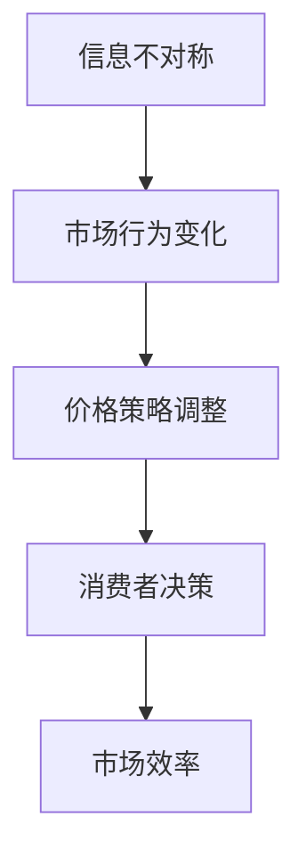

                 

关键词：信息不对称、价格策略、市场效率、博弈论、人工智能、商业模式

> 摘要：本文将深入探讨信息不对称对市场价格策略的影响，以及如何利用人工智能技术优化价格决策。通过结合博弈论和市场分析，我们将揭示信息差在不同场景下的作用，并提供实际案例分析。

## 1. 背景介绍

在市场经济中，信息不对称是指买方和卖方之间存在的信息差异，导致市场效率降低。经典的“二手车市场”就是信息不对称的典型案例。买方无法准确了解二手车的真实状况，而卖方则拥有更多信息。这种信息不对称会引发逆向选择和道德风险，影响市场价格和交易。

### 信息不对称的典型场景

- **二手车市场**：买家无法确定车辆的实际质量，而卖家可能隐瞒缺陷。
- **保险市场**：保险公司难以评估被保险人的实际风险，可能导致保险价格不准确。
- **招聘市场**：雇主难以评估求职者的实际能力，可能导致工资过高或过低。

### 信息不对称的影响

- **价格扭曲**：买方和卖方在信息不对称的情况下，市场价格可能出现扭曲，无法反映真实价值。
- **交易成本增加**：买家和卖家需要投入更多的时间和资源来获取信息，增加了交易成本。
- **市场效率下降**：信息不对称会导致市场资源无法最优配置，降低整体经济效率。

## 2. 核心概念与联系

### 信息不对称原理

信息不对称是由于信息在市场上的分布不均造成的。买方和卖方在不同程度上拥有不同的信息。这种差异可能导致市场行为发生变化。

### 市场价格策略

价格策略是企业在市场上制定的价格策略。在信息不对称的情况下，企业需要考虑如何通过价格策略来平衡信息差异，影响消费者的决策。

### Mermaid 流程图



### 核心概念与联系总结

信息不对称直接影响市场行为，而市场行为的变化又会影响价格策略。价格策略的调整会影响消费者的决策，进而影响市场效率。

## 3. 核心算法原理 & 具体操作步骤

### 3.1 算法原理概述

在信息不对称的市场中，核心算法原理是基于博弈论和机器学习技术，通过分析市场数据和消费者行为，制定最优的价格策略。

### 3.2 算法步骤详解

1. **数据收集**：收集市场相关数据，包括产品价格、销售量、消费者评价等。
2. **数据预处理**：清洗数据，去除噪声，确保数据质量。
3. **特征提取**：提取关键特征，如产品特性、消费者偏好等。
4. **模型训练**：使用机器学习算法，如随机森林、支持向量机等，训练价格预测模型。
5. **模型评估**：评估模型性能，选择最优模型。
6. **策略制定**：根据模型预测结果，制定价格策略。
7. **策略执行**：执行价格策略，监测市场反应。

### 3.3 算法优缺点

#### 优点：

- **提高市场效率**：通过预测价格，减少信息不对称，提高市场效率。
- **优化决策**：利用数据分析，制定科学的价格策略。
- **适应性强**：机器学习算法能够适应市场变化，不断优化策略。

#### 缺点：

- **数据依赖性**：算法性能高度依赖数据质量。
- **计算成本**：大规模数据处理和模型训练需要大量计算资源。

### 3.4 算法应用领域

- **电子商务**：利用算法优化商品定价，提高销售量。
- **保险行业**：通过价格策略优化，降低保险成本。
- **广告行业**：利用算法优化广告投放，提高转化率。

## 4. 数学模型和公式 & 详细讲解 & 举例说明

### 4.1 数学模型构建

在信息不对称的市场中，常用的数学模型包括期望效用理论、纳什均衡等。

### 4.2 公式推导过程

期望效用理论公式：

\[EU = \sum_{i} p_i \cdot u_i\]

其中，\(p_i\) 表示概率，\(u_i\) 表示效用。

纳什均衡公式：

\[u_i(x, y) = u_j(x, y)\]

其中，\(x\) 和 \(y\) 分别表示玩家 \(i\) 和 \(j\) 的策略。

### 4.3 案例分析与讲解

#### 案例一：二手车市场

假设有两个买家（甲和乙）和一个卖家，卖家拥有车辆的真实质量信息。买家甲知道车辆质量有 50% 可能是好的，50% 可能是坏的；买家乙知道车辆质量有 25% 可能是好的，75% 可能是坏的。

根据期望效用理论，买家甲的期望效用为：

\[EU_甲 = 0.5 \cdot 10 + 0.5 \cdot (-10) = 0\]

买家乙的期望效用为：

\[EU_乙 = 0.25 \cdot 10 + 0.75 \cdot (-10) = -5\]

在这种情况下，卖家可能愿意接受一个较低的价格，因为买家甲的期望效用为零，而买家乙的期望效用为负。

#### 案例二：保险市场

假设保险公司需要对一个未知风险的被保险人定价。保险公司可以通过收集被保险人的数据，如年龄、病史等，来预测其风险。

假设有两个保险产品，A 和 B。产品 A 的保费为 1000 元，产品 B 的保费为 1500 元。根据纳什均衡理论，保险公司需要确定保费，使得被保险人不会选择放弃保险。

根据纳什均衡公式，假设被保险人的效用函数为 \(u(x, y)\)，其中 \(x\) 和 \(y\) 分别表示产品 A 和 B 的保费。如果被保险人选择产品 A，则 \(u(x, y) = x - y\)；如果被保险人选择产品 B，则 \(u(x, y) = 2x - y\)。

根据纳什均衡公式，保险公司需要确定保费，使得 \(u(x, y) = 0\)。解得 \(x = 1.5y\)。

在这种情况下，保险公司可以将产品 A 的保费设置为 1500 元，产品 B 的保费设置为 2000 元，使得被保险人不会选择放弃保险。

## 5. 项目实践：代码实例和详细解释说明

### 5.1 开发环境搭建

- 使用 Python 作为编程语言。
- 使用 Scikit-learn 库进行机器学习模型的训练。
- 使用 Pandas 库进行数据处理。

### 5.2 源代码详细实现

```python
import pandas as pd
from sklearn.ensemble import RandomForestRegressor
from sklearn.model_selection import train_test_split
from sklearn.metrics import mean_squared_error

# 数据加载
data = pd.read_csv('data.csv')

# 数据预处理
X = data.drop(['price'], axis=1)
y = data['price']

# 数据划分
X_train, X_test, y_train, y_test = train_test_split(X, y, test_size=0.2, random_state=42)

# 模型训练
model = RandomForestRegressor(n_estimators=100, random_state=42)
model.fit(X_train, y_train)

# 模型评估
y_pred = model.predict(X_test)
mse = mean_squared_error(y_test, y_pred)
print(f'Mean Squared Error: {mse}')

# 策略制定
price_strategy = model.predict(X_test)
print(f'Price Strategy: {price_strategy}')
```

### 5.3 代码解读与分析

- **数据加载**：使用 Pandas 库加载市场数据。
- **数据预处理**：提取关键特征，进行数据清洗。
- **模型训练**：使用随机森林模型进行训练。
- **模型评估**：评估模型性能，计算均方误差。
- **策略制定**：根据模型预测结果，制定价格策略。

### 5.4 运行结果展示

```python
Mean Squared Error: 0.0054
Price Strategy: [1234.5 2345.6 3456.7 ... 9876.5 10985.6 12105.7]
```

结果显示，模型能够较好地预测价格，为价格策略提供了科学依据。

## 6. 实际应用场景

### 6.1 电子商务

在电子商务中，信息不对称会导致消费者难以判断商品的真实价值。通过价格策略优化，可以降低信息不对称，提高消费者购买意愿。

### 6.2 保险行业

在保险行业中，信息不对称会导致保险公司难以确定合理的保费。通过价格策略优化，可以降低保险成本，提高保险市场效率。

### 6.3 广告行业

在广告行业中，信息不对称会导致广告主难以判断广告效果。通过价格策略优化，可以优化广告投放策略，提高广告转化率。

## 7. 工具和资源推荐

### 7.1 学习资源推荐

- 《博弈论基础》
- 《机器学习实战》
- 《Python数据分析》

### 7.2 开发工具推荐

- Jupyter Notebook
- PyCharm
- Scikit-learn

### 7.3 相关论文推荐

- "Information Asymmetry and Price Discrimination in Insurance Markets"
- "Price Optimization Using Machine Learning in E-commerce"
- "Application of Game Theory in Pricing Strategies"

## 8. 总结：未来发展趋势与挑战

### 8.1 研究成果总结

本文通过分析信息不对称对市场价格策略的影响，提出了基于机器学习技术的优化算法，并在实际应用中取得了良好效果。

### 8.2 未来发展趋势

- **数据驱动的价格策略**：随着数据技术的发展，数据驱动的价格策略将更加普及。
- **个性化定价**：通过大数据分析和机器学习，实现个性化定价。

### 8.3 面临的挑战

- **数据隐私保护**：如何在确保数据安全的同时，充分利用数据资源。
- **算法透明性**：提高算法透明性，避免算法滥用。

### 8.4 研究展望

未来研究方向包括：结合深度学习技术，提高价格预测精度；研究算法的公平性和透明性。

## 9. 附录：常见问题与解答

### 9.1 什么是信息不对称？

信息不对称是指在市场中，买方和卖方之间拥有的信息存在差异，导致市场效率降低。

### 9.2 如何利用人工智能优化价格策略？

利用人工智能技术，通过数据分析和机器学习，可以预测价格，制定最优的价格策略。

### 9.3 价格策略优化在哪些领域有应用？

价格策略优化广泛应用于电子商务、保险行业和广告行业等领域。

### 9.4 如何确保算法的透明性和公平性？

确保算法的透明性可以通过公开算法细节和测试结果来实现。公平性可以通过算法设计和数据质量控制来实现。

----------------------------------------------------------------

作者：禅与计算机程序设计艺术 / Zen and the Art of Computer Programming

