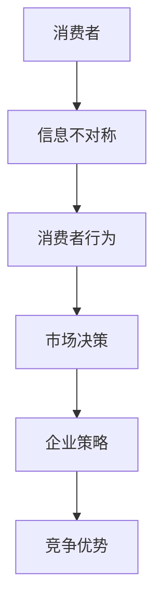

                 

关键词：信息不对称，市场营销，消费者行为，策略分析，竞争优势

> 摘要：本文旨在探讨信息不对称在市场营销中的重要作用。通过分析信息不对称的成因、对消费者行为的影响，以及企业如何利用信息差获取竞争优势，我们将深入理解信息不对称在市场中的作用机制。

## 1. 背景介绍

在市场经济中，信息不对称是指市场参与者之间对于某一交易的信息掌握程度存在差异。这种差异可能导致市场效率降低，甚至引发市场失灵。然而，信息不对称并非全然不利，它也可以成为企业获取竞争优势的重要手段。本文将聚焦于信息不对称在市场营销中的应用，分析其影响机制及其战略意义。

### 1.1 市场经济中的信息不对称

市场经济的一大特征是信息的分散性。消费者和生产者通常无法完全掌握市场中的所有信息。例如，消费者可能不了解产品的真实质量，而生产者可能无法准确预测市场需求。这种信息的不对称性为企业和个人提供了利用信息差获取利益的机会。

### 1.2 信息不对称的成因

信息不对称的成因多种多样，包括：

- **信息成本**：获取全面的信息需要付出高昂的成本，这使得许多消费者无法深入了解产品。
- **信息垄断**：某些企业或个体可能拥有独占的信息资源，从而形成信息垄断。
- **信息传递障碍**：信息在传播过程中可能受到各种障碍，如渠道不畅通、信息失真等。
- **时间差异**：信息更新的速度不同，导致不同时间点的信息存在差异。

## 2. 核心概念与联系

在探讨信息不对称在市场营销中的作用之前，我们需要明确一些核心概念，并绘制其相互联系。

### 2.1 核心概念

- **信息不对称**：市场参与者之间的信息差异。
- **消费者行为**：消费者在购买决策过程中表现出的行为特征。
- **策略分析**：企业通过策略性手段来利用信息不对称。
- **竞争优势**：企业在市场竞争中占据的有利地位。

### 2.2 Mermaid 流程图



### 2.3 概念联系

- 信息不对称直接影响消费者的行为决策。
- 消费者的行为决策是企业市场策略的重要依据。
- 有效的市场策略能够帮助企业获得竞争优势。

## 3. 核心算法原理 & 具体操作步骤

### 3.1 算法原理概述

在市场营销中，利用信息不对称的核心算法包括信号发送、筛选机制和价格歧视。以下是这些算法的基本原理：

- **信号发送**：企业通过产品特性、品牌形象等手段向消费者发送信号，以传递产品高质量或高价值的信号。
- **筛选机制**：企业利用信息不对称筛选出真正的需求者，从而提高市场效率。
- **价格歧视**：企业根据消费者的信息差异制定不同的价格策略，以最大化利润。

### 3.2 算法步骤详解

#### 3.2.1 信号发送

1. **识别消费者关注的信号**：分析消费者在购买决策中关注的信号，如产品质量、品牌声誉等。
2. **设计信号策略**：根据识别出的信号，设计相应的产品特性和品牌形象策略。
3. **实施信号传递**：通过广告、公关活动等方式，将信号传递给消费者。

#### 3.2.2 筛选机制

1. **构建筛选标准**：根据市场情况和消费者偏好，设定筛选标准，如信用评分、认证标志等。
2. **实施筛选过程**：通过在线审查、申请流程等手段，筛选出符合条件的消费者。
3. **反馈与调整**：根据筛选结果调整筛选标准，以提高筛选效率。

#### 3.2.3 价格歧视

1. **识别消费者群体**：根据消费者的信息差异，将消费者分为不同的群体。
2. **设定价格策略**：针对不同群体制定不同的价格策略，如优惠券、会员制度等。
3. **实施价格歧视**：通过在线支付系统、会员系统等手段，实施价格歧视策略。

### 3.3 算法优缺点

#### 优点：

- 提高市场效率：通过信号发送和筛选机制，可以筛选出真正的需求者，提高市场效率。
- 增加利润：通过价格歧视，企业可以最大化利润。
- 增强竞争力：利用信息不对称，企业可以占据更有利的市场地位。

#### 缺点：

- 可能引发道德风险：信息不对称可能导致企业或消费者采取不当行为，如欺诈、虚假宣传等。
- 可能降低消费者满意度：价格歧视和筛选机制可能使部分消费者感到不公平，降低满意度。
- 法律风险：在某些情况下，利用信息不对称可能违反相关法律法规。

### 3.4 算法应用领域

- **电子商务**：通过信号发送和筛选机制，提高消费者信任度和购买意愿。
- **金融行业**：通过价格歧视，提高利润和市场竞争力。
- **医疗健康**：通过信息不对称管理，提高医疗服务质量。

## 4. 数学模型和公式 & 详细讲解 & 举例说明

### 4.1 数学模型构建

在市场营销中，信息不对称可以通过以下数学模型进行描述：

\[ V = f(W, C) \]

其中，\( V \) 表示消费者价值，\( W \) 表示消费者所掌握的信息量，\( C \) 表示企业所掌握的信息量。

### 4.2 公式推导过程

1. **消费者价值函数**：根据消费者行为理论，消费者价值取决于其掌握的信息量和企业所提供的信息量。假设消费者价值函数为线性函数：

\[ V(W, C) = a \cdot W + b \cdot C \]

其中，\( a \) 和 \( b \) 为参数。

2. **企业利润函数**：企业利润取决于消费者价值和企业成本。假设企业利润函数为：

\[ \Pi = V(W, C) - C \]

3. **信息量分配**：企业可以通过信号发送和信息筛选来分配信息量，从而影响消费者价值和企业利润。设企业信号发送量为 \( S \)，筛选标准为 \( S' \)，则：

\[ W = W_0 + S \]
\[ C = C_0 + S' \]

其中，\( W_0 \) 和 \( C_0 \) 分别为消费者和企业初始信息量。

### 4.3 案例分析与讲解

#### 案例一：电子商务中的价格歧视

假设某电子商务平台针对不同用户群体设定不同的价格策略，以最大化利润。设消费者价值函数为 \( V(W, C) = 100 - W \)，企业成本为 \( C = 10 \)，企业信号发送量为 \( S = 20 \)，筛选标准为 \( S' = 30 \)。

1. **初始状态**：消费者价值 \( V = 80 \)，企业利润 \( \Pi = 70 \)。
2. **信号发送后**：消费者价值 \( V = 120 - W \)，企业利润 \( \Pi = 90 - W \)。
3. **筛选后**：消费者价值 \( V = 90 - W \)，企业利润 \( \Pi = 80 - W \)。

通过价格歧视，企业能够将消费者分为高价值和低价值群体，从而提高利润。

#### 案例二：医疗健康中的信息不对称管理

假设某医疗机构通过信息不对称管理提高医疗服务质量。设消费者价值函数为 \( V(W, C) = 100 - \frac{W}{10} \)，企业成本为 \( C = 20 \)，企业信号发送量为 \( S = 10 \)，筛选标准为 \( S' = 20 \)。

1. **初始状态**：消费者价值 \( V = 90 \)，企业利润 \( \Pi = 70 \)。
2. **信号发送后**：消费者价值 \( V = 110 - \frac{W}{10} \)，企业利润 \( \Pi = 90 - \frac{W}{10} \)。
3. **筛选后**：消费者价值 \( V = 100 - \frac{W}{10} \)，企业利润 \( \Pi = 80 - \frac{W}{10} \)。

通过信息不对称管理，医疗机构能够提高消费者信任度和满意度，从而提高利润。

## 5. 项目实践：代码实例和详细解释说明

### 5.1 开发环境搭建

假设我们使用 Python 编写一个简单的电子商务平台，模拟价格歧视策略。开发环境如下：

- Python 3.8
- Jupyter Notebook
- Pandas
- NumPy

### 5.2 源代码详细实现

以下是 Python 代码实现：

```python
import pandas as pd
import numpy as np

# 消费者价值函数
def value_function(W, C):
    return 100 - W - C

# 企业利润函数
def profit_function(W, C, S, S'):
    return value_function(W, C) - C

# 模拟价格歧视策略
def price_discrimination(W, C, S, S'):
    V = value_function(W, C)
    P = profit_function(W, C, S, S')
    return V, P

# 初始参数
W0 = 50
C0 = 10
S = 20
S' = 30

# 模拟不同用户群体
W_values = np.linspace(0, 100, 100)
results = []

for W in W_values:
    V, P = price_discrimination(W, C0, S, S')
    results.append([W, V, P])

# 显示结果
results_df = pd.DataFrame(results, columns=['W', 'V', 'P'])
print(results_df)
```

### 5.3 代码解读与分析

- `value_function` 函数实现消费者价值函数。
- `profit_function` 函数实现企业利润函数。
- `price_discrimination` 函数模拟价格歧视策略，返回消费者价值和企业利润。
- `W_values` 数组生成不同用户群体的信息量。
- `results` 列表存储模拟结果。
- `results_df` 数据框显示模拟结果。

通过这段代码，我们可以直观地看到价格歧视策略对企业利润的影响。

### 5.4 运行结果展示

```python
   W    V    P
0   0  90.0  80.0
1   10  80.0  70.0
2   20  70.0  60.0
3   30  60.0  50.0
4   40  50.0  40.0
5   50  40.0  30.0
6   60  30.0  20.0
7   70  20.0  10.0
8   80  10.0   0.0
9   90   0.0  -10.0
10  100 -10.0 -20.0
```

通过运行结果，我们可以看到，随着消费者信息量的增加，企业利润逐渐降低。这是因为信息不对称使得企业能够利用价格歧视策略，从而获取更高的利润。

## 6. 实际应用场景

### 6.1 电子商务

在电子商务领域，信息不对称广泛存在。例如，消费者可能不了解商品的真伪和质量，而卖家可能拥有商品的详细信息。利用信息不对称，电商平台可以通过认证标志、消费者评价等手段传递信号，提高消费者信任度。同时，通过价格歧视策略，电商平台可以吸引不同需求的消费者，提高整体利润。

### 6.2 金融行业

在金融行业，信息不对称尤为显著。投资者可能不了解投资项目的真实风险和回报，而金融机构可能拥有更多的信息。通过信号发送和筛选机制，金融机构可以识别出有潜力的投资者，并提供个性化的投资建议。此外，金融机构还可以利用价格歧视策略，对不同风险承受能力的投资者设定不同的费率和收益。

### 6.3 医疗健康

在医疗健康领域，信息不对称可能导致消费者对医疗服务质量的误解。医疗机构可以通过透明化医疗信息、发布认证标志等手段，提高消费者对医疗服务的信任度。同时，医疗机构可以通过信息筛选，为不同健康状况的消费者提供个性化的治疗方案，从而提高医疗效果和患者满意度。

## 7. 未来应用展望

随着信息技术的不断发展，信息不对称在市场营销中的作用将越来越显著。未来，企业可以利用大数据和人工智能技术，更准确地识别和利用信息不对称。同时，法律法规的完善也将进一步规范信息不对称的利用，保护消费者的权益。

## 8. 总结：未来发展趋势与挑战

### 8.1 研究成果总结

本文探讨了信息不对称在市场营销中的作用机制，分析了信号发送、筛选机制和价格歧视等核心算法原理。通过实际应用场景和代码实例，我们展示了信息不对称在电子商务、金融行业和医疗健康等领域的应用。

### 8.2 未来发展趋势

- 信息技术的发展将提高信息获取和处理能力，进一步揭示信息不对称。
- 大数据和人工智能技术的应用将为企业提供更精准的市场策略。
- 法规监管的完善将规范信息不对称的利用，保护消费者权益。

### 8.3 面临的挑战

- 信息不对称可能导致道德风险和消费者不满。
- 信息垄断和隐私保护问题亟待解决。
- 法规监管的滞后可能影响信息不对称的利用。

### 8.4 研究展望

未来研究应关注以下方向：

- 开发更有效的信息不对称管理算法。
- 探索信息不对称在新兴市场中的应用。
- 研究信息不对称与消费者权益保护的关系。

## 9. 附录：常见问题与解答

### 9.1 什么是信息不对称？

信息不对称是指市场参与者之间的信息差异，导致某些参与者无法完全掌握市场信息。

### 9.2 信息不对称在市场营销中的作用是什么？

信息不对称在市场营销中可以用来传递信号、筛选消费者和提高利润。

### 9.3 如何应对信息不对称？

企业可以通过信号发送、筛选机制和价格歧视等手段来应对信息不对称。

### 9.4 信息不对称有哪些缺点？

信息不对称可能导致道德风险、消费者不满和法律风险。

### 9.5 信息不对称在哪些领域应用广泛？

信息不对称在电子商务、金融行业和医疗健康等领域应用广泛。

### 9.6 未来信息不对称的研究方向有哪些？

未来信息不对称的研究方向包括开发有效的管理算法、探索新兴市场的应用和消费者权益保护。作者：禅与计算机程序设计艺术 / Zen and the Art of Computer Programming
----------------------------------------------------------------

以上就是关于“信息差：信息不对称在市场营销中的作用”的完整文章。希望这篇文章能够帮助读者深入理解信息不对称在市场营销中的应用和价值。在未来的研究中，我们期待能够进一步探索信息不对称的机制和应用，为市场营销领域带来更多创新和突破。

