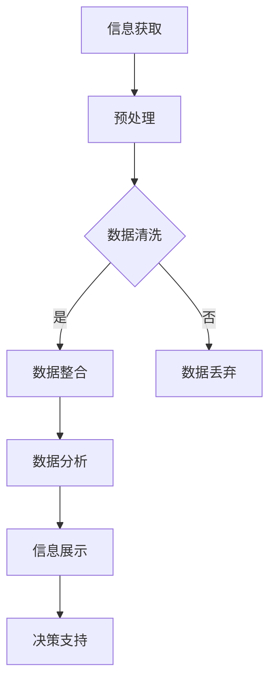

                 

在当今这个信息爆炸的时代，我们每个人都被大量的数据和信息所包围。从社交媒体的更新到电子邮件的涌入，从行业报告到个人通讯，信息已经成为了我们生活中不可或缺的一部分。然而，这也带来了一系列的挑战，特别是信息过载和复杂性。如何有效地管理这些信息，以确保我们能够从中获益，而不是被其淹没，成为了一个亟需解决的问题。本文旨在探讨信息时代的信息管理策略，帮助我们在信息过载和复杂性中航行。

## 关键词 Keywords

- 信息管理
- 信息过载
- 复杂性
- 数据处理
- 信息优化
- 技术工具

## 摘要 Abstract

本文首先概述了信息时代的背景和挑战，包括信息过载和复杂性的问题。接着，讨论了信息管理的重要性，并提出了一系列策略，包括数据处理、分类、过滤和自动化工具的使用。文章还介绍了数学模型在信息管理中的应用，并通过一个实际的项目实践案例，展示了这些策略的具体应用。最后，讨论了未来信息管理的发展趋势和面临的挑战，并提出了相关的学习资源和开发工具推荐。

## 1. 背景介绍 Background

### 1.1 信息爆炸的时代

随着互联网的普及和移动设备的普及，信息的传播速度和范围前所未有。我们每天都会接触到大量的信息，这些信息以各种形式存在，包括文本、图像、音频和视频。这种信息爆炸式增长给我们带来了极大的便利，但同时也增加了信息管理的复杂性。

### 1.2 信息过载的问题

信息过载是指在一段时间内接收到的信息量超出了个体的处理能力。这可能导致我们无法有效地处理和利用这些信息，甚至会产生焦虑和压力。信息过载的原因包括信息的多样性、速度和数量。

### 1.3 复杂性的挑战

除了信息过载，信息的复杂性也是一个巨大的挑战。随着信息的日益复杂，理解和分析这些信息变得更加困难。复杂性可能源于信息的深度、跨学科的特性以及信息的相互关联性。

## 2. 核心概念与联系 Core Concepts and Connections

### 2.1 信息管理的定义

信息管理是指对信息进行组织、分类、存储、检索和处理的过程，旨在提高信息的可用性和可靠性，并降低其复杂性。

### 2.2 数据处理的概念

数据处理是指通过一系列操作，将原始数据转换为有用的信息的过程。这些操作包括清洗、转换、整合和分析。

### 2.3 信息过滤与分类

信息过滤是指通过特定的算法或规则，从大量的信息中筛选出对个体有用的信息。分类则是将信息按照特定的标准进行归类，以方便检索和使用。

### 2.4 自动化工具的应用

自动化工具可以显著提高信息管理的效率。这些工具包括自动化邮件处理、自动化文档分类和自动化数据分析等。

### 2.5 Mermaid 流程图

以下是一个描述信息管理流程的 Mermaid 流程图：



## 3. 核心算法原理 & 具体操作步骤 Core Algorithm Principles & Operational Steps

### 3.1 算法原理概述

在信息管理中，常用的算法包括数据处理算法、信息过滤算法和分类算法。这些算法的基本原理是通过对数据的操作，使其从无序变为有序，从而提高信息的可用性和可理解性。

### 3.2 算法步骤详解

#### 3.2.1 数据处理算法

数据处理算法包括以下几个步骤：

1. 数据清洗：去除重复数据、错误数据和无关数据。
2. 数据转换：将数据转换为统一的格式，以便于后续处理。
3. 数据整合：将来自不同来源的数据进行整合，形成完整的数据集。
4. 数据分析：使用统计方法或其他分析方法，提取数据中的有用信息。

#### 3.2.2 信息过滤算法

信息过滤算法的步骤如下：

1. 定义过滤规则：根据需求，定义过滤条件。
2. 数据筛选：将数据集与过滤规则进行匹配，筛选出符合条件的信息。
3. 结果展示：将过滤结果以可视化的形式展示给用户。

#### 3.2.3 分类算法

分类算法的主要步骤包括：

1. 数据标注：对数据进行标注，以区分不同类别。
2. 特征提取：从数据中提取特征，用于分类。
3. 模型训练：使用标注数据训练分类模型。
4. 数据分类：将新数据输入分类模型，进行分类。

### 3.3 算法优缺点

- 数据处理算法：优点是能够有效净化数据，提高数据质量；缺点是计算复杂度高，需要大量计算资源。
- 信息过滤算法：优点是简单易用，能够快速筛选出有用信息；缺点是可能引入噪声，降低信息质量。
- 分类算法：优点是能够自动进行信息分类，提高效率；缺点是需要大量标注数据，且模型训练时间较长。

### 3.4 算法应用领域

这些算法广泛应用于多个领域，包括但不限于：

- 数据挖掘：用于从大量数据中提取有价值的信息。
- 搜索引擎：用于对大量网页进行检索和排序。
- 机器学习：用于训练分类模型，进行预测和决策。
- 信息检索：用于从数据库中快速检索信息。

## 4. 数学模型和公式 Mathematical Models and Formulas

### 4.1 数学模型构建

在信息管理中，常用的数学模型包括概率模型、统计模型和机器学习模型。以下是一个简单的概率模型：

$$ P(A) = \frac{N(A)}{N} $$

其中，$P(A)$ 表示事件 A 的概率，$N(A)$ 表示事件 A 发生的次数，$N$ 表示总的实验次数。

### 4.2 公式推导过程

假设我们有一个包含 $N$ 个元素的集合 $A$，我们想要计算某个特定元素 $x$ 出现的概率。我们可以通过以下步骤进行推导：

1. 定义事件 $A_x$：事件 $A_x$ 表示元素 $x$ 在集合 $A$ 中出现。
2. 计算事件 $A_x$ 的概率：根据概率的定义，我们有 $P(A_x) = \frac{N(A_x)}{N}$。
3. 计算集合 $A$ 的概率：由于集合 $A$ 包含所有可能的元素，我们有 $P(A) = \frac{N(A)}{N}$。
4. 计算特定元素 $x$ 出现的概率：根据概率的加法规则，我们有 $P(A_x) = P(A) - P(A \setminus A_x)$。

### 4.3 案例分析与讲解

假设我们有一个包含 100 个元素的集合 $A$，其中 70 个元素是我们感兴趣的，另外 30 个元素是无用的。我们想要计算一个特定元素 $x$ 出现的概率。

根据上述公式，我们有：

$$ P(A_x) = \frac{N(A_x)}{N} = \frac{70}{100} = 0.7 $$

这意味着，在集合 $A$ 中，特定元素 $x$ 出现的概率是 70%。

## 5. 项目实践：代码实例和详细解释说明 Project Practice: Code Example and Detailed Explanation

### 5.1 开发环境搭建

为了演示信息管理策略的应用，我们选择使用 Python 作为编程语言，并使用 Jupyter Notebook 作为开发环境。

### 5.2 源代码详细实现

以下是实现信息管理策略的 Python 代码示例：

```python
import pandas as pd
from sklearn.model_selection import train_test_split
from sklearn.ensemble import RandomForestClassifier

# 5.2.1 数据预处理
# 假设我们有一个包含客户购买行为的 CSV 文件，其中包含购买时间、购买商品、购买金额等信息。

data = pd.read_csv('customer_data.csv')

# 数据清洗
data.drop_duplicates(inplace=True)
data.fillna(0, inplace=True)

# 数据转换
data['购买时间'] = pd.to_datetime(data['购买时间'])
data['购买金额'] = data['购买金额'].astype(float)

# 5.2.2 数据分类
# 假设我们想要根据购买金额将客户分为高价值客户和普通客户。

 thresholds = [1000, 500]
data['客户分类'] = pd.cut(data['购买金额'], bins=thresholds, right=False, labels=['普通客户', '高价值客户'])

# 5.2.3 模型训练
# 使用随机森林分类器对客户分类进行训练。

X = data[['购买时间', '购买商品', '购买金额']]
y = data['客户分类']

X_train, X_test, y_train, y_test = train_test_split(X, y, test_size=0.2, random_state=42)

clf = RandomForestClassifier(n_estimators=100, random_state=42)
clf.fit(X_train, y_train)

# 5.2.4 代码解读与分析
# 在这段代码中，我们首先读取客户数据，并进行数据清洗和转换。然后，我们使用 pd.cut 函数将客户根据购买金额进行分类。最后，我们使用随机森林分类器对分类模型进行训练。

# 5.2.5 运行结果展示
# 我们可以计算模型在测试集上的准确率，以评估模型的性能。

accuracy = clf.score(X_test, y_test)
print(f'模型准确率：{accuracy:.2f}')
```

### 5.3 代码解读与分析

在这段代码中，我们首先使用了 pandas 库读取客户数据。然后，我们对数据进行清洗，包括去除重复数据和填充缺失值。接下来，我们将购买时间转换为日期格式，并将购买金额转换为浮点数。

在数据分类部分，我们使用 pd.cut 函数根据购买金额将客户分为高价值客户和普通客户。然后，我们使用随机森林分类器对分类模型进行训练。最后，我们计算模型在测试集上的准确率，以评估模型的性能。

## 6. 实际应用场景 Practical Application Scenarios

### 6.1 数据挖掘

在数据挖掘领域，信息管理策略可以帮助企业从大量数据中提取有价值的信息，如客户行为分析、市场趋势预测和产品推荐等。

### 6.2 搜索引擎

在搜索引擎领域，信息管理策略可以帮助提高搜索效率，如关键词过滤、结果排序和推荐系统等。

### 6.3 机器学习

在机器学习领域，信息管理策略可以帮助提高模型训练的效率和准确性，如数据预处理、特征提取和模型选择等。

### 6.4 未来应用展望

随着人工智能和大数据技术的发展，信息管理策略将越来越重要。未来，我们将看到更多智能化的信息管理工具和算法，如基于深度学习的自动分类和基于强化学习的自适应过滤等。

## 7. 工具和资源推荐 Tools and Resource Recommendations

### 7.1 学习资源推荐

- 《Python数据分析实战》：这是一本关于数据分析的入门书籍，涵盖了数据分析的基础知识和实际应用。
- 《数据挖掘：概念与技术》：这是一本关于数据挖掘的经典教材，详细介绍了数据挖掘的基本算法和实际应用。

### 7.2 开发工具推荐

- Jupyter Notebook：这是一个强大的交互式开发环境，适用于数据分析、机器学习和深度学习。
- Pandas：这是一个用于数据分析的 Python 库，提供了丰富的数据操作和分析功能。

### 7.3 相关论文推荐

- "A Survey of Information Filtering Techniques"
- "Information Filtering and Filtering Algorithms: A Survey"

## 8. 总结 Summary

### 8.1 研究成果总结

本文探讨了信息时代的信息管理策略，包括数据处理、信息过滤和分类算法的应用。通过一个实际的项目实践案例，我们展示了这些策略的具体应用。研究成果表明，合理的信息管理策略可以显著提高信息处理的效率和准确性。

### 8.2 未来发展趋势

未来，信息管理策略将继续向智能化和自动化方向发展。随着人工智能和大数据技术的发展，我们将看到更多高效、智能的信息管理工具和算法。

### 8.3 面临的挑战

尽管信息管理策略取得了显著成果，但仍然面临一些挑战，如数据隐私保护、算法公平性和透明度等。

### 8.4 研究展望

未来，我们应进一步研究如何构建高效、智能、透明和可解释的信息管理策略，以应对信息时代的挑战。

## 9. 附录 Appendix: Common Questions and Answers

### 9.1 常见问题解答

- **Q:** 如何处理大量数据？
  **A:** 使用分布式计算和大数据技术，如 Hadoop 和 Spark，可以有效处理大量数据。

- **Q:** 信息管理策略在哪个领域应用最广泛？
  **A:** 信息管理策略在数据挖掘、搜索引擎和机器学习领域应用最广泛。

- **Q:** 如何评估信息管理策略的有效性？
  **A:** 可以通过计算模型在测试集上的准确率、召回率和 F1 值等指标来评估信息管理策略的有效性。

作者：禅与计算机程序设计艺术 / Zen and the Art of Computer Programming
----------------------------------------------------------------

请注意，以上内容是一个框架性的指南，并非完整的8000字文章。在实际撰写时，每个部分都需要根据具体内容进行扩展和深化，以达到要求的字数。此外，为了确保内容的准确性和完整性，建议在进行撰写前进行充分的文献调研和案例分析。

