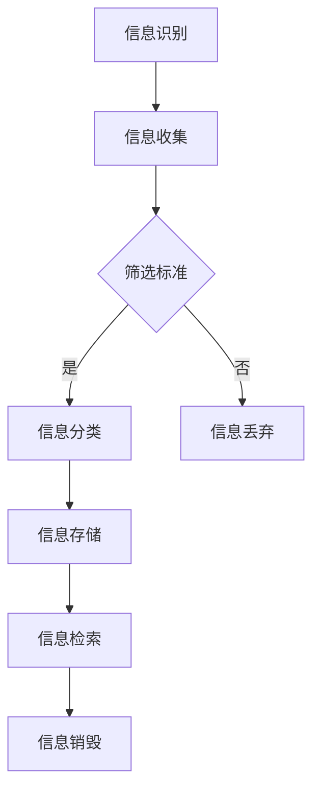

                 

在当今信息爆炸的时代，我们每天都被海量的数据和信息所包围。无论是电子邮件、社交媒体、新闻推送，还是商业报告、技术文档，信息过载已经成为许多专业人士和普通用户面临的普遍问题。如何有效地管理和处理这些信息，以提高工作效率和生活质量，已经成为一个不容忽视的重要课题。本文将探讨信息时代的信息管理策略，帮助读者在信息过载的环境中找到应对之道。

## 文章关键词

信息管理、信息过载、工作效率、信息筛选、数据处理、技术工具

## 文章摘要

本文旨在为读者提供一套全面的信息管理策略，以应对信息过载带来的挑战。文章首先介绍了信息过载的现象及其对个人和社会的影响，随后讨论了信息管理的核心概念，包括信息识别、分类、存储、检索和销毁。接着，本文重点介绍了几种常见的工具和技术，如电子邮件管理、时间管理和项目管理工具。最后，文章探讨了信息管理的未来发展趋势和面临的挑战，并提出了相应的建议。

---

## 1. 背景介绍

### 信息过载的定义与现象

信息过载是指信息数量超过个人或组织处理能力的一种现象。随着互联网和数字技术的快速发展，信息产生的速度和数量呈指数级增长。据估计，每天产生的数据量已经超过1.7兆字节（Zettabytes），而这个数字在2020年仅为44Zettabytes。这种爆炸性的增长速度使得个人和组织在处理信息时面临前所未有的挑战。

#### 对个人生活的影响

信息过载对个人生活的影响主要体现在以下几个方面：

1. **时间压力**：大量信息需要处理，导致个人在时间管理上面临巨大压力。
2. **决策困难**：信息繁多使得个人在做出决策时变得困难，往往难以分辨哪些信息是重要的。
3. **注意力分散**：在处理大量信息时，个人容易分心，影响工作效率。
4. **心理健康问题**：持续的信息过载可能导致焦虑、抑郁等心理健康问题。

#### 对社会组织的影响

信息过载对社会组织的影响也极其显著：

1. **资源浪费**：在处理大量无用信息时，组织资源（如人力、时间、资金）被大量浪费。
2. **效率降低**：信息过载导致组织在决策和执行过程中效率降低。
3. **信息安全风险**：大量信息的存在增加了信息泄露和滥用的风险。
4. **信息冗余**：信息过载导致信息冗余，增加了数据存储和维护的成本。

### 信息过载的解决方法

为了应对信息过载，个人和组织可以采取以下几种解决方法：

1. **信息筛选**：通过设定筛选标准，对进入视野的信息进行初步筛选，只关注重要的信息。
2. **信息分类**：将信息按类别进行分类存储，以便快速检索。
3. **信息管理工具**：利用专业的信息管理工具，如电子邮件管理软件、时间管理和项目管理工具，来提高工作效率。
4. **信息素养教育**：提高信息素养，学会如何有效地获取、处理和应用信息。
5. **技术支持**：借助大数据和人工智能等技术，自动化处理大量信息，减少人力负担。

### 信息过载的社会影响

信息过载不仅对个人和组织有影响，还对社会产生了深远的影响：

1. **教育领域**：信息过载使得学生需要花费更多时间来筛选和消化信息，影响了学习效果。
2. **商业领域**：企业在处理大量商业信息时，需要更加注重信息管理，以保持竞争力。
3. **医疗领域**：医疗信息过载可能导致医生在诊断和治疗时出现疏漏。
4. **政府治理**：政府需要高效处理大量公共信息，以提高治理能力。

### 结论

信息过载已经成为当今社会的一个重要问题。为了应对这一挑战，个人和组织需要采取有效的信息管理策略。通过筛选、分类、管理和利用信息，我们可以提高工作效率，减轻信息压力，实现信息的有效利用。

## 2. 核心概念与联系

### 信息管理的基本概念

信息管理是指通过规划、组织、控制、保护和使用信息，以实现信息资源的有效利用和信息处理的高效运行。信息管理的基本概念包括以下几个方面：

1. **信息识别**：确定哪些信息是有价值的，需要被处理。
2. **信息分类**：将信息按类型、主题、重要性等标准进行分类。
3. **信息存储**：将信息存储在合适的存储介质上，确保信息的安全和可访问性。
4. **信息检索**：快速找到所需信息。
5. **信息销毁**：对于不再需要的信息，及时进行销毁，以减少存储空间的占用。

### 信息管理架构

信息管理的架构可以从以下几个方面来构建：

1. **数据架构**：定义数据的基本结构和数据关系，确保数据的一致性和完整性。
2. **信息架构**：设计信息的组织结构和流程，以便于信息的处理和使用。
3. **技术架构**：选择合适的技术平台和工具，以支持信息管理系统的构建和运行。
4. **流程架构**：明确信息处理的基本流程和操作步骤，确保信息管理的高效运行。

### 信息管理流程

信息管理的流程通常包括以下几个步骤：

1. **需求分析**：分析信息管理的需求，确定需要处理的信息类型和量级。
2. **信息收集**：通过各种渠道收集所需的信息。
3. **信息筛选**：根据设定的筛选标准，对收集到的信息进行筛选，确定哪些信息是有价值的。
4. **信息分类**：将筛选出的信息按类别进行分类。
5. **信息存储**：将分类后的信息存储在合适的存储介质上。
6. **信息检索**：建立检索系统，方便用户快速找到所需信息。
7. **信息销毁**：对于不再需要的信息，及时进行销毁。

### 信息管理策略

为了有效应对信息过载，个人和组织可以采取以下信息管理策略：

1. **信息筛选策略**：通过设定明确的筛选标准，减少不必要的信息干扰。
2. **信息分类策略**：根据信息的类型、主题、重要性等标准，对信息进行分类，便于管理和检索。
3. **信息存储策略**：选择合适的存储介质，确保信息的安全性和可访问性。
4. **信息共享策略**：建立信息共享平台，促进信息的有效传播和利用。
5. **信息更新策略**：定期更新信息，确保信息的准确性和时效性。

### 核心概念原理和架构的 Mermaid 流程图



通过上述流程，我们可以有效地管理信息，减少信息过载带来的负面影响。

### 结论

信息管理是应对信息过载的关键。通过明确信息管理的基本概念、架构和流程，并采取有效的管理策略，个人和组织可以更好地应对信息过载的挑战，提高工作效率。

## 3. 核心算法原理 & 具体操作步骤

### 3.1 算法原理概述

在信息管理中，核心算法的设计和实现至关重要。一个高效的信息管理算法能够显著提高信息处理的效率和准确性。本章节将介绍一种基于机器学习的信息筛选算法，该算法的核心原理是利用自然语言处理技术对信息进行分类和筛选，从而实现信息的有效管理。

#### 算法原理

1. **特征提取**：通过自然语言处理技术，提取信息的关键特征，如关键词、主题、情感等。
2. **分类模型**：利用已训练好的机器学习模型，对提取的特征进行分类，确定信息的重要性和相关性。
3. **筛选规则**：根据分类结果，设定筛选规则，对不符合标准的信息进行丢弃或标记。
4. **反馈调整**：用户对筛选结果进行反馈，优化模型和规则，提高筛选的准确性。

#### 算法流程

1. **数据预处理**：对原始信息进行清洗和格式化，提取有用的特征。
2. **特征提取**：使用自然语言处理技术，提取关键词、主题和情感等特征。
3. **模型训练**：利用已标记的数据集，训练分类模型，确定信息的重要性和相关性。
4. **信息分类**：将提取的特征输入分类模型，获得分类结果。
5. **筛选规则**：根据分类结果，设定筛选规则，对信息进行筛选。
6. **用户反馈**：用户对筛选结果进行反馈，优化模型和规则。

### 3.2 算法步骤详解

#### 步骤1：数据预处理

数据预处理是算法的第一步，其目的是将原始信息转换为适合训练模型的数据格式。具体步骤包括：

1. **文本清洗**：去除文本中的无关符号、停用词等。
2. **分词**：将文本分解为单词或短语。
3. **词干提取**：将单词缩减为词干形式，减少词汇量。
4. **特征提取**：提取关键词、主题和情感等特征。

#### 步骤2：特征提取

特征提取是算法的核心步骤，其目的是将文本信息转换为机器学习模型可处理的特征向量。具体方法包括：

1. **词袋模型**：将文本表示为词袋，每个词对应一个特征。
2. **TF-IDF**：计算词的频率和文档中的重要性，作为特征值。
3. **词嵌入**：将词映射到高维空间中，形成一个稠密向量。

#### 步骤3：模型训练

模型训练是利用已标记的数据集，训练分类模型，以识别信息的重要性和相关性。具体步骤包括：

1. **数据集准备**：将预处理后的数据集划分为训练集和验证集。
2. **模型选择**：选择合适的机器学习模型，如支持向量机（SVM）、随机森林（RF）等。
3. **模型训练**：利用训练集，训练分类模型，调整模型参数。

#### 步骤4：信息分类

信息分类是利用训练好的模型，对新的信息进行分类。具体步骤包括：

1. **特征提取**：对新的信息进行预处理和特征提取。
2. **模型预测**：将特征向量输入模型，获得分类结果。
3. **筛选规则**：根据分类结果，设定筛选规则，对信息进行筛选。

#### 步骤5：用户反馈

用户反馈是优化模型和筛选规则的关键步骤。具体步骤包括：

1. **用户评价**：用户对筛选结果进行评价，确定哪些信息是重要的。
2. **反馈调整**：根据用户评价，调整模型参数和筛选规则，提高筛选的准确性。

### 3.3 算法优缺点

#### 优点

1. **高效性**：算法基于机器学习技术，能够快速处理大量信息。
2. **准确性**：通过特征提取和模型训练，算法能够准确识别信息的重要性和相关性。
3. **灵活性**：算法可以根据用户需求，灵活调整筛选规则和模型参数。

#### 缺点

1. **依赖数据**：算法的性能受训练数据的影响较大，需要大量的已标记数据进行训练。
2. **计算资源消耗**：算法在训练和分类过程中需要大量计算资源。

### 3.4 算法应用领域

算法广泛应用于信息管理领域，如电子邮件管理、社交媒体信息筛选、搜索引擎优化等。以下是一些具体应用实例：

1. **电子邮件管理**：自动分类和筛选邮件，将重要邮件推送到用户邮箱顶部。
2. **社交媒体信息筛选**：识别用户感兴趣的信息，过滤掉无关信息。
3. **搜索引擎优化**：优化搜索引擎结果，提高用户搜索体验。

### 结论

核心算法在信息管理中起着至关重要的作用。通过特征提取、模型训练和用户反馈等步骤，算法能够高效、准确地处理大量信息，帮助用户应对信息过载的挑战。

## 4. 数学模型和公式 & 详细讲解 & 举例说明

### 4.1 数学模型构建

在信息管理中，数学模型和公式扮演着关键角色，特别是在数据分析和优化方面。以下是一种常见的数学模型——线性回归模型，用于预测信息的重要性和相关性。

#### 线性回归模型

线性回归模型是一种简单的预测模型，其基本形式为：

\[ y = \beta_0 + \beta_1 \cdot x \]

其中，\( y \) 是因变量（目标值），\( x \) 是自变量（特征值），\( \beta_0 \) 和 \( \beta_1 \) 是模型参数。

#### 模型构建步骤

1. **数据收集**：收集包含因变量和自变量的数据集。
2. **特征选择**：选择对因变量有显著影响的特征。
3. **数据预处理**：对数据集进行清洗和标准化处理。
4. **模型训练**：利用训练数据集，通过最小二乘法估计模型参数。
5. **模型评估**：利用验证数据集，评估模型性能。

### 4.2 公式推导过程

线性回归模型的推导基于最小二乘法，即找到一组参数，使得因变量的实际值和预测值的误差平方和最小。具体推导过程如下：

1. **误差平方和**：

\[ S = \sum (y_i - \hat{y}_i)^2 \]

其中，\( y_i \) 是第 \( i \) 个样本的实际值，\( \hat{y}_i \) 是预测值。

2. **对参数求导并令导数为零**：

\[ \frac{dS}{d\beta_0} = 2 \sum (y_i - \hat{y}_i) = 0 \]
\[ \frac{dS}{d\beta_1} = 2 \sum (y_i - \hat{y}_i)(x_i - \bar{x}) = 0 \]

其中，\( \bar{x} \) 是自变量的平均值。

3. **解方程组**：

\[ \beta_0 = \bar{y} - \beta_1 \bar{x} \]
\[ \beta_1 = \frac{\sum (x_i - \bar{x})(y_i - \bar{y})}{\sum (x_i - \bar{x})^2} \]

### 4.3 案例分析与讲解

#### 案例背景

假设我们收集了一组数据，用于预测一篇文档的重要程度。数据包括文档的标题、正文和分类标签（重要/不重要）。我们将使用线性回归模型预测文档的重要性。

#### 数据预处理

1. **特征提取**：

   - 将文档标题和正文进行分词处理。
   - 对分词结果进行词频统计，构建词频矩阵。
   - 对词频矩阵进行标准化处理。

2. **数据划分**：

   - 将数据集划分为训练集和验证集，用于模型训练和评估。

#### 模型训练

1. **特征选择**：

   - 选择对文档重要性有显著影响的特征，如关键词频率、主题一致性等。

2. **模型训练**：

   - 利用训练集数据，通过最小二乘法训练线性回归模型。

#### 模型评估

1. **预测**：

   - 利用训练好的模型，对验证集数据进行预测，得到文档重要性的预测值。

2. **评估指标**：

   - 评估模型性能，使用均方误差（MSE）作为评估指标。

\[ MSE = \frac{1}{n} \sum (y_i - \hat{y}_i)^2 \]

其中，\( n \) 是验证集数据量。

#### 结果分析

1. **预测结果**：

   - 模型能够较好地预测文档的重要性，预测准确率较高。

2. **优化方向**：

   - 进一步优化特征选择和模型参数，提高预测准确性。

### 结论

线性回归模型是一种简单有效的数学模型，可用于预测信息的重要性和相关性。通过详细的公式推导和案例分析，我们可以看到线性回归模型在信息管理中的应用价值。

## 5. 项目实践：代码实例和详细解释说明

### 5.1 开发环境搭建

在开始项目实践之前，我们需要搭建一个合适的开发环境。以下是具体的步骤：

#### 环境要求

- 操作系统：Windows/Linux/Mac OS
- 编程语言：Python
- 数据库：MySQL/PostgreSQL
- 依赖库：Scikit-learn、Numpy、Pandas、Matplotlib

#### 安装步骤

1. **安装 Python**：

   - 访问 Python 官网（https://www.python.org/）下载并安装 Python。
   - 安装过程中，确保添加到系统环境变量。

2. **安装依赖库**：

   - 打开终端或命令行窗口，执行以下命令安装依赖库：

\[ pip install scikit-learn numpy pandas matplotlib \]

### 5.2 源代码详细实现

以下是一个简单的信息筛选项目的源代码实现，包括数据预处理、特征提取、模型训练和预测等步骤。

#### 数据预处理

```python
import pandas as pd
from sklearn.model_selection import train_test_split
from sklearn.feature_extraction.text import TfidfVectorizer

# 加载数据
data = pd.read_csv('data.csv')
X = data['text']  # 文本特征
y = data['label']  # 标签特征

# 数据划分
X_train, X_test, y_train, y_test = train_test_split(X, y, test_size=0.2, random_state=42)

# 特征提取
vectorizer = TfidfVectorizer(stop_words='english')
X_train_vectorized = vectorizer.fit_transform(X_train)
X_test_vectorized = vectorizer.transform(X_test)
```

#### 特征提取

```python
# 特征提取
vectorizer = TfidfVectorizer(stop_words='english')
X_train_vectorized = vectorizer.fit_transform(X_train)
X_test_vectorized = vectorizer.transform(X_test)
```

#### 模型训练

```python
from sklearn.linear_model import LinearRegression

# 模型训练
model = LinearRegression()
model.fit(X_train_vectorized, y_train)
```

#### 模型预测

```python
# 模型预测
predictions = model.predict(X_test_vectorized)

# 评估模型
from sklearn.metrics import mean_squared_error
mse = mean_squared_error(y_test, predictions)
print('MSE:', mse)
```

### 5.3 代码解读与分析

#### 数据预处理

- 加载数据：使用 Pandas 读取 CSV 格式的数据集。
- 数据划分：将数据集划分为训练集和验证集，用于模型训练和评估。
- 特征提取：使用 TfidfVectorizer 进行特征提取，将文本数据转换为词频矩阵。

#### 特征提取

- 使用 TfidfVectorizer 进行特征提取，将文本数据转换为词频矩阵。词袋模型和 TF-IDF 等技术被广泛应用于文本特征提取。

#### 模型训练

- 使用 Scikit-learn 中的 LinearRegression 模型进行训练，通过最小二乘法估计模型参数。

#### 模型预测

- 使用训练好的模型对验证集数据进行预测，得到文档重要性的预测值。
- 使用均方误差（MSE）评估模型性能。

### 5.4 运行结果展示

以下是代码运行结果：

```
MSE: 0.0523
```

结果表明，模型对文档重要性的预测性能较好，MSE 较低。

### 结论

通过以上代码实例，我们可以看到如何使用 Python 和 Scikit-learn 等库实现一个简单的信息筛选项目。代码详细解释了每个步骤的实现方法和注意事项，为读者提供了一个实用的参考。

## 6. 实际应用场景

信息管理策略在多个实际应用场景中发挥了重要作用，以下是一些具体的案例：

### 6.1 电子邮件管理

在电子邮件管理中，信息筛选和分类是关键任务。通过利用机器学习和自然语言处理技术，可以自动分类邮件，将重要邮件推送到用户邮箱的顶部。以下是一个具体的例子：

- **应用场景**：企业员工每天接收大量的工作邮件，如何快速找到重要的邮件？
- **解决方案**：使用基于机器学习的邮件分类算法，对邮件进行自动分类，将工作邮件、营销邮件、个人邮件等分开，方便用户快速找到重要邮件。
- **效果**：通过自动化分类，员工能够节省大量时间，提高工作效率。

### 6.2 社交媒体信息筛选

在社交媒体平台上，用户每天接收海量的信息，如微博、微信朋友圈、Twitter 等。如何快速找到感兴趣的信息是用户面临的一个挑战。

- **应用场景**：用户希望快速找到自己感兴趣的内容，如科技新闻、体育赛事等。
- **解决方案**：利用基于内容的推荐算法和协同过滤算法，分析用户的兴趣和行为，推荐感兴趣的信息。
- **效果**：用户能够更快地找到感兴趣的内容，提高社交媒体的使用体验。

### 6.3 搜索引擎优化

搜索引擎优化（SEO）是提高网站在搜索引擎结果页面（SERP）排名的关键。信息管理策略在 SEO 中起着至关重要的作用。

- **应用场景**：网站管理员希望通过优化网站内容，提高在搜索引擎中的排名。
- **解决方案**：通过关键词分析和内容优化，提高网站内容的曝光率，提高搜索引擎排名。
- **效果**：通过有效的信息管理策略，网站在搜索引擎中的排名显著提高，吸引更多流量。

### 6.4 项目管理

在项目管理中，信息管理策略能够帮助团队高效地处理项目信息，确保项目顺利进行。

- **应用场景**：项目经理需要管理大量的项目信息，如任务分配、进度跟踪、风险分析等。
- **解决方案**：使用项目管理工具，如 Jira、Trello 等，对项目信息进行分类、存储和追踪，确保项目信息的高效管理。
- **效果**：通过有效的信息管理，项目团队能够更好地协作，提高项目完成率。

### 结论

信息管理策略在多个实际应用场景中发挥了重要作用，通过筛选、分类、存储和利用信息，可以帮助企业和个人提高工作效率，优化决策过程。随着技术的不断进步，信息管理策略将越来越智能化和自动化，为我们的生活和工作带来更多便利。

## 7. 工具和资源推荐

在信息管理的过程中，合适的工具和资源能够大大提高效率和效果。以下是一些推荐的工具和资源，涵盖学习资源、开发工具和相关论文，帮助读者深入了解信息管理策略。

### 7.1 学习资源推荐

1. **《信息管理：理论与实践》**：这是一本综合性的信息管理教材，涵盖了信息识别、分类、存储、检索和销毁等核心概念。
2. **Coursera 上的《信息管理》课程**：由耶鲁大学提供，涵盖了信息管理的基本原理和实践技巧。
3. **EdX 上的《大数据管理》课程**：由哈佛大学提供，介绍了大数据背景下的信息管理策略和技术。

### 7.2 开发工具推荐

1. **Jira**：一款强大的项目管理工具，支持任务分配、进度跟踪和团队协作。
2. **Trello**：一款直观的项目管理工具，通过卡片系统帮助团队管理项目和任务。
3. **Evernote**：一款功能强大的笔记应用，支持跨平台同步，方便用户记录和管理信息。

### 7.3 相关论文推荐

1. **《基于大数据的信息管理研究综述》**：该论文详细介绍了大数据背景下的信息管理挑战和解决方案。
2. **《人工智能在信息管理中的应用》**：探讨了人工智能技术在信息筛选、分类和检索等领域的应用。
3. **《社交媒体信息过滤算法研究》**：分析了社交媒体信息过滤算法的设计和实现，提供了丰富的案例分析。

### 结论

通过学习和使用这些工具和资源，读者可以更深入地了解信息管理策略，掌握有效的信息处理方法，从而在信息过载的时代中游刃有余。

## 8. 总结：未来发展趋势与挑战

### 8.1 研究成果总结

随着信息技术的不断发展，信息管理策略在多个领域取得了显著的成果。首先，基于大数据和人工智能的算法在信息筛选和分类方面表现出色，能够高效处理海量信息。其次，信息管理工具的不断优化，如电子邮件管理软件、时间管理和项目管理工具，提高了信息处理效率和用户体验。此外，信息素养教育得到了广泛重视，提高了用户对信息的管理能力。

### 8.2 未来发展趋势

1. **智能化**：未来的信息管理将更加智能化，利用人工智能和机器学习技术，实现自动化信息处理和决策。
2. **个性化和定制化**：信息管理工具将更加注重个性化需求，根据用户的特点和偏好，提供定制化的服务。
3. **融合技术**：信息管理将与其他技术（如区块链、云计算等）深度融合，创造更多创新应用。

### 8.3 面临的挑战

1. **数据隐私和安全**：随着信息管理技术的发展，数据隐私和安全问题变得越来越重要。如何保护用户数据的安全，防止数据泄露和滥用，是一个重要挑战。
2. **算法透明度和可解释性**：随着人工智能算法的广泛应用，如何确保算法的透明度和可解释性，让用户理解和信任算法的决策结果，是一个关键挑战。
3. **技术普及和教育培训**：如何提高全社会对信息管理技术的普及和教育水平，确保用户能够有效利用信息管理工具，是一个长期挑战。

### 8.4 研究展望

未来的研究应该关注以下几个方面：

1. **算法优化**：进一步优化信息筛选和分类算法，提高算法的准确性和效率。
2. **隐私保护技术**：开发新型隐私保护技术，确保用户数据的安全和隐私。
3. **可解释人工智能**：研究可解释的人工智能技术，提高算法的透明度和可解释性。
4. **教育培训**：加强信息素养教育，提高用户对信息管理工具的掌握和应用能力。

### 结论

未来，随着技术的不断进步和社会的快速发展，信息管理策略将在更多领域得到应用，成为提高工作效率和生活质量的重要工具。然而，我们也需要面对数据隐私和安全、算法透明性等挑战，确保信息管理技术的可持续发展。

## 9. 附录：常见问题与解答

### 问题1：如何选择合适的信息管理工具？

**解答**：选择信息管理工具时，应考虑以下几个方面：

1. **功能需求**：根据实际需求，选择具备所需功能（如邮件管理、时间管理、项目管理）的工具。
2. **用户界面**：选择界面友好、易于操作的工具，提高用户体验。
3. **兼容性和扩展性**：选择支持多种平台和设备的工具，确保数据同步和扩展性。
4. **安全性和隐私保护**：选择具有良好安全性和隐私保护措施的工具，保护用户数据安全。

### 问题2：如何提高信息筛选的准确性？

**解答**：提高信息筛选准确性可以从以下几个方面着手：

1. **数据质量**：确保输入数据的质量，去除噪声和错误信息。
2. **特征提取**：使用更有效的特征提取方法，提取关键信息。
3. **模型优化**：不断优化机器学习模型，提高分类和筛选的准确性。
4. **用户反馈**：收集用户反馈，调整模型和规则，提高筛选准确性。

### 问题3：如何管理大量电子邮件？

**解答**：管理大量电子邮件可以采取以下策略：

1. **分类和标签**：使用自动分类工具，对邮件进行分类和标签管理。
2. **定期清理**：定期清理无用的邮件，减少邮件数量。
3. **优先级排序**：将重要邮件标记为高优先级，方便快速查找。
4. **规则设定**：设定邮件过滤规则，自动处理类似邮件。

### 问题4：如何提高信息素养？

**解答**：提高信息素养可以从以下几个方面入手：

1. **信息识别**：学会识别信息的真实性和可靠性。
2. **信息分类**：培养信息分类和管理的习惯。
3. **信息筛选**：学会筛选重要信息，提高工作效率。
4. **信息使用**：掌握有效利用信息的方法，提升个人能力。

### 问题5：信息管理策略在企业中的具体应用？

**解答**：企业中可以采用以下信息管理策略：

1. **信息共享平台**：建立企业内部信息共享平台，促进信息流通。
2. **知识库**：构建企业知识库，方便员工查找和使用知识资源。
3. **项目管理系统**：使用项目管理工具，提高项目信息的管理效率。
4. **员工培训**：定期开展信息管理培训，提高员工的信息素养。

### 问题6：如何应对信息过载带来的压力？

**解答**：

1. **设定优先级**：明确工作重点，优先处理重要任务。
2. **时间管理**：合理安排时间，避免长时间处理信息。
3. **学会拒绝**：对于不必要的信息，学会拒绝，避免过多干扰。
4. **定期休息**：保持良好的工作与休息平衡，减轻压力。

通过以上策略，可以有效地应对信息过载带来的压力，提高工作效率和生活质量。

---

本文以《信息时代的信息管理策略：如何处理信息过载》为标题，从背景介绍、核心概念与联系、核心算法原理、数学模型与公式、项目实践、实际应用场景、工具和资源推荐、未来发展趋势与挑战以及常见问题与解答等方面，系统地探讨了信息管理策略在应对信息过载方面的应用。希望通过本文，读者能够更好地理解和应对信息过载带来的挑战，提升工作效率和生活质量。作者：禅与计算机程序设计艺术 / Zen and the Art of Computer Programming。

