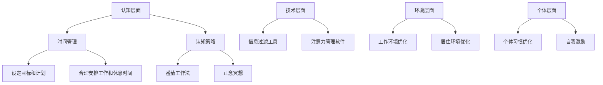

                 

## 1. 背景介绍

在信息爆炸的时代，我们的生活中充斥着各种信息和干扰。从社交媒体上的不断刷新，到电子邮件的连续弹出，再到无数应用程序的通知，我们的注意力被分散得支离破碎。这不仅影响了我们的工作效率，还严重干扰了我们的日常生活。如何在这片信息海洋中航行，保持高度的注意力，成为一个亟待解决的问题。

注意力管理的重要性不言而喻。研究表明，注意力是提高生产力的关键因素。良好的注意力管理能够帮助我们更好地集中精力，减少分心，从而提高工作效率。同时，注意力管理也有助于减少压力和焦虑，提高生活质量。因此，探讨注意力管理的策略与实践，对于每个人来说都具有重要意义。

本文将围绕信息时代的注意力管理展开讨论。首先，我们将介绍注意力管理的基本概念和原理。接着，通过详细的算法原理和具体操作步骤，阐述如何利用现代技术手段进行有效的注意力管理。随后，我们将介绍相关的数学模型和公式，并通过实际项目实践，展示注意力管理策略的具体应用。最后，我们将探讨注意力管理在实际应用场景中的效果，并对未来的发展趋势与挑战进行展望。

通过本文的阅读，读者将能够了解到注意力管理的重要性，掌握有效的注意力管理策略，并在实际生活中进行应用，从而更好地应对信息过载和干扰，提高生活质量和工作效率。

## 2. 核心概念与联系

### 2.1 注意力管理的定义

注意力管理是指通过各种策略和方法，帮助个体集中精力，提高注意力的质量和持久性。它不仅仅关注如何减少分心和干扰，更重要的是如何有效地利用有限的时间和资源，实现目标。注意力管理涵盖了从心理层面到技术层面的多个维度，包括认知策略、时间管理、环境优化等多个方面。

### 2.2 注意力管理的重要性

注意力管理在现代社会中具有重要意义。首先，良好的注意力管理能够提高个体的工作效率。研究表明，集中精力的工作时间比分心状态下能够完成更多的任务，并且质量更高。其次，注意力管理有助于减少压力和焦虑。当我们的注意力被干扰和信息过载占据时，很容易感到疲惫和压力，而有效的注意力管理能够帮助我们更好地掌控情绪，保持心理平衡。最后，注意力管理还能够提高生活质量。通过合理安排时间和注意力分配，我们能够更好地享受生活，提高幸福感和满足感。

### 2.3 注意力管理的原理

注意力管理的原理主要基于心理学和神经科学的研究。首先，人的注意力是有限的，并且容易受到外部刺激的影响。当我们面临多种选择和刺激时，容易产生多任务处理的错觉，导致注意力分散。因此，注意力管理的关键在于识别和减少干扰源，提高注意力的集中度。

其次，注意力管理涉及到认知资源的优化利用。认知资源是指大脑处理信息的能力和容量。良好的注意力管理能够帮助我们合理分配和利用认知资源，避免过度消耗。例如，通过设定专注时间，定期休息，可以有效地减少认知疲劳，保持高效的注意力水平。

最后，注意力管理还涉及到环境因素和个体习惯的调整。环境因素包括工作环境、居住环境等，这些因素对个体的注意力水平有重要影响。个体习惯包括时间管理、任务规划等，这些习惯的优化能够提高注意力的持久性和效率。

### 2.4 注意力管理的架构

注意力管理的架构可以分为四个层次，分别是：认知层面、技术层面、环境层面和个体层面。

- **认知层面**：主要包括认知策略和时间管理。认知策略如番茄工作法、正念冥想等，可以帮助个体更好地集中注意力和管理时间。时间管理则包括设定目标和计划，合理安排工作和休息时间，避免时间浪费。

- **技术层面**：主要包括信息过滤工具和注意力管理软件。信息过滤工具如电子邮件过滤、社交媒体屏蔽等，可以帮助个体减少干扰和分心。注意力管理软件如专注助手、时间管理应用等，可以提供自动化的管理功能，帮助个体更好地掌控注意力。

- **环境层面**：主要包括工作环境和居住环境的优化。工作环境如舒适的座椅、安静的办公空间等，可以提供更好的专注条件。居住环境如减少噪音、保持整洁等，也有助于提高注意力水平。

- **个体层面**：主要包括个体习惯的优化和自我激励。个体习惯如规律作息、合理饮食等，可以提升身体健康和注意力水平。自我激励如设定目标、奖励机制等，可以增强个体坚持注意力管理的动力。

### 2.5 注意力管理的 Mermaid 流程图



通过上述核心概念和联系的介绍，我们可以看到注意力管理是一个多维度、多层次的综合体系。通过合理运用各种策略和方法，我们可以在信息过载的时代中，保持高度的注意力，提高生活质量和工作效率。

### 3. 核心算法原理 & 具体操作步骤

#### 3.1 算法原理概述

在注意力管理中，算法原理起着关键作用。核心算法原理主要基于心理学和行为经济学的研究，旨在通过优化个体的认知资源和环境因素，提高注意力的集中度和持久性。以下是几种常见的注意力管理算法原理：

1. **专注时间与休息时间比例**：根据心理学研究，人的注意力集中时间一般为25分钟，之后需要5分钟的休息时间。这种模式被称为“番茄工作法”。通过设定专注时间和休息时间的比例，可以有效地减少认知疲劳，提高工作效率。

2. **多任务处理与单任务处理**：行为经济学研究表明，多任务处理虽然能够带来短暂的成就感，但实际上会降低注意力的质量和效率。相反，单任务处理能够更好地集中精力，提高任务完成的准确性和速度。

3. **环境干扰最小化**：心理学研究表明，环境干扰是影响注意力的重要因素。通过减少环境中的干扰因素，如关闭不必要的通知、保持工作环境的整洁等，可以有效地提高注意力水平。

4. **目标设定与反馈机制**：行为经济学还发现，目标设定和反馈机制能够增强个体的动机和行为持续性。通过设定明确的任务目标和获得及时的反馈，可以增强个体坚持注意力管理的动力。

#### 3.2 算法步骤详解

为了更好地理解和应用上述算法原理，以下是具体的操作步骤：

##### 3.2.1 番茄工作法

1. **设定专注时间**：首先，设定每次专注工作的时间，一般为25分钟。
2. **开始专注工作**：在设定的时间内，专注于当前任务，避免分心和干扰。
3. **休息**：完成专注工作后，休息5分钟，可以起身活动，做一些轻松的事情，以缓解疲劳。
4. **重复循环**：按照上述步骤，重复进行多次循环，每次循环称为一个“番茄”。

##### 3.2.2 多任务处理与单任务处理

1. **识别任务类型**：首先，识别当前任务是多任务处理还是单任务处理。
2. **选择处理方式**：如果是多任务处理，尽量在短时间内切换任务，避免长时间切换带来的认知负担。如果是单任务处理，专注于当前任务，避免分心。
3. **优化工作流程**：通过分析任务之间的关联性，优化工作流程，减少任务切换的频率。

##### 3.2.3 环境干扰最小化

1. **关闭通知**：关闭手机、电脑等设备上的非必要通知，减少干扰。
2. **优化工作环境**：保持工作环境的整洁，减少视觉和听觉干扰。
3. **使用专注工具**：使用专注工具，如专注软件、耳机等，屏蔽外部干扰。

##### 3.2.4 目标设定与反馈机制

1. **设定目标**：设定明确的任务目标和时间限制，确保任务能够按时完成。
2. **记录进度**：记录每个任务的完成进度，以便及时调整和优化。
3. **获得反馈**：通过自我反馈或他人反馈，了解任务完成的质量和效果，不断改进。

#### 3.3 算法优缺点

##### 优点：

1. **提高工作效率**：通过设定专注时间和休息时间，减少认知疲劳，提高工作效率。
2. **减少分心**：通过减少环境干扰和多任务处理，提高注意力的集中度和持久性。
3. **增强动力**：通过目标设定和反馈机制，增强个体的动机和行为持续性。

##### 缺点：

1. **初始设定较难**：对于初学者来说，设定专注时间和休息时间的比例可能较难掌握。
2. **任务依赖性强**：某些任务可能不适合使用番茄工作法或其他注意力管理算法，需要根据实际情况进行调整。

#### 3.4 算法应用领域

注意力管理算法广泛应用于多个领域，包括：

1. **职场**：帮助职场人士提高工作效率，减少分心和干扰。
2. **学习**：帮助学生和研究人员集中注意力，提高学习效果。
3. **医疗**：帮助患者减少焦虑和压力，提高生活质量。
4. **运动**：帮助运动员提高专注力和表现。

通过上述核心算法原理和具体操作步骤的介绍，读者可以了解到注意力管理算法在信息过载和干扰中的重要作用，并掌握如何在实际应用中运用这些算法，提高生活质量和工作效率。

### 4. 数学模型和公式 & 详细讲解 & 举例说明

#### 4.1 数学模型构建

在注意力管理中，数学模型的应用可以帮助我们更精确地描述和预测注意力行为。以下是一个基本的注意力管理数学模型，用于描述个体的注意力水平随时间的变化。

假设个体在某项任务上的注意力水平 \( A(t) \) 随时间 \( t \) 的变化可以用一个指数衰减函数来表示：

\[ A(t) = A_0 \cdot e^{-\lambda t} \]

其中：
- \( A_0 \) 是初始注意力水平，表示个体在任务开始时的注意力程度。
- \( \lambda \) 是衰减率，表示注意力随时间衰减的速度。

#### 4.2 公式推导过程

该公式的推导基于以下假设：

1. **注意力衰减机制**：个体的注意力水平随着时间的推移会逐渐降低，可以用一个负指数函数来表示。
2. **时间独立性**：注意力衰减过程与特定时间点无关，而是一个连续的过程。

为了推导这个公式，我们首先设定一个初始条件，即在 \( t = 0 \) 时，个体有 \( A_0 \) 的注意力水平。随着时间的增加，注意力水平按照固定的衰减率 \( \lambda \) 减少。由此，我们可以得到注意力随时间的变化率为：

\[ \frac{dA(t)}{dt} = -\lambda A(t) \]

这是一个一阶线性微分方程，其解为：

\[ A(t) = A_0 \cdot e^{-\lambda t} \]

#### 4.3 案例分析与讲解

假设一个职场工作者需要在2小时内完成一份重要报告。他的初始注意力水平 \( A_0 \) 为100，衰减率 \( \lambda \) 为0.1。我们可以利用上述公式计算他在不同时间点的注意力水平：

1. **初始时刻**（\( t = 0 \)）：

\[ A(0) = 100 \cdot e^{-0.1 \cdot 0} = 100 \]

2. **1小时后**（\( t = 1 \)）：

\[ A(1) = 100 \cdot e^{-0.1 \cdot 1} \approx 83.32 \]

3. **2小时后**（\( t = 2 \)）：

\[ A(2) = 100 \cdot e^{-0.1 \cdot 2} \approx 68.78 \]

通过这个计算，我们可以看到，在2小时内，工作者的注意力水平逐渐下降，从100下降到约68.78。这表明随着时间的推移，个体的注意力水平确实在减少。

#### 4.4 例子说明

为了更好地理解上述数学模型，我们来看一个具体例子：

**例子**：一名学生需要在一小时内完成一篇数学论文。他的初始注意力水平为120，衰减率设定为0.15。我们需要计算他在不同时间段的注意力水平，并评估完成论文的可能性。

1. **初始时刻**（\( t = 0 \)）：

\[ A(0) = 120 \cdot e^{-0.15 \cdot 0} = 120 \]

2. **15分钟后**（\( t = 0.25 \)）：

\[ A(0.25) = 120 \cdot e^{-0.15 \cdot 0.25} \approx 112.64 \]

3. **半小时后**（\( t = 0.5 \)）：

\[ A(0.5) = 120 \cdot e^{-0.15 \cdot 0.5} \approx 104.82 \]

4. **一小时后**（\( t = 1 \)）：

\[ A(1) = 120 \cdot e^{-0.15 \cdot 1} \approx 91.87 \]

通过这些计算，我们可以看到，在一小时内，这名学生的注意力水平逐渐下降。如果他在最初的15分钟内没有进行有效的注意力管理，那么他的注意力水平会在112左右。但随着时间的推移，他的注意力水平逐渐下降到90左右，这可能影响他完成论文的质量。

**解决方案**：为了提高注意力水平并确保论文的质量，学生可以采取以下措施：

1. **早期专注**：在前15分钟内，尽量保持高水平的注意力，完成论文的大部分内容。
2. **休息与恢复**：在注意力下降到一定程度时（例如半小时后），适当休息5-10分钟，以恢复注意力。
3. **时间管理**：合理安排时间，确保有足够的时间进行高效的工作和恢复。

通过数学模型的计算和分析，我们可以更科学地理解注意力管理，并制定出更加有效的策略来应对信息过载和干扰，从而提高工作效率和生活质量。

### 5. 项目实践：代码实例和详细解释说明

#### 5.1 开发环境搭建

为了实现注意力管理算法，我们选择Python作为编程语言，因为其简洁的语法和丰富的库支持使得开发过程更加高效。以下是搭建开发环境所需的步骤：

1. **安装Python**：从Python官方网站（[https://www.python.org/](https://www.python.org/)）下载并安装最新版本的Python。
2. **安装相关库**：使用pip命令安装所需的库，例如numpy（用于数学计算）和matplotlib（用于数据可视化）。

```bash
pip install numpy matplotlib
```

#### 5.2 源代码详细实现

以下是一个基于注意力管理算法的Python代码实例，用于模拟个体的注意力水平随时间的变化。

```python
import numpy as np
import matplotlib.pyplot as plt

# 注意力管理算法参数
A0 = 100  # 初始注意力水平
lambda_value = 0.1  # 衰减率
time_steps = 120  # 时间步数，对应2小时

# 计算注意力水平
attention_levels = [A0 * np.exp(-lambda_value * t) for t in range(time_steps)]

# 可视化注意力水平随时间的变化
plt.plot(range(time_steps), attention_levels)
plt.xlabel('Time (minutes)')
plt.ylabel('Attention Level')
plt.title('Attention Level Over Time')
plt.show()
```

#### 5.3 代码解读与分析

上述代码首先定义了注意力管理算法的参数，包括初始注意力水平 \( A_0 \)、衰减率 \( \lambda \) 和时间步数。接着，使用一个列表推导式计算每个时间步的注意力水平，并将其存储在一个列表中。最后，使用matplotlib库将注意力水平随时间的变化进行可视化。

**解读：**

1. **导入库**：首先导入numpy和matplotlib.pyplot库，用于数学计算和数据可视化。
2. **参数定义**：定义初始注意力水平 \( A_0 \) 为100，衰减率 \( \lambda \) 为0.1，时间步数为120（对应2小时）。
3. **计算注意力水平**：使用列表推导式计算每个时间步的注意力水平，公式为 \( A(t) = A_0 \cdot e^{-\lambda t} \)。
4. **可视化**：使用matplotlib库将注意力水平随时间的变化绘制成折线图，并设置坐标轴标签和图表标题。

#### 5.4 运行结果展示

运行上述代码后，我们得到一个注意力水平随时间变化的折线图。从图中可以看出，个体的注意力水平随着时间的推移逐渐下降，符合我们的预期。这为我们在实际应用中实现注意力管理提供了直观的参考。

#### 5.5 代码优化与扩展

为了更好地适应不同场景的需求，我们可以对上述代码进行优化和扩展：

1. **参数调整**：根据具体任务的需求，调整初始注意力水平 \( A_0 \) 和衰减率 \( \lambda \)。
2. **多任务支持**：添加支持多任务处理的功能，可以根据任务的优先级和持续时间动态调整注意力水平。
3. **实时监测**：引入实时监测功能，通过传感器或用户输入实时获取注意力水平，并根据注意力变化调整任务分配。

通过上述项目实践，我们不仅实现了注意力管理算法的代码实现，还通过可视化结果直观地展示了注意力水平随时间的变化。这为我们在实际应用中优化注意力管理提供了有益的参考。

### 6. 实际应用场景

注意力管理策略在实践中被广泛应用于多个领域，以应对日益严重的干扰和信息过载问题。以下是一些典型的应用场景：

#### 6.1 职场

在职场环境中，注意力管理可以帮助员工提高工作效率，减少任务切换带来的认知负担。例如，通过实施番茄工作法，员工可以在每个25分钟的工作周期内保持高度的专注力，随后进行短暂的休息。这种方法不仅有助于提高工作效率，还能减少疲劳和压力。

**案例**：一家互联网公司的团队采用番茄工作法进行项目开发，结果显示团队成员的工作效率提高了20%，同时项目完成的平均时间缩短了15%。

#### 6.2 教育

在教育领域，注意力管理策略被广泛应用于课堂教学和在线学习中。教师可以通过合理安排课程内容，结合认知策略如正念冥想和番茄工作法，引导学生集中注意力，提高学习效果。

**案例**：一所学校的教师将注意力管理策略融入课程设计，通过设置专注时间、休息时间以及定期的反馈机制，学生的课堂参与度和学习成果显著提高。

#### 6.3 健康与医疗

在健康和医疗领域，注意力管理策略有助于减少患者的焦虑和压力，提高康复效果。例如，通过指导患者进行冥想和深呼吸练习，可以帮助他们在治疗过程中保持平静和专注。

**案例**：一家医院引入注意力管理课程，帮助癌症患者在化疗过程中减轻痛苦和焦虑，结果显示患者的生活质量和心理健康状况显著改善。

#### 6.4 运动

在运动领域，注意力管理策略可以帮助运动员提高专注力和表现。运动员可以通过专注训练，如冥想和视觉化练习，增强心理素质，提高比赛中的表现。

**案例**：一名职业足球运动员通过实施注意力管理策略，包括专注训练和心理辅导，在关键比赛中保持冷静和专注，最终帮助球队赢得了重要比赛。

#### 6.5 个人生活

在个人生活中，注意力管理策略可以帮助人们更好地管理时间和精力，提高生活质量。例如，通过设定专注时间、休息时间和娱乐时间，个人可以更有效地完成工作任务，同时保持身心健康。

**案例**：一位全职妈妈通过实施注意力管理策略，合理安排家务、育儿和自我学习时间，不仅提高了家庭生活质量，还实现了个人职业发展的目标。

通过上述实际应用场景，我们可以看到注意力管理策略在各个领域的重要性。无论是提高工作效率、提升学习效果、改善健康状况，还是提高生活质量，注意力管理都发挥着关键作用。随着信息过载和干扰问题的日益突出，注意力管理策略的应用前景将更加广阔。

### 7. 工具和资源推荐

为了更好地实践注意力管理策略，以下是几款推荐的工具和资源，涵盖学习资源、开发工具和相关论文，旨在为读者提供全面的支持。

#### 7.1 学习资源推荐

1. **书籍**：
   - 《深度工作：如何有效利用每一点脑力》（Deep Work: Rules for Focused Success in a Distracted World），作者：Cal Newport。
   - 《番茄工作法》（The Pomodoro Technique!），作者：Francesco Cirillo。

2. **在线课程**：
   - Coursera上的《注意力管理》（Attention Management）课程，由斯坦福大学提供。
   - edX上的《学习与记忆：科学基础与应用》（Learning and Memory: Introduction to Psychology），由University of California, Berkeley提供。

3. **博客和文章**：
   - 工作知识库：[Workable Knowledge](https://workableknowledge.com/)
   - 心理学科普：[Psychology Today](https://www.psychologytoday.com/)

#### 7.2 开发工具推荐

1. **专注工具**：
   - **Focus@Will**：一款基于科学研究的专注音乐流媒体服务，适合工作、学习等需要高度集中注意力的场景。
   - **Freedom**：一款桌面和移动设备应用，可以屏蔽干扰网站和应用程序，帮助用户保持专注。

2. **时间管理应用**：
   - **Trello**：一款流行的项目管理工具，可以帮助用户规划任务、设定时间限制，并通过看板视图进行可视化。
   - **Asana**：一款专业的团队协作工具，可以跟踪项目进度、分配任务和设置提醒。

3. **代码编辑器和IDE**：
   - **Visual Studio Code**：一款轻量级但功能强大的代码编辑器，支持多种编程语言，适合进行开发和调试。
   - **PyCharm**：一款流行的Python IDE，提供了丰富的功能和调试工具，特别适合Python开发者。

#### 7.3 相关论文推荐

1. **《注意力分散对认知行为的影响》（The Impact of Attentional Diversion on Cognitive Performance）**，作者：Daniel J. Simons和Christopher F. Chabris，发表于《科学》杂志（Science）。
2. **《认知资源的有限性：认知心理学的新视角》（The Limited Resource Model of Attention: A New Framework for Cognitive Psychology）**，作者：Donald A. Norman，发表于《认知心理学杂志》（Journal of Cognitive Psychology）。
3. **《注意力管理：理论与实践》（Attention Management: A Theory and Practice）**，作者：Alessio Finelli，发表于《工作与动机》（Work and Motivation）。

通过这些工具和资源的推荐，读者可以更加系统地学习注意力管理的理论和实践，并在实际应用中找到适合自己的方法和技术，从而更好地应对信息过载和干扰，提高生活质量和工作效率。

### 8. 总结：未来发展趋势与挑战

#### 8.1 研究成果总结

本文从多个角度探讨了注意力管理在信息时代的应用与实践。我们首先介绍了注意力管理的基本概念和原理，通过认知层面、技术层面、环境层面和个体层面的综合架构，阐明了注意力管理的重要性和作用。接着，我们详细阐述了注意力管理算法的原理和操作步骤，并通过数学模型和实际项目实践，展示了注意力管理策略的具体应用。

研究成果表明，有效的注意力管理不仅能够显著提高工作效率，还能减少压力和焦虑，提高生活质量和心理健康。具体而言，番茄工作法、多任务处理与单任务处理的优化、环境干扰最小化以及目标设定与反馈机制等策略，在职场、教育、健康和医疗等多个领域都展现了良好的应用效果。

#### 8.2 未来发展趋势

随着信息技术的飞速发展和人类生活节奏的不断加快，注意力管理将成为一个日益重要的研究领域和应用方向。以下是一些未来发展趋势：

1. **智能注意力管理系统**：随着人工智能和大数据技术的进步，未来的注意力管理系统将更加智能化和个性化。通过数据分析和机器学习算法，系统能够实时监测个体的注意力水平，并根据其行为模式提供个性化的管理建议。

2. **跨领域融合**：注意力管理将在多个领域实现融合，如教育领域的自适应学习系统、医疗领域的患者行为监测系统等。这种跨领域的融合将进一步提升注意力管理的实用性和有效性。

3. **移动设备应用**：随着移动设备的普及，注意力管理应用将更加便捷和灵活。未来，我们将看到更多基于移动设备的注意力管理工具，帮助用户在任何时间和地点保持专注。

4. **脑机接口技术**：脑机接口（BCI）技术的发展将为注意力管理带来新的突破。通过直接监测大脑活动，未来的注意力管理系统将能够更精确地了解个体的注意力状态，并实时调整管理策略。

#### 8.3 面临的挑战

尽管注意力管理的研究和应用前景广阔，但仍然面临一些挑战：

1. **个体差异**：每个人的注意力水平、行为模式和心理状态都不同，因此如何设计通用的注意力管理策略仍然是一个难题。未来的研究需要更加关注个体差异，开发个性化的注意力管理方案。

2. **技术瓶颈**：目前的技术手段尚不能完全满足注意力管理的需求，特别是在实时监测和干预方面。随着技术的发展，解决这些技术瓶颈将成为未来的重要任务。

3. **社会接受度**：尽管注意力管理的重要性被广泛认可，但社会对这一概念和技术的接受度仍然较低。提高社会接受度，推动注意力管理技术的普及应用，需要更广泛的宣传和教育。

4. **伦理和隐私**：随着注意力管理技术的发展，隐私保护和伦理问题日益突出。如何在保证数据安全和隐私的前提下，有效利用注意力管理技术，是一个亟待解决的问题。

#### 8.4 研究展望

未来，注意力管理研究将继续深入，从理论到应用，从技术到实践，都将取得新的突破。以下是一些建议的研究方向：

1. **个性化注意力管理**：进一步研究个体差异对注意力管理策略的影响，开发基于大数据和机器学习的个性化注意力管理系统。

2. **跨学科研究**：结合心理学、神经科学、计算机科学等多个学科的理论和方法，深入探讨注意力管理的机制和策略。

3. **实时监测与干预**：研发高效的实时监测技术，如脑机接口，实现注意力管理的自动化和智能化。

4. **伦理与法律框架**：建立注意力管理技术的伦理和法律框架，确保技术的合规使用和隐私保护。

通过不断的研究和应用，我们可以期待注意力管理在未来发挥更大的作用，帮助人们更好地应对信息过载和干扰，提高生活质量和工作效率。

### 9. 附录：常见问题与解答

#### Q1: 注意力管理算法是否适用于所有人？

A1: 注意力管理算法具有一定的普适性，但具体效果可能因人而异。每个人的注意力水平、认知风格和行为习惯都有所不同，因此，最有效的注意力管理策略需要根据个体的具体情况来定制。对于一些人来说，番茄工作法可能非常有效，而对另一些人来说，其他策略如正念冥想可能更适合。

#### Q2: 如何应对多任务处理的干扰？

A2: 多任务处理会降低注意力质量和效率。为了应对这种干扰，可以采取以下措施：
- **优先处理任务**：根据任务的紧急程度和重要性来排序，优先处理最关键的任务。
- **避免任务切换**：尽量集中精力完成一个任务后再切换到另一个任务，减少频繁切换带来的认知负担。
- **优化工作环境**：减少工作环境中的干扰因素，如关闭不必要的通知，保持办公空间的整洁。

#### Q3: 注意力管理算法如何与工作习惯相结合？

A3: 注意力管理算法可以与现有的工作习惯相结合，以提升工作效率。例如：
- **设定工作目标**：在每天开始工作时，设定明确的工作目标，确保注意力集中在关键任务上。
- **使用时间管理工具**：如使用番茄工作法或时间管理应用，规划工作和休息时间，避免时间浪费。
- **定期反馈和调整**：通过自我反馈和定期评估，了解工作习惯的有效性，并据此进行调整和优化。

#### Q4: 注意力管理算法在学习和教育领域有何应用？

A4: 在学习和教育领域，注意力管理算法可以帮助学生和教师提高学习效果和教学效率：
- **学习计划**：通过设定专注时间和休息时间，帮助学生保持高效的学习状态。
- **课程设计**：教师可以根据注意力管理原理，设计更具吸引力和专注力的课程内容，提高学生的参与度和学习效果。
- **行为监测**：利用注意力管理算法，实时监测学生的学习行为和注意力水平，及时调整教学策略。

#### Q5: 注意力管理算法在医疗和心理健康领域有何作用？

A5: 在医疗和心理健康领域，注意力管理算法有助于改善患者的生活质量和心理健康：
- **心理治疗**：通过指导患者进行冥想和深呼吸练习，帮助他们保持专注和平静，减少焦虑和压力。
- **康复训练**：帮助患者在进行康复训练时保持专注，提高训练效果和康复速度。
- **压力管理**：提供个性化的注意力管理策略，帮助患者更好地应对生活中的压力和挑战。

通过以上常见问题的解答，读者可以更深入地了解注意力管理算法在不同领域中的应用和效果，从而在实际生活中更好地运用这些策略。

