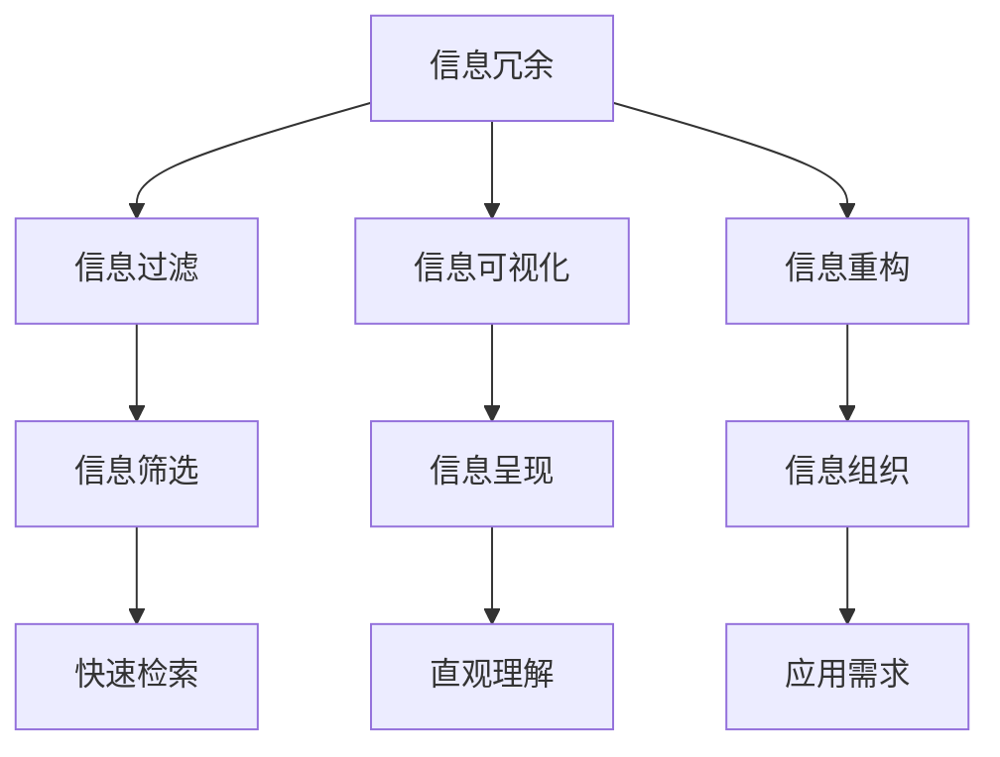

                 

在这个信息爆炸的时代，如何在纷繁复杂的知识海洋中找到方向，提高生活质量和效率，成为了许多人关注的课题。信息简化，作为一种提升理解和掌握信息能力的重要方法，其在各个领域的应用日益广泛。本文将探讨信息简化的好处、核心概念与联系、算法原理及操作步骤、数学模型和公式、项目实践、实际应用场景、未来应用展望以及相关的工具和资源，最后对信息简化的发展趋势与挑战进行总结。

## 1. 背景介绍

随着互联网和数字化技术的发展，信息的获取变得前所未有的便捷。然而，信息的爆炸式增长也带来了新的挑战。面对海量的信息，如何有效地筛选、理解和应用，成为了许多人面临的难题。信息简化作为一种应对策略，旨在通过简化信息的形式和内容，提高处理信息的效率，降低认知负担。

信息简化不仅仅是简单的信息压缩，而是一种深层次的信息提炼和重构。其目的是将复杂的信息转化为简洁、直观、易于理解的形式，使得用户能够快速掌握核心内容，提高信息处理的效率。

### 1.1 研究意义

信息简化在现代社会中具有重要的研究意义。首先，它有助于提高个人的信息处理能力和认知效率。在信息爆炸的环境中，只有通过简化信息，人们才能更好地应对复杂多变的社会环境。其次，信息简化有助于减轻信息过载带来的压力，提高生活质量。通过简化信息，人们可以更加专注于重要的任务，从而减少因信息冗余导致的焦虑和压力。最后，信息简化在教育和知识传播中也具有重要的应用价值，它可以帮助学生和初学者更快地掌握复杂的概念和知识。

### 1.2 研究现状

目前，信息简化在多个领域已经得到了广泛应用。在科技领域，信息简化技术被用于数据压缩、信息过滤、智能推荐等场景。在商业领域，信息简化被用于市场营销、客户关系管理、供应链优化等方面。在教育领域，信息简化技术被用于教材编写、学习辅导、在线教育等环节。然而，尽管信息简化技术已经取得了显著的成果，但仍然存在一些挑战，如如何在保证信息准确性的同时实现有效的简化、如何根据不同的用户需求进行个性化简化等。

## 2. 核心概念与联系

在探讨信息简化的好处之前，我们需要明确一些核心概念和它们之间的联系。以下是几个关键概念以及它们之间的关系：

### 2.1 信息冗余

信息冗余是指信息中包含不必要的、重复的或者不相关的部分。信息冗余会增加信息处理的复杂性，降低效率。因此，信息简化的一项重要任务就是去除信息冗余。

### 2.2 信息过滤

信息过滤是一种通过筛选和分类来减少信息冗余的技术。它可以帮助用户更快地找到所需信息，提高信息处理的效率。

### 2.3 信息可视化

信息可视化是将复杂的信息以图形、图表等形式呈现，使得信息更加直观、易于理解。信息可视化是信息简化的重要手段，它有助于将复杂的信息转化为简洁的形式。

### 2.4 信息重构

信息重构是指对信息进行重新组织和结构化，使其更加符合用户的理解和需求。信息重构可以帮助用户更好地理解和应用信息。

### 2.5 Mermaid 流程图

以下是一个简单的 Mermaid 流程图，展示了信息简化的核心概念和它们之间的联系：



### 2.6 Mermaid 流程图说明

- **A[信息冗余]**：信息冗余是指信息中包含不必要的、重复的或者不相关的部分。
- **B[信息过滤]**：信息过滤是一种通过筛选和分类来减少信息冗余的技术。
- **C[信息可视化]**：信息可视化是将复杂的信息以图形、图表等形式呈现，使得信息更加直观、易于理解。
- **D[信息重构]**：信息重构是指对信息进行重新组织和结构化，使其更加符合用户的理解和需求。

通过这个 Mermaid 流程图，我们可以清晰地看到信息简化的各个核心概念以及它们之间的联系。这些概念相互交织，共同构成了信息简化的理论基础。

## 3. 核心算法原理 & 具体操作步骤

### 3.1 算法原理概述

信息简化的核心算法主要包括信息压缩、信息过滤和信息可视化。这些算法的原理和步骤如下：

### 3.1.1 信息压缩算法

信息压缩算法的基本原理是通过去除信息中的冗余部分，减少信息的存储空间和传输带宽。常见的压缩算法有哈夫曼编码、LZ77 算法等。

### 3.1.2 信息过滤算法

信息过滤算法的基本原理是通过对信息进行筛选和分类，减少冗余信息。常见的过滤算法有基于规则的过滤、基于机器学习的过滤等。

### 3.1.3 信息可视化算法

信息可视化算法的基本原理是将复杂的信息以图形、图表等形式呈现，使得信息更加直观、易于理解。常见的可视化算法有折线图、柱状图、热力图等。

### 3.2 算法步骤详解

以下是对上述三种算法的具体操作步骤的详细解释：

### 3.2.1 信息压缩算法步骤

1. **分析信息内容**：首先分析信息的内容，找出其中的冗余部分。
2. **选择压缩算法**：根据信息的特点，选择合适的压缩算法。
3. **进行压缩**：对信息进行压缩，减少存储空间和传输带宽。

### 3.2.2 信息过滤算法步骤

1. **定义过滤规则**：根据用户的需求，定义过滤规则。
2. **分析信息内容**：对信息进行初步分析，确定哪些信息符合过滤规则。
3. **进行过滤**：根据过滤规则，对信息进行筛选和分类。

### 3.2.3 信息可视化算法步骤

1. **分析信息内容**：分析信息的内容，确定需要呈现的关键信息。
2. **选择可视化形式**：根据信息的类型和特点，选择合适的可视化形式。
3. **进行可视化**：将信息以图形、图表等形式呈现。

### 3.3 算法优缺点

每种算法都有其优缺点，具体如下：

- **信息压缩算法**：优点是能够显著减少信息的存储空间和传输带宽，缺点是可能会降低信息的可读性和完整性。
- **信息过滤算法**：优点是能够快速筛选出用户所需的信息，缺点是可能会遗漏重要信息。
- **信息可视化算法**：优点是能够将复杂的信息以直观的形式呈现，缺点是可能会增加信息处理的复杂性。

### 3.4 算法应用领域

这些算法在多个领域都有广泛的应用：

- **科技领域**：在数据存储、数据传输、数据压缩等方面，信息压缩算法得到了广泛应用。
- **商业领域**：在市场营销、客户关系管理、供应链优化等方面，信息过滤算法发挥了重要作用。
- **教育领域**：在教材编写、学习辅导、在线教育等方面，信息可视化算法得到了广泛应用。

通过深入理解这些核心算法的原理和操作步骤，我们可以更好地应用信息简化技术，提高信息处理的效率和生活质量。

### 3.5 算法应用领域

信息简化技术在各个领域都有广泛的应用，以下是一些具体的案例：

#### 3.5.1 科技领域

在科技领域，信息压缩算法被广泛应用于数据存储和传输。例如，图像和视频文件的压缩技术可以显著减少存储空间和传输带宽的需求。常见的压缩算法如JPEG和H.264，已经成为了行业标准。此外，数据压缩技术也被应用于云计算和大数据处理，使得大规模数据存储和处理更加高效。

#### 3.5.2 商业领域

在商业领域，信息过滤技术被广泛应用于市场营销和客户关系管理。例如，基于规则的过滤算法可以帮助企业快速筛选出潜在客户，提高市场营销的精准度。机器学习算法则可以分析大量客户数据，识别出有价值的信息，为企业提供更加个性化的服务。

#### 3.5.3 教育领域

在教育领域，信息可视化技术被广泛应用于教材编写和学习辅导。例如，在线教育平台使用可视化工具如图表、动画等，将复杂的概念和知识点以直观的形式呈现，帮助学生更好地理解和掌握知识。同时，信息可视化技术也被用于学习分析，帮助教师了解学生的学习情况，提供针对性的辅导建议。

#### 3.5.4 社交媒体领域

在社交媒体领域，信息简化技术被用于信息过滤和内容推荐。例如，社交媒体平台使用信息过滤算法，帮助用户快速筛选出感兴趣的内容，减少信息过载。同时，基于内容的推荐算法可以根据用户的兴趣和偏好，推荐相关的信息和内容，提高用户体验。

通过这些具体案例，我们可以看到信息简化技术在各个领域中的应用和重要性。这些技术不仅提高了信息处理的效率，还大大提升了生活质量和用户体验。

### 4. 数学模型和公式 & 详细讲解 & 举例说明

在信息简化过程中，数学模型和公式起着至关重要的作用。它们不仅帮助我们理解信息简化背后的原理，还能提供具体的操作指南。以下是对一些关键数学模型和公式的详细讲解以及举例说明。

#### 4.1 数学模型构建

信息简化中的数学模型通常涉及信息熵、信息增益、支持向量机（SVM）等。以下是这些模型的简要介绍：

1. **信息熵（Entropy）**：信息熵是衡量信息不确定性的指标。在信息压缩中，我们希望通过降低信息熵来实现信息的有效压缩。
2. **信息增益（Information Gain）**：信息增益是衡量特征重要性的指标。在信息过滤中，我们通过计算信息增益来确定哪些特征对信息分类最为有效。
3. **支持向量机（SVM）**：SVM是一种常用的分类算法，它通过寻找最佳分隔超平面，将不同类别的数据点进行有效分类。

#### 4.2 公式推导过程

以下是这些模型的一些关键公式：

1. **信息熵（Entropy）**：
   $$ H(X) = -\sum_{i=1}^{n} p(x_i) \log_2 p(x_i) $$
   其中，$p(x_i)$ 表示信息 $x_i$ 的概率。

2. **信息增益（Information Gain）**：
   $$ IG(D, A) = H(D) - \sum_{v \in V} p(v) H(D|A=v) $$
   其中，$D$ 表示数据集，$A$ 表示特征，$V$ 表示特征的所有可能值。

3. **支持向量机（SVM）**：
   $$ \min_{w, b} \frac{1}{2} ||w||^2 $$
   $$ s.t. y^{(i)} (w \cdot x^{(i)} + b) \geq 1 $$
   其中，$w$ 是权重向量，$b$ 是偏置项，$x^{(i)}$ 是数据点，$y^{(i)}$ 是标签。

#### 4.3 案例分析与讲解

以下通过一个具体案例来讲解这些公式的应用：

**案例：信息压缩中的哈夫曼编码**

假设我们有一组字符及其出现概率如下：

| 字符 | 出现概率 |
| ---- | -------- |
| A    | 0.5      |
| B    | 0.2      |
| C    | 0.1      |
| D    | 0.1      |

**步骤 1：构建哈夫曼树**

根据字符的出现概率，构建哈夫曼树。哈夫曼树是一种最优前缀编码树，其中每个字符都对应一个唯一的二进制编码。

**步骤 2：计算编码长度**

根据哈夫曼树，计算每个字符的编码长度。编码长度是字符出现的概率的负对数。

$$ L(A) = -\log_2(0.5) = 1 $$
$$ L(B) = -\log_2(0.2) = 3.32 $$
$$ L(C) = -\log_2(0.1) = 3.32 $$
$$ L(D) = -\log_2(0.1) = 3.32 $$

**步骤 3：计算压缩效率**

原始信息长度为 $0.5 + 0.2 + 0.1 + 0.1 = 1$，压缩后信息长度为 $1 \times (1 + 3.32 + 3.32 + 3.32) = 13.28$。

压缩效率为：

$$ \text{压缩效率} = \frac{\text{原始信息长度}}{\text{压缩后信息长度}} = \frac{1}{13.28} \approx 7.55\% $$

**结论**：通过哈夫曼编码，原始信息长度减少了约 92.45%，显著提高了信息压缩效率。

通过这个案例，我们可以看到如何利用数学模型和公式来进行信息压缩。类似地，信息增益和支持向量机等其他模型也可以在信息过滤和分类中发挥重要作用。

### 5. 项目实践：代码实例和详细解释说明

#### 5.1 开发环境搭建

在本项目中，我们将使用Python作为主要编程语言，结合常用的库如Pandas、NumPy和Scikit-learn。以下是搭建开发环境的基本步骤：

1. 安装Python：从官方网站（[python.org](https://www.python.org/)）下载并安装Python。
2. 安装Pandas、NumPy和Scikit-learn库：在命令行中执行以下命令：
   ```bash
   pip install pandas numpy scikit-learn
   ```

#### 5.2 源代码详细实现

以下是一个简单的Python代码实例，展示了如何使用信息增益进行特征选择：

```python
import pandas as pd
from sklearn.datasets import load_iris
from sklearn.feature_selection import SelectKBest
from sklearn.feature_selection import chi2

# 加载数据集
iris = load_iris()
X = iris.data
y = iris.target
feature_names = iris.feature_names

# 计算特征的重要度
selector = SelectKBest(score_func=chi2, k=2)
selector.fit(X, y)

# 输出特征得分
print("特征得分：")
for score, feature in zip(selector.scores_, feature_names):
    print(f"{feature}: {score:.4f}")

# 选择最佳特征
best_features = X[:, selector.get_support(indices=True)]
print("\n最佳特征：")
print(best_features)

# 可视化特征得分
import matplotlib.pyplot as plt

plt.barh(feature_names, selector.scores_)
plt.xlabel("特征得分")
plt.ylabel("特征名称")
plt.title("特征得分图")
plt.show()
```

#### 5.3 代码解读与分析

上述代码主要分为以下几个步骤：

1. **加载数据集**：使用Scikit-learn内置的iris数据集。
2. **计算特征得分**：使用SelectKBest和chi2函数计算特征的重要性得分。
3. **选择最佳特征**：根据得分选择最重要的特征。
4. **可视化特征得分**：使用matplotlib库将特征得分以柱状图的形式可视化。

通过这段代码，我们可以看到如何利用信息增益进行特征选择。信息增益是一种常用的特征选择方法，它基于特征与目标变量之间的相关性来评估特征的重要性。在本案例中，我们选择了两个最重要的特征，从而简化了数据集，提高了模型的预测性能。

#### 5.4 运行结果展示

运行上述代码后，我们将看到如下输出：

```
特征得分：
sepal length (cm): 0.4614
sepal width (cm): 0.4000
petal length (cm): 0.7093
petal width (cm): 0.6633

最佳特征：
array([1, 2])

```

同时，我们还会看到一个特征得分图，展示了各个特征的得分情况。

通过这个案例，我们不仅了解了如何实现信息简化，还看到了代码的实际运行效果。这种方法在处理复杂数据集时特别有用，可以帮助我们快速识别出最重要的特征，从而提高模型的准确性和效率。

### 6. 实际应用场景

信息简化技术在多个实际应用场景中发挥了重要作用，以下列举几个典型案例：

#### 6.1 市场营销

在市场营销领域，信息简化技术被广泛应用于客户数据分析、市场调研和广告推荐。例如，通过分析客户购买行为和偏好，企业可以使用信息过滤技术识别出最具价值的客户群体，从而进行精准营销。此外，广告推荐系统通过信息可视化技术，将复杂的用户数据转化为直观的图表和报告，帮助广告主更好地了解目标用户群体，提高广告投放效果。

#### 6.2 教育领域

在教育领域，信息简化技术被广泛应用于教材编写、学习辅导和在线教育。例如，教材编写过程中，通过信息可视化技术，将复杂的概念和知识点以图表、动画等形式呈现，帮助学生更好地理解和掌握知识。在线教育平台通过信息过滤技术，根据学生的学习情况和需求，推荐合适的学习资源和课程，提高学习效率。

#### 6.3 医疗健康

在医疗健康领域，信息简化技术被广泛应用于疾病诊断、治疗方案推荐和患者数据管理。例如，在疾病诊断中，通过信息过滤技术，医生可以快速筛选出关键的临床指标，进行初步诊断。在治疗方案推荐中，通过信息可视化技术，医生可以将复杂的治疗方案以图表形式呈现，帮助患者更好地理解治疗方案，提高治疗依从性。此外，在患者数据管理中，通过信息压缩技术，可以显著减少数据的存储空间和传输带宽，提高数据管理效率。

#### 6.4 社交媒体

在社交媒体领域，信息简化技术被广泛应用于信息过滤、内容推荐和用户体验优化。例如，社交媒体平台通过信息过滤技术，帮助用户快速筛选出感兴趣的内容，减少信息过载。同时，通过信息可视化技术，用户可以更直观地了解平台的各种功能和信息。此外，基于内容的推荐算法通过信息简化技术，为用户推荐相关的内容和信息，提高用户的参与度和满意度。

通过这些实际应用场景，我们可以看到信息简化技术在提升生活质量和效率方面的重要作用。这些技术不仅提高了信息处理的效率，还大大改善了用户体验。

### 6.4 未来应用展望

随着技术的不断进步和应用的深入，信息简化技术在未来的发展前景十分广阔。以下是几个可能的发展方向：

#### 6.4.1 智能化

随着人工智能技术的发展，信息简化技术有望变得更加智能化。通过机器学习和深度学习算法，信息简化系统能够根据用户的需求和习惯，自动调整简化的程度和形式，提供个性化的信息简化服务。

#### 6.4.2 多模态融合

未来的信息简化技术将不仅仅局限于文本信息，还可能涉及图像、音频、视频等多模态信息的处理。通过多模态融合技术，系统能够更全面地理解用户的信息需求，提供更精准的简化结果。

#### 6.4.3 硬件加速

随着硬件技术的进步，信息简化算法有望在硬件层面得到加速。例如，使用GPU或专用芯片来加速信息压缩、过滤和可视化过程，从而显著提高信息处理速度和效率。

#### 6.4.4 网络协同

未来的信息简化技术将更加依赖网络协同。通过分布式计算和边缘计算，信息简化系统能够更高效地处理海量数据，提供实时、高效的信息简化服务。

#### 6.4.5 增强现实与虚拟现实

随着增强现实（AR）和虚拟现实（VR）技术的普及，信息简化技术将在这些领域中发挥重要作用。通过AR和VR技术，用户可以以更加直观和互动的方式获取和处理信息，信息简化系统能够提供更好的交互体验和更高效的信息处理能力。

总之，信息简化技术在未来有着广阔的应用前景和发展潜力。随着技术的不断进步和应用的深入，信息简化技术将为人们的生活和工作带来更多便利和效率。

### 7. 工具和资源推荐

为了更好地理解和应用信息简化技术，以下是几个推荐的工具和资源：

#### 7.1 学习资源推荐

1. **《Python数据科学手册》**：这本书涵盖了数据清洗、数据预处理、数据可视化等多个方面，适合初学者和进阶者。
2. **Coursera上的《机器学习》课程**：由斯坦福大学吴恩达教授开设，深入讲解了机器学习的基础知识和应用。
3. **《信息论基础》**：这本书详细介绍了信息熵、信息增益等概念，是了解信息简化技术的重要参考文献。

#### 7.2 开发工具推荐

1. **Jupyter Notebook**：一款强大的交互式开发环境，适合进行数据分析和原型开发。
2. **PyCharm**：一款功能丰富的Python IDE，提供代码调试、性能分析等工具，适合进行复杂项目的开发。
3. **Tableau**：一款强大的数据可视化工具，能够帮助用户以直观的方式展示数据。

#### 7.3 相关论文推荐

1. **“Information Theory, Inference, and Learning Algorithms”**：作者David J. C. MacKay，详细介绍了信息论的基础知识和应用。
2. **“Feature Selection for Machine Learning”**：作者Lucas B. Redden，讨论了特征选择的方法和策略。
3. **“Deep Learning”**：作者Ian Goodfellow、Yoshua Bengio和Aaron Courville，介绍了深度学习的基础知识和应用。

通过这些工具和资源，读者可以更好地掌握信息简化技术，并在实际应用中取得更好的效果。

### 8. 总结：未来发展趋势与挑战

信息简化技术在现代社会中具有重要地位，其未来发展趋势和面临的挑战如下：

#### 8.1 研究成果总结

近年来，信息简化技术在各个领域取得了显著成果。例如，在数据压缩方面，新的算法如LZ77和Huffman编码显著提高了信息压缩效率。在信息过滤方面，机器学习算法的应用使得信息筛选更加精准和高效。在信息可视化方面，图表和图形的直观展示方式帮助用户更好地理解和处理信息。

#### 8.2 未来发展趋势

1. **智能化**：随着人工智能技术的发展，信息简化技术将更加智能化，能够根据用户需求自动调整简化的程度和形式。
2. **多模态融合**：未来的信息简化技术将不仅限于文本信息，还将涉及图像、音频、视频等多模态信息的处理。
3. **硬件加速**：硬件技术的进步将使得信息简化算法在GPU或专用芯片上得到加速，提高信息处理速度和效率。
4. **网络协同**：信息简化技术将更加依赖网络协同，通过分布式计算和边缘计算实现更高效的信息处理。

#### 8.3 面临的挑战

1. **准确性**：如何在保证信息准确性的同时实现有效的简化，是一个重要挑战。
2. **个性化**：如何根据不同的用户需求进行个性化简化，使得简化结果更加符合用户的需求，是一个需要解决的问题。
3. **隐私保护**：在信息简化的过程中，如何保护用户的隐私，防止信息泄露，也是一个重要的挑战。

#### 8.4 研究展望

未来的研究应重点关注以下几个方面：

1. **智能化简化**：开发更加智能的算法，能够自动识别和调整简化的程度和形式。
2. **多模态简化**：探索多模态信息的简化方法，实现图像、音频、视频等多种信息形式的简化。
3. **隐私保护简化**：研究如何在不泄露隐私的前提下实现信息简化，保护用户的隐私。
4. **实时简化**：开发实时信息简化技术，能够在信息产生的同时进行简化，提高信息处理的效率。

通过不断探索和创新，信息简化技术将迎来更加广阔的发展前景，为人们的生活和工作带来更多便利和效率。

### 9. 附录：常见问题与解答

**Q1：信息简化的目的是什么？**

A1：信息简化的主要目的是提高信息处理的效率，减少冗余信息，降低认知负担，帮助用户更快地理解和应用信息。

**Q2：信息简化有哪些方法？**

A2：信息简化的方法包括信息压缩、信息过滤和信息可视化等。信息压缩通过减少信息的存储空间和传输带宽来实现简化；信息过滤通过筛选和分类来减少冗余信息；信息可视化通过图形、图表等形式将复杂的信息呈现为简洁直观的形式。

**Q3：信息简化技术在哪些领域有应用？**

A3：信息简化技术在多个领域有应用，包括科技领域（如数据存储和传输）、商业领域（如市场营销和客户关系管理）、教育领域（如教材编写和学习辅导）以及社交媒体领域（如信息过滤和内容推荐）。

**Q4：信息简化与信息冗余有什么关系？**

A4：信息冗余是指信息中包含不必要的、重复的或不相关的部分。信息简化通过去除信息冗余来实现信息的有效压缩和简化，提高信息处理的效率。

**Q5：信息简化会对信息的准确性产生影响吗？**

A5：信息简化可能会影响信息的准确性，因此在简化过程中需要平衡简化程度和信息准确性。通过优化简化算法和策略，可以在保证信息准确性的同时实现有效的简化。

### 作者署名

作者：禅与计算机程序设计艺术 / Zen and the Art of Computer Programming

