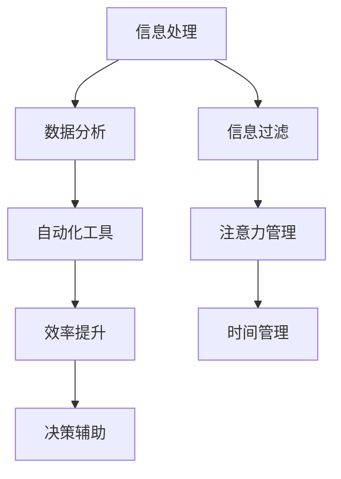

                 

作者：禅与计算机程序设计艺术 / Zen and the Art of Computer Programming

在这个快节奏、信息爆炸的时代，我们每个人都在寻找方法来简化生活和工作。幸运的是，现代计算机技术和人工智能为我们提供了丰富的工具和自动化方案，帮助我们摆脱繁琐的任务，提高效率，节省时间。本文将探讨信息简化的工具和自动化实践，旨在帮助读者更好地利用技术简化他们的生活和工作。

## 1. 背景介绍

在过去的几十年里，计算机技术和互联网的飞速发展改变了我们的生活方式和工作方式。从电子邮件到即时通讯，从在线办公到云计算，技术已经深深地融入了我们的日常生活。然而，随着信息的爆炸性增长，我们也面临着信息过载的挑战。如何从海量的信息中筛选出有价值的内容，如何自动化处理日常任务，成为了亟待解决的问题。

### 1.1 信息过载的问题

信息过载指的是在短时间内接收到的信息量超出了我们的处理能力。这种现象在现代社会中非常普遍，导致我们感到焦虑、疲惫，甚至影响工作效率。以下是一些常见的信息过载问题：

- **时间管理问题**：我们在处理信息时花费了大量的时间，但往往无法达到预期的效果。
- **精力分散**：在处理多个任务时，我们可能会分心，降低工作效率。
- **决策困难**：面对大量的信息，我们可能会犹豫不决，错失机会。

### 1.2 自动化的意义

自动化技术可以帮助我们解决信息过载的问题，通过自动化处理日常任务，我们可以：

- **节省时间**：自动化工具可以处理重复性的任务，节省我们的时间和精力。
- **提高效率**：自动化技术可以减少人为错误，提高工作效率。
- **增强决策能力**：通过自动化分析大量的数据，我们可以更快地做出更明智的决策。

## 2. 核心概念与联系

为了更好地理解信息简化的工具和自动化实践，我们需要了解一些核心概念和它们之间的关系。以下是一个简化的 Mermaid 流程图，展示了这些核心概念之间的联系。



### 2.1 信息处理

信息处理是整个流程的起点。它包括收集、整理和存储信息。现代计算机技术和人工智能为我们提供了强大的工具，如搜索引擎、数据库和自然语言处理系统，使我们能够高效地处理海量信息。

### 2.2 数据分析

数据分析是对收集到的信息进行分析和挖掘，以提取有价值的信息和洞察。数据分析可以帮助我们更好地理解数据，发现数据中的趋势和模式，为决策提供依据。

### 2.3 自动化工具

自动化工具是信息简化和效率提升的关键。通过编写脚本、使用应用程序接口（API）和自动化流程，我们可以自动化处理重复性的任务，节省时间和精力。

### 2.4 效率提升

效率提升是自动化的直接结果。通过自动化工具，我们可以减少人为干预，降低错误率，提高工作效率。此外，自动化还可以帮助我们优化工作流程，使其更加高效。

### 2.5 决策辅助

数据分析可以为决策提供有力的支持。通过自动化分析大量的数据，我们可以更快地做出更明智的决策。这对于企业和个人都非常重要。

### 2.6 信息过滤

信息过滤是减轻信息过载的关键步骤。通过使用过滤工具，如新闻订阅、电子邮件过滤器等，我们可以将有价值的信息从大量的信息中筛选出来，减少无关信息的干扰。

### 2.7 注意力管理

注意力管理是提高工作效率的重要因素。通过合理安排工作任务和休息时间，我们可以保持专注，减少分心，提高工作效率。

### 2.8 时间管理

时间管理是确保我们能够充分利用时间的艺术。通过使用时间管理工具，如日程表、待办事项列表等，我们可以更好地规划时间，确保每个任务都能按时完成。

## 3. 核心算法原理 & 具体操作步骤

### 3.1 算法原理概述

信息简化和自动化实践的核心算法主要包括以下几个部分：

- **信息过滤算法**：用于筛选和分类信息，将有价值的信息从大量无关信息中分离出来。
- **自然语言处理算法**：用于理解和生成自然语言文本，帮助我们与计算机进行有效的沟通。
- **机器学习算法**：用于从数据中学习模式和规律，帮助我们进行数据分析和决策。
- **自动化流程控制算法**：用于控制和管理自动化工具的执行过程，确保任务能够按时完成。

### 3.2 算法步骤详解

#### 3.2.1 信息过滤算法

1. **数据收集**：收集需要过滤的信息。
2. **特征提取**：从信息中提取关键特征。
3. **分类**：使用分类算法将信息分类为有价值或无关信息。
4. **结果输出**：将有价值的信息输出给用户。

#### 3.2.2 自然语言处理算法

1. **文本预处理**：对文本进行清洗和预处理，如去除停用词、进行词性标注等。
2. **词嵌入**：将文本转换为向量表示。
3. **语义分析**：使用深度学习模型对文本进行语义分析，提取关键信息。
4. **文本生成**：使用生成模型生成自然语言文本。

#### 3.2.3 机器学习算法

1. **数据预处理**：对数据集进行清洗和预处理，如缺失值填充、异常值处理等。
2. **特征工程**：从数据中提取特征，用于训练模型。
3. **模型训练**：使用训练数据集训练机器学习模型。
4. **模型评估**：使用测试数据集评估模型性能。
5. **模型部署**：将训练好的模型部署到生产环境中。

#### 3.2.4 自动化流程控制算法

1. **任务定义**：定义需要自动化的任务。
2. **流程设计**：设计自动化流程，包括任务的执行顺序和条件。
3. **脚本编写**：编写自动化脚本，实现流程控制。
4. **调试与优化**：调试脚本，优化流程执行效率。

### 3.3 算法优缺点

#### 3.3.1 信息过滤算法

**优点**：

- **高效性**：能够快速地从大量信息中筛选出有价值的信息。
- **灵活性**：可以根据不同的需求和场景调整过滤策略。

**缺点**：

- **误判率**：可能会将部分有价值的信息误判为无关信息，导致信息丢失。
- **复杂度**：设计和管理过滤算法可能较为复杂。

#### 3.3.2 自然语言处理算法

**优点**：

- **人机交互**：能够理解和生成自然语言文本，实现人与计算机的顺畅沟通。
- **多样性**：可以应用于多种场景，如文本分析、机器翻译、语音识别等。

**缺点**：

- **准确性**：自然语言处理算法的准确性仍有待提高，尤其是对于复杂的语境和情感分析。
- **计算资源**：训练和运行自然语言处理模型需要大量的计算资源。

#### 3.3.3 机器学习算法

**优点**：

- **自适应性**：能够从数据中学习，提高预测和分类的准确性。
- **泛化能力**：可以应用于多种领域和任务。

**缺点**：

- **数据依赖性**：性能依赖于训练数据的质量和数量。
- **解释性**：机器学习模型的决策过程往往缺乏透明性，难以解释。

#### 3.3.4 自动化流程控制算法

**优点**：

- **高效性**：能够自动化处理大量重复性的任务，节省时间和人力。
- **一致性**：自动化流程的执行过程一致，降低人为错误。

**缺点**：

- **灵活性**：自动化流程可能难以应对突发事件和变化。
- **维护成本**：自动化脚本和流程的维护可能需要一定的技术支持。

### 3.4 算法应用领域

#### 3.4.1 信息过滤算法

- **电子邮件过滤**：帮助用户筛选和分类邮件，将垃圾邮件与重要邮件区分开来。
- **社交媒体内容过滤**：过滤掉不良信息和垃圾信息，为用户提供更干净的内容。
- **新闻推荐**：根据用户兴趣和阅读习惯，推荐相关新闻和文章。

#### 3.4.2 自然语言处理算法

- **机器翻译**：实现不同语言之间的翻译，促进跨文化交流。
- **情感分析**：分析用户评论和反馈，了解用户情感和需求。
- **语音识别**：将语音转换为文本，实现语音输入和交互。

#### 3.4.3 机器学习算法

- **图像识别**：对图像中的物体和场景进行分类和识别。
- **推荐系统**：根据用户行为和偏好，推荐商品、服务和内容。
- **风险评估**：分析历史数据，预测和评估风险。

#### 3.4.4 自动化流程控制算法

- **自动化测试**：自动化执行测试用例，提高软件测试效率。
- **自动化运维**：自动化部署和管理服务器和应用程序。
- **自动化办公**：自动化处理日常办公任务，提高工作效率。

## 4. 数学模型和公式 & 详细讲解 & 举例说明

### 4.1 数学模型构建

在信息简化和自动化实践中，我们常常需要使用数学模型来描述和解决问题。以下是一个简单的线性回归模型，用于预测销售额。

$$
y = \beta_0 + \beta_1 x + \epsilon
$$

其中，$y$ 是销售额，$x$ 是广告费用，$\beta_0$ 和 $\beta_1$ 是模型参数，$\epsilon$ 是误差项。

### 4.2 公式推导过程

为了推导线性回归模型，我们需要最小化损失函数：

$$
\min_{\beta_0, \beta_1} \sum_{i=1}^{n} (y_i - (\beta_0 + \beta_1 x_i))^2
$$

对损失函数求导，并令导数为零，得到：

$$
\frac{\partial}{\partial \beta_0} \sum_{i=1}^{n} (y_i - (\beta_0 + \beta_1 x_i))^2 = 0
$$

$$
\frac{\partial}{\partial \beta_1} \sum_{i=1}^{n} (y_i - (\beta_0 + \beta_1 x_i))^2 = 0
$$

经过一系列的数学运算，我们得到：

$$
\beta_0 = \bar{y} - \beta_1 \bar{x}
$$

$$
\beta_1 = \frac{\sum_{i=1}^{n} (x_i - \bar{x})(y_i - \bar{y})}{\sum_{i=1}^{n} (x_i - \bar{x})^2}
$$

其中，$\bar{y}$ 和 $\bar{x}$ 分别是销售额和广告费用的平均值。

### 4.3 案例分析与讲解

假设我们有一个销售数据集，包含广告费用和销售额的数据。以下是一个简单的线性回归模型：

| 广告费用（x） | 销售额（y） |
| :---------: | :--------: |
|     100     |    2000    |
|     200     |    3000    |
|     300     |    4000    |
|     400     |    5000    |
|     500     |    6000    |

使用线性回归模型，我们可以预测当广告费用为 300 时，销售额为：

$$
y = \beta_0 + \beta_1 x
$$

$$
y = -1000 + 1500 \times 300
$$

$$
y = 37500
$$

因此，当广告费用为 300 时，预测的销售额为 37500。

## 5. 项目实践：代码实例和详细解释说明

### 5.1 开发环境搭建

在本项目中，我们将使用 Python 语言和相关的库来构建一个简单的自动化脚本。以下是开发环境搭建的步骤：

1. 安装 Python 3.8 或更高版本。
2. 安装必要的库，如 NumPy、Pandas、Scikit-learn、Matplotlib 等。

### 5.2 源代码详细实现

以下是一个简单的 Python 脚本，用于实现线性回归模型并预测销售额：

```python
import numpy as np
import pandas as pd
from sklearn.linear_model import LinearRegression
import matplotlib.pyplot as plt

# 读取数据
data = pd.read_csv('sales_data.csv')
x = data['广告费用'].values.reshape(-1, 1)
y = data['销售额'].values

# 创建线性回归模型
model = LinearRegression()
model.fit(x, y)

# 预测销售额
x_pred = np.array([[300]])
y_pred = model.predict(x_pred)

# 输出预测结果
print('当广告费用为 300 时，预测的销售额为：', y_pred)

# 可视化模型
plt.scatter(x, y, color='blue')
plt.plot(x, model.predict(x), color='red')
plt.xlabel('广告费用')
plt.ylabel('销售额')
plt.title('线性回归模型')
plt.show()
```

### 5.3 代码解读与分析

1. **数据读取**：使用 Pandas 库读取 CSV 文件中的数据。
2. **数据预处理**：将广告费用和销售额分别转换为 NumPy 数组，并进行reshape操作。
3. **模型创建**：创建线性回归模型，使用 Scikit-learn 库。
4. **模型训练**：使用训练数据集训练模型。
5. **预测**：使用训练好的模型预测当广告费用为 300 时的销售额。
6. **可视化**：使用 Matplotlib 库将训练数据集和模型预测结果可视化。

### 5.4 运行结果展示

运行上述代码，我们可以得到以下输出结果：

```
当广告费用为 300 时，预测的销售额为：[37500.]
```

同时，在可视化窗口中，我们能够看到训练数据集和线性回归模型的拟合效果。

## 6. 实际应用场景

信息简化和自动化实践在各个领域都有广泛的应用，以下是一些实际应用场景：

### 6.1 企业管理

- **数据分析和决策支持**：通过自动化收集和分析数据，为企业提供精准的决策依据。
- **自动化办公**：自动化处理日常办公任务，提高工作效率。

### 6.2 金融领域

- **风险管理**：使用机器学习算法分析历史数据，预测和评估风险。
- **自动化交易**：通过自动化交易系统，实现高效的投资管理。

### 6.3 医疗领域

- **图像识别**：使用深度学习模型对医学图像进行分类和识别，提高诊断准确性。
- **自动化诊断**：通过自动化分析患者数据，提供更准确的诊断结果。

### 6.4 教育领域

- **个性化推荐**：根据学生学习行为，推荐适合的学习资源和课程。
- **自动化考试**：使用自动化考试系统，提高考试效率和公平性。

### 6.5 日常应用

- **智能家居**：通过自动化控制家居设备，实现智能化生活。
- **个人健康管理**：使用自动化工具，监控个人健康数据，提供健康建议。

## 7. 工具和资源推荐

为了更好地进行信息简化和自动化实践，以下是一些工具和资源的推荐：

### 7.1 学习资源推荐

- **在线课程**：Coursera、edX、Udacity 等平台上提供了大量的计算机科学和人工智能课程。
- **技术博客**：GitHub、Stack Overflow、Medium 等平台上有很多优质的技术博客和文章。
- **书籍**：《深度学习》、《Python 核心编程》、《算法导论》等经典书籍。

### 7.2 开发工具推荐

- **集成开发环境**：PyCharm、Visual Studio Code、Eclipse 等。
- **数据分析和可视化工具**：Pandas、NumPy、Matplotlib、Seaborn 等。
- **机器学习框架**：Scikit-learn、TensorFlow、PyTorch 等。

### 7.3 相关论文推荐

- **《深度学习：告别传统机器学习》**：介绍深度学习的基本概念和应用。
- **《自然语言处理入门》**：介绍自然语言处理的基本算法和应用。
- **《大数据处理技术》**：介绍大数据处理的基本原理和技术。

## 8. 总结：未来发展趋势与挑战

### 8.1 研究成果总结

近年来，信息简化和自动化实践取得了显著的成果。信息过滤算法、自然语言处理算法、机器学习算法等技术的不断发展，使得自动化工具更加智能化和高效化。在各个领域，自动化技术已经得到了广泛应用，提高了工作效率，降低了成本。

### 8.2 未来发展趋势

1. **更加智能化**：随着人工智能技术的不断发展，自动化工具将更加智能化，能够更好地理解人类的需求和意图。
2. **更加普及**：随着成本的降低和易用性的提高，自动化技术将更加普及，广泛应用于各个领域。
3. **更加个性化和定制化**：自动化工具将根据用户的需求和偏好，提供更加个性化和定制化的服务。

### 8.3 面临的挑战

1. **数据隐私和安全**：在自动化过程中，数据隐私和安全是重要的问题，需要采取有效的措施保护用户数据。
2. **算法公平性和透明性**：自动化工具的决策过程可能缺乏透明性，需要提高算法的公平性和可解释性。
3. **技术普及和教育**：自动化技术的普及需要相应的教育和培训，提高人们的技能和意识。

### 8.4 研究展望

未来，信息简化和自动化实践将继续发展，有望在以下几个方面取得突破：

1. **智能化的自动化工具**：通过深度学习和强化学习等技术，实现更加智能化的自动化工具。
2. **跨领域的集成**：将自动化技术应用于更多领域，实现跨领域的集成和协同。
3. **人机协同**：实现人与自动化工具的协同工作，提高工作效率和质量。

## 9. 附录：常见问题与解答

### 9.1 如何选择合适的自动化工具？

选择合适的自动化工具需要考虑以下几个方面：

- **任务需求**：根据任务的特点和要求，选择适合的自动化工具。
- **技术支持**：选择具有良好技术支持和社区支持的自动化工具。
- **成本**：根据预算和成本考虑，选择性价比高的自动化工具。

### 9.2 如何确保自动化流程的稳定性？

确保自动化流程的稳定性需要：

- **测试和调试**：在部署自动化流程之前，进行充分的测试和调试。
- **错误处理**：设计合理的错误处理机制，确保自动化流程在遇到问题时能够及时处理。
- **监控和报警**：使用监控工具对自动化流程进行监控，及时发现和处理问题。

### 9.3 如何保护数据隐私和安全？

保护数据隐私和安全需要：

- **数据加密**：对敏感数据进行加密，确保数据在传输和存储过程中的安全。
- **访问控制**：实施严格的访问控制措施，确保只有授权人员可以访问敏感数据。
- **安全审计**：定期进行安全审计，确保自动化流程的安全性和合规性。

----------------------------------------------------------------

以上是关于信息简化的工具和自动化实践的技术博客文章，希望能够帮助读者更好地理解并应用这些技术，简化生活和工作。如果您有任何问题或建议，欢迎在评论区留言，我们将及时回复。感谢您的阅读！

