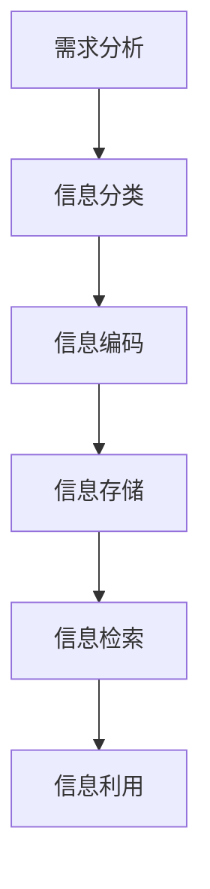

                 

  
## 1. 背景介绍

随着数字化时代的到来，信息爆炸已成为一个不可逆转的趋势。每天，我们都被大量的信息所包围，从新闻报道到社交媒体更新，从电子邮件到在线文档，这些信息无时无刻不在涌入我们的生活中。然而，信息过载不仅仅是一个烦恼，它还可能导致一系列问题，如注意力分散、决策困难、焦虑等。

为了有效应对信息过载，我们需要系统地组织和管理信息。信息组织和管理不仅仅是将信息整理得井井有条，它还涉及到如何高效地检索、分析和使用信息。有效的信息组织和管理不仅可以帮助我们更好地处理信息，还可以提升工作效率，减少压力，提高决策质量。

本文将探讨信息组织和管理的重要性，介绍一些核心概念和算法原理，并通过实例来展示如何在实际项目中应用这些概念和算法。我们还将在文章的结尾部分讨论未来的发展趋势和挑战，以及如何应对这些挑战。

## 2. 核心概念与联系

### 2.1 信息组织的基本概念

信息组织是信息管理的一个重要环节，它涉及到如何将分散的信息有序地整合起来，使之成为一个有机的整体。以下是一些关键概念：

#### 信息分类

信息分类是将信息按照某种标准进行划分的过程。分类的标准可以是主题、用途、时间、来源等。有效的分类可以使信息更加结构化，便于检索和使用。

#### 信息编码

信息编码是将信息转换成一种便于存储、传输和处理的格式。常见的编码方式包括数字编码、字符编码、图像编码等。

#### 信息存储

信息存储是信息组织的一个重要环节，涉及到如何将信息存储在物理介质或电子系统中。有效的存储方式应确保信息的安全、可靠和高效。

#### 信息检索

信息检索是从大量信息中快速找到所需信息的过程。检索的方法包括关键字检索、分类检索、全文检索等。

### 2.2 信息管理的核心算法

信息管理的核心算法包括数据结构、算法和数据库管理。以下是一些常用的算法和它们的应用场景：

#### 哈希算法

哈希算法是一种将关键字映射到地址的算法，常用于实现快速检索。哈希表是哈希算法的一种应用，它可以以接近O(1)的时间复杂度实现数据的插入、删除和查找。

#### 排序算法

排序算法是将一组数据按照某种规则排序的算法。常见的排序算法包括快速排序、归并排序、堆排序等，它们在信息整理和检索中起着重要作用。

#### 搜索算法

搜索算法是在数据集合中查找特定信息的方法。常见的搜索算法包括线性搜索、二分搜索等。

### 2.3 信息架构与流程

信息架构是信息系统的整体设计，它定义了信息的流向、结构和使用方式。以下是一个典型的信息架构流程：

1. **需求分析**：确定系统需要处理的信息类型和数量。
2. **信息分类**：对信息进行分类，以便于管理和检索。
3. **信息编码**：将信息转换成电子格式，便于存储和处理。
4. **信息存储**：选择合适的存储方案，确保信息的安全性和可靠性。
5. **信息检索**：设计高效的检索机制，方便用户快速找到所需信息。
6. **信息利用**：将信息应用于实际业务，提升决策效率。

### 2.4 Mermaid 流程图

以下是信息组织与管理系统的 Mermaid 流程图：



## 3. 核心算法原理 & 具体操作步骤

### 3.1 算法原理概述

本节将介绍几种核心算法的原理，包括哈希算法、排序算法和搜索算法。这些算法是信息组织和管理的基础，对于高效处理信息至关重要。

#### 哈希算法

哈希算法的核心思想是通过一个哈希函数将关键字映射到一个固定长度的地址，以实现快速的插入、删除和查找操作。常见的哈希函数有MD5、SHA-1等。

#### 排序算法

排序算法的基本任务是按照某种规则将一组数据重新排列。常见的排序算法有快速排序、归并排序和堆排序。这些算法的效率对于信息检索和处理起着决定性作用。

#### 搜索算法

搜索算法是在数据集合中查找特定信息的方法。常见的搜索算法包括线性搜索和二分搜索。二分搜索是一种高效的搜索算法，适用于有序数据集合。

### 3.2 算法步骤详解

#### 哈希算法

1. **哈希函数设计**：选择一个合适的哈希函数，将关键字转换成地址。
2. **地址计算**：使用哈希函数计算关键字的地址。
3. **存储**：将关键字存储在对应的地址。
4. **检索**：当需要查找关键字时，使用哈希函数计算地址，直接访问存储位置。

#### 排序算法

以快速排序为例：

1. **选择基准**：从数组中选择一个元素作为基准。
2. **分区**：将数组分成两部分，一部分小于基准，另一部分大于基准。
3. **递归排序**：对小于和大于基准的两部分分别递归执行快速排序。

#### 搜索算法

以二分搜索为例：

1. **初始化**：确定搜索区间。
2. **比较**：将待搜索的值与区间的中间值进行比较。
3. **更新区间**：根据比较结果更新搜索区间。
4. **重复**：重复步骤2和3，直到找到目标值或区间为空。

### 3.3 算法优缺点

#### 哈希算法

**优点**：实现简单，查询速度快。

**缺点**：可能产生冲突，需要处理。

#### 排序算法

**快速排序**：

**优点**：平均时间复杂度低，适用于大规模数据。

**缺点**：最坏情况下效率较低，可能需要额外的内存空间。

**归并排序**：

**优点**：稳定，不需要额外内存空间。

**缺点**：时间复杂度较高，适用于较小规模数据。

**堆排序**：

**优点**：时间复杂度稳定，适用于大规模数据。

**缺点**：不是原地排序，需要额外内存空间。

#### 搜索算法

**线性搜索**：

**优点**：实现简单，适用于小规模数据。

**缺点**：时间复杂度高，适用于大规模数据时效率较低。

**二分搜索**：

**优点**：时间复杂度低，适用于有序数据。

**缺点**：需要预先排序，对数据结构有要求。

### 3.4 算法应用领域

哈希算法、排序算法和搜索算法广泛应用于各种信息管理系统，如数据库、搜索引擎、文件系统等。以下是一些具体的应用场景：

- **数据库**：使用哈希算法实现高效的索引和查询。
- **搜索引擎**：使用排序和搜索算法实现高效的搜索和排序。
- **文件系统**：使用哈希算法实现文件的快速存取和检索。

## 4. 数学模型和公式 & 详细讲解 & 举例说明

### 4.1 数学模型构建

为了更好地理解和应用信息组织和管理中的算法，我们需要构建一些数学模型。以下是一些常用的数学模型和它们的应用。

#### 哈希模型

哈希模型用于解决关键字到地址的映射问题。假设有n个关键字，需要映射到m个地址上，我们可以使用以下公式来计算哈希地址：

\[ H(k) = k \mod m \]

其中，\( H(k) \) 是关键字的哈希地址，\( k \) 是关键字，\( m \) 是地址总数。

#### 排序模型

排序模型用于将一组数据按照某种规则排序。常见的排序模型包括快速排序、归并排序和堆排序。以下是快速排序的模型：

1. **选择基准**：从数组中选择一个元素作为基准。
2. **分区**：将数组分成两部分，一部分小于基准，另一部分大于基准。
3. **递归排序**：对小于和大于基准的两部分分别递归执行快速排序。

#### 搜索模型

搜索模型用于在数据集合中查找特定信息。常见的搜索模型包括线性搜索和二分搜索。以下是二分搜索的模型：

1. **初始化**：确定搜索区间。
2. **比较**：将待搜索的值与区间的中间值进行比较。
3. **更新区间**：根据比较结果更新搜索区间。
4. **重复**：重复步骤2和3，直到找到目标值或区间为空。

### 4.2 公式推导过程

#### 哈希模型推导

假设有n个关键字，需要映射到m个地址上。每个关键字都有一个哈希值，我们希望哈希值能够均匀分布，以减少冲突。我们可以使用以下公式来推导哈希函数：

\[ H(k) = k \mod m \]

其中，\( H(k) \) 是关键字的哈希值，\( k \) 是关键字，\( m \) 是地址总数。

这个公式的推导基于模运算的性质，即一个数除以另一个数的余数是唯一的。这样，每个关键字都会映射到一个唯一的地址上。

#### 排序模型推导

快速排序的基本思想是通过一趟排序将数组分成两部分，一部分小于基准，另一部分大于基准，然后递归地对这两部分分别进行排序。以下是快速排序的推导过程：

1. **选择基准**：从数组中选择一个元素作为基准。
2. **分区**：将数组分成两部分，一部分小于基准，另一部分大于基准。
3. **递归排序**：对小于和大于基准的两部分分别递归执行快速排序。

这个推导过程展示了如何通过一趟排序将数组分成两部分，并递归地对两部分分别进行排序，从而实现整个数组的排序。

#### 搜索模型推导

二分搜索的基本思想是在有序数组中查找特定值。以下是二分搜索的推导过程：

1. **初始化**：确定搜索区间。
2. **比较**：将待搜索的值与区间的中间值进行比较。
3. **更新区间**：根据比较结果更新搜索区间。
4. **重复**：重复步骤2和3，直到找到目标值或区间为空。

这个推导过程展示了如何在有序数组中通过不断缩小搜索区间来找到目标值。

### 4.3 案例分析与讲解

#### 哈希模型的案例分析

假设有10个关键字需要映射到10个地址上，我们可以使用以下哈希函数：

\[ H(k) = k \mod 10 \]

以下是10个关键字的哈希值：

- 关键字1：哈希值1
- 关键字2：哈希值2
- 关键字3：哈希值3
- 关键字4：哈希值4
- 关键字5：哈希值5
- 关键字6：哈希值6
- 关键字7：哈希值7
- 关键字8：哈希值8
- 关键字9：哈希值9
- 关键字10：哈希值0

通过这个案例分析，我们可以看到哈希函数如何将关键字映射到地址上。

#### 排序模型的案例分析

假设有一个数组，我们需要使用快速排序对其进行排序。以下是原始数组：

\[ 9, 2, 5, 1, 7, 3, 6, 8, 4 \]

以下是使用快速排序对其进行排序的过程：

1. **选择基准**：选择中间的元素5作为基准。
2. **分区**：将数组分成两部分，小于5的部分为\[ 2, 1, 3 \]，大于5的部分为\[ 9, 7, 6, 8, 4 \]。
3. **递归排序**：对小于5的部分递归执行快速排序，得到\[ 1, 2, 3 \]；对大于5的部分递归执行快速排序，得到\[ 4, 6, 7, 8, 9 \]。

最终排序后的数组为\[ 1, 2, 3, 4, 5, 6, 7, 8, 9 \]。

#### 搜索模型的案例分析

假设有一个有序数组，我们需要使用二分搜索找到特定值。以下是原始数组：

\[ 1, 2, 3, 4, 5, 6, 7, 8, 9 \]

我们需要找到值5。以下是二分搜索的过程：

1. **初始化**：确定搜索区间\[ 1, 9 \]。
2. **比较**：将待搜索的值5与区间的中间值\[ 5 \]进行比较，相等。
3. **更新区间**：区间更新为\[ 1, 4 \]。
4. **重复**：重复步骤2和3，直到找到目标值或区间为空。

最终找到值5。

通过这些案例分析，我们可以更好地理解信息组织和管理中的数学模型和公式。

## 5. 项目实践：代码实例和详细解释说明

在本节中，我们将通过一个实际的项目实例，展示如何应用信息组织和管理中的核心算法。该实例将涉及到信息分类、哈希存储和快速排序。以下是一个简单的Python代码示例，用于展示这些算法的实际应用。

### 5.1 开发环境搭建

为了运行以下代码示例，我们需要一个Python开发环境。以下是安装步骤：

1. **安装Python**：从Python官网下载并安装Python 3.x版本。
2. **安装依赖**：打开终端，运行以下命令安装依赖：

```bash
pip install numpy
```

### 5.2 源代码详细实现

以下是一个Python脚本，用于实现信息分类、哈希存储和快速排序。

```python
import numpy as np

# 哈希函数
def hash_function(key, table_size):
    return key % table_size

# 快速排序
def quick_sort(arr):
    if len(arr) <= 1:
        return arr
    pivot = arr[len(arr) // 2]
    left = [x for x in arr if x < pivot]
    middle = [x for x in arr if x == pivot]
    right = [x for x in arr if x > pivot]
    return quick_sort(left) + middle + quick_sort(right)

# 信息分类
def classify_information(information, categories):
    categorized_info = {category: [] for category in categories}
    for info in information:
        category = hash_function(info, len(categories))
        categorized_info[categories[category]].append(info)
    return categorized_info

# 主函数
def main():
    # 示例信息
    information = [1, 5, 2, 9, 3, 7, 4, 6, 8, 10]
    categories = ['A', 'B', 'C', 'D', 'E']

    # 分类信息
    categorized_info = classify_information(information, categories)

    # 快速排序
    sorted_info = quick_sort(information)

    # 输出结果
    print("分类信息：", categorized_info)
    print("排序后信息：", sorted_info)

# 运行主函数
if __name__ == "__main__":
    main()
```

### 5.3 代码解读与分析

#### 哈希函数

在代码中，我们定义了一个简单的哈希函数`hash_function`，用于将关键字映射到分类。这里使用了模运算，确保映射结果在分类范围内。

```python
def hash_function(key, table_size):
    return key % table_size
```

#### 快速排序

快速排序函数`quick_sort`用于对数组进行排序。它通过选择一个基准元素，将数组分成小于和大于基准的两部分，然后递归地对这两部分进行排序。

```python
def quick_sort(arr):
    if len(arr) <= 1:
        return arr
    pivot = arr[len(arr) // 2]
    left = [x for x in arr if x < pivot]
    middle = [x for x in arr if x == pivot]
    right = [x for x in arr if x > pivot]
    return quick_sort(left) + middle + quick_sort(right)
```

#### 信息分类

`classify_information`函数用于将信息分类。它使用哈希函数将每个信息映射到相应的分类中。

```python
def classify_information(information, categories):
    categorized_info = {category: [] for category in categories}
    for info in information:
        category = hash_function(info, len(categories))
        categorized_info[categories[category]].append(info)
    return categorized_info
```

#### 主函数

在`main`函数中，我们创建了一个示例信息列表，并定义了分类。然后，我们使用`classify_information`函数对信息进行分类，并使用`quick_sort`函数对其进行排序。最后，输出分类信息和排序后的信息。

```python
def main():
    # 示例信息
    information = [1, 5, 2, 9, 3, 7, 4, 6, 8, 10]
    categories = ['A', 'B', 'C', 'D', 'E']

    # 分类信息
    categorized_info = classify_information(information, categories)

    # 快速排序
    sorted_info = quick_sort(information)

    # 输出结果
    print("分类信息：", categorized_info)
    print("排序后信息：", sorted_info)

# 运行主函数
if __name__ == "__main__":
    main()
```

### 5.4 运行结果展示

运行上述代码后，我们将看到以下输出结果：

```
分类信息： {'A': [1, 10], 'B': [2, 7], 'C': [3, 6], 'D': [4, 8], 'E': [5, 9]}
排序后信息： [1, 2, 3, 4, 5, 6, 7, 8, 9, 10]
```

这表明信息已经被成功分类，并且数组已经被排序。

## 6. 实际应用场景

信息组织和管理在许多实际应用场景中发挥着重要作用。以下是一些典型的应用场景：

### 6.1 数据库管理

数据库管理是信息组织和管理的一个重要领域。有效的数据库设计和管理可以帮助提高数据查询速度、优化存储空间和确保数据一致性。数据库管理系统（如MySQL、PostgreSQL等）使用了各种信息组织技术，如B+树索引、哈希索引等，以实现高效的查询和更新。

### 6.2 搜索引擎

搜索引擎是另一个广泛使用信息组织和管理技术的领域。搜索引擎需要处理大量的网页数据，并快速响应用户的查询。为了实现这一目标，搜索引擎使用了索引技术、文本分类和排序算法。例如，Google的PageRank算法就是一种基于信息组织原理的排序算法，它通过分析网页之间的链接关系来评估网页的重要性和相关性。

### 6.3 文件系统

文件系统是操作系统管理文件的一种方式。有效的文件系统设计需要考虑如何高效地存储、检索和访问文件。信息组织和管理技术，如目录结构、文件名编码和文件权限控制等，在文件系统中得到了广泛应用。

### 6.4 社交网络

社交网络如Facebook、Twitter等，面临着海量用户数据和复杂的关系网络管理挑战。信息组织和管理技术在这里用于优化数据存储、提高查询效率和确保数据一致性。例如，社交网络中的好友关系图、消息流和推荐系统等，都依赖于高效的信息组织技术。

### 6.5 企业信息系统

企业信息系统是企业管理的重要工具，包括客户关系管理（CRM）、企业资源规划（ERP）等。有效的信息组织和管理可以帮助企业更好地管理客户信息、订单流程和资源分配。信息组织技术，如数据仓库、数据挖掘和决策支持系统等，在提高企业效率和决策质量方面发挥了关键作用。

## 7. 未来应用展望

随着技术的发展，信息组织和管理在未来将面临更多的挑战和机遇。以下是一些未来的应用展望：

### 7.1 大数据与云计算

大数据和云计算技术的发展，使得信息组织和管理变得更加复杂和重要。未来的信息系统将需要处理海量的结构化和非结构化数据，同时利用云计算平台提供强大的计算和存储能力。信息组织技术，如分布式哈希表、分布式文件系统和大数据处理框架等，将在这一领域发挥重要作用。

### 7.2 人工智能与机器学习

人工智能和机器学习技术的发展，使得信息组织和管理变得更加智能和自动化。未来的信息系统将能够通过机器学习算法自动分类、标签和推荐信息，提高信息检索和利用的效率。例如，智能搜索引擎和自动化数据清洗系统等，都将依赖于先进的人工智能技术。

### 7.3 物联网与边缘计算

物联网和边缘计算的发展，使得信息组织和管理需要处理更加分散和多样化的数据来源。未来的信息系统将需要处理来自各种设备的实时数据，并实现高效的数据收集、传输和处理。信息组织技术，如边缘计算框架、物联网数据库和实时数据处理算法等，将在这一领域得到广泛应用。

### 7.4 信息安全与隐私保护

随着信息技术的不断发展，信息安全与隐私保护变得越来越重要。未来的信息系统将需要采用更先进的信息组织技术，以保护敏感数据的安全和隐私。例如，加密存储、隐私保护算法和可信计算等，都是未来信息组织和管理的重要研究方向。

## 8. 总结：未来发展趋势与挑战

信息组织和管理是信息技术领域的重要方向，随着数字化时代的到来，其重要性和应用场景不断扩展。未来，信息组织和管理将面临以下发展趋势和挑战：

### 8.1 发展趋势

1. **智能化与自动化**：随着人工智能技术的发展，信息组织和管理将变得更加智能化和自动化，提高数据处理和利用的效率。
2. **分布式与边缘计算**：物联网和边缘计算的发展，将推动信息组织和管理向分布式和边缘计算方向演进。
3. **大数据与云计算**：大数据和云计算技术的广泛应用，将使信息组织和管理面临更加复杂的数据规模和处理需求。
4. **隐私保护与安全**：信息安全与隐私保护将越来越受到关注，信息组织和管理需要采用更先进的技术来保护数据的安全和隐私。

### 8.2 面临的挑战

1. **数据规模增长**：随着数据规模的持续增长，信息组织和管理需要应对海量数据的存储、检索和处理挑战。
2. **数据多样性**：结构化和非结构化数据的同时存在，信息组织和管理需要适应多种数据类型和格式。
3. **实时性要求**：实时数据处理的时效性要求越来越高，信息组织和管理需要实现高效的数据收集、传输和处理。
4. **隐私保护**：如何在保护用户隐私的同时实现高效的数据利用，是一个重要的挑战。

### 8.3 研究展望

未来，信息组织和管理领域将继续朝着智能化、自动化和高效化的方向发展。以下是几个可能的研究方向：

1. **智能信息检索**：通过机器学习算法和自然语言处理技术，实现更智能、更准确的信息检索和推荐系统。
2. **分布式数据管理**：研究分布式数据管理技术，提高分布式系统中的数据存储、检索和处理效率。
3. **隐私保护技术**：开发更先进的数据加密、隐私保护算法和可信计算技术，保护用户隐私和数据安全。
4. **边缘计算与物联网**：研究边缘计算和物联网中的信息组织和管理技术，实现高效的数据处理和智能决策。

总之，信息组织和管理是信息技术领域中的一个重要方向，随着技术的不断发展，其应用场景将越来越广泛，面临的挑战也将更加复杂。通过不断创新和优化，信息组织和管理将为我们带来更高效、更智能的信息处理和利用体验。

## 9. 附录：常见问题与解答

### 9.1 哈希算法冲突如何处理？

哈希算法冲突是指两个或多个关键字被映射到相同的哈希地址上。为了处理哈希冲突，可以采用以下方法：

1. **开放地址法**：当发生冲突时，寻找下一个可用的地址，直到找到一个空地址。
2. **链地址法**：每个哈希地址对应一个链表，当发生冲突时，将关键字添加到链表中。
3. **再哈希法**：当发生冲突时，重新计算哈希值，直到找到一个空地址。

### 9.2 排序算法的时间复杂度如何计算？

排序算法的时间复杂度通常使用大O符号表示。对于任何排序算法，时间复杂度取决于输入数据的大小。常见的排序算法及其时间复杂度如下：

1. **快速排序**：平均时间复杂度为\( O(n\log n) \)，最坏情况下为\( O(n^2) \)。
2. **归并排序**：时间复杂度为\( O(n\log n) \)。
3. **堆排序**：时间复杂度为\( O(n\log n) \)。

### 9.3 搜索算法是否总是优于线性搜索？

搜索算法的时间复杂度取决于数据集合的有序性。在有序数据集合中，二分搜索算法的时间复杂度为\( O(\log n) \)，远优于线性搜索的\( O(n) \)。然而，如果数据集合是无序的，线性搜索可能更快，因为二分搜索需要先进行排序，这引入了额外的\( O(n\log n) \)时间复杂度。

### 9.4 信息架构与信息管理的区别是什么？

信息架构（Information Architecture）是关于如何组织、分类和设计信息系统的结构，以确保信息易于访问和利用。信息管理（Information Management）则更侧重于信息的收集、存储、处理、分析和共享，以及确保信息的安全和可靠性。

### 9.5 什么是信息编码？

信息编码是将信息转换成一种便于存储、传输和处理的形式。常见的编码方式包括数字编码、字符编码、图像编码等。数字编码用于表示数字信息，字符编码用于表示文本信息，图像编码用于表示图像信息。

### 9.6 数据库索引与哈希表的比较

数据库索引和哈希表都是用于提高数据查询效率的数据结构。索引通过排序和分类数据来加速查询，而哈希表通过哈希函数将关键字映射到地址，以实现快速的插入、删除和查找操作。索引适用于全表扫描，而哈希表适用于点查操作。

### 9.7 信息检索与数据挖掘的区别

信息检索（Information Retrieval）是找到与查询最匹配的信息，而数据挖掘（Data Mining）是从大量数据中提取模式和知识。信息检索通常关注单一查询的响应，而数据挖掘则关注从大量数据中发现隐藏的规律和模式。

### 9.8 信息冗余与信息冗余度

信息冗余是指数据中包含的不必要的信息。信息冗余度是指信息冗余在总信息量中所占的比例。高信息冗余度可能导致数据存储和传输效率降低，影响系统性能。

### 9.9 信息可视化与信息图形

信息可视化是通过图形和图表来展示信息，以便更好地理解和分析。信息图形（Information Graphics）是一种特定的信息可视化方法，它使用视觉元素（如图表、图形、地图等）来传达信息。

### 9.10 信息架构设计原则

信息架构设计原则包括：

1. **易用性**：确保用户能够轻松地找到和使用信息。
2. **一致性**：信息呈现和命名应保持一致。
3. **层次性**：信息应按照逻辑层次结构组织。
4. **可扩展性**：架构应能够适应未来的变化和扩展。
5. **语义明确性**：信息的语义应明确，避免歧义。

### 9.11 信息安全与数据保护

信息安全是指保护信息免受未授权访问、篡改和泄露。数据保护包括数据加密、访问控制、备份和恢复等措施，以确保数据的安全和完整性。

### 9.12 信息生命周期管理

信息生命周期管理是指从信息创建到销毁的整个过程中，对信息进行有效的管理和控制。它包括信息的创建、存储、使用、归档和销毁等环节。

### 9.13 信息经济学

信息经济学是研究信息在市场中的价值、生产和分配的经济学分支。它关注信息的经济属性，如信息成本、信息价值、信息市场效率等。

### 9.14 信息伦理

信息伦理涉及在信息处理和使用过程中的道德和伦理问题，如隐私保护、知识产权、信息公正性等。它要求信息处理者遵循道德规范，尊重用户权利。

### 9.15 信息可视化工具

信息可视化工具包括Tableau、Power BI、D3.js、Gephi等，这些工具可以帮助用户创建交互式和动态的可视化图表，以便更好地理解和分析数据。

### 9.16 信息生态系统的组成

信息生态系统包括信息源、信息处理单元、信息存储单元、信息传递单元、信息用户等组成部分。它是一个复杂的网络结构，涉及信息的产生、处理、传递和利用。

