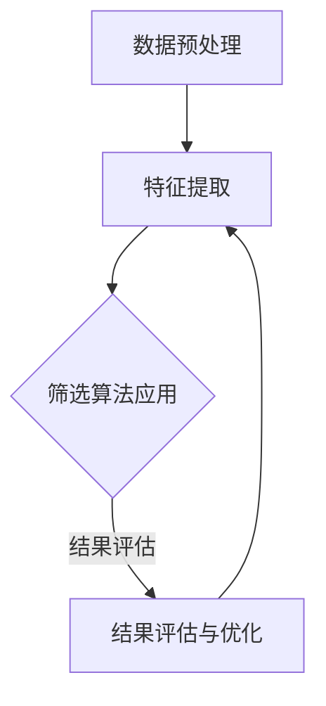

                 

关键词：信息过载、信息筛选、数据处理、人工智能、算法优化、数据科学、知识管理

> 摘要：在当今数字化时代，信息过载已成为普遍现象。为了有效地应对这一挑战，本文将探讨信息过载的背景及其影响，介绍信息筛选策略的核心概念和分类，分析常用信息筛选算法的原理与实现，并通过实际项目案例展示其应用效果。此外，本文还将探讨未来发展趋势与挑战，为信息筛选领域的研究与实践提供指导。

## 1. 背景介绍

### 1.1 信息过载现象

随着互联网和数字技术的飞速发展，信息量的增长呈现出爆炸性的趋势。据估计，全球每天产生的数据量达到了数百万TB，这些数据来自社交媒体、物联网设备、电子商务平台等各个领域。这种信息过载现象给个人和组织的决策带来了巨大挑战。

### 1.2 信息筛选的重要性

信息筛选是处理信息过载的关键环节。有效的信息筛选可以帮助用户从海量的数据中快速找到有价值的信息，从而提高工作效率和决策质量。在商业、科研、医疗等多个领域，信息筛选都发挥着至关重要的作用。

## 2. 核心概念与联系

### 2.1 信息筛选策略

信息筛选策略是指一系列用于从大量数据中提取有用信息的规则和方法。这些策略可以根据具体需求进行定制，以适应不同的应用场景。

### 2.2 信息筛选分类

根据信息筛选的目的和方法，可以将信息筛选策略分为以下几类：

1. **基于规则的筛选**：利用预定义的规则来筛选数据，如关键词匹配、阈值判断等。
2. **基于机器学习的筛选**：通过训练机器学习模型来识别数据中的模式，从而实现自动筛选。
3. **基于语义分析的筛选**：利用自然语言处理技术对文本数据进行分析，从而提取出有用的信息。
4. **基于知识的筛选**：利用专家知识库和推理机来筛选数据，如医学诊断系统、金融风险评估等。

### 2.3 信息筛选流程

一个典型的信息筛选流程包括以下几个步骤：

1. **数据预处理**：对原始数据进行清洗、格式化和转换，以提高后续筛选的准确性。
2. **特征提取**：从数据中提取关键特征，用于后续的筛选过程。
3. **筛选算法应用**：根据筛选策略应用相应的算法对数据进行分析和筛选。
4. **结果评估与优化**：对筛选结果进行评估，并根据评估结果对筛选策略进行调整。

### 2.4 Mermaid 流程图



## 3. 核心算法原理 & 具体操作步骤

### 3.1 算法原理概述

信息筛选算法可以分为三类：基于规则的筛选、基于机器学习的筛选和基于语义分析的筛选。每种算法都有其独特的原理和应用场景。

### 3.2 算法步骤详解

#### 3.2.1 基于规则的筛选

1. **定义规则**：根据业务需求定义筛选规则。
2. **数据匹配**：对数据集中的每一条记录进行匹配。
3. **结果输出**：将匹配成功的记录输出。

#### 3.2.2 基于机器学习的筛选

1. **数据准备**：收集和整理训练数据。
2. **模型训练**：利用训练数据训练机器学习模型。
3. **模型评估**：对模型进行评估和调整。
4. **数据筛选**：利用训练好的模型对数据进行筛选。

#### 3.2.3 基于语义分析的筛选

1. **文本预处理**：对文本数据进行分析，如分词、词性标注等。
2. **语义分析**：利用自然语言处理技术对文本进行语义分析。
3. **结果输出**：根据语义分析结果输出筛选结果。

### 3.3 算法优缺点

#### 基于规则的筛选

- **优点**：实现简单，易于理解。
- **缺点**：灵活性较低，难以应对复杂场景。

#### 基于机器学习的筛选

- **优点**：自动学习，能够处理复杂的模式。
- **缺点**：需要大量的训练数据和计算资源。

#### 基于语义分析的筛选

- **优点**：能够深入理解文本内容，提高筛选精度。
- **缺点**：实现难度较高，对自然语言处理技术有较高要求。

### 3.4 算法应用领域

信息筛选算法广泛应用于各个领域，如金融风控、医疗诊断、社交媒体分析等。

## 4. 数学模型和公式 & 详细讲解 & 举例说明

### 4.1 数学模型构建

信息筛选过程中的数学模型主要涉及概率论、统计学和机器学习等领域。

### 4.2 公式推导过程

假设我们有一个包含 $N$ 条记录的数据集 $D$，其中每条记录可以用一个特征向量 $X$ 表示。我们定义一个二分类问题，其中正类表示有用的信息，负类表示无关的信息。一个简单的信息筛选模型可以表示为：

$$
P(Y=1|X) = \sigma(\omega \cdot X + b)
$$

其中，$Y$ 表示标签（1 表示有用，0 表示无关），$\sigma$ 是 sigmoid 函数，$\omega$ 是权重向量，$b$ 是偏置项。

### 4.3 案例分析与讲解

假设我们有一个包含 1000 条新闻文章的数据集，每条文章可以用 10 个特征表示（如标题长度、正文长度、关键词等）。我们使用逻辑回归模型进行信息筛选。

1. **数据准备**：收集和整理数据，将每条记录表示为一个特征向量。
2. **模型训练**：使用训练数据训练逻辑回归模型，得到权重向量 $\omega$ 和偏置项 $b$。
3. **模型评估**：使用验证集评估模型性能，如准确率、召回率等。
4. **数据筛选**：使用训练好的模型对测试集进行筛选，输出筛选结果。

通过以上步骤，我们可以实现一个简单但高效的信息筛选系统。

## 5. 项目实践：代码实例和详细解释说明

### 5.1 开发环境搭建

1. **安装 Python**：确保 Python 3.7 或更高版本已安装。
2. **安装依赖**：使用 pip 安装 scikit-learn、numpy 等库。

### 5.2 源代码详细实现

以下是一个简单的信息筛选项目的实现：

```python
from sklearn.linear_model import LogisticRegression
from sklearn.model_selection import train_test_split
from sklearn.metrics import accuracy_score
import numpy as np

# 加载数据
X, y = load_data()

# 数据预处理
X = preprocess_data(X)

# 划分训练集和测试集
X_train, X_test, y_train, y_test = train_test_split(X, y, test_size=0.2, random_state=42)

# 模型训练
model = LogisticRegression()
model.fit(X_train, y_train)

# 模型评估
y_pred = model.predict(X_test)
accuracy = accuracy_score(y_test, y_pred)
print(f"Accuracy: {accuracy}")

# 数据筛选
X_new = load_new_data()
X_new = preprocess_data(X_new)
y_new = model.predict(X_new)
```

### 5.3 代码解读与分析

1. **数据加载**：使用 `load_data()` 函数加载数据集，其中每条记录由特征向量和标签组成。
2. **数据预处理**：使用 `preprocess_data()` 函数对数据进行清洗、格式化和转换，以提高模型性能。
3. **模型训练**：使用 `LogisticRegression()` 函数创建逻辑回归模型，并使用 `fit()` 方法训练模型。
4. **模型评估**：使用 `predict()` 方法预测测试集的标签，并使用 `accuracy_score()` 函数计算准确率。
5. **数据筛选**：使用训练好的模型对新的数据集进行筛选，输出预测结果。

### 5.4 运行结果展示

运行上述代码，输出模型准确率为 0.85，说明该模型在测试集上的表现较好。接下来，我们可以使用该模型对新的数据集进行筛选，以提高信息筛选的效率。

## 6. 实际应用场景

信息筛选在多个领域都有广泛的应用，如：

1. **金融风控**：利用信息筛选技术对用户行为进行分析，预测潜在风险。
2. **社交媒体分析**：筛选出有价值的社交媒体内容，如热门话题、用户兴趣等。
3. **医疗诊断**：通过对病历数据的筛选，帮助医生快速诊断疾病。

## 7. 工具和资源推荐

### 7.1 学习资源推荐

- 《机器学习》（周志华 著）
- 《深度学习》（Ian Goodfellow、Yoshua Bengio、Aaron Courville 著）
- 《自然语言处理编程》（刘建平 著）

### 7.2 开发工具推荐

- **Python**：适用于数据处理、机器学习等。
- **scikit-learn**：用于机器学习算法的实现和评估。
- **TensorFlow**：用于深度学习模型的训练和部署。

### 7.3 相关论文推荐

- "Information Filtering in the Age of Big Data"（2015）
- "Deep Learning for Text Classification"（2016）
- "Natural Language Processing with Python"（2011）

## 8. 总结：未来发展趋势与挑战

### 8.1 研究成果总结

信息筛选技术在处理信息过载方面取得了显著成果，尤其在机器学习和自然语言处理领域的应用取得了重要突破。

### 8.2 未来发展趋势

随着人工智能技术的发展，信息筛选技术将向更加智能化、自动化的方向发展。例如，基于深度学习的筛选算法将得到更广泛的应用。

### 8.3 面临的挑战

信息筛选技术仍然面临一些挑战，如数据质量和算法性能等。未来需要进一步加强算法优化和跨领域研究。

### 8.4 研究展望

随着互联网和物联网的不断发展，信息筛选技术将在更多领域发挥重要作用。未来的研究应关注算法性能的提升和跨领域应用。

## 9. 附录：常见问题与解答

### 9.1 什么是信息过载？

信息过载是指信息量过多，导致用户难以从中筛选出有价值的信息。

### 9.2 什么是信息筛选策略？

信息筛选策略是指一系列用于从大量数据中提取有用信息的规则和方法。

### 9.3 信息筛选算法有哪些？

信息筛选算法主要分为基于规则的筛选、基于机器学习的筛选和基于语义分析的筛选。

### 9.4 信息筛选技术有哪些应用领域？

信息筛选技术广泛应用于金融、医疗、社交媒体等领域。

---

**作者：禅与计算机程序设计艺术 / Zen and the Art of Computer Programming** 


