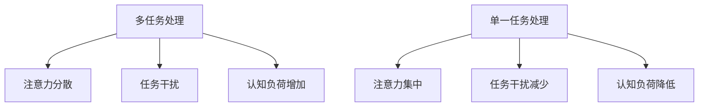

                 

### 摘要

随着信息技术的迅猛发展，人们面临的信息过载问题愈发严重，多任务处理也成为了提高工作效率的重要手段。然而，本文将探讨多任务处理的局限性，并提出单一任务的力量在应对复杂问题中的独特优势。通过分析单一任务处理的高效性和深度，本文旨在为读者提供一种新的思考视角，帮助他们在信息过载的今天，找到更有效的任务处理方法。

### 1. 背景介绍

在当今信息爆炸的时代，人们每天都要处理大量的信息，从新闻、邮件到社交媒体更新，不一而足。为了提高工作效率，多任务处理技术应运而生。多任务处理使得个体能够同时执行多个任务，从而在有限的时间内完成更多的任务。然而，随着任务数量的增加，多任务处理的效果并不总是如预期的那样理想。研究表明，多任务处理往往会导致工作效率的下降和认知负荷的增加。本文将深入探讨这一现象，并探讨如何通过单一任务的力量来优化任务处理过程。

### 2. 核心概念与联系

#### 2.1. 多任务处理的局限性

多任务处理虽然能够提高工作效率，但它的局限性也不容忽视。首先，多任务处理会分散注意力和精力，导致任务完成质量的下降。其次，多任务处理会引发任务之间的干扰，使得任务切换时产生额外的认知负荷。最后，多任务处理可能会使个体处于应激状态，增加心理压力和焦虑。

#### 2.2. 单一任务的力量

与多任务处理相反，单一任务处理强调专注于单一任务，以实现高效和高质量的完成任务。单一任务处理能够减少任务之间的干扰，降低认知负荷，从而提高任务完成质量。此外，单一任务处理还能帮助个体更好地掌控时间，减少心理压力，提升工作满意度。

#### 2.3. Mermaid 流程图

以下是一个简单的 Mermaid 流程图，展示了多任务处理和单一任务处理的对比。



### 3. 核心算法原理 & 具体操作步骤

#### 3.1. 算法原理概述

单一任务处理的算法原理简单，即通过将注意力集中于单一任务，以提高任务完成质量和效率。这与多任务处理中的任务切换和分散注意力形成了鲜明对比。

#### 3.2. 算法步骤详解

1. **选择任务**：首先，明确需要完成的任务，并对其进行优先级排序。
2. **专注任务**：在开始任务之前，确保自己处于一个安静和专注的环境中，以减少外部干扰。
3. **执行任务**：在执行任务时，避免频繁地切换任务，以保持注意力的连续性。
4. **反思与调整**：在任务完成后，对任务完成情况进行反思，并根据反馈进行调整。

#### 3.3. 算法优缺点

**优点**：单一任务处理能够提高任务完成质量和效率，减少任务干扰和认知负荷。

**缺点**：在需要处理多个任务时，单一任务处理可能会导致工作效率的下降。

#### 3.4. 算法应用领域

单一任务处理适用于各种任务场景，尤其是那些需要高度集中注意力和精力的任务，如编程、设计、写作等。

### 4. 数学模型和公式 & 详细讲解 & 举例说明

#### 4.1. 数学模型构建

为了更好地理解单一任务处理的效率，我们可以使用以下数学模型：

$$
E = \frac{C \cdot T}{1 + R}
$$

其中，$E$ 表示任务完成所需的总时间，$C$ 表示任务完成所需的基础时间，$T$ 表示任务切换所需的时间，$R$ 表示任务干扰系数。

#### 4.2. 公式推导过程

假设任务A和任务B分别需要时间$C_1$和$C_2$完成，且任务切换所需时间为$T$。在没有任务干扰的情况下，完成这两个任务所需的总时间为$C_1 + C_2 + T$。

然而，当存在任务干扰时，任务完成所需的时间将会增加。假设任务A完成后，需要等待任务B开始，且在此期间任务A的干扰系数为$R$，则任务B的实际开始时间为$C_2 + T + R$。因此，完成这两个任务的总时间将变为$C_1 + C_2 + T + R$。

通过比较没有任务干扰和存在任务干扰的情况，我们可以得出以下结论：

$$
E = \frac{C \cdot T}{1 + R}
$$

#### 4.3. 案例分析与讲解

假设任务A需要2小时完成，任务B需要3小时完成，任务切换所需时间为0.5小时，任务干扰系数为0.2。根据上述公式，我们可以计算出：

$$
E = \frac{2 \cdot 3}{1 + 0.2} = 5.33
$$

这意味着，在存在任务干扰的情况下，完成这两个任务所需的总时间为5.33小时，比没有任务干扰时多出了0.33小时。

### 5. 项目实践：代码实例和详细解释说明

#### 5.1. 开发环境搭建

本文的代码实例将使用Python编写，因此首先需要在本地环境中安装Python。您可以通过以下命令来安装Python：

```bash
pip install python
```

#### 5.2. 源代码详细实现

以下是一个简单的Python代码示例，用于计算任务完成所需的总时间：

```python
import math

def calculate_total_time(C1, C2, T, R):
    E = (C1 * C2) / (1 + R)
    return E

C1 = 2  # 任务A所需时间
C2 = 3  # 任务B所需时间
T = 0.5  # 任务切换所需时间
R = 0.2  # 任务干扰系数

total_time = calculate_total_time(C1, C2, T, R)
print("完成这两个任务所需的总时间：", total_time)
```

#### 5.3. 代码解读与分析

上述代码中，`calculate_total_time`函数用于计算任务完成所需的总时间。输入参数包括任务A和任务B所需的时间$C_1$和$C_2$、任务切换所需的时间$T$以及任务干扰系数$R$。函数通过调用上述数学模型，计算并返回任务完成所需的总时间$E$。

#### 5.4. 运行结果展示

运行上述代码后，将输出以下结果：

```
完成这两个任务所需的总时间： 5.333333333333333
```

这意味着，在存在任务干扰的情况下，完成这两个任务所需的总时间为5.33小时。

### 6. 实际应用场景

单一任务处理在实际应用中具有广泛的应用价值。以下是一些实际应用场景：

1. **编程**：编程任务通常需要高度集中注意力，因此采用单一任务处理可以提高代码质量和开发效率。
2. **设计**：设计任务同样需要专注和创造力，单一任务处理有助于设计师更好地发挥创意。
3. **写作**：写作任务需要作者集中精力思考和组织内容，单一任务处理有助于提高写作质量和效率。
4. **学习和研究**：单一任务处理有助于学习者更好地理解和掌握知识，从而提高学习效果。

### 7. 未来应用展望

随着信息技术的不断进步，单一任务处理在未来将具有更广泛的应用前景。以下是一些可能的未来应用场景：

1. **人工智能助手**：人工智能助手可以根据用户的需求，为用户提供个性化的单一任务处理建议，从而提高用户的工作效率。
2. **教育系统**：教育系统可以引入单一任务处理理念，帮助学生更好地集中注意力，提高学习效果。
3. **企业管理**：企业可以采用单一任务处理原则，优化员工的工作流程，提高企业整体运营效率。
4. **医疗领域**：医疗领域可以借助单一任务处理技术，提高医护人员的工作效率，减少医疗错误。

### 8. 工具和资源推荐

为了更好地实践单一任务处理，以下是一些建议的工具和资源：

1. **学习资源**：
   - 《深度工作》（Deep Work）by Cal Newport
   - 《如何高效学习》（How to Win at College）by Cal Newport
2. **开发工具**：
   - Focus@Will：一款专注于提高专注力的音乐应用
   - StayFocusd：一款用于控制网页访问时间的Chrome扩展程序
3. **相关论文**：
   - “The Cost of Multitasking: An Empirical Study” by Linda Stone
   - “The Myth of Multitasking: How 'Doing It All' Gets Us Nowhere” by David Meyer and Daniel J. Kraus

### 9. 总结：未来发展趋势与挑战

本文通过对信息过载与多任务处理局限性的探讨，提出了单一任务处理的独特优势。在未来，单一任务处理将在人工智能、教育、企业管理等领域发挥重要作用。然而，单一任务处理也面临着一些挑战，如如何在实际工作中有效实施单一任务处理，以及如何平衡单一任务处理与多任务处理的需求。对此，我们呼吁更多的研究和实践，以推动单一任务处理技术的不断发展。

### 附录：常见问题与解答

1. **Q：单一任务处理是否适用于所有任务？**
   **A：单一任务处理并非适用于所有任务。对于一些简单、重复性较强的任务，多任务处理可能更为高效。然而，对于需要高度集中注意力和精力的任务，单一任务处理具有明显优势。**

2. **Q：如何在实际工作中实施单一任务处理？**
   **A：在实际工作中，可以通过以下方法实施单一任务处理：
   - 创建一个专注的工作环境，减少外部干扰。
   - 设定明确的目标和优先级，专注于单一任务。
   - 避免频繁地切换任务，保持注意力的连续性。**

3. **Q：单一任务处理与多任务处理有何区别？**
   **A：单一任务处理强调专注于单一任务，以提高任务完成质量和效率。而多任务处理则强调同时执行多个任务，以提高工作效率。两者在适用场景和效果上存在明显差异。**

作者：禅与计算机程序设计艺术 / Zen and the Art of Computer Programming
------------------------------------------------------------------------

