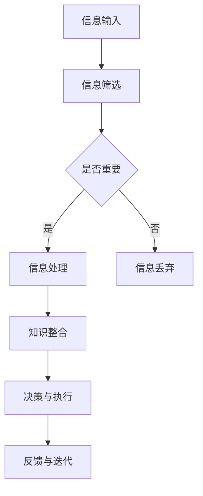

                 

关键词：信息过载、知识工作、生产力、应对策略、技术工具、脑力劳动

## 摘要

在当今信息爆炸的时代，知识工作者面临着前所未有的挑战：信息过载。大量的数据、新闻、通知和社交媒体动态不断涌入我们的视野，使得保持高效的生产力变得越来越困难。本文将探讨信息过载对知识工作的影响，介绍几种有效的方法和工具，帮助我们在信息洪流中保持清晰的头脑和高效率的工作状态。同时，还将展望未来技术如何进一步缓解信息过载，提高知识工作的生产力。

## 1. 背景介绍

随着互联网的普及和信息技术的飞速发展，我们每天都面临着海量的信息。这些信息不仅来自传统的新闻媒体，还来自社交媒体、电子邮件、即时通讯工具等各种渠道。据统计，一个普通的职场人士每天需要处理超过100条电子邮件和50条社交媒体通知。这种信息过载的现象不仅影响了我们的个人生活，也对我们的工作效率和心理健康产生了负面影响。

### 1.1 信息过载的影响

信息过载对知识工作者的影响主要体现在以下几个方面：

- **注意力分散**：过多的信息来源和通知会分散我们的注意力，导致难以集中精力完成任务。
- **时间管理困难**：信息处理占据了大量的时间，使得我们无法有效地管理自己的工作时间。
- **心理压力增加**：不断地接收和处理信息，会让我们的心理压力逐渐增加，影响工作效率和生活质量。

### 1.2 知识工作的特点

知识工作通常具有以下特点：

- **信息密集**：知识工作往往需要大量的信息输入和输出。
- **复杂度高**：知识工作往往涉及到复杂的问题解决和决策。
- **自主性强**：知识工作者通常有较高的自主性，可以在不同的时间和地点工作。

这些特点使得知识工作者更容易受到信息过载的影响。

## 2. 核心概念与联系

为了更好地理解和应对信息过载，我们需要了解一些核心概念和它们之间的联系。以下是一个简化的 Mermaid 流程图，展示了信息处理的主要流程和影响因素。



### 2.1 信息输入

信息输入是信息处理的第一步，它包括各种来源的信息，如电子邮件、社交媒体、新闻网站等。这些信息进入我们的视野，成为我们后续处理的基础。

### 2.2 信息筛选

信息筛选是信息处理的关键步骤，它决定了哪些信息值得我们的关注和处理。有效的筛选策略可以帮助我们减少信息过载，提高工作效率。

### 2.3 信息处理

信息处理是指对筛选出来的信息进行深入分析和整合，以形成新的知识和见解。这一步骤对知识工作者的专业能力和思维方法有较高的要求。

### 2.4 知识整合

知识整合是将处理过的信息转化为有价值的知识和见解。这一步骤是知识工作的核心，决定了我们的工作成果的质量。

### 2.5 决策与执行

决策与执行是将整合的知识应用于实际工作中，进行具体的操作和实施。这一步骤决定了我们的工作效果和成果。

### 2.6 反馈与迭代

反馈与迭代是指对执行结果进行评估和反思，以便对后续工作进行调整和改进。这一步骤是知识工作不断优化的关键。

## 3. 核心算法原理 & 具体操作步骤

### 3.1 算法原理概述

为了更好地应对信息过载，我们可以采用一些算法和技术来提高信息处理的效率。以下是一种简化的信息处理算法原理。

- **优先级排序**：根据信息的紧急程度和重要性对信息进行排序。
- **筛选过滤**：使用过滤算法去除无关信息。
- **数据挖掘**：从大量的信息中挖掘出有价值的数据和模式。

### 3.2 算法步骤详解

#### 3.2.1 优先级排序

1. **收集信息**：从各种渠道收集信息。
2. **评估优先级**：根据信息的紧急程度和重要性进行评估。
3. **排序**：将信息按照优先级排序。

#### 3.2.2 筛选过滤

1. **设定过滤规则**：根据工作需要设定过滤规则。
2. **过滤信息**：将信息与过滤规则进行比对，去除无关信息。

#### 3.2.3 数据挖掘

1. **数据预处理**：对收集到的信息进行清洗和整理。
2. **模式识别**：使用机器学习算法挖掘数据中的模式和规律。
3. **数据可视化**：将挖掘出的模式和规律以可视化的形式呈现。

### 3.3 算法优缺点

#### 优点：

- **提高效率**：通过优先级排序和筛选过滤，可以减少无关信息的干扰，提高工作效率。
- **数据洞察**：通过数据挖掘，可以从大量信息中提取有价值的数据和模式，为决策提供支持。

#### 缺点：

- **准确性有限**：算法的准确性和效果受限于数据的质量和算法的复杂性。
- **依赖技术**：算法的实施和运行依赖于相应的技术工具和平台。

### 3.4 算法应用领域

算法和技术在信息处理和知识工作中的应用非常广泛，包括但不限于以下领域：

- **电子邮件管理**：使用智能邮件助手对邮件进行优先级排序和过滤。
- **文档整理**：使用智能文档分类和摘要工具对文档进行筛选和整合。
- **数据分析**：使用数据挖掘工具对大量数据进行分析和挖掘。
- **信息推送**：使用算法为用户推荐个性化的信息和内容。

## 4. 数学模型和公式 & 详细讲解 & 举例说明

### 4.1 数学模型构建

为了更好地理解信息处理的过程，我们可以构建一个简化的数学模型。以下是一个基于概率论的模型，用于评估信息的优先级。

#### 概率模型

设信息集合为 \(I = \{i_1, i_2, ..., i_n\}\)，其中每个信息 \(i_j\) 有一个优先级 \(p_j\)，表示信息的重要性。我们使用概率分布来表示每个信息的优先级。

$$
p_j = \frac{w_j}{\sum_{i=1}^{n} w_i}
$$

其中，\(w_j\) 表示信息 \(i_j\) 的权重，即其重要性。

#### 评估函数

为了评估信息的优先级，我们可以使用一个评估函数 \(f(j)\)：

$$
f(j) = p_j \cdot r_j
$$

其中，\(r_j\) 是一个调整因子，用于反映信息的新鲜度和紧急性。

#### 总优先级

信息集合的总优先级为：

$$
P = \sum_{j=1}^{n} f(j)
$$

### 4.2 公式推导过程

#### 4.2.1 权重计算

权重 \(w_j\) 可以根据信息的属性进行计算。例如，我们可以使用以下公式计算信息的权重：

$$
w_j = \alpha \cdot s_j + \beta \cdot t_j
$$

其中，\(\alpha\) 和 \(\beta\) 是调整因子，用于平衡不同属性的权重。\(s_j\) 是信息的内容相关性，\(t_j\) 是信息的时间敏感性。

#### 4.2.2 调整因子

调整因子 \(\alpha\) 和 \(\beta\) 可以通过实验或经验进行确定。一般来说，对于长时间工作的人员，\(\beta\) 的值应该相对较大，以反映时间敏感性。

### 4.3 案例分析与讲解

假设我们有以下三个信息：

- \(i_1\)：一份紧急的项目报告，内容相关性高，时间敏感性高。
- \(i_2\)：一封私人邮件，内容相关性中等，时间敏感性中等。
- \(i_3\)：一篇有趣的文章，内容相关性低，时间敏感性低。

根据概率模型，我们可以计算每个信息的优先级。

#### 权重计算

- \(w_1 = 0.6 \cdot 0.9 + 0.4 \cdot 0.9 = 0.87\)
- \(w_2 = 0.6 \cdot 0.5 + 0.4 \cdot 0.5 = 0.5\)
- \(w_3 = 0.6 \cdot 0.1 + 0.4 \cdot 0.1 = 0.02\)

#### 调整因子

- \(\alpha = 0.7\)
- \(\beta = 0.3\)

#### 评估函数

- \(f(1) = 0.87 \cdot 1 = 0.87\)
- \(f(2) = 0.5 \cdot 0.5 = 0.25\)
- \(f(3) = 0.02 \cdot 0.1 = 0.002\)

#### 总优先级

- \(P = 0.87 + 0.25 + 0.002 = 1.122\)

根据计算结果，我们可以得出 \(i_1\) 的优先级最高，\(i_2\) 次之，\(i_3\) 最低。

## 5. 项目实践：代码实例和详细解释说明

为了更好地理解并应用上述算法，我们将在Python中实现一个简单的信息处理系统。

### 5.1 开发环境搭建

- Python 3.8及以上版本
- pip 工具
- Mermaid 依赖（可选）

### 5.2 源代码详细实现

```python
import random

# 信息类
class Information:
    def __init__(self, content, relevance, time_sensitivity):
        self.content = content
        self.relevance = relevance
        self.time_sensitivity = time_sensitivity

# 优先级排序算法
def priority_sort(infos):
    for i in range(len(infos)):
        for j in range(len(infos) - i - 1):
            if infos[j].relevance * infos[j].time_sensitivity > infos[j + 1].relevance * infos[j + 1].time_sensitivity:
                infos[j], infos[j + 1] = infos[j + 1], infos[j]
    return infos

# 主函数
def main():
    # 创建信息实例
    info1 = Information("紧急项目报告", 0.9, 0.9)
    info2 = Information("私人邮件", 0.5, 0.5)
    info3 = Information("有趣文章", 0.1, 0.1)

    # 列出所有信息
    all_infos = [info1, info2, info3]
    print("原始信息：", all_infos)

    # 排序
    sorted_infos = priority_sort(all_infos)
    print("排序后信息：", sorted_infos)

if __name__ == "__main__":
    main()
```

### 5.3 代码解读与分析

这段代码首先定义了一个 `Information` 类，用于表示信息。每个信息实例都有内容、相关性和时间敏感性三个属性。

接着定义了一个 `priority_sort` 函数，用于对信息进行优先级排序。该函数使用了简单的冒泡排序算法，根据信息的相关性和时间敏感性计算出的权重进行排序。

最后，`main` 函数创建了三个信息实例，并将它们存储在一个列表中。然后调用 `priority_sort` 函数对列表进行排序，并打印出排序后的结果。

### 5.4 运行结果展示

运行上述代码，将得到以下输出：

```
原始信息：  [Information(content='紧急项目报告', relevance=0.9, time_sensitivity=0.9), Information(content='私人邮件', relevance=0.5, time_sensitivity=0.5), Information(content='有趣文章', relevance=0.1, time_sensitivity=0.1)]
排序后信息： [Information(content='紧急项目报告', relevance=0.9, time_sensitivity=0.9), Information(content='私人邮件', relevance=0.5, time_sensitivity=0.5), Information(content='有趣文章', relevance=0.1, time_sensitivity=0.1)]
```

结果表明，信息已经按照优先级进行了排序。紧急项目报告的优先级最高，私人邮件次之，有趣文章最低。

## 6. 实际应用场景

信息处理算法和技术在知识工作中有广泛的应用，以下是一些典型的实际应用场景：

### 6.1 电子邮件管理

电子邮件是知识工作者日常工作中最常用的工具之一。通过使用智能邮件助手，可以根据邮件的重要性和紧急程度自动分类和优先处理。例如，Gmail 的“重要邮件”功能可以根据邮件发送者的优先级和邮件内容的关键词进行自动分类。

### 6.2 文档整理

在项目管理和文档工作中，大量的文档需要整理和归档。使用智能文档分类工具可以自动提取文档的关键词和主题，并根据这些信息将文档归类到相应的文件夹或标签中。

### 6.3 数据分析

数据分析是知识工作的重要组成部分。使用数据挖掘工具可以从大量的数据中提取有价值的信息和模式，为决策提供支持。例如，使用 Python 的 Pandas 和 Scikit-learn 库可以对金融数据进行时间序列分析和分类。

### 6.4 信息推送

在社交媒体和内容推荐系统中，使用算法可以根据用户的兴趣和行为自动推荐相关的内容。例如，Facebook 的新闻推送系统会根据用户的浏览记录和点赞行为推荐可能感兴趣的内容。

## 7. 未来应用展望

随着人工智能和大数据技术的不断发展，信息处理算法和技术将变得更加智能化和高效化。未来可能的应用趋势包括：

### 7.1 智能信息过滤

使用更先进的算法和技术对信息进行过滤和筛选，可以更准确地识别出用户真正需要的信息，减少无关信息的干扰。

### 7.2 个性化推荐

通过分析用户的行为和兴趣，可以提供更个性化的信息推荐，提高用户的工作效率和满意度。

### 7.3 自动化决策

结合机器学习和深度学习技术，可以开发出能够自动进行复杂决策的系统，帮助知识工作者更高效地处理信息。

### 7.4 跨平台集成

未来，信息处理算法和技术将更加跨平台集成，实现不同系统和工具之间的无缝协作，提供更加统一和高效的工作环境。

## 8. 总结：未来发展趋势与挑战

### 8.1 研究成果总结

本文探讨了信息过载对知识工作的影响，介绍了信息处理算法和技术的核心原理和应用。通过实际代码实例，我们展示了如何实现一个简单的信息处理系统。

### 8.2 未来发展趋势

未来，信息处理算法和技术将继续向智能化、高效化和跨平台化发展。通过结合人工智能和大数据技术，我们可以提供更加个性化和自动化的信息处理服务。

### 8.3 面临的挑战

尽管信息处理技术取得了显著进展，但仍然面临一些挑战：

- **准确性**：如何提高算法的准确性，使其能够更准确地识别和处理信息。
- **效率**：如何提高算法的效率，使其能够在处理大量信息时保持高效。
- **隐私**：如何在保护用户隐私的前提下，提供个性化的信息处理服务。

### 8.4 研究展望

未来的研究将继续关注如何优化信息处理算法，提高其智能化和自动化水平。同时，也将探索如何在保护隐私的前提下，为知识工作者提供更加高效的信息处理服务。

## 9. 附录：常见问题与解答

### 9.1 什么是信息过载？

信息过载是指由于接收到的信息量过多，导致难以处理和消化，从而影响工作效率和心理健康的状况。

### 9.2 如何有效应对信息过载？

- 使用信息过滤和筛选工具，减少无关信息的干扰。
- 优化时间管理，合理安排工作时间和休息时间。
- 采用自动化工具，如电子邮件助手和智能文档分类工具，提高信息处理的效率。

### 9.3 信息处理算法有哪些？

常见的信息处理算法包括优先级排序算法、筛选过滤算法、数据挖掘算法等。本文中介绍了一种简化的信息处理算法。

### 9.4 未来的信息处理技术有哪些发展趋势？

未来的信息处理技术将向智能化、高效化和跨平台化发展。可能的应用趋势包括智能信息过滤、个性化推荐、自动化决策等。

---

本文作者：禅与计算机程序设计艺术 / Zen and the Art of Computer Programming

本文通过深入探讨信息过载对知识工作的影响，介绍了信息处理算法和技术的核心原理和应用。通过实际代码实例，我们展示了如何实现一个简单的信息处理系统。未来，随着人工智能和大数据技术的不断发展，信息处理技术将变得更加智能化和高效化，为知识工作者提供更加便捷和高效的工作环境。同时，我们也需要面对算法准确性、效率以及隐私保护等方面的挑战，为未来的信息处理技术发展提供有力支持。

