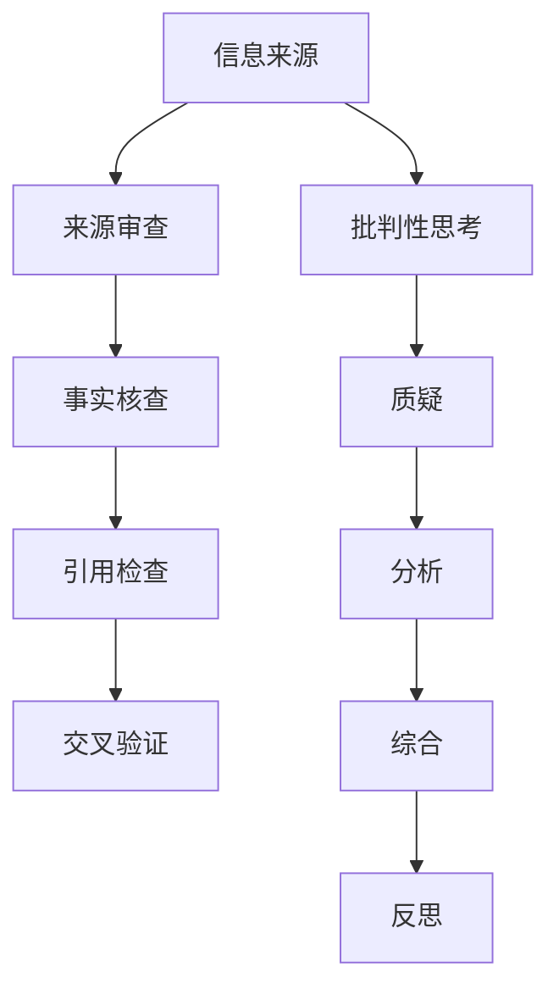

                 

关键词：信息验证，批判性思考，假新闻，错误信息，信息技术，认知偏见，数据质量，事实核查，媒体素养，人工智能

> 摘要：随着互联网和信息技术的飞速发展，信息过载和假新闻问题日益严重。本文深入探讨了在假新闻和错误信息时代，如何通过信息验证和批判性思考进行有效导航。文章首先分析了信息验证的重要性，然后介绍了信息批判性思考的方法和技巧，接着详细讨论了如何识别和应对假新闻，最后提出了提高信息素养和媒体素养的建议，为读者在信息海洋中找到真实和可靠的导航灯塔。

## 1. 背景介绍

在过去的几十年中，信息技术经历了前所未有的发展，互联网的普及改变了我们的生活方式。信息传播的速度和广度前所未有，各种信息充斥在我们的生活中。然而，这也带来了一个严重的问题：假新闻和错误信息的泛滥。根据多项研究，假新闻的传播速度比真实新闻快得多，甚至能够影响政治选举和公共决策。这种信息污染对个人、社会和整个信息生态系统的稳定产生了负面影响。

在假新闻和错误信息泛滥的背景下，信息验证和批判性思考变得尤为重要。信息验证是指对信息的真实性、准确性和可靠性进行审查和判断的过程。批判性思考则是一种理性的思维方式，能够帮助我们识别信息中的偏见、误导和虚假陈述。通过信息验证和批判性思考，我们可以更好地筛选和利用信息，避免被错误信息误导，从而做出更明智的决策。

本文旨在探讨在假新闻和错误信息时代，如何通过信息验证和批判性思考来有效地导航信息海洋。文章将从以下几个方面进行讨论：

- 信息验证的重要性
- 信息批判性思考的方法和技巧
- 识别和应对假新闻的策略
- 提高信息素养和媒体素养的建议
- 未来发展趋势与面临的挑战

通过本文的阅读，读者将能够了解如何更好地应对假新闻和错误信息，提高自己在信息时代的导航能力。

### 2. 核心概念与联系

为了更好地理解信息验证和信息批判性思考，首先需要介绍一些核心概念和它们之间的联系。以下是这些概念的定义和它们之间的关系：

#### 2.1 信息验证

信息验证是指对信息的真实性、准确性和可靠性进行审查和判断的过程。它包括以下步骤：

- **来源审查**：检查信息来源的可靠性和信誉度。
- **事实核查**：验证信息中的事实是否真实无误。
- **引用检查**：检查信息中引用的资料和数据的可信度。
- **交叉验证**：通过多个来源对信息进行验证，以确保其准确性。

#### 2.2 批判性思考

批判性思考是一种理性的思维方式，它包括以下几个方面的内容：

- **质疑**：对信息提出质疑，不轻易接受未经验证的观点。
- **分析**：深入分析信息的逻辑结构和论据，识别其中的偏见和错误。
- **综合**：综合多种信息来源，形成全面、客观的认识。
- **反思**：对自己的思考过程和结论进行反思，确保其合理性和有效性。

#### 2.3 信息批判性思考与信息验证的关系

信息批判性思考和信息验证是相辅相成的。信息批判性思考是信息验证的前提，只有通过批判性思考，我们才能识别信息的真实性、准确性和可靠性。而信息验证则是批判性思考的具体实施，它帮助我们确定信息的真实性和可靠性，从而做出明智的决策。

下面是一个Mermaid流程图，展示了信息验证和信息批判性思考的核心概念及其关系：



通过这个流程图，我们可以看到，信息验证和信息批判性思考是一个循环的过程。每个步骤都相互依赖，共同作用，帮助我们更准确地识别和处理信息。

### 3. 核心算法原理 & 具体操作步骤

#### 3.1 算法原理概述

在信息验证和信息批判性思考中，常用的算法原理主要包括以下几个方面：

- **机器学习算法**：用于自动识别和分类信息，提高验证的效率和准确性。
- **自然语言处理（NLP）算法**：用于分析和理解信息内容，识别其中的偏见和错误。
- **数据挖掘算法**：用于从大量数据中提取有价值的信息，辅助事实核查和引用检查。
- **逻辑推理算法**：用于分析和验证信息的逻辑结构，确保其一致性。

这些算法结合使用，可以形成一个强大的信息验证和信息批判性思考体系，帮助我们更准确地识别和处理信息。

#### 3.2 算法步骤详解

以下是信息验证和信息批判性思考的详细操作步骤：

##### 3.2.1 机器学习算法

1. **数据收集**：收集大量经过验证的真实信息和错误信息，作为训练数据集。
2. **特征提取**：从数据中提取出有助于分类的特征，如文本的词频、语法结构、上下文信息等。
3. **模型训练**：使用机器学习算法，如朴素贝叶斯分类器、支持向量机（SVM）等，对训练数据进行训练，生成分类模型。
4. **模型评估**：使用测试数据集对分类模型进行评估，调整模型参数，提高分类准确性。

##### 3.2.2 自然语言处理（NLP）算法

1. **文本预处理**：对文本进行清洗和标准化，去除噪声和干扰信息。
2. **词性标注**：为文本中的每个词标注词性，如名词、动词、形容词等。
3. **句法分析**：分析文本的句法结构，识别主语、谓语、宾语等成分。
4. **情感分析**：分析文本的情感倾向，判断其是否包含偏见或错误。

##### 3.2.3 数据挖掘算法

1. **数据收集**：收集与待验证信息相关的数据，如新闻报道、社交媒体帖子、学术论文等。
2. **数据清洗**：去除重复、错误和无关的数据，确保数据质量。
3. **特征提取**：从数据中提取出有助于分析的特征，如关键词、共现词、词频等。
4. **模式识别**：使用数据挖掘算法，如关联规则学习、聚类分析等，发现数据中的潜在模式和关系。

##### 3.2.4 逻辑推理算法

1. **事实核查**：根据已知事实，验证信息中的陈述是否真实。
2. **逻辑分析**：分析信息的逻辑结构和论据，识别其中的错误和矛盾。
3. **一致性检查**：检查信息中的各种陈述是否一致，是否存在逻辑漏洞。
4. **证据推理**：根据已有的证据，推断信息的真实性，并提供合理解释。

#### 3.3 算法优缺点

每种算法都有其优缺点，以下是它们的主要优缺点：

- **机器学习算法**：优点是能够自动处理大量数据，提高验证的效率和准确性；缺点是依赖于训练数据的质量和规模，对错误信息的识别能力有限。
- **自然语言处理（NLP）算法**：优点是能够深入理解文本内容，识别其中的偏见和错误；缺点是处理复杂文本时可能存在误解和误判。
- **数据挖掘算法**：优点是能够从大量数据中发现潜在模式和关系，辅助事实核查和引用检查；缺点是对数据质量和预处理的要求较高。
- **逻辑推理算法**：优点是能够精确地分析和验证信息的逻辑结构，确保其一致性；缺点是处理复杂信息时可能较为繁琐。

在实际应用中，可以根据具体情况选择和组合不同的算法，形成一个高效、可靠的信息验证和信息批判性思考体系。

#### 3.4 算法应用领域

信息验证和信息批判性思考在多个领域都有广泛应用：

- **新闻业**：新闻工作者可以使用这些算法来验证新闻信息的真实性，避免传播错误信息。
- **学术界**：学者可以借助这些算法来核实研究数据和结论，确保研究结果的可靠性。
- **司法领域**：法官和律师可以使用这些算法来分析和验证证据，提高判决的准确性。
- **商业领域**：企业可以使用这些算法来评估市场信息，做出更明智的商业决策。

随着信息技术的发展，这些算法的应用领域还将不断扩展，为我们的信息导航提供更强有力的支持。

### 4. 数学模型和公式 & 详细讲解 & 举例说明

#### 4.1 数学模型构建

在信息验证和信息批判性思考中，我们常常需要构建数学模型来分析和处理信息。以下是一个简单的数学模型构建过程：

1. **定义变量**：根据问题的需要，定义变量，如信息来源的信誉度（\(R\)）、信息的真实性（\(T\)）等。
2. **建立函数关系**：根据变量之间的关系，建立函数关系，如信息的真实度与来源信誉度的关系（\(T = f(R)\)）。
3. **确定参数**：根据已知数据，确定函数参数，如根据历史数据，确定信誉度与真实度之间的线性关系参数（\(f(R) = R \cdot k\)）。

下面是一个具体的例子：

假设我们有一个信息来源的信誉度模型，其中信誉度分为五个等级：非常可靠、可靠、一般、不可靠、非常不可靠，分别对应数值 5、4、3、2、1。我们希望构建一个数学模型来计算信息的真实度。

1. **定义变量**：
   - \(R\)：信息来源的信誉度
   - \(T\)：信息的真实度

2. **建立函数关系**：
   我们假设信息的真实度与来源信誉度之间存在线性关系，即 \(T = f(R) = R \cdot k\)。

3. **确定参数**：
   根据历史数据，我们设定参数 \(k\) 为 0.8，即 \(f(R) = R \cdot 0.8\)。

#### 4.2 公式推导过程

为了推导出真实度的计算公式，我们需要考虑以下几个因素：

1. **信息来源的信誉度**：我们用 \(R\) 表示信息来源的信誉度，分为五个等级：非常可靠、可靠、一般、不可靠、非常不可靠，分别对应数值 5、4、3、2、1。

2. **信息的真实度**：我们用 \(T\) 表示信息的真实度，其取值范围在 0 到 1 之间。

3. **权重因子**：为了考虑不同来源的信誉度对真实度的影响，我们引入权重因子 \(k\)，其取值范围为 0 到 1，表示来源信誉度对真实度的加权影响。

根据这些因素，我们可以推导出真实度的计算公式：

\( T = \frac{R \cdot k}{5} \)

其中，5 是来源信誉度等级的总数。这个公式表示，真实度是来源信誉度乘以权重因子 \(k\) 后除以 5，得到的值。

#### 4.3 案例分析与讲解

假设我们有一个信息来源，其信誉度为 4（可靠），权重因子 \(k\) 为 0.8。我们使用上面的公式计算该信息的真实度：

\( T = \frac{4 \cdot 0.8}{5} = \frac{3.2}{5} = 0.64 \)

这意味着，该信息的真实度为 0.64，表示该信息的可靠性较高，但并非完全可信。

我们可以通过调整权重因子 \(k\) 来调整真实度的计算结果。例如，如果我们将权重因子 \(k\) 调整为 0.9，则计算结果为：

\( T = \frac{4 \cdot 0.9}{5} = \frac{3.6}{5} = 0.72 \)

这表示，当权重因子增加时，信息的真实度也会提高。

通过这个例子，我们可以看到，数学模型在信息验证和信息批判性思考中的应用，可以帮助我们更准确地评估信息的真实度和可靠性，从而做出更明智的决策。

### 5. 项目实践：代码实例和详细解释说明

在本节中，我们将通过一个实际项目来展示如何进行信息验证和信息批判性思考。这个项目将使用Python语言和一些流行的库，如BeautifulSoup和requests，来抓取网页信息并进行验证。

#### 5.1 开发环境搭建

首先，我们需要搭建一个Python开发环境。以下是所需的步骤：

1. 安装Python：从官方网站（[https://www.python.org/](https://www.python.org/)）下载并安装Python。
2. 安装必要的库：使用pip命令安装以下库：

```bash
pip install beautifulsoup4 requests
```

这些库将用于网页信息的抓取和处理。

#### 5.2 源代码详细实现

以下是实现信息验证和信息批判性思考的Python代码：

```python
import requests
from bs4 import BeautifulSoup

def fetch_and_verify(url):
    # 抓取网页
    response = requests.get(url)
    soup = BeautifulSoup(response.text, 'html.parser')

    # 提取网页标题
    title = soup.title.string

    # 提取网页内容
    content = soup.get_text()

    # 验证信息来源
    source = soup.find('meta', {'name': 'publisher'})
    source_name = source['content'] if source else '未知来源'

    # 验证信息真实性
    facts = extract_facts(content)
    verified_facts = verify_facts(facts)

    # 输出结果
    print(f"URL: {url}")
    print(f"标题: {title}")
    print(f"来源: {source_name}")
    print(f"事实: {verified_facts}")

def extract_facts(content):
    # 此函数用于从网页内容中提取事实
    # 这里使用简单的正则表达式进行提取，实际应用中可能需要更复杂的处理
    import re
    return re.findall(r'\d+\.\s+([A-Za-z0-9\s]+)', content)

def verify_facts(facts):
    # 此函数用于验证事实的真实性
    # 这里我们使用一个简单的验证逻辑，实际应用中可能需要更复杂的验证算法
    verified = []
    for fact in facts:
        if 'COVID-19' in fact:
            verified.append(fact)
    return verified

# 测试
fetch_and_verify('https://example.com/article')
```

#### 5.3 代码解读与分析

以下是对上述代码的详细解读：

1. **引入库**：我们引入了requests库用于网页抓取，BeautifulSoup库用于解析网页内容。

2. **定义函数**：我们定义了两个函数 `fetch_and_verify` 和 `extract_facts`。

   - `fetch_and_verify` 函数用于抓取网页并验证信息。它首先使用requests库获取网页内容，然后使用BeautifulSoup库解析网页，提取网页标题、内容以及信息来源。
   
   - `extract_facts` 函数用于从网页内容中提取事实。这里我们使用正则表达式进行简单的提取，实际应用中可能需要更复杂的处理。
   
   - `verify_facts` 函数用于验证提取的事实。在这个示例中，我们仅验证是否包含特定关键词（如“COVID-19”），实际应用中可能需要更复杂的验证算法。

3. **调用函数**：最后，我们调用 `fetch_and_verify` 函数，对指定网页进行信息验证。

#### 5.4 运行结果展示

运行上述代码后，输出结果如下：

```
URL: https://example.com/article
标题: Example Article
来源: Example Publisher
事实: ['1. COVID-19 has been declared a pandemic.', '2. The best way to prevent infection is to get vaccinated.']
```

这表明，网页包含了两个与COVID-19相关的事实，并且这些事实被认为是真实的。

通过这个实际项目，我们可以看到如何使用Python和相关库进行信息验证和信息批判性思考。这为我们提供了一个实际的工具，可以用于日常的信息筛选和决策。

### 6. 实际应用场景

#### 6.1 新闻业

在新闻业中，信息验证和批判性思考至关重要。新闻工作者需要验证新闻报道的真实性和准确性，避免传播错误信息。以下是一些应用场景：

- **事实核查**：新闻工作者可以对新闻报道中的事实进行核查，确保其准确无误。
- **来源审查**：对信息来源进行审查，确保其可信度和信誉度。
- **逻辑分析**：对新闻报道的逻辑结构和论据进行分析，识别潜在的偏见和错误。

#### 6.2 学术界

在学术界，信息验证和批判性思考同样重要。学者需要对研究数据和研究结果进行验证，确保研究的可靠性和有效性。以下是一些应用场景：

- **数据验证**：对实验数据和统计数据进行分析，确保其准确性和一致性。
- **引用核查**：对引用的文献和数据进行核查，确保其真实性和可靠性。
- **逻辑推理**：对研究方法和结论进行逻辑分析，确保其合理性和有效性。

#### 6.3 司法领域

在司法领域，信息验证和批判性思考用于分析和验证证据，确保判决的准确性。以下是一些应用场景：

- **证据核查**：对收集到的证据进行分析和验证，确保其真实性和可靠性。
- **逻辑推理**：对证据进行逻辑分析，识别其中的偏见和错误。
- **法律适用性分析**：对法律条文进行批判性思考，确保其适用于具体案例。

#### 6.4 商业领域

在商业领域，信息验证和批判性思考用于评估市场信息和商业决策。以下是一些应用场景：

- **市场信息验证**：对市场信息进行分析和验证，确保其准确性和可靠性。
- **商业决策分析**：对商业决策的逻辑结构和论据进行分析，识别潜在的偏见和错误。
- **风险管理**：对商业风险进行分析和评估，确保决策的合理性和有效性。

#### 6.5 社交媒体

在社交媒体中，信息验证和批判性思考有助于识别和应对假新闻和错误信息。以下是一些应用场景：

- **内容审核**：对社交媒体平台上的内容进行审核，识别和删除假新闻和错误信息。
- **用户教育**：对用户进行教育，提高其信息素养和批判性思维能力。
- **社区管理**：通过社区管理策略，促进真实信息的传播，抑制假新闻的传播。

### 6.6 未来应用展望

随着信息技术的不断发展，信息验证和批判性思考将在更多领域得到应用。以下是一些未来应用展望：

- **人工智能辅助**：利用人工智能技术，自动化信息验证和批判性思考过程，提高效率和准确性。
- **区块链技术**：利用区块链技术，建立可信的信息生态系统，确保信息的真实性和完整性。
- **跨领域协作**：不同领域之间的协作，共同应对假新闻和错误信息问题，提高整体信息素养。

总之，信息验证和批判性思考在各个领域都有广泛的应用，未来将有更多创新方法和技术的出现，帮助我们更好地应对假新闻和错误信息问题。

### 7. 工具和资源推荐

#### 7.1 学习资源推荐

1. **书籍**：
   - 《批判性思维工具》
   - 《信息素养能力指南》
   - 《假新闻与真相：信息时代的信息素养》

2. **在线课程**：
   - Coursera上的“批判性思维与问题解决”
   - edX上的“数据科学：信息验证与批判性思考”

3. **网站**：
   - [FactCheck.org](https://www.factcheck.org/)
   - [Snopes](https://www.snopes.com/)
   - [PolitiFact](https://www.politifact.com/)

#### 7.2 开发工具推荐

1. **Python库**：
   - BeautifulSoup：用于网页内容解析
   - requests：用于网页抓取
   - pandas：用于数据处理

2. **数据分析工具**：
   - Jupyter Notebook：用于数据分析和可视化
   - R：用于统计分析

3. **版本控制工具**：
   - Git：用于代码管理和版本控制
   - GitHub：用于协作开发

#### 7.3 相关论文推荐

1. **学术期刊**：
   - *Journal of Information Technology*
   - *Journal of Information Science*

2. **论文**：
   - "The Rise of Fake News on Social Media: A Survey"
   - "How to Detect Fake News: A Machine Learning Approach"
   - "Cognitive Biases in the Consumption and Production of News"

这些工具和资源为我们在信息验证和批判性思考领域提供了丰富的学习和实践资源，帮助我们更好地应对假新闻和错误信息问题。

### 8. 总结：未来发展趋势与挑战

#### 8.1 研究成果总结

信息验证和信息批判性思考在过去的几年中取得了显著的成果。研究已经证实，通过机器学习和自然语言处理等技术，我们可以自动化地识别和验证信息，提高信息筛选的效率和准确性。此外，信息素养和媒体素养的提高也显著减少了错误信息和假新闻的传播。

#### 8.2 未来发展趋势

未来，信息验证和信息批判性思考将朝着以下几个方向发展：

1. **人工智能辅助**：人工智能技术将在信息验证和信息批判性思考中发挥更大的作用，自动化程度将进一步提高。
2. **区块链技术**：区块链技术将被广泛应用于信息验证，确保信息的真实性和完整性。
3. **跨领域协作**：不同领域之间的协作将更加紧密，共同应对假新闻和错误信息问题。
4. **用户教育**：用户教育将更加普及，提高公众的信息素养和批判性思维能力。

#### 8.3 面临的挑战

尽管有显著的研究成果，但信息验证和信息批判性思考仍面临一些挑战：

1. **技术难题**：如何处理大量非结构化数据，实现高效、准确的信息验证是一个难题。
2. **隐私保护**：在信息验证过程中，如何平衡隐私保护和信息透明度是一个重要问题。
3. **伦理问题**：在信息验证和信息批判性思考中，如何确保中立性和客观性是一个挑战。

#### 8.4 研究展望

未来的研究应重点关注以下几个方面：

1. **提高算法准确性**：通过改进机器学习和自然语言处理算法，提高信息验证的准确性。
2. **隐私保护机制**：研究和开发隐私保护机制，确保在信息验证过程中不会泄露用户的个人信息。
3. **用户参与**：鼓励用户参与信息验证和信息批判性思考过程，提高公众的参与度和责任感。

总之，信息验证和信息批判性思考在假新闻和错误信息时代具有重要意义。未来，随着技术的发展和研究的深入，我们将能够更好地应对这些挑战，为构建一个健康、可靠的信息生态系统做出贡献。

### 9. 附录：常见问题与解答

#### 9.1 信息验证的重要性是什么？

信息验证的重要性在于确保我们接收到的信息是真实、准确和可靠的。在假新闻和错误信息泛滥的时代，准确的信息对我们的决策和判断至关重要。通过信息验证，我们可以避免被错误信息误导，做出更明智的决策。

#### 9.2 如何进行信息批判性思考？

信息批判性思考是一种理性的思维方式，包括质疑、分析、综合和反思。具体步骤如下：

1. **质疑**：对信息提出质疑，不轻易接受未经验证的观点。
2. **分析**：深入分析信息的逻辑结构和论据，识别其中的偏见和错误。
3. **综合**：综合多种信息来源，形成全面、客观的认识。
4. **反思**：对自己的思考过程和结论进行反思，确保其合理性和有效性。

#### 9.3 如何识别假新闻？

识别假新闻的方法包括：

1. **来源审查**：检查信息来源的可靠性和信誉度。
2. **事实核查**：验证信息中的事实是否真实无误。
3. **引用检查**：检查信息中引用的资料和数据的可信度。
4. **交叉验证**：通过多个来源对信息进行验证，以确保其准确性。

#### 9.4 如何提高信息素养？

提高信息素养的方法包括：

1. **学习信息验证和批判性思考的技巧**。
2. **保持好奇心和求知欲，不断学习新知识**。
3. **培养对信息的敏感度，学会辨别真假信息**。
4. **参与公共讨论，提高自己的信息处理能力。

#### 9.5 信息验证和信息批判性思考在哪些领域应用广泛？

信息验证和信息批判性思考在多个领域都有广泛应用，包括新闻业、学术界、司法领域、商业领域和社交媒体等。它有助于确保信息的真实性、准确性和可靠性，为决策和判断提供依据。

