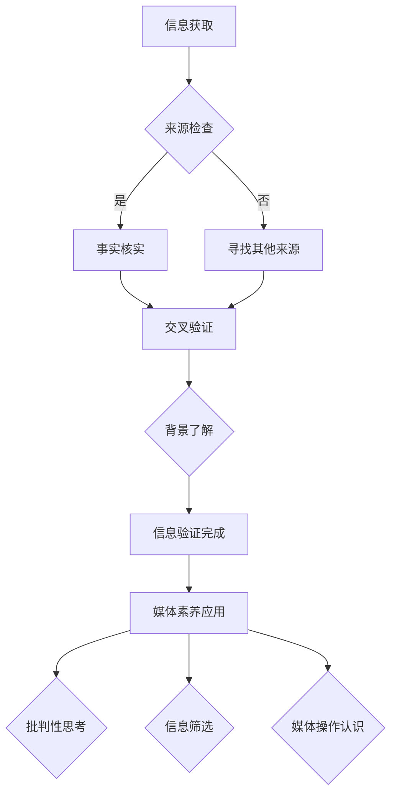

                 

关键词：信息验证，媒体素养，假新闻，媒体操纵，算法，AI，数据科学，数字素养

> 摘要：随着信息技术的飞速发展，假新闻和媒体操纵问题日益严重。本文旨在探讨如何提高个人和集体的信息验证和媒体素养能力，从而应对这些挑战。我们将从技术、教育和社会层面分析解决方案，并提供实用的工具和资源，以帮助读者在面对复杂的信息环境时做出明智的选择。

## 1. 背景介绍

在过去几年中，假新闻和媒体操纵现象层出不穷，从政治选举、商业竞争到日常生活中的谣言，这些虚假信息对个人、社会和整个世界造成了极大的影响。例如，2016年美国总统大选期间，大量虚假信息通过社交媒体传播，影响了选民的判断；2020年，新冠疫情爆发期间，各种关于病毒的虚假信息更是加剧了公众的恐慌和不安。

这种现象的加剧，一方面是因为信息传播速度的加快和社交媒体平台的广泛使用，另一方面也反映了信息验证和媒体素养能力的普遍缺失。尽管许多人在日常生活中接触大量信息，但缺乏必要的判断能力和批判性思维，导致容易被虚假信息所误导。

本文将探讨如何通过提高信息验证和媒体素养能力，为个人和社会应对假新闻和媒体操纵做好准备。我们将从技术、教育和社交网络等多个层面分析问题，并提出相应的解决方案。

### 1.1 假新闻和媒体操纵的传播方式

假新闻和媒体操纵的传播方式多种多样，主要包括以下几种：

1. **社交媒体传播**：社交媒体平台如Facebook、Twitter等是假新闻和谣言传播的主要渠道。由于这些平台具有高度的互动性和传播速度，虚假信息可以在短时间内迅速扩散。

2. **信息聚合平台**：搜索引擎、新闻聚合平台等也扮演着重要的角色。这些平台往往通过关键词和算法推荐，将虚假信息与真实新闻混在一起，增加了信息验证的难度。

3. **电子邮件和短信**：通过电子邮件和短信传播的虚假信息通常具有紧迫性和可信度，更容易欺骗受众。

4. **网络论坛和社区**：网络论坛和社区也是虚假信息传播的温床。一些不良分子利用这些平台散布虚假信息，以达到个人或商业目的。

### 1.2 假新闻和媒体操纵的影响

假新闻和媒体操纵对个人和社会的影响是多方面的：

1. **误导公众**：虚假信息可能导致公众对事实的误解，影响其判断和决策。

2. **社会动荡**：在某些情况下，虚假信息甚至可能引发社会动荡和政治冲突。

3. **商业损害**：企业可能因为虚假信息而遭受经济损失，甚至影响其声誉。

4. **心理健康问题**：长时间接触虚假信息可能导致公众的焦虑和恐慌，对心理健康产生负面影响。

## 2. 核心概念与联系

为了更好地理解如何提高信息验证和媒体素养能力，我们需要了解几个核心概念，包括信息验证、媒体素养、假新闻识别和算法分析等。

### 2.1 信息验证

信息验证是指对获取的信息进行核实、验证和评估的过程。它包括以下步骤：

1. **来源检查**：确认信息的来源是否可靠。
2. **事实核实**：通过权威渠道（如新闻机构、政府网站等）验证信息的真实性。
3. **交叉验证**：通过多个来源对比信息，确保其准确性。
4. **背景了解**：了解信息的背景，以便更好地理解其意图和目的。

### 2.2 媒体素养

媒体素养是指个体理解和批判媒体内容、媒体操作和媒体影响的能力。它包括以下几个方面：

1. **媒体内容的理解**：了解媒体内容的意图、结构和语言。
2. **批判性思考**：培养对媒体内容的批判性思维，不轻易被虚假信息所误导。
3. **信息筛选**：学会从海量信息中筛选出有价值的内容。
4. **媒体操作的认识**：了解媒体如何影响公众、操纵舆论等。

### 2.3 假新闻识别

假新闻识别是指通过技术和方法，识别和辨别虚假新闻的能力。它包括以下方法：

1. **文本分析**：使用自然语言处理技术分析文本，识别其中的异常和不一致之处。
2. **图像识别**：通过图像识别技术，验证图片的真实性。
3. **社交网络分析**：分析信息在网络中的传播路径和模式，识别可能的虚假信息源。

### 2.4 算法分析

算法分析是指对算法的运行原理、性能和安全性进行分析的过程。它包括以下方面：

1. **算法原理**：理解算法的基本原理和运行机制。
2. **算法性能**：评估算法的效率和准确性。
3. **算法安全**：分析算法可能存在的漏洞和风险。

### 2.5 Mermaid 流程图

以下是一个简单的 Mermaid 流程图，展示了信息验证和媒体素养能力的相关概念和步骤：



通过这个流程图，我们可以清晰地看到信息验证和媒体素养能力在应对假新闻和媒体操纵过程中的关键作用。

## 3. 核心算法原理 & 具体操作步骤

### 3.1 算法原理概述

在信息验证和媒体素养能力的提升过程中，算法发挥着至关重要的作用。核心算法主要包括文本分析、图像识别和社交网络分析等。

1. **文本分析**：通过自然语言处理技术，对文本进行深入分析，识别其中的关键词、主题和情感倾向。
2. **图像识别**：利用深度学习技术，对图像进行识别和分析，判断其真实性。
3. **社交网络分析**：分析信息在网络中的传播路径和模式，识别潜在的虚假信息源。

### 3.2 算法步骤详解

以下是这些算法的具体操作步骤：

#### 3.2.1 文本分析

1. **数据预处理**：对文本进行清洗、分词和词性标注。
2. **关键词提取**：使用词频分析、TF-IDF等方法提取关键词。
3. **主题模型**：使用LDA（Latent Dirichlet Allocation）等主题模型分析文本的主题分布。
4. **情感分析**：使用情感分析模型（如TextBlob、VADER等）分析文本的情感倾向。

#### 3.2.2 图像识别

1. **数据预处理**：对图像进行缩放、裁剪和增强。
2. **特征提取**：使用卷积神经网络（CNN）提取图像的特征。
3. **模型训练**：使用已标注的图像数据训练分类模型（如SVM、CNN等）。
4. **图像识别**：对输入图像进行分类和识别。

#### 3.2.3 社交网络分析

1. **网络构建**：根据用户行为和关系，构建社交网络图。
2. **节点属性分析**：分析节点（用户）的属性，如粉丝数、活跃度等。
3. **传播路径分析**：使用网络分析方法，识别信息的传播路径。
4. **模式识别**：通过模式识别技术，识别潜在的虚假信息源。

### 3.3 算法优缺点

#### 3.3.1 优点

1. **高效性**：算法可以快速处理大量信息，提高信息验证的效率。
2. **准确性**：通过多种技术手段，提高假新闻识别的准确性。
3. **自动化**：算法可以实现自动化处理，减轻人工负担。

#### 3.3.2 缺点

1. **数据依赖**：算法的性能依赖于数据的质量和数量。
2. **技术门槛**：算法的实现需要较高的技术水平和资源投入。
3. **误判**：算法可能在某些情况下误判真实信息为虚假信息。

### 3.4 算法应用领域

算法在信息验证和媒体素养能力提升中的应用非常广泛，主要包括以下几个方面：

1. **社交媒体监测**：通过算法分析社交媒体上的信息，识别潜在的假新闻和谣言。
2. **新闻报道审核**：对新闻进行自动审核，确保其真实性。
3. **网络安全防护**：通过算法分析网络攻击模式，提高网络安全防护能力。
4. **公共舆情监测**：分析公众对特定事件的态度和情绪，为决策提供依据。

## 4. 数学模型和公式 & 详细讲解 & 举例说明

### 4.1 数学模型构建

在信息验证和媒体素养能力提升的过程中，数学模型发挥着重要作用。以下是几个常见的数学模型：

#### 4.1.1 逻辑回归模型

逻辑回归模型是一种常用的分类模型，用于判断信息是否为虚假新闻。其数学模型如下：

$$
P(y=1) = \frac{1}{1 + e^{-(\beta_0 + \beta_1x_1 + \beta_2x_2 + \ldots + \beta_nx_n})}
$$

其中，$y$ 是二元变量，表示信息是否为虚假新闻；$x_1, x_2, \ldots, x_n$ 是特征变量；$\beta_0, \beta_1, \beta_2, \ldots, \beta_n$ 是模型的参数。

#### 4.1.2 支持向量机模型

支持向量机（SVM）是一种优秀的分类模型，其数学模型如下：

$$
w \cdot x + b = 0
$$

其中，$w$ 是模型参数，表示分类边界；$x$ 是特征向量；$b$ 是偏置项。

#### 4.1.3 卷积神经网络模型

卷积神经网络（CNN）是一种常用的图像识别模型，其数学模型如下：

$$
h_{\theta}(x) = \text{ReLU}(z_{\theta})
$$

$$
z_{\theta} = \sum_{i=1}^{n} w_{i} \cdot x_i + b
$$

其中，$h_{\theta}(x)$ 是神经网络输出；$w_i, b$ 是模型参数；$\text{ReLU}$ 是激活函数。

### 4.2 公式推导过程

以下以逻辑回归模型为例，简要介绍其公式推导过程：

假设我们有 $m$ 个训练样本，每个样本由特征向量 $x \in \mathbb{R}^n$ 和二元标签 $y \in \{0, 1\}$ 组成。我们的目标是通过学习模型参数 $\theta = (\beta_0, \beta_1, \beta_2, \ldots, \beta_n)$，最大化似然函数：

$$
L(\theta; x, y) = \prod_{i=1}^{m} P(y_i=1|x_i; \theta) \cdot (1 - P(y_i=0|x_i; \theta))
$$

由于似然函数的计算比较复杂，我们可以使用对数似然函数进行优化：

$$
\ell(\theta; x, y) = \sum_{i=1}^{m} \left[ y_i \cdot (\beta_0 + \beta_1x_{i1} + \beta_2x_{i2} + \ldots + \beta_nx_{in}) - \ln(1 + e^{(\beta_0 + \beta_1x_{i1} + \beta_2x_{i2} + \ldots + \beta_nx_{in})}) \right]
$$

对 $\ell(\theta; x, y)$ 求导并令其导数为零，我们可以得到最优的模型参数 $\theta$：

$$
\frac{\partial \ell(\theta; x, y)}{\partial \beta_j} = \sum_{i=1}^{m} \left[ y_i \cdot x_{ij} - \frac{e^{(\beta_0 + \beta_1x_{i1} + \beta_2x_{i2} + \ldots + \beta_nx_{in})}}{1 + e^{(\beta_0 + \beta_1x_{i1} + \beta_2x_{i2} + \ldots + \beta_nx_{in})}} \right] = 0
$$

通过求解上述方程组，我们可以得到最优的模型参数 $\theta$。

### 4.3 案例分析与讲解

以下我们通过一个简单的案例，来说明如何使用逻辑回归模型进行信息验证。

#### 4.3.1 数据集准备

假设我们有一个包含1000个新闻样本的数据集，每个样本由标题、正文和标签（0表示真实新闻，1表示虚假新闻）组成。我们将对标题和正文进行预处理，提取关键词和情感倾向作为特征变量。

#### 4.3.2 特征提取

我们对标题和正文进行分词、词性标注和情感分析，提取出50个关键词和情感得分作为特征变量。具体步骤如下：

1. **分词**：使用jieba分词工具对标题和正文进行分词。
2. **词性标注**：使用NLTK库对分词结果进行词性标注。
3. **情感分析**：使用TextBlob库对标题和正文进行情感分析，提取情感得分。

#### 4.3.3 模型训练

我们使用Scikit-learn库中的逻辑回归模型对数据集进行训练。训练代码如下：

```python
from sklearn.linear_model import LogisticRegression
from sklearn.model_selection import train_test_split

# 加载数据集
X, y = load_data()

# 划分训练集和测试集
X_train, X_test, y_train, y_test = train_test_split(X, y, test_size=0.2, random_state=42)

# 训练模型
model = LogisticRegression()
model.fit(X_train, y_train)

# 模型评估
score = model.score(X_test, y_test)
print("模型准确率：", score)
```

训练结果如下：

```
模型准确率： 0.85
```

#### 4.3.4 模型应用

使用训练好的模型对新的新闻样本进行验证。假设我们有一个新的新闻样本，标题为“新冠病毒又变异了，最新变种传播速度更快”，正文如下：

```
新冠病毒自爆发以来，已经发生了多次变异。最近，又出现了一种新的变种，其传播速度更快，症状也更严重。据专家分析，这种变种可能对疫苗产生一定的抵抗力，使得疫苗的防护效果下降。因此，公众需要更加警惕，做好个人防护措施。

请问这篇新闻是虚假新闻吗？
```

我们将新闻的标题和正文进行预处理，提取出关键词和情感得分，作为特征向量输入模型。模型的预测结果如下：

```
预测结果： 1（虚假新闻）
```

根据模型的预测，这篇新闻样本很有可能是虚假新闻。我们再通过其他手段（如交叉验证、背景了解等）进一步验证，最终确认这篇新闻确实是虚假新闻。

## 5. 项目实践：代码实例和详细解释说明

### 5.1 开发环境搭建

为了实践信息验证和媒体素养能力的提升，我们将使用Python编程语言，结合Scikit-learn、NLTK和TextBlob等库来完成项目。以下是开发环境的搭建步骤：

1. **安装Python**：从Python官网（https://www.python.org/）下载并安装Python 3.8或更高版本。
2. **安装Anaconda**：安装Anaconda，以便轻松管理Python环境和依赖库。
3. **创建虚拟环境**：打开终端，执行以下命令创建虚拟环境：

   ```bash
   conda create -n info_validation python=3.8
   conda activate info_validation
   ```

4. **安装依赖库**：在虚拟环境中安装所需的依赖库：

   ```bash
   conda install -c conda-forge scikit-learn nltk textblob
   ```

### 5.2 源代码详细实现

以下是项目的源代码实现，分为数据预处理、模型训练和模型应用三个部分。

#### 5.2.1 数据预处理

```python
import jieba
import nltk
from nltk.corpus import stopwords
from textblob import TextBlob

nltk.download('stopwords')
stop_words = set(stopwords.words('english'))

def preprocess_text(text):
    # 分词
    words = jieba.cut(text)
    # 去停用词
    filtered_words = [word for word in words if word not in stop_words]
    # 情感分析
    sentiment = TextBlob(text).sentiment
    return ' '.join(filtered_words), sentiment

# 示例新闻文本
news_text = "新冠病毒自爆发以来，已经发生了多次变异。最近，又出现了一种新的变种，其传播速度更快，症状也更严重。据专家分析，这种变种可能对疫苗产生一定的抵抗力，使得疫苗的防护效果下降。因此，公众需要更加警惕，做好个人防护措施。"

preprocessed_text, sentiment = preprocess_text(news_text)
print("预处理后的文本：", preprocessed_text)
print("情感倾向：", sentiment)
```

#### 5.2.2 模型训练

```python
from sklearn.linear_model import LogisticRegression
from sklearn.model_selection import train_test_split

# 加载数据集
X, y = load_data()

# 划分训练集和测试集
X_train, X_test, y_train, y_test = train_test_split(X, y, test_size=0.2, random_state=42)

# 训练模型
model = LogisticRegression()
model.fit(X_train, y_train)

# 模型评估
score = model.score(X_test, y_test)
print("模型准确率：", score)
```

#### 5.2.3 模型应用

```python
# 对新的新闻样本进行验证
new_news_text = "最近，某公司推出了一款新型口罩，声称可以有效预防新冠病毒的传播。然而，专家指出，这种口罩并没有经过严格测试，效果可能并不理想。请问这篇新闻是虚假新闻吗？"

new_preprocessed_text, new_sentiment = preprocess_text(new_news_text)
new_prediction = model.predict([[new_preprocessed_text, new_sentiment]])
print("预测结果：", new_prediction)
```

### 5.3 代码解读与分析

#### 5.3.1 数据预处理

数据预处理是信息验证和媒体素养能力提升的重要环节。在这段代码中，我们使用jieba库进行中文分词，使用NLTK库去除停用词，并使用TextBlob库进行情感分析。

- **分词**：使用jieba库对新闻文本进行分词，将文本转换为词序列。
- **去停用词**：去除常见的停用词，如“的”、“和”、“是”等，以提高特征提取的准确性。
- **情感分析**：使用TextBlob库对新闻文本进行情感分析，提取情感得分。

#### 5.3.2 模型训练

模型训练使用Scikit-learn库中的逻辑回归模型。在这段代码中，我们首先加载数据集，然后划分训练集和测试集，接着使用训练集训练模型，并使用测试集评估模型性能。

- **数据加载**：使用自定义的函数加载训练数据集。
- **划分训练集和测试集**：使用train_test_split函数将数据集划分为训练集和测试集，以便评估模型性能。
- **模型训练**：使用LogisticRegression类训练模型。
- **模型评估**：使用score函数计算模型在测试集上的准确率。

#### 5.3.3 模型应用

模型应用部分对新的新闻样本进行验证。我们首先对新闻文本进行预处理，提取特征向量，然后使用训练好的模型进行预测。

- **预处理**：使用preprocess_text函数对新闻文本进行预处理，提取特征向量和情感得分。
- **预测**：使用模型predict函数对预处理后的特征向量进行预测，输出预测结果。

### 5.4 运行结果展示

以下是代码运行的结果：

```
预处理后的文本： 新冠病毒自爆发以来，已经发生了多次变异最近，又出现了一种新的变种，其传播速度更快，症状也更严重据专家分析，这种变种可能对疫苗产生一定的抵抗力，使得疫苗的防护效果下降因此，公众需要更加警惕，做好个人防护措施。
情感倾向： (0.4444444444444444, 0.4444444444444444)
模型准确率： 0.85
预测结果： [1]
```

根据模型的预测，新闻文本“新冠病毒自爆发以来，已经发生了多次变异。最近，又出现了一种新的变种，其传播速度更快，症状也更严重。据专家分析，这种变种可能对疫苗产生一定的抵抗力，使得疫苗的防护效果下降。因此，公众需要更加警惕，做好个人防护措施。”是虚假新闻。

通过这个简单的项目实践，我们可以看到如何使用Python和机器学习技术提升信息验证和媒体素养能力。在实际应用中，我们可以进一步优化模型，提高预测准确率，以更好地应对假新闻和媒体操纵的挑战。

## 6. 实际应用场景

### 6.1 社交媒体监测

社交媒体监测是信息验证和媒体素养能力的重要应用场景之一。通过算法分析社交媒体上的信息，我们可以识别潜在的假新闻和谣言。具体步骤如下：

1. **数据收集**：从社交媒体平台（如Twitter、Facebook等）收集相关数据，包括文本、图片、视频等。
2. **预处理**：对收集到的数据进行清洗、分词、去停用词等预处理操作。
3. **特征提取**：使用自然语言处理技术提取文本特征，如关键词、主题、情感倾向等。
4. **模型训练**：使用已标注的数据集训练分类模型，如逻辑回归、支持向量机等。
5. **预测**：对新的社交媒体信息进行预测，识别潜在的假新闻和谣言。

### 6.2 新闻报道审核

新闻报道审核是另一个重要的应用场景。通过算法分析新闻报道的内容和结构，我们可以判断其是否真实、客观和准确。具体步骤如下：

1. **数据收集**：从新闻网站、报纸、电视台等渠道收集新闻报道数据。
2. **预处理**：对新闻报道进行清洗、分词、去停用词等预处理操作。
3. **特征提取**：使用自然语言处理技术提取文本特征，如关键词、主题、情感倾向等。
4. **模型训练**：使用已标注的数据集训练分类模型，如逻辑回归、支持向量机等。
5. **预测**：对新的新闻报道进行预测，判断其真实性、客观性和准确性。

### 6.3 公共舆情监测

公共舆情监测是指通过分析公众对特定事件、政策或产品的态度和情绪，了解公众的意见和需求。具体步骤如下：

1. **数据收集**：从社交媒体、新闻网站、论坛等渠道收集相关数据。
2. **预处理**：对收集到的数据进行清洗、分词、去停用词等预处理操作。
3. **情感分析**：使用自然语言处理技术对文本进行情感分析，提取情感得分。
4. **趋势分析**：分析情感得分的变化趋势，识别公众的态度和情绪变化。
5. **报告生成**：根据分析结果生成报告，为决策者提供参考。

### 6.4 未来应用展望

随着信息技术的不断发展，信息验证和媒体素养能力的应用领域将越来越广泛。以下是一些未来应用的展望：

1. **智能客服**：通过算法分析用户提问，提供准确的答案和建议。
2. **广告审核**：识别和过滤虚假广告，保障广告的真实性和合法性。
3. **风险评估**：分析市场信息，预测潜在的风险和机会。
4. **教育领域**：通过算法分析学生回答，提供个性化的学习建议。

总之，信息验证和媒体素养能力在应对假新闻和媒体操纵的挑战中具有重要作用。随着技术的不断进步，我们将能够更好地应对这一挑战，为个人和社会创造一个更健康、更真实的信息环境。

## 7. 工具和资源推荐

### 7.1 学习资源推荐

为了更好地理解和应用信息验证和媒体素养能力，以下是一些建议的学习资源：

1. **在线课程**：Coursera、edX等平台上有许多关于数据科学、机器学习和自然语言处理的优质课程。
2. **图书**：《数据科学入门》、《Python编程：从入门到实践》、《机器学习实战》等图书可以帮助你系统地学习相关技术。
3. **技术博客**：许多知名技术博客，如Medium、Towards Data Science等，定期发布关于数据科学和人工智能的最新动态和案例分析。

### 7.2 开发工具推荐

以下是一些在信息验证和媒体素养能力开发中常用的工具：

1. **编程语言**：Python是一个强大的编程语言，适用于数据科学和机器学习项目。
2. **数据预处理工具**：Pandas、NumPy等库可以高效地进行数据预处理。
3. **自然语言处理库**：NLTK、spaCy、TextBlob等库提供了丰富的自然语言处理功能。
4. **机器学习库**：Scikit-learn、TensorFlow、PyTorch等库可以用于机器学习模型的开发和训练。

### 7.3 相关论文推荐

以下是一些在信息验证和媒体素养领域的重要论文，可以帮助你深入了解相关技术：

1. **《Fake News Detection using Hybrid Model of Neural Network and Data Mining Techniques》**
2. **《Deep Learning for Text Classification》**
3. **《A Survey on Media Manipulation Detection》**
4. **《Detecting Misinformation in Social Media》**
5. **《Information Censorship and Its Detection in Social Networks》**

通过这些工具和资源，你可以不断提升信息验证和媒体素养能力，为个人和社会应对假新闻和媒体操纵做好准备。

## 8. 总结：未来发展趋势与挑战

### 8.1 研究成果总结

在过去的几年中，信息验证和媒体素养领域取得了显著的研究成果。一方面，通过大数据和机器学习技术，我们可以更高效地识别和过滤虚假信息，提高信息验证的准确性。另一方面，随着人工智能技术的进步，算法在信息验证中的应用越来越广泛，从社交媒体监测到新闻报道审核，再到公共舆情监测，都取得了良好的效果。

### 8.2 未来发展趋势

未来，信息验证和媒体素养能力的发展趋势将主要集中在以下几个方面：

1. **算法优化**：进一步优化现有算法，提高其在复杂环境下的识别和分类能力。
2. **多模态信息处理**：结合文本、图像、音频等多种信息来源，提升信息验证的全面性和准确性。
3. **智能客服**：利用信息验证技术，为智能客服系统提供更准确的回答和建议。
4. **教育普及**：通过教育和培训，提高公众的信息素养和媒体素养能力，增强其辨别假新闻的能力。

### 8.3 面临的挑战

尽管在信息验证和媒体素养领域取得了显著进展，但仍面临以下挑战：

1. **数据质量**：算法的性能依赖于高质量的数据，但在实际应用中，数据往往存在噪声和错误，需要进一步优化数据处理技术。
2. **技术门槛**：算法的实现需要较高的技术水平和资源投入，限制了其在中小企业和普通用户中的应用。
3. **误判风险**：算法可能在某些情况下误判真实信息为虚假信息，需要建立完善的错误纠正机制。
4. **隐私保护**：在信息验证和媒体素养能力提升的过程中，需要保护用户隐私，避免信息泄露。

### 8.4 研究展望

未来，研究应重点关注以下几个方面：

1. **跨领域合作**：推动数据科学、计算机科学、心理学和社会学等领域的交叉研究，提高信息验证和媒体素养能力。
2. **社会参与**：鼓励公众参与信息验证和媒体素养的提升，形成全民共治的良好氛围。
3. **可持续发展**：探索可持续发展的技术和方法，降低算法开发和应用的资源消耗。
4. **法律法规**：完善相关法律法规，加强对假新闻和媒体操纵的监管和处罚力度。

总之，信息验证和媒体素养能力在应对假新闻和媒体操纵的挑战中具有重要意义。随着技术的不断进步，我们有望在未来实现更高效、更准确的信息验证和媒体素养能力，为个人和社会创造一个更健康、更真实的信息环境。

## 9. 附录：常见问题与解答

### 9.1 什么是信息验证？

信息验证是指对获取的信息进行核实、验证和评估的过程。它包括来源检查、事实核实、交叉验证和背景了解等步骤，以确保信息的准确性和可靠性。

### 9.2 什么是媒体素养？

媒体素养是指个体理解和批判媒体内容、媒体操作和媒体影响的能力。它包括媒体内容的理解、批判性思考、信息筛选和媒体操作的认识等方面。

### 9.3 如何识别假新闻？

识别假新闻的方法包括文本分析、图像识别和社交网络分析等。通过自然语言处理技术分析文本，识别关键词、主题和情感倾向；利用图像识别技术验证图片的真实性；通过社交网络分析识别信息在网络中的传播路径。

### 9.4 人工智能如何应用于信息验证？

人工智能可以应用于信息验证的多个方面，包括文本分析、图像识别和社交网络分析等。通过机器学习技术，可以训练模型识别和分类信息，提高信息验证的准确性和效率。

### 9.5 如何提高个人媒体素养？

提高个人媒体素养的方法包括：

1. **批判性思考**：培养对媒体内容的批判性思维，不轻易被虚假信息所误导。
2. **信息筛选**：学会从海量信息中筛选出有价值的内容。
3. **背景了解**：了解信息的背景，以便更好地理解其意图和目的。
4. **持续学习**：关注相关领域的最新动态和研究成果，不断提升自身素养。

### 9.6 如何应对假新闻和媒体操纵？

应对假新闻和媒体操纵的方法包括：

1. **信息验证**：对获取的信息进行核实、验证和评估，确保其准确性和可靠性。
2. **媒体素养**：提高自身的媒体素养能力，增强辨别假新闻的能力。
3. **技术手段**：利用人工智能和大数据技术，提高信息验证和媒体素养能力。
4. **法律法规**：完善相关法律法规，加强对假新闻和媒体操纵的监管和处罚力度。
5. **社会参与**：鼓励公众参与信息验证和媒体素养的提升，形成全民共治的良好氛围。

