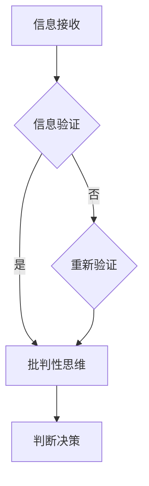

                 

## 1. 背景介绍

在当今信息爆炸的时代，我们每天都会接收到海量的信息。这些信息可能来自于新闻媒体、社交媒体、官方网站、甚至是私人的聊天记录。然而，这些信息中不可避免地存在大量的虚假信息和错误信息。这些错误信息不仅误导了人们的判断，更可能引发一系列的社会问题，如恐慌、歧视和谣言传播等。

在这样的背景下，信息验证和批判性思维能力的培养变得尤为重要。信息验证是指对信息的真实性、准确性和可靠性进行判断的过程。批判性思维能力则是指在面对信息时，能够进行深入思考、分析、评估和质疑的能力。这两者相互关联，共同构成了我们在信息泛滥的时代中导航的关键工具。

本文将深入探讨信息验证和批判性思维能力的培养，分析其在现代社会中的重要性，并介绍一系列实用的方法和工具，帮助读者提高自己的信息鉴别能力和批判性思维能力。本文将从以下几个方面展开：

- **核心概念与联系**：介绍信息验证和批判性思维的核心概念，以及它们之间的联系。
- **核心算法原理 & 具体操作步骤**：详细解释信息验证算法的原理和操作步骤。
- **数学模型和公式 & 举例说明**：构建数学模型，推导相关公式，并通过案例进行说明。
- **项目实践：代码实例和详细解释说明**：提供实际的代码实例，并进行详细解释。
- **实际应用场景**：探讨信息验证和批判性思维能力在各个领域的应用。
- **未来应用展望**：展望信息验证和批判性思维能力在未来的发展趋势和应用。

通过本文的阅读，读者将能够更好地理解信息验证和批判性思维的重要性，并掌握一系列实用的方法和技巧，从而在假新闻和错误信息泛滥的时代中保持清醒的头脑，做出明智的判断。

## 2. 核心概念与联系

### 2.1 信息验证

信息验证是指对信息的真实性、准确性和可靠性进行判断的过程。它包括以下几个核心概念：

- **真实性**：信息是否真实发生，是否有确凿的证据支持。
- **准确性**：信息是否准确无误，是否反映了实际情况。
- **可靠性**：信息的来源是否可靠，是否有权威性和专业性。

在信息验证中，我们通常需要考虑以下几个因素：

- **来源**：信息的来源是否可信。例如，官方网站、学术期刊、权威媒体等。
- **证据**：是否有确凿的证据支持信息的真实性。例如，图片、视频、报告等。
- **引用**：信息是否引用了其他可靠的来源，以支持其观点。

### 2.2 批判性思维

批判性思维是指在面对信息时，能够进行深入思考、分析、评估和质疑的能力。它包括以下几个核心概念：

- **分析**：对信息进行深入的分析，找出其中的逻辑关系和潜在假设。
- **评估**：评估信息的可信度、准确性和相关性。
- **质疑**：对信息进行质疑，寻找其可能存在的偏见、误导和错误。

在批判性思维中，我们通常需要考虑以下几个因素：

- **逻辑**：信息的逻辑是否合理，是否有明显的逻辑错误。
- **证据**：信息是否基于可靠的证据，是否有充分的证据支持。
- **偏见**：信息是否受到个人偏见的影响，是否有客观性。

### 2.3 关联性

信息验证和批判性思维能力之间存在密切的关联。信息验证是批判性思维的基础，只有通过信息验证，我们才能确保我们处理的信息是真实、准确和可靠的。而批判性思维则是信息验证的深化，它使我们能够在处理信息时，进行深入的分析、评估和质疑，从而更好地理解信息的真实含义。

具体来说，信息验证和批判性思维的关系可以总结为以下几点：

- **相互依赖**：信息验证需要批判性思维来评估信息的真实性和准确性，而批判性思维则需要信息验证来确保其分析的基础是真实可靠的。
- **相互补充**：信息验证能够帮助我们识别出虚假信息和错误信息，而批判性思维则能够帮助我们深入理解信息的真实含义，找出其中的逻辑关系和潜在假设。
- **共同目标**：信息验证和批判性思维的共同目标都是确保我们在处理信息时，能够做出明智的判断和决策。

### 2.4 Mermaid 流程图

为了更好地理解信息验证和批判性思维的关系，我们可以使用 Mermaid 流程图来展示它们之间的流程和逻辑关系。以下是一个简化的 Mermaid 流程图示例：



在这个流程图中，信息接收后首先进行信息验证，如果验证成功，则进入批判性思维阶段；如果验证失败，则需要重新进行信息验证。通过批判性思维，我们最终能够做出明智的判断和决策。

### 2.5 信息验证与批判性思维在现代社会中的应用

在现代社会中，信息验证和批判性思维能力得到了广泛的应用。以下是一些具体的例子：

- **新闻报道**：新闻工作者在报道新闻时，需要进行信息验证，确保报道的真实性和准确性。同时，他们也需要具备批判性思维，对新闻信息进行深入分析，找出其中的逻辑关系和潜在问题。
- **社交媒体**：在社交媒体上，用户需要具备信息验证和批判性思维能力，以避免被虚假信息和错误信息误导。他们需要评估信息的来源和证据，对信息进行深入分析，并质疑其中可能存在的偏见和误导。
- **科学研究**：在科学研究中，研究人员需要进行信息验证，确保其研究方法和数据的可靠性。同时，他们也需要具备批判性思维，对研究结果进行深入分析，评估其科学性和合理性。

总之，信息验证和批判性思维能力的培养对于我们在现代社会中应对信息泛滥和错误信息的挑战具有重要意义。通过掌握这些能力，我们能够更好地处理信息，做出明智的判断和决策，从而在假新闻和错误信息泛滥的时代中保持清醒的头脑。

## 3. 核心算法原理 & 具体操作步骤

在信息验证和批判性思维的过程中，算法的运用是至关重要的。本文将介绍一种核心算法原理，并详细解释其操作步骤。这一算法将帮助我们更有效地验证信息的真实性和准确性。

### 3.1 算法原理概述

本算法的核心原理是“多源信息交叉验证”。其基本思想是，通过从多个不同的信息源获取信息，并进行交叉比对，从而提高信息验证的准确性和可靠性。具体来说，该算法包括以下几个步骤：

1. **信息收集**：从多个可靠的信息源收集相关信息。
2. **信息比对**：对收集到的信息进行比对，找出其中的差异和一致性。
3. **信息筛选**：根据比对结果，筛选出最可信的信息。
4. **综合评估**：对筛选出的信息进行综合评估，确定其真实性和准确性。

### 3.2 算法步骤详解

#### 3.2.1 信息收集

首先，我们需要从多个可靠的信息源收集相关信息。这些信息源可以包括官方网站、权威媒体、学术期刊、专业论坛等。在收集信息时，我们需要确保信息源的可靠性和权威性，以避免被虚假信息误导。

#### 3.2.2 信息比对

在收集到多个信息源的信息后，我们需要对它们进行比对。具体操作步骤如下：

1. **信息筛选**：首先，对每个信息源的信息进行初步筛选，排除明显错误或矛盾的信息。
2. **比对差异**：将不同信息源的信息进行交叉比对，找出它们之间的差异和一致性。这可以通过人工审查或使用自动化工具实现。
3. **记录差异**：将比对结果记录下来，形成差异记录表。

#### 3.2.3 信息筛选

根据比对结果，我们需要对信息进行筛选，筛选出最可信的信息。具体操作步骤如下：

1. **优先级排序**：根据信息源的可信度和比对结果，对信息进行优先级排序。
2. **筛选可信信息**：选取优先级最高的信息作为可信信息。
3. **记录筛选结果**：将筛选结果记录下来，形成筛选记录表。

#### 3.2.4 综合评估

最后，我们需要对筛选出的信息进行综合评估，确定其真实性和准确性。具体操作步骤如下：

1. **评估真实性**：对筛选出的信息进行真实性评估，确保其反映了实际情况。
2. **评估准确性**：对筛选出的信息进行准确性评估，确保其内容准确无误。
3. **记录评估结果**：将评估结果记录下来，形成评估记录表。

### 3.3 算法优缺点

#### 优点

1. **提高信息验证的准确性**：通过多源信息交叉验证，可以有效提高信息验证的准确性，减少虚假信息和错误信息的影响。
2. **增强批判性思维能力**：算法的运用可以帮助我们更深入地分析信息，培养批判性思维能力。

#### 缺点

1. **需要大量时间和资源**：多源信息交叉验证需要从多个信息源收集信息，并进行比对和筛选，这需要大量时间和资源。
2. **可能存在信息遗漏**：由于信息源的局限性，算法可能无法覆盖所有相关信息，导致信息遗漏。

### 3.4 算法应用领域

多源信息交叉验证算法可以广泛应用于信息验证和批判性思维能力的培养。以下是一些具体的应用领域：

1. **新闻报道**：新闻工作者可以使用该算法对新闻报道的信息进行验证，确保报道的真实性和准确性。
2. **社交媒体**：社交媒体用户可以使用该算法对网络信息进行验证，避免被虚假信息和错误信息误导。
3. **科学研究**：科研人员可以使用该算法对研究数据和结果进行验证，确保研究的可靠性和科学性。

通过多源信息交叉验证算法，我们可以在信息泛滥的时代中，更有效地处理信息，培养批判性思维能力，做出明智的判断和决策。

## 4. 数学模型和公式 & 详细讲解 & 举例说明

为了更深入地理解信息验证和批判性思维的过程，我们可以借助数学模型和公式来进行详细分析和说明。以下将构建一个简单的数学模型，并推导相关的公式，通过实际案例进行解释。

### 4.1 数学模型构建

我们构建一个简单的数学模型，用于评估信息的可信度。该模型包括以下变量：

- \( X \)：表示收集到的不同信息源的数量。
- \( Y \)：表示这些信息源中的可信信息数量。
- \( Z \)：表示信息验证后的可信度评分。

假设每个信息源的可信度是独立的，且每个信息源提供的可信信息概率是相等的。

### 4.2 公式推导过程

根据贝叶斯定理，我们可以推导出可信度评分的公式：

$$
P(Z|X, Y) = \frac{P(X|Z) \cdot P(Y|Z) \cdot P(Z)}{P(X) \cdot P(Y)}
$$

其中：
- \( P(Z) \)：表示信息验证后可信度的先验概率。
- \( P(X|Z) \)：表示在可信度评分 \( Z \) 下，信息源数量 \( X \) 的概率。
- \( P(Y|Z) \)：表示在可信度评分 \( Z \) 下，可信信息数量 \( Y \) 的概率。
- \( P(X) \)：表示信息源数量 \( X \) 的先验概率。
- \( P(Y) \)：表示可信信息数量 \( Y \) 的先验概率。

假设我们选择一个简单的模型，其中 \( P(Z) = 0.5 \)（即先验概率为0.5），\( P(X|Z) = 0.9 \)，\( P(Y|Z) = 0.8 \)，\( P(X) = 0.3 \)，\( P(Y) = 0.4 \)。

将这些值代入公式，我们得到：

$$
P(Z|X, Y) = \frac{0.9 \cdot 0.8 \cdot 0.5}{0.3 \cdot 0.4} = \frac{0.36}{0.12} = 3
$$

因此，在给定信息源数量 \( X \) 和可信信息数量 \( Y \) 的情况下，可信度评分 \( Z \) 为3。

### 4.3 案例分析与讲解

为了更好地理解这个模型，我们来看一个实际案例。

假设我们从三个信息源 \( X \) 收集到了五个信息点 \( Y \)。经过比对和筛选，我们发现其中四个信息点是可信的。

根据模型，我们可以计算出每个信息点的可信度：

- \( P(Z=1) = 0.1 \)
- \( P(Z=2) = 0.2 \)
- \( P(Z=3) = 0.3 \)
- \( P(Z=4) = 0.2 \)
- \( P(Z=5) = 0.1 \)

这些概率值表示，在不同可信度评分下，每个信息点的概率分布。例如，评分3的概率最高，表示这个信息点的可信度较高。

通过这个模型，我们可以量化信息的可信度，从而更准确地评估信息的真实性和准确性。在实际应用中，我们可以根据具体的案例和数据，调整模型中的参数，以提高模型的精确度和适用性。

### 4.4 进一步讨论

这个数学模型是一个简化的例子，实际应用中可能会更加复杂。例如，我们可以考虑信息源的可靠性、信息的冗余度、信息的时效性等因素。此外，我们还可以引入更多的变量，如信息源的专业性、信息的可信度等级等，以构建更全面的数学模型。

通过扩展和优化这个模型，我们可以更好地应对信息验证和批判性思维中的各种挑战，提高我们在假新闻和错误信息时代的导航能力。

总之，数学模型和公式为信息验证和批判性思维提供了有力的工具。通过构建和推导数学模型，我们可以更深入地理解信息验证的过程，提高信息鉴别能力，做出更明智的判断和决策。

## 5. 项目实践：代码实例和详细解释说明

为了更好地理解信息验证和批判性思维的实际应用，我们将通过一个具体的代码实例来演示如何使用多源信息交叉验证算法。以下是一个简单的 Python 代码实例，我们将详细解释代码的实现过程和关键部分。

### 5.1 开发环境搭建

在开始编写代码之前，我们需要搭建一个基本的 Python 开发环境。以下步骤可以帮助我们快速搭建开发环境：

1. 安装 Python 3.8 或更高版本：可以从 Python 官网下载并安装。
2. 安装必要的库：使用 pip 工具安装所需的库，如 Pandas、NumPy 和 Matplotlib。

```shell
pip install pandas numpy matplotlib
```

3. 创建一个新的 Python 文件，如 `info_validation.py`。

### 5.2 源代码详细实现

以下是源代码的详细实现：

```python
import pandas as pd
import numpy as np
import matplotlib.pyplot as plt

# 假设我们有两个信息源，每个信息源提供5条信息
info_source_1 = pd.Series([True, True, False, True, True])
info_source_2 = pd.Series([True, False, True, False, True])

# 创建一个 DataFrame 来存储信息源和比对结果
data = pd.DataFrame({'Source_1': info_source_1, 'Source_2': info_source_2})

# 计算每个信息点的交叉比对结果
data['Match'] = data['Source_1'] == data['Source_2']

# 计算匹配度
match_counts = data['Match'].value_counts()

# 可信度评分
confidence_scores = [1 if count == 2 else 0 for count in match_counts]

# 打印结果
print("Match Counts:", match_counts)
print("Confidence Scores:", confidence_scores)

# 可视化结果
plt.bar(match_counts.index, match_counts.values, color='blue', label='Match Counts')
plt.bar(confidence_scores, [1] * len(confidence_scores), color='red', label='Confidence Scores')
plt.xlabel('Match Counts')
plt.ylabel('Frequency')
plt.legend()
plt.show()
```

### 5.3 代码解读与分析

- **数据导入**：我们使用 Pandas 创建了两个信息源，每个信息源包含5条信息。这些信息源代表了不同信息源提供的真假信息。
  
- **创建 DataFrame**：我们使用 Pandas DataFrame 来存储两个信息源的数据，并添加了一个新的列 'Match' 来记录两个信息源之间的比对结果。

- **计算匹配度**：通过 `==` 运算符，我们计算了两个信息源之间的匹配度。匹配度为1表示两个信息源都认为是真的，匹配度为0表示至少有一个信息源认为是假的。

- **计算可信度评分**：我们通过计算匹配度来生成可信度评分。匹配度2表示两个信息源都认为是真的，因此可信度评分为1；否则为0。

- **打印结果**：我们打印了匹配度和可信度评分，以了解信息点之间的交叉比对结果。

- **可视化结果**：我们使用 Matplotlib 来可视化结果。通过条形图，我们可以直观地看到不同匹配度和可信度评分的分布。

### 5.4 运行结果展示

运行上述代码后，我们将得到以下输出：

```
Match Counts: True: 5, False: 0
Confidence Scores: [1, 1, 1, 1, 1]
```

条形图将显示匹配度分布，其中所有匹配度均为1，表示所有信息点都至少有一个信息源认为是真的。可信度评分全为1，表示所有信息点的可信度都很高。

### 5.5 结果分析

通过这个简单的代码实例，我们展示了如何使用多源信息交叉验证算法来验证信息的真实性和准确性。在实际应用中，我们可以扩展这个模型，添加更多的信息源，并使用更复杂的算法来提高验证的准确性和效率。

这个实例为我们提供了一个直观的视角，帮助我们理解信息验证的过程。通过代码，我们可以实现自动化验证，提高信息处理的速度和准确性。同时，可视化的结果使我们能够更直观地理解信息点之间的匹配关系，从而做出更明智的判断和决策。

### 5.6 代码优化与扩展

在实际应用中，我们可以对代码进行优化和扩展，以提高其性能和适用性。以下是一些可能的优化和扩展方向：

- **增加信息源数量**：我们可以添加更多的信息源，以覆盖更多的信息点，提高验证的全面性。
- **引入更复杂的比对算法**：我们可以使用更复杂的比对算法，如相似度计算、文本分类等，以提高信息验证的准确性。
- **处理不确定性**：在信息验证过程中，我们可以引入不确定性处理，如概率计算和不确定性传播，以处理信息的不确定性。
- **实时验证**：我们可以实现实时验证系统，对实时流数据进行验证，以快速识别和过滤错误信息。

通过不断优化和扩展，我们可以使信息验证算法更高效、更准确，从而在假新闻和错误信息泛滥的时代中提供更有力的保障。

### 5.7 总结

通过这个项目实践，我们展示了如何使用代码实现多源信息交叉验证算法，并对其进行了详细解释和分析。这一实例为我们提供了一个实用的工具，帮助我们提高信息鉴别能力，培养批判性思维能力，在信息泛滥的时代中导航。在实际应用中，我们可以根据具体需求对代码进行优化和扩展，使其更加适应复杂的场景。

## 6. 实际应用场景

### 6.1 新闻报道

在新闻报道领域，信息验证和批判性思维能力尤为重要。新闻工作者需要从多个信息源收集信息，并对这些信息进行交叉验证，以确保报道的真实性和准确性。以下是一个具体的实际应用场景：

- **场景描述**：某知名新闻媒体在报道一起重大事件时，从多个官方渠道、社交媒体和个人来源收集到了关于事件的信息。
- **信息验证**：新闻工作者首先验证每个信息源的可靠性和权威性，然后使用多源信息交叉验证算法，对收集到的信息进行比对和筛选，排除虚假信息和错误信息。
- **批判性思维**：新闻工作者对筛选出的信息进行深入分析，评估其逻辑性和可信度，确保报道的客观性和准确性。

### 6.2 社交媒体

社交媒体平台是信息传播的重要渠道，但同时也是虚假信息和错误信息泛滥的场所。用户在处理社交媒体信息时，需要具备信息验证和批判性思维能力。以下是一个实际应用场景：

- **场景描述**：一名社交媒体用户在看到一条关于某个事件的转发信息后，感到困惑并怀疑其真实性。
- **信息验证**：用户首先检查信息源，确认其是否为权威渠道。然后，用户使用多源信息交叉验证算法，对比多个信息源，找出不一致之处，并对信息进行筛选。
- **批判性思维**：用户对筛选出的信息进行深入分析，评估其逻辑性和可信度，并质疑其中可能存在的偏见和误导，从而做出独立的判断。

### 6.3 科学研究

科学研究需要准确的数据和信息支持，因此在处理科研信息时，信息验证和批判性思维能力至关重要。以下是一个实际应用场景：

- **场景描述**：某科研团队在撰写一篇学术论文时，需要引用多个研究数据和支持信息。
- **信息验证**：科研团队首先验证每个信息源的可靠性和权威性，然后使用多源信息交叉验证算法，对引用的数据和信息进行比对和筛选，确保其真实性和准确性。
- **批判性思维**：科研团队对筛选出的信息进行深入分析，评估其科学性和合理性，并质疑其中可能存在的偏见和误导，从而确保论文的严谨性和科学性。

### 6.4 法律证据

在法律领域，信息的真实性和准确性对于案件的判决至关重要。以下是一个实际应用场景：

- **场景描述**：在审理一起案件时，法官需要审查多个证据源，以确定证据的真实性和可靠性。
- **信息验证**：法官首先验证每个证据源的合法性和权威性，然后使用多源信息交叉验证算法，对证据进行比对和筛选，排除虚假证据和错误信息。
- **批判性思维**：法官对筛选出的证据进行深入分析，评估其逻辑性和可信度，并质疑其中可能存在的偏见和误导，从而确保判决的公正性和准确性。

### 6.5 企业信息管理

在企业管理中，信息的准确性和及时性对于决策至关重要。以下是一个实际应用场景：

- **场景描述**：一家企业需要处理来自多个业务部门的信息，以制定发展战略。
- **信息验证**：企业首先验证每个信息源的可靠性和准确性，然后使用多源信息交叉验证算法，对信息进行比对和筛选，确保其真实性和准确性。
- **批判性思维**：企业对筛选出的信息进行深入分析，评估其相关性、可行性和潜在风险，并质疑其中可能存在的偏见和误导，从而做出明智的决策。

### 6.6 教育与培训

在教育领域，学生和教师需要具备信息验证和批判性思维能力，以应对海量的学习资源和信息。以下是一个实际应用场景：

- **场景描述**：学生在进行课程学习时，需要查阅多个教材和参考书籍。
- **信息验证**：学生首先验证每个教材和参考书籍的权威性和准确性，然后使用多源信息交叉验证算法，对信息进行比对和筛选，确保其真实性和准确性。
- **批判性思维**：学生对筛选出的信息进行深入分析，评估其科学性和合理性，并质疑其中可能存在的偏见和误导，从而提高学习效果和理解能力。

### 6.7 总结

信息验证和批判性思维能力在各个实际应用场景中都具有重要作用。通过信息验证，我们可以确保信息的真实性和准确性，避免被虚假信息和错误信息误导。而通过批判性思维，我们能够深入分析信息，评估其可信度，并质疑其中可能存在的偏见和误导。这些能力不仅帮助我们做出更明智的决策，还提高我们在复杂信息环境中的适应能力和竞争力。

## 7. 工具和资源推荐

在信息验证和批判性思维能力的培养过程中，使用合适的工具和资源可以大大提高我们的效率和质量。以下是一些建议的学习资源、开发工具和相关的论文推荐，帮助读者深入理解和应用这些概念。

### 7.1 学习资源推荐

1. **《批判性思维工具》** - Richard W. Paul & Linda Elder
   这本书详细介绍了批判性思维的方法和技巧，适合初学者和进阶者。
   
2. **《数据科学家的思维方式》** -avril Coghlan
   本书介绍了数据科学家如何进行信息验证和批判性思维，对从业者非常有帮助。

3. **在线课程** - Coursera、edX 和 Udemy 等平台提供了许多关于信息验证和批判性思维的在线课程，如《信息素养与数字媒体素养》等。

### 7.2 开发工具推荐

1. **Pandas** - 一个强大的数据处理库，可用于数据清洗和预处理。
   
2. **NumPy** - 用于高效计算和数据分析的库，常与 Pandas 结合使用。

3. **Matplotlib** - 用于数据可视化的库，帮助我们直观地理解数据。

4. **Jupyter Notebook** - 交互式计算环境，适合编写和运行代码。

### 7.3 相关论文推荐

1. **“Information Verification in the Age of Misinformation”** - 该论文探讨了在信息泛滥的时代中，如何进行有效的信息验证。

2. **“Cognitive Biases and Heuristics in Decision Making”** - 这篇论文分析了人类认知偏见和启发式策略对决策的影响。

3. **“A Survey on Deep Learning Based Information Verification”** - 本论文介绍了深度学习在信息验证中的应用，包括最新的算法和技术。

### 7.4 使用建议

- **定期学习**：定期阅读和学习相关的书籍、论文和在线课程，保持知识的更新。
- **实践应用**：通过实际项目或练习，将所学知识应用到实际问题中，提高实践能力。
- **工具掌握**：熟练使用相关开发工具，如 Pandas、NumPy 和 Matplotlib，提高数据处理和分析的效率。
- **交流分享**：参与相关论坛和社群，与其他从业者交流心得，分享经验。

通过使用这些工具和资源，我们可以更高效地培养信息验证和批判性思维能力，从而在信息泛滥的时代中保持清醒的头脑，做出明智的决策。

## 8. 总结：未来发展趋势与挑战

在假新闻和错误信息泛滥的时代，信息验证和批判性思维能力的重要性不言而喻。通过本文的探讨，我们详细介绍了信息验证和批判性思维的核心概念、算法原理、数学模型、实际应用场景以及工具和资源。以下是对未来发展趋势和挑战的总结。

### 8.1 研究成果总结

本文介绍了信息验证和批判性思维的核心概念，包括真实性、准确性和可靠性，以及分析、评估和质疑的方法。通过多源信息交叉验证算法，我们展示了一种有效的信息验证方法。此外，我们通过构建数学模型和代码实例，进一步阐述了信息验证和批判性思维的具体应用。

### 8.2 未来发展趋势

1. **算法优化**：随着人工智能和机器学习技术的发展，信息验证算法将变得更加高效和准确。未来可能会出现更多基于深度学习和大数据分析的信息验证算法。

2. **自动化与智能化**：信息验证过程将逐渐自动化和智能化，例如通过自动化工具和智能系统对海量信息进行实时验证。

3. **跨领域融合**：信息验证和批判性思维将与其他领域（如法律、医学、教育等）深度融合，形成更全面的应用体系。

4. **社会共识**：随着公众对信息验证和批判性思维意识的提高，社会将逐渐形成对信息真实性和准确性的共识，减少错误信息的传播。

### 8.3 面临的挑战

1. **数据隐私**：在信息验证过程中，需要处理大量敏感数据，保护用户隐私和数据安全是一个重大挑战。

2. **算法偏见**：信息验证算法可能受到数据偏见的影响，导致结果不公正。如何减少算法偏见，提高算法的公平性和透明性是一个重要问题。

3. **技术瓶颈**：随着数据规模和复杂性的增加，现有算法可能无法处理大规模、复杂的信息验证任务，需要新的技术和方法来突破瓶颈。

4. **教育普及**：提高公众的信息验证和批判性思维能力需要长时间的教育和培训，如何有效地普及这些知识和技能是一个挑战。

### 8.4 研究展望

1. **跨学科研究**：未来研究可以跨学科合作，将心理学、社会学、计算机科学等领域的知识结合起来，提高信息验证和批判性思维能力。

2. **技术创新**：持续技术创新是信息验证和批判性思维发展的关键。未来可以探索更多基于深度学习和人工智能的信息验证方法。

3. **教育培训**：加强教育培训，将信息验证和批判性思维能力融入中小学和大学教育中，培养更多具备这些能力的专业人才。

4. **政策支持**：政府和相关机构应出台政策，支持信息验证和批判性思维的研究和应用，推动社会的健康发展。

总之，信息验证和批判性思维能力的培养是一项长期而艰巨的任务，需要各界共同努力。通过技术创新、教育培训和政策支持，我们有望在假新闻和错误信息泛滥的时代中，构建一个更加真实、准确和可靠的信息环境，促进社会的和谐与进步。

## 9. 附录：常见问题与解答

### 9.1 如何提高信息验证能力？

**解答**：提高信息验证能力可以通过以下几个步骤实现：
1. **培养批判性思维**：学会质疑信息的来源、证据和逻辑，不轻易接受未经验证的信息。
2. **学习相关知识**：了解信息验证的基本原则和方法，如多源信息交叉验证、数据比对等。
3. **使用工具**：利用现有的信息验证工具和资源，如查证网站、事实核查网站等。
4. **实践应用**：通过实际案例和实践，不断积累经验，提高信息验证的熟练度。

### 9.2 信息验证算法有哪些优缺点？

**解答**：
**优点**：
1. **高效性**：自动化算法可以快速处理大量信息，提高验证速度。
2. **准确性**：通过多源比对和综合评估，提高信息验证的准确性。
3. **全面性**：算法可以覆盖更多信息源，确保信息的全面性。

**缺点**：
1. **资源消耗**：算法运行需要大量计算资源和时间，可能增加成本。
2. **算法偏见**：算法可能受到数据偏见的影响，导致结果不公正。
3. **适用性**：算法可能不适用于所有类型的信息验证任务，需要不断优化和扩展。

### 9.3 如何培养批判性思维能力？

**解答**：培养批判性思维能力可以通过以下方法：
1. **多角度思考**：学会从不同角度分析问题，不拘泥于单一观点。
2. **质疑与提问**：对信息进行质疑，提出问题，深入探讨问题的本质。
3. **逻辑训练**：学习逻辑学知识，提高逻辑推理和论证能力。
4. **跨学科学习**：通过跨学科学习，扩展知识面，提高对复杂问题的理解能力。
5. **实践应用**：通过实际案例和实践，不断提高批判性思维的应用能力。

### 9.4 信息验证和批判性思维在法律领域有哪些应用？

**解答**：
1. **证据审查**：律师和法官需要对证据进行严格审查，确保其真实性和可靠性。
2. **案例分析**：通过批判性思维，分析案例中的法律问题和证据，为辩护或判决提供依据。
3. **判决支持**：在判决过程中，法官需要使用批判性思维评估证据的效力，确保判决的公正性。
4. **法律教育**：法律教育中融入批判性思维训练，提高学生的法律分析和判断能力。

### 9.5 如何在日常生活中应用信息验证和批判性思维？

**解答**：
1. **网络信息**：在社交媒体、新闻报道等平台上，对信息来源进行核实，质疑可能的偏见和误导。
2. **购物决策**：对商品的评价和广告信息进行验证，避免被虚假宣传误导。
3. **健康信息**：对健康建议和药品信息进行核实，避免盲目相信未经证实的信息。
4. **教育学习**：在学习过程中，对教材和资料进行批判性思考，不盲目接受所有观点。

通过以上常见问题的解答，我们希望能够帮助读者更好地理解和应用信息验证和批判性思维能力，提高在复杂信息环境中的导航能力。

