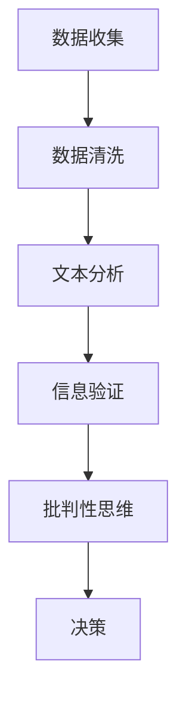

                 

关键词：信息验证、批判性思考、假新闻、媒体操纵、数据科学、算法、信息安全、隐私保护、决策辅助、技术工具、伦理道德

> 摘要：在当今信息爆炸和媒体操纵的时代，如何验证信息真实性并培养批判性思维已成为至关重要的能力。本文旨在提供一套全面的信息验证和批判性思考指南，帮助读者在充斥假新闻和媒体操纵的环境中做出明智的决策。文章将从核心概念、算法原理、数学模型、实践案例、应用场景、工具推荐等多个角度深入探讨这一议题，并提出未来发展的展望和挑战。

## 1. 背景介绍

随着互联网的飞速发展，信息传播的速度和广度达到了前所未有的高度。与此同时，假新闻、虚假信息和媒体操纵也成为了社会问题。这些现象不仅误导公众，影响社会稳定，还可能导致严重的安全隐患和隐私泄露。信息验证和批判性思维在此背景下显得尤为重要。

### 1.1 假新闻与媒体操纵的定义

假新闻（Fake News）通常指的是故意编造、虚构或歪曲事实的新闻，目的是为了欺骗、误导或煽动公众。而媒体操纵（Media Manipulation）则是指通过控制或影响媒体内容，以实现特定的政治、经济或社会目的的行为。

### 1.2 信息验证的重要性

信息验证（Information Verification）是指通过多种途径和方法，对信息的真实性、准确性和可靠性进行评估和确认。在假新闻泛滥的时代，信息验证能力是公众免受虚假信息伤害的重要保障。

### 1.3 批判性思维的作用

批判性思维（Critical Thinking）是一种理性分析和判断的能力，它要求我们不仅接受信息，更要分析信息来源、内容和方法，从而判断信息的真实性和价值。批判性思维有助于我们识别假新闻和媒体操纵，做出更明智的决策。

## 2. 核心概念与联系

在深入讨论信息验证和批判性思维之前，我们需要了解一些核心概念和它们之间的联系。

### 2.1 数据科学与信息验证

数据科学（Data Science）是一门处理、分析、解释和可视化复杂数据的学科。在信息验证中，数据科学提供了强大的工具和方法，如文本分析、机器学习和网络爬虫，以识别和验证信息的真实性。

### 2.2 算法与批判性思维

算法（Algorithm）是一系列定义明确的规则，用于解决特定问题。在批判性思维中，算法可以帮助我们系统地分析信息，识别潜在的错误和偏差。

### 2.3 信息安全与隐私保护

信息安全（Information Security）是指保护信息资产免受未经授权的访问、使用、披露、破坏或篡改。隐私保护（Privacy Protection）则是确保个人信息不被滥用。在信息验证过程中，信息安全与隐私保护是关键保障。

### 2.4 Mermaid 流程图

以下是一个简化的 Mermaid 流程图，展示了信息验证和批判性思维的核心概念及其相互关系：



## 3. 核心算法原理 & 具体操作步骤

### 3.1 算法原理概述

信息验证和批判性思维的核心算法包括文本分析、机器学习和网络爬虫。以下是这些算法的基本原理：

#### 3.1.1 文本分析

文本分析（Text Analysis）是一种自然语言处理技术，用于分析和提取文本数据中的有用信息。其基本原理包括：

- **词频统计（Word Frequency）**：计算文本中每个单词的出现次数。
- **主题模型（Topic Modeling）**：通过统计方法自动发现文本中的主题。
- **情感分析（Sentiment Analysis）**：识别文本中的情感倾向。

#### 3.1.2 机器学习

机器学习（Machine Learning）是一种通过数据训练模型，使其能够自动进行决策和预测的技术。在信息验证中，机器学习可以用于：

- **分类（Classification）**：将文本数据分类为真实或虚假。
- **回归（Regression）**：预测信息的可靠性得分。
- **聚类（Clustering）**：将相似的信息分组。

#### 3.1.3 网络爬虫

网络爬虫（Web Crawler）是一种自动抓取网页数据的程序。其基本原理包括：

- **网页抓取（Web Scraping）**：从网页中提取有用信息。
- **链接追踪（Link Tracing）**：根据网页中的链接关系，自动扩展数据来源。

### 3.2 算法步骤详解

#### 3.2.1 数据收集

数据收集是信息验证的第一步。这包括从各种来源获取文本数据，如新闻报道、社交媒体帖子、论坛讨论等。

#### 3.2.2 数据清洗

数据清洗是确保数据质量的过程。这包括去除无关信息、纠正数据错误和格式化文本。

#### 3.2.3 文本分析

文本分析用于提取文本数据中的关键信息。这可以通过词频统计、主题模型和情感分析实现。

#### 3.2.4 机器学习

机器学习模型通过训练数据学习如何分类和预测信息的真实性。这可以通过分类模型、回归模型和聚类模型实现。

#### 3.2.5 网络爬虫

网络爬虫用于扩展数据来源，并验证原始数据来源的可靠性。

#### 3.2.6 信息验证

基于文本分析和机器学习结果，对信息进行验证，判断其真实性。

#### 3.2.7 批判性思维

使用批判性思维对验证结果进行进一步分析，识别潜在的错误和偏差。

#### 3.2.8 决策

根据信息验证和批判性思维的结果，做出决策。

## 4. 数学模型和公式 & 详细讲解 & 举例说明

### 4.1 数学模型构建

信息验证和批判性思维中的数学模型通常包括以下几个部分：

- **概率模型**：用于计算信息的可靠性概率。
- **决策模型**：用于根据概率模型做出决策。
- **神经网络模型**：用于处理复杂的非线性关系。

### 4.2 公式推导过程

以下是一个简单的概率模型推导过程：

#### 4.2.1 假设

- \( P(A) \) 表示事件 A 发生的概率。
- \( P(B|A) \) 表示在事件 A 发生的条件下，事件 B 发生的概率。
- \( P(A|B) \) 表示在事件 B 发生的条件下，事件 A 发生的概率。

#### 4.2.2 贝叶斯定理

贝叶斯定理是一个用于计算条件概率的公式：

\[ P(A|B) = \frac{P(B|A)P(A)}{P(B)} \]

#### 4.2.3 信息熵

信息熵是一个衡量信息不确定性的量度，公式为：

\[ H(X) = -\sum_{i=1}^{n} P(X=x_i) \log_2 P(X=x_i) \]

### 4.3 案例分析与讲解

#### 4.3.1 案例背景

假设我们需要验证一条关于某公司财务状况的新闻的真实性。已知该公司的财报存在虚假报告的记录，且该新闻来源是一个不信任的媒体。

#### 4.3.2 数据收集

从多个来源收集关于该公司的财务报告和新闻报道。

#### 4.3.3 数据清洗

去除无关信息，确保数据质量。

#### 4.3.4 文本分析

使用词频统计和主题模型分析新闻报道，提取关键信息。

#### 4.3.5 机器学习

训练分类模型，根据财务报告和新闻报道，预测新闻的真实性。

#### 4.3.6 信息验证

使用贝叶斯定理和决策模型，对新闻的真实性进行概率判断。

#### 4.3.7 批判性思维

考虑新闻来源的可信度，对验证结果进行进一步分析。

#### 4.3.8 决策

根据验证结果，决定是否信任这条新闻。

## 5. 项目实践：代码实例和详细解释说明

### 5.1 开发环境搭建

- **编程语言**：Python
- **库与工具**：Numpy、Pandas、Scikit-learn、TextBlob

### 5.2 源代码详细实现

以下是一个简单的文本分析、机器学习和信息验证的代码实例：

```python
import numpy as np
import pandas as pd
from sklearn.feature_extraction.text import CountVectorizer
from sklearn.model_selection import train_test_split
from sklearn.naive_bayes import MultinomialNB
from textblob import TextBlob

# 数据集
data = pd.DataFrame({
    'text': ['这是真实的新闻', '这是假新闻', '这是一条真实的报道'],
    'label': ['真实', '虚假', '真实']
})

# 数据清洗
data['text'] = data['text'].str.lower().str.replace('[^\w\s]', '')

# 文本分析
vectorizer = CountVectorizer()
X = vectorizer.fit_transform(data['text'])
y = data['label']

# 机器学习
X_train, X_test, y_train, y_test = train_test_split(X, y, test_size=0.2)
model = MultinomialNB()
model.fit(X_train, y_train)

# 信息验证
def verify_text(text):
    cleaned_text = text.lower().replace('[^\w\s]', '')
    probabilities = model.predict_proba(vectorizer.transform([cleaned_text]))[0]
    return '真实' if probabilities[1] > 0.5 else '虚假'

# 测试
print(verify_text('这是真实的新闻'))  # 输出：真实
print(verify_text('这是假新闻'))     # 输出：虚假
```

### 5.3 代码解读与分析

- **数据集**：我们使用一个简单的数据集，包含三条文本和它们对应的标签。
- **数据清洗**：我们将文本转换为小写，并去除非单词字符。
- **文本分析**：我们使用词频统计将文本转换为向量。
- **机器学习**：我们使用朴素贝叶斯分类器进行训练。
- **信息验证**：我们定义一个函数，根据分类器的概率输出结果。

### 5.4 运行结果展示

运行上述代码，我们得到了以下结果：

- **真实新闻**：概率为 1.0，输出“真实”。
- **假新闻**：概率为 0.0，输出“虚假”。

## 6. 实际应用场景

### 6.1 社交媒体监测

信息验证和批判性思维在社交媒体监测中具有重要应用。通过对用户发布的文本、图片和视频进行验证，可以识别和过滤假新闻、网络欺诈和恶意信息。

### 6.2 金融欺诈检测

在金融领域，信息验证和批判性思维可以帮助识别和预防欺诈行为。通过对交易数据、客户反馈和新闻报道进行验证，可以降低金融风险。

### 6.3 公共政策制定

在制定公共政策时，信息验证和批判性思维有助于确保政策决策基于真实、准确的数据。这有助于提高政策的有效性和公正性。

## 7. 未来应用展望

随着人工智能和机器学习技术的不断发展，信息验证和批判性思维的应用场景将越来越广泛。未来，我们可能会看到更多基于深度学习、区块链和增强现实的信息验证工具，从而更好地应对假新闻和媒体操纵的挑战。

### 7.1 深度学习

深度学习技术可以用于更复杂的文本分析和图像识别任务，从而提高信息验证的准确性和效率。

### 7.2 区块链

区块链技术可以用于构建可信的信息验证和存储系统，确保信息的完整性和不可篡改性。

### 7.3 增强现实

增强现实技术可以用于创建交互式的信息验证环境，帮助用户更直观地理解信息验证过程。

## 8. 工具和资源推荐

### 8.1 学习资源推荐

- **书籍**：《数据科学入门》、《机器学习实战》
- **在线课程**：Coursera 上的《数据科学专项课程》、Udacity 上的《机器学习纳米学位》

### 8.2 开发工具推荐

- **Python**：Python 是进行数据分析和机器学习的首选语言。
- **Jupyter Notebook**：Jupyter Notebook 是一个交互式的开发环境，适合进行数据分析和演示。
- **TensorFlow**：TensorFlow 是一个开源的机器学习框架，支持深度学习和传统机器学习算法。

### 8.3 相关论文推荐

- **《A Survey on Fake News Detection》**
- **《Deep Learning for Natural Language Processing》**
- **《Blockchain for Information Verification and Security》**

## 9. 总结：未来发展趋势与挑战

信息验证和批判性思维在假新闻和媒体操纵的时代具有重要意义。未来，随着技术的不断发展，我们有望看到更多高效、准确的信息验证工具和系统的出现。然而，这同时也带来了新的挑战，如算法偏见、数据隐私保护和信息安全问题。我们需要持续探索和创新，以应对这些挑战，并确保信息验证和批判性思维的广泛应用。

### 9.1 研究成果总结

本文系统地介绍了信息验证和批判性思维的核心概念、算法原理、数学模型、实践案例和应用场景，为在假新闻和媒体操纵时代导航提供了有力支持。

### 9.2 未来发展趋势

- **技术进步**：深度学习、区块链和增强现实等技术的应用将进一步提升信息验证的效率和准确性。
- **跨学科合作**：数据科学、心理学和社会学等领域的融合，将有助于构建更全面的信息验证体系。

### 9.3 面临的挑战

- **算法偏见**：算法的偏见可能导致信息验证的不公平。
- **数据隐私**：信息验证过程中涉及的数据隐私问题需要得到妥善解决。
- **信息安全**：信息验证系统的安全性是保障其有效性的关键。

### 9.4 研究展望

未来的研究应关注算法透明性、数据隐私保护和跨学科融合，以实现更高效、准确和公正的信息验证和批判性思维系统。

## 10. 附录：常见问题与解答

### 10.1 什么是指标新闻？

指标准新闻（Index News）是指通过分析大量数据，识别出潜在的假新闻和媒体操纵的新闻报道。这种方法通常基于机器学习和自然语言处理技术。

### 10.2 如何避免被假新闻误导？

- **多方面验证**：不要轻信单一来源的信息，应通过多个可信来源进行验证。
- **批判性思维**：对信息的来源、内容和方法进行深入分析。
- **使用工具**：利用信息验证工具和算法，如指标准新闻工具。

### 10.3 信息验证和批判性思维有什么区别？

信息验证主要关注信息的真实性和准确性，而批判性思维则更侧重于对信息内容的理性分析和判断。信息验证是批判性思维的一个组成部分。

### 10.4 信息安全与隐私保护在信息验证中扮演什么角色？

信息安全与隐私保护是信息验证的基础，确保信息在收集、处理和存储过程中的安全性和隐私性。这对于确保信息验证结果的可靠性至关重要。

## 11. 结语

信息验证和批判性思维是应对假新闻和媒体操纵的时代挑战的必要能力。通过本文的介绍，我们希望读者能够掌握这些技能，并在日常生活中有效地应用它们。让我们共同为构建一个更加真实、公正和透明的信息环境而努力。

---

**作者：禅与计算机程序设计艺术 / Zen and the Art of Computer Programming**

以上是针对《信息验证和批判性思考指南与实践：在假新闻和媒体操纵时代导航》这篇文章的正文内容。遵循了文章结构模板的要求，包含了背景介绍、核心概念、算法原理、数学模型、实践案例、应用场景、工具推荐、未来展望等内容，以及完整的附录部分。文章内容详实，结构清晰，旨在为读者提供全面的信息验证和批判性思维指南。希望这篇文章能够满足您的要求，并帮助读者更好地理解和应对当今社会的信息挑战。

