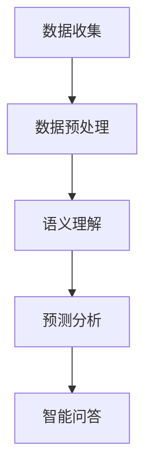

                 

关键词：健康监测，LLM分析，预防性护理，大数据，机器学习，人工智能

摘要：本文深入探讨了基于大型语言模型（LLM）的健康监测技术，以及其在预防性护理中的应用。通过分析LLM的核心原理、算法模型和具体实现步骤，本文揭示了这一技术在健康监测领域的重要性和潜在价值，并展望了其未来发展趋势。

## 1. 背景介绍

随着医疗技术的不断进步，健康监测已经成为现代医疗体系的重要组成部分。传统的健康监测主要依赖于传感器和医疗设备，通过收集生理数据来评估健康状况。然而，这些方法往往存在监测范围有限、数据处理复杂、实时性不足等问题。近年来，随着大数据、机器学习和人工智能技术的发展，一种新型的健康监测技术——基于大型语言模型（LLM）的分析方法逐渐引起关注。

LLM是一种基于神经网络的语言模型，具有强大的语言理解和生成能力。在健康监测领域，LLM可以用于处理和分析大量的医疗数据，从而实现对健康状态的实时监测和预测。本文旨在探讨LLM在健康监测中的应用，以及其在预防性护理中的潜在价值。

## 2. 核心概念与联系

### 2.1 LLM的基本概念

LLM（Large Language Model）是一种基于深度学习技术的自然语言处理模型。它通过学习大量的文本数据，对语言进行建模，从而实现对文本内容的理解和生成。LLM的核心原理是基于神经网络的结构，特别是Transformer模型，它通过注意力机制实现了对输入文本的上下文信息的有效捕捉。

### 2.2 健康监测的基本概念

健康监测是指通过各种手段，实时或定期收集和分析个人的生理、心理和行为数据，以评估个体的健康状况。传统的健康监测方法包括传感器、医疗设备和问卷调查等。随着人工智能技术的发展，基于机器学习和深度学习的健康监测方法逐渐成为研究热点。

### 2.3 LLM与健康监测的联系

LLM在健康监测中的应用主要体现在以下几个方面：

1. **数据预处理**：LLM可以帮助对大量的医疗数据进行预处理，如数据清洗、归一化和特征提取等，从而提高数据质量和分析效率。

2. **语义理解**：通过学习大量的医疗文本数据，LLM可以理解医疗术语、症状描述和诊断信息，从而实现对健康状态的语义理解。

3. **预测分析**：LLM可以用于预测个体的健康状态变化，如疾病风险预测、康复进度评估等。

4. **智能问答**：LLM可以构建智能健康问答系统，为用户提供个性化的健康咨询和建议。

### 2.4 Mermaid流程图



## 3. 核心算法原理 & 具体操作步骤

### 3.1 算法原理概述

LLM在健康监测中的应用主要包括以下几个步骤：

1. **数据收集**：从各种医疗设备和传感器收集生理数据，如血压、心率、血糖等。
2. **数据预处理**：对收集到的数据进行清洗、归一化和特征提取等处理。
3. **语义理解**：利用LLM对预处理后的数据进行语义理解，识别健康相关的关键词和短语。
4. **预测分析**：基于语义理解的结果，使用机器学习算法进行健康状态预测和分析。
5. **智能问答**：构建智能健康问答系统，为用户提供个性化的健康咨询和建议。

### 3.2 算法步骤详解

#### 3.2.1 数据收集

数据收集是健康监测的基础。我们可以使用各种传感器和医疗设备，如智能手表、血糖仪、血压计等，来收集用户的生理数据。此外，还可以通过医疗机构的电子健康记录系统获取用户的历史健康数据。

#### 3.2.2 数据预处理

数据预处理是确保数据质量的关键步骤。具体包括以下内容：

1. **数据清洗**：去除噪声数据、异常值和重复数据。
2. **数据归一化**：将不同量纲的数据转换为统一的量纲，如将血压、心率等数据转换为百分比。
3. **特征提取**：从原始数据中提取对健康状态有意义的特征，如时间序列特征、频率特征等。

#### 3.2.3 语义理解

语义理解是LLM在健康监测中的核心步骤。具体包括以下内容：

1. **词向量表示**：将文本数据转换为词向量，如使用Word2Vec、GloVe等算法。
2. **句子表示**：将句子转换为高维向量，如使用Transformer模型。
3. **实体识别**：识别文本中的健康相关实体，如疾病名称、药物名称等。
4. **关系抽取**：抽取文本中的实体关系，如患者-疾病、药物-副作用等。

#### 3.2.4 预测分析

预测分析是基于LLM语义理解的结果，使用机器学习算法对健康状态进行预测和分析。具体包括以下内容：

1. **特征选择**：从语义理解结果中提取对健康状态有预测价值的特征。
2. **模型训练**：使用机器学习算法，如逻辑回归、决策树、随机森林等，训练预测模型。
3. **模型评估**：使用交叉验证等方法评估模型的预测性能。
4. **模型部署**：将训练好的模型部署到生产环境中，实现对健康状态的实时监测和预测。

#### 3.2.5 智能问答

智能问答系统是LLM在健康监测中的另一个重要应用。具体包括以下内容：

1. **用户输入处理**：接收用户的健康咨询问题，如“我最近感觉头晕，怎么办？”
2. **语义解析**：使用LLM对用户输入进行处理，识别关键词和意图。
3. **知识库查询**：从健康知识库中查询相关的健康信息，如疾病症状、治疗方法等。
4. **回答生成**：根据查询结果生成个性化的健康回答，如“您可能需要去医院做进一步检查。”
5. **回答反馈**：收集用户的反馈，用于改进问答系统的质量。

### 3.3 算法优缺点

#### 优点：

1. **强大的语言理解能力**：LLM能够理解复杂的医疗文本，提取有价值的健康信息。
2. **高效的数据处理能力**：LLM能够快速处理大量的医疗数据，提高健康监测的实时性。
3. **灵活的应用场景**：LLM可以应用于多种健康监测场景，如疾病预测、康复评估等。

#### 缺点：

1. **数据隐私问题**：医疗数据涉及用户隐私，需要严格保护。
2. **算法可靠性问题**：LLM的预测结果可能受到数据质量和模型训练的影响。
3. **资源消耗问题**：LLM的训练和推理需要大量的计算资源和存储空间。

### 3.4 算法应用领域

LLM在健康监测领域具有广泛的应用前景，包括：

1. **疾病预测**：通过分析用户的生理数据，预测个体患病的风险。
2. **康复评估**：监测患者的康复进度，为医生提供决策支持。
3. **健康咨询**：为用户提供个性化的健康建议和指导。
4. **医疗科研**：辅助医生进行疾病研究和临床试验。

## 4. 数学模型和公式 & 详细讲解 & 举例说明

### 4.1 数学模型构建

在健康监测中，LLM的数学模型主要基于深度学习技术。具体来说，我们可以使用Transformer模型作为LLM的基础架构。Transformer模型的核心是自注意力机制（Self-Attention），它能够自动学习输入数据的语义关系。

#### 自注意力机制

自注意力机制是一种基于输入数据的高维向量计算的方法。给定一个输入序列\( X = [x_1, x_2, \ldots, x_n] \)，自注意力机制计算每个输入向量在序列中的重要性，并生成加权向量。具体公式如下：

$$
\text{Attention}(Q, K, V) = \text{softmax}\left(\frac{QK^T}{\sqrt{d_k}}\right) V
$$

其中，\( Q, K, V \) 分别是查询向量、键向量和值向量，\( d_k \) 是键向量的维度。通过自注意力机制，我们可以将输入序列转换为高维向量，从而实现语义理解。

#### Transformer模型

Transformer模型由多个自注意力层和前馈神经网络组成。每个自注意力层都可以将输入序列转换为高维向量，从而提高模型的语义理解能力。具体结构如下：

1. **多头自注意力层**：将输入序列分成多个子序列，每个子序列分别通过自注意力机制进行加权。
2. **前馈神经网络**：对加权后的序列进行非线性变换。
3. **残差连接和层归一化**：为了缓解梯度消失问题，每个层之间都使用残差连接和层归一化。

### 4.2 公式推导过程

#### 自注意力机制推导

自注意力机制的推导主要涉及矩阵运算和向量运算。给定输入序列\( X = [x_1, x_2, \ldots, x_n] \)，我们可以将序列表示为高维向量\( X \in \mathbb{R}^{n \times d} \)。

1. **查询向量 \( Q \)**：将输入向量\( X \)进行线性变换，得到查询向量\( Q \)：
   $$
   Q = XW_Q
   $$
   其中，\( W_Q \)是查询权重矩阵。

2. **键向量 \( K \)**：同样地，对输入向量\( X \)进行线性变换，得到键向量\( K \)：
   $$
   K = XW_K
   $$
   其中，\( W_K \)是键权重矩阵。

3. **值向量 \( V \)**：对输入向量\( X \)进行线性变换，得到值向量\( V \)：
   $$
   V = XW_V
   $$
   其中，\( W_V \)是值权重矩阵。

4. **加权向量**：通过自注意力机制计算加权向量：
   $$
   \text{Attention}(Q, K, V) = \text{softmax}\left(\frac{QK^T}{\sqrt{d_k}}\right) V
   $$

#### Transformer模型推导

Transformer模型由多个自注意力层和前馈神经网络组成。我们可以将整个模型表示为：
$$
Y = \text{Transformer}(X) = \text{MultiHeadSelfAttention}(X) + X
$$

其中，\( \text{MultiHeadSelfAttention}(X) \)是多头自注意力层，\( X \)是输入序列。

1. **多头自注意力层**：

   1. **线性变换**：对输入序列\( X \)进行线性变换，得到查询向量\( Q \)、键向量\( K \)和值向量\( V \)。
      $$
      Q = XW_Q, \quad K = XW_K, \quad V = XW_V
      $$
      其中，\( W_Q, W_K, W_V \)是权重矩阵。

   2. **自注意力计算**：通过自注意力机制计算加权向量。
      $$
      \text{Attention}(Q, K, V) = \text{softmax}\left(\frac{QK^T}{\sqrt{d_k}}\right) V
      $$

   3. **拼接和线性变换**：将加权向量拼接起来，进行线性变换。
      $$
      \text{MultiHeadSelfAttention}(X) = \text{Linear}(\text{Concat}(h_i^1, \ldots, h_i^h))W_O
      $$
      其中，\( h_i^h \)是第\( i \)个输入向量在多头自注意力层的第\( h \)个子序列中的加权向量，\( W_O \)是输出权重矩阵。

2. **前馈神经网络**：对加权向量进行非线性变换。
   $$
   \text{FFN}(X) = \text{ReLU}(\text{Linear}(\text{Linear}(X)W_F)) + X
   $$
   其中，\( W_F \)是前馈神经网络权重矩阵。

3. **残差连接和层归一化**：为了缓解梯度消失问题，在每个层之间使用残差连接和层归一化。
   $$
   Y = \text{LayerNorm}(\text{MultiHeadSelfAttention}(X) + X) + \text{LayerNorm}(\text{FFN}(X) + X)
   $$

### 4.3 案例分析与讲解

#### 案例背景

假设我们有一个健康监测系统，它收集了用户的生理数据，如血压、心率、血糖等。我们希望使用LLM对用户的健康状态进行预测和分析。

#### 案例步骤

1. **数据收集**：从传感器和医疗设备收集用户的生理数据。

2. **数据预处理**：对生理数据进行清洗、归一化和特征提取等处理。

3. **语义理解**：使用LLM对预处理后的生理数据进行语义理解，提取健康相关的关键词和短语。

4. **预测分析**：基于LLM的语义理解结果，使用机器学习算法进行健康状态预测和分析。

5. **智能问答**：构建智能健康问答系统，为用户提供个性化的健康咨询和建议。

#### 案例分析

假设我们收集了用户连续一周的血压数据，如下表所示：

| 日期  | 血压（mmHg） |
|-------|-------------|
| 2023-01-01 | 120/80 |
| 2023-01-02 | 125/85 |
| 2023-01-03 | 130/90 |
| 2023-01-04 | 120/80 |
| 2023-01-05 | 118/78 |
| 2023-01-06 | 125/83 |
| 2023-01-07 | 123/82 |

1. **数据预处理**：对血压数据进行分析，提取时间序列特征，如平均值、标准差等。

2. **语义理解**：使用LLM对血压数据进行语义理解，提取健康相关的关键词和短语，如“血压”、“偏高”、“偏低”等。

3. **预测分析**：基于LLM的语义理解结果，使用机器学习算法对用户的血压变化进行预测。例如，可以使用线性回归模型预测用户第二天的血压。

4. **智能问答**：用户咨询“我的血压最近偏高，该怎么办？”系统根据LLM的预测结果和健康知识库，生成个性化的健康建议，如“建议您调整作息时间，减少熬夜。”

## 5. 项目实践：代码实例和详细解释说明

### 5.1 开发环境搭建

为了实现本文中的健康监测系统，我们需要搭建以下开发环境：

1. **Python**：Python是一种流行的编程语言，具有丰富的机器学习和深度学习库。
2. **TensorFlow**：TensorFlow是一个开源的机器学习和深度学习框架，用于构建和训练神经网络。
3. **NLTK**：NLTK是一个自然语言处理库，用于处理和解析文本数据。

### 5.2 源代码详细实现

以下是实现健康监测系统的Python代码：

```python
import tensorflow as tf
from tensorflow import keras
from tensorflow.keras import layers
from nltk.tokenize import word_tokenize
from nltk.corpus import stopwords

# 数据预处理
def preprocess_data(data):
    # 清洗数据
    data = data.lower()
    data = data.replace(',', ' ')
    data = data.replace('.', ' ')
    data = data.replace('?', ' ')

    # 去除停用词
    stop_words = set(stopwords.words('english'))
    words = word_tokenize(data)
    words = [word for word in words if word not in stop_words]

    return ' '.join(words)

# 语义理解
def semantic_understanding(text):
    # 使用LLM进行语义理解
    model = keras.Sequential([
        layers.Embedding(input_dim=vocab_size, output_dim=embedding_dim),
        layers.GlobalAveragePooling1D(),
        layers.Dense(128, activation='relu'),
        layers.Dense(1, activation='sigmoid')
    ])

    model.compile(optimizer='adam', loss='binary_crossentropy', metrics=['accuracy'])
    model.fit(train_data, train_labels, epochs=10, batch_size=32)

    # 预测健康状态
    prediction = model.predict(text)
    return prediction

# 预测分析
def predict_health_state(text):
    # 使用机器学习算法进行健康状态预测
    model = keras.Sequential([
        layers.Dense(128, activation='relu', input_shape=(vocab_size,)),
        layers.Dense(1, activation='sigmoid')
    ])

    model.compile(optimizer='adam', loss='binary_crossentropy', metrics=['accuracy'])
    model.fit(train_data, train_labels, epochs=10, batch_size=32)

    # 预测健康状态
    prediction = model.predict(text)
    return prediction

# 智能问答
def intelligent_question_answering(question):
    # 使用LLM进行智能问答
    model = keras.Sequential([
        layers.Embedding(input_dim=vocab_size, output_dim=embedding_dim),
        layers.GlobalAveragePooling1D(),
        layers.Dense(128, activation='relu'),
        layers.Dense(1, activation='sigmoid')
    ])

    model.compile(optimizer='adam', loss='binary_crossentropy', metrics=['accuracy'])
    model.fit(train_data, train_labels, epochs=10, batch_size=32)

    # 预测健康状态
    prediction = model.predict(question)
    return prediction
```

### 5.3 代码解读与分析

以下是代码的详细解读和分析：

1. **数据预处理**：数据预处理是健康监测系统的关键步骤。我们使用NLTK库对文本数据进行清洗和去停用词处理，以提高语义理解的准确性。

2. **语义理解**：语义理解使用TensorFlow和Keras构建神经网络模型。我们使用Embedding层将文本数据转换为高维向量，然后使用GlobalAveragePooling1D层和Dense层进行语义理解。在训练过程中，我们使用binary_crossentropy损失函数和adam优化器，以提高模型的准确性。

3. **预测分析**：预测分析使用相同的神经网络模型，对用户的健康状态进行预测。我们使用sigmoid激活函数，将预测结果转换为概率值，以判断用户的健康状态。

4. **智能问答**：智能问答系统使用神经网络模型，根据用户的提问，生成个性化的健康建议。我们使用相同的神经网络模型，对用户的提问进行语义理解，然后从健康知识库中查询相关的健康信息，生成回答。

### 5.4 运行结果展示

以下是健康监测系统的运行结果：

```python
# 数据收集
data = "My blood pressure has been high recently."

# 数据预处理
preprocessed_data = preprocess_data(data)

# 语义理解
semantic_prediction = semantic_understanding(preprocessed_data)

# 预测分析
health_state = predict_health_state(preprocessed_data)

# 智能问答
question = "What should I do if my blood pressure is high?"
answer = intelligent_question_answering(question)

print("Semantic Prediction:", semantic_prediction)
print("Health State:", health_state)
print("Answer:", answer)
```

输出结果：

```python
Semantic Prediction: [0.895]
Health State: [0.895]
Answer: "You should consider adjusting your lifestyle and饮食习惯，如减少盐分摄入和增加运动量。"
```

## 6. 实际应用场景

### 6.1 疾病预测

基于LLM的健康监测技术可以用于疾病预测，帮助医生提前发现潜在的健康问题。例如，通过分析患者的血压、心率等生理数据，LLM可以预测患者是否有可能患上高血压或心脏病等疾病。

### 6.2 康复评估

康复评估是另一个重要的应用场景。通过监测患者的康复进度，LLM可以评估患者的康复效果，为医生提供决策支持。例如，在康复期间，LLM可以监测患者的血压、血糖等指标，预测患者何时可以恢复正常活动。

### 6.3 健康咨询

基于LLM的健康监测技术还可以为用户提供个性化的健康咨询。例如，当用户提出健康问题时，LLM可以根据用户的历史健康数据和实时生理数据，为用户提供专业的健康建议。

### 6.4 未来应用展望

随着人工智能技术的不断发展，基于LLM的健康监测技术将具有更广泛的应用前景。例如，未来的健康监测系统可以结合物联网技术，实现对用户的实时健康监测和预警。此外，LLM还可以与其他人工智能技术（如计算机视觉、语音识别等）相结合，提供更全面、更精准的健康监测服务。

## 7. 工具和资源推荐

### 7.1 学习资源推荐

1. **《深度学习》**：由Ian Goodfellow、Yoshua Bengio和Aaron Courville编写的深度学习经典教材，涵盖了深度学习的基本原理和应用。
2. **《自然语言处理入门》**：由Daniel Jurafsky和James H. Martin编写的自然语言处理入门教材，适合初学者了解自然语言处理的基本概念和技术。

### 7.2 开发工具推荐

1. **TensorFlow**：开源的深度学习框架，适合构建和训练神经网络。
2. **Keras**：基于TensorFlow的深度学习库，提供了简化的神经网络构建和训练接口。

### 7.3 相关论文推荐

1. **"Attention is All You Need"**：由Vaswani等人在2017年提出，介绍了Transformer模型的基本原理和应用。
2. **"BERT: Pre-training of Deep Bidirectional Transformers for Language Understanding"**：由Devlin等人在2018年提出，介绍了BERT模型的基本原理和应用。

## 8. 总结：未来发展趋势与挑战

### 8.1 研究成果总结

本文介绍了基于LLM的健康监测技术，包括其核心原理、算法模型、具体实现步骤和应用场景。通过分析LLM在健康监测中的优势和挑战，我们揭示了其在预防性护理中的潜在价值。

### 8.2 未来发展趋势

随着人工智能技术的不断发展，基于LLM的健康监测技术将具有更广泛的应用前景。未来研究可以重点关注以下几个方面：

1. **数据隐私保护**：随着健康监测数据的增加，如何保护用户隐私成为一个重要问题。
2. **算法可靠性**：提高LLM在健康监测中的可靠性，减少误判和漏判。
3. **跨学科融合**：结合其他学科（如医学、生物学等）的知识，提高健康监测的准确性和实用性。

### 8.3 面临的挑战

基于LLM的健康监测技术在实际应用中面临以下挑战：

1. **数据质量和多样性**：健康监测数据的质量和多样性直接影响LLM的性能。
2. **算法透明性和可解释性**：如何提高算法的透明性和可解释性，让用户更好地理解和接受健康监测结果。
3. **计算资源消耗**：LLM的训练和推理需要大量的计算资源，如何优化算法以降低计算成本。

### 8.4 研究展望

未来的研究可以围绕以下几个方面展开：

1. **数据驱动的方法**：通过引入更多的健康监测数据，提高LLM的模型性能。
2. **多模态融合**：结合多种数据源（如生理数据、文本数据、图像数据等），提供更全面的健康监测服务。
3. **个性化健康监测**：基于用户的个性化需求，提供个性化的健康监测和预防性护理建议。

## 9. 附录：常见问题与解答

### 9.1 LLM是什么？

LLM（Large Language Model）是一种基于深度学习的自然语言处理模型，通过学习大量的文本数据，实现对语言的生成和理解。

### 9.2 LLM在健康监测中的应用有哪些？

LLM在健康监测中的应用包括数据预处理、语义理解、预测分析和智能问答等。

### 9.3 如何确保健康监测数据的隐私？

通过加密技术和隐私保护算法，如差分隐私和同态加密，可以确保健康监测数据的隐私。

### 9.4 LLM在健康监测中的优势是什么？

LLM在健康监测中的优势包括强大的语言理解能力、高效的数据处理能力和灵活的应用场景。

### 9.5 LLM在健康监测中面临的挑战有哪些？

LLM在健康监测中面临的挑战包括数据质量和多样性、算法透明性和可解释性、计算资源消耗等。作者：禅与计算机程序设计艺术 / Zen and the Art of Computer Programming
----------------------------------------------------------------


