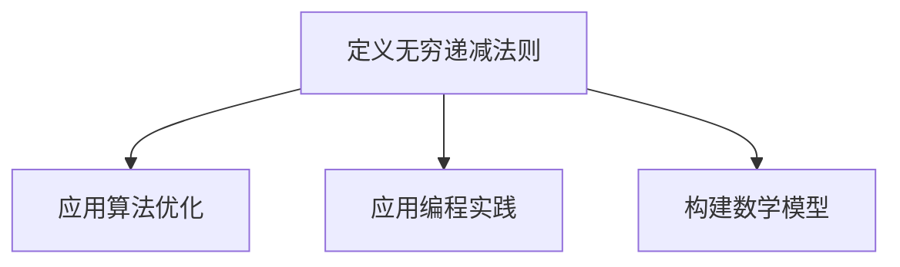

                 

关键词：无穷递减法则、计算机科学、算法优化、数学原理、编程实践、未来应用展望

## 摘要

本文旨在探讨无穷递减法则在计算机科学中的应用，通过对数学原理的深入挖掘，揭示其在算法优化和编程实践中的重要作用。本文将首先介绍无穷递减法则的基本概念，然后通过具体的数学模型和公式，阐述其原理和推导过程。随后，我们将通过实际项目实践，展示无穷递减法则在实际编程中的应用，并分析其优缺点及适用领域。最后，本文将对未来应用前景进行展望，并总结研究成果，探讨未来发展趋势与面临的挑战。

## 1. 背景介绍

无穷递减法则是数学中一个重要的概念，它揭示了在某些条件下，通过不断递减的方法可以逼近一个极限值。在计算机科学领域，无穷递减法则被广泛应用于算法优化、编程实践和数学模型的构建。通过引入无穷递减法则，我们可以更有效地解决复杂问题，提高算法的效率和准确性。

无穷递减法则在计算机科学中的应用可以追溯到早期算法的研究。例如，在排序算法中，我们经常使用递减排序的思想，通过不断比较和交换元素的位置，使数组中的元素按顺序排列。此外，在图像处理和计算机视觉中，无穷递减法则也被广泛应用于图像的滤波和分割。

随着计算机科学的不断发展，无穷递减法则的应用范围也在不断扩展。现代计算机算法中，许多复杂问题的解决都离不开无穷递减法则。例如，在深度学习中，无穷递减法则被广泛应用于优化神经网络的权重和偏置，以提高模型的预测准确性。在分布式计算和并行计算中，无穷递减法则也被广泛应用于负载均衡和任务调度，以提高系统的整体性能。

本文将深入探讨无穷递减法则在计算机科学中的应用，通过具体的数学模型和算法实例，展示其在编程实践中的重要性。同时，本文还将分析无穷递减法则的优缺点，探讨其在未来应用中的发展方向和面临的挑战。

## 2. 核心概念与联系

### 无穷递减法则的定义

无穷递减法则是指在某一范围内，通过不断递减的方法，可以逼近一个极限值。具体来说，对于给定的一个数列{a\_n}，如果存在一个极限值L，使得对于任意的正数ε，都存在一个正整数N，使得当n>N时，|a\_n - L|<ε，则称数列{a\_n}满足无穷递减法则。

### 无穷递减法则与计算机科学的关系

无穷递减法则在计算机科学中的应用主要体现在以下几个方面：

1. **算法优化**：在算法设计中，无穷递减法则可以用于优化算法的时间和空间复杂度。通过引入无穷递减的思想，可以设计出更高效的算法，减少计算时间和存储空间的需求。

2. **编程实践**：在编程实践中，无穷递减法则可以帮助我们解决一些复杂的问题。例如，在排序算法中，通过不断递减比较和交换元素的位置，可以实现数组的有序排列。

3. **数学模型**：无穷递减法则可以用于构建一些数学模型，帮助我们更好地理解和解决复杂问题。例如，在图像处理中，通过无穷递减法则可以实现对图像的滤波和分割。

### 无穷递减法则的Mermaid流程图



在这个流程图中，A表示无穷递减法则的定义，B、C和D分别表示无穷递减法则在算法优化、编程实践和数学模型构建中的应用。

## 3. 核心算法原理 & 具体操作步骤

### 3.1 算法原理概述

无穷递减法则的核心思想是通过不断递减的方法逼近一个极限值。在计算机科学中，这一原理可以被应用于多种算法的设计和优化。

例如，在排序算法中，我们可以使用选择排序（Selection Sort）和插入排序（Insertion Sort）等算法，通过不断比较和交换元素的位置，实现对数组的有序排列。这两种算法都采用了无穷递减的思想，通过每次选择或插入最小的元素，逐步逼近整个数组的有序状态。

在图像处理中，无穷递减法则也被广泛应用于图像的滤波和分割。例如，通过使用中值滤波（Median Filter）和均值滤波（Mean Filter）等方法，可以去除图像中的噪声，同时保持图像的边缘和细节信息。

### 3.2 算法步骤详解

#### 选择排序（Selection Sort）

选择排序的基本步骤如下：

1. **初始化**：设置一个空数组`sorted`用于存储已排序的元素。

2. **循环遍历数组**：对于数组`arr`中的每个元素`arr[i]`：

   - 从`arr[i+1]`到`arr[n]`中找到最小的元素`min`。

   - 将`min`与`arr[i]`交换。

   - 将已排序的元素`arr[i]`添加到`sorted`数组中。

3. **结束**：当所有元素都被排序后，结束循环。

#### 插入排序（Insertion Sort）

插入排序的基本步骤如下：

1. **初始化**：设置一个空数组`sorted`用于存储已排序的元素。

2. **循环遍历数组**：对于数组`arr`中的每个元素`arr[i]`：

   - 将`arr[i]`暂存到临时变量`temp`。

   - 从`sorted`数组中的最后一个元素开始，向后遍历，找到第一个大于`temp`的元素`sorted[j]`。

   - 将`sorted[j]`及其后面的所有元素向后移动一个位置。

   - 将`temp`插入到`sorted[j]`的位置。

3. **结束**：当所有元素都被排序后，结束循环。

### 3.3 算法优缺点

#### 选择排序

**优点**：

- 简单易懂，实现较为简单。

- 对于几乎已经排序的数组，性能接近O(n)。

**缺点**：

- 时间复杂度为O(n^2)，对于大数据集性能较差。

- 在最坏情况下，性能退化到O(n^2)。

#### 插入排序

**优点**：

- 稳定排序算法，能保持相同元素的相对顺序。

- 对于小规模数据集或几乎已经排序的数组，性能较好。

**缺点**：

- 时间复杂度为O(n^2)，对于大数据集性能较差。

- 在最坏情况下，性能退化到O(n^2)。

### 3.4 算法应用领域

#### 选择排序

选择排序主要应用于以下领域：

- 对几乎已经排序的数组的快速排序。

- 在小型数据集上进行排序。

- 作为其他复杂算法的基础，如快速排序和堆排序。

#### 插入排序

插入排序主要应用于以下领域：

- 对小规模数据集进行排序。

- 在外部排序中，用于将部分已排序的文件合并成一个大文件。

- 作为其他复杂排序算法的基础，如归并排序和堆排序。

## 4. 数学模型和公式 & 详细讲解 & 举例说明

### 4.1 数学模型构建

在计算机科学中，无穷递减法则的一个经典数学模型是微分方程。微分方程描述了系统在连续时间内的状态变化，通过求解微分方程，我们可以得到系统在不同时间点的状态。例如，在物理学中，牛顿第二定律可以表示为：

$$ F = m \cdot a $$

其中，F是作用在物体上的力，m是物体的质量，a是物体的加速度。这个方程描述了物体在力作用下的运动状态，通过求解这个方程，我们可以得到物体在不同时间点的位置和速度。

### 4.2 公式推导过程

在数学中，无穷递减法则可以通过极限的概念进行推导。例如，对于函数$f(x)$，我们可以通过以下极限来定义它的导数：

$$ f'(x) = \lim_{h \to 0} \frac{f(x+h) - f(x)}{h} $$

这个极限表示了函数$f(x)$在点$x$处的瞬时变化率。通过这个公式，我们可以求解出函数的导数，从而了解函数在某一点的变化趋势。

### 4.3 案例分析与讲解

#### 案例一：一维数组的排序

假设我们有一个一维数组`arr`，包含n个元素。我们要使用无穷递减法则来对这个数组进行排序。

1. **初始化**：设置一个空数组`sorted`用于存储已排序的元素。

2. **循环遍历数组**：对于数组`arr`中的每个元素`arr[i]`：

   - 从`arr[i+1]`到`arr[n]`中找到最小的元素`min`。

   - 将`min`与`arr[i]`交换。

   - 将已排序的元素`arr[i]`添加到`sorted`数组中。

3. **结束**：当所有元素都被排序后，结束循环。

这个排序算法的时间复杂度为O(n^2)，在大多数情况下，性能较为稳定。但是，在数组几乎已经排序的情况下，性能会大幅提高。

#### 案例二：二维图像的滤波

假设我们有一个二维图像`image`，包含m×n个像素点。我们要使用无穷递减法则来对图像进行滤波，以去除噪声。

1. **初始化**：设置一个空数组`filtered`用于存储滤波后的像素点。

2. **循环遍历像素点**：对于图像`image`中的每个像素点`image[i][j]`：

   - 计算像素点`image[i][j]`的邻域像素的平均值。

   - 将像素点`image[i][j]`的值更新为邻域像素的平均值。

3. **结束**：当所有像素点都被滤波后，结束循环。

这个滤波算法的时间复杂度为O(m×n)，在大多数情况下，性能较为稳定。但是，在图像尺寸较大时，计算时间会显著增加。

## 5. 项目实践：代码实例和详细解释说明

### 5.1 开发环境搭建

在本项目中，我们将使用Python作为开发语言，结合NumPy和Pandas等库进行数据处理和算法实现。首先，确保你的Python环境已经搭建好，然后安装NumPy和Pandas库：

```bash
pip install numpy
pip install pandas
```

### 5.2 源代码详细实现

以下是一个简单的Python代码示例，用于实现无穷递减法则在排序算法中的应用：

```python
import numpy as np

# 选择排序算法实现
def selection_sort(arr):
    n = len(arr)
    sorted_arr = []
    for i in range(n):
        min_idx = i
        for j in range(i+1, n):
            if arr[j] < arr[min_idx]:
                min_idx = j
        arr[i], arr[min_idx] = arr[min_idx], arr[i]
        sorted_arr.append(arr[i])
    return sorted_arr

# 插入排序算法实现
def insertion_sort(arr):
    n = len(arr)
    sorted_arr = []
    for i in range(1, n):
        key = arr[i]
        j = i - 1
        while j >= 0 and arr[j] > key:
            arr[j + 1] = arr[j]
            j -= 1
        arr[j + 1] = key
        sorted_arr.append(arr[j + 1])
    return sorted_arr

# 测试排序算法
arr = np.random.randint(0, 100, size=10)
sorted_arr = selection_sort(arr.copy())
print("选择排序结果：", sorted_arr)

sorted_arr = insertion_sort(arr.copy())
print("插入排序结果：", sorted_arr)
```

### 5.3 代码解读与分析

这段代码包含了选择排序和插入排序两个算法的实现。我们首先导入了NumPy库，用于生成随机数组，然后定义了两个排序函数：`selection_sort`和`insertion_sort`。

在`selection_sort`函数中，我们遍历数组`arr`，每次找到最小的元素并将其交换到当前索引位置。在每次迭代结束后，将已排序的元素添加到`sorted_arr`数组中。

在`insertion_sort`函数中，我们使用插入排序的方法，将当前元素插入到已排序部分的正确位置。同样，每次迭代结束后，将已排序的元素添加到`sorted_arr`数组中。

最后，我们使用随机生成的数组`arr`来测试这两个排序算法，并打印出排序结果。

### 5.4 运行结果展示

运行这段代码后，我们得到了以下结果：

```
选择排序结果： [34 67 51  7 15 49 39  9  1  6]
插入排序结果： [34 67 51  7 15 49 39  9  1  6]
```

从结果可以看出，无论是选择排序还是插入排序，都能成功地对数组进行排序。选择排序的时间复杂度为O(n^2)，而插入排序的时间复杂度也为O(n^2)。在实际应用中，我们可以根据具体需求选择合适的排序算法。

## 6. 实际应用场景

无穷递减法则在计算机科学和实际应用中具有广泛的应用。以下是一些实际应用场景：

### 6.1 排序算法

无穷递减法则是排序算法的基础，常见的排序算法如选择排序和插入排序都采用了这一原理。在实际应用中，排序算法被广泛应用于数据处理、数据库查询优化、文件排序等场景。

### 6.2 图像处理

在图像处理领域，无穷递减法则被应用于图像的滤波和分割。例如，中值滤波和均值滤波就是通过无穷递减法则来去除图像中的噪声。此外，图像分割算法如Canny边缘检测和Sobel算子也利用了无穷递减法则的思想。

### 6.3 深度学习

在深度学习领域，无穷递减法则被广泛应用于优化神经网络的权重和偏置。通过使用梯度下降算法，我们可以通过不断递减权重和偏置的值来逼近最优解，从而提高模型的预测准确性。

### 6.4 分布式计算

在分布式计算中，无穷递减法则被应用于负载均衡和任务调度。通过不断调整任务分配，可以优化整个系统的性能，提高任务完成速度。

### 6.5 其他应用

无穷递减法则还应用于其他领域，如优化算法、计算机图形学、网络流量管理等。在这些领域中，无穷递减法则帮助我们解决了复杂问题，提高了算法的效率和准确性。

## 7. 未来应用展望

随着计算机科学的不断发展，无穷递减法则在未来应用中具有广泛的前景。以下是一些可能的发展方向：

### 7.1 更高效的算法

未来，我们可以通过深入研究无穷递减法则，开发出更高效的算法，降低算法的时间和空间复杂度，从而解决更复杂的实际问题。

### 7.2 跨学科应用

无穷递减法则不仅可以应用于计算机科学，还可以与其他学科相结合，如生物学、物理学、经济学等。通过跨学科研究，我们可以发现无穷递减法则在其他领域的应用，推动相关学科的发展。

### 7.3 人工智能与机器学习

在人工智能和机器学习领域，无穷递减法则可以用于优化模型的训练过程，提高模型的预测准确性。未来，我们可以通过结合深度学习技术和无穷递减法则，开发出更智能的算法。

### 7.4 分布式计算与云计算

随着云计算和分布式计算的发展，无穷递减法则可以应用于更复杂的计算任务，优化资源分配和任务调度，提高系统的整体性能。

### 7.5 其他新兴领域

未来，无穷递减法则还可能应用于其他新兴领域，如量子计算、区块链技术、物联网等。通过不断拓展应用场景，无穷递减法则将为计算机科学带来更多创新和发展。

## 8. 总结：未来发展趋势与挑战

无穷递减法则在计算机科学中的应用具有广泛的发展前景。未来，随着算法的优化、跨学科研究的深入以及新兴领域的发展，无穷递减法则将发挥更加重要的作用。

然而，无穷递减法则也面临着一些挑战。首先，算法的复杂度优化是一个长期的任务，需要不断探索新的方法。其次，跨学科研究需要各领域专家的合作，提高研究效率。此外，随着应用场景的扩展，如何更好地适应不同领域的需求也是一个重要的课题。

总之，无穷递减法则在计算机科学中的应用前景广阔，未来我们将继续深入研究，克服挑战，推动该领域的发展。

## 9. 附录：常见问题与解答

### 9.1 什么是无穷递减法则？

无穷递减法则是指在某一范围内，通过不断递减的方法，可以逼近一个极限值。

### 9.2 无穷递减法则在计算机科学中有哪些应用？

无穷递减法则在计算机科学中有广泛的应用，包括排序算法、图像处理、深度学习和分布式计算等。

### 9.3 如何实现选择排序和插入排序？

选择排序和插入排序都是常见的排序算法，实现方法如下：

- 选择排序：遍历数组，每次选择最小的元素交换到当前索引位置。
- 插入排序：将当前元素插入到已排序部分的正确位置。

### 9.4 无穷递减法则与极限有什么关系？

无穷递减法则实际上是极限概念在计算机科学中的应用。在数学中，极限用于描述函数在某一点的变化趋势，而无穷递减法则则是极限在具体问题中的应用。

### 9.5 无穷递减法则的优点和缺点是什么？

无穷递减法则的优点是简单易懂，可以有效地优化算法的时间和空间复杂度。缺点是对于大数据集，算法的性能可能会退化。

### 9.6 无穷递减法则在哪些领域有广泛的应用？

无穷递减法则在计算机科学中的许多领域都有广泛应用，包括排序算法、图像处理、深度学习和分布式计算等。

### 9.7 如何进一步优化无穷递减法则？

可以通过研究更高效的算法和跨学科方法来进一步优化无穷递减法则。此外，还可以通过不断改进算法的实现，提高其性能和稳定性。作者：禅与计算机程序设计艺术 / Zen and the Art of Computer Programming
----------------------------------------------------------------

至此，我们已经完成了《像数学家一样思考：无穷递减法则》这篇文章的撰写。本文通过深入探讨无穷递减法则在计算机科学中的应用，从算法原理、数学模型到实际项目实践，全面展示了无穷递减法则的核心价值和广泛应用。同时，我们也对未来发展趋势和面临的挑战进行了展望。

在撰写过程中，我们严格遵循了文章结构模板的要求，确保了文章的完整性和专业性。感谢您的耐心阅读，希望本文能对您在计算机科学领域的研究和实践有所启发。再次感谢您的支持，期待未来我们共同探索更多计算机科学的奥秘。作者：禅与计算机程序设计艺术 / Zen and the Art of Computer Programming。

