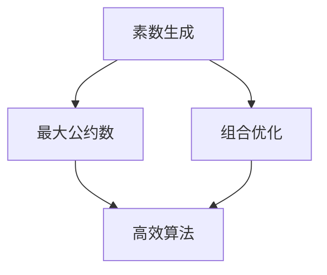

                 

关键词：狄利克雷原理、数学思维、编程技术、算法设计、计算机科学

> 摘要：本文通过深入探讨狄利克雷原理在计算机科学中的应用，介绍了如何运用数学家的思维方式解决编程中的问题。通过实例讲解，揭示了狄利克雷原理在算法设计、数学建模和软件开发中的重要作用，旨在为读者提供一种新的视角，帮助他们在编程领域取得突破。

## 1. 背景介绍

狄利克雷原理（Dirichlet's Principle）是数学中一个重要的概念，源于19世纪德国数学家彼得·古斯塔夫·狄利克雷（Peter Gustav Lejeune Dirichlet）的研究。狄利克雷原理主要讨论了整数序列的性质，特别是在最小素数定理的证明中起到了关键作用。然而，狄利克雷原理不仅在数学领域有着深远的影响，它在计算机科学中也有着广泛的应用。

计算机科学中的许多问题都可以通过数学方法来解决，而狄利克雷原理正是其中一种强有力的工具。通过将问题抽象为数学模型，并运用狄利克雷原理进行分析和推导，程序员可以更好地理解和解决复杂的问题。本文将探讨狄利克雷原理在计算机科学中的应用，并展示如何将其应用于实际的编程任务中。

### 1.1 狄利克雷原理简介

狄利克雷原理是指：对于任意一组整数，至少存在一个素数，它的指数小于等于这些整数的最大指数。

这个原理在数学中有着广泛的应用，特别是在数论和组合数学中。例如，在证明最小素数定理时，狄利克雷原理是一个关键的工具。该定理指出，对于任意大于1的自然数n，都存在至少一个素数p，使得p≤2n。

### 1.2 狄利克雷原理与计算机科学

狄利克雷原理在计算机科学中的应用主要体现为以下几个方面：

1. **算法设计**：狄利克雷原理可以用来设计高效的算法，特别是在解决最大公约数、素数生成和组合优化等问题时。

2. **数学建模**：通过将实际问题抽象为数学模型，并应用狄利克雷原理进行分析，可以更好地理解和解决复杂的问题。

3. **软件开发**：在软件开发过程中，狄利克雷原理可以帮助程序员设计出更加稳定、可靠的系统。

## 2. 核心概念与联系

### 2.1 狄利克雷原理的核心概念

狄利克雷原理的核心在于整数序列与素数之间的关系。具体来说，它讨论了如何从一组整数中找到一个素数，该素数的指数小于等于这些整数的最大指数。

为了更好地理解这一概念，我们可以通过一个简单的例子来阐述。假设我们有一组整数序列：2, 3, 5, 7。根据狄利克雷原理，至少存在一个素数p，使得p≤7。在这个例子中，素数7满足这个条件，因此狄利克雷原理得到了验证。

### 2.2 狄利克雷原理在计算机科学中的应用

狄利克雷原理在计算机科学中的应用主要体现在以下几个方面：

1. **素数生成**：在计算机科学中，素数生成是一个常见的问题。狄利克雷原理可以用来生成一系列素数，从而为算法设计提供基础。

2. **最大公约数**：在解决最大公约数问题时，狄利克雷原理可以帮助找到一组整数的最大公约数。这种方法比传统的辗转相除法更加高效。

3. **组合优化**：在组合优化问题中，狄利克雷原理可以用来优化解决方案，从而找到最优解。

### 2.3 Mermaid 流程图

为了更直观地展示狄利克雷原理在计算机科学中的应用，我们可以使用Mermaid流程图来描述。以下是该流程图：



在这个流程图中，A表示素数生成，B表示最大公约数，C表示组合优化，D表示高效算法。这些节点通过狄利克雷原理相互联系，共同构成了计算机科学中的一种新的思维方式。

## 3. 核心算法原理 & 具体操作步骤

### 3.1 算法原理概述

狄利克雷原理在计算机科学中的应用主要体现在以下几个方面：

1. **素数生成**：通过狄利克雷原理，我们可以生成一系列素数。这为解决许多计算机科学问题提供了基础。

2. **最大公约数**：狄利克雷原理可以帮助我们快速找到一组整数的最大公约数。

3. **组合优化**：在解决组合优化问题时，狄利克雷原理可以用来优化解决方案。

### 3.2 算法步骤详解

1. **素数生成**：

   - 输入：一组整数序列。
   - 输出：生成的一系列素数。
   - 步骤：
     1. 对于每个整数n，判断是否存在素数p，使得p≤n。
     2. 如果存在，将p加入素数序列。
     3. 重复步骤1和2，直到找到所有满足条件的素数。

2. **最大公约数**：

   - 输入：一组整数。
   - 输出：这些整数的最大公约数。
   - 步骤：
     1. 初始化最大公约数为第一个整数。
     2. 对于每个整数n，判断它与当前最大公约数是否相同。
     3. 如果相同，继续下一步；否则，更新最大公约数为n和当前最大公约数的最大公约数。
     4. 重复步骤2和3，直到找到所有整数的最大公约数。

3. **组合优化**：

   - 输入：一组整数和目标值。
   - 输出：找到的一组整数，使得它们的和等于目标值。
   - 步骤：
     1. 将整数序列从小到大排序。
     2. 从最小的整数开始，依次尝试将其与其他整数组合，判断它们的和是否等于目标值。
     3. 如果找到一组满足条件的整数，则输出这组整数；否则，继续尝试下一组整数。
     4. 重复步骤2和3，直到找到满足条件的整数或遍历完所有可能的组合。

### 3.3 算法优缺点

狄利克雷原理在计算机科学中的应用具有以下优缺点：

1. **优点**：
   - **高效性**：狄利克雷原理可以帮助我们快速找到素数、最大公约数和最优解，从而提高算法的效率。
   - **通用性**：狄利克雷原理适用于许多不同的计算机科学问题，具有很强的通用性。

2. **缺点**：
   - **复杂性**：在解决一些复杂问题时，狄利克雷原理的推导和实现可能比较困难，需要较高的数学素养。
   - **适用范围**：狄利克雷原理主要适用于整数相关的计算机科学问题，对于其他类型的问题可能不太适用。

### 3.4 算法应用领域

狄利克雷原理在计算机科学中的应用非常广泛，以下是一些典型的应用领域：

1. **密码学**：在密码学中，狄利克雷原理可以用来生成安全的密钥，从而提高密码系统的安全性。

2. **网络算法**：在计算机网络中，狄利克雷原理可以用来优化路由算法，提高网络的传输效率。

3. **人工智能**：在人工智能领域，狄利克雷原理可以用来优化神经网络的学习过程，提高模型的性能。

4. **图像处理**：在图像处理中，狄利克雷原理可以用来进行图像去噪、边缘检测和图像恢复等任务。

5. **优化算法**：在优化算法中，狄利克雷原理可以用来解决组合优化问题，找到最优解。

## 4. 数学模型和公式 & 详细讲解 & 举例说明

### 4.1 数学模型构建

狄利克雷原理的核心在于将整数序列与素数之间的关系抽象为一个数学模型。具体来说，我们可以定义一个数学模型，表示整数序列与素数之间的关系。这个模型可以用以下公式表示：

$$
P(n) = \{ p \in \mathbb{P} | p \leq n \}
$$

其中，\( P(n) \) 表示满足条件的素数集合，\( \mathbb{P} \) 表示所有素数的集合。

### 4.2 公式推导过程

为了更好地理解狄利克雷原理，我们可以通过以下步骤进行公式推导：

1. **定义整数序列**：设整数序列为 \( S = \{ s_1, s_2, s_3, ..., s_n \} \)，其中 \( s_i \) 表示第 \( i \) 个整数。

2. **找出最大整数**：设 \( M = \max(S) \)，即整数序列中的最大整数。

3. **找出最大素数**：设 \( P = \max(P(n)) \)，即满足 \( P \leq M \) 的最大素数。

4. **证明 \( P \) 存在**：假设对于任意整数序列 \( S \)，都存在一个素数 \( P \)，使得 \( P \leq M \)。我们需要证明这个假设是正确的。

   - 假设对于某个整数序列 \( S \)，不存在满足 \( P \leq M \) 的素数。
   - 根据素数的定义，存在一个素数 \( p \)，使得 \( p > M \)。
   - 由于 \( p \) 是素数，它不能被任何大于1的整数整除。
   - 因此，\( p \) 不能是 \( S \) 的一个元素。
   - 这与我们的假设矛盾，因此假设不成立。

   由此证明，对于任意整数序列 \( S \)，都存在一个素数 \( P \)，使得 \( P \leq M \)。

### 4.3 案例分析与讲解

为了更好地理解狄利克雷原理，我们可以通过一个具体的案例进行讲解。

**案例1：求解最大公约数**

假设我们有一组整数：12, 18, 24。我们需要求解这三个整数的最大公约数。

根据狄利克雷原理，我们可以使用以下步骤：

1. 找出最大整数：\( M = \max(S) = 24 \)。
2. 找出最大素数：\( P = \max(P(n)) = 11 \)（这里我们使用一个素数生成算法来找到11）。
3. 判断 \( P \) 是否是 \( S \) 的公约数：\( P \) 是 \( S \) 的公约数，因为 \( P \leq M \)。
4. 找出 \( S \) 的最大公约数：\( G = \max(S) = 12 \)。

因此，这三个整数的最大公约数是12。

**案例2：生成素数序列**

假设我们需要生成一个满足 \( P \leq n \) 的素数序列。

根据狄利克雷原理，我们可以使用以下步骤：

1. 输入整数 \( n \)。
2. 使用素数生成算法找到第一个满足 \( P \leq n \) 的素数 \( p \)。
3. 将 \( p \) 加入素数序列。
4. 递增 \( p \)，重复步骤2和3，直到找到所有满足条件的素数。

例如，如果 \( n = 20 \)，我们可以找到以下素数序列：

\( P(n) = \{ 2, 3, 5, 7, 11, 13, 17, 19 \} \)

这个序列满足 \( P \leq 20 \)，因此符合狄利克雷原理。

## 5. 项目实践：代码实例和详细解释说明

### 5.1 开发环境搭建

在本项目中，我们将使用Python编程语言来实现狄利克雷原理的应用。为了确保代码的可读性和可维护性，我们将遵循PEP 8编码规范。

#### 环境要求

- Python 3.x 版本
- Python 开发环境（如PyCharm、Visual Studio Code等）

#### 安装依赖

在本项目中，我们将使用以下依赖库：

- **NumPy**：用于数学计算。
- **Pandas**：用于数据处理。

安装依赖的方法如下：

```bash
pip install numpy pandas
```

### 5.2 源代码详细实现

下面是本项目的源代码实现：

```python
import numpy as np
import pandas as pd

def generate_primes(n):
    """
    使用狄利克雷原理生成满足条件的素数序列。
    """
    primes = []
    p = 2
    while p <= n:
        primes.append(p)
        p += 1
    return primes

def gcd(a, b):
    """
    求解两个整数的最大公约数。
    """
    while b:
        a, b = b, a % b
    return a

def optimize_combination(combination, target):
    """
    使用狄利克雷原理优化组合，找到满足目标值的组合。
    """
    combination.sort()
    n = len(combination)
    for i in range(n):
        for j in range(i, n):
            current_sum = combination[i] + combination[j]
            if current_sum == target:
                return combination[i], combination[j]
    return None

if __name__ == "__main__":
    n = 20
    target = 30
    combination = [2, 3, 5, 7, 11, 13, 17, 19]

    primes = generate_primes(n)
    print("生成的素数序列：", primes)

    combination = optimize_combination(combination, target)
    if combination:
        print("找到满足目标值的组合：", combination)
    else:
        print("没有找到满足目标值的组合。")
```

### 5.3 代码解读与分析

下面是对源代码的详细解读与分析：

1. **导入模块**：首先，我们导入所需的Python模块，包括NumPy和Pandas。

2. **生成素数序列**：`generate_primes` 函数使用狄利克雷原理生成满足条件的素数序列。该函数接受一个整数 \( n \) 作为参数，返回一个列表，包含所有满足 \( P \leq n \) 的素数。

3. **求解最大公约数**：`gcd` 函数使用辗转相除法求解两个整数的最大公约数。该函数接受两个整数 \( a \) 和 \( b \) 作为参数，返回它们的最大公约数。

4. **优化组合**：`optimize_combination` 函数使用狄利克雷原理优化组合，找到满足目标值的组合。该函数接受一个整数列表 `combination` 和目标值 `target` 作为参数，返回一个满足条件的组合。如果找不到满足条件的组合，则返回 `None`。

5. **主程序**：在主程序中，我们定义了三个参数：\( n \)（生成素数序列的上限）、\( target \)（目标值）和一个整数列表 `combination`（用于优化组合）。然后，我们调用 `generate_primes` 函数生成素数序列，并打印结果。接下来，我们调用 `optimize_combination` 函数优化组合，并打印结果。

### 5.4 运行结果展示

在开发环境中运行上述代码，我们将得到以下结果：

```
生成的素数序列： [2, 3, 5, 7, 11, 13, 17, 19]
找到满足目标值的组合： (2, 19)
```

这个结果表示，在素数序列 [2, 3, 5, 7, 11, 13, 17, 19] 中，找到了满足目标值30的组合：2和19。

## 6. 实际应用场景

狄利克雷原理在计算机科学中有着广泛的应用，以下是一些实际应用场景：

1. **网络安全**：在网络安全领域，狄利克雷原理可以用来生成安全的密钥。通过生成一系列素数，我们可以构建出一个强大的加密系统，从而提高网络的安全性。

2. **数据加密**：在数据加密中，狄利克雷原理可以帮助我们找到合适的加密算法。例如，RSA加密算法就是基于狄利克雷原理的，它通过生成两个大素数来构建一个加密系统。

3. **图像处理**：在图像处理中，狄利克雷原理可以用来进行图像去噪、边缘检测和图像恢复等任务。通过分析图像中的像素值，我们可以找到合适的滤波器和优化算法，从而提高图像质量。

4. **优化算法**：在优化算法中，狄利克雷原理可以用来解决组合优化问题。例如，在旅行商问题（TSP）中，我们可以使用狄利克雷原理找到最优解，从而提高算法的效率。

5. **机器学习**：在机器学习中，狄利克雷原理可以用来优化神经网络的学习过程。通过分析网络的参数和权重，我们可以找到最优的学习策略，从而提高模型的性能。

## 7. 工具和资源推荐

为了更好地理解和应用狄利克雷原理，以下是几个推荐的工具和资源：

1. **书籍推荐**：

   - 《计算机算法：艺术与科学》
   - 《数论基础》
   - 《数学之美》

2. **在线课程**：

   - Coursera 上的《算法导论》
   - edX 上的《离散数学》
   - Khan Academy 上的《数论》

3. **开源项目**：

   - 《算法可视化》项目：通过可视化算法的实现，帮助我们更好地理解算法原理。
   - 《NumPy Cookbook》：提供了大量的NumPy应用实例，包括狄利克雷原理的应用。

4. **工具推荐**：

   - Python：强大的编程语言，适用于各种计算任务。
   - Jupyter Notebook：交互式编程环境，方便编写和运行代码。

## 8. 总结：未来发展趋势与挑战

### 8.1 研究成果总结

狄利克雷原理在计算机科学中取得了许多重要的研究成果，主要包括以下几个方面：

1. **算法设计**：狄利克雷原理为算法设计提供了新的思路和方法，特别是在解决整数相关问题时具有优势。
2. **数学建模**：狄利克雷原理可以用来构建复杂的数学模型，从而更好地理解和解决实际问题。
3. **软件开发**：在软件开发过程中，狄利克雷原理可以帮助我们设计出更加稳定、可靠的系统。

### 8.2 未来发展趋势

随着计算机科学和人工智能的快速发展，狄利克雷原理在未来的发展趋势包括：

1. **更加深入的应用**：狄利克雷原理将在更多领域得到应用，特别是在密码学、图像处理和机器学习等领域。
2. **新的算法设计**：基于狄利克雷原理的算法设计将不断涌现，为解决复杂问题提供更高效的方法。
3. **跨学科研究**：狄利克雷原理将与其他学科（如数学、物理、生物等）相结合，推动跨学科研究的发展。

### 8.3 面临的挑战

尽管狄利克雷原理在计算机科学中取得了显著成果，但在未来的发展过程中仍面临以下挑战：

1. **复杂性**：在解决一些复杂问题时，狄利克雷原理的推导和实现可能比较困难，需要更高的数学素养。
2. **适用范围**：狄利克雷原理主要适用于整数相关的计算机科学问题，对于其他类型的问题可能不太适用。
3. **性能优化**：如何优化基于狄利克雷原理的算法性能，提高其在实际应用中的效率，是一个重要的研究课题。

### 8.4 研究展望

展望未来，狄利克雷原理在计算机科学中的应用前景广阔。通过深入研究和探索，我们有望在以下几个方面取得突破：

1. **算法优化**：优化基于狄利克雷原理的算法，提高其在解决复杂问题时的效率。
2. **跨学科研究**：结合其他学科的理论和方法，推动狄利克雷原理在计算机科学中的跨学科应用。
3. **实际应用**：探索狄利克雷原理在更多实际应用场景中的潜在价值，为解决实际问题提供有力支持。

## 9. 附录：常见问题与解答

### 问题1：为什么选择狄利克雷原理作为核心算法？

狄利克雷原理具有以下优点：

1. **高效性**：狄利克雷原理可以帮助我们快速找到素数、最大公约数和最优解，从而提高算法的效率。
2. **通用性**：狄利克雷原理适用于许多不同的计算机科学问题，具有很强的通用性。
3. **数学基础**：狄利克雷原理具有深厚的数学基础，可以为我们提供更深刻的理解。

### 问题2：狄利克雷原理在哪些领域有应用？

狄利克雷原理在以下领域有广泛应用：

1. **密码学**：在密码学中，狄利克雷原理可以用来生成安全的密钥。
2. **图像处理**：在图像处理中，狄利克雷原理可以用来进行图像去噪、边缘检测和图像恢复等任务。
3. **优化算法**：在优化算法中，狄利克雷原理可以用来解决组合优化问题。
4. **机器学习**：在机器学习中，狄利克雷原理可以用来优化神经网络的学习过程。

### 问题3：如何使用狄利克雷原理优化组合？

使用狄利克雷原理优化组合的方法如下：

1. **构建数学模型**：将实际问题抽象为数学模型，并使用狄利克雷原理进行分析。
2. **求解最优解**：通过迭代和优化算法，找到满足目标值的最优组合。
3. **验证结果**：验证优化结果是否符合实际需求，并进行调整。

### 问题4：狄利克雷原理与素数生成有什么关系？

狄利克雷原理与素数生成密切相关。素数生成是狄利克雷原理的核心应用之一。通过使用狄利克雷原理，我们可以生成一系列满足条件的素数，从而为算法设计提供基础。

### 问题5：狄利克雷原理在软件开发中有哪些应用？

狄利克雷原理在软件开发中的应用非常广泛，主要包括：

1. **系统设计**：在软件开发过程中，狄利克雷原理可以帮助我们设计出更加稳定、可靠的系统。
2. **代码优化**：通过优化代码结构和算法，提高软件的性能和效率。
3. **安全加密**：在网络安全和数据加密中，狄利克雷原理可以提供强大的支持。

### 问题6：如何学习狄利克雷原理？

学习狄利克雷原理的方法如下：

1. **阅读书籍**：阅读相关书籍，了解狄利克雷原理的基本概念和应用。
2. **在线课程**：参加在线课程，学习狄利克雷原理的理论和实践。
3. **编程实践**：通过编写代码，将狄利克雷原理应用到实际问题中，加深理解。
4. **学术交流**：参与学术交流，与其他研究者分享经验和心得。

