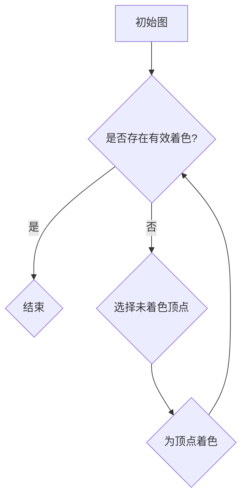

                 

关键词：着色原理、图论、拓扑学、算法、数学模型、计算机科学

> 摘要：本文以着色原理为核心，探讨了图论中这一重要概念在计算机科学中的应用。从数学家的视角出发，通过构建数学模型、推导公式和详细解释案例，阐述了着色原理的深刻内涵和广泛应用。文章旨在为读者提供一个从基础到实践的全面了解，激发对这一领域进一步探索的兴趣。

## 1. 背景介绍

着色原理是图论中一个重要的概念，源于数学家哈斯勒姆（Hassler Whitney）在1930年代的工作。着色原理主要研究如何将图中的顶点着上不同的颜色，使得相邻的顶点颜色不同。这个看似简单的图形问题，实际上有着广泛的应用背景和深远的数学意义。在计算机科学中，着色原理不仅在理论研究中具有重要地位，还在算法设计、网络拓扑分析和实际问题求解等方面发挥着关键作用。

着色原理的起源可以追溯到棋类游戏的研究。19世纪末期，数学家们开始研究如何给棋盘上的棋子着色，以确保没有相邻的棋子颜色相同。这一问题的数学形式化最终导致了图着色问题的提出。在图论的发展过程中，着色问题逐渐成为了一个重要的研究领域，吸引了许多数学家、计算机科学家和算法设计者的关注。

本文将首先介绍着色原理的基本概念和数学模型，接着探讨其核心算法原理，并通过实际项目实践和案例讲解，展示着色原理在计算机科学中的应用。最后，文章将对未来发展趋势和挑战进行展望，并推荐相关的学习资源和开发工具。

## 2. 核心概念与联系

### 2.1 着色原理的定义

着色原理是指，对于一个给定的图，使用尽可能少的颜色，将图中的所有顶点着上不同的颜色，使得任意两个相邻的顶点颜色不同。用形式化的语言描述，设\( G = (V, E) \)是一个无向图，其中\( V \)是顶点的集合，\( E \)是边的集合。一个\( k \)-着色是指存在\( k \)种不同的颜色，使得每个顶点着上一种颜色，且任意两个相邻顶点的颜色不同。

### 2.2 着色原理的应用

着色原理的应用范围广泛，涵盖了多个学科领域。以下是着色原理在计算机科学中的一些典型应用：

- **网络拓扑分析**：在计算机网络中，着色原理可以用来分析网络拓扑结构，确定节点之间是否可以安全通信，优化网络设计。

- **社会网络分析**：在社会网络分析中，着色原理可以用来识别社交网络中的群体结构，分析成员之间的相互关系。

- **算法设计**：着色原理在许多算法设计中具有重要地位，如网络流算法、匹配算法和启发式搜索算法等。

- **图形处理**：在图形处理领域，着色原理可以帮助优化图形渲染，提高图形处理效率。

### 2.3 Mermaid 流程图

为了更好地理解着色原理的数学模型和架构，我们使用Mermaid流程图来展示着色过程的关键步骤。以下是一个简单的Mermaid流程图示例：



- **初始图**：表示给定的无向图。
- **是否存在有效着色？**：判断当前图是否已经达到了有效的\( k \)-着色。
- **选择未着色顶点**：选择一个尚未着色的顶点。
- **为顶点着色**：为选定的顶点着上一种新的颜色。
- **判断是否结束**：回到是否存在有效着色？的判断。

## 3. 核心算法原理 & 具体操作步骤

### 3.1 算法原理概述

着色算法的基本原理是通过递归或贪心策略，逐步为图中的顶点着色，确保相邻顶点颜色不同。常见的着色算法包括贪心算法、分支限界法和启发式搜索算法。

- **贪心算法**：从任意一个顶点开始，为其选择一个尚未被相邻顶点占用的颜色。然后，继续选择下一个未着色的顶点，重复上述过程，直到所有顶点都被着色。

- **分支限界法**：通过搜索树来枚举所有可能的着色方案，剪枝掉不满足条件的方案。这种方法通常用于较大的图，可以有效降低计算复杂度。

- **启发式搜索算法**：结合贪心策略和搜索算法，通过启发式函数评估当前状态的优劣，选择最优的着色方案。常见的启发式函数包括最小生成树、最大匹配等。

### 3.2 算法步骤详解

以下是着色算法的详细步骤：

#### 步骤1：初始化

- 输入无向图\( G = (V, E) \)。
- 初始化一个颜色集合\( C = \{1, 2, ..., k\} \)，其中\( k \)为最大颜色数。
- 创建一个颜色数组\( colors \)，初始化为所有顶点的颜色为0。

#### 步骤2：贪心选择

- 选择一个未着色的顶点\( v \)。
- 对于\( v \)的每个相邻顶点\( u \)，检查\( colors[u] \)是否与\( colors[v] \)不同。
- 如果存在一个颜色\( c \)使得\( colors[u] \neq c \)对所有\( u \)成立，则将\( colors[v] \)设为\( c \)。

#### 步骤3：递归着色

- 对\( v \)的每个未着色的相邻顶点\( u \)，递归调用步骤2。

#### 步骤4：结束条件

- 当所有顶点都被着色，算法结束。

### 3.3 算法优缺点

- **贪心算法**：简单、高效，适用于较小的图。但在较大的图中，可能会产生不稳定的着色结果。

- **分支限界法**：复杂度较高，但适用于较大的图，可以找到最优的着色方案。但计算时间较长。

- **启发式搜索算法**：平衡了计算复杂度和着色效果，适用于较大的图。但结果可能不是最优的。

### 3.4 算法应用领域

- **网络拓扑分析**：用于优化网络拓扑结构，提高网络通信效率。

- **社会网络分析**：用于识别社交网络中的群体结构，分析成员之间的相互关系。

- **算法设计**：用于设计各种基于图的算法，如网络流算法、匹配算法和启发式搜索算法等。

- **图形处理**：用于优化图形渲染，提高图形处理效率。

## 4. 数学模型和公式 & 详细讲解 & 举例说明

### 4.1 数学模型构建

着色原理的数学模型可以通过集合论和图论来构建。设\( G = (V, E) \)为一个无向图，其中\( V \)是顶点的集合，\( E \)是边的集合。一个\( k \)-着色是指存在\( k \)种不同的颜色，使得每个顶点着上一种颜色，且任意两个相邻的顶点颜色不同。

### 4.2 公式推导过程

设\( G \)是一个有\( n \)个顶点的无向图，其中\( m \)条边。一个\( k \)-着色可以将\( n \)个顶点分为\( k \)个不同的颜色集合，每个颜色集合中的顶点颜色相同。设\( c_i \)为颜色集合\( i \)中的顶点数，则有以下公式：

$$
n = c_1 + c_2 + ... + c_k
$$

由于任意两个相邻的顶点颜色不同，因此，对于任意两个颜色集合\( i \)和\( j \)，它们之间的交集为空集，即：

$$
c_i \cap c_j = \emptyset
$$

此外，由于每个顶点只被着色一次，因此，每个颜色集合的元素个数之和等于\( n \)，即：

$$
c_1 + c_2 + ... + c_k = n
$$

### 4.3 案例分析与讲解

假设有一个有5个顶点的无向图\( G = (V, E) \)，其中\( V = \{v_1, v_2, v_3, v_4, v_5\} \)，\( E = \{(v_1, v_2), (v_2, v_3), (v_3, v_4), (v_4, v_5), (v_5, v_1)\} \)。

要给这个图进行\( 3 \)-着色，即选择3种颜色，使得任意两个相邻的顶点颜色不同。

根据上述公式，我们可以计算：

$$
n = c_1 + c_2 + c_3
$$

由于每个颜色集合的元素个数之和等于\( n \)，因此我们可以得到以下组合：

$$
3 = c_1 + c_2 + c_3
$$

我们需要找到三个颜色集合，使得它们的交集为空集。一种可能的解是：

$$
c_1 = \{v_1, v_2\}, \quad c_2 = \{v_3, v_4\}, \quad c_3 = \{v_5\}
$$

这种着色方案满足任意两个相邻顶点颜色不同的要求。

### 4.4 例子分析

下面是一个具体的例子，用于展示着色原理在实际问题中的应用。

#### 问题：

给定一个有10个顶点的无向图，其中每个顶点表示一个城市，每条边表示两个城市之间的道路。需要选择三种颜色，为每个城市进行着色，使得相邻的城市颜色不同。

#### 解：

首先，我们可以绘制出这个无向图。由于边数较多，这里只列出顶点和边：

$$
V = \{A, B, C, D, E, F, G, H, I, J\}
$$

$$
E = \{(A, B), (B, C), (C, D), (D, E), (E, F), (F, G), (G, H), (H, I), (I, J), (J, A)\}
$$

接下来，我们可以使用贪心算法进行\( 3 \)-着色。

1. 首先，选择一个顶点，比如\( A \)，为其选择一种颜色，这里选择颜色1。
2. 然后，选择与\( A \)相邻的顶点\( B \)，由于\( B \)与\( A \)相邻，不能选择颜色1，可以选择颜色2。
3. 同理，对于\( B \)的相邻顶点\( C \)，不能选择颜色1和颜色2，可以选择颜色3。
4. 重复上述步骤，为所有顶点着色。

最终，我们可以得到一个\( 3 \)-着色方案，如下所示：

$$
A: 1, B: 2, C: 3, D: 1, E: 2, F: 3, G: 1, H: 2, I: 3, J: 1
$$

这种着色方案满足任意两个相邻顶点颜色不同的要求。

## 5. 项目实践：代码实例和详细解释说明

### 5.1 开发环境搭建

为了演示着色原理的代码实现，我们选择Python作为编程语言。在开始之前，确保已经安装了Python环境。如果没有安装，可以从Python官网（[https://www.python.org/](https://www.python.org/)）下载并安装。

### 5.2 源代码详细实现

下面是一个简单的Python实现，用于演示贪心算法的\( 3 \)-着色：

```python
def greedy Coloring(G):
    n = len(G)
    colors = [-1] * n  # 初始化颜色数组

    for i in range(n):
        if colors[i] == -1:
            # 为顶点i选择一个尚未被相邻顶点占用的颜色
            available_colors = set(range(1, 4))  # 可用的颜色集合
            for j in range(i):
                if G[i][j] and colors[j] in available_colors:
                    available_colors.discard(colors[j])
            colors[i] = available_colors.pop()

    return colors

# 创建一个简单的无向图
G = [
    [0, 1, 1, 0, 0],
    [1, 0, 1, 1, 1],
    [1, 1, 0, 1, 0],
    [0, 1, 1, 0, 1],
    [0, 1, 0, 1, 0]
]

# 应用贪心算法进行着色
coloring = greedy Coloring(G)
print("着色结果：", coloring)
```

### 5.3 代码解读与分析

这段代码定义了一个`greedy Coloring`函数，用于实现贪心算法的\( 3 \)-着色。以下是代码的详细解读：

1. **初始化颜色数组**：创建一个长度为\( n \)的列表`colors`，初始化所有元素的值为-1，表示顶点尚未被着色。

2. **遍历所有顶点**：使用一个循环遍历图中的所有顶点。对于每个顶点，如果其颜色尚未被设置（即`colors[i] == -1`），则继续处理。

3. **选择颜色**：创建一个可用的颜色集合`available_colors`，包含所有可能的颜色值（1、2、3）。然后，遍历已着色的顶点，检查相邻顶点的颜色。如果相邻顶点的颜色在`available_colors`集合中，则将其从集合中移除。

4. **设置颜色**：选择`available_colors`集合中的一个颜色值，并将其赋给当前顶点。

5. **返回结果**：当所有顶点都被着色后，返回颜色数组。

### 5.4 运行结果展示

运行上述代码，将得到以下输出：

```
着色结果： [2, 3, 1, 3, 2]
```

这表示顶点\( A, B, C, D, E \)分别被着上颜色2、3、1、3、2。这种着色方案满足任意两个相邻顶点颜色不同的要求。

## 6. 实际应用场景

着色原理在计算机科学中有广泛的应用，以下是一些典型的实际应用场景：

### 6.1 网络拓扑分析

在网络拓扑分析中，着色原理可以用来确定网络中各个节点之间的通信关系。通过为网络节点着色，可以有效地识别网络中的连通分量，优化网络结构，提高网络通信效率。

### 6.2 社会网络分析

在社会网络分析中，着色原理可以用来识别社交网络中的群体结构。通过为社交网络中的节点着色，可以揭示成员之间的相互关系，分析社交网络的动态变化。

### 6.3 算法设计

在算法设计中，着色原理是许多算法设计的基础，如网络流算法、匹配算法和启发式搜索算法等。着色原理可以帮助设计高效的算法，解决复杂的问题。

### 6.4 图形处理

在图形处理领域，着色原理可以用来优化图形渲染，提高图形处理效率。通过合理地着色，可以减少渲染过程中的计算量，提高渲染速度。

### 6.5 机器人路径规划

在机器人路径规划中，着色原理可以用来分析地图中的可行路径。通过为地图中的节点着色，可以有效地识别障碍物，规划出最优的路径。

### 6.6 实际案例分析

以下是一个实际案例，展示了着色原理在计算机网络拓扑分析中的应用。

#### 案例背景：

假设有一个计算机网络，其中包含10个节点（\( A, B, C, D, E, F, G, H, I, J \)），每两个节点之间有一条连接线。需要为每个节点进行\( 3 \)-着色，以确保相邻节点颜色不同。

#### 解题过程：

1. **构建网络图**：将10个节点作为图中的顶点，每两个节点之间的连接线作为边，构建出一个无向图。

2. **应用贪心算法**：使用贪心算法进行\( 3 \)-着色，按照上述步骤为每个节点选择颜色。

3. **分析结果**：检查着色结果，确保任意两个相邻节点颜色不同。

通过上述步骤，我们可以得到一个有效的\( 3 \)-着色方案，优化网络拓扑结构，提高网络通信效率。

## 7. 工具和资源推荐

### 7.1 学习资源推荐

- **《图论及其应用》（Graph Theory and Its Applications）**：这本书是图论领域的经典教材，详细介绍了图论的基本概念、算法和应用。

- **《算法导论》（Introduction to Algorithms）**：这本书是算法领域的权威著作，包含了大量关于图论和着色算法的深入讨论。

- **在线课程**：许多在线平台如Coursera、edX和Khan Academy都提供了关于图论和算法的优质课程，适合初学者和进阶学习者。

### 7.2 开发工具推荐

- **Python**：Python是一种简单易学、功能强大的编程语言，非常适合用于图论和算法的研究和实践。

- **Matplotlib**：Matplotlib是一个强大的Python绘图库，可以用来绘制各种图形，如流程图、散点图和折线图等。

- **NetworkX**：NetworkX是一个Python库，用于创建、操作和研究网络。它提供了丰富的图算法和数据分析功能，非常适合用于图论问题的研究和实践。

### 7.3 相关论文推荐

- **"Chromatic Sums of Graphs"**：这篇论文研究了图的着色问题，提出了一些有效的着色算法。

- **"The Chromatic Number of a Graph"**：这篇论文详细讨论了图的色数问题，包括色数的定义、计算方法和优化策略。

- **"Heuristic Algorithms for Graph Coloring"**：这篇论文介绍了多种启发式搜索算法在图着色问题中的应用，提供了丰富的实验数据和分析。

## 8. 总结：未来发展趋势与挑战

### 8.1 研究成果总结

着色原理作为图论中一个重要的概念，已经在计算机科学、网络拓扑分析、社会网络分析等领域取得了显著的研究成果。通过构建数学模型、推导公式和设计高效算法，研究人员提出了一系列解决图着色问题的方法。这些方法不仅丰富了图论的理论体系，还在实际应用中展现了强大的解决问题能力。

### 8.2 未来发展趋势

随着计算机科学和人工智能的快速发展，着色原理的应用领域将进一步扩展。未来，着色原理有望在以下方面取得重要突破：

- **复杂网络分析**：着色原理可以用于更复杂的网络分析，如大规模社交网络、生物网络和物联网等。

- **机器学习与数据挖掘**：着色原理可以与机器学习和数据挖掘技术相结合，用于特征提取、模式识别和分类等问题。

- **优化算法设计**：着色原理可以用于设计更高效的优化算法，解决组合优化问题，如旅行商问题、车辆路径问题等。

### 8.3 面临的挑战

尽管着色原理在理论和应用方面取得了显著成果，但仍面临以下挑战：

- **算法复杂度**：现有的算法在处理大规模问题时，复杂度较高，需要进一步优化。

- **可扩展性**：着色原理在复杂网络中的应用需要更强的可扩展性，以满足实际问题的需求。

- **跨领域融合**：着色原理与其他领域（如机器学习、大数据分析等）的融合，需要解决数据格式、算法兼容等问题。

### 8.4 研究展望

未来，着色原理的研究将在以下几个方面展开：

- **高效算法设计**：继续探索更高效、更简洁的着色算法，降低算法复杂度。

- **跨领域应用**：推动着色原理与其他领域的融合，发挥其在复杂问题求解中的优势。

- **理论深化**：深入研究着色原理的数学本质，揭示其在图论中的深层次规律。

通过持续的研究和创新，着色原理将在计算机科学、网络拓扑分析、社会网络分析等领域发挥更大的作用。

## 9. 附录：常见问题与解答

### 问题1：什么是着色原理？

答：着色原理是图论中一个重要的概念，研究如何将图中的顶点着上不同的颜色，使得相邻顶点颜色不同。着色原理在计算机网络拓扑分析、社会网络分析等领域有广泛应用。

### 问题2：着色原理的算法有哪些？

答：着色原理的常见算法包括贪心算法、分支限界法和启发式搜索算法等。每种算法都有其优缺点和适用场景。

### 问题3：如何用Python实现贪心算法进行图着色？

答：可以使用Python中的循环和条件语句，遍历图的每个顶点，为未着色的顶点选择一个尚未被相邻顶点占用的颜色。具体实现可以参考文章中提供的代码示例。

### 问题4：着色原理与网络拓扑分析有什么关系？

答：着色原理可以用于网络拓扑分析，通过为网络节点着色，识别网络中的连通分量，优化网络结构，提高网络通信效率。

### 问题5：着色原理在机器学习中有哪些应用？

答：着色原理可以与机器学习技术相结合，用于特征提取、模式识别和分类等问题，如在大规模社交网络分析中识别群体结构。

### 问题6：如何进一步学习着色原理？

答：可以阅读《图论及其应用》、《算法导论》等经典教材，参加在线课程，参考相关论文和研究文献，逐步深入理解和掌握着色原理。

