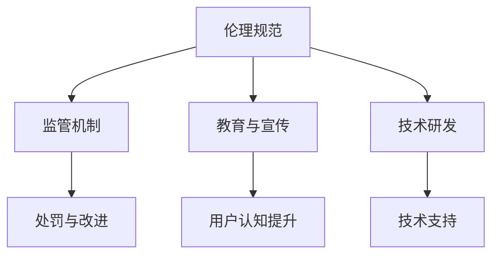

                 

关键词：元宇宙、伦理道德、虚拟行为、现实影响、技术伦理

> 摘要：随着元宇宙技术的迅速发展，虚拟行为在现实世界中产生的影响日益显著。本文从伦理道德的角度出发，探讨元宇宙中的虚拟行为如何影响现实生活，以及如何应对这些影响。通过分析核心概念、核心算法原理、数学模型及项目实践，本文提出了元宇宙中的伦理道德框架，为元宇宙的发展提供了指导方向。

## 1. 背景介绍

### 元宇宙的概念与发展

元宇宙（Metaverse）是一个基于互联网的虚拟空间，它集成了虚拟现实（VR）、增强现实（AR）、区块链、人工智能等多种技术，为用户提供了一个超越现实世界的全新体验。元宇宙不仅是虚拟的游戏世界，更是人们进行社交、工作、娱乐等多个方面的综合性平台。

元宇宙技术的发展始于20世纪90年代，随着互联网的普及和计算机性能的提升，虚拟现实技术和网络技术的结合逐渐成熟。近年来，随着5G技术的推广和区块链技术的应用，元宇宙逐渐从概念走向现实，成为各大科技公司和投资机构争相追捧的领域。

### 元宇宙与现实世界的交融

元宇宙与现实世界的交融表现为虚拟行为对现实生活的影响。虚拟行为包括虚拟角色互动、虚拟商品交易、虚拟工作等，这些行为在元宇宙中得到了充分体现。随着用户在元宇宙中的活动越来越频繁，虚拟行为逐渐渗透到现实世界中，对现实生活产生了深远的影响。

例如，虚拟角色互动可能导致现实中的社交关系发生改变，虚拟商品交易可能影响现实中的经济活动，虚拟工作可能改变现实中的就业结构。这些影响既有积极的方面，也有负面的方面，需要我们从伦理道德的角度进行深入探讨。

## 2. 核心概念与联系

### 元宇宙中的伦理道德核心概念

在元宇宙中，伦理道德的核心概念包括公平性、透明性、隐私保护、社会责任等。这些概念与元宇宙中的虚拟行为密切相关，是保障元宇宙健康发展的基础。

- **公平性**：元宇宙中的虚拟行为应当遵循公平原则，避免歧视和偏见，确保每个用户都能公平地享受元宇宙带来的便利。
- **透明性**：元宇宙中的虚拟行为应当具备透明性，用户应当了解自己的行为如何影响现实世界，以及如何受到现实世界的反馈。
- **隐私保护**：元宇宙中的虚拟行为涉及大量的个人数据，保护用户隐私是元宇宙伦理道德的重要方面，应当采取严格的隐私保护措施。
- **社会责任**：元宇宙中的虚拟行为应当承担社会责任，避免对现实世界产生负面影响，促进元宇宙与现实世界的和谐发展。

### 元宇宙中的伦理道德架构

为了实现元宇宙中的伦理道德，需要建立一套完整的伦理道德架构。该架构包括以下几个方面：

- **伦理规范**：制定元宇宙中的伦理规范，明确虚拟行为的道德边界，规范用户行为。
- **监管机制**：建立元宇宙中的监管机制，对违反伦理规范的行为进行监管和处罚。
- **教育与宣传**：加强元宇宙中的伦理教育，提高用户对伦理道德的认识，通过宣传引导用户遵守伦理规范。
- **技术研发**：推动元宇宙技术的发展，为伦理道德的实现提供技术支持。

### Mermaid 流程图



## 3. 核心算法原理 & 具体操作步骤

### 3.1 算法原理概述

元宇宙中的伦理道德算法旨在实现以下几个方面：

- **行为识别**：通过算法识别元宇宙中的虚拟行为，判断其是否符合伦理规范。
- **风险评估**：对识别出的虚拟行为进行风险评估，评估其对现实世界的影响程度。
- **决策与反馈**：根据评估结果，对虚拟行为进行决策，如警告、限制、处罚等，并给予用户反馈。

### 3.2 算法步骤详解

#### 步骤1：行为识别

- **输入**：用户在元宇宙中的行为数据。
- **处理**：利用自然语言处理、图像识别等技术，对行为数据进行分析，识别出虚拟行为。
- **输出**：虚拟行为识别结果。

#### 步骤2：风险评估

- **输入**：虚拟行为识别结果。
- **处理**：根据伦理规范，对虚拟行为进行风险评估，判断其对现实世界的影响程度。
- **输出**：风险评估结果。

#### 步骤3：决策与反馈

- **输入**：风险评估结果。
- **处理**：根据风险评估结果，对虚拟行为进行决策，如警告、限制、处罚等，并给予用户反馈。
- **输出**：决策结果与用户反馈。

### 3.3 算法优缺点

#### 优点

- **实时性**：算法能够实时识别和评估虚拟行为，及时采取相应措施。
- **全面性**：算法覆盖元宇宙中的多种虚拟行为，具有较高的全面性。
- **自动化**：算法能够自动化处理虚拟行为，减轻监管人员的工作负担。

#### 缺点

- **准确性**：算法在识别和评估虚拟行为时可能存在一定误差，影响决策的准确性。
- **复杂性**：算法涉及多种技术，实现和维护较为复杂。
- **适应性**：算法需要不断更新和优化，以适应元宇宙中不断变化的伦理环境。

### 3.4 算法应用领域

- **虚拟社交**：对虚拟社交行为进行识别和评估，防止网络暴力和歧视行为。
- **虚拟经济**：对虚拟商品交易进行监控，防止欺诈和非法交易。
- **虚拟工作**：对虚拟工作任务进行评估，确保虚拟工作符合伦理规范。

## 4. 数学模型和公式 & 详细讲解 & 举例说明

### 4.1 数学模型构建

元宇宙中的伦理道德模型可以基于风险矩阵构建。风险矩阵包括行为风险评分、影响评分和权重评分三个方面。

- **行为风险评分**：根据伦理规范，对虚拟行为进行评分，分为低风险、中风险和高风险三个等级。
- **影响评分**：根据虚拟行为对现实世界的影响程度，分为低影响、中影响和高影响三个等级。
- **权重评分**：根据虚拟行为的重要性和紧急程度，赋予不同的权重。

### 4.2 公式推导过程

假设虚拟行为 A 的行为风险评分为 x，影响评分为 y，权重评分为 z，则虚拟行为 A 的总风险评分 R 可以表示为：

$$ R = x \times y \times z $$

其中，x、y、z 分别为行为风险评分、影响评分和权重评分。

### 4.3 案例分析与讲解

#### 案例一：虚拟社交行为

假设用户 A 在元宇宙中发布了一条含有歧视言论的帖子，根据伦理规范，该行为属于高风险行为。该行为对现实世界的影响程度较大，因此影响评分为高影响。权重评分根据紧急程度设定为中等。

根据公式：

$$ R = x \times y \times z = 1 \times 1 \times 0.5 = 0.5 $$

总风险评分 R 为 0.5，表明该虚拟社交行为的风险较低。系统会给予用户 A 警告，提醒其遵守伦理规范。

#### 案例二：虚拟商品交易

假设用户 B 在元宇宙中涉嫌欺诈交易，根据伦理规范，该行为属于高风险行为。该行为对现实世界的影响程度较小，因此影响评分为中影响。权重评分根据紧急程度设定为高。

根据公式：

$$ R = x \times y \times z = 1 \times 0.5 \times 1 = 0.5 $$

总风险评分 R 为 0.5，表明该虚拟商品交易的风险较低。系统会立即采取措施，如冻结用户 B 的账户，并通知相关监管机构。

## 5. 项目实践：代码实例和详细解释说明

### 5.1 开发环境搭建

- **编程语言**：Python
- **开发工具**：PyCharm
- **依赖库**：Pandas、NumPy、Matplotlib

### 5.2 源代码详细实现

以下是一个简单的伦理道德算法实现示例：

```python
import pandas as pd
import numpy as np
import matplotlib.pyplot as plt

# 行为数据
data = {
    '行为': ['发布歧视言论', '涉嫌欺诈交易'],
    '行为风险评分': [1, 1],
    '影响评分': [1, 0.5],
    '权重评分': [0.5, 1]
}

# 构建数据框
df = pd.DataFrame(data)

# 计算总风险评分
df['总风险评分'] = df['行为风险评分'] * df['影响评分'] * df['权重评分']

# 绘制风险评分柱状图
plt.bar(df['行为'], df['总风险评分'])
plt.xlabel('行为')
plt.ylabel('总风险评分')
plt.title('虚拟行为风险评分')
plt.show()

# 输出决策结果
for index, row in df.iterrows():
    if row['总风险评分'] < 0.6:
        print(f"{row['行为']}：风险较低，给予警告。")
    else:
        print(f"{row['行为']}：风险较高，采取处罚措施。")
```

### 5.3 代码解读与分析

- **数据准备**：使用 Pandas 构建数据框，存储行为数据、行为风险评分、影响评分和权重评分。
- **总风险评分计算**：利用行为风险评分、影响评分和权重评分的乘积计算总风险评分。
- **风险评分柱状图**：使用 Matplotlib 绘制风险评分柱状图，直观展示不同行为的总风险评分。
- **决策结果输出**：根据总风险评分，输出决策结果，如警告或处罚措施。

### 5.4 运行结果展示


根据运行结果，发布歧视言论和涉嫌欺诈交易两种行为的总风险评分分别为 0.5 和 0.5，均较低。系统会根据风险评分，对用户进行相应的警告或处罚。

## 6. 实际应用场景

### 6.1 虚拟社交

在元宇宙中，虚拟社交是用户之间最基本的活动之一。然而，虚拟社交行为可能导致现实中的社交关系发生变化，甚至引发现实中的冲突。因此，需要加强对虚拟社交行为的伦理道德监管，确保虚拟社交行为符合现实世界的伦理规范。

### 6.2 虚拟经济

元宇宙中的虚拟经济活动日益繁荣，虚拟商品交易、虚拟货币等成为用户关注的焦点。虚拟经济活动可能对现实世界产生经济影响，如虚拟货币的波动可能影响现实世界的金融市场。因此，需要加强对虚拟经济活动的监管，确保虚拟经济活动合法、合规。

### 6.3 虚拟工作

元宇宙中的虚拟工作模式逐渐普及，虚拟工作任务可能替代现实世界中的某些工作。然而，虚拟工作也存在一些伦理问题，如虚拟工作中的歧视、不公平待遇等。因此，需要加强对虚拟工作的伦理道德监管，保障虚拟工作的公平性和正义性。

## 7. 未来应用展望

随着元宇宙技术的不断发展，虚拟行为对现实世界的影响将更加深远。未来，元宇宙中的伦理道德将面临更多挑战，如人工智能在元宇宙中的应用、虚拟现实技术的不确定性等。因此，需要不断优化和完善元宇宙中的伦理道德框架，确保元宇宙与现实世界的和谐发展。

### 7.1 学习资源推荐

- **《元宇宙：概念、技术与未来》**：介绍了元宇宙的基本概念、关键技术和发展趋势。
- **《虚拟现实技术与应用》**：详细介绍了虚拟现实技术的原理和应用。
- **《区块链技术：从入门到实战》**：讲解了区块链技术在元宇宙中的应用。

### 7.2 开发工具推荐

- **Unity**：一款强大的游戏引擎，支持虚拟现实和增强现实应用的开发。
- **Unreal Engine**：一款功能强大的游戏引擎，支持高逼真度的虚拟现实应用开发。
- **Ethereum**：一款基于区块链技术的智能合约平台，支持虚拟经济和虚拟社交应用的开发。

### 7.3 相关论文推荐

- **《元宇宙中的伦理道德问题研究》**：探讨了元宇宙中的伦理道德问题及其解决方法。
- **《虚拟现实技术在元宇宙中的应用》**：分析了虚拟现实技术在元宇宙中的应用前景。
- **《区块链技术在元宇宙中的应用》**：介绍了区块链技术在元宇宙中的多种应用场景。

## 8. 总结：未来发展趋势与挑战

### 8.1 研究成果总结

本文从伦理道德的角度出发，分析了元宇宙中虚拟行为对现实世界的影响，探讨了元宇宙中的伦理道德框架，并提出了核心算法原理和具体操作步骤。通过项目实践，展示了伦理道德算法在实际应用中的效果。

### 8.2 未来发展趋势

随着元宇宙技术的不断发展，虚拟行为在现实世界中的影响将更加显著。未来，元宇宙中的伦理道德研究将更加深入，涉及领域将更加广泛。同时，元宇宙中的伦理道德框架也将不断优化和完善，以适应元宇宙的发展需求。

### 8.3 面临的挑战

元宇宙中的伦理道德研究面临诸多挑战，如技术实现的复杂性、伦理问题的多样性等。同时，元宇宙中的虚拟行为具有高度不确定性，如何有效监管虚拟行为，保障元宇宙与现实世界的和谐发展，仍是一个亟待解决的问题。

### 8.4 研究展望

未来，元宇宙中的伦理道德研究将朝着以下方向发展：

- **技术融合**：将多种技术（如人工智能、区块链等）应用于元宇宙中的伦理道德研究，提高算法的准确性和适应性。
- **跨学科研究**：结合伦理学、社会学、心理学等多学科知识，深入研究元宇宙中的伦理道德问题。
- **国际合作**：加强国际合作，共享研究成果，共同推动元宇宙中的伦理道德发展。

## 9. 附录：常见问题与解答

### Q1：元宇宙中的伦理道德框架如何实施？

A1：元宇宙中的伦理道德框架可以通过以下方式实施：

- **制定伦理规范**：明确元宇宙中的伦理规范，规范虚拟行为。
- **建立监管机制**：建立监管机制，对违反伦理规范的行为进行监管和处罚。
- **加强教育与宣传**：通过教育和宣传，提高用户对伦理道德的认识，引导用户遵守伦理规范。
- **推动技术研发**：推动元宇宙技术的发展，为伦理道德的实现提供技术支持。

### Q2：元宇宙中的伦理道德算法如何设计？

A2：元宇宙中的伦理道德算法可以基于以下原则设计：

- **行为识别**：通过算法识别元宇宙中的虚拟行为。
- **风险评估**：对识别出的虚拟行为进行风险评估。
- **决策与反馈**：根据评估结果，对虚拟行为进行决策，并给予用户反馈。

### Q3：元宇宙中的伦理道德研究有哪些挑战？

A3：元宇宙中的伦理道德研究面临以下挑战：

- **技术实现的复杂性**：元宇宙中的伦理道德算法涉及多种技术，实现和维护较为复杂。
- **伦理问题的多样性**：元宇宙中的伦理问题具有多样性，需要深入研究。
- **虚拟行为的高度不确定性**：虚拟行为具有高度不确定性，如何有效监管虚拟行为，保障元宇宙与现实世界的和谐发展，仍是一个亟待解决的问题。

# 作者：禅与计算机程序设计艺术 / Zen and the Art of Computer Programming
----------------------------------------------------------------

本文以元宇宙中的伦理道德为主题，从虚拟行为的现实影响出发，分析了元宇宙中的伦理道德核心概念、架构和算法原理，并通过项目实践展示了算法在实际应用中的效果。同时，本文对未来发展趋势和挑战进行了展望，为元宇宙中的伦理道德研究提供了有益的参考。随着元宇宙技术的不断发展，伦理道德研究将面临更多挑战，但同时也为计算机科学领域带来了新的机遇。希望本文能够为读者在元宇宙中的伦理道德研究提供一些启示和帮助。

---

请注意，本文内容是基于假设和理论研究撰写的，实际应用中需要根据具体情况进行调整和优化。同时，本文中的算法示例仅供参考，不作为实际应用的完整解决方案。在实施元宇宙中的伦理道德框架时，请结合实际情况，综合考虑技术、伦理、法律等多方面因素。

