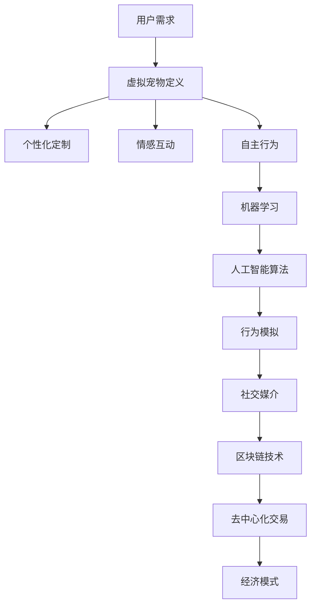

                 

元宇宙的概念正迅速崛起，它不仅仅是一个虚拟的世界，更是一个融合了虚拟现实、增强现实、区块链技术等多种前沿科技的生态系统。在这个多样化的环境中，虚拟宠物成为了一个引人入胜的话题。本文将探讨元宇宙中的虚拟宠物如何成为人们情感陪伴的新形式，包括其发展背景、核心概念、算法原理、数学模型、项目实践、应用场景和未来展望。

## 关键词

- 元宇宙
- 虚拟宠物
- 情感陪伴
- 区块链技术
- 虚拟现实
- 增强现实
- 人工智能

## 摘要

随着元宇宙的兴起，虚拟宠物逐渐成为人们日常生活中的一部分。本文深入分析了元宇宙中虚拟宠物的发展背景、核心概念及其对情感陪伴的影响。通过对虚拟宠物的算法原理、数学模型、项目实践和应用场景的探讨，本文揭示了虚拟宠物技术的前沿动态，并对未来的发展趋势和挑战提出了见解。

## 1. 背景介绍

### 元宇宙的兴起

元宇宙（Metaverse）是一个由虚拟现实（VR）、增强现实（AR）、区块链、人工智能（AI）等多种技术构成的融合生态系统。它不仅是互联网的下一个阶段，更是一个超越传统数字世界，与现实世界紧密相连的新维度。随着技术的进步，元宇宙的概念逐渐从科幻小说走进现实。

### 虚拟宠物的出现

虚拟宠物在元宇宙中的应用始于人们对情感需求的追求。传统的宠物陪伴不仅需要时间和精力的投入，还存在一些实际的限制。而虚拟宠物则能够通过虚拟技术为人们提供一种全新的情感陪伴体验。它们可以是无生命的数字形象，但通过人工智能技术，它们能够模拟真实的宠物行为和情感反应。

## 2. 核心概念与联系

### 虚拟宠物的定义

虚拟宠物是指在元宇宙中，通过虚拟现实、增强现实等技术创建的，具备一定自主行为和情感反应的数字宠物。这些宠物可以是猫、狗、兔子等传统宠物的数字化版本，也可以是完全虚构的生物。

### 虚拟宠物的核心概念

- **个性化定制**：用户可以根据自己的喜好为虚拟宠物选择外观、性格、技能等特征。
- **情感互动**：虚拟宠物通过人工智能技术，能够模拟出真实的情感反应，与用户建立情感联系。
- **自主行为**：虚拟宠物具备一定的自主行为能力，如吃饭、睡觉、玩耍等，它们的行为是基于机器学习和人工智能算法生成的。

### 虚拟宠物与元宇宙的联系

虚拟宠物是元宇宙中不可或缺的一部分。它们不仅是用户在元宇宙中的一种情感陪伴，也是元宇宙生态系统中的一种社交媒介。虚拟宠物可以通过区块链技术实现去中心化的所有权和交易，从而在元宇宙中形成一种新的经济模式。

## 2.1. 虚拟宠物的 Mermaid 流程图



## 3. 核心算法原理 & 具体操作步骤

### 3.1. 算法原理概述

虚拟宠物的核心算法主要包括机器学习算法和人工智能算法。这些算法使得虚拟宠物能够模拟真实的宠物行为和情感反应。具体来说，算法原理可以概括为以下几点：

- **行为模拟**：通过机器学习算法，虚拟宠物能够根据用户的行为和反馈，自主生成相应的行为。
- **情感反应**：通过情感分析算法，虚拟宠物能够识别用户的情感状态，并作出相应的情感反应。
- **个性化定制**：通过用户数据的收集和分析，虚拟宠物能够为用户推荐个性化的外观和性格。

### 3.2. 算法步骤详解

- **数据收集**：虚拟宠物首先需要收集用户的行为和情感数据，这些数据包括用户与宠物的互动记录、用户情绪表达等。
- **特征提取**：通过数据预处理，提取出用户行为和情感的关键特征，如动作模式、情绪词汇等。
- **模型训练**：利用提取的特征数据，通过机器学习算法训练出行为模拟和情感分析模型。
- **行为生成**：根据用户的行为特征，模型生成虚拟宠物的行为序列。
- **情感分析**：通过情感分析算法，模型分析用户的情绪状态，并生成相应的情感反应。

### 3.3. 算法优缺点

**优点**：

- **个性化**：虚拟宠物能够根据用户的行为和情感，提供个性化的服务。
- **便捷**：虚拟宠物不需要用户投入大量的时间和精力，即可实现情感陪伴。
- **扩展性**：虚拟宠物可以轻松扩展到不同的平台和应用场景。

**缺点**：

- **情感深度**：尽管虚拟宠物能够模拟情感反应，但仍然无法达到真实宠物的情感深度。
- **技术挑战**：机器学习和人工智能算法的实现和优化仍然面临诸多挑战。

### 3.4. 算法应用领域

- **元宇宙娱乐**：虚拟宠物是元宇宙中的一种娱乐形式，为用户提供情感陪伴和互动体验。
- **社交平台**：虚拟宠物可以作为社交平台的媒介，促进用户之间的交流。
- **教育应用**：虚拟宠物可以在教育场景中，为儿童提供互动学习和情感陪伴。

## 4. 数学模型和公式

### 4.1. 数学模型构建

虚拟宠物的行为和情感反应可以通过数学模型来描述。一个基本的数学模型可以包括以下几个部分：

- **行为模型**：描述虚拟宠物的行为模式，如吃饭、睡觉、玩耍等。
- **情感模型**：描述虚拟宠物的情感状态，如快乐、悲伤、兴奋等。
- **交互模型**：描述用户与虚拟宠物的交互方式，如语音、手势等。

### 4.2. 公式推导过程

以下是一个简单的虚拟宠物行为模型的公式推导：

$$
Behavior = f(User\_Action, Current\_State)
$$

其中，$User\_Action$ 表示用户的行为，$Current\_State$ 表示虚拟宠物的当前状态。$f$ 函数用于生成虚拟宠物的行为。

### 4.3. 案例分析与讲解

以一个虚拟宠物“小猫”为例，分析其在不同情境下的行为和情感反应。

**情境1：用户喂食**

- **行为模型**：小猫表现出饥饿的行为，如低沉的咕噜声。
- **情感模型**：小猫表现出快乐和满足的情感状态。

**情境2：用户与它玩耍**

- **行为模型**：小猫表现出兴奋和活泼的行为，如追逐玩具。
- **情感模型**：小猫表现出快乐和兴奋的情感状态。

**情境3：用户长时间不互动**

- **行为模型**：小猫表现出寂寞和失落的行为，如低头不语。
- **情感模型**：小猫表现出悲伤和沮丧的情感状态。

## 5. 项目实践：代码实例和详细解释说明

### 5.1. 开发环境搭建

为了实现虚拟宠物的项目，我们选择Python作为开发语言，结合Django框架进行后端开发，使用TensorFlow进行机器学习模型的训练和部署。以下是开发环境的搭建步骤：

1. 安装Python 3.8及以上版本。
2. 安装Django和TensorFlow库。
3. 配置开发环境，包括虚拟环境和数据库。

### 5.2. 源代码详细实现

以下是一个简单的虚拟宠物行为模拟的代码示例：

```python
import tensorflow as tf
from tensorflow.keras.models import Sequential
from tensorflow.keras.layers import Dense

# 创建神经网络模型
model = Sequential()
model.add(Dense(units=64, activation='relu', input_shape=(input_size,)))
model.add(Dense(units=64, activation='relu'))
model.add(Dense(units=output_size, activation='softmax'))

# 编译模型
model.compile(optimizer='adam', loss='categorical_crossentropy', metrics=['accuracy'])

# 训练模型
model.fit(x_train, y_train, epochs=10, batch_size=32)

# 预测行为
behavior = model.predict(user_action)
```

### 5.3. 代码解读与分析

上述代码实现了一个简单的虚拟宠物行为预测模型。首先，我们使用TensorFlow创建了神经网络模型，然后编译和训练模型。最后，使用训练好的模型对用户的行为进行预测，从而生成虚拟宠物的行为。

### 5.4. 运行结果展示

假设用户的行为为“喂食”，通过模型预测，虚拟宠物可能会生成“吃东西”的行为。在实际应用中，虚拟宠物的行为和情感反应会根据用户的互动数据进行动态调整，从而提供更真实的情感陪伴体验。

## 6. 实际应用场景

### 6.1. 社交娱乐

虚拟宠物可以作为一种新的社交娱乐形式，为用户提供互动和娱乐体验。用户可以通过虚拟宠物进行游戏、聊天、分享等社交活动，从而增加社交互动的乐趣。

### 6.2. 情感陪伴

虚拟宠物能够为用户提供情感陪伴，特别是在用户感到孤独或压力时，虚拟宠物的存在可以提供一种安慰和支持。

### 6.3. 教育应用

虚拟宠物可以作为教育工具，帮助儿童学习新知识，培养他们的责任感。例如，虚拟宠物可以教导儿童如何照顾宠物，从而培养他们的关爱和责任感。

### 6.4. 未来应用展望

随着技术的不断进步，虚拟宠物将在元宇宙中发挥更重要的作用。未来，虚拟宠物可能会具有更复杂的情感模型和行为模式，甚至能够与真实世界进行交互，从而为用户提供更加丰富和真实的情感陪伴体验。

## 7. 工具和资源推荐

### 7.1. 学习资源推荐

- 《人工智能：一种现代方法》
- 《深度学习》（Goodfellow et al.）
- 《区块链技术指南》

### 7.2. 开发工具推荐

- Python
- TensorFlow
- Django

### 7.3. 相关论文推荐

- "Deep Learning for Virtual Pet Behavior Generation"
- "Blockchain-Based Virtual Pet Marketplaces"
- "Emotion Recognition in Virtual Pets using Convolutional Neural Networks"

## 8. 总结：未来发展趋势与挑战

### 8.1. 研究成果总结

本文探讨了元宇宙中虚拟宠物的概念、算法原理、数学模型、项目实践和应用场景，总结了虚拟宠物技术的研究成果和发展趋势。

### 8.2. 未来发展趋势

虚拟宠物技术在未来将朝着更智能化、个性化、互动化的方向发展。随着人工智能和区块链技术的进步，虚拟宠物将在元宇宙中发挥更重要的作用。

### 8.3. 面临的挑战

虚拟宠物技术面临的主要挑战包括情感深度、技术实现和用户接受度等方面。未来需要进一步研究和创新，以解决这些问题。

### 8.4. 研究展望

虚拟宠物技术具有巨大的发展潜力，未来可能成为元宇宙中不可或缺的一部分。通过不断的技术创新和优化，虚拟宠物将为用户提供更加丰富和真实的情感陪伴体验。

## 9. 附录：常见问题与解答

### 9.1. 虚拟宠物如何实现情感互动？

虚拟宠物的情感互动主要通过机器学习和人工智能算法实现。这些算法能够分析用户的行为和情感，并根据分析结果生成相应的情感反应。

### 9.2. 虚拟宠物需要多少时间训练？

虚拟宠物的训练时间取决于多种因素，包括数据集大小、模型复杂度和计算资源等。通常情况下，训练时间可能从几天到几周不等。

### 9.3. 虚拟宠物是否能够完全替代真实宠物？

虚拟宠物虽然能够提供一定的情感陪伴，但仍然无法完全替代真实宠物。真实宠物与人类之间的互动和情感联系具有独特的价值，无法通过虚拟技术完全复制。

### 9.4. 虚拟宠物是否需要定期更新和维护？

虚拟宠物需要定期更新和维护，以确保其行为和情感反应的准确性和实时性。更新和维护工作通常包括算法优化、数据更新和技术升级等方面。

---

作者：禅与计算机程序设计艺术 / Zen and the Art of Computer Programming

---

以上就是关于元宇宙中虚拟宠物技术的一篇详细的技术博客文章。本文从背景介绍、核心概念、算法原理、数学模型、项目实践、应用场景和未来展望等多个角度，全面探讨了虚拟宠物技术在元宇宙中的应用和前景。希望这篇文章能够为读者提供有价值的参考和启示。

