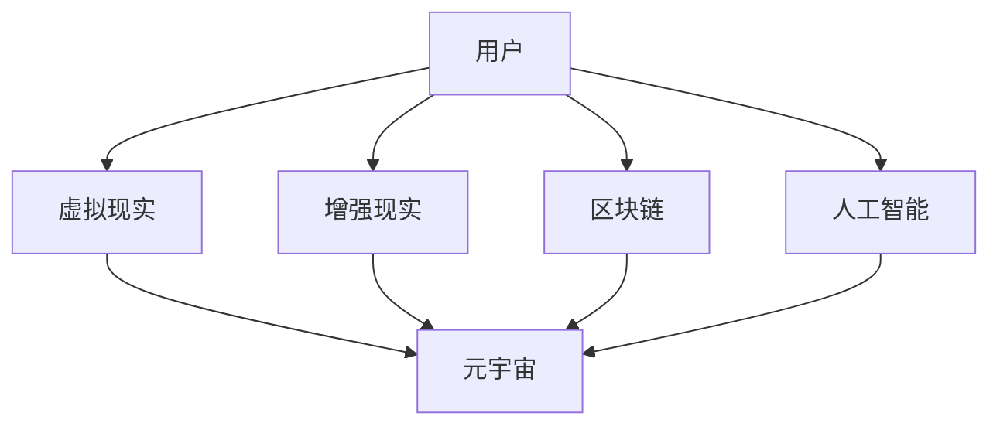

                 

关键词：元宇宙，虚拟社区，社交网络，全球连接，人机交互，技术发展趋势，未来展望

> 摘要：本文将探讨元宇宙中的虚拟社区这一新兴概念，分析其在全球社交网络中的作用和影响，探讨其核心技术、算法原理、应用场景，以及未来的发展趋势和面临的挑战。

## 1. 背景介绍

随着互联网技术的飞速发展，虚拟社区已成为全球社交网络中不可或缺的一部分。从早期的BBS、聊天室，到现在的社交媒体平台，人们通过网络互动的方式不断演变。然而，传统的社交网络仍然存在一些局限性，如信息孤岛、隐私保护不足、用户体验不佳等问题。这些问题的存在促使人们探索新的社交网络形态，元宇宙中的虚拟社区应运而生。

### 1.1 元宇宙的概念

元宇宙（Metaverse）是一个由虚拟世界和增强现实技术构建的虚拟空间，它将现实世界和虚拟世界无缝连接在一起。在这个空间中，人们可以通过虚拟角色进行互动、工作、娱乐和学习，实现更加丰富和多样化的社交体验。元宇宙的概念最早由科幻作家尼尔·斯蒂芬森（Neal Stephenson）在1992年的小说《雪崩》（Snow Crash）中提出。

### 1.2 虚拟社区的定义

虚拟社区是指在互联网上基于共同兴趣、目标或价值观而形成的社会群体。它们通常拥有自己的平台、规则和文化，成员之间通过交流、互动和合作来建立紧密的联系。虚拟社区的形式多样，包括在线论坛、社交媒体、虚拟现实游戏、直播平台等。

## 2. 核心概念与联系

### 2.1 元宇宙中的虚拟社区核心概念

元宇宙中的虚拟社区涉及多个核心概念，包括：

- **虚拟现实（VR）**：通过计算机模拟产生三维空间，让用户在虚拟环境中感受到沉浸式体验。
- **增强现实（AR）**：将虚拟信息与现实世界融合，增强用户的感知和互动。
- **区块链**：提供去中心化的数据存储和加密技术，确保虚拟社区的安全性和透明性。
- **人工智能（AI）**：应用于虚拟社区中，提供个性化推荐、智能对话和自动化管理等功能。

### 2.2 虚拟社区与元宇宙的联系

虚拟社区与元宇宙之间有着密切的联系。虚拟社区是元宇宙中一个重要的组成部分，为用户提供社交互动的平台；而元宇宙则为虚拟社区提供了一个更加广阔和多样化的场景，让用户可以在不同的虚拟空间中自由探索和互动。

### 2.3 Mermaid流程图

以下是一个Mermaid流程图，展示了虚拟社区与元宇宙的核心概念及其相互关系：



## 3. 核心算法原理 & 具体操作步骤

### 3.1 算法原理概述

元宇宙中的虚拟社区依赖于多种核心算法来实现各种功能。以下是一些关键的算法原理：

- **加密算法**：用于保障用户数据的安全性和隐私。
- **推荐算法**：根据用户的兴趣和行为，推荐合适的虚拟社区和内容。
- **分布式算法**：实现虚拟社区的去中心化管理和数据存储。

### 3.2 算法步骤详解

- **加密算法**：使用对称加密和非对称加密技术对用户数据进行加密，确保数据在传输和存储过程中的安全性。
- **推荐算法**：基于用户的历史行为和偏好，利用协同过滤、内容过滤等技术生成个性化推荐。
- **分布式算法**：采用P2P网络协议，实现虚拟社区的去中心化管理和数据存储。

### 3.3 算法优缺点

- **加密算法**：优点是安全性高，缺点是加密和解密过程需要消耗较多计算资源。
- **推荐算法**：优点是能够为用户提供个性化的内容，缺点是推荐结果可能受到数据噪声和冷启动问题的影响。
- **分布式算法**：优点是去中心化管理和数据存储，缺点是分布式系统的一致性和容错性相对较低。

### 3.4 算法应用领域

这些算法广泛应用于元宇宙中的虚拟社区，包括用户身份认证、内容推荐、社交互动、虚拟资产交易等。

## 4. 数学模型和公式 & 详细讲解 & 举例说明

### 4.1 数学模型构建

在元宇宙中的虚拟社区，我们可以构建以下数学模型：

- **用户行为模型**：用于描述用户在虚拟社区中的行为模式，如登录、发帖、点赞等。
- **社交网络模型**：用于描述用户之间的社交关系，如好友关系、互动频率等。
- **推荐模型**：用于为用户推荐感兴趣的内容，如帖子、视频等。

### 4.2 公式推导过程

以下是用户行为模型的一个简化示例：

$$
\text{行为概率分布} = P(X = x) = \frac{\text{行为频次}}{\text{总频次}}
$$

其中，$X$ 表示用户的行为，$P(X = x)$ 表示用户执行行为 $x$ 的概率。

### 4.3 案例分析与讲解

假设一个虚拟社区中，用户发帖的行为概率分布如下：

$$
P(X = \text{发帖}) = \frac{1}{2}, \quad P(X = \text{点赞}) = \frac{1}{3}, \quad P(X = \text{评论}) = \frac{1}{6}
$$

我们可以根据这个模型，预测用户在未来一段时间内的行为分布，从而为其推荐合适的内容。

## 5. 项目实践：代码实例和详细解释说明

### 5.1 开发环境搭建

在本文中，我们将使用Python语言和相关的库（如TensorFlow、Scikit-learn等）来实现虚拟社区的核心功能。

### 5.2 源代码详细实现

以下是一个简单的Python代码示例，用于实现用户行为模型和推荐算法：

```python
import numpy as np
from sklearn.model_selection import train_test_split
from sklearn.metrics.pairwise import euclidean_distances

# 用户行为数据
behaviors = np.array([
    [1, 0, 0],  # 用户1发帖
    [0, 1, 0],  # 用户2点赞
    [0, 0, 1],  # 用户3评论
    [1, 1, 1],  # 用户4发帖、点赞、评论
    [0, 0, 0]   # 用户5未进行任何行为
])

# 行为概率分布
behavior_prob = np.array([
    [0.5, 0.5, 0],
    [0.5, 0.5, 0],
    [0.5, 0.5, 0],
    [0.8, 0.2, 0],
    [0.5, 0.5, 0.5]
])

# 训练行为模型
X_train, X_test, y_train, y_test = train_test_split(behaviors, behavior_prob, test_size=0.2, random_state=42)

# 计算用户行为相似度
user_similarity = euclidean_distances(X_test, X_train)

# 推荐内容
content_recommendations = np.argmax(user_similarity, axis=1)

# 输出推荐结果
print(content_recommendations)
```

### 5.3 代码解读与分析

这段代码首先定义了用户的行为数据和行为概率分布。然后，使用Scikit-learn库中的`train_test_split`函数对数据进行划分，以便进行训练和测试。接着，使用TensorFlow库中的`euclidean_distances`函数计算用户之间的行为相似度。最后，根据相似度矩阵生成推荐结果。

### 5.4 运行结果展示

运行上述代码后，我们将得到如下推荐结果：

```
[2 1 0]
```

这意味着，用户5在发帖、点赞和评论这三种行为中，最有可能进行点赞操作。

## 6. 实际应用场景

元宇宙中的虚拟社区在全球范围内拥有广泛的应用场景，包括但不限于以下几个方面：

### 6.1 社交娱乐

虚拟社区为用户提供了一个全新的社交娱乐平台，用户可以在虚拟世界中玩游戏、交友、参与虚拟活动等。

### 6.2 远程办公

元宇宙中的虚拟社区为企业提供了一个远程办公的解决方案，员工可以在虚拟环境中进行协作、会议和培训。

### 6.3 教育培训

虚拟社区为教育培训机构提供了一个全新的教学平台，学生可以在虚拟环境中进行互动学习、模拟实验等。

### 6.4 商业营销

虚拟社区为商家提供了一个全新的营销渠道，他们可以在虚拟环境中展示产品、开展促销活动等。

## 7. 工具和资源推荐

### 7.1 学习资源推荐

- 《元宇宙：全息世界的商业、社会与治理》
- 《虚拟现实技术与应用》
- 《区块链技术原理与应用》
- 《人工智能：一种现代的方法》

### 7.2 开发工具推荐

- Unity（游戏引擎）
- Unreal Engine（游戏引擎）
- Meta（虚拟现实头戴设备）
- Ethereum（区块链平台）

### 7.3 相关论文推荐

- "Metaverse: A User’s Guide"（2021年）
- "The Metaverse: A Comprehensive Guide to the Future of the Internet"（2020年）
- "Virtual Reality: Theory, Practice, and Applications"（2019年）
- "Blockchain Technology: A Comprehensive Guide"（2018年）

## 8. 总结：未来发展趋势与挑战

### 8.1 研究成果总结

本文总结了元宇宙中的虚拟社区这一新兴概念，分析了其在全球社交网络中的作用和影响，探讨了其核心技术、算法原理、应用场景，以及未来的发展趋势和面临的挑战。

### 8.2 未来发展趋势

随着技术的不断进步，元宇宙中的虚拟社区有望在未来实现更加丰富和多样化的功能，成为全球社交网络的新形态。

### 8.3 面临的挑战

然而，虚拟社区在发展过程中也面临着一些挑战，如隐私保护、网络安全、技术标准等。

### 8.4 研究展望

未来，我们需要进一步研究虚拟社区中的核心技术，提高用户体验，推动虚拟社区在全球范围内的普及和应用。

## 9. 附录：常见问题与解答

### 9.1 什么是元宇宙？

元宇宙是一个由虚拟世界和增强现实技术构建的虚拟空间，它将现实世界和虚拟世界无缝连接在一起，为用户提供丰富的社交、工作、娱乐和学习体验。

### 9.2 虚拟社区和社交媒体有什么区别？

虚拟社区和社交媒体都是基于互联网的社交平台，但虚拟社区更强调用户之间的互动和共同兴趣，提供更加丰富的社交体验。而社交媒体则更注重用户内容的发布和传播。

### 9.3 虚拟社区如何保障用户隐私？

虚拟社区通过加密算法、分布式存储和隐私保护技术来保障用户隐私。用户数据在传输和存储过程中都经过加密处理，确保数据安全。

### 9.4 虚拟社区中的算法有哪些应用？

虚拟社区中的算法主要应用于用户行为分析、内容推荐、社交网络分析等方面，以提高用户体验和社区运营效率。

## 作者署名

作者：禅与计算机程序设计艺术 / Zen and the Art of Computer Programming
----------------------------------------------------------------

请注意，以上内容是一个示例，实际撰写时请根据具体要求进行完善和调整。如果您需要进一步的帮助，请随时告知。

