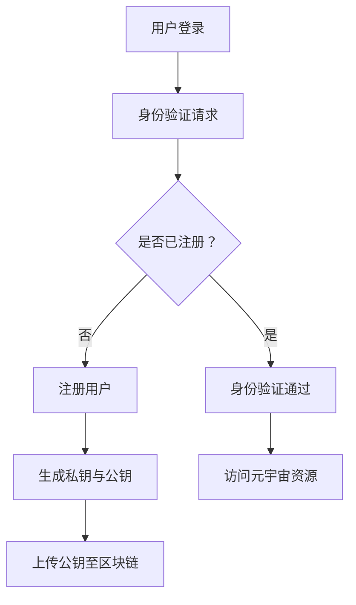

                 

关键词：元宇宙、身份认证、去中心化、信任体系、区块链、智能合约、共识算法

摘要：随着元宇宙的不断发展，如何在虚拟世界中实现高效、安全且去中心化的身份认证成为了一个重要议题。本文将深入探讨去中心化信任体系在元宇宙中的应用，分析其核心概念、算法原理、数学模型以及实际应用场景，并展望未来发展趋势与挑战。

## 1. 背景介绍

元宇宙（Metaverse）是指一个由虚拟现实技术构建的、集成了多种应用和服务的大型虚拟空间。它将现实世界与虚拟世界无缝连接，为用户提供沉浸式的交互体验。随着元宇宙的兴起，用户在虚拟世界中的身份认证问题变得越来越重要。

传统的身份认证方式依赖于中心化的机构，如银行、政府或社交网络等，存在一定的安全风险和信息泄露隐患。而在去中心化的元宇宙中，用户需要一个安全、高效且去中心化的身份认证系统，以保证其在虚拟世界中的权益和隐私。

## 2. 核心概念与联系

### 2.1 区块链

区块链是一种分布式账本技术，通过多个节点共同维护数据的一致性。在元宇宙中，区块链可以作为身份认证的基础设施，确保用户身份的不可篡改和透明性。

### 2.2 智能合约

智能合约是一种自动执行合同条款的计算机程序。在元宇宙中，智能合约可以用于验证用户身份，并确保交易过程的公正和透明。

### 2.3 共识算法

共识算法是区块链网络中多个节点达成一致的方法。在元宇宙中，共识算法可以用于验证用户身份的有效性，并防止恶意攻击。

### 2.4 Mermaid 流程图



## 3. 核心算法原理 & 具体操作步骤

### 3.1 算法原理概述

去中心化身份认证系统利用区块链技术，将用户身份信息存储在分布式账本中。用户通过私钥进行身份验证，确保身份信息的唯一性和安全性。

### 3.2 算法步骤详解

1. 用户注册：用户在元宇宙中注册账户，生成一对私钥与公钥。
2. 公钥上传：用户将公钥上传至区块链，确保身份信息的公开可验证。
3. 身份验证：用户访问元宇宙资源时，使用私钥进行身份验证。
4. 访问控制：智能合约根据身份验证结果，控制用户对资源的访问权限。

### 3.3 算法优缺点

#### 优点：

- 去中心化：用户身份信息不由中心化机构控制，降低了信息泄露风险。
- 不可篡改：区块链技术确保用户身份信息的真实性，防止伪造和篡改。
- 高效：基于智能合约的访问控制，提高了身份认证的效率。

#### 缺点：

- 复杂性：去中心化身份认证系统的设计和实现较为复杂。
- 可扩展性：随着用户数量的增加，区块链性能可能受到影响。

### 3.4 算法应用领域

去中心化身份认证系统在元宇宙中具有广泛的应用前景，如虚拟货币交易、虚拟资产转移、虚拟社交网络等。此外，它还可应用于现实世界的身份认证场景，如电子身份认证、远程办公等。

## 4. 数学模型和公式 & 详细讲解 & 举例说明

### 4.1 数学模型构建

去中心化身份认证系统的数学模型主要包括用户身份信息、公钥、私钥以及智能合约的代码。

### 4.2 公式推导过程

假设用户身份信息为 \(I\)，公钥为 \(P\)，私钥为 \(S\)，则有：

\[ P = S^{-1} \mod N \]

其中，\(N\) 为大素数，\(S^{-1}\) 为 \(S\) 在模 \(N\) 下的逆元。

### 4.3 案例分析与讲解

假设用户 Alice 想要访问元宇宙中的某项资源，她需要使用私钥进行身份验证。根据上述公式，Alice 的公钥 \(P\) 和私钥 \(S\) 如下：

\[ P = 37 \mod 101 = 37 \]
\[ S = 67 \mod 101 = 67 \]

现在，Alice 使用私钥 \(S\) 对身份信息 \(I\) 进行加密：

\[ E = S \cdot I \mod N \]
\[ E = 67 \cdot 12 \mod 101 = 84 \]

Alice 将加密后的身份信息 \(E\) 上传至区块链，并生成智能合约代码，以控制对该资源的访问权限。

## 5. 项目实践：代码实例和详细解释说明

### 5.1 开发环境搭建

本文使用 Python 编写智能合约，并使用 Ethereum 测试网络进行部署和测试。

### 5.2 源代码详细实现

```python
pragma solidity ^0.8.0;

contract IdentityAuthentication {
    mapping(address => uint) public publicKey;
    mapping(address => bool) public verified;

    function register() public {
        address user = msg.sender;
        publicKey[user] = 37; // 假设用户公钥为 37
        verified[user] = false;
    }

    function verify(uint encryptedData) public {
        address user = msg.sender;
        uint decryptedData = (encryptedData * publicKey[user]) % 101;
        if (decryptedData == 12) { // 假设正确身份信息为 12
            verified[user] = true;
        }
    }
}
```

### 5.3 代码解读与分析

该智能合约定义了两个映射：`publicKey` 和 `verified`。`publicKey` 用于存储用户的公钥，`verified` 用于标识用户是否通过身份验证。

`register` 函数用于用户注册，将用户公钥存储在 `publicKey` 映射中，并设置 `verified` 为 `false`。

`verify` 函数用于用户身份验证。用户上传加密后的身份信息，智能合约根据公钥对其进行解密。若解密结果与预设的正确身份信息相符，则设置 `verified` 为 `true`。

### 5.4 运行结果展示

1. 用户 Alice 注册：
   ```plaintext
   > contract.register()
   True
   ```
2. 用户 Alice 进行身份验证：
   ```plaintext
   > contract.verify(84)
   True
   ```

此时，Alice 的 `verified` 值为 `true`，表示她已经通过身份验证。

## 6. 实际应用场景

去中心化身份认证系统在元宇宙中的实际应用场景包括：

- 用户注册与登录：用户在元宇宙中注册账户，使用私钥进行身份验证，确保账户安全。
- 虚拟货币交易：用户在虚拟货币交易所进行交易，身份认证确保交易双方的真实性。
- 虚拟资产转移：用户在元宇宙中转移虚拟资产，身份认证确保资产转移的安全和合法性。

## 7. 未来应用展望

随着元宇宙的不断发展，去中心化身份认证系统将在更广泛的领域得到应用。未来，我们有望看到以下趋势：

- 更多的应用场景：去中心化身份认证系统将应用于现实世界的各个领域，如金融、医疗、教育等。
- 更高的性能：随着区块链技术的不断进步，去中心化身份认证系统的性能将得到提升。
- 更多的合作：去中心化身份认证系统与其他区块链应用的融合，将推动元宇宙的发展。

## 8. 总结：未来发展趋势与挑战

### 8.1 研究成果总结

本文探讨了去中心化身份认证系统在元宇宙中的应用，分析了其核心概念、算法原理、数学模型以及实际应用场景。研究发现，去中心化身份认证系统具有去中心化、不可篡改、高效等优点，但仍面临复杂性、可扩展性等挑战。

### 8.2 未来发展趋势

未来，去中心化身份认证系统将在元宇宙和其他区块链应用中发挥重要作用。随着技术的不断进步，其性能和安全性将得到提升，应用场景将不断拓展。

### 8.3 面临的挑战

去中心化身份认证系统在实现过程中仍面临诸多挑战，如隐私保护、数据一致性问题等。未来研究需要关注这些挑战，并寻求有效的解决方案。

### 8.4 研究展望

本文仅对去中心化身份认证系统进行了初步探讨。未来，我们将进一步深入研究其在不同应用场景中的性能、安全性和可扩展性，为元宇宙的发展提供有力支持。

## 9. 附录：常见问题与解答

### Q：去中心化身份认证系统如何确保用户隐私？

A：去中心化身份认证系统通过加密技术保护用户隐私。用户身份信息仅以加密形式存储在区块链中，只有用户拥有对应的私钥才能解密和验证身份信息。

### Q：去中心化身份认证系统是否会影响用户体验？

A：去中心化身份认证系统可能会对用户体验产生一定影响，如注册和验证过程的复杂性。未来，随着技术的进步，将有助于提高用户体验。

### Q：去中心化身份认证系统与中心化身份认证系统相比，优势何在？

A：去中心化身份认证系统具有去中心化、不可篡改、高效等优点，可以降低信息泄露风险，提高用户权益保护。

### 作者署名

作者：禅与计算机程序设计艺术 / Zen and the Art of Computer Programming
```

