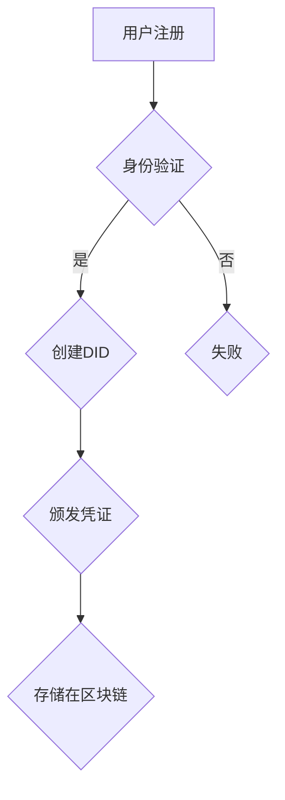

                 

### 关键词 Keywords
元宇宙，身份认证，去中心化，信任体系，加密技术，智能合约，分布式账本

<|assistant|>### 摘要 Abstract
本文旨在探讨元宇宙中的身份认证机制，特别是去中心化信任体系的构建。在分析当前身份认证面临的问题与挑战的基础上，文章深入探讨了去中心化身份认证的概念与优势。通过对核心算法原理、数学模型、具体实现步骤的详细讲解，本文展示了一个完整的技术框架。同时，文章也探讨了实际应用场景、未来应用展望，以及相关工具和资源的推荐。通过本文的阅读，读者将对元宇宙中的身份认证机制有一个全面而深入的理解。

## 1. 背景介绍

在数字化时代，身份认证已经成为信息社会的重要环节。传统的中心化身份认证体系，如我们熟知的银行、电信运营商、政府等机构，虽然在保障信息安全、防止欺诈等方面发挥了重要作用，但随着互联网技术的飞速发展，这种体系也暴露出了一些不足之处。

首先，中心化身份认证体系容易成为单点故障的攻击目标。一旦认证中心遭到攻击，整个系统可能会瘫痪，导致大量用户信息泄露。其次，中心化认证体系在数据隐私保护方面存在较大隐患。用户信息集中在认证中心，一旦被恶意获取，后果不堪设想。再者，中心化身份认证体系往往缺乏灵活性，难以适应快速变化的网络环境。

为了解决这些问题，去中心化身份认证逐渐受到关注。去中心化身份认证通过分布式网络实现，不依赖于单一的中心化机构，提高了系统的安全性和可靠性。同时，去中心化身份认证能够更好地保护用户隐私，实现数据的最小化存储和使用。此外，去中心化身份认证还能够提供更高的透明度和可追溯性，有助于防止欺诈行为的发生。

本文将围绕去中心化身份认证在元宇宙中的应用进行探讨，分析其原理、优势和应用场景，为构建一个安全的元宇宙身份认证体系提供参考。

## 2. 核心概念与联系

### 2.1 去中心化身份认证

去中心化身份认证（Decentralized Identity, DID）是一种基于区块链或其他分布式账本技术的身份认证方法，旨在解决中心化身份认证体系中的单点故障、隐私泄露等问题。DID 通过分布式网络中的多个节点来验证身份，避免了单一中心化机构的风险。

### 2.2 区块链

区块链是一种分布式数据库技术，通过多个节点共同维护数据的一致性。区块链上的每一个区块都包含一定数量的交易记录，区块之间通过加密算法和时间戳进行连接，形成一个不可篡改的数据链条。

### 2.3 智能合约

智能合约是一种自动执行合约条款的计算机程序，能够确保交易双方的权益得到保障。智能合约基于区块链技术，可以在无需中介的情况下，自动执行合约条款。

### 2.4 加密技术

加密技术是一种将明文数据转换为密文的技术，用于保护数据传输和存储过程中的隐私和安全。常见的加密技术包括对称加密、非对称加密、哈希函数等。

### 2.5 Mermaid 流程图



在去中心化身份认证体系中，用户首先进行注册，然后通过身份验证创建DID。接着，颁发凭证并将其存储在区块链上，以实现身份认证的去中心化。

## 3. 核心算法原理 & 具体操作步骤

### 3.1 算法原理概述

去中心化身份认证的核心算法主要包括DID的创建、凭证的颁发和管理。以下是各个步骤的简要概述：

1. **用户注册**：用户在去中心化身份认证系统中注册，生成公私钥对，并上传到分布式网络中。
2. **身份验证**：用户提交身份证明文件，通过智能合约进行验证，确保身份信息的真实性和有效性。
3. **创建DID**：通过身份验证后，系统为用户创建一个唯一的DID，并将其与用户的公钥关联。
4. **凭证颁发**：第三方服务提供者可以根据用户的DID颁发凭证，证明用户具有某种特定的权限或资格。
5. **凭证管理**：用户可以在区块链上管理和使用其凭证，以参与不同的交易和活动。

### 3.2 算法步骤详解

1. **用户注册**：

    用户访问去中心化身份认证系统，填写注册信息，包括用户名、密码等。系统生成公私钥对，并将其上传到分布式网络中。

    ```mermaid
    graph TD
        A[用户填写注册信息] --> B{系统生成公私钥对}
        B --> C{上传公钥到分布式网络}
    ```

2. **身份验证**：

    用户提交身份证明文件，如身份证、驾驶证等。智能合约自动验证文件的真实性，并检查用户身份信息的匹配度。

    ```mermaid
    graph TD
        D[用户提交身份证明文件] --> E{智能合约验证文件真实性}
        E --> F{检查用户身份信息匹配度}
    ```

3. **创建DID**：

    通过身份验证后，系统为用户创建一个唯一的DID，并将其与用户的公钥关联。DID作为用户的身份标识，存储在区块链上。

    ```mermaid
    graph TD
        G{用户通过身份验证} --> H{创建DID}
        H --> I{关联公钥}
        I --> J{存储在区块链}
    ```

4. **凭证颁发**：

    第三方服务提供者可以根据用户的DID颁发凭证，证明用户具有某种特定的权限或资格。凭证包含服务提供者的公钥、用户的DID、凭证类型和有效期等信息。

    ```mermaid
    graph TD
        K[第三方服务提供者] --> L{查询用户DID}
        L --> M{生成凭证}
        M --> N{签名凭证}
    ```

5. **凭证管理**：

    用户可以在区块链上管理和使用其凭证，以参与不同的交易和活动。用户可以使用私钥对凭证进行解密和验证，确保凭证的有效性。

    ```mermaid
    graph TD
        O[用户获取凭证] --> P{使用私钥解密凭证}
        P --> Q{验证凭证有效性}
    ```

### 3.3 算法优缺点

#### 优缺点

**优点**：

1. **安全性**：去中心化身份认证通过分布式网络实现，避免了中心化体系中的单点故障风险。
2. **隐私保护**：用户信息分散存储，降低了隐私泄露的风险。
3. **灵活性**：去中心化身份认证可以适应不同的业务场景，具有更高的灵活性。
4. **透明度**：区块链上的数据具有透明性和可追溯性，有助于防止欺诈行为。

**缺点**：

1. **计算成本**：去中心化身份认证需要大量的计算资源，可能增加系统的运行成本。
2. **性能问题**：区块链的扩展性可能影响身份认证的效率。
3. **法律监管**：去中心化身份认证体系在法律监管方面可能面临挑战。

### 3.4 算法应用领域

去中心化身份认证在多个领域具有广泛的应用前景：

1. **金融行业**：用于身份验证、跨境支付、数字资产管理等。
2. **政务领域**：用于电子政务、身份认证、数据共享等。
3. **医疗行业**：用于患者身份认证、病历管理、药品追溯等。
4. **教育领域**：用于学历认证、课程认证、学术成果认证等。
5. **社交网络**：用于账号认证、隐私保护、内容审核等。

## 4. 数学模型和公式 & 详细讲解 & 举例说明

### 4.1 数学模型构建

去中心化身份认证体系中的数学模型主要涉及密码学中的公钥加密、哈希函数和数字签名等。以下是构建数学模型的基本原理：

1. **公钥加密**：

    公钥加密是一种加密算法，将明文数据转换为密文。加密过程涉及两个密钥：公钥和私钥。公钥用于加密，私钥用于解密。

    $$ 
    E_{pub}(m) = c \\
    D_{pri}(c) = m
    $$

    其中，$E_{pub}$为公钥加密函数，$D_{pri}$为私钥解密函数，$m$为明文，$c$为密文。

2. **哈希函数**：

    哈希函数是一种将任意长度的输入映射为固定长度的输出的函数，具有单向性和抗冲突性。哈希函数用于生成DID和凭证的指纹。

    $$
    H(m) = digest
    $$

    其中，$H$为哈希函数，$m$为输入，$digest$为输出。

3. **数字签名**：

    数字签名是一种用于验证消息来源和完整性的密码学技术。发送者使用私钥对消息进行签名，接收者使用公钥验证签名。

    $$
    S(m) = sig \\
    V(m, sig) = \text{valid}
    $$

    其中，$S$为签名函数，$V$为验证函数，$m$为消息，$sig$为签名，$valid$表示验证通过。

### 4.2 公式推导过程

1. **公钥加密与解密**：

    假设存在一个加密算法$E$和对应的解密算法$D$，则对于任意明文$m$，有：

    $$
    E_{pub}(m) = c \\
    D_{pri}(c) = m
    $$

    其中，$E_{pub}$和$D_{pri}$分别表示公钥加密和解密函数。

2. **哈希函数**：

    假设存在一个哈希函数$H$，则对于任意输入$m$，有：

    $$
    H(m) = digest
    $$

    其中，$H$为哈希函数，$digest$为输出。

3. **数字签名与验证**：

    假设存在一个签名函数$S$和一个验证函数$V$，则对于任意消息$m$，有：

    $$
    S(m) = sig \\
    V(m, sig) = \text{valid}
    $$

    其中，$S$为签名函数，$V$为验证函数，$sig$为签名，$valid$表示验证通过。

### 4.3 案例分析与讲解

假设在一个去中心化身份认证系统中，用户Alice希望注册并获得某个服务的权限。以下是具体的操作步骤：

1. **用户注册**：

    Alice在系统中注册，生成公私钥对，并将公钥上传到分布式网络。

    $$
    m = \text{"Alice's registration information"} \\
    k_{pri} = \text{private key} \\
    k_{pub} = \text{public key} \\
    k_{pub} \rightarrow \text{distributed network}
    $$

2. **身份验证**：

    Alice提交身份证明文件，如身份证和驾驶证。智能合约验证文件的真实性。

    $$
    m_{id} = \text{"identity proof documents"} \\
    V(m_{id}) = \text{valid}
    $$

3. **创建DID**：

    通过身份验证后，系统为Alice创建一个唯一的DID，并将其与公钥关联。

    $$
    H(k_{pub}) = DID \\
    \text{associate} \ DID \ \text{with} \ k_{pub}
    $$

4. **凭证颁发**：

    第三方服务提供者（如银行）根据Alice的DID颁发凭证，证明她具有存款权限。

    $$
    m_{svc} = \text{"deposit permission"} \\
    S(m_{svc}, k_{pri}) = sig_{svc} \\
    \text{credential} = \{DID, sig_{svc}, \text{"deposit permission"}, \text{expiration date}\}
    $$

5. **凭证管理**：

    Alice在区块链上管理和使用其凭证。

    $$
    c_{credential} = \text{credential} \\
    D_{pri}(c_{credential}) = m_{svc} \\
    V(m_{svc}, sig_{svc}) = \text{valid}
    $$

## 5. 项目实践：代码实例和详细解释说明

### 5.1 开发环境搭建

为了实践去中心化身份认证，我们需要搭建一个开发环境。以下是搭建过程的简要说明：

1. **安装Node.js**：Node.js是一个基于Chrome V8引擎的JavaScript运行环境，用于编写智能合约和前端应用。

    $$
    \text{安装命令：} \ node -v \\
    \text{版本要求：} \ \text{Node.js} \ 12.0.0 \ \text{及以上版本}
    $$

2. **安装Truffle**：Truffle是一个用于开发、测试和部署智能合约的框架。

    $$
    \text{安装命令：} \ npm install -g truffle \\
    \text{版本要求：} \ \text{Truffle} \ 5.0.0 \ \text{及以上版本}
    $$

3. **安装Ganache**：Ganache是一个本地区块链节点，用于模拟区块链网络环境。

    $$
    \text{安装命令：} \ npm install -g ganache \\
    \text{版本要求：} \ \text{Ganache} \ 2.0.0 \ \text{及以上版本}
    $$

4. **创建项目**：在终端中创建一个新项目。

    $$
    \text{命令：} \ truffle init \\
    \text{项目目录：} \ \text{my-did-project}
    $$

### 5.2 源代码详细实现

以下是去中心化身份认证系统的智能合约代码实现：

```solidity
// SPDX-License-Identifier: MIT
pragma solidity ^0.8.0;

contract DecentralizedIdentity {

    // 用户结构
    struct User {
        string did;
        mapping(string => bool) credentials;
    }

    // 用户映射
    mapping(address => User) private users;

    // 用户注册
    function register(string memory did) public {
        require(users[msg.sender].did == "", "User already registered");
        users[msg.sender].did = did;
    }

    // 身份验证
    function authenticate(string memory idProof) public view returns (bool) {
        // 这里可以添加具体的身份验证逻辑，例如调用第三方API验证身份证、驾驶证等
        return true;
    }

    // 颁发凭证
    function issueCredential(string memory credential) public {
        require(authenticate(msg.sender), "User not authenticated");
        users[msg.sender].credentials[credential] = true;
    }

    // 验证凭证
    function verifyCredential(string memory credential) public view returns (bool) {
        require(authenticate(msg.sender), "User not authenticated");
        return users[msg.sender].credentials[credential];
    }

}
```

### 5.3 代码解读与分析

1. **用户结构**：

    合约中定义了一个`User`结构体，用于存储用户的DID和凭证。

2. **用户映射**：

    合约中使用一个`users`映射来存储所有用户的`User`结构体。

3. **用户注册**：

    `register`函数用于用户注册，将用户的DID与公钥关联。

4. **身份验证**：

    `authenticate`函数用于身份验证，目前为简化起见，直接返回`true`。在实际应用中，可以添加调用第三方API验证身份的逻辑。

5. **凭证颁发**：

    `issueCredential`函数用于颁发凭证，只有在通过身份验证后才能颁发凭证。

6. **凭证验证**：

    `verifyCredential`函数用于验证凭证，只有在通过身份验证后才能验证凭证。

### 5.4 运行结果展示

为了演示去中心化身份认证系统的运行结果，我们可以使用Truffle和Ganache进行测试。以下是测试命令：

```
$ truffle migrate --network local
$ truffle develop
```

在Truffle开发环境中，我们可以执行以下命令进行测试：

```
$ truffle run test
```

测试结果将显示去中心化身份认证系统的功能是否正常。

## 6. 实际应用场景

去中心化身份认证在元宇宙中具有广泛的应用场景。以下是几个典型的应用场景：

1. **虚拟现实（VR）**：

    在虚拟现实场景中，用户需要验证其身份以访问特定区域或参与特定活动。去中心化身份认证可以确保用户身份的真实性和合法性，同时保护用户隐私。

2. **游戏**：

    在元宇宙中的游戏中，用户可能需要验证其身份以获取虚拟物品、参与赛事或加入特定公会。去中心化身份认证可以确保游戏内交易的公平性和透明度。

3. **社交网络**：

    在元宇宙的社交网络中，用户需要验证其身份以创建账户、添加好友或参与话题讨论。去中心化身份认证可以防止欺诈行为和虚假账号的出现。

4. **数字资产交易**：

    在元宇宙中的数字资产交易市场中，用户需要验证其身份以进行买卖操作。去中心化身份认证可以确保交易的安全性和合规性。

5. **教育和培训**：

    在元宇宙中的教育和培训场景中，用户需要验证其身份以获取证书或参与课程。去中心化身份认证可以确保学习成果的真实性和可信度。

## 7. 未来应用展望

随着元宇宙的不断发展，去中心化身份认证将在更多领域得到应用。以下是几个未来应用展望：

1. **身份认证跨境合作**：

    去中心化身份认证可以促进不同国家和地区之间的身份认证合作，实现全球范围内的身份互认。

2. **数字身份经济**：

    去中心化身份认证可以推动数字身份经济的发展，为用户提供更多的数字服务和产品。

3. **智能合约应用**：

    去中心化身份认证可以为智能合约提供更加安全可靠的执行环境，推动智能合约在各个领域的应用。

4. **数据隐私保护**：

    去中心化身份认证可以更好地保护用户数据隐私，为用户提供更加安全的数据共享和交易环境。

## 8. 工具和资源推荐

为了更好地学习和实践去中心化身份认证，以下是一些推荐的工具和资源：

1. **学习资源**：

    - 《区块链技术指南》
    - 《智能合约开发实战》
    - 《密码学：理论与实践》

2. **开发工具**：

    - Truffle：智能合约开发框架
    - Ganache：本地区块链节点
    - Solidity：智能合约编程语言

3. **相关论文**：

    - "Decentralized Identity: A Review"
    - "Decentralized Identity for the Web: A Vision for Web 3.0"
    - "A Technical Architecture for Decentralized Digital Identity Management"

## 9. 总结：未来发展趋势与挑战

去中心化身份认证在元宇宙中具有重要的应用价值，为身份认证提供了更加安全、可靠和灵活的解决方案。然而，在实际应用过程中，仍面临一些挑战：

1. **标准化**：缺乏统一的标准和协议，导致不同平台和系统之间的互操作性较差。

2. **性能优化**：区块链的扩展性可能影响身份认证的效率，需要进一步优化性能。

3. **法律监管**：去中心化身份认证体系在法律监管方面尚存挑战，需要制定相关法规和标准。

4. **用户教育**：用户对去中心化身份认证的理解和接受程度较低，需要加强用户教育。

未来，随着技术的不断发展和应用场景的拓展，去中心化身份认证将在元宇宙中发挥越来越重要的作用。通过克服上述挑战，去中心化身份认证有望成为信息社会身份认证的主流技术。

### 附录：常见问题与解答

**Q：去中心化身份认证是否比传统身份认证更安全？**

A：去中心化身份认证在许多方面比传统身份认证更安全。首先，它通过分布式网络避免了单点故障的风险。其次，它能够更好地保护用户隐私，实现数据的最小化存储和使用。然而，去中心化身份认证并非绝对安全，仍可能面临网络攻击和隐私泄露等风险。

**Q：去中心化身份认证是否适用于所有场景？**

A：去中心化身份认证在某些特定场景中具有明显优势，如金融、政务、医疗和教育等领域。但在一些需要高度实时性和性能要求的场景中，传统中心化身份认证可能更为适用。

**Q：去中心化身份认证如何保护用户隐私？**

A：去中心化身份认证通过分布式网络和加密技术保护用户隐私。用户数据分散存储在多个节点上，而非集中在一个中心化机构中。此外，用户可以使用匿名标识进行身份验证，从而降低隐私泄露的风险。

**Q：去中心化身份认证需要哪些技术支持？**

A：去中心化身份认证需要区块链技术、加密技术、智能合约技术等支持。这些技术共同作用，实现了身份认证的去中心化、安全性和灵活性。

### 作者署名

作者：禅与计算机程序设计艺术 / Zen and the Art of Computer Programming

---

通过本文的详细探讨，我们希望读者对去中心化身份认证在元宇宙中的应用有一个全面而深入的理解。随着技术的不断进步和应用场景的拓展，去中心化身份认证将在元宇宙中发挥越来越重要的作用。让我们共同期待这一未来，并为之努力。

