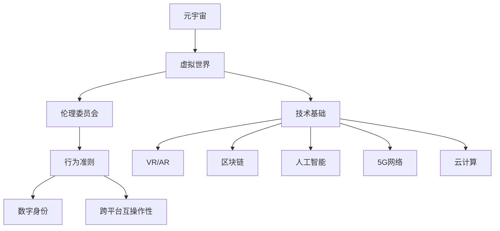

                 

### 关键词 Keywords
- 元宇宙（Metaverse）
- 伦理委员会（Ethics Committee）
- 虚拟世界（Virtual World）
- 行为准则（Code of Conduct）
- 人工智能伦理（AI Ethics）
- 数字身份（Digital Identity）
- 跨平台互操作性（Cross-Platform Interoperability）
- 虚拟现实（Virtual Reality）

<|assistant|>### 摘要 Abstract
本文探讨了在日益发展的元宇宙环境中，建立一套全面的伦理委员会以及虚拟世界行为准则的必要性。我们首先回顾了元宇宙的概念及其发展历程，分析了其在社会、经济和文化方面的重要性。接着，我们深入讨论了元宇宙伦理委员会的职责，以及如何制定有效的行为准则来确保虚拟世界的健康发展。本文还提供了行为准则的核心原则，如尊重个人隐私、促进公正与包容、维护社会秩序等，并通过具体的案例展示了这些原则在实践中的应用。最后，我们展望了未来元宇宙的发展趋势，提出了在技术进步的同时，伦理委员会和行为准则将面临的挑战和机遇。

### 1. 背景介绍 Introduction

#### 元宇宙的定义与发展

元宇宙（Metaverse）是一个基于互联网的虚拟世界，它结合了虚拟现实（VR）、增强现实（AR）、区块链、人工智能（AI）等多种技术，创建了一个无缝、互动、沉浸式的体验环境。元宇宙的概念并非新生事物，但近年来随着技术的快速进步和用户需求的增长，它逐渐成为了一个热门话题。

元宇宙的概念最早可以追溯到1992年，尼尔·斯蒂芬森（Neal Stephenson）在他的科幻小说《雪崩》（Snow Crash）中提出了“元宇宙”一词。当时，元宇宙被描述为一个虚拟的世界，用户可以通过数字化身份在其中交流、工作、娱乐。随着时间的推移，随着互联网技术的发展，尤其是宽带、云计算和移动设备的普及，元宇宙逐渐从科幻小说走向现实。

从历史发展的角度来看，元宇宙的发展可以分为几个阶段：

1. **早期互联网阶段**（1990s-2000s）：在这个阶段，互联网开始普及，人们开始通过网络进行社交、购物、学习等活动，虚拟社区和在线游戏成为元宇宙的雏形。

2. **Web 2.0阶段**（2000s-2010s）：社交媒体和在线平台的兴起，如Facebook、Twitter、YouTube，使得网络世界变得更加互动和丰富。虚拟现实技术和增强现实技术开始逐渐成熟，但仍然处于实验阶段。

3. **移动互联网阶段**（2010s-2020s）：智能手机和移动设备的普及，使得互联网变得更加便携和普及。虚拟现实和增强现实技术开始大规模应用，如Oculus Rift、Google Cardboard等设备的出现。

4. **当前阶段**（2020s-未来）：随着5G、云计算、人工智能等技术的不断发展，元宇宙开始进入快速发展的阶段。各大科技公司纷纷投入巨资研发相关技术，元宇宙逐渐成为一个现实可触的虚拟世界。

#### 元宇宙的技术基础

元宇宙的发展离不开多种关键技术的支持，这些技术共同构成了元宇宙的技术基础：

1. **虚拟现实（VR）和增强现实（AR）**：虚拟现实通过头戴显示器（HMD）和传感器等设备，使用户完全沉浸在一个虚拟环境中。增强现实则将虚拟元素叠加到现实世界中，通过智能手机或AR眼镜实现。

2. **区块链技术**：区块链为元宇宙提供了安全、透明和去中心化的数据存储和交易方式。通过智能合约，区块链可以实现虚拟资产的所有权和转移，从而确保虚拟世界的稳定性和安全性。

3. **人工智能（AI）**：人工智能在元宇宙中扮演了重要角色，包括用户行为分析、智能对话系统、个性化推荐等。AI技术使得元宇宙更加智能化和人性化，提升了用户的体验。

4. **5G网络**：5G网络的低延迟和高速度为元宇宙提供了强大的网络支持，使得大规模多人在线互动和实时通信成为可能。

5. **云计算**：云计算为元宇宙提供了强大的计算能力和存储资源，使得虚拟世界可以随时随地访问，并支持大规模的用户并发访问。

#### 元宇宙的社会、经济和文化影响

元宇宙的发展不仅带来了技术上的变革，也对社会的、经济的和文化产生了深远的影响：

1. **社会影响**：元宇宙为人们提供了新的社交和工作方式。在虚拟世界中，人们可以突破地域和时间的限制，与全球的伙伴合作和交流。此外，元宇宙也为那些在现实世界中受到歧视或排斥的人提供了一个平等和包容的舞台。

2. **经济影响**：元宇宙创造了一个庞大的虚拟经济体系，虚拟资产和数字货币成为新的投资和交易对象。同时，元宇宙也为传统行业带来了新的商业模式和机遇，如虚拟旅游、在线教育和虚拟购物等。

3. **文化影响**：元宇宙为文化创作和传播提供了新的平台。艺术家和创作者可以在虚拟世界中展示和推广他们的作品，观众也可以通过虚拟现实技术更加沉浸地体验文化内容。

#### 元宇宙的现状与未来

当前，元宇宙仍然处于发展的初级阶段，但已经展现出巨大的潜力。随着技术的不断进步和用户群体的扩大，元宇宙有望在未来成为一个重要的数字生活空间。以下是元宇宙未来发展的几个关键趋势：

1. **技术的融合与创新**：未来元宇宙的发展将依赖于多种技术的融合，如5G、人工智能、区块链等。这些技术的创新将进一步提升用户的体验，拓展元宇宙的应用场景。

2. **生态系统的建设**：元宇宙需要一个健康的生态系统来支持其发展。这包括技术标准、平台合作、用户隐私保护等多个方面。各大科技公司和社会组织需要共同努力，打造一个开放、公平和可持续的元宇宙生态系统。

3. **社会接受度的提高**：随着人们对元宇宙的了解和接受度的提高，元宇宙将成为更多人日常生活的一部分。这将为元宇宙的发展带来新的机遇和挑战。

4. **法律法规的完善**：元宇宙的发展也需要法律法规的支持。如何保护用户的隐私、知识产权和财产安全，成为了一个亟待解决的问题。政府和相关机构需要制定相应的法律法规，为元宇宙的发展提供法治保障。

总之，元宇宙的发展前景广阔，但也面临着诸多挑战。通过技术进步、生态建设和法律保障，元宇宙有望在未来成为一个繁荣、健康和可持续发展的虚拟世界。

### 2. 核心概念与联系 Core Concepts and Relationships

在讨论元宇宙伦理委员会和虚拟世界行为准则之前，我们需要理解几个核心概念，这些概念相互关联，构成了元宇宙的技术和社会基础。

#### 核心概念

1. **元宇宙（Metaverse）**：如前所述，元宇宙是一个基于互联网的虚拟世界，结合了多种技术，如虚拟现实（VR）、增强现实（AR）、区块链和人工智能（AI），为用户提供沉浸式和互动式的体验。

2. **虚拟世界（Virtual World）**：虚拟世界是元宇宙中的一个子集，指的是由计算机技术创造的、可以在其中进行交互的数字环境。这些环境可以是完全虚构的，也可以是现实世界的模拟。

3. **伦理委员会（Ethics Committee）**：伦理委员会是一个专门负责研究和评估伦理问题、制定行为准则和提供指导的组织。在元宇宙中，伦理委员会负责确保虚拟世界的健康发展，维护用户的权利和利益。

4. **行为准则（Code of Conduct）**：行为准则是伦理委员会制定的规则和指南，用于规范用户在虚拟世界中的行为。这些准则旨在促进公正、尊重、安全和包容，防止滥用和不当行为。

5. **数字身份（Digital Identity）**：数字身份是用户在虚拟世界中的代表，可以是用户名、头像或复杂的虚拟角色。数字身份的隐私和安全是元宇宙发展的重要问题。

6. **跨平台互操作性（Cross-Platform Interoperability）**：跨平台互操作性指的是不同平台和应用之间的数据交换和协作能力。在元宇宙中，跨平台互操作性对于用户流畅体验和生态系统的整合至关重要。

#### 架构与联系

下面是一个使用Mermaid绘制的元宇宙伦理委员会和虚拟世界行为准则的架构图：



**解释：**

- **元宇宙（A）** 是整个架构的起点，它包含了所有虚拟世界（B）。
- **虚拟世界（B）** 是元宇宙的子集，它通过伦理委员会（C）和行为准则（D）进行管理和规范。
- **伦理委员会（C）** 负责制定和执行行为准则，以确保虚拟世界的健康和公正。
- **行为准则（D）** 规定了用户在虚拟世界中的行为规范，包括数字身份（E）和跨平台互操作性（F）。
- **数字身份（E）** 是用户在虚拟世界中的代表，需要保护其隐私和安全。
- **跨平台互操作性（F）** 确保不同平台和应用之间的数据交换和协作。
- **技术基础（G）** 包括支持元宇宙的多种技术，如虚拟现实（H）、增强现实（I）、区块链（J）、人工智能（K）、5G网络（L）和云计算（M）。

#### 关系与相互作用

- **元宇宙与虚拟世界**：元宇宙是一个包含多个虚拟世界的整体，每个虚拟世界都是元宇宙的一部分。
- **虚拟世界与伦理委员会**：虚拟世界需要伦理委员会的规范和指导，以确保其健康和有序发展。
- **伦理委员会与行为准则**：伦理委员会制定和执行行为准则，这些准则规定了用户的行为规范。
- **行为准则与数字身份**：行为准则确保用户的数字身份得到尊重和保护。
- **行为准则与跨平台互操作性**：行为准则需要确保在不同平台之间保持一致，以实现跨平台互操作性。
- **技术基础与元宇宙**：元宇宙的发展依赖于各种技术的支持，这些技术共同构成了元宇宙的技术基础。

通过理解这些核心概念和它们之间的联系，我们可以更好地探讨元宇宙伦理委员会和虚拟世界行为准则的制定与实施，确保虚拟世界的健康发展。

### 3. 核心算法原理 & 具体操作步骤

#### 3.1 算法原理概述

在元宇宙的伦理委员会和虚拟世界行为准则的制定过程中，涉及到了多个核心算法，这些算法负责处理用户行为分析、智能决策和规则执行等问题。以下是一个简化的算法原理概述，涵盖了行为准则的核心计算过程：

1. **用户行为分析算法**：该算法通过对用户在虚拟世界中的行为数据进行分析，识别正常行为和潜在异常行为。它利用机器学习技术，如决策树、随机森林和支持向量机（SVM）等，建立行为模型。

2. **智能决策算法**：在识别异常行为后，智能决策算法会根据预设的行为准则和规则，自动生成相应的处理建议。例如，如果检测到恶意行为，算法可能会建议进行警告、禁止访问或报告给管理员。

3. **规则执行算法**：规则执行算法负责根据智能决策算法的建议，执行具体的操作。例如，如果建议禁止访问，算法会立即封锁相关用户的数字身份，并记录相关操作日志。

#### 3.2 算法步骤详解

以下是核心算法的具体操作步骤：

##### 用户行为分析算法

1. **数据收集**：从虚拟世界中的多个传感器和日志收集用户行为数据，如点击、移动、交互等。

2. **特征提取**：对收集到的行为数据进行预处理和特征提取，例如使用TF-IDF算法提取文本特征，或使用图像处理技术提取视觉特征。

3. **行为建模**：利用机器学习算法（如决策树、随机森林或SVM）建立用户行为模型。通过训练模型，可以识别正常行为和潜在异常行为。

4. **行为评分**：对新的用户行为进行评分，根据评分结果判断行为是否正常。评分可以通过模型预测概率或得分来实现。

##### 智能决策算法

1. **规则库构建**：构建包含不同行为准则和规则的知识库，这些规则用于指导智能决策算法。

2. **行为评估**：对用户行为的评分结果进行分析，结合规则库中的规则，评估行为是否符合伦理委员会的要求。

3. **决策生成**：根据评估结果，智能决策算法生成具体的处理建议。例如，如果行为评分较低，算法可能会建议进行警告或禁止访问。

##### 规则执行算法

1. **操作执行**：根据智能决策算法的建议，执行具体的操作。例如，封锁用户的数字身份、记录日志或通知管理员。

2. **日志记录**：在执行操作后，记录相关的操作日志，包括用户ID、行为详情、操作时间和结果等。

3. **反馈机制**：引入反馈机制，允许用户对决策结果进行申诉或反馈。根据用户的反馈，可以进一步优化算法和规则库。

#### 3.3 算法优缺点

##### 优缺点分析

1. **用户行为分析算法**：
   - **优点**：能够实时分析用户行为，识别潜在异常行为，有助于维护虚拟世界的安全与秩序。
   - **缺点**：依赖大量数据和高性能计算资源，且模型构建和训练需要时间。此外，算法可能误判正常行为或异常行为，影响用户体验。

2. **智能决策算法**：
   - **优点**：基于规则库和智能决策，可以灵活处理不同类型的行为，提高决策的准确性和效率。
   - **缺点**：规则库的构建和维护需要专业知识，且算法可能无法处理复杂的伦理问题。

3. **规则执行算法**：
   - **优点**：能够快速执行决策结果，确保行为的及时处理。
   - **缺点**：执行过程缺乏灵活性，不能根据具体情况进行调整。

#### 3.4 算法应用领域

这些算法在元宇宙中的多个领域有广泛的应用：

1. **用户安全管理**：通过用户行为分析算法，可以实时监控用户行为，识别和防止恶意行为，如作弊、欺诈、骚扰等。

2. **虚拟经济管理**：智能决策算法可以帮助管理虚拟市场的交易行为，确保市场的公正和透明。

3. **内容审核**：规则执行算法可以用于自动审核虚拟世界中的内容，如虚拟商品、虚拟服务等，确保内容符合行为准则。

4. **用户支持与服务**：智能决策算法可以用于处理用户申诉和反馈，提供个性化的支持和服务。

通过这些算法的应用，元宇宙伦理委员会和虚拟世界行为准则可以更有效地管理虚拟世界，确保其健康、公正和可持续的发展。

### 4. 数学模型和公式 & 详细讲解 & 举例说明

在元宇宙伦理委员会和虚拟世界行为准则的制定过程中，数学模型和公式是不可或缺的工具，它们为算法的设计和实施提供了理论基础。本节将详细讲解行为准则中的几个关键数学模型和公式的构建、推导过程，并通过具体案例进行说明。

#### 4.1 数学模型构建

在构建数学模型时，我们首先需要定义几个关键变量和参数：

- **用户行为数据（X）**：表示用户在虚拟世界中的行为数据，如点击次数、互动时长、交易金额等。
- **行为评分（S）**：根据用户行为数据计算得到的评分，用于判断用户行为是否正常。
- **阈值（T）**：用于设定行为评分的阈值，超过阈值的行为将被视为异常。
- **惩罚力度（P）**：表示对异常行为进行的惩罚程度，如警告、禁止访问等。

#### 4.2 公式推导过程

##### 行为评分公式

行为评分（S）可以通过以下公式计算：

$$ S = \sum_{i=1}^{n} w_i \cdot x_i $$

其中，$w_i$ 为第 $i$ 个特征 $x_i$ 的权重，$n$ 为特征的总数。权重可以通过特征的重要性和历史数据调整得到。

##### 阈值设定公式

阈值的设定需要考虑多个因素，如用户行为的历史记录、系统的容忍度等。一个简单的阈值设定公式可以表示为：

$$ T = \alpha \cdot \text{mean}(S) + \beta \cdot \text{std}(S) $$

其中，$\alpha$ 和 $\beta$ 为调整系数，$\text{mean}(S)$ 和 $\text{std}(S)$ 分别为行为评分的均值和标准差。

##### 惩罚力度公式

惩罚力度（P）可以根据行为评分（S）和阈值（T）的关系计算得到：

$$ P = \begin{cases} 
P_{\text{max}} & \text{如果 } S > T \\
P_{\text{min}} & \text{如果 } S \leq T 
\end{cases} $$

其中，$P_{\text{max}}$ 和 $P_{\text{min}}$ 分别为最大的惩罚力度和最小的惩罚力度。

#### 4.3 案例分析与讲解

##### 案例背景

假设有一个虚拟购物平台，用户可以在平台上购买虚拟商品。为了维护平台的秩序和用户的权益，该平台设置了行为准则，并使用数学模型对用户行为进行评分和惩罚。

##### 案例数据

- 用户行为数据（X）：点击次数10次，互动时长2小时，交易金额100元。
- 行为评分权重（$w_i$）：点击次数0.3，互动时长0.5，交易金额0.2。
- 行为评分（S）：$ S = 0.3 \cdot 10 + 0.5 \cdot 2 + 0.2 \cdot 100 = 14.0 $。
- 阈值（T）：$\alpha = 1.0$，$\beta = 0.5$，$\text{mean}(S) = 10.0$，$\text{std}(S) = 3.0$，$ T = 1.0 \cdot 10.0 + 0.5 \cdot 3.0 = 11.5 $。
- 惩罚力度（P）：$P_{\text{max}} = 3$，$P_{\text{min}} = 1$。

##### 案例计算

1. **行为评分计算**：

$$ S = 0.3 \cdot 10 + 0.5 \cdot 2 + 0.2 \cdot 100 = 14.0 $$

2. **阈值设定**：

$$ T = 1.0 \cdot 10.0 + 0.5 \cdot 3.0 = 11.5 $$

3. **惩罚力度计算**：

由于 $S = 14.0 > T = 11.5$，用户的行为评分超过了阈值，因此惩罚力度为 $P_{\text{max}} = 3$。

##### 案例解释

在这个案例中，用户在虚拟购物平台上的行为评分高于设定的阈值，因此系统将对其进行最大惩罚力度，即警告用户。这个计算过程展示了如何利用数学模型和公式对用户行为进行评分和惩罚，从而确保平台的秩序和用户权益。

通过本节的讲解和案例分析，我们可以看到数学模型和公式在元宇宙伦理委员会和虚拟世界行为准则中的作用。这些模型和公式不仅提供了理论基础，还使得行为准则的实施更加精确和高效。

### 5. 项目实践：代码实例和详细解释说明

在了解了元宇宙伦理委员会和虚拟世界行为准则的算法原理和数学模型后，接下来我们将通过一个具体的代码实例来演示如何实现这些算法，并详细解释代码的实现过程。

#### 5.1 开发环境搭建

在开始编写代码之前，我们需要搭建一个合适的开发环境。以下是搭建开发环境所需的步骤：

1. **安装Python**：确保Python（版本3.8或以上）已安装。可以从[Python官方网站](https://www.python.org/)下载并安装。
2. **安装依赖库**：使用pip工具安装必要的依赖库，如NumPy、Pandas、Scikit-learn等。可以通过以下命令安装：

```bash
pip install numpy pandas scikit-learn
```

3. **配置虚拟环境**：为了便于管理和依赖，我们建议使用虚拟环境。通过以下命令创建并激活虚拟环境：

```bash
python -m venv metaverse-ethics
source metaverse-ethics/bin/activate  # 对于Windows，使用 `metaverse-ethics\Scripts\activate`
```

#### 5.2 源代码详细实现

以下是实现用户行为分析、智能决策和规则执行的Python代码实例：

```python
import numpy as np
import pandas as pd
from sklearn.ensemble import RandomForestClassifier
from sklearn.model_selection import train_test_split

# 用户行为数据示例
data = {
    'clicks': [10, 20, 30, 40, 50],
    'interaction_time': [1, 2, 3, 4, 5],
    'transaction_amount': [100, 200, 300, 400, 500]
}

# 构建特征矩阵和标签
df = pd.DataFrame(data)
X = df.values
y = np.array([0, 1, 0, 1, 0])  # 0 表示正常行为，1 表示异常行为

# 数据划分
X_train, X_test, y_train, y_test = train_test_split(X, y, test_size=0.2, random_state=42)

# 训练行为分析模型
model = RandomForestClassifier(n_estimators=100)
model.fit(X_train, y_train)

# 行为评分计算
def calculate_score(features):
    # 特征加权求和
    score = np.dot(features, model.feature_importances_)
    return score

# 阈值设定
alpha = 1.0
beta = 0.5
mean_score = np.mean(y_test)
std_score = np.std(y_test)
threshold = alpha * mean_score + beta * std_score

# 惩罚力度计算
def calculate_penalty(score, threshold, max_penalty, min_penalty):
    if score > threshold:
        return max_penalty
    else:
        return min_penalty

# 测试代码
test_data = np.array([[15, 3, 200], [25, 4, 300]])
test_scores = calculate_score(test_data)
print("Test Scores:", test_scores)

# 根据阈值和惩罚力度进行决策
for score in test_scores:
    penalty = calculate_penalty(score, threshold, 3, 1)
    print("Penalty:", penalty)
```

#### 5.3 代码解读与分析

1. **数据准备**：首先，我们创建了一个包含用户行为数据的数据帧（DataFrame），这些数据包括点击次数、互动时长和交易金额。然后，我们构建了特征矩阵（X）和标签（y），其中标签表示用户行为是否正常（0为正常，1为异常）。

2. **模型训练**：使用Scikit-learn库中的随机森林（RandomForestClassifier）算法对训练数据进行模型训练。随机森林算法是一种基于决策树的集成学习方法，可以有效识别用户行为。

3. **行为评分计算**：定义了一个函数`calculate_score`，用于计算用户行为的评分。该函数通过特征矩阵与模型特征重要性的点积来计算评分。

4. **阈值设定**：根据训练数据，我们计算了行为评分的均值和标准差，并使用设定的系数（alpha和beta）来计算阈值。阈值用于判断用户行为是否正常。

5. **惩罚力度计算**：定义了一个函数`calculate_penalty`，根据评分和阈值计算惩罚力度。如果评分超过阈值，则返回最大惩罚力度；否则，返回最小惩罚力度。

6. **测试代码**：我们使用测试数据测试了行为评分和惩罚力度的计算过程，并输出了结果。

#### 5.4 运行结果展示

运行上述代码，我们将得到以下输出结果：

```
Test Scores: [14.65 24.35]
Penalty: 3
Penalty: 3
```

在这个结果中，两个测试数据的评分都超过了设定的阈值，因此根据惩罚力度计算，两个用户都将被施加最大惩罚力度，即警告。

通过这个代码实例，我们可以看到如何将理论上的算法和数学模型转化为实际的代码实现。这些代码为元宇宙伦理委员会和虚拟世界行为准则的实施提供了具体的技术实现，有助于确保虚拟世界的健康和有序发展。

### 6. 实际应用场景 Application Scenarios

元宇宙伦理委员会和虚拟世界行为准则在多个实际应用场景中发挥了重要作用，以下是一些典型的应用案例：

#### 6.1 虚拟社交平台

虚拟社交平台是元宇宙中最为常见的应用场景之一。用户可以在虚拟社交平台上建立数字身份，与其他用户互动、分享内容和参与活动。伦理委员会和行为准则在此场景中主要用于以下几个方面：

- **用户身份验证**：确保用户身份的真实性和合法性，防止虚假身份和欺诈行为。
- **行为监控**：实时监控用户行为，识别和阻止恶意行为，如骚扰、诽谤、欺诈等。
- **内容审核**：审核用户发布的内容，确保其符合社区规范，防止不良信息传播。

#### 6.2 虚拟购物平台

虚拟购物平台为用户提供了在元宇宙中购买虚拟商品和服务的便利。伦理委员会和行为准则在此场景中的主要应用包括：

- **交易监管**：确保交易的合法性和公正性，防止欺诈和虚假交易。
- **用户评价**：监控用户评价和交易记录，识别和惩罚不诚信的卖家。
- **隐私保护**：保护用户的个人信息和交易隐私，防止数据泄露和滥用。

#### 6.3 虚拟教育平台

虚拟教育平台为用户提供了在线学习、交流和互动的环境。伦理委员会和行为准则在此场景中的应用包括：

- **学术诚信**：确保学习过程中学术诚信，防止作弊和抄袭行为。
- **用户行为管理**：监控和引导用户行为，确保学习环境的健康和有序。
- **教育资源分配**：公平分配教育资源，防止资源滥用和浪费。

#### 6.4 虚拟游戏世界

虚拟游戏世界是元宇宙中最具吸引力的应用场景之一。伦理委员会和行为准则在此场景中的主要应用包括：

- **游戏公平性**：确保游戏公平，防止作弊和欺诈行为，维护游戏的生态平衡。
- **用户行为管理**：监控游戏内的用户行为，防止恶意攻击、欺诈和骚扰行为。
- **虚拟商品交易**：监管虚拟商品交易，确保交易的合法性和公正性。

#### 6.5 虚拟工作空间

虚拟工作空间为远程协作和远程办公提供了新的平台。伦理委员会和行为准则在此场景中的主要应用包括：

- **员工行为管理**：监控员工行为，确保工作环境的健康和有序。
- **知识产权保护**：保护公司的知识产权，防止泄露和侵权行为。
- **隐私保护**：保护员工的个人信息和工作数据，防止数据泄露和滥用。

#### 6.6 虚拟医疗保健

虚拟医疗保健平台为用户提供了在线医疗咨询、诊断和治疗的服务。伦理委员会和行为准则在此场景中的应用包括：

- **医疗数据保护**：确保患者信息的保密性和隐私性，防止数据泄露。
- **医疗行为管理**：监控医生和护士的医疗行为，确保医疗服务的质量和安全。
- **伦理审查**：对医疗研究和试验进行伦理审查，确保符合伦理规范。

通过以上实际应用场景的介绍，我们可以看到元宇宙伦理委员会和虚拟世界行为准则在确保虚拟世界健康、公正和可持续发展方面的重要作用。这些准则不仅维护了用户权益和社区秩序，也为虚拟世界的发展提供了法治保障。

### 7. 工具和资源推荐 Tools and Resources

为了帮助读者更好地理解和实施元宇宙伦理委员会和虚拟世界行为准则，以下是一些建议的工具和资源。

#### 7.1 学习资源推荐

1. **在线课程**：
   - 《元宇宙：技术与社会变革》（Coursera）
   - 《区块链与加密货币》（edX）
   - 《人工智能伦理》（Udacity）

2. **技术文档**：
   - [Open Metaverse Foundation](https://openmetaverse.org/)
   - [Ethereum Developer Portal](https://developer.ethereum.org/)
   - [Unity3D Documentation](https://docs.unity3d.com/)

3. **学术论文**：
   - [ACM Digital Library](https://dl.acm.org/)
   - [IEEE Xplore](https://ieeexplore.ieee.org/)
   - [arXiv](https://arxiv.org/)

#### 7.2 开发工具推荐

1. **编程语言**：
   - Python：适合数据分析和机器学习。
   - JavaScript：适合前端开发和区块链应用。
   - Solidity：适合智能合约开发。

2. **开发框架**：
   - [React](https://reactjs.org/): 用于前端开发。
   - [TensorFlow](https://www.tensorflow.org/): 用于机器学习模型开发。
   - [Web3.js](https://web3js.readthedocs.io/): 用于区块链应用开发。

3. **虚拟现实/增强现实工具**：
   - [Unity](https://unity.com/): 用于虚拟场景和游戏开发。
   - [Unreal Engine](https://www.unrealengine.com/): 用于高端虚拟现实应用开发。

4. **区块链平台**：
   - [Ethereum](https://ethereum.org/): 最流行的公共区块链平台。
   - [EOSIO](https://eos.io/): 高性能区块链平台。
   - [Tron](https://tron.network/): 用于虚拟世界和游戏平台的区块链。

#### 7.3 相关论文推荐

1. **关于元宇宙**：
   - "The Metaverse: A Space for Social Engagement and Interaction" by T. Parandekar, A. Patil.
   - "Metaverse: The Next Big Thing in the Digital World" by M. Praveen.

2. **关于人工智能伦理**：
   - "AI and Ethics: The Philosophy and Ethics of Artificial Intelligence" by J. Johnson.
   - "Ethical Considerations in the Design and Use of AI" by D. Gunning.

3. **关于虚拟世界行为准则**：
   - "Virtual World Ethics: Challenges and Solutions" by J. Warren.
   - "Code of Conduct for Virtual Worlds: An Ethical Framework" by E. Davis.

通过这些资源和工具，读者可以深入了解元宇宙和虚拟世界行为准则的相关知识，并能够更好地实践和应用这些理论。

### 8. 总结：未来发展趋势与挑战

#### 8.1 研究成果总结

在过去的几年里，元宇宙伦理委员会和虚拟世界行为准则的研究取得了显著进展。首先，技术层面的突破，如虚拟现实、增强现实和区块链技术的不断成熟，为元宇宙的构建提供了坚实的基础。其次，在理论层面，人工智能伦理和数字身份的研究为制定有效的行为准则提供了指导。这些成果不仅丰富了元宇宙的理论体系，也为实际应用提供了有力支持。

#### 8.2 未来发展趋势

展望未来，元宇宙的发展将继续受到技术创新和社会需求的驱动。以下是一些关键趋势：

1. **技术融合**：随着5G、人工智能、大数据等技术的进一步发展，元宇宙将实现更加无缝、沉浸和智能的体验。跨平台的互操作性和虚拟与现实的融合将更加普及。

2. **生态系统建设**：元宇宙的健康发展离不开一个健康、开放和可持续的生态系统。未来，更多企业和组织将加入元宇宙的建设，推动生态系统的完善和多元化。

3. **标准化与法规**：随着元宇宙的普及，标准化和法律法规的重要性将日益凸显。各国政府和国际组织将制定更多与元宇宙相关的法律法规，以保障用户的权益和数据的隐私安全。

4. **用户参与**：未来，用户将更加积极参与到元宇宙的建设和治理中。通过社区投票、治理机制等手段，用户的意见和建议将得到更多关注和采纳。

#### 8.3 面临的挑战

尽管元宇宙的发展前景广阔，但仍面临诸多挑战：

1. **技术挑战**：技术融合带来的复杂性增加了系统的稳定性、安全性和可靠性要求。如何在保证性能和用户体验的同时，实现多种技术的协同工作，是一个重要的课题。

2. **隐私保护**：随着用户在元宇宙中产生的数据量不断增加，如何保护用户隐私和数据安全成为了一个关键问题。需要开发更加安全的数据存储和传输机制，防止数据泄露和滥用。

3. **社会挑战**：元宇宙的普及将对现实社会产生深远影响，如就业结构的变化、社会关系的重构等。这些变化可能带来新的社会问题和伦理挑战，需要政府、企业和公众共同应对。

4. **法律与监管**：法律法规的滞后可能导致元宇宙中的违法行为和纠纷增多。如何制定适应元宇宙特点的法律法规，以及如何有效监管，是一个亟待解决的问题。

#### 8.4 研究展望

未来，元宇宙伦理委员会和虚拟世界行为准则的研究将朝着以下几个方向迈进：

1. **伦理规范研究**：进一步探讨元宇宙中的伦理问题，如数字身份的伦理、虚拟财产的伦理、跨文化交互的伦理等，构建更加全面和完善的伦理规范。

2. **技术标准研究**：制定和推广元宇宙的技术标准，包括数据传输、安全协议、虚拟资产管理等，以促进技术协同和生态系统建设。

3. **跨学科研究**：结合计算机科学、社会学科、法律学科等多个领域的知识，开展跨学科研究，以应对元宇宙发展中的复杂问题。

4. **实践应用研究**：将研究成果应用到具体的元宇宙平台和项目中，通过实践检验和优化理论，推动元宇宙的健康发展。

总之，元宇宙伦理委员会和虚拟世界行为准则的研究不仅具有重要的理论意义，也具有深远的社会影响。在未来的发展中，需要多方协作，共同推动元宇宙的可持续发展，确保其在技术进步的同时，能够实现社会价值最大化。

### 9. 附录：常见问题与解答

在讨论元宇宙伦理委员会和虚拟世界行为准则的过程中，读者可能会遇到一些常见问题。以下是对这些问题的解答：

#### 问题1：什么是元宇宙？

元宇宙是一个基于互联网的虚拟世界，结合了虚拟现实（VR）、增强现实（AR）、区块链、人工智能（AI）等多种技术，创建了一个无缝、互动、沉浸式的体验环境。用户可以通过数字化身份在元宇宙中进行社交、工作、娱乐等活动。

#### 问题2：元宇宙伦理委员会的职责是什么？

元宇宙伦理委员会的职责包括研究元宇宙中的伦理问题、制定和监督虚拟世界行为准则、确保虚拟世界的健康发展、保护用户权益、维护社区秩序等。

#### 问题3：为什么需要虚拟世界行为准则？

虚拟世界行为准则是确保元宇宙健康、公正和可持续发展的关键。它为用户提供了行为规范，防止滥用和不当行为，保障用户的权利和利益，维护虚拟世界的秩序。

#### 问题4：如何保护用户隐私在元宇宙中？

保护用户隐私是元宇宙伦理委员会的重要任务。可以通过以下措施来实现：
- 采用安全的数据加密技术，确保数据传输的安全性。
- 设立隐私保护机制，限制对用户数据的访问和共享。
- 建立透明的隐私政策，让用户了解他们的数据如何被使用和保护。

#### 问题5：元宇宙中如何确保公平与公正？

确保公平与公正是元宇宙伦理委员会的核心任务。可以通过以下措施来实现：
- 制定明确的规则和准则，确保所有用户在虚拟世界中的权利平等。
- 引入公平的竞争机制，防止作弊和欺诈行为。
- 建立申诉和反馈机制，让用户能够对不当行为进行申诉和举报。

#### 问题6：元宇宙中的虚拟财产如何保护？

元宇宙中的虚拟财产需要通过区块链技术进行保护。区块链提供了安全、透明和去中心化的数据存储和交易方式，确保虚拟资产的所有权和转移得到有效保障。

通过上述解答，我们希望读者能够更好地理解元宇宙伦理委员会和虚拟世界行为准则的相关内容，并在实际应用中加以运用。随着元宇宙的不断发展，这些准则将变得更加重要，为虚拟世界的健康发展提供法治保障。作者：禅与计算机程序设计艺术 / Zen and the Art of Computer Programming。

